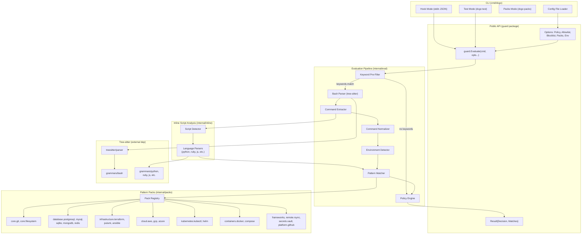
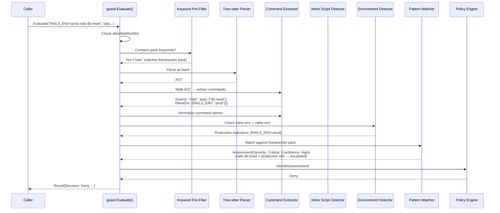
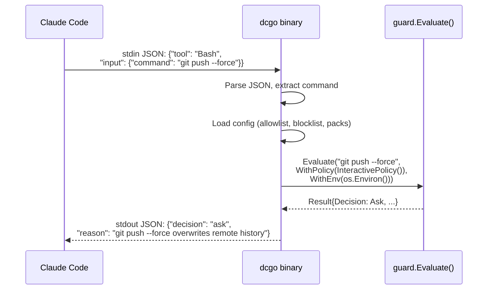
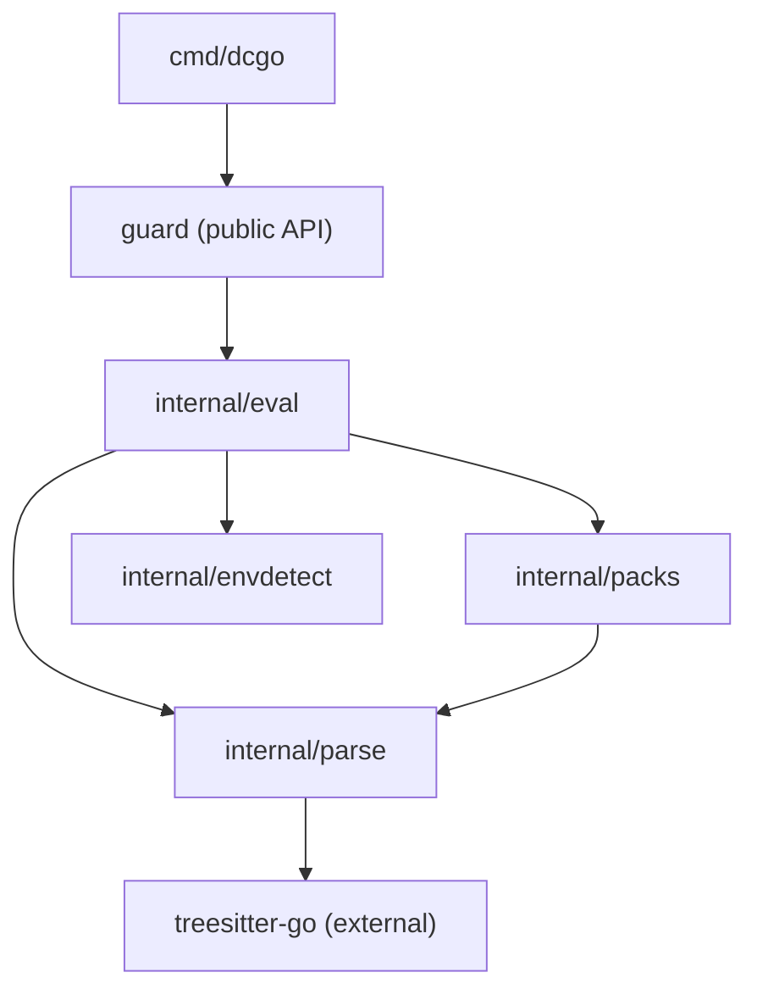

# Destructive Command Guard (Go) — Architecture

**Module**: `github.com/dcosson/destructive-command-guard-go`
**Binary**: `dcgo`
**Source**: [Shaping doc](../shaping/shaping.md) | [Frame](../shaping/frame.md)

---

## 1. System Overview

A pure-Go library and CLI that evaluates shell commands for destructive
patterns. Designed as a mistake-preventer for LLM coding agents — not a
security boundary.

**Key design principles:**

- **Library-first**: Core logic is a stateless Go package with no I/O.
  The CLI and hook modes are thin wrappers.
- **AST-first**: Tree-sitter bash parsing provides structural understanding
  of commands, eliminating the false-positive classes that plague regex-on-raw-text
  approaches.
- **Assessment ≠ Decision**: Pattern matching produces severity + confidence
  assessments. A separate policy layer converts assessments to decisions
  (Allow/Deny/Ask). Callers control their own risk tolerance.
- **Fail-open**: Parse errors, unknown constructs, and timeouts result in
  Allow, not Deny. We never block valid workflows due to analysis limitations.

### Architectural Divergence from Upstream (Rust)

The upstream Rust version uses a **regex-first** approach: it matches patterns
against the raw command string, with context sanitization to mask string
literals and reduce false positives. It uses `aho-corasick` SIMD-accelerated
matching and lazy regex compilation for sub-millisecond latency.

Our Go version uses a **tree-sitter-first** approach: we parse the command
into a full bash AST, then extract structured command invocations (command
name, arguments, flags, inline env vars) and match patterns against those
extracted fields.

**What this gives us:**

- **No context sanitization needed.** String arguments inside commands are
  structurally separated by the parser. `echo "don't rm -rf /"` parses as
  `echo` with a string argument — we never see `rm -rf` as a command.
- **Compound command awareness.** Pipelines, subshells, command substitutions,
  and `&&`/`||` chains are structurally decomposed. Each command in a pipeline
  is evaluated independently.
- **Heredoc/inline script detection is structural.** The bash AST already
  identifies heredoc bodies and string arguments to commands like `bash -c`.
  We don't need a separate trigger-detection tier.
- **Higher accuracy for flag/argument analysis.** We can distinguish
  `git push --force` from `git push --force-with-lease` structurally rather
  than with increasingly specific regex patterns.

**What we still need from the Rust approach:**

- **Command normalization.** The AST faithfully preserves `/usr/bin/git` as
  the command name. We still need to strip path prefixes to normalize
  command names for matching.
- **Keyword pre-filter.** Before spending time on tree-sitter parsing, a
  fast string-contains check on pack keywords lets us skip parsing entirely
  for harmless commands. This is our equivalent of the Rust version's
  aho-corasick quick-reject.

---

## 2. Component Diagram



---

## 3. Layer Decomposition

### Layer 0: External Dependencies

| Dependency | Purpose |
|-----------|---------|
| `github.com/treesitter-go/treesitter` | Pure-Go tree-sitter runtime |
| `github.com/treesitter-go/treesitter/grammars/bash` | Bash grammar (to be exported from tree-sitter-go) |
| `github.com/treesitter-go/treesitter/grammars/python` | Python grammar (for inline script detection) |
| (other grammars as needed) | Ruby, JS, etc. for inline script detection |

### Layer 1: Core Library (`guard` package — public API)

The top-level `guard` package is the public API surface. It exposes:

```go
package guard

// Evaluate analyzes a shell command for destructive patterns.
// Stateless, no I/O. Safe for concurrent use.
// Returns a value type — the zero value is a valid "nothing found, allow" result.
func Evaluate(command string, opts ...Option) Result

// Result contains the evaluation outcome.
type Result struct {
    Decision   Decision       // Allow, Deny, or Ask
    Assessment *Assessment    // Raw severity + confidence (nil if no match)
    Matches    []Match        // All pattern matches found
    Warnings   []Warning      // Informational warnings (parse failures, timeouts, etc.)
    Command    string         // The original command
}

// Warning indicates a non-fatal condition during evaluation.
// These are informational — they don't change the decision but enable
// observability of fail-open events for monitoring.
type Warning struct {
    Code    WarningCode
    Message string
}

type WarningCode int
const (
    WarnPartialParse WarningCode = iota  // AST contained ERROR nodes
    WarnInlineDepthExceeded              // Inline script recursion hit max depth
    WarnInputTruncated                   // Input exceeded max length
    WarnMatcherPanic                     // A CommandMatcher panicked (recovered)
)

type Decision int
const (
    Allow Decision = iota
    Deny
    Ask
)

type Assessment struct {
    Severity   Severity   // Critical, High, Medium, Low
    Confidence Confidence // High, Medium, Low
}

type Match struct {
    Pack        string   // e.g. "core.git"
    Rule        string   // e.g. "git-reset-hard"
    Severity    Severity
    Confidence  Confidence
    Reason      string   // Why this is dangerous
    Remediation string   // Suggested safe alternative
    EnvEscalated bool    // Was severity escalated due to production env?
}

type Severity int
const (
    Low Severity = iota
    Medium
    High
    Critical
)

type Confidence int
const (
    ConfidenceLow Confidence = iota
    ConfidenceMedium
    ConfidenceHigh
)

// Option configures evaluation behavior.
type Option func(*evalConfig)

func WithPolicy(p Policy) Option          // Set decision policy
func WithAllowlist(rules ...string) Option     // Allow commands matching rules
func WithBlocklist(rules ...string) Option     // Block commands matching rules
func WithPacks(packs ...string) Option     // Enable only these packs
func WithDisabledPacks(packs ...string) Option // Disable specific packs
func WithEnv(env []string) Option          // Provide process env vars for env detection

// Policy converts an Assessment into a Decision.
type Policy interface {
    Decide(Assessment) Decision
}

// Built-in policies
func StrictPolicy() Policy       // Deny on Medium+, no Ask
func InteractivePolicy() Policy  // Ask on Medium, Deny on High+
func PermissivePolicy() Policy   // Ask on High, Deny on Critical only
```

**Allowlist/Blocklist matching semantics:**

Rules are matched against the **full raw command string** using glob patterns
(not regex). `*` matches any sequence of characters. Matching is
case-sensitive.

- `"git status"` — exact match against the full command
- `"git status *"` — matches `git status` with any arguments
- `"*/bin/git *"` — matches path-prefixed git commands

**Evaluation order**: Blocklist is checked first. If a command matches a
blocklist rule, it is Denied regardless of allowlist. If a command matches
an allowlist rule (and no blocklist rule), it is Allowed without further
analysis. This means blocklist takes precedence — it is the safety backstop.

**Note on scope**: Allowlist/blocklist matching operates on the raw command
string before parsing. This is intentional — it provides a fast escape hatch
that doesn't depend on the parser. Callers who want more precise control
should use pack selection (`WithPacks`/`WithDisabledPacks`) instead.

**Note on Policy interface**: The `Decide(Assessment)` signature is
intentionally minimal — it only sees severity and confidence, not pack/rule
details. This keeps policies simple and composable. Per-pack or per-rule
overrides should be handled via allowlists/blocklists or by composing
multiple `Evaluate` calls with different pack sets.

**API versioning**: The initial release is `v0` (no stability guarantees).
The API will be promoted to `v1` after the golden file corpus confirms the
assessment/decision behavior is stable across real-world usage.

### Layer 2: Evaluation Pipeline (`internal/eval`)

Orchestrates the analysis steps. This is the core internal engine.

**Pipeline steps:**

1. **Input validation** — Reject empty/whitespace commands (Allow, no
   warnings). Truncate commands exceeding 64KB (Allow with
   `WarnInputTruncated` — commands this long are not typical LLM output).
2. **Blocklist/Allowlist check** — Check blocklist first (glob match against
   raw command string). If blocklist matches, short-circuit to Deny. Then
   check allowlist. If allowlist matches, short-circuit to Allow. Blocklist
   takes precedence.
3. **Keyword pre-filter** — Check if the command string contains any keyword
   from enabled packs. If no keywords match, return Allow (no parsing needed).
   Note: the pre-filter may have false negatives for aliased commands
   (e.g., `alias g=git; g push --force` — "git" not present). This is
   acceptable given the threat model (LLMs generate full command names).
   Keywords should be chosen to be specific enough to avoid excessive
   pass-through; keyword effectiveness is measured in the benchmark suite.
4. **Tree-sitter parse** — Parse the command string as bash. Tree-sitter
   almost always returns a tree (with error recovery), even for malformed
   input. We distinguish two cases:
   - **Full parse failure** (very rare — tree-sitter returns no tree):
     fail-open, return Allow with `WarnPartialParse`.
   - **Partial parse with ERROR nodes** (common for unusual syntax): proceed
     with best-effort extraction. The extractor extracts all `simple_command`
     nodes it can find, including those adjacent to ERROR nodes. This is not
     fail-open — it is best-effort analysis. A `WarnPartialParse` warning is
     added to the result.
4. **Command extraction** — Walk the AST to extract individual command
   invocations: `(name, args, flags, inlineEnvVars)`.
5. **Dataflow resolution** — Forward pass through the AST tracking variable
   assignments (`DIR=/`, `export RAILS_ENV=production`). Substitute known
   variable values into subsequent commands' arguments and env vars. See
   §8 Alien Artifacts for details.
6. **Normalization** — Strip path prefixes from command names
   (`/usr/bin/git` → `git`).
8. **Inline script detection** — For commands like `python -c "..."`,
   `bash -c "..."`, extract the script body and analyze it with the
   appropriate language grammar. Recursive: extracted shell commands from
   inline scripts are re-evaluated through the full pipeline (including
   further inline detection). **Max recursion depth: 3 levels.** Beyond
   this, the nested content is treated as opaque (fail-open with
   `WarnInlineDepthExceeded`). Evaluate uses `recover()` to catch panics
   from matchers or inline detection, logging and continuing with
   `WarnMatcherPanic`.
9. **Environment detection** — Check inline env vars from the AST,
   dataflow-resolved env vars, and caller-provided process env vars for
   production indicators. Detection checks specific env var names against
   specific values:
   - **Exact-value env vars**: `RAILS_ENV`, `NODE_ENV`, `FLASK_ENV`,
     `APP_ENV`, `MIX_ENV`, `RACK_ENV` checked for values `production`
     or `prod`.
   - **URL-shaped env vars**: `DATABASE_URL`, `REDIS_URL`, `MONGO_URL`,
     `ELASTICSEARCH_URL` checked for hostnames containing `prod` as a
     word boundary (not substring — `productivity.internal` does not match).
   - **Profile env vars**: `AWS_PROFILE`, `GOOGLE_CLOUD_PROJECT`,
     `AZURE_SUBSCRIPTION` checked for values containing `prod` as a
     word boundary.
   - **Severity escalation**: When production indicators are detected,
     severity is bumped by one level (Low→Medium, Medium→High, High→Critical),
     capped at Critical. The `EnvEscalated` flag is set on the match.
   - Detection rules are hardcoded in v1 but structured for easy extension.
9. **Pattern matching** — For each extracted command, check against enabled
   packs. Safe patterns are checked first (short-circuit to Allow for that
   command). Then destructive patterns are checked.
11. **Assessment aggregation** — If multiple commands in a compound statement
    match, aggregate by `(severity, confidence)` as a tuple: severity is the
    primary sort, confidence is secondary. The highest-ranked assessment
    becomes the result. This applies uniformly across all compound forms:
    - Pipelines (`cmd1 | cmd2`): both sides evaluated
    - Sequential (`;`, `&&`, `||`): all commands evaluated
    - Subshells (`(cmd)`): transparent, inner commands evaluated
    - Command substitution (`$(cmd)`, `` `cmd` ``): inner commands evaluated
    - Backgrounded (`cmd &`): evaluated (the command still runs)
    All matched patterns are collected in `Result.Matches` regardless of
    which one determines the final assessment.
12. **Policy application** — Convert the final assessment to a decision
    using the configured policy.

### Layer 3: Pattern Packs (`internal/packs`)

Each pack is a Go struct registered in a global registry:

```go
type Pack struct {
    ID          string       // e.g. "core.git"
    Name        string       // e.g. "Git"
    Description string
    Keywords    []string     // For pre-filter: ["git"]
    Safe        []SafePattern
    Destructive []DestructivePattern
}

type SafePattern struct {
    Name    string
    Match   CommandMatcher  // Structural matcher, not regex
}

type DestructivePattern struct {
    Name        string
    Match       CommandMatcher
    Severity    Severity
    Confidence  Confidence
    Reason      string
    Remediation string
    EnvSensitive bool       // Escalate severity in production?
}
```

**Key difference from upstream**: Because we extract structured commands from
the AST, our `CommandMatcher` can be a structural matcher rather than a regex.
A matcher specifies: command name, required flags/args, and optional
negative conditions (e.g., "rm -rf" but NOT if target is under /tmp).

```go
// CommandMatcher matches against extracted command invocations.
type CommandMatcher interface {
    Match(cmd ExtractedCommand) bool
}

// ExtractedCommand is a single command invocation extracted from the AST.
type ExtractedCommand struct {
    Name       string            // Normalized command name
    Args       []string          // Positional arguments
    Flags      map[string]string // Flag name → value (or "" for boolean flags)
    InlineEnv  map[string]string // Inline env var assignments
    RawText    string            // Original text span from source
    InPipeline bool              // Is this part of a pipeline?
    Negated    bool              // Preceded by ! (does not affect severity — cmd still runs)
}
```

**Flags representation**: `map[string]string` intentionally loses flag ordering
and duplicate information. Combined short flags are decomposed into separate
entries (`rm -rf` → keys `-r` and `-f`). This is acceptable because destructive
pattern matching checks for flag *presence*, not multiplicity or order. Matchers
must use exact flag name matching (not prefix) — `--force` does not match
`--force-with-lease`.

**Safe-before-destructive evaluation order**: For each extracted command, safe
patterns are checked first. If a safe pattern matches, destructive patterns for
that specific command are skipped. Other commands in the same compound statement
are still evaluated independently.

**Built-in matcher implementations** (pack authors compose from these rather
than implementing `CommandMatcher` from scratch):

- **NameMatcher**: Matches command name (exact, after normalization)
- **FlagMatcher**: Checks presence/absence of specific flags
- **ArgMatcher**: Checks positional arguments (exact, glob, or regex)
- **ArgContentMatcher**: Regex/substring match on argument values
  (for SQL patterns like `DROP TABLE` in `psql -c "..."`)
- **EnvMatcher**: Checks inline env var names/values
- **CompositeMatcher**: AND/OR/NOT composition of the above
- **NegativeMatcher**: Inverts a match (e.g., "rm -rf but NOT /tmp")

**Note on alias resolution**: The tool operates on the literal command string,
not the resolved execution path. Shell aliases (`alias g=git`) and functions
are not resolved. This is out of scope — we analyze what the LLM generates,
not what the shell resolves it to.

### Layer 4: Tree-sitter Integration (`internal/parse`)

Wraps tree-sitter-go for our specific needs:

- **Bash parsing**: Parse command strings into ASTs
- **Command extraction**: Walk bash AST to find `simple_command` nodes
- **Inline script extraction**: Detect `python -c`, `bash -c`, heredocs, etc.
  and extract the embedded script text
- **Multi-language parsing**: Parse extracted scripts with appropriate grammars

### Layer 5: CLI (`cmd/dcgo`)

Thin binary with three modes:

- **Hook mode** (default, no subcommand): Read JSON from stdin, evaluate,
  write JSON to stdout. Initially supports Claude Code protocol only.
- **Test mode** (`dcgo test "cmd"`): Evaluate a command and print the result.
  `--explain` for detailed reasoning.
- **Packs mode** (`dcgo packs`): List available packs with descriptions.
- **Config**: Optional YAML/TOML config file for allowlists, blocklists,
  pack selection.

---

## 4. Data Flow: Evaluation Pipeline



### Data Flow: Inline Script Detection

```mermaid
sequenceDiagram
    participant Extract as Command Extractor
    participant Detect as Script Detector
    participant PyParser as Python Parser
    participant Match as Pattern Matcher

    Extract->>Extract: Found: python -c "import os; os.system('rm -rf /')"
    Extract->>Detect: Detect inline script
    Detect->>Detect: Command "python" + flag "-c" → Python script
    Detect->>PyParser: Parse "import os; os.system('rm -rf /')"
    PyParser-->>Detect: Python AST
    Detect->>Detect: Extract function calls from AST
    Detect-->>Match: [{name: "os.system", args: ["rm -rf /"]}]
    Note over Match: Recursively evaluate "rm -rf /" <br/>through the main pipeline
```

### Data Flow: Hook Mode (Claude Code)



---

## 5. Package Structure

```
destructive-command-guard-go/
├── guard/                          # Layer 1: Public API
│   ├── guard.go                    #   Evaluate(), Result, Decision, types
│   ├── option.go                   #   Option funcs, evalConfig
│   ├── policy.go                   #   Policy interface, built-in policies
│   └── guard_test.go               #   Public API tests
│
├── internal/
│   ├── eval/                       # Layer 2: Evaluation pipeline
│   │   ├── pipeline.go             #   Pipeline orchestration
│   │   ├── prefilter.go            #   Keyword pre-filter
│   │   ├── pipeline_test.go
│   │   └── prefilter_test.go
│   │
│   ├── parse/                      # Layer 4: Tree-sitter integration
│   │   ├── bash.go                 #   Bash parsing + command extraction
│   │   ├── dataflow.go             #   Variable tracking + resolution (Alien Artifact)
│   │   ├── normalize.go            #   Command name normalization
│   │   ├── inline.go               #   Inline script detection
│   │   ├── command.go              #   ExtractedCommand type
│   │   ├── bash_test.go
│   │   ├── dataflow_test.go
│   │   ├── normalize_test.go
│   │   └── inline_test.go
│   │
│   ├── packs/                      # Layer 3: Pattern packs
│   │   ├── registry.go             #   Pack registry, lookup
│   │   ├── matcher.go              #   CommandMatcher interface + impls
│   │   ├── pack.go                 #   Pack, SafePattern, DestructivePattern types
│   │   ├── core/
│   │   │   ├── git.go
│   │   │   └── filesystem.go
│   │   ├── database/
│   │   │   ├── postgresql.go
│   │   │   ├── mysql.go
│   │   │   ├── sqlite.go
│   │   │   ├── mongodb.go
│   │   │   └── redis.go
│   │   ├── containers/
│   │   │   ├── docker.go
│   │   │   └── compose.go
│   │   ├── infrastructure/
│   │   │   ├── terraform.go
│   │   │   ├── pulumi.go
│   │   │   └── ansible.go
│   │   ├── cloud/
│   │   │   ├── aws.go
│   │   │   ├── gcp.go
│   │   │   └── azure.go
│   │   ├── kubernetes/
│   │   │   ├── kubectl.go
│   │   │   └── helm.go
│   │   ├── frameworks/
│   │   │   └── frameworks.go
│   │   ├── remote/
│   │   │   └── rsync.go
│   │   ├── secrets/
│   │   │   └── vault.go
│   │   ├── platform/
│   │   │   └── github.go
│   │   └── registry_test.go
│   │
│   └── envdetect/                  # Environment detection
│       ├── detect.go               #   Production indicator detection
│       └── detect_test.go
│
├── cmd/
│   └── dcgo/                       # Layer 5: CLI binary
│       ├── main.go                 #   Entry point, subcommand routing
│       ├── hook.go                 #   Hook mode (stdin JSON → stdout JSON)
│       ├── test.go                 #   Test mode (dcgo test "cmd")
│       ├── packs.go                #   Packs mode (dcgo packs)
│       └── config.go               #   Config file loading
│
├── docs/
│   ├── shaping/                    #   Shaping docs
│   └── plans/                      #   Architecture + plan docs
│
├── go.mod
└── go.sum
```

**Import flow** (strictly layered — no upward imports):



---

## 6. Key Architectural Decisions

### D1: Structural matching over regex

**Decision**: Pattern packs use `CommandMatcher` (structural matching against
extracted commands) rather than regex against raw command strings.

**Rationale**: Since we've already paid the cost of AST parsing, matching
against structured data is more accurate and easier to reason about. A
`CommandMatcher` that checks `name == "git" && hasFlag("--force")` is clearer
and less error-prone than a regex that tries to handle all the ways `--force`
could appear in a raw string.

**Trade-off**: Some patterns may still need raw-text matching for edge cases
(e.g., SQL statements passed as arguments). The `CommandMatcher` interface
allows both structural and text-based matchers.

### D2: No context sanitization

**Decision**: Omit the upstream's context sanitization pass.

**Rationale**: The upstream needs to mask string literals in the raw command
text before regex matching to avoid false positives (e.g., `echo "rm -rf /"`
would match `rm -rf` without sanitization). Our AST-first approach structurally
separates command invocations from their arguments, so string content is never
confused with command invocations. This is a direct advantage of the
tree-sitter-first architecture.

### D3: Single-pass keyword pre-filter

**Decision**: Use simple `strings.Contains` checks for keyword pre-filtering
rather than aho-corasick.

**Rationale**: With 21 packs and ~50 keywords, the pre-filter checks a small
number of short strings against the command. `strings.Contains` is fast enough
at this scale and avoids an external dependency. If benchmarks show this is a
bottleneck (unlikely), we can switch to aho-corasick later.

### D4: Fail-open on parse errors, best-effort on partial parses

**Decision**: Two distinct behaviors:

1. **Full parse failure** (tree-sitter returns no tree — extremely rare):
   return Allow with `WarnPartialParse`. This is fail-open.
2. **Partial parse with ERROR nodes** (tree-sitter's error recovery produced
   a tree with some ERROR nodes — common for unusual syntax): extract all
   `simple_command` nodes we can find and analyze them. This is **best-effort
   analysis**, not fail-open. A `WarnPartialParse` warning is included so
   callers can monitor how often this occurs.

**Rationale**: Tree-sitter almost always returns *some* tree due to its error
recovery. A pure "fail-open on parse error" policy would almost never trigger.
The real risk is ERROR nodes in otherwise-parsed trees causing the extractor
to silently skip destructive commands. Best-effort extraction mitigates this
by analyzing everything we can structurally understand.

### D5: Assessment/Policy separation

**Decision**: Pattern matching produces raw assessments (severity + confidence).
A separate policy layer converts these to decisions (Allow/Deny/Ask).

**Rationale**: Different callers have different risk tolerances. A background
agent running autonomously should use `StrictPolicy` (no Ask — uncertain means
Deny). A user-facing interactive agent should use `InteractivePolicy` (uncertain
means Ask). The library ships sensible defaults but lets callers override.

### D6: Grammars exported from tree-sitter-go

**Decision**: Have tree-sitter-go export grammar packages publicly rather
than vendoring grammar data into DCG.

**Required import paths from tree-sitter-go:**

- `github.com/treesitter-go/treesitter/grammars/bash` — language data
  (currently in `internal/testgrammars/bash/language.go`)
- `github.com/treesitter-go/treesitter/scanners/bash` — external scanner
  (already public at `scanners/bash/scanner.go`)
- Same pattern for other grammars: `grammars/python`, `scanners/python`, etc.

**Rationale**: Keeps a single source of truth for grammar data. DCG imports
the grammars as a regular Go dependency. Requires a change to tree-sitter-go
to move grammars from `internal/testgrammars/` to a public `grammars/` package.

**Fallback**: If the tree-sitter-go export is delayed, DCG can temporarily
vendor the grammar data (copy the generated language files). This unblocks
development. The vendored copy would be replaced by the proper import once
the export is available. Both repos are under the same owner so this is a
coordination issue, not a blocking dependency.

---

## 7. Cross-Cutting Concerns

### Performance

- **Benchmark suite**: Every pipeline stage benchmarked independently.
  Aggregate benchmarks for full evaluations of representative commands.
- **Pre-filter effectiveness**: Track what percentage of commands are
  rejected at the keyword stage (target: >90% of benign commands skip parsing).
- **No hard budget**: Performance should be invisible to users (LLM responses
  take seconds). Benchmark and optimize but don't enforce a strict timeout.

### Concurrency

- `guard.Evaluate()` is safe for concurrent use. No shared mutable state.
- Tree-sitter parsers are **not** safe for concurrent use. The evaluation
  pipeline uses `sync.Pool` to reuse parsers.
- **Parser pooling invariant**: The bash external scanner carries mutable
  state (heredoc tracking, glob paren depth, etc.). This state is implicitly
  reset during the first lex operation of each `Parse()` call via
  `Scanner.Deserialize(nil)`. This means pooled parsers are safe to reuse
  without explicit scanner reset. However, `Parse()` allocates a fresh
  `SubtreeArena` and `Stack` per call, so pooling saves the parser struct,
  lexer, and external scanner allocation — not the arena/stack. The pooling
  wrapper should call `parser.Reset()` defensively before returning to pool.
- **Callers needing timeout behavior** should wrap `Evaluate()` with their
  own context deadline. The library does not enforce timeouts internally
  (beyond the 64KB input length limit).

### Testing

- **Unit tests**: Every package has table-driven tests for its core logic.
- **Pack tests**: Each pack has tests for every destructive pattern AND every
  safe pattern, ensuring patterns match expected commands and don't
  false-positive on similar-but-safe commands.
- **Integration tests**: Full pipeline tests that exercise `guard.Evaluate()`
  with real commands and verify decisions.
- **Comparison tests**: Run the same commands through both the upstream Rust
  version and our Go version, compare results. Differences must be explained
  and intentional.
- **Benchmarks**: Go benchmarks for pre-filter, parsing, extraction, matching,
  and full pipeline.

### Extensibility

- Adding a new pack: Create a Go file in the appropriate `internal/packs/`
  subdirectory, register it in the registry. No other code changes needed.
- Adding a new language for inline script detection: Import the grammar from
  tree-sitter-go, add a detector entry in `internal/parse/inline.go`.

---

## 8. Alien Artifacts

### Intraprocedural Dataflow Analysis on Bash AST

Our highest-leverage advanced technique. Instead of analyzing each
`simple_command` node in isolation, we perform lightweight reaching-definitions
analysis across compound commands within a single command string.

**Problem it solves:**

```bash
# Pattern matching on isolated commands misses these:
DIR=/; rm -rf $DIR                    # Variable carries the danger
export RAILS_ENV=production && rails db:reset  # Env set in prior command
DB_HOST=prod-db.internal; psql -h $DB_HOST -c "DROP TABLE users"
```

In all three cases, the destructive operation and the dangerous context are
in separate `simple_command` nodes. Isolated extraction misses the connection.

**Technique:**

Reaching-definitions analysis is a classic dataflow analysis from compiler
theory. We implement a lightweight version scoped to a single command string
(intraprocedural — we don't analyze across separate invocations):

1. Walk the bash AST in execution order (respecting `&&`, `||`, `;`, pipes)
2. At each `variable_assignment` or `export` command, record the definition:
   `{variable_name → value, scope: local|export}`
3. At each `simple_command`, substitute known variable values into the
   extracted command's arguments and env vars
4. Feed the resolved command into pattern matching and environment detection

This is not full abstract interpretation — we don't handle control flow
(if/then/else), loops, or function definitions. We handle the linear and
`&&`/`||` cases that cover the majority of real-world LLM-generated commands
(hypothesis to be validated in Batch 5 testing).

**Scoping model (deliberate over-approximation for safety):**

- **Sequential (`;`)**: Variable definitions carry forward. Straightforward.
- **`&&` chains**: Both sides are analyzed. Variable definitions from the
  left side carry forward to the right. This is correct for the success
  path and conservative for the failure path (variable may not be set if
  left side fails, but we assume it is).
- **`||` chains**: **May-alias approach.** Both branches are analyzed. When
  a variable has different values from different branches
  (`DIR=/tmp || DIR=/`), we track all possible values and substitute each
  one independently. If *any* substitution produces a dangerous match, we
  flag it. This biases toward false positives, which is the correct
  direction for a safety tool.
- **Subshells (`(cmd)`)**: Flattened — we treat subshell variable assignments
  as visible to the parent scope. In real bash, `(export FOO=bar); cmd`
  does NOT propagate `FOO`. Our over-approximation may produce false
  positives but never false negatives for this case.
- **Pipelines (`cmd1 | cmd2`)**: Flattened — variable assignments from any
  pipeline stage are visible to subsequent stages. In real bash, each
  pipeline stage is a subshell (except with `lastpipe`). Same conservative
  over-approximation rationale.

**Error bias**: The dataflow analysis is biased toward **false positives**
(flagging commands that may not actually be dangerous) rather than false
negatives (missing dangerous commands). For a safety tool, this is the
correct trade-off.

**Complexity**: O(n) in the number of AST nodes — a single forward pass. No
fixpoint iteration needed because bash command strings are acyclic (no loops
in the common case). The may-alias branching is bounded by the number of
`||` branches (typically 1-2).

**Where it lives**: `internal/parse` as part of command extraction. The
extractor already walks the AST; dataflow tracking is an additional accumulator
carried through the walk.

---

## 9. Unreasonably Robust Programming (URP)

### Mutation Testing on Pattern Packs

Every condition in every `CommandMatcher` must be load-bearing. We build an
automated mutation testing harness that:

1. For each destructive pattern, systematically mutates one condition at a time
   (remove a flag check, change the command name, relax an argument constraint)
2. Reruns the pack's test suite after each mutation
3. Verifies that at least one test fails for every mutation

If a mutation doesn't cause a test failure, either the condition is redundant
(remove it) or the test suite has a gap (add a test). This guarantees our test
suite exercises every dimension of every pattern.

**Measurement**: Mutation kill rate per pack. Target: 100%.

### Golden File Corpus

A version-controlled corpus of ~500+ real-world commands with expected
evaluation results (decision, matched pack, severity). Every CI run verifies
the corpus. Any behavior change on a golden file must be explicitly
acknowledged in the diff — no silent regressions.

The corpus includes:

- All pack pattern examples (both destructive and safe variants)
- Edge cases: unusual flag ordering, quoted arguments, path-prefixed binaries
- Compound commands: pipelines, `&&` chains, subshells
- Inline scripts: `python -c`, `bash -c`, heredocs
- False-positive traps: commands that look dangerous but aren't
- Dataflow cases: variable assignments feeding into destructive commands

**Measurement**: Corpus size and coverage of pack patterns. Every pattern must
have at least 3 golden file entries (1 match, 1 near-miss, 1 safe variant).

### Fuzz Testing

Fuzz the full evaluation pipeline with randomly generated inputs:

- Random bash-like strings (valid and invalid syntax)
- Mutations of known commands (swap flags, change arguments)
- Extremely long inputs, empty inputs, unicode edge cases

**Invariants verified under fuzzing**:

1. Never panics (always returns a valid Result)
2. Parse errors → Allow (fail-open)
3. Empty/whitespace commands → Allow
4. Result.Decision is always one of {Allow, Deny, Ask}
5. If Result.Assessment is nil, Result.Decision is Allow
6. If Result.Matches is non-empty, Result.Assessment is non-nil

**Measurement**: Fuzz corpus size, time-to-first-crash (target: never).

### Comparison Testing Against Upstream

Run the same command corpus through both the Rust upstream and our Go version.
Produce a diff report categorizing every difference as:

- **Intentional improvement** (we catch something the Rust version misses, or
  we correctly allow something it false-positives on)
- **Intentional divergence** (different design choice, documented)
- **Bug** (we miss something the Rust version catches — fix it)

**Measurement**: Comparison pass rate. Unexplained divergences = 0.

### Grammar-Derived Coverage Analysis

Use the tree-sitter bash grammar's node types to enumerate the structural
contexts a command can appear in (simple_command, pipeline, subshell,
command_substitution, if_statement body, for loop body, etc.). Verify our
command extractor handles all of them.

For each pack's command names, generate synthetic commands in every structural
context and verify extraction + matching works. This catches extractor blind
spots like "we handle pipelines but not subshells in arithmetic expansion."

**Measurement**: Structural context coverage per pack. Target: 100% of
bash grammar command-bearing node types.

---

## 10. Extreme Optimization

After analysis, we conclude that extreme optimization (SIMD, assembly, GPU
offload) is **not applicable** to this workload in a meaningful way.

The inputs are short strings (typically < 1KB), processed one at a time, at
the frequency of LLM tool invocations (seconds between calls). The dominant
cost is tree-sitter parsing, which is already well-optimized. The keyword
pre-filter operates on ~50 short strings against a short command —
`strings.Contains` completes in nanoseconds at this scale.

Engineering SIMD or assembly for this workload would be optimization theater —
impressive-looking work that produces no measurable user-facing improvement.

**What we do instead**: Focus optimization effort on what matters:

- **Parser pooling**: Pool parsers with `sync.Pool`. Saves parser struct,
  lexer, and external scanner allocation per call. See §7 Concurrency for
  the scanner reset invariant details.
- **Pre-filter effectiveness**: Ensure >90% of benign commands skip parsing
  entirely. This is the highest-leverage optimization — avoiding work entirely.
- **Lazy pack initialization**: Packs are registered at init time but their
  matchers are only compiled on first use.
- **Benchmark-driven**: All optimizations are validated by benchmarks. No
  speculative optimization.

---

## 11. Fit Check: Architecture × Requirements

| Req | Requirement | Arch Coverage |
|-----|-------------|---------------|
| R0 | Assessment/policy separation | D5: Assessment/Policy separation, Policy interface |
| R1 | Pure Go, no cgo | tree-sitter-go is pure Go, all deps are pure Go |
| R2 | Public Go API | Layer 1: `guard` package with `Evaluate()` |
| R3 | Tree-sitter structural analysis | Layer 4: `internal/parse`, D1: structural matching |
| R4 | Cover destructive command categories | Layer 3: 21 packs across all categories |
| R5 | Benchmarked performance | Cross-cutting: benchmark suite |
| R6 | Standalone hook binary | Layer 5: `cmd/dcgo` hook mode |
| R7 | Other agent protocols | Not in v1 — library is protocol-agnostic, easy to add |
| R8 | Allowlists/blocklists | `WithAllowlist`/`WithBlocklist` options |
| R9 | Config file | Layer 5: `cmd/dcgo/config.go` |
| R10 | CLI test/packs commands | Layer 5: test mode, packs mode |
| R11 | Environment awareness | `internal/envdetect`, `WithEnv` option |

---

## Review Disposition

Incorporated feedback from: `00-architecture-review-security-architect.md`,
`00-architecture-review-systems-engineer.md`.

| Finding | Reviewer | Severity | Summary | Disposition | Notes |
|---------|----------|----------|---------|-------------|-------|
| SA-P0.1 | security-architect | P0 | Fail-open on partial parses — tree-sitter returns partial trees with ERROR nodes, not full failures | Incorporated | D4 rewritten to distinguish full parse failure from partial parse with ERROR nodes; pipeline step 4 updated with best-effort extraction behavior |
| SA-P0.2 | security-architect | P0 | Allowlist/blocklist matching semantics undefined | Incorporated | Added full specification: glob matching against raw command string, blocklist-first precedence, scope documentation |
| SA-P1.1 | security-architect | P1 | Dataflow `\|\|` chains produce incorrect variable resolution | Incorporated | §8 updated with may-alias approach: track all possible values, flag if any substitution is dangerous |
| SA-P1.2 | security-architect | P1 | Inline script recursion depth unbounded | Incorporated | Pipeline step 8 now specifies max depth of 3, with WarnInlineDepthExceeded |
| SA-P1.3 | security-architect | P1 | Assessment aggregation underspecified for compound commands | Incorporated | Pipeline step 11 now covers all compound forms with (severity, confidence) tuple ranking |
| SA-P1.4 | security-architect | P1 | Environment detection matching rules vague | Incorporated | Pipeline step 9 now specifies exact env var names, word-boundary matching, and +1 severity escalation |
| SA-P2.1 | security-architect | P2 | CommandMatcher too minimal for safe pattern expressiveness | Incorporated | Added built-in matcher types, flag decomposition rules, safe-before-destructive order |
| SA-P2.2 | security-architect | P2 | No timeout/resource limit on parsing | Incorporated | Pipeline step 1 adds 64KB input limit; §7 documents caller timeout responsibility |
| SA-P2.3 | security-architect | P2 | Mutation testing deferred too late (Batch 5) | Incorporated | Golden file infrastructure moved to Batch 2 in plan index; mutation testing stays in Batch 5 but golden files seed from Batch 2 |
| SA-P2.4 | security-architect | P2 | Flags map loses ordering/duplicates | Incorporated | Added documentation of trade-off and flag decomposition rules |
| SA-P2.5 | security-architect | P2 | tree-sitter-go grammar export dependency risk | Incorporated | D6 updated with fallback plan (temporary vendoring) and exact import paths |
| SA-P3.1 | security-architect | P3 | No versioning strategy | Incorporated | Added v0 initial release note in API section |
| SA-P3.2 | security-architect | P3 | No alias/function resolution | Incorporated | Added scope note in CommandMatcher section |
| SA-P3.3 | security-architect | P3 | R9 inconsistency shaping vs plan index | Not Incorporated | R9 stays nice-to-have in shaping; plan index includes it because it's low-effort once the API exists. No conflict — shaping reflects priority, plan index reflects scope |
| SA-P3.4 | security-architect | P3 | Negated field unused | Incorporated | Added clarifying comment on the field |
| SE-P1.1 | systems-engineer | P1 | Evaluate() returns *Result should be Result | Incorporated | Changed to value return; documented zero-value semantics |
| SE-P1.2 | systems-engineer | P1 | Dataflow scoping under-specified | Incorporated | §8 now documents subshell/pipeline/conditional scoping with explicit over-approximation rationale |
| SE-P1.3 | systems-engineer | P1 | Batch 4 dependency gap — incomplete pack coverage | Incorporated | Plan index Batch 4 notes updated with coverage gap documentation |
| SE-P2.1 | systems-engineer | P2 | sync.Pool scanner reset invariant | Incorporated | §7 Concurrency updated with scanner reset details and defensive Reset() call |
| SE-P2.2 | systems-engineer | P2 | Module path mismatch for tree-sitter-go | Incorporated | Merged with SA-P2.5; D6 now lists exact import paths |
| SE-P2.3 | systems-engineer | P2 | CommandMatcher too narrow for SQL patterns | Incorporated | Added ArgContentMatcher to built-in matcher list |
| SE-P2.4 | systems-engineer | P2 | Pre-filter false negative risk with aliases | Incorporated | Pipeline step 3 now documents alias limitation and keyword quality guidance |
| SE-P2.5 | systems-engineer | P2 | No structured error types | Incorporated | Added Warning type and WarnPartialParse/WarnInlineDepthExceeded/etc. codes to Result |
| SE-P2.6 | systems-engineer | P2 | Plan index Batch 5 missing URP testing details | Incorporated | Batch 5 description expanded with mutation testing, golden file, grammar coverage |
| SE-P3.1 | systems-engineer | P3 | Flags map loses ordering | Incorporated | Merged with SA-P2.4 |
| SE-P3.2 | systems-engineer | P3 | Policy interface lacks context | Not Incorporated | Intentional minimalism documented in API section. Per-pack/per-rule overrides handled via allowlists or multiple Evaluate calls |
| SE-P3.3 | systems-engineer | P3 | Inline recursion depth unbounded | Incorporated | Merged with SA-P1.2 |
