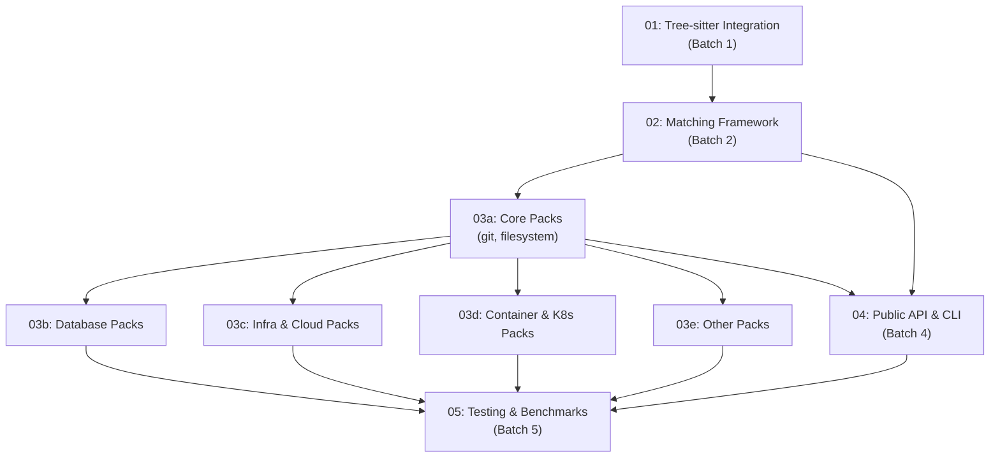

# Destructive Command Guard (Go) — Plan Index

**Architecture**: [00-architecture.md](./00-architecture.md)
**Shaping**: [../shaping/shaping.md](../shaping/shaping.md)

---

## Overview

This index organizes the implementation into 5 batches with dependency ordering.
Batch 1 establishes the foundation (parsing, extraction). Batch 2 builds the
matching framework. Batch 3 implements all 21 packs in parallel. Batch 4
assembles the public API and CLI. Batch 5 adds benchmarks, comparison tests,
and hardening.

Each sub-plan will be drafted via `/plan-draft`, reviewed via `/plan-review`,
and feedback incorporated via `/plan-incorporate` before implementation begins.

---

## Milestone Gates

| Gate | Condition | Before proceeding to |
|------|-----------|---------------------|
| G1 | tree-sitter-go exports bash grammar publicly; bash parsing + command extraction passes tests on representative commands | Batch 2 |
| G2 | Pattern matching framework works with at least 1 test pack; environment detection works; policy engine works; golden file infrastructure ready | Batch 3, Batch 4 |
| G3 | All 21 packs implemented with per-pattern unit tests and golden file entries | Batch 5 |
| G4 | Public API works end-to-end; CLI hook mode works with Claude Code protocol | Batch 5 |

---

## Batch 1: Foundation — Parsing & Extraction

| Doc | Component | Description | Depends On | Status |
|-----|-----------|-------------|-----------|--------|
| [01-treesitter-integration](./01-treesitter-integration.md) | Tree-sitter integration | Export grammars from tree-sitter-go. Bash parsing wrapper. AST command extraction (simple_command → name, args, flags, inline env vars). Command normalization (path stripping). Inline script detection (python -c, bash -c, heredocs). Multi-language parsing for extracted scripts. | — | Not started |

**Notes**: This is a single plan because the parsing, extraction, normalization,
and inline script detection are tightly coupled — they all operate on the same
AST and share types. Splitting them would create interface churn.

The tree-sitter-go grammar export is a prerequisite change in a separate repo.
This plan should include the work needed there and define the interface contract.
**Hard external dependency**: Batch 1 cannot complete without tree-sitter-go
exporting grammars from `internal/testgrammars/` to `grammars/`. Fallback:
temporarily vendor grammar data into DCG (see architecture D6).

---

## Batch 2: Matching Framework & Environment Detection

| Doc | Component | Description | Depends On | Status |
|-----|-----------|-------------|-----------|--------|
| [02-matching-framework](./02-matching-framework.md) | Pattern matching framework | Pack type definitions, CommandMatcher interface and built-in matchers, pack registry, keyword pre-filter, evaluation pipeline orchestration, policy engine (Strict/Interactive/Permissive), allowlist/blocklist matching. Also: environment detection (production indicators from inline env vars and process env). | 01 | Not started |

**Notes**: The matching framework, pre-filter, pipeline, policy, and env
detection are one plan because they form the evaluation engine that connects
parsing (Batch 1) to packs (Batch 3). Env detection is included here because
it's used by the matcher to escalate severity — it needs to be available before
packs are implemented.

A test pack (e.g., a minimal "core.git" with 2-3 patterns) should be created
as part of this plan to validate the framework end-to-end.

This batch also includes the **golden file infrastructure** — the test
framework and initial seed corpus. Packs in Batch 3 contribute golden file
entries as they are developed. This ensures regression safety from the start
rather than retrofitting it in Batch 5.

---

## Batch 3: Pattern Packs

All packs can be implemented in parallel once the matching framework is ready.
However, the first 2 packs (core.git, core.filesystem) should be implemented
first to establish the pattern, then the rest follow.

| Doc | Component | Description | Depends On | Status |
|-----|-----------|-------------|-----------|--------|
| [03a-packs-core](./03a-packs-core.md) | Core packs | core.git, core.filesystem — the most important packs and the template for all others. Includes safe patterns and destructive patterns with full test coverage. | 02 | Not started |
| [03b-packs-database](./03b-packs-database.md) | Database packs | database.postgresql, database.mysql, database.sqlite, database.mongodb, database.redis — SQL/NoSQL destructive patterns, env-sensitive severity escalation. | 02, 03a | Not started |
| [03c-packs-infra-cloud](./03c-packs-infra-cloud.md) | Infrastructure & Cloud packs | infrastructure.terraform, infrastructure.pulumi, infrastructure.ansible, cloud.aws, cloud.gcp, cloud.azure — IaC and cloud CLI destructive patterns, all env-sensitive. | 02, 03a | Not started |
| [03d-packs-containers-k8s](./03d-packs-containers-k8s.md) | Containers & Kubernetes packs | containers.docker, containers.compose, kubernetes.kubectl, kubernetes.helm — container and orchestration destructive patterns. | 02, 03a | Not started |
| [03e-packs-other](./03e-packs-other.md) | Other packs | frameworks, remote.rsync, secrets.vault, platform.github — remaining packs. | 02, 03a | Not started |

**Notes**: 03b through 03e all depend on 03a (not just 02) so they follow the
established pattern. 03b-03e can run in parallel with each other.

---

## Batch 4: Public API & CLI

| Doc | Component | Description | Depends On | Status |
|-----|-----------|-------------|-----------|--------|
| [04-api-and-cli](./04-api-and-cli.md) | Public API & CLI | `guard` package public API (Evaluate, Result, Option types). CLI binary: hook mode (Claude Code JSON protocol), test mode (dcgo test), packs mode (dcgo packs). Config file loading (YAML). Integration tests exercising full pipeline. | 02, 03a | Not started |

**Notes**: The public API and CLI are one plan because the CLI is a thin wrapper
around the API. This doesn't strictly depend on ALL packs being done (03b-03e)
— it can proceed once the framework (02) and core packs (03a) are ready. The
remaining packs can be developed in parallel with this.

**Incomplete coverage note**: The CLI and hook binary will only detect patterns
from registered packs. During Batch 4 development (before 03b-03e complete),
only core.git and core.filesystem are available. Integration tests in Batch 4
should be structured so they test with whatever packs are registered and can
be extended as more packs are added. The CLI should work with any subset of
packs (the registry pattern ensures this). Early users of the hook binary
should be aware of the coverage gap until all packs ship.

---

## Batch 5: Hardening & Validation

| Doc | Component | Description | Depends On | Status |
|-----|-----------|-------------|-----------|--------|
| [05-testing-and-benchmarks](./05-testing-and-benchmarks.md) | Testing & Benchmarks | Benchmark suite (pre-filter, parsing, extraction, matching, full pipeline). Comparison tests against upstream Rust version. Fuzz testing for parser robustness. Mutation testing harness for pattern packs. Golden file corpus expansion to 500+ commands. Grammar-derived coverage analysis. End-to-end tests with real-world command samples. Performance profiling and optimization. | 04, 03b, 03c, 03d, 03e | Not started |

---

## Dependency Graph

---

## Open Questions

1. **tree-sitter-go grammar export**: Needs to happen before Batch 1 can
   complete. Should this be a separate tracked task or part of the 01 plan?
   (Recommendation: part of 01, since it defines the interface contract.)

2. **Comparison test corpus**: Where do we get real-world commands for
   comparison testing against the upstream Rust version? Options: (a) generate
   from pack patterns, (b) collect from actual Claude Code hook invocations,
   (c) curate manually. (Recommendation: generate from patterns + curate
   edge cases.)

3. **Config file format**: YAML or TOML for the standalone binary config?
   (Recommendation: YAML — more common in the Go ecosystem for user-facing
   config.)

---

## Process

1. Sub-plans are drafted via `/plan-draft` in batch order
2. Each sub-plan gets at least 2 independent reviews via `/plan-review`
3. Review feedback is incorporated via `/plan-incorporate`
4. Implementation proceeds after incorporation, tracked via beads
5. Code reviews happen before merging implementation work
