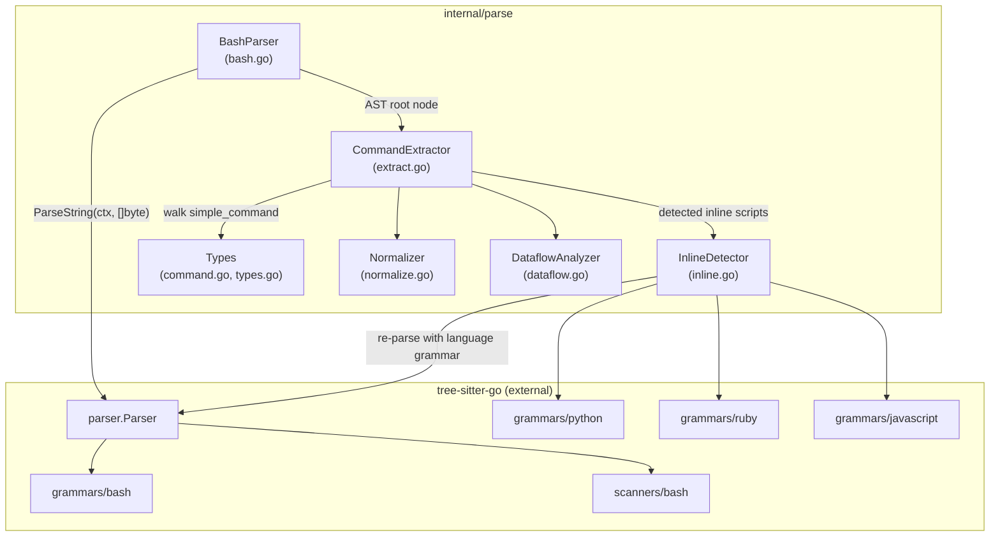
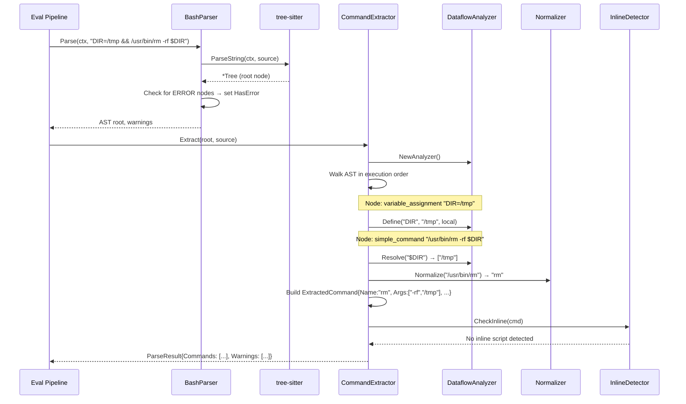

# 01: Tree-sitter Integration — Parsing & Extraction

**Batch**: 1 (Foundation)
**Depends On**: None
**Blocks**: [02-matching-framework](./02-matching-framework.md)
**Architecture**: [00-architecture.md](./00-architecture.md) (§4 Layer 4, §8 Alien Artifacts)
**Plan Index**: [00-plan-index.md](./00-plan-index.md)

---

## 1. Summary

This plan covers the entire `internal/parse` package — the foundation that
converts raw shell command strings into structured `ExtractedCommand` values
that downstream matching (Batch 2) operates on.

**Scope**:

1. **Grammar export from tree-sitter-go** — Move grammars from
   `internal/testgrammars/` to public `grammars/` in the tree-sitter-go repo
   (or vendor as fallback per D6)
2. **Bash parsing wrapper** — `sync.Pool`-backed parser that calls tree-sitter
3. **AST command extraction** — Walk bash AST to extract `simple_command` nodes
   into `ExtractedCommand` structs
4. **Command normalization** — Strip path prefixes (`/usr/bin/git` → `git`)
5. **Inline script detection** — Detect `python -c`, `bash -c`, heredocs, etc.
   and extract embedded script text
6. **Multi-language parsing** — Parse extracted scripts with appropriate
   tree-sitter grammars (Python, Ruby, JS, etc.)
7. **Dataflow analysis** — Intraprocedural reaching-definitions on bash AST
   (Alien Artifact from §8)

**Key output types** consumed by Batch 2:

```go
// ExtractedCommand is the primary output — one per simple_command in the AST
type ExtractedCommand struct {
    Name       string            // Normalized command name
    Args       []string          // Positional arguments
    Flags      map[string]string // Flag name → value (or "" for boolean flags)
    InlineEnv  map[string]string // Inline env var assignments
    RawText    string            // Original text span from source
    InPipeline bool              // Is this part of a pipeline?
    Negated    bool              // Preceded by ! (does not affect severity)
}

// ParseResult is the complete output of parsing + extraction
type ParseResult struct {
    Commands []ExtractedCommand // All extracted commands
    Warnings []Warning          // Parse warnings (ERROR nodes, etc.)
    HasError bool               // True if AST contained ERROR nodes
}
```

---

## 2. Component Diagram



---

## 3. Sequence Diagram: Parse → Extract → Resolve



---

## 4. Package Structure

```
internal/parse/
├── command.go          # ExtractedCommand, ParseResult types
├── types.go            # Warning, WarningCode types (shared with guard package)
├── bash.go             # BashParser: sync.Pool wrapper, Parse() entry point
├── extract.go          # CommandExtractor: AST walk → ExtractedCommand list
├── normalize.go        # Normalize(): path stripping, command name canonicalization
├── dataflow.go         # DataflowAnalyzer: reaching-definitions analysis
├── inline.go           # InlineDetector: script detection + multi-language parsing
├── grammars.go         # Grammar loading helpers, language registry
├── bash_test.go        # BashParser unit tests
├── extract_test.go     # CommandExtractor unit tests
├── normalize_test.go   # Normalizer unit tests
├── dataflow_test.go    # DataflowAnalyzer unit tests
├── inline_test.go      # InlineDetector unit tests
└── grammars_test.go    # Grammar loading tests
```

**Import flow** (within internal/parse, no sub-packages — flat):

All files are in `package parse`. Types in `command.go` and `types.go` are
used by all other files. `extract.go` calls into `normalize.go`, `dataflow.go`,
and `inline.go`. `inline.go` calls back into `bash.go` for recursive bash
parsing (bounded by max depth).

**External imports**:

```
github.com/treesitter-go/treesitter/parser      → parser.NewParser(), parser.Parser
github.com/treesitter-go/treesitter/grammars/bash    → bash.BashLanguage()
github.com/treesitter-go/treesitter/scanners/bash    → bashscanner.New
github.com/treesitter-go/treesitter/grammars/python  → python.PythonLanguage()
github.com/treesitter-go/treesitter/scanners/python  → pythonscanner.New
github.com/treesitter-go/treesitter/grammars/ruby    → ruby.RubyLanguage()
...etc for each supported inline language
```

---

## 5. External Dependency: Grammar Export from tree-sitter-go

### Current State

Tree-sitter-go has grammars in `internal/testgrammars/<lang>/language.go`.
These are generated files containing parse tables, lex functions, and symbol
definitions. They are `internal` and cannot be imported by external modules.

Scanners are already public at `scanners/<lang>/scanner.go`.

### Required Change

Move grammar packages from `internal/testgrammars/` to public `grammars/`:

```
tree-sitter-go/
├── grammars/
│   ├── bash/language.go       ← moved from internal/testgrammars/bash/
│   ├── python/language.go     ← moved from internal/testgrammars/python/
│   ├── ruby/language.go       ← moved from internal/testgrammars/ruby/
│   ├── javascript/language.go ← moved from internal/testgrammars/javascript/
│   └── ...
├── scanners/                  ← already public, no change needed
│   ├── bash/scanner.go
│   ├── python/scanner.go
│   └── ...
└── internal/testgrammars/     ← keep for now, update tests to import from grammars/
```

Each grammar file currently imports `github.com/treesitter-go/treesitter/internal/core`
for the `core.Symbol` type. The grammar export requires either:

- (a) Moving the `Symbol` type to a public package, or
- (b) Having the `grammars/` package re-define the symbol type locally

Option (a) is cleaner. The `internal/core` package likely just defines `Symbol`
as a uint16. A minimal public `core` or `types` package that exports `Symbol`
would unblock the grammar export with minimal API surface.

### Fallback: Temporary Vendoring (D6)

If the tree-sitter-go export is delayed, we vendor grammar data directly:

```
destructive-command-guard-go/
├── internal/
│   └── vendored_grammars/
│       ├── bash/language.go       ← copied from tree-sitter-go
│       ├── python/language.go
│       └── ...
```

The vendored copy would need import path adjustments for the `core.Symbol`
type. This is a stopgap — the proper import replaces it once available.

**Implementation task**: The grammar export is tracked as part of this plan's
implementation. The first task is to make the tree-sitter-go change, the
fallback is exercised only if that's blocked.

### Interface Contract

DCG imports grammars like:

```go
import (
    tsparser "github.com/treesitter-go/treesitter/parser"
    bashgrammar "github.com/treesitter-go/treesitter/grammars/bash"
    bashscanner "github.com/treesitter-go/treesitter/scanners/bash"
)

func newBashParser() *tsparser.Parser {
    lang := bashgrammar.BashLanguage()
    lang.NewExternalScanner = bashscanner.New
    p := tsparser.NewParser()
    p.SetLanguage(lang)
    return p
}
```

The grammar export must preserve:
- `BashLanguage() *language.Language` — returns fully populated language struct
- All symbol constants (e.g., `SymSimpleCommand`, `SymPipeline`, etc.)
- Compatible with `scanners/bash.New` as `ExternalScannerFactory`

---

## 6. Detailed Design

### 6.1 Types (`command.go`, `types.go`)

```go
package parse

// ExtractedCommand is a single command invocation extracted from the bash AST.
// Each simple_command node in the AST produces one ExtractedCommand.
type ExtractedCommand struct {
    Name       string            // Normalized command name (path-stripped)
    RawName    string            // Original command name before normalization
    Args       []string          // Positional arguments (non-flag)
    Flags      map[string]string // Flag name → value ("" for boolean flags)
    InlineEnv  map[string]string // Inline env var assignments (KEY=val prefix)
    RawText    string            // Original text span from source
    InPipeline bool              // Part of a pipeline (cmd | cmd)
    Negated    bool              // Preceded by ! operator
    // Source location for diagnostics (byte offsets into original input)
    StartByte  uint32
    EndByte    uint32
}

// ParseResult is the complete output of the parse+extract pipeline.
type ParseResult struct {
    Commands []ExtractedCommand
    Warnings []Warning
    HasError bool // True if AST contained ERROR nodes
}

// Warning indicates a non-fatal condition during parsing.
type Warning struct {
    Code    WarningCode
    Message string
}

type WarningCode int

const (
    WarnPartialParse        WarningCode = iota // AST contained ERROR nodes
    WarnInlineDepthExceeded                    // Inline script recursion hit max
    WarnInputTruncated                         // Input exceeded max length
)

// InlineScript represents an embedded script detected inside a command.
type InlineScript struct {
    Language string // "bash", "python", "ruby", "javascript", "perl"
    Body     string // The script text to parse
    Source   string // How it was detected: "flag" (-c), "heredoc", "eval"
}
```

### 6.2 BashParser (`bash.go`)

The parser is the entry point. It wraps tree-sitter with `sync.Pool` for
parser reuse across concurrent calls.

```go
package parse

import (
    "context"
    "sync"

    tsparser "github.com/treesitter-go/treesitter/parser"
    bashgrammar "github.com/treesitter-go/treesitter/grammars/bash"
    bashscanner "github.com/treesitter-go/treesitter/scanners/bash"
)

// MaxInputSize is the maximum command string length we'll parse.
// Inputs exceeding this produce an Indeterminate assessment.
const MaxInputSize = 128 * 1024 // 128KB

// BashParser parses shell command strings into tree-sitter ASTs.
// Safe for concurrent use — internally pools tree-sitter parsers.
type BashParser struct {
    pool sync.Pool
}

// NewBashParser creates a BashParser with a pre-warmed pool.
func NewBashParser() *BashParser {
    bp := &BashParser{}
    bp.pool = sync.Pool{
        New: func() any {
            return bp.newParser()
        },
    }
    return bp
}

func (bp *BashParser) newParser() *tsparser.Parser {
    lang := bashgrammar.BashLanguage()
    lang.NewExternalScanner = bashscanner.New
    p := tsparser.NewParser()
    p.SetLanguage(lang)
    return p
}

// Parse parses a shell command string and returns the AST root node.
// Returns (nil, warnings) if parsing completely fails (extremely rare with
// tree-sitter's error recovery).
//
// The caller must not retain references to tree-sitter nodes beyond the
// lifetime of the returned Tree — use Extract() to convert to ParseResult.
func (bp *BashParser) Parse(ctx context.Context, command string) (*Tree, []Warning) {
    if len(command) > MaxInputSize {
        return nil, []Warning{{
            Code:    WarnInputTruncated,
            Message: fmt.Sprintf("input size %d exceeds max %d", len(command), MaxInputSize),
        }}
    }

    p := bp.pool.Get().(*tsparser.Parser)
    defer func() {
        p.Reset() // Clear parser state before returning to pool
        bp.pool.Put(p)
    }()

    tree := p.ParseString(ctx, []byte(command))
    if tree == nil {
        return nil, []Warning{{
            Code:    WarnPartialParse,
            Message: "tree-sitter returned no tree",
        }}
    }

    var warnings []Warning
    root := tree.RootNode()
    if hasErrorNodes(root) {
        warnings = append(warnings, Warning{
            Code:    WarnPartialParse,
            Message: "AST contains ERROR nodes; extraction is best-effort",
        })
    }

    return &Tree{inner: tree, source: command}, warnings
}

// Tree wraps a tree-sitter tree with the original source for text extraction.
type Tree struct {
    inner  *tsTree   // tree-sitter Tree
    source string    // original command string
}

// hasErrorNodes does a quick DFS to check for ERROR or MISSING nodes.
func hasErrorNodes(node Node) bool {
    // Uses tree cursor for efficient traversal
    // Returns true on first ERROR/MISSING node found
    ...
}
```

**Parser pooling invariant** (from architecture §7): The bash external scanner
carries mutable state (heredoc tracking, glob paren depth). This state is
implicitly reset during the first lex operation of each `Parse()` call via
`Scanner.Deserialize(nil)`. We call `parser.Reset()` defensively before
returning to pool for additional safety.

### 6.3 Command Extraction (`extract.go`)

The extractor walks the AST in execution order and produces `ExtractedCommand`
structs. It integrates with the dataflow analyzer and inline detector.

```go
// CommandExtractor walks a bash AST and extracts structured commands.
type CommandExtractor struct {
    source   string            // Original command text
    dataflow *DataflowAnalyzer // Variable tracking
    inline   *InlineDetector   // Inline script detection
    depth    int               // Current inline recursion depth
    maxDepth int               // Max inline recursion (default: 3)
}

// Extract walks the AST and returns all extracted commands.
func (ce *CommandExtractor) Extract(tree *Tree) ParseResult {
    root := tree.inner.RootNode()
    ce.source = tree.source
    ce.dataflow = NewDataflowAnalyzer()

    var commands []ExtractedCommand
    var warnings []Warning

    ce.walkNode(root, &commands, &warnings, extractContext{})
    return ParseResult{
        Commands: commands,
        Warnings: warnings,
        HasError: hasErrorNodes(root),
    }
}
```

**AST Walk Strategy**:

The walk is a recursive descent over the bash AST. Different node types
trigger different extraction behaviors:

| Node Type | Action |
|-----------|--------|
| `program` | Walk all children |
| `list` | Walk children — these are `;`, `&&`, `||` chains |
| `pipeline` | Walk children with `InPipeline=true` |
| `simple_command` (aliased as `command` in tree-sitter bash) | **Extract**: build `ExtractedCommand` |
| `variable_assignment` | Feed to dataflow analyzer |
| `declaration_command` (`export`, `declare`, `local`, etc.) | Feed to dataflow analyzer |
| `compound_statement` (`{ ... }`) | Walk children |
| `subshell` (`( ... )`) | Walk children (flattened scoping per §8) |
| `command_substitution` (`$(...)`) | Walk children |
| `if_statement`, `while_statement`, `for_statement` | Walk body children |
| `function_definition` | Walk body (but don't resolve function calls) |
| `redirected_statement` | Walk inner command, note redirections |
| `negated_command` | Walk inner command with `Negated=true` |
| `ERROR` | Skip — best-effort, already warned |

**Extracting a `simple_command` / `command` node**:

The bash grammar's `command` node (symbol ID 208, type `"command"`) contains:

1. **Inline env vars**: Leading `variable_assignment` children
   (e.g., `RAILS_ENV=production` before the command name)
2. **Command name**: The `command_name` child (field name `"name"`)
3. **Arguments**: Remaining `word`, `string`, `raw_string`, `concatenation`,
   `expansion`, `simple_expansion` children

```go
func (ce *CommandExtractor) extractSimpleCommand(node Node, ctx extractContext) ExtractedCommand {
    cmd := ExtractedCommand{
        InPipeline: ctx.inPipeline,
        Negated:    ctx.negated,
        StartByte:  node.StartByte(),
        EndByte:    node.EndByte(),
        RawText:    ce.source[node.StartByte():node.EndByte()],
        InlineEnv:  make(map[string]string),
        Flags:      make(map[string]string),
    }

    for i := 0; i < int(node.NamedChildCount()); i++ {
        child := node.NamedChild(i)
        switch child.Type() {
        case "variable_assignment":
            name, value := ce.extractAssignment(child)
            cmd.InlineEnv[name] = value
        case "command_name":
            cmd.RawName = ce.nodeText(child)
            cmd.Name = Normalize(cmd.RawName)
        default:
            // Argument or flag
            text := ce.resolveNodeText(child) // Applies dataflow substitution
            ce.classifyArg(text, &cmd)
        }
    }

    return cmd
}
```

**Argument classification** — distinguishing flags from positional args:

```go
func (ce *CommandExtractor) classifyArg(text string, cmd *ExtractedCommand) {
    if strings.HasPrefix(text, "--") {
        // Long flag: --force, --force=value
        if idx := strings.IndexByte(text, '='); idx >= 0 {
            cmd.Flags[text[:idx]] = text[idx+1:]
        } else {
            cmd.Flags[text] = ""
        }
    } else if strings.HasPrefix(text, "-") && len(text) > 1 && text[1] != '-' {
        // Short flag(s): -f, -rf (decompose combined short flags)
        // -rf → {"-r": "", "-f": ""}
        for _, c := range text[1:] {
            cmd.Flags["-"+string(c)] = ""
        }
    } else {
        cmd.Args = append(cmd.Args, text)
    }
}
```

**Combined short flag decomposition**: `rm -rf` becomes `{"-r": "", "-f": ""}`.
This matches the architecture spec (§Layer 3) — matchers check flag presence,
not multiplicity or order.

**Edge case — flags with values**: `-o output.txt` is ambiguous (is `output.txt`
the value of `-o` or a positional arg?). We do NOT attempt to resolve this
ambiguity — each command's flag-value association depends on that specific
command's argument grammar, which we don't have. Instead, short flags are always
treated as boolean, and the next token is a separate positional arg. Long flags
with `=` are parsed as key=value. This is sufficient for destructive pattern
matching, which checks flag presence, not values.

### 6.4 Command Normalization (`normalize.go`)

```go
// Normalize strips path prefixes from command names.
//   /usr/bin/git     → git
//   /usr/local/bin/rm → rm
//   ./script.sh      → script.sh
//   git              → git (no change)
func Normalize(name string) string {
    if idx := strings.LastIndexByte(name, '/'); idx >= 0 {
        return name[idx+1:]
    }
    return name
}
```

Normalization is intentionally minimal — just path stripping. We do not
resolve aliases, functions, or symlinks (out of scope per architecture).

Additional normalization for specific commands can be added later if needed
(e.g., `python3` → `python` normalization for inline script detection), but
for v1 we match exact names.

### 6.5 Dataflow Analysis (`dataflow.go`) — Alien Artifact

Reaching-definitions analysis scoped to a single command string. See
architecture §8 for the full theoretical background.

```go
// DataflowAnalyzer tracks variable definitions and resolves references.
// Implements lightweight intraprocedural reaching-definitions analysis.
type DataflowAnalyzer struct {
    // defs maps variable name → set of possible values.
    // Multiple values arise from || branches (may-alias).
    defs map[string][]string
    // exports tracks which variables were exported.
    exports map[string]bool
}

func NewDataflowAnalyzer() *DataflowAnalyzer {
    return &DataflowAnalyzer{
        defs:    make(map[string][]string),
        exports: make(map[string]bool),
    }
}

// Define records a variable assignment.
func (da *DataflowAnalyzer) Define(name, value string, exported bool) {
    da.defs[name] = []string{value} // Strong update: replaces previous defs
    if exported {
        da.exports[name] = true
    }
}

// MergeBranch merges definitions from an alternative branch (|| chains).
// After merge, the variable has all possible values from both branches.
func (da *DataflowAnalyzer) MergeBranch(other *DataflowAnalyzer) {
    for name, values := range other.defs {
        existing := da.defs[name]
        // Union of possible values (may-alias)
        seen := make(map[string]bool)
        for _, v := range existing {
            seen[v] = true
        }
        for _, v := range values {
            if !seen[v] {
                da.defs[name] = append(da.defs[name], v)
            }
        }
    }
}

// Resolve returns all possible values for a variable reference.
// Returns nil if the variable is unknown (not tracked).
func (da *DataflowAnalyzer) Resolve(name string) []string {
    return da.defs[name]
}

// ResolveString substitutes all $VAR and ${VAR} references in a string
// with their tracked values. Returns all possible expansions.
// If a variable has multiple possible values (from || branches),
// returns one expansion per combination.
func (da *DataflowAnalyzer) ResolveString(s string) []string {
    // Find all variable references ($VAR, ${VAR})
    // For each reference, look up possible values
    // Return cartesian product of all possible substitutions
    // Bounded: max 16 expansions to prevent combinatorial explosion
    ...
}

// ExportedVars returns all variables that were exported.
// Used by environment detection to check for production indicators.
func (da *DataflowAnalyzer) ExportedVars() map[string][]string {
    result := make(map[string][]string)
    for name := range da.exports {
        if vals := da.defs[name]; len(vals) > 0 {
            result[name] = vals
        }
    }
    return result
}
```

**Scoping model** (per architecture §8):

| Construct | Behavior |
|-----------|----------|
| Sequential (`;`) | Definitions carry forward |
| `&&` chains | Left-side defs carry to right (conservative for failure path) |
| `\|\|` chains | **May-alias**: both branches tracked, union of values |
| Subshells `(cmd)` | **Flattened**: assignments visible to parent (over-approximation) |
| Pipelines `cmd1 \| cmd2` | **Flattened**: assignments from any stage visible (over-approximation) |
| `if/while/for` | Body assignments visible after the construct (over-approximation) |

**Integration with extractor**: The extractor calls `Define()` when it
encounters `variable_assignment` and `declaration_command` nodes, and calls
`ResolveString()` when extracting argument text from subsequent commands.

```go
// In extract.go walkNode:
case "variable_assignment":
    name, value := ce.extractAssignment(node)
    ce.dataflow.Define(name, value, false)
case "declaration_command":
    // export FOO=bar, declare -x FOO=bar, local FOO=bar
    ce.extractDeclaration(node) // Calls dataflow.Define with exported=true/false
```

**Expansion limit**: `ResolveString` caps at 16 total expansions from
cartesian product of multi-valued variables. Beyond that, the unresolved
`$VAR` reference is left as-is. This prevents pathological cases like
`a=$X || a=$Y; b=$X || b=$Y; cmd $a $b` from producing 2^n expansions.

### 6.6 Inline Script Detection (`inline.go`)

Detects embedded scripts in commands and re-parses them with the appropriate
language grammar.

```go
// InlineDetector detects and extracts inline scripts from commands.
type InlineDetector struct {
    parsers    map[string]*langParser // language → parser (pooled)
    bashParser *BashParser            // For recursive bash -c detection
}

// langParser wraps a tree-sitter parser for a specific language.
type langParser struct {
    pool sync.Pool
    lang string
}

// inlineRule defines how to detect an inline script in a command.
type inlineRule struct {
    Command  string   // Command name to match
    Flags    []string // Flag(s) that introduce inline code
    Language string   // Language of the inline code
}

// Inline script detection rules.
var inlineRules = []inlineRule{
    // Shell re-entry
    {Command: "bash", Flags: []string{"-c"}, Language: "bash"},
    {Command: "sh", Flags: []string{"-c"}, Language: "bash"},
    {Command: "zsh", Flags: []string{"-c"}, Language: "bash"},

    // Python
    {Command: "python", Flags: []string{"-c"}, Language: "python"},
    {Command: "python3", Flags: []string{"-c"}, Language: "python"},

    // Ruby
    {Command: "ruby", Flags: []string{"-e"}, Language: "ruby"},

    // Perl
    {Command: "perl", Flags: []string{"-e", "-E"}, Language: "perl"},

    // JavaScript / Node
    {Command: "node", Flags: []string{"-e", "--eval"}, Language: "javascript"},

    // Lua
    {Command: "lua", Flags: []string{"-e"}, Language: "lua"},
}
```

**Detection flow**:

1. After a `simple_command` is extracted, check if the command name matches
   any `inlineRule.Command`
2. If matched, look for the trigger flag(s) in the arguments
3. The argument immediately following the trigger flag is the script body
4. Parse the script body with the appropriate language grammar
5. For `bash -c`, recursively feed through the full parse → extract pipeline
6. For other languages, walk the AST to extract function calls that could be
   shell invocations (e.g., `os.system()`, `subprocess.run()`, `` `backtick` ``)

**Heredoc detection**:

Heredocs are detected structurally from the bash AST — the grammar produces
`heredoc_redirect` and `heredoc_body` nodes. The body text is extracted and,
if the command is `bash` / `sh` / `cat | bash` etc., re-parsed as bash.

```go
func (id *InlineDetector) detectHeredocs(node Node, cmd *ExtractedCommand, source string) []InlineScript {
    // Walk siblings/parents looking for heredoc_redirect
    // Extract heredoc_body text
    // Determine if the heredoc is feeding into a shell command
    // (command is bash/sh, or piped to bash/sh)
    ...
}
```

**Multi-language AST walking for shell invocations**:

For non-bash inline scripts, we need to find shell execution calls:

| Language | Shell Execution Patterns |
|----------|------------------------|
| Python | `os.system("cmd")`, `subprocess.run(["cmd"])`, `subprocess.call(...)`, `os.popen("cmd")` |
| Ruby | `` `cmd` `` (backtick), `system("cmd")`, `exec("cmd")`, `%x{cmd}` |
| JavaScript | `child_process.exec("cmd")`, `child_process.execSync("cmd")`, `execSync("cmd")` |
| Perl | `` `cmd` `` (backtick), `system("cmd")`, `exec("cmd")`, `qx{cmd}` |

For each detected shell invocation, the string argument is extracted and
fed back through the bash parse → extract pipeline (incrementing the
recursion depth counter).

**Recursion limit**: Max depth 3 levels (per architecture). Beyond this,
a `WarnInlineDepthExceeded` warning is emitted and the nested content is
treated as opaque.

```go
const MaxInlineDepth = 3

func (id *InlineDetector) Detect(cmd ExtractedCommand, depth int) ([]ExtractedCommand, []Warning) {
    if depth >= MaxInlineDepth {
        return nil, []Warning{{
            Code:    WarnInlineDepthExceeded,
            Message: fmt.Sprintf("inline script recursion depth %d exceeds max %d", depth, MaxInlineDepth),
        }}
    }

    var scripts []InlineScript

    // Check inline rules (python -c, bash -c, etc.)
    scripts = append(scripts, id.detectFlagScripts(cmd)...)

    // Check heredocs
    // (heredocs are detected during extraction, passed in via cmd metadata)

    var allCommands []ExtractedCommand
    var allWarnings []Warning

    for _, script := range scripts {
        if script.Language == "bash" {
            // Recursive bash parsing
            result := id.bashParser.ParseAndExtract(context.Background(), script.Body, depth+1)
            allCommands = append(allCommands, result.Commands...)
            allWarnings = append(allWarnings, result.Warnings...)
        } else {
            // Language-specific shell invocation extraction
            cmds, warns := id.extractShellInvocations(script)
            allCommands = append(allCommands, cmds...)
            allWarnings = append(allWarnings, warns...)
        }
    }

    return allCommands, allWarnings
}
```

### 6.7 Grammar Loading (`grammars.go`)

Centralizes grammar initialization and language-to-grammar mapping.

```go
// LangGrammar maps a language name to its tree-sitter grammar loader.
type LangGrammar struct {
    Name           string
    NewLanguage    func() *language.Language
    NewScanner     language.ExternalScannerFactory // nil if no external scanner
}

// SupportedLanguages lists all languages available for inline script parsing.
var SupportedLanguages = []LangGrammar{
    {Name: "bash", NewLanguage: bashgrammar.BashLanguage, NewScanner: bashscanner.New},
    {Name: "python", NewLanguage: pythongrammar.PythonLanguage, NewScanner: pythonscanner.New},
    {Name: "ruby", NewLanguage: rubygrammar.RubyLanguage, NewScanner: rubyscanner.New},
    {Name: "javascript", NewLanguage: jsgrammar.JavaScriptLanguage, NewScanner: jsscanner.New},
    {Name: "perl", NewLanguage: perlgrammar.PerlLanguage, NewScanner: perlscanner.New},
    {Name: "lua", NewLanguage: luagrammar.LuaLanguage, NewScanner: luascanner.New},
}

// NewLangParser creates a pooled parser for the given language.
func NewLangParser(grammar LangGrammar) *langParser {
    lp := &langParser{lang: grammar.Name}
    lp.pool = sync.Pool{
        New: func() any {
            lang := grammar.NewLanguage()
            if grammar.NewScanner != nil {
                lang.NewExternalScanner = grammar.NewScanner
            }
            p := tsparser.NewParser()
            p.SetLanguage(lang)
            return p
        },
    }
    return lp
}
```

---

## 7. Error Handling

### Parse Failures

Tree-sitter almost always returns a tree (with error recovery). The two cases:

1. **Full failure** (nil tree): Extremely rare. Return `WarnPartialParse`.
   The eval pipeline (Batch 2) will produce an Indeterminate assessment.

2. **Partial parse with ERROR nodes**: Extract what we can. The `HasError`
   flag on `ParseResult` signals Batch 2 to produce an Indeterminate assessment
   if no destructive patterns are found in the parsed portions.

### Panics

The extractor and inline detector use `recover()` internally. A panic in
any component produces a `WarnMatcherPanic` warning rather than crashing.
This is the last line of defense — panics should be fixed, not expected.

### Node Text Extraction

When extracting text from AST nodes, we use byte offsets into the original
source string. This is safe because tree-sitter byte offsets are always
valid (they come from the same source). We validate that `StartByte() < EndByte()`
and both are within source bounds.

---

## 8. Testing Strategy

### 8.1 Unit Tests

**bash_test.go** — BashParser:
- Parse simple commands and verify tree structure
- Parse compound commands (pipelines, `&&`, `||`, `;`)
- Parse commands with string arguments (single-quoted, double-quoted)
- Parse commands with variable expansions
- Parse heredocs
- Parse invalid/malformed input — verify tree returned with ERROR nodes
- Parse empty/whitespace — verify nil or empty tree
- Parse at MaxInputSize boundary
- Concurrency test: 100 goroutines parsing simultaneously

**extract_test.go** — CommandExtractor (table-driven):

```go
tests := []struct {
    name     string
    input    string
    want     []ExtractedCommand
}{
    // Simple commands
    {"bare command", "ls", []ExtractedCommand{{Name: "ls"}}},
    {"command with args", "git push origin main", []ExtractedCommand{{
        Name: "git", Args: []string{"push", "origin", "main"},
    }}},
    {"command with flags", "rm -rf /tmp/foo", []ExtractedCommand{{
        Name: "rm", Flags: map[string]string{"-r": "", "-f": ""},
        Args: []string{"/tmp/foo"},
    }}},
    {"long flag", "git push --force", []ExtractedCommand{{
        Name: "git", Args: []string{"push"}, Flags: map[string]string{"--force": ""},
    }}},
    {"long flag with value", "git push --force-with-lease=origin/main", []ExtractedCommand{{
        Name: "git", Args: []string{"push"},
        Flags: map[string]string{"--force-with-lease": "origin/main"},
    }}},

    // Inline env vars
    {"inline env", "RAILS_ENV=production rails db:reset", []ExtractedCommand{{
        Name: "rails", Args: []string{"db:reset"},
        InlineEnv: map[string]string{"RAILS_ENV": "production"},
    }}},

    // Pipelines
    {"pipeline", "cat file | grep foo", []ExtractedCommand{
        {Name: "cat", Args: []string{"file"}, InPipeline: true},
        {Name: "grep", Args: []string{"foo"}, InPipeline: true},
    }},

    // Compound commands
    {"and chain", "cd /tmp && rm -rf foo", ...},
    {"or chain", "test -d /tmp || mkdir /tmp", ...},
    {"semicolon", "echo hello; echo world", ...},
    {"subshell", "(cd /tmp && rm -rf foo)", ...},
    {"command substitution", "echo $(git rev-parse HEAD)", ...},

    // Negation
    {"negated", "! git push --force", []ExtractedCommand{{
        Name: "git", Args: []string{"push"},
        Flags: map[string]string{"--force": ""}, Negated: true,
    }}},

    // Path-prefixed commands
    {"path prefix", "/usr/bin/git push --force", []ExtractedCommand{{
        Name: "git", RawName: "/usr/bin/git", Args: []string{"push"},
        Flags: map[string]string{"--force": ""},
    }}},

    // Quoted arguments (should be extracted as plain text)
    {"quoted args", `echo "don't rm -rf /"`, []ExtractedCommand{{
        Name: "echo", Args: []string{"don't rm -rf /"},
    }}},

    // Redirections
    {"redirect", "echo hello > /tmp/out", []ExtractedCommand{{
        Name: "echo", Args: []string{"hello"},
    }}},

    // Empty/whitespace
    {"empty", "", nil},
    {"whitespace", "   ", nil},

    // Partial parse (error recovery)
    {"malformed", "git push &&& rm -rf /", ...},  // Should extract what it can
}
```

**normalize_test.go** — Normalize():
- `/usr/bin/git` → `git`
- `/usr/local/bin/rm` → `rm`
- `./script.sh` → `script.sh`
- `git` → `git` (unchanged)
- `` (empty) → `` (empty)
- `/` → `` (edge case: bare slash)

**dataflow_test.go** — DataflowAnalyzer:
- Simple assignment + resolve: `DIR=/tmp` → Resolve("DIR") = ["/tmp"]
- Sequential override: `DIR=/tmp; DIR=/` → Resolve("DIR") = ["/"]
- Or-branch merge: `DIR=/tmp || DIR=/` → Resolve("DIR") = ["/tmp", "/"]
- String resolution: `DIR=/; rm -rf $DIR` → ResolveString("$DIR") = ["/"]
- Multiple variables: `A=1; B=2; echo $A $B` → correct substitutions
- Export tracking: `export RAILS_ENV=production` → ExportedVars has it
- Unknown variable: Resolve("UNKNOWN") = nil
- Expansion limit: >16 combinations → capped
- `${VAR}` syntax: same as `$VAR`

**inline_test.go** — InlineDetector:
- `python -c "import os; os.system('rm -rf /')"` → detects bash command
- `bash -c "rm -rf /"` → extracts `rm -rf /` as bash
- `ruby -e "system('rm -rf /')"` → detects bash command
- `node -e "require('child_process').execSync('rm -rf /')"` → detects bash
- Heredoc feeding bash: `bash <<'EOF'\nrm -rf /\nEOF` → extracts `rm -rf /`
- Recursion depth limit: nested `bash -c "bash -c \"bash -c ...\""` → warns
- No inline script: `python script.py` → no detection
- Unknown language: `exotic-lang -c "..."` → no detection

### 8.2 Integration Tests

**Full pipeline tests** in `extract_test.go`:

Test the complete `Parse → Extract` flow with representative real-world
commands:

```go
func TestFullPipeline(t *testing.T) {
    parser := NewBashParser()
    extractor := NewCommandExtractor(parser)

    tests := []struct {
        name  string
        input string
        check func(t *testing.T, result ParseResult)
    }{
        {
            name:  "git force push with env",
            input: "GIT_AUTHOR_EMAIL=foo@bar.com git push --force origin main",
            check: func(t *testing.T, r ParseResult) {
                require.Len(t, r.Commands, 1)
                assert.Equal(t, "git", r.Commands[0].Name)
                assert.Equal(t, "", r.Commands[0].Flags["--force"])
                assert.Equal(t, "foo@bar.com", r.Commands[0].InlineEnv["GIT_AUTHOR_EMAIL"])
            },
        },
        {
            name:  "dataflow variable carries danger",
            input: "DIR=/; rm -rf $DIR",
            check: func(t *testing.T, r ParseResult) {
                require.Len(t, r.Commands, 1) // Only rm, not the assignment
                assert.Equal(t, "rm", r.Commands[0].Name)
                assert.Contains(t, r.Commands[0].Args, "/")
            },
        },
        {
            name:  "inline python script",
            input: `python -c "import os; os.system('rm -rf /')"`,
            check: func(t *testing.T, r ParseResult) {
                // Should have the python command AND the extracted inner bash command
                require.GreaterOrEqual(t, len(r.Commands), 2)
                // One command is python -c "...", the other is rm -rf /
                names := []string{}
                for _, cmd := range r.Commands {
                    names = append(names, cmd.Name)
                }
                assert.Contains(t, names, "python")
                assert.Contains(t, names, "rm")
            },
        },
        {
            name:  "export propagates to env detection",
            input: "export RAILS_ENV=production && rails db:reset",
            check: func(t *testing.T, r ParseResult) {
                // rails command should have RAILS_ENV visible via dataflow
                var railsCmd *ExtractedCommand
                for i, cmd := range r.Commands {
                    if cmd.Name == "rails" {
                        railsCmd = &r.Commands[i]
                        break
                    }
                }
                require.NotNil(t, railsCmd)
                // The dataflow-resolved env vars should be available
            },
        },
    }
}
```

### 8.3 Benchmarks

```go
func BenchmarkParse(b *testing.B) {
    parser := NewBashParser()
    commands := []string{
        "git push --force origin main",
        "rm -rf /tmp/build && echo done",
        `RAILS_ENV=production rails db:reset`,
        `python -c "import os; os.system('rm -rf /')"`,
        // Long pipeline
        "cat /var/log/syslog | grep error | sort | uniq -c | sort -rn | head -20",
    }
    for _, cmd := range commands {
        b.Run(cmd[:min(30, len(cmd))], func(b *testing.B) {
            for i := 0; i < b.N; i++ {
                parser.Parse(context.Background(), cmd)
            }
        })
    }
}

func BenchmarkExtract(b *testing.B) { ... }
func BenchmarkDataflow(b *testing.B) { ... }
func BenchmarkFullPipeline(b *testing.B) { ... }
```

---

## 9. Alien Artifacts

### Intraprocedural Reaching-Definitions Analysis

Covered in §6.5 above. This is the primary Alien Artifact for this component.

**Key properties**:
- Single forward pass: O(n) in AST nodes
- May-alias on `||` branches: biased toward false positives (safety)
- Flattened scoping for subshells/pipelines: conservative over-approximation
- Expansion limit: max 16 substitution variants per `ResolveString` call
- No fixpoint iteration needed (acyclic within a command string)

### Tree-sitter Error Recovery Exploitation

We exploit tree-sitter's error recovery to extract commands from partially
malformed input. Rather than treating any ERROR node as a total parse failure,
we walk the tree and extract all `simple_command` nodes we can find, including
those adjacent to ERROR nodes. This is a deliberate choice — best-effort
extraction with a warning is more useful than failing entirely.

---

## 10. URP (Unreasonably Robust Programming)

### Panic Recovery in Every Component

Every public entry point (`Parse`, `Extract`, `Detect`) wraps its work in
`defer recover()`. A panic in tree-sitter, the extractor, or the inline
detector produces a warning rather than crashing the caller. This is defense
in depth — panics should never happen, but if they do, the system degrades
gracefully.

### Property-Based Testing

In addition to example-based tests, we use property-based testing
(via `testing/quick` or a similar library) to verify invariants:

1. **Parse never panics**: For any byte slice input, `Parse()` returns without panic
2. **Extract output is consistent**: For any AST, `Extract()` produces commands
   where every command's `RawText` is a substring of the original input
3. **Normalize is idempotent**: `Normalize(Normalize(x)) == Normalize(x)`
4. **Dataflow expansion is bounded**: `len(ResolveString(s)) <= 16` for any input

### Concurrent Safety Testing

Run 100+ goroutines simultaneously calling `Parse` and `Extract` with
different inputs. Verify no races (via `-race` flag) and no panics.

---

## 11. Extreme Optimization

Per architecture §10, extreme optimization (SIMD, assembly) is not applicable
to this workload. The inputs are short strings processed at LLM-response
frequency.

**Applicable optimizations**:

1. **Parser pooling** (`sync.Pool`): Saves parser struct allocation per call.
   The pool size naturally adapts to concurrency level.

2. **Lazy grammar initialization**: Inline language grammars (Python, Ruby,
   etc.) are only initialized when first needed. If no `python -c` commands
   are ever seen, the Python grammar is never loaded.

3. **Early termination in extraction**: If the AST is a single `simple_command`
   (the common case), skip the generic walk machinery and extract directly.

4. **String interning for command names**: Frequently seen command names
   (`git`, `rm`, `docker`, etc.) are interned to reduce allocation. Not
   critical for correctness but reduces GC pressure in high-throughput
   benchmarks.

---

## 12. Implementation Order

The implementation should proceed in this order, with tests at each step:

1. **Grammar export** (or vendoring fallback) — Unblocks everything
2. **Types** (`command.go`, `types.go`) — Shared types used by all components
3. **BashParser** (`bash.go`) — Parse strings into ASTs
4. **Normalize** (`normalize.go`) — Simple, no dependencies
5. **CommandExtractor** (`extract.go`) — Core extraction without dataflow or inline
6. **DataflowAnalyzer** (`dataflow.go`) — Integrate into extractor
7. **InlineDetector** (`inline.go`) — Integrate into extractor
8. **Grammar loading** (`grammars.go`) — Multi-language support for inline detection

Each step should have passing tests before proceeding to the next.

---

## 13. Open Questions

1. **Grammar export timeline**: Can the tree-sitter-go change land before
   DCG implementation starts? If not, we vendor and swap later.

2. **Language-specific AST walking patterns**: The patterns for extracting
   shell invocations from Python/Ruby/JS ASTs need to be specified per
   language. The inline rules table (§6.6) covers the command/flag detection,
   but the AST walking for each language's `os.system()` equivalent needs
   detailed specification during implementation.

3. **Heredoc language detection**: When is a heredoc treated as bash? Only
   when the heredoc feeds into `bash`/`sh`? Or also for `cat <<'EOF' | bash`?
   The implementation should handle both patterns.

---

## Review Disposition

(To be filled after reviews)
