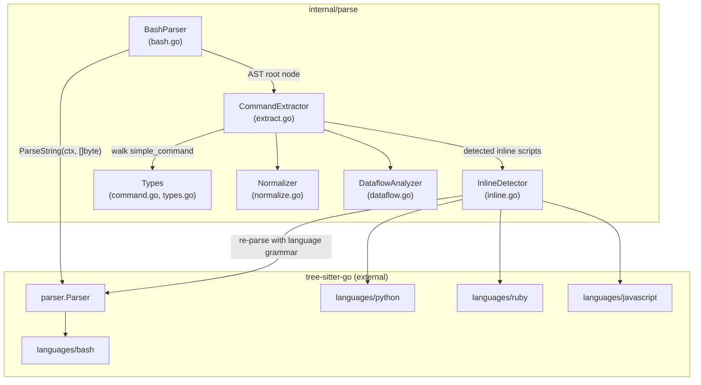
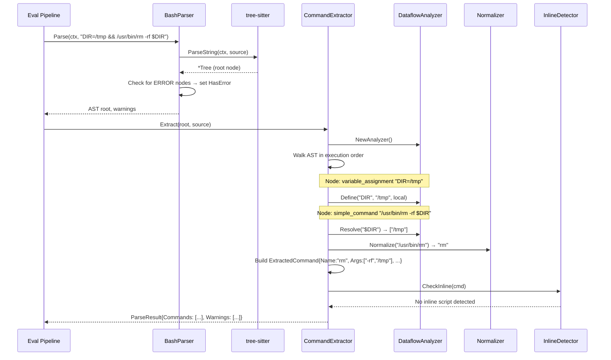

# 01: Tree-sitter Integration — Parsing & Extraction

**Batch**: 1 (Foundation)
**Depends On**: None
**Blocks**: [02-matching-framework](./02-matching-framework.md)
**Architecture**: [00-architecture.md](./00-architecture.md) (§4 Layer 4, §8 Alien Artifacts)
**Plan Index**: [00-plan-index.md](./00-plan-index.md)

---

## 1. Summary

This plan covers the entire `internal/parse` package — the foundation that
converts raw shell command strings into structured `ExtractedCommand` values
that downstream matching (Batch 2) operates on.

**Scope**:

1. **Import tree-sitter-go** — `go get github.com/dcosson/treesitter-go@v0.1.0`
   (public module with `languages/<lang>/` packages)
2. **Bash parsing wrapper** — `sync.Pool`-backed parser that calls tree-sitter
3. **AST command extraction** — Walk bash AST to extract `simple_command` nodes
   into `ExtractedCommand` structs
4. **Command normalization** — Strip path prefixes (`/usr/bin/git` → `git`)
5. **Inline script detection** — Detect `python -c`, `bash -c`, heredocs, etc.
   and extract embedded script text
6. **Multi-language parsing** — Parse extracted scripts with appropriate
   tree-sitter grammars (Python, Ruby, JS, etc.)
7. **Dataflow analysis** — Intraprocedural reaching-definitions on bash AST
   (Alien Artifact from §8)

**Key output types** consumed by Batch 2:

```go
// ExtractedCommand is the primary output — one per simple_command in the AST.
// When dataflow analysis produces multiple possible values for a variable,
// multiple ExtractedCommand variants are emitted (one per expansion), each
// with DataflowResolved=true. See §6.5 for expansion semantics.
type ExtractedCommand struct {
    Name             string            // Normalized command name
    RawName          string            // Original command name before normalization
    Args             []string          // Positional arguments (non-flag)
    RawArgs          []string          // All arguments in original order (flags + positional)
    Flags            map[string]string // Flag name → value ("" for boolean flags)
    InlineEnv        map[string]string // Inline env var assignments (KEY=val prefix)
    RawText          string            // Original text span from source
    InPipeline       bool              // Is this part of a pipeline?
    Negated          bool              // Preceded by ! (does not affect severity)
    DataflowResolved bool              // True if this command's args were resolved via dataflow
    // Source location for diagnostics (byte offsets into original input)
    StartByte        uint32
    EndByte          uint32
}

// ParseResult is the complete output of parsing + extraction.
type ParseResult struct {
    Commands     []ExtractedCommand   // All extracted commands (may include dataflow variants)
    Warnings     []guard.Warning      // Parse + extraction warnings (shared contract with plan 02)
    HasError     bool                 // True if AST contained ERROR nodes
    ExportedVars map[string][]string  // Exported variables visible to downstream env detection
}
```

---

## 2. Component Diagram



---

## 3. Sequence Diagram: Parse → Extract → Resolve



---

## 4. Package Structure

```
internal/parse/
├── command.go          # ExtractedCommand, ParseResult types
├── types.go            # Warning, WarningCode types (shared with guard package)
├── bash.go             # BashParser: sync.Pool wrapper, Parse() entry point
├── extract.go          # CommandExtractor: AST walk → ExtractedCommand list
├── normalize.go        # Normalize(): path stripping, command name canonicalization
├── dataflow.go         # DataflowAnalyzer: reaching-definitions analysis
├── inline.go           # InlineDetector: script detection + multi-language parsing
├── grammars.go         # Grammar loading helpers, language registry
├── bash_test.go        # BashParser unit tests
├── extract_test.go     # CommandExtractor unit tests
├── normalize_test.go   # Normalizer unit tests
├── dataflow_test.go    # DataflowAnalyzer unit tests
├── inline_test.go      # InlineDetector unit tests
└── grammars_test.go    # Grammar loading tests
```

**Import flow** (within internal/parse, no sub-packages — flat):

All files are in `package parse`. Types in `command.go` and `types.go` are
used by all other files. `extract.go` calls into `normalize.go`, `dataflow.go`,
and `inline.go`. `inline.go` calls back into `bash.go` for recursive bash
parsing (bounded by max depth).

**External imports**:

```
github.com/dcosson/treesitter-go                       → ts.NewParser(), ts.Language (root package)
github.com/dcosson/treesitter-go/languages/bash        → bash.Language() *ts.Language
github.com/dcosson/treesitter-go/languages/python      → python.Language() *ts.Language
github.com/dcosson/treesitter-go/languages/ruby        → ruby.Language() *ts.Language
github.com/dcosson/treesitter-go/languages/javascript  → javascript.Language() *ts.Language
github.com/dcosson/treesitter-go/languages/perl        → perl.Language() *ts.Language
github.com/dcosson/treesitter-go/languages/lua         → lua.Language() *ts.Language
```

Each `Language()` function returns a fully-configured `*ts.Language` with the
grammar tables and external scanner already wired together internally. There is
no need to separately import scanner packages or set `NewExternalScanner`.

---

## 5. External Dependency: tree-sitter-go

### Module Info

tree-sitter-go is published as a Go module at `github.com/dcosson/treesitter-go`
(v0.1.0, tagged). Install via `go get github.com/dcosson/treesitter-go@v0.1.0`.

Public language packages are at `languages/<lang>/`. Each package exports a
`Language()` function returning a fully-configured `*ts.Language` with parse
tables, lex functions, symbol definitions, and external scanner wired internally.

15 languages available: bash, python, ruby, javascript, perl, lua, golang,
rust, c, cpp, typescript, tsx, java, html, css, json.

### Interface Contract

DCG imports tree-sitter-go like:

```go
import (
    ts "github.com/dcosson/treesitter-go"
    "github.com/dcosson/treesitter-go/languages/bash"
)

func newBashParser() *ts.Parser {
    p := ts.NewParser()
    p.SetLanguage(bash.Language())
    return p
}
```

The `Language()` function returns a `*ts.Language` that encapsulates:
- Parse tables (states, transitions, symbol metadata)
- Lex functions (keyword matching, token recognition)
- External scanner (e.g., bash heredoc/glob handling) — wired internally
- All symbol constants accessible from the language object

---

## 6. Detailed Design

### 6.1 Types (`command.go`, `types.go`)

```go
package parse

// ExtractedCommand is a single command invocation extracted from the bash AST.
// Each simple_command node in the AST produces one ExtractedCommand.
// When dataflow analysis produces multiple possible values for a variable,
// multiple ExtractedCommand variants are emitted (one per expansion), each
// with DataflowResolved=true. See §6.5 for expansion semantics.
type ExtractedCommand struct {
    Name             string            // Normalized command name (path-stripped)
    RawName          string            // Original command name before normalization
    Args             []string          // Positional arguments (non-flag)
    RawArgs          []string          // All arguments in original order (flags + positional interleaved)
    Flags            map[string]string // Flag name → value ("" for boolean flags)
    InlineEnv        map[string]string // Inline env var assignments (KEY=val prefix)
    RawText          string            // Original text span from source
    InPipeline       bool              // Part of a pipeline (cmd | cmd)
    Negated          bool              // Preceded by ! operator
    DataflowResolved bool              // True if args were resolved via dataflow analysis
    // Source location for diagnostics (byte offsets into original input)
    StartByte        uint32
    EndByte          uint32
}

// ParseResult is the complete output of the parse+extract pipeline.
type ParseResult struct {
    Commands     []ExtractedCommand  // May include dataflow variants (multiple per source command)
    Warnings     []guard.Warning     // Parse + extraction warnings (shared contract with plan 02)
    HasError     bool                // True if AST contained ERROR nodes
    ExportedVars map[string][]string // Exported variables from DataflowAnalyzer.ExportedVars()
)

// Warning/WarningCode are defined in guard/types.go and imported directly.
// This is a cross-plan contract with plan 02 and avoids conversion layers.

// InlineScript represents an embedded script detected inside a command.
type InlineScript struct {
    Language string // "bash", "python", "ruby", "javascript", "perl", "lua"
    Body     string // The script text to parse
    Source   string // How it was detected: "flag" (-c), "heredoc", "eval"
}
```

### 6.2 BashParser (`bash.go`)

The parser is the entry point. It wraps tree-sitter with `sync.Pool` for
parser reuse across concurrent calls.

```go
package parse

import (
    "context"
    "fmt"
    "sync"

    ts "github.com/dcosson/treesitter-go"
    "github.com/dcosson/treesitter-go/languages/bash"
)

// MaxInputSize is the maximum command string length we'll parse.
// Inputs exceeding this produce an Indeterminate assessment.
const MaxInputSize = 128 * 1024 // 128KB

// BashParser parses shell command strings into tree-sitter ASTs.
// Safe for concurrent use — internally pools tree-sitter parsers.
type BashParser struct {
    pool sync.Pool
}

// NewBashParser creates a BashParser. The parser pool is lazily populated
// on first use (sync.Pool allocates on first Get).
func NewBashParser() *BashParser {
    bp := &BashParser{}
    bp.pool = sync.Pool{
        New: func() any {
            return bp.newParser()
        },
    }
    return bp
}

func (bp *BashParser) newParser() *ts.Parser {
    p := ts.NewParser()
    p.SetLanguage(bash.Language())
    return p
}

// Parse parses a shell command string and returns the AST.
// Returns (nil, warnings) if parsing completely fails (extremely rare with
// tree-sitter's error recovery) or if input exceeds MaxInputSize.
//
// **Tree independence invariant**: tree-sitter-go's ParseString() returns a
// Tree that owns its own data (SubtreeArena, Stack). The Tree is fully
// independent of the Parser after ParseString() returns. This has been
// verified in the tree-sitter-go source — Parse() allocates a fresh arena
// per call. Therefore it is safe to return the parser to the pool immediately.
// If this invariant changes in tree-sitter-go, the concurrent stress test S1
// will catch it.
func (bp *BashParser) Parse(ctx context.Context, command string) (*Tree, []Warning) {
    if len(command) > MaxInputSize {
        return nil, []Warning{{
            Code:    WarnInputTruncated,
            Message: fmt.Sprintf("input size %d exceeds max %d", len(command), MaxInputSize),
        }}
    }

    p := bp.pool.Get().(*parser.Parser)
    var panicked bool
    defer func() {
        if panicked {
            // Do NOT return a potentially corrupted parser to the pool.
            // Let it be garbage collected; the pool will allocate a fresh one.
            return
        }
        p.Reset() // Clear parser state before returning to pool
        bp.pool.Put(p)
    }()

    var tree *tsTree
    func() {
        defer func() {
            if r := recover(); r != nil {
                panicked = true
            }
        }()
        tree = p.ParseString(ctx, []byte(command))
    }()

    if panicked {
        return nil, []Warning{{
            Code:    WarnExtractorPanic,
            Message: "tree-sitter parser panicked; parser discarded from pool",
        }}
    }

    if tree == nil {
        return nil, []Warning{{
            Code:    WarnPartialParse,
            Message: "tree-sitter returned no tree",
        }}
    }

    // Check for ERROR nodes during parse (stored on Tree so extraction
    // doesn't need to re-walk). See SC-P1.4 / SE-01-P1.3.
    root := tree.RootNode()
    hasErr := hasErrorNodes(root)

    var warnings []Warning
    if hasErr {
        warnings = append(warnings, Warning{
            Code:    WarnPartialParse,
            Message: "AST contains ERROR nodes; extraction is best-effort",
        })
    }

    return &Tree{inner: tree, source: command, hasError: hasErr}, warnings
}

// ParseAndExtract is the primary entry point. It parses a command string
// and extracts structured commands in one call, merging all warnings.
// The depth parameter controls inline recursion (pass 0 for top-level calls).
func (bp *BashParser) ParseAndExtract(ctx context.Context, command string, depth int) ParseResult {
    tree, parseWarnings := bp.Parse(ctx, command)
    if tree == nil {
        return ParseResult{
            Warnings:     parseWarnings,
            HasError:     true,
            ExportedVars: map[string][]string{},
        }
    }
    extractor := NewCommandExtractor(bp)
    extractor.depth = depth
    result := extractor.Extract(tree)
    result.Warnings = append(parseWarnings, result.Warnings...)
    return result
}

// Tree wraps a tree-sitter tree with the original source for text extraction.
type Tree struct {
    inner    *tsTree   // tree-sitter Tree
    source   string    // original command string
    hasError bool      // true if AST contained ERROR nodes (checked once during Parse)
}

// hasErrorNodes does a quick DFS to check for ERROR or MISSING nodes.
func hasErrorNodes(node Node) bool {
    // Uses tree cursor for efficient traversal
    // Returns true on first ERROR/MISSING node found
    ...
}
```

**Parser pooling invariant** (from architecture §7): The bash external scanner
(wired internally by `bash.Language()`) carries mutable state (heredoc tracking,
glob paren depth). This state is implicitly reset during the first lex operation
of each `Parse()` call via `Scanner.Deserialize(nil)`. We call `parser.Reset()`
defensively before returning to pool for additional safety.

**Panic recovery**: If `ParseString()` panics (e.g., due to a tree-sitter
bug), the parser is NOT returned to the pool — it may be in a corrupted state.
The pool will allocate a fresh parser for the next call. This ensures a
single parser corruption doesn't poison the pool.

### 6.3 Command Extraction (`extract.go`)

The extractor walks the AST in execution order and produces `ExtractedCommand`
structs. It integrates with the dataflow analyzer and inline detector.

```go
// CommandExtractor walks a bash AST and extracts structured commands.
type CommandExtractor struct {
    source     string            // Original command text
    dataflow   *DataflowAnalyzer // Variable tracking
    inline     *InlineDetector   // Inline script detection
    bashParser *BashParser       // For recursive inline parsing
    depth      int               // Current inline recursion depth
    maxDepth   int               // Max inline recursion (default: 3)
}

// Extract walks the AST and returns all extracted commands.
// Uses the HasError flag from the Tree (set during Parse) to avoid
// redundant ERROR node scanning.
func (ce *CommandExtractor) Extract(tree *Tree) ParseResult {
    root := tree.inner.RootNode()
    ce.source = tree.source
    ce.dataflow = NewDataflowAnalyzer()

    var commands []ExtractedCommand
    var warnings []Warning

    // Wrap extraction in recover() to catch panics from any component
    func() {
        defer func() {
            if r := recover(); r != nil {
                warnings = append(warnings, Warning{
                    Code:    WarnExtractorPanic,
                    Message: fmt.Sprintf("extractor panicked: %v", r),
                })
            }
        }()
        ce.walkNode(root, &commands, &warnings, extractContext{})
    }()

    return ParseResult{
        Commands:     commands,
        Warnings:     warnings,
        HasError:     tree.hasError,          // From Parse(), no re-walk needed
        ExportedVars: ce.dataflow.ExportedVars(), // Cross-plan contract consumed by plan 02
    }
}
```

**AST Walk Strategy**:

The walk is a recursive descent over the bash AST. Different node types
trigger different extraction behaviors:

| Node Type | Action |
|-----------|--------|
| `program` | Walk all children |
| `list` | Walk children. The `list` node contains commands separated by `;`, `&&`, `||`. The operator between siblings determines dataflow semantics — see §6.5 for how the dataflow analyzer handles each operator. For safety, ALL branches of mixed `&&`/`||` chains are analyzed (may-execute union of definitions). |
| `pipeline` | Walk children with `InPipeline=true`. Dataflow: flattened (assignments visible across stages — over-approximation). |
| `command` (tree-sitter bash's name for simple_command, symbol ID 208) | **Extract**: build `ExtractedCommand`. Skip if no `command_name` child (bare assignments like `FOO=bar` without a command). |
| `variable_assignment` | Feed to dataflow analyzer |
| `declaration_command` (`export`, `declare`, `local`, etc.) | Feed to dataflow analyzer |
| `compound_statement` (`{ ... }`) | Walk children |
| `subshell` (`( ... )`) | Walk children (flattened scoping per §8 — over-approximation) |
| `command_substitution` (`$(...)`) | Walk children |
| `if_statement`, `while_statement`, `for_statement` | Walk body children. Dataflow: assignments visible after the construct (over-approximation). |
| `function_definition` | Walk body (but don't resolve function calls) |
| `redirected_statement` | Walk inner command. Also check for `heredoc_redirect` children and extract `heredoc_body` — see §6.6 Heredoc Detection. |
| `negated_command` | Walk inner command with `Negated=true` |
| `ERROR` | Skip — best-effort, already warned |

**Post-extraction filtering**: After extraction, commands with empty `Name`
(from normalization producing empty string, or from `command_name` nodes that
are ERROR/MISSING) are filtered out. They cannot match any pattern, and
keeping them would violate the property P2 invariant. If `Normalize()` returns
an empty string (e.g., input was just `/`), the original `RawName` is kept
instead.

**Transparent prefix commands**: The extractor recognizes `env` as a
transparent prefix command. When the command name is `env`, the extractor
strips leading `KEY=VALUE` pairs into `InlineEnv` and the remaining arguments
become the actual command. Example: `env RAILS_ENV=production rails db:reset`
→ extracted as `{Name: "rails", Args: ["db:reset"], InlineEnv: {"RAILS_ENV": "production"}}`.

Other prefix commands (`sudo`, `nice`, `nohup`, `time`) are documented as
**known limitations** — they are not unwrapped. `sudo rm -rf /` extracts as
`{Name: "sudo", Args: ["rm", "-rf", "/"]}`. Matchers in Batch 2 can handle
these by checking the first positional arg. This is P3 priority; if demand
arises, prefix unwrapping can be extended.

**Extracting a `simple_command` / `command` node**:

The bash grammar's `command` node (symbol ID 208, type `"command"`) contains:

1. **Inline env vars**: Leading `variable_assignment` children
   (e.g., `RAILS_ENV=production` before the command name)
2. **Command name**: The `command_name` child (field name `"name"`)
3. **Arguments**: Remaining `word`, `string`, `raw_string`, `concatenation`,
   `expansion`, `simple_expansion` children

```go
func (ce *CommandExtractor) extractSimpleCommand(node Node, ctx extractContext) *ExtractedCommand {
    cmd := ExtractedCommand{
        InPipeline: ctx.inPipeline,
        Negated:    ctx.negated,
        StartByte:  node.StartByte(),
        EndByte:    node.EndByte(),
        RawText:    ce.source[node.StartByte():node.EndByte()],
        InlineEnv:  make(map[string]string),
        Flags:      make(map[string]string),
    }

    for i := 0; i < int(node.NamedChildCount()); i++ {
        child := node.NamedChild(i)
        switch child.Type() {
        case "variable_assignment":
            name, value := ce.extractAssignment(child)
            cmd.InlineEnv[name] = value
        case "command_name":
            cmd.RawName = ce.nodeText(child)
            cmd.Name = Normalize(cmd.RawName)
            // If normalization produced empty (e.g., input "/"), keep raw name
            if cmd.Name == "" {
                cmd.Name = cmd.RawName
            }
        default:
            // Argument or flag
            text := ce.resolveNodeText(child) // Applies dataflow substitution
            cmd.RawArgs = append(cmd.RawArgs, text) // Preserve original order
            ce.classifyArg(text, &cmd)
        }
    }

    // Skip commands with no identifiable name (bare assignments, ERROR nodes)
    if cmd.Name == "" {
        return nil
    }

    return &cmd
}
```

**Argument classification** — distinguishing flags from positional args:

```go
func (ce *CommandExtractor) classifyArg(text string, cmd *ExtractedCommand) {
    if strings.HasPrefix(text, "--") {
        // Long flag: --force, --force=value
        if idx := strings.IndexByte(text, '='); idx >= 0 {
            cmd.Flags[text[:idx]] = text[idx+1:]
        } else {
            cmd.Flags[text] = ""
        }
    } else if strings.HasPrefix(text, "-") && len(text) > 1 && text[1] != '-' {
        // Short flag(s): -f, -rf (decompose combined short flags)
        // -rf → {"-r": "", "-f": ""}
        // Guard: if any byte is non-ASCII, treat as a single flag (not decomposable).
        // Real shell flags are always single ASCII characters.
        if !isASCII(text[1:]) {
            cmd.Flags[text] = ""
        } else {
            for _, c := range text[1:] {
                cmd.Flags["-"+string(c)] = ""
            }
        }
    } else {
        cmd.Args = append(cmd.Args, text)
    }
}

func isASCII(s string) bool {
    for i := 0; i < len(s); i++ {
        if s[i] > 127 {
            return false
        }
    }
    return true
}
```

**Combined short flag decomposition**: `rm -rf` becomes `{"-r": "", "-f": ""}`.
This matches the architecture spec (§Layer 3) — matchers check flag presence,
not multiplicity or order.

**Edge case — flags with values**: `-o output.txt` is ambiguous (is `output.txt`
the value of `-o` or a positional arg?). We do NOT attempt to resolve this
ambiguity — each command's flag-value association depends on that specific
command's argument grammar, which we don't have. Instead, short flags are always
treated as boolean, and the next token is a separate positional arg. Long flags
with `=` are parsed as key=value.

**`RawArgs` for flag-value association**: The `Flags` map and `Args` slice
lose positional relationships between flags and their values. For consumers
that need to correlate a flag with the argument that follows it (critically:
inline script detection, which needs to find the script body after `-c`),
the `RawArgs []string` field preserves the original argument order including
flags. The inline detector uses `RawArgs` to find the argument following
the trigger flag:

```go
// Find script body: scan RawArgs for the trigger flag, take the next element
for i, arg := range cmd.RawArgs {
    if arg == "-c" && i+1 < len(cmd.RawArgs) {
        scriptBody = cmd.RawArgs[i+1]
        break
    }
}
```

This is sufficient for destructive pattern matching, which checks flag
presence, not values. The `RawArgs` field addresses the flag-value ordering
concern without changing the `Flags` map semantics.

**Known limitation**: Short flag decomposition produces semantically incorrect
results for flags that take values (e.g., `tar -czf archive.tar.gz` decomposes
`-czf` into `{-c, -z, -f}` all boolean, losing the filename). This is
acceptable because destructive pattern matching checks flag presence, and
inline detection uses `RawArgs` for the flag-value cases it cares about.

### 6.4 Command Normalization (`normalize.go`)

```go
// Normalize strips path prefixes from command names.
//   /usr/bin/git      → git
//   /usr/local/bin/rm → rm
//   ./script.sh       → script.sh
//   git               → git (no change)
//   /                 → "" (caller should use RawName as fallback)
func Normalize(name string) string {
    if idx := strings.LastIndexByte(name, '/'); idx >= 0 {
        return name[idx+1:]
    }
    return name
}
```

Normalization is intentionally minimal — just path stripping. We do not
resolve aliases, functions, or symlinks (out of scope per architecture).

**Empty result**: `Normalize("/")` returns `""`. The caller
(`extractSimpleCommand`) falls back to `RawName` when `Normalize` returns
empty. This prevents empty command names from entering the pipeline.

Additional normalization for specific commands can be added later if needed
(e.g., `python3` → `python` normalization for inline script detection), but
for v1 we match exact names.

### 6.5 Dataflow Analysis (`dataflow.go`) — Alien Artifact

Reaching-definitions analysis scoped to a single command string. See
architecture §8 for the full theoretical background.

```go
// DataflowAnalyzer tracks variable definitions and resolves references.
// Implements lightweight intraprocedural reaching-definitions analysis.
type DataflowAnalyzer struct {
    // defs maps variable name → set of possible values.
    // Multiple values arise from && and || branches (may-alias).
    // A nil value slice means the variable is known to be defined but its
    // value is indeterminate (e.g., assigned via command substitution).
    defs map[string][]string
    // exports tracks which variables were exported.
    exports map[string]bool
}

func NewDataflowAnalyzer() *DataflowAnalyzer {
    return &DataflowAnalyzer{
        defs:    make(map[string][]string),
        exports: make(map[string]bool),
    }
}

// Define records a variable assignment.
// For sequential (`;`) execution, this replaces previous definitions (strong
// update). For `&&` and `||` chains, use MergeBranch to accumulate may-alias
// values from different branches.
func (da *DataflowAnalyzer) Define(name, value string, exported bool) {
    da.defs[name] = []string{value} // Strong update
    if exported {
        da.exports[name] = true
    }
}

// DefineIndeterminate records a variable assignment whose value is unknown
// (e.g., assigned via command substitution `$(...)` or backticks).
// The variable is tracked as defined but unresolvable. ResolveString will
// leave $VAR references to this variable unsubstituted.
func (da *DataflowAnalyzer) DefineIndeterminate(name string, exported bool) {
    da.defs[name] = nil // nil means "defined but value unknown"
    if exported {
        da.exports[name] = true
    }
}

// MergeBranch merges definitions from an alternative branch.
// Used for both `||` chains AND `&&` chains (may-alias for safety).
// After merge, the variable has all possible values from both branches.
func (da *DataflowAnalyzer) MergeBranch(other *DataflowAnalyzer) {
    for name, values := range other.defs {
        existing := da.defs[name]
        if existing == nil && da.defs[name] != nil {
            // Current is indeterminate, keep indeterminate
            continue
        }
        if values == nil {
            // Other branch is indeterminate — mark as indeterminate
            da.defs[name] = nil
            continue
        }
        // Union of possible values (may-alias)
        seen := make(map[string]bool)
        for _, v := range existing {
            seen[v] = true
        }
        for _, v := range values {
            if !seen[v] {
                da.defs[name] = append(da.defs[name], v)
            }
        }
    }
}

// Resolve returns all possible values for a variable reference.
// Returns nil if the variable is unknown (not tracked) or indeterminate
// (assigned via command substitution).
func (da *DataflowAnalyzer) Resolve(name string) []string {
    return da.defs[name]
}

// ResolveString substitutes all $VAR and ${VAR} references in a string
// with their tracked values. Returns all possible expansions plus a bool
// indicating whether the expansion cap was hit.
// If a variable has multiple possible values (from branches),
// returns one expansion per combination.
// Bounded: max 16 expansions to prevent combinatorial explosion.
// When the cap is hit, the caller should emit WarnExpansionCapped and
// treat the result as Indeterminate (the capped expansions are still
// returned, but the caller knows the analysis is incomplete).
// Variables with indeterminate values (nil slice) are left unsubstituted.
func (da *DataflowAnalyzer) ResolveString(s string) (expansions []string, capped bool) {
    // Find all variable references ($VAR, ${VAR})
    // For each reference, look up possible values
    // Variables with nil values (indeterminate) → leave $VAR literal
    // Return cartesian product of all possible substitutions
    // If product exceeds 16: set capped=true, return first 16
    ...
}

// ExportedVars returns all variables that were exported.
// Used by environment detection to check for production indicators.
func (da *DataflowAnalyzer) ExportedVars() map[string][]string {
    result := make(map[string][]string)
    for name := range da.exports {
        if vals := da.defs[name]; len(vals) > 0 {
            result[name] = vals
        }
    }
    return result
}
```

**Scoping model** (per architecture §8):

| Construct | Behavior |
|-----------|----------|
| Sequential (`;`) | **Strong update**: definitions carry forward, overwriting previous values. This is the only construct that uses strong update — it is safe because `;` guarantees sequential execution. |
| `&&` chains | **May-alias**: both sides analyzed, union of values. A `&&` chain may short-circuit at any point, so earlier values remain live. `DIR=/ && DIR=/tmp && rm -rf $DIR` resolves `$DIR` to `["/", "/tmp"]`. This biases toward false positives (safe direction). |
| `\|\|` chains | **May-alias**: both branches tracked, union of values. |
| Mixed `&&`/`\|\|` | **May-alias across all branches**: tree-sitter bash produces a `list` node with operator children. The walker treats ALL commands in the list as may-execute, regardless of operator. All definitions from all branches are unioned. This is the simplest correct over-approximation. |
| Subshells `(cmd)` | **Flattened**: assignments visible to parent (over-approximation). In real bash, subshells don't propagate. Documented intentional difference. |
| Pipelines `cmd1 \| cmd2` | **Flattened**: assignments from any stage visible (over-approximation). In real bash, each stage is a subshell. |
| `if/while/for` | Body assignments visible after the construct (over-approximation). |
| Command substitution `$(cmd)` | Variable assignments whose value is `$(...)` or `` `...` `` are tracked as **indeterminate** — the variable is known to be defined but its value is unknown. `ResolveString` leaves references to indeterminate variables unsubstituted. A `WarnCommandSubstitution` warning is emitted. |

**Integration with extractor**: The extractor calls `Define()` when it
encounters `variable_assignment` and `declaration_command` nodes, and calls
`ResolveString()` when extracting argument text from subsequent commands.

```go
// In extract.go walkNode:
case "variable_assignment":
    name, value := ce.extractAssignment(node)
    if containsCommandSubstitution(value) {
        ce.dataflow.DefineIndeterminate(name, false)
        warnings = append(warnings, Warning{
            Code:    WarnCommandSubstitution,
            Message: fmt.Sprintf("variable %s assigned via command substitution", name),
        })
    } else {
        ce.dataflow.Define(name, value, false)
    }
case "declaration_command":
    // export FOO=bar, declare -x FOO=bar, local FOO=bar
    ce.extractDeclaration(node) // Calls dataflow.Define or DefineIndeterminate
```

**For `&&` chains**: The extractor uses `MergeBranch` rather than `Define`
for each assignment in a `&&` chain. Concretely: for each `&&`-separated
segment in a `list` node, the extractor creates a branch analyzer, walks
the segment, then merges the branch back into the main analyzer. This
ensures all possible variable values across all execution paths are tracked.

**Multi-value expansion → multiple ExtractedCommands**: When
`ResolveString()` returns N > 1 expansions for an argument, the extractor
produces N `ExtractedCommand` variants — one per expansion. Each variant
has `DataflowResolved = true`. This ensures downstream matchers evaluate
every possible concrete command. Example:

```bash
DIR=/ && DIR=/tmp && rm -rf $DIR
```

Produces two `ExtractedCommand` variants:
1. `{Name: "rm", Flags: {"-r":"","-f":""}, Args: ["/"], DataflowResolved: true}`
2. `{Name: "rm", Flags: {"-r":"","-f":""}, Args: ["/tmp"], DataflowResolved: true}`

Both are passed to matchers. If either matches a destructive pattern, the
command is flagged.

**Expansion limit and Indeterminate**: `ResolveString` caps at 16 total
expansions from cartesian product of multi-valued variables. When the cap
is hit, the returned `capped` flag is `true`. The extractor emits
`WarnExpansionCapped` and the eval pipeline (Batch 2) treats the result as
Indeterminate, letting the policy decide. This prevents silent false negatives
from pathological cases like `a=$X || a=$Y; b=$X || b=$Y; cmd $a $b`.

**Known limitations**:

- `source`/`.` built-in: Cannot analyze the contents of sourced files.
  Variables set by sourced scripts are not tracked. This is inherent to
  static analysis of a command string — we don't have filesystem access.
- Command substitution values (`FILE=$(mktemp)`): Tracked as indeterminate.
  The variable is known to be defined but its value is unknown. References
  to it are left unsubstituted.

### 6.6 Inline Script Detection (`inline.go`)

Detects embedded scripts in commands and re-parses them with the appropriate
language grammar.

```go
// InlineDetector detects and extracts inline scripts from commands.
// Language parsers are lazily initialized — if no `python -c` commands are
// ever seen, the Python grammar is never loaded.
type InlineDetector struct {
    parsers    map[string]*langParser // language → parser (lazily initialized)
    mu         sync.Mutex             // Protects parsers map during lazy init
    bashParser *BashParser            // For recursive bash -c / eval detection
}

// langParser wraps a tree-sitter parser for a specific language.
type langParser struct {
    pool sync.Pool
    lang string
}

// getParser returns the parser for a language, lazily initializing it.
func (id *InlineDetector) getParser(lang string) *langParser {
    id.mu.Lock()
    defer id.mu.Unlock()
    if p, ok := id.parsers[lang]; ok {
        return p
    }
    // Find grammar in SupportedLanguages
    for _, g := range SupportedLanguages {
        if g.Name == lang {
            p := NewLangParser(g)
            id.parsers[lang] = p
            return p
        }
    }
    return nil // Unsupported language
}

// inlineRule defines how to detect an inline script in a command.
type inlineRule struct {
    Command  string   // Command name to match
    Flags    []string // Flag(s) that introduce inline code
    Language string   // Language of the inline code
}

// Inline script detection rules.
var inlineRules = []inlineRule{
    // Shell re-entry
    {Command: "bash", Flags: []string{"-c"}, Language: "bash"},
    {Command: "sh", Flags: []string{"-c"}, Language: "bash"},
    {Command: "zsh", Flags: []string{"-c"}, Language: "bash"},

    // eval built-in: all positional args concatenated form the script body
    {Command: "eval", Flags: nil, Language: "bash"},

    // Python
    {Command: "python", Flags: []string{"-c"}, Language: "python"},
    {Command: "python3", Flags: []string{"-c"}, Language: "python"},

    // Ruby
    {Command: "ruby", Flags: []string{"-e"}, Language: "ruby"},

    // Perl
    {Command: "perl", Flags: []string{"-e", "-E"}, Language: "perl"},

    // JavaScript / Node
    {Command: "node", Flags: []string{"-e", "--eval"}, Language: "javascript"},

    // Lua
    {Command: "lua", Flags: []string{"-e"}, Language: "lua"},
}

// evalRule is a special case: when Flags is nil, all positional args
// are concatenated (space-joined) to form the script body. This handles
// `eval "rm -rf /"` and `eval rm -rf /` (unquoted args are joined).
```

**`eval` handling**: The `eval` built-in executes its arguments as a shell
command. When `inlineRule.Flags` is nil, the detector treats all positional
arguments (concatenated with spaces) as the script body. This catches:

```bash
eval "rm -rf /"           # Quoted: single arg is the script
eval rm -rf /             # Unquoted: args joined → "rm -rf /"
eval "$(generate_cmd)"    # Command substitution: opaque, left unresolved
```

**Known limitations for command wrappers**:

- `xargs`: `echo / | xargs rm -rf` — the actual arguments come from stdin,
  which we can't analyze statically. `xargs` IS detected as a command, and
  `rm -rf` appears in its args, but we don't know the final arguments. This
  is a known gap; matchers in Batch 2 can handle `xargs` as a special case
  by checking its argument list for dangerous commands.
- `find -exec`: `find . -exec rm -rf {} \;` — similar to xargs, the `rm -rf`
  command IS in the argument list. Matchers can detect this pattern.
- `sudo`, `nice`, `nohup`, `time`: See §6.3 "Transparent prefix commands"
  for `env` handling; others are documented as limitations.
```

**Detection flow**:

1. After a `simple_command` is extracted, check if the command name matches
   any `inlineRule.Command`
2. If matched and `inlineRule.Flags` is non-nil:
   - Scan `cmd.RawArgs` (which preserves original argument order) for the
     trigger flag. The argument immediately following the trigger flag in
     `RawArgs` is the script body. This uses `RawArgs` instead of the
     decomposed `Flags` map because the map loses positional information.
   - Example: `python -c 'import os; os.system("rm -rf /")'` → `RawArgs`
     is `["-c", "import os; os.system(\"rm -rf /\")"]` → script body is
     the element after `-c`.
3. If matched and `inlineRule.Flags` is nil (eval rule):
   - All elements of `cmd.Args` are joined with spaces to form the script body.
4. Parse the script body with the appropriate language grammar
5. For `bash -c` and `eval`, recursively feed through `ParseAndExtract()`
6. For other languages, walk the AST to extract function calls that could be
   shell invocations (e.g., `os.system()`, `subprocess.run()`, `` `backtick` ``)

**Heredoc detection**:

Heredocs are detected structurally from the bash AST. Tree-sitter bash
represents heredocs as children of `redirected_statement`:

```
(redirected_statement
  body: (command
    name: (command_name) "bash")
  redirect: (heredoc_redirect
    (heredoc_start) "EOF")
  (heredoc_body
    (heredoc_content) "rm -rf /\n")
  (heredoc_end) "EOF")
```

The `heredoc_body` is a child of `redirected_statement`, NOT of
`heredoc_redirect`. The detection algorithm:

```go
func (id *InlineDetector) detectHeredocs(node Node, cmd *ExtractedCommand, source string) []InlineScript {
    // node is the redirected_statement
    // 1. Check if the command (body child) is a shell command (bash, sh, zsh)
    cmdName := cmd.Name
    isShellCmd := cmdName == "bash" || cmdName == "sh" || cmdName == "zsh"

    // 2. Find heredoc_body children of the redirected_statement
    for i := 0; i < int(node.NamedChildCount()); i++ {
        child := node.NamedChild(i)
        if child.Type() == "heredoc_body" {
            body := source[child.StartByte():child.EndByte()]
            if isShellCmd {
                return []InlineScript{{Language: "bash", Body: body, Source: "heredoc"}}
            }
        }
    }

    // 3. Pipeline-aware detection: check if this command's output is piped
    // to bash/sh. Handle `cat <<'EOF' | bash` pattern.
    // This is detected at the pipeline level: if the redirected_statement
    // is a pipeline child, check the NEXT pipeline sibling's command name.
    // The extractor passes pipeline context to the inline detector.
    return nil
}
```

**`cat <<'EOF' | bash` pattern**: This is detected at the pipeline level
during extraction. When the extractor walks a pipeline node, it checks whether
any `redirected_statement` child has a heredoc AND the next sibling in the
pipeline is `bash`/`sh`. If so, the heredoc body is extracted as a bash
inline script. This requires the pipeline walk to pass heredoc context forward.

**Quoted vs unquoted heredoc delimiters**: When the delimiter is quoted
(`<<'EOF'` or `<<"EOF"`), bash suppresses variable expansion in the body.
When unquoted (`<<EOF`), variables are expanded. Our handling:
- **Quoted delimiter**: Body text is taken as-is (no dataflow substitution)
- **Unquoted delimiter**: Body text is passed through `ResolveString()` for
  variable substitution before re-parsing

The delimiter quoting is determined by checking the `heredoc_start` node
for quote characters.

**Multi-language AST walking for shell invocations**:

For non-bash inline scripts, we need to find shell execution calls:

| Language | Shell Execution Patterns |
|----------|------------------------|
| Python | `os.system("cmd")`, `subprocess.run(["cmd"])`, `subprocess.call(...)`, `os.popen("cmd")` |
| Ruby | `` `cmd` `` (backtick), `system("cmd")`, `exec("cmd")`, `%x{cmd}` |
| JavaScript | `child_process.exec("cmd")`, `child_process.execSync("cmd")`, `execSync("cmd")` |
| Perl | `` `cmd` `` (backtick), `system("cmd")`, `exec("cmd")`, `qx{cmd}` |

For each detected shell invocation, the string argument is extracted and
fed back through the bash parse → extract pipeline (incrementing the
recursion depth counter).

**Recursion limit**: Max depth 3 levels (per architecture). Beyond this,
a `WarnInlineDepthExceeded` warning is emitted and the nested content is
treated as opaque.

```go
const MaxInlineDepth = 3

func (id *InlineDetector) Detect(cmd ExtractedCommand, depth int) ([]ExtractedCommand, []Warning) {
    if depth >= MaxInlineDepth {
        return nil, []Warning{{
            Code:    WarnInlineDepthExceeded,
            Message: fmt.Sprintf("inline script recursion depth %d exceeds max %d", depth, MaxInlineDepth),
        }}
    }

    var scripts []InlineScript

    // Check inline rules (python -c, bash -c, etc.)
    scripts = append(scripts, id.detectFlagScripts(cmd)...)

    // Check heredocs
    // (heredocs are detected during extraction, passed in via cmd metadata)

    var allCommands []ExtractedCommand
    var allWarnings []guard.Warning

    for _, script := range scripts {
        if script.Language == "bash" {
            // Recursive bash parsing via ParseAndExtract (merges all warnings)
            result := id.bashParser.ParseAndExtract(context.Background(), script.Body, depth+1)
            allCommands = append(allCommands, result.Commands...)
            allWarnings = append(allWarnings, result.Warnings...)
        } else {
            // Language-specific shell invocation extraction
            lp := id.getParser(script.Language) // Lazy initialization
            if lp == nil {
                continue // Unsupported language
            }
            cmds, warns := id.extractShellInvocations(lp, script)
            allCommands = append(allCommands, cmds...)
            allWarnings = append(allWarnings, warns...)
        }
    }

    return allCommands, allWarnings
}
```

### 6.7 Grammar Loading (`grammars.go`)

Centralizes grammar initialization and language-to-grammar mapping.

```go
// LangGrammar maps a language name to its tree-sitter language loader.
type LangGrammar struct {
    Name        string
    NewLanguage func() *ts.Language // Returns fully-configured language (grammar + scanner wired internally)
}

// SupportedLanguages lists all languages available for inline script parsing.
// These are NOT eagerly initialized — InlineDetector.getParser() lazily creates
// parsers on first use. If no `python -c` commands are seen, the Python grammar
// is never loaded.
//
// Each Language() function returns a *ts.Language with the external scanner
// already wired in — no separate scanner import needed.
var SupportedLanguages = []LangGrammar{
    {Name: "bash", NewLanguage: bash.Language},
    {Name: "python", NewLanguage: python.Language},
    {Name: "ruby", NewLanguage: ruby.Language},
    {Name: "javascript", NewLanguage: javascript.Language},
    {Name: "perl", NewLanguage: perl.Language},
    {Name: "lua", NewLanguage: lua.Language},
}

// NewLangParser creates a pooled parser for the given language.
func NewLangParser(grammar LangGrammar) *langParser {
    lp := &langParser{lang: grammar.Name}
    lp.pool = sync.Pool{
        New: func() any {
            p := parser.NewParser()
            p.SetLanguage(grammar.NewLanguage())
            return p
        },
    }
    return lp
}
```

---

## 7. Error Handling

### Parse Failures

Tree-sitter almost always returns a tree (with error recovery). The two cases:

1. **Full failure** (nil tree): Extremely rare. Return `WarnPartialParse`.
   The eval pipeline (Batch 2) will produce an Indeterminate assessment.

2. **Partial parse with ERROR nodes**: Extract what we can. The `HasError`
   flag on `ParseResult` signals Batch 2 to produce an Indeterminate assessment
   if no destructive patterns are found in the parsed portions.

### Panics

The parser, extractor, and inline detector each use `recover()` internally:

- **Parser panic**: Produces `WarnExtractorPanic`, parser discarded from pool
  (not returned — may be corrupted). See §6.2.
- **Extractor/inline detector panic**: Produces `WarnExtractorPanic`. Partial
  results extracted before the panic are preserved.

`WarnMatcherPanic` is reserved for Batch 2 (pattern matcher panics).
These are the last line of defense — panics should be fixed, not expected.

### Node Text Extraction

When extracting text from AST nodes, we use byte offsets into the original
source string. This is safe because tree-sitter byte offsets are always
valid (they come from the same source). We validate that `StartByte() < EndByte()`
and both are within source bounds.

### Tree-sitter API Coupling

The `Tree` struct wraps tree-sitter's `*Tree` and `Extract()` directly
accesses tree-sitter `Node` types through `tree.inner`. This is intentional —
both files are in the same `parse` package, and adding an abstraction layer
over tree-sitter's node access would add overhead with no benefit. If
tree-sitter-go changes its API, both `bash.go` and `extract.go` need
updating, but this is bounded to a single package.

---

## 8. Testing Strategy

### 8.1 Unit Tests

**bash_test.go** — BashParser:
- Parse simple commands and verify tree structure
- Parse compound commands (pipelines, `&&`, `||`, `;`)
- Parse commands with string arguments (single-quoted, double-quoted)
- Parse commands with variable expansions
- Parse heredocs
- Parse invalid/malformed input — verify tree returned with ERROR nodes
- Parse empty/whitespace — verify nil or empty tree
- Parse at MaxInputSize boundary
- Concurrency test: 100 goroutines parsing simultaneously

**extract_test.go** — CommandExtractor (table-driven):

```go
tests := []struct {
    name     string
    input    string
    want     []ExtractedCommand
}{
    // Simple commands
    {"bare command", "ls", []ExtractedCommand{{Name: "ls"}}},
    {"command with args", "git push origin main", []ExtractedCommand{{
        Name: "git", Args: []string{"push", "origin", "main"},
    }}},
    {"command with flags", "rm -rf /tmp/foo", []ExtractedCommand{{
        Name: "rm", Flags: map[string]string{"-r": "", "-f": ""},
        Args: []string{"/tmp/foo"},
    }}},
    {"long flag", "git push --force", []ExtractedCommand{{
        Name: "git", Args: []string{"push"}, Flags: map[string]string{"--force": ""},
    }}},
    {"long flag with value", "git push --force-with-lease=origin/main", []ExtractedCommand{{
        Name: "git", Args: []string{"push"},
        Flags: map[string]string{"--force-with-lease": "origin/main"},
    }}},

    // Inline env vars
    {"inline env", "RAILS_ENV=production rails db:reset", []ExtractedCommand{{
        Name: "rails", Args: []string{"db:reset"},
        InlineEnv: map[string]string{"RAILS_ENV": "production"},
    }}},

    // Pipelines
    {"pipeline", "cat file | grep foo", []ExtractedCommand{
        {Name: "cat", Args: []string{"file"}, InPipeline: true},
        {Name: "grep", Args: []string{"foo"}, InPipeline: true},
    }},

    // Compound commands
    {"and chain", "cd /tmp && rm -rf foo", ...},
    {"or chain", "test -d /tmp || mkdir /tmp", ...},
    {"semicolon", "echo hello; echo world", ...},
    {"subshell", "(cd /tmp && rm -rf foo)", ...},
    {"command substitution", "echo $(git rev-parse HEAD)", ...},

    // Negation
    {"negated", "! git push --force", []ExtractedCommand{{
        Name: "git", Args: []string{"push"},
        Flags: map[string]string{"--force": ""}, Negated: true,
    }}},

    // Path-prefixed commands
    {"path prefix", "/usr/bin/git push --force", []ExtractedCommand{{
        Name: "git", RawName: "/usr/bin/git", Args: []string{"push"},
        Flags: map[string]string{"--force": ""},
    }}},

    // Quoted arguments (should be extracted as plain text)
    {"quoted args", `echo "don't rm -rf /"`, []ExtractedCommand{{
        Name: "echo", Args: []string{"don't rm -rf /"},
    }}},

    // Redirections
    {"redirect", "echo hello > /tmp/out", []ExtractedCommand{{
        Name: "echo", Args: []string{"hello"},
    }}},

    // Empty/whitespace
    {"empty", "", nil},
    {"whitespace", "   ", nil},

    // Partial parse (error recovery)
    {"malformed", "git push &&& rm -rf /", ...},  // Should extract what it can
}
```

**normalize_test.go** — Normalize():
- `/usr/bin/git` → `git`
- `/usr/local/bin/rm` → `rm`
- `./script.sh` → `script.sh`
- `git` → `git` (unchanged)
- `` (empty) → `` (empty)
- `/` → `` (edge case: bare slash)

**dataflow_test.go** — DataflowAnalyzer:
- Simple assignment + resolve: `DIR=/tmp` → Resolve("DIR") = ["/tmp"]
- Sequential override: `DIR=/tmp; DIR=/` → Resolve("DIR") = ["/"]
- Or-branch merge: `DIR=/tmp || DIR=/` → Resolve("DIR") = ["/tmp", "/"]
- String resolution: `DIR=/; rm -rf $DIR` → ResolveString("$DIR") = ["/"]
- Multiple variables: `A=1; B=2; echo $A $B` → correct substitutions
- Export tracking: `export RAILS_ENV=production` → ExportedVars has it
- Unknown variable: Resolve("UNKNOWN") = nil
- Expansion limit: >16 combinations → capped
- `${VAR}` syntax: same as `$VAR`

**inline_test.go** — InlineDetector:
- `python -c "import os; os.system('rm -rf /')"` → detects bash command
- `bash -c "rm -rf /"` → extracts `rm -rf /` as bash
- `ruby -e "system('rm -rf /')"` → detects bash command
- `node -e "require('child_process').execSync('rm -rf /')"` → detects bash
- Heredoc feeding bash: `bash <<'EOF'\nrm -rf /\nEOF` → extracts `rm -rf /`
- Recursion depth limit: nested `bash -c "bash -c \"bash -c ...\""` → warns
- No inline script: `python script.py` → no detection
- Unknown language: `exotic-lang -c "..."` → no detection

### 8.2 Integration Tests

**Full pipeline tests** in `extract_test.go`:

Test the complete `Parse → Extract` flow with representative real-world
commands:

```go
func TestFullPipeline(t *testing.T) {
    parser := NewBashParser()
    extractor := NewCommandExtractor(parser)

    tests := []struct {
        name  string
        input string
        check func(t *testing.T, result ParseResult)
    }{
        {
            name:  "git force push with env",
            input: "GIT_AUTHOR_EMAIL=foo@bar.com git push --force origin main",
            check: func(t *testing.T, r ParseResult) {
                require.Len(t, r.Commands, 1)
                assert.Equal(t, "git", r.Commands[0].Name)
                assert.Equal(t, "", r.Commands[0].Flags["--force"])
                assert.Equal(t, "foo@bar.com", r.Commands[0].InlineEnv["GIT_AUTHOR_EMAIL"])
            },
        },
        {
            name:  "dataflow variable carries danger",
            input: "DIR=/; rm -rf $DIR",
            check: func(t *testing.T, r ParseResult) {
                require.Len(t, r.Commands, 1) // Only rm, not the assignment
                assert.Equal(t, "rm", r.Commands[0].Name)
                assert.Contains(t, r.Commands[0].Args, "/")
            },
        },
        {
            name:  "inline python script",
            input: `python -c "import os; os.system('rm -rf /')"`,
            check: func(t *testing.T, r ParseResult) {
                // Should have the python command AND the extracted inner bash command
                require.GreaterOrEqual(t, len(r.Commands), 2)
                // One command is python -c "...", the other is rm -rf /
                names := []string{}
                for _, cmd := range r.Commands {
                    names = append(names, cmd.Name)
                }
                assert.Contains(t, names, "python")
                assert.Contains(t, names, "rm")
            },
        },
        {
            name:  "export propagates to env detection",
            input: "export RAILS_ENV=production && rails db:reset",
            check: func(t *testing.T, r ParseResult) {
                // rails command should have RAILS_ENV visible via dataflow
                var railsCmd *ExtractedCommand
                for i, cmd := range r.Commands {
                    if cmd.Name == "rails" {
                        railsCmd = &r.Commands[i]
                        break
                    }
                }
                require.NotNil(t, railsCmd)
                // The dataflow-resolved env vars should be available
            },
        },
    }
}
```

### 8.3 Benchmarks

```go
func BenchmarkParse(b *testing.B) {
    parser := NewBashParser()
    commands := []string{
        "git push --force origin main",
        "rm -rf /tmp/build && echo done",
        `RAILS_ENV=production rails db:reset`,
        `python -c "import os; os.system('rm -rf /')"`,
        // Long pipeline
        "cat /var/log/syslog | grep error | sort | uniq -c | sort -rn | head -20",
    }
    for _, cmd := range commands {
        b.Run(cmd[:min(30, len(cmd))], func(b *testing.B) {
            for i := 0; i < b.N; i++ {
                parser.Parse(context.Background(), cmd)
            }
        })
    }
}

func BenchmarkExtract(b *testing.B) { ... }
func BenchmarkDataflow(b *testing.B) { ... }
func BenchmarkFullPipeline(b *testing.B) { ... }
```

---

## 9. Alien Artifacts

### Intraprocedural Reaching-Definitions Analysis

Covered in §6.5 above. This is the primary Alien Artifact for this component.

**Key properties**:
- Single forward pass: O(n) in AST nodes
- May-alias on `&&` and `||` branches: biased toward false positives (safety)
- Strong update only for `;` (guaranteed sequential execution)
- Flattened scoping for subshells/pipelines: conservative over-approximation
- Command substitution values tracked as indeterminate (not falsely resolved)
- Expansion limit: max 16 substitution variants per `ResolveString` call;
  exceeding the cap produces `WarnExpansionCapped` → Indeterminate assessment
- No fixpoint iteration needed (acyclic within a command string)

### Tree-sitter Error Recovery Exploitation

We exploit tree-sitter's error recovery to extract commands from partially
malformed input. Rather than treating any ERROR node as a total parse failure,
we walk the tree and extract all `simple_command` nodes we can find, including
those adjacent to ERROR nodes. This is a deliberate choice — best-effort
extraction with a warning is more useful than failing entirely.

---

## 10. URP (Unreasonably Robust Programming)

### Panic Recovery in Every Component

Every public entry point (`Parse`, `Extract`, `Detect`) wraps its work in
`defer recover()`. A panic in tree-sitter, the extractor, or the inline
detector produces a warning rather than crashing the caller. This is defense
in depth — panics should never happen, but if they do, the system degrades
gracefully.

### Property-Based Testing

In addition to example-based tests, we use property-based testing
(via `testing/quick` or a similar library) to verify invariants:

1. **Parse never panics**: For any byte slice input, `Parse()` returns without panic
2. **Extract output is consistent**: For any AST, `Extract()` produces commands
   where every command's `RawText` is a substring of the original input
3. **Normalize is idempotent**: `Normalize(Normalize(x)) == Normalize(x)`
4. **Dataflow expansion is bounded**: `len(ResolveString(s)) <= 16` for any input

### Concurrent Safety Testing

Run 100+ goroutines simultaneously calling `Parse` and `Extract` with
different inputs. Verify no races (via `-race` flag) and no panics.

---

## 11. Extreme Optimization

Per architecture §10, extreme optimization (SIMD, assembly) is not applicable
to this workload. The inputs are short strings processed at LLM-response
frequency.

**Applicable optimizations**:

1. **Parser pooling** (`sync.Pool`): Saves parser struct allocation per call.
   The pool size naturally adapts to concurrency level.

2. **Lazy grammar initialization**: Inline language grammars (Python, Ruby,
   etc.) are only initialized when first needed. If no `python -c` commands
   are ever seen, the Python grammar is never loaded.

3. **Early termination in extraction**: If the AST is a single `simple_command`
   (the common case), skip the generic walk machinery and extract directly.

4. **String interning for command names**: Frequently seen command names
   (`git`, `rm`, `docker`, etc.) are interned to reduce allocation. Not
   critical for correctness but reduces GC pressure in high-throughput
   benchmarks.

---

## 12. Implementation Order

The implementation should proceed in this order, with tests at each step:

1. **Types** (`command.go`, `types.go`) — Shared types used by all components
2. **BashParser** (`bash.go`) — Parse strings into ASTs, with `ParseAndExtract()`.
   Imports `languages/bash` directly — no grammar export or vendoring needed.
3. **Normalize** (`normalize.go`) — Simple, no dependencies
4. **CommandExtractor** (`extract.go`) — Core extraction WITH a minimal dataflow
   stub (sequential `Define` + `Resolve` for `;` chains). Include empty-name
   filtering, `RawArgs` population, `env` prefix unwrapping. This avoids having
   to refactor the walker when integrating dataflow in step 5.
5. **DataflowAnalyzer** (`dataflow.go`) — Extend the stub from step 4 with
   `&&`/`||` may-alias handling, `MergeBranch`, expansion cap + warning,
   `DefineIndeterminate` for command substitution. Multi-value expansion
   producing multiple `ExtractedCommand` variants.
6. **InlineDetector** (`inline.go`) — `eval`, flag-based detection using
   `RawArgs`, heredoc detection with pipeline awareness.
7. **Grammar loading** (`grammars.go`) — Lazy multi-language parser initialization.
   Uses `languages/<lang>.Language()` functions — each returns a fully-configured
   `*ts.Language` with scanner wired internally.

Each step should have passing tests before proceeding to the next.

---

## 13. Open Questions

1. ~~**Grammar export timeline**~~: **Resolved** — tree-sitter-go is published
   at `github.com/dcosson/treesitter-go` v0.1.0 with public `languages/<lang>/`
   packages. Install via `go get`. No vendoring or local linking needed.

2. **Language-specific AST walking patterns**: The patterns for extracting
   shell invocations from Python/Ruby/JS ASTs need to be specified per
   language. The inline rules table (§6.6) covers the command/flag detection,
   but the AST walking for each language's `os.system()` equivalent needs
   detailed specification during implementation.

3. ~~**Heredoc language detection**~~: **Resolved** — heredocs are treated as
   bash when: (a) the command owning the heredoc is `bash`/`sh`/`zsh`, OR
   (b) the heredoc is in a pipeline where the next sibling command is
   `bash`/`sh`/`zsh` (handles `cat <<'EOF' | bash`). See §6.6 Heredoc Detection.

---

## Round 1 Review Disposition

Incorporated feedback from: `01-treesitter-integration-review-security-correctness.md`,
`01-treesitter-integration-review-systems-engineer.md`.

| Finding | Reviewer | Severity | Summary | Disposition | Notes |
|---------|----------|----------|---------|-------------|-------|
| SC-P0.1 | security-correctness | P0 | `&&` chain strong updates create false negatives | Incorporated | §6.5 scoping model rewritten: `&&` now uses may-alias (union of values), only `;` uses strong update |
| SC-P0.2 | security-correctness | P0 | Inline detection loses flag-value ordering after classifyArg | Incorporated | Added `RawArgs []string` to ExtractedCommand; inline detector uses RawArgs to find script body after trigger flag (§6.3, §6.6) |
| SC-P1.1 | security-correctness | P1 | ResolveString expansion cap silently drops dangerous values | Incorporated | `ResolveString` now returns `(expansions, capped bool)`; extractor emits `WarnExpansionCapped`; eval pipeline treats as Indeterminate |
| SC-P1.2 | security-correctness | P1 | `eval` command not in inline rules | Incorporated | Added `eval` to inlineRules with nil Flags (all args concatenated as script body). Documented xargs/find-exec as known limitations |
| SC-P1.3 | security-correctness | P1 | Heredoc detection algorithm unspecified | Incorporated | §6.6 now specifies full algorithm: AST traversal from redirected_statement, pipeline-aware detection, quoted vs unquoted delimiter handling |
| SC-P1.4 | security-correctness | P1 | Redundant hasErrorNodes walk | Incorporated | Merged with SE-01-P1.3. ERROR detection moved to Parse(), stored on Tree.hasError; Extract() reads from Tree, no re-walk |
| SC-P2.1 | security-correctness | P2 | Short flag decomposition semantically incorrect for flags with values | Incorporated | Documented as known limitation in §6.3; inline detection uses RawArgs (not Flags map) for flag-value cases |
| SC-P2.2 | security-correctness | P2 | Command substitution in variable assignments stored literally | Incorporated | Added `DefineIndeterminate()` — variables assigned via `$(...)` tracked as defined-but-unknown; `WarnCommandSubstitution` emitted |
| SC-P2.3 | security-correctness | P2 | Subshell/pipeline flattening lacks test coverage | Incorporated | Added to test harness: explicit pipeline scoping cases, false-positive rate check for common patterns |
| SC-P2.4 | security-correctness | P2 | Panicking parser returned to pool | Incorporated | Parse() now has recover(); panicked parser is NOT returned to pool (discarded for GC) |
| SC-P2.5 | security-correctness | P2 | WarnMatcherPanic in parse package; need separate code | Incorporated | Added `WarnExtractorPanic` and `WarnCommandSubstitution`; `WarnMatcherPanic` reserved for Batch 2 |
| SC-P2.6 | security-correctness | P2 | Property P2 (`Name != ""`) may be violated by ERROR recovery | Incorporated | extractSimpleCommand now returns nil (skips) when command_name is missing; Normalize("") fallback to RawName |
| SC-P3.1 | security-correctness | P3 | `env`, `sudo`, `nice` not handled as transparent prefixes | Incorporated | `env` handled as transparent prefix in §6.3; `sudo`/`nice`/`nohup`/`time` documented as known limitations |
| SC-P3.2 | security-correctness | P3 | `source`/`.` built-in not acknowledged | Incorporated | Documented as known limitation in §6.5 |
| SC-P3.3 | security-correctness | P3 | Insufficient negative tests for inline detection | Incorporated | Added to test harness E3 |
| SC-P3.4 | security-correctness | P3 | `Normalize("/")` returns empty string | Incorporated | extractSimpleCommand falls back to RawName when Normalize returns empty; §6.4 documents the edge case |
| SE-01-P0.1 | systems-engineer | P0 | Parser pool tree lifetime / use-after-free risk | Incorporated | §6.2 now documents tree independence invariant with verification reference; if invariant breaks, S1 stress test catches it |
| SE-01-P0.2 | systems-engineer | P0 | Multi-valued resolution → ExtractedCommand mapping unspecified | Incorporated | §6.5 now specifies: N expansions → N ExtractedCommand variants with DataflowResolved=true; example shown |
| SE-01-P1.1 | systems-engineer | P1 | Short flag decomposition incorrect for flags with values | Incorporated | Merged with SC-P0.2; RawArgs solves flag-value association for inline detection |
| SE-01-P1.2 | systems-engineer | P1 | Combined short flag decomposition unsafe for multi-byte runes | Incorporated | Added isASCII guard in classifyArg; non-ASCII args treated as single flag |
| SE-01-P1.3 | systems-engineer | P1 | hasErrorNodes DFS called twice | Incorporated | Merged with SC-P1.4; single check during Parse(), stored on Tree |
| SE-01-P1.4 | systems-engineer | P1 | Mixed `&&`/`||` chain semantics over-simplified | Incorporated | Merged with SC-P0.1; scoping table now covers mixed chains with may-execute union of all branches |
| SE-01-P1.5 | systems-engineer | P1 | `eval`, `xargs`, `find -exec`, `env` not handled | Incorporated | `eval` added to inline rules; `env` handled as transparent prefix; `xargs`/`find -exec` documented as known limitations with guidance for Batch 2 matchers |
| SE-01-P2.1 | systems-engineer | P2 | sync.Pool pre-warming claim vs reality | Incorporated | Removed "pre-warmed" claim; documented lazy population |
| SE-01-P2.2 | systems-engineer | P2 | Tree wrapper leaks tree-sitter types into API | Not Incorporated | Intentional — same package, adding abstraction would add overhead with no benefit. Documented as design choice in §7 |
| SE-01-P2.3 | systems-engineer | P2 | InlineDetector parser pool proliferation | Incorporated | InlineDetector.getParser() now lazily initializes; SupportedLanguages documented as lazy; §6.6 and §6.7 updated |
| SE-01-P2.4 | systems-engineer | P2 | Heredoc body traversal unspecified | Incorporated | Merged with SC-P1.3; full algorithm specified in §6.6 with AST structure example |
| SE-01-P2.5 | systems-engineer | P2 | ParseResult conflates parse/extract concerns | Incorporated | Added ParseAndExtract() as primary entry point; merges parse and extract warnings into single ParseResult |
| SE-01-P2.6 | systems-engineer | P2 | Implementation order risk — dataflow before extraction | Incorporated | Step 5 now includes minimal dataflow stub (sequential Define+Resolve); step 6 extends with &&/\|\| handling |
| SE-01-P3.1 | systems-engineer | P3 | Flags should use []Flag not map[string]string | Not Incorporated | Architecture already decided map[string]string (reviewed in SA-P2.4, SE-P3.1). RawArgs field addresses ordering needs |
| SE-01-P3.2 | systems-engineer | P3 | Command substitution variable extraction unspecified | Incorporated | Merged with SC-P2.2; DefineIndeterminate() handles this case |
| SE-01-P3.3 | systems-engineer | P3 | Test harness P2 invariant too strict | Incorporated | Merged with SC-P2.6; extractor skips commands with empty names, preserving P2 invariant |
| SE-01-P3.4 | systems-engineer | P3 | Benchmark targets aspirational without baseline | Incorporated | Test harness updated: targets removed from B1/B3, replaced with "baseline to be established" |
| SE-01-P3.5 | systems-engineer | P3 | Soak test memory growth assertion brittle | Incorporated | Test harness S2 updated: uses HeapInuse consistently, documents threshold rationale |

## Round 2 Review Disposition

| # | Reviewer | Severity | Summary | Disposition | Notes |
|---|----------|----------|---------|-------------|-------|
| 1 | dcg-coder-1 | P1 | ParseResult contract diverges from plan 02 foundation API | Incorporated | ParseResult now uses `[]guard.Warning` and includes `ExportedVars map[string][]string`; ParseAndExtract/Extract snippets updated with producer responsibilities. |

## Round 3 Review Disposition

No new findings.
