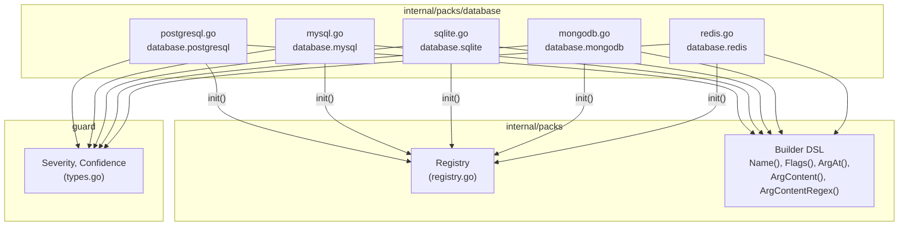
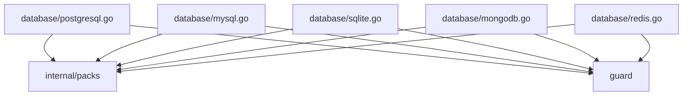
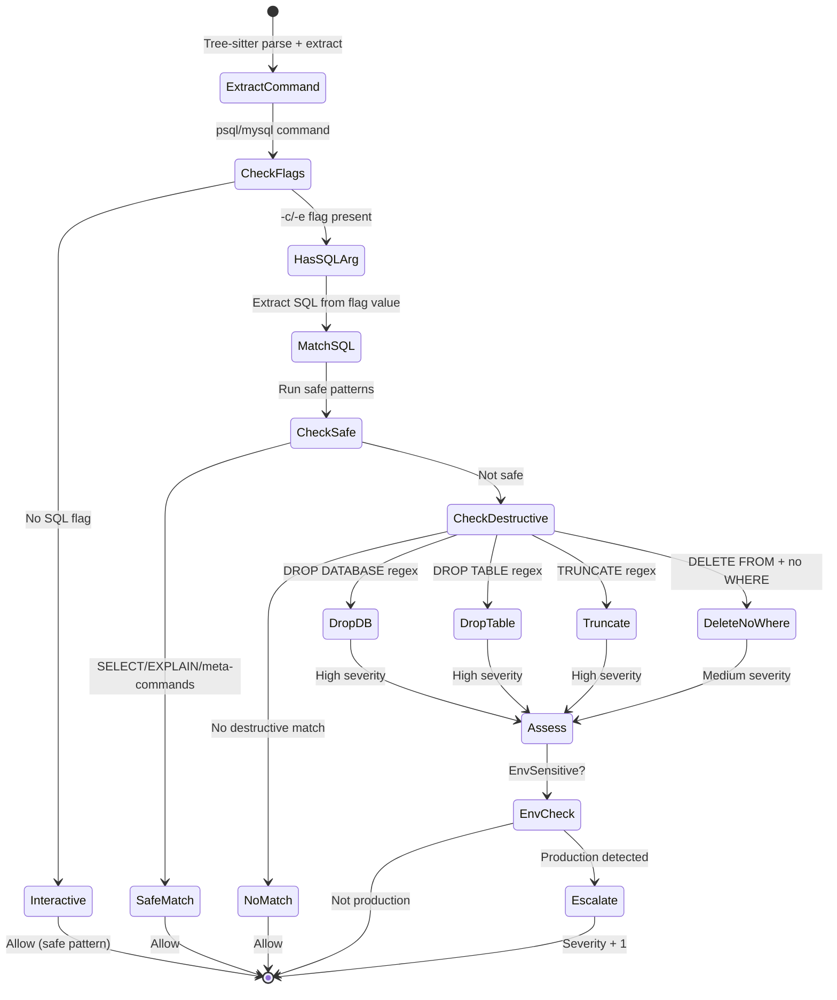

# 03b: Database Packs

**Batch**: 3 (Pattern Packs)
**Depends On**: [02-matching-framework](./02-matching-framework.md), [03a-packs-core](./03a-packs-core.md)
**Blocks**: [05-testing-and-benchmarks](./05-testing-and-benchmarks.md)
**Architecture**: [00-architecture.md](./00-architecture.md) (§3 Layer 3, §5 packs/)
**Plan Index**: [00-plan-index.md](./00-plan-index.md)
**Pack Authoring Guide**: [03a-packs-core.md §4](./03a-packs-core.md)

---

## 1. Summary

This plan defines 5 database packs covering the most common database tools
that LLM coding agents interact with:

1. **`database.postgresql`** — psql, pg_dump, pg_restore, dropdb, createdb
2. **`database.mysql`** — mysql, mysqldump, mysqladmin
3. **`database.sqlite`** — sqlite3
4. **`database.mongodb`** — mongo, mongosh, mongodump, mongorestore
5. **`database.redis`** — redis-cli

**Key design challenges unique to database packs:**

- **SQL content matching**: Destructive SQL operations (`DROP TABLE`,
  `TRUNCATE`, `DELETE FROM`) are passed as argument values to CLI tools
  (`psql -c "DROP TABLE users"`). This requires `ArgContentMatcher` (plan 02
  §5.2.4) with case-insensitive regex matching against argument content.
- **Environment sensitivity**: 4 of 5 packs are `EnvSensitive` — severity
  escalates in production environments. SQLite is the exception (local file
  database, no prod/dev distinction).
- **Shell expression matching**: MongoDB uses JavaScript-like shell
  expressions (`db.dropDatabase()`) passed via `--eval` or piped into
  `mongosh`. This requires matching argument content for method call patterns.
- **Flag-value patterns**: Redis commands are passed as positional arguments
  to `redis-cli` (`redis-cli FLUSHALL`), not as flags. PostgreSQL uses
  `-c` flag with SQL as the value.

**Scope**:
- 5 packs, each with safe + destructive patterns
- All packs follow the pack authoring guide (03a §4)
- 70+ golden file entries across all 5 packs
- Per-pattern unit tests with match and near-miss cases
- Reachability tests for every destructive pattern
- Environment escalation tests for env-sensitive packs

---

## 2. Component Diagram



---

## 3. Import Flow



Each pack file imports only:
- `github.com/dcosson/destructive-command-guard-go/guard`
- `github.com/dcosson/destructive-command-guard-go/internal/packs`

---

## 4. SQL Pattern Matching Strategy

Database packs heavily rely on `ArgContentMatcher` and `ArgContentRegex`
(plan 02 §5.2.4) because destructive operations are SQL statements passed
as argument values.

### 4.1 How SQL Reaches the CLI

| Tool | How SQL is passed | Extraction |
|------|-------------------|------------|
| `psql -c "DROP TABLE users"` | `-c` flag value | `Flags["-c"] = "DROP TABLE users"` or `Args` contains the SQL |
| `psql -f drop.sql` | `-f` flag value (file path) | Cannot inspect file contents — no match |
| `psql` (interactive) | stdin | Cannot inspect — no match |
| `mysql -e "DROP TABLE users"` | `-e` flag value | Same as psql -c |
| `sqlite3 db.sqlite "DROP TABLE users"` | Positional arg | `Args` contains the SQL |
| `mongosh --eval "db.dropDatabase()"` | `--eval` flag value | `Flags["--eval"]` or `Args` |
| `redis-cli FLUSHALL` | Positional args | `Args` = ["FLUSHALL"] |

**Key insight**: We match SQL content within **argument values** using
`ArgContentRegex`. We do NOT attempt to parse SQL itself — we use regex
patterns for well-known destructive keywords. This is a content heuristic,
not a SQL parser.

### 4.2 SQL Regex Patterns

All SQL matching is **case-insensitive** (`(?i)` flag) because SQL keywords
are case-insensitive by specification.

| Pattern | Regex | Matches |
|---------|-------|---------|
| DROP TABLE | `(?i)\bDROP\s+TABLE\b` | `DROP TABLE users`, `drop table "public"."orders"` |
| DROP DATABASE | `(?i)\bDROP\s+DATABASE\b` | `DROP DATABASE mydb` |
| TRUNCATE | `(?i)\bTRUNCATE\b` | `TRUNCATE users`, `TRUNCATE TABLE orders` |
| DELETE no WHERE | `(?i)\bDELETE\s+FROM\b(?!.*\bWHERE\b)` | `DELETE FROM users` but NOT `DELETE FROM users WHERE id=1` |
| UPDATE no WHERE | `(?i)\bUPDATE\b(?!.*\bWHERE\b)` | `UPDATE users SET active=false` but NOT `UPDATE users SET active=false WHERE id=1` |
| ALTER TABLE DROP | `(?i)\bALTER\s+TABLE\b.*\bDROP\b` | `ALTER TABLE users DROP COLUMN email` |
| DROP SCHEMA | `(?i)\bDROP\s+SCHEMA\b` | `DROP SCHEMA public CASCADE` |

**DELETE FROM / UPDATE without WHERE heuristic**: The "no WHERE" check uses
separate matchers: `SQLContent(\bDELETE\s+FROM\b)` composed with
`Not(SQLContent(\bWHERE\b))`. This is a **heuristic** with a known
**false-negative** in multi-statement SQL: if WHERE appears in a **different**
statement (e.g., `DELETE FROM users; SELECT * FROM orders WHERE active=true`),
the Not clause sees WHERE and the pattern fails to match. The DELETE without
WHERE goes undetected. The same limitation applies to UPDATE without WHERE.

We set `ConfidenceMedium` for these patterns to reflect the heuristic nature.
A future enhancement could split on semicolons before checking, but this
requires matcher framework changes beyond v1 scope.

### 4.3 DataflowResolved Consideration

Per 03a §4.10, when `DataflowResolved` is `false`, argument values may
contain unresolved `$VAR` references. For database packs this means:

- `psql -c "DROP TABLE $TABLE"` — if `$TABLE` is unresolved, the
  `ArgContentRegex` still matches `DROP TABLE` which is sufficient for
  detection. The actual table name doesn't matter for severity.
- `psql -c "$SQL_QUERY"` — if the entire query is a variable, the regex
  won't match. This is acceptable — we can't analyze what we can't see.
  The command will be allowed. This is documented as a known limitation.

### 4.4 Flag Value vs Args Extraction

The tree-sitter extractor (plan 01) handles `-c "SQL"` and `-e "SQL"` as
flag-value pairs: the flag key is `-c` or `-e`, and the value is the SQL
string. For `ArgContentRegex` to work on flag values, we need to check
**both** `cmd.Args` and `cmd.Flags` values.

Plan 02's `ArgContentMatcher` currently only checks `cmd.Args`. For database
packs, we need an `ArgContentRegex` that also checks flag values. Two options:

**(a) Extend ArgContentMatcher** to optionally check flag values (add a
`CheckFlagValues bool` field). This is the cleaner approach.

**(b) Use a custom matcher** that explicitly checks
`cmd.Flags["-c"]` + `cmd.Flags["-e"]` etc. More explicit but repetitive.

**Decision**: Option (a) — add `CheckFlagValues` to `ArgContentMatcher`.
This is a small cross-plan update to plan 02 and benefits all packs that
need content matching in flag values. The field defaults to `false` for
backwards compatibility.

```go
type ArgContentMatcher struct {
    Substring      string
    Regex          *regexp.Regexp
    AtIndex        int
    CheckFlagValues bool  // Also check flag values, not just Args
}

func (m ArgContentMatcher) Match(cmd parse.ExtractedCommand) bool {
    check := func(s string) bool {
        if m.Regex != nil {
            return m.Regex.MatchString(s)
        }
        return strings.Contains(s, m.Substring)
    }
    // Check Args
    if m.AtIndex >= 0 {
        if m.AtIndex < len(cmd.Args) && check(cmd.Args[m.AtIndex]) {
            return true
        }
    } else {
        for _, arg := range cmd.Args {
            if check(arg) {
                return true
            }
        }
    }
    // Check flag values if requested
    if m.CheckFlagValues {
        for _, val := range cmd.Flags {
            if val != "" && check(val) {
                return true
            }
        }
    }
    return false
}
```

**Builder helpers**:
```go
// SQLContent creates an ArgContentMatcher that checks both args and flag
// values for a case-insensitive SQL regex pattern.
func SQLContent(pattern string) ArgContentMatcher {
    return ArgContentMatcher{
        Regex:           regexp.MustCompile("(?i)" + pattern),
        AtIndex:         -1,
        CheckFlagValues: true,
    }
}

// ArgAtFold matches an arg at a specific index using case-insensitive
// string comparison (strings.EqualFold). Used for Redis commands where
// commands are case-insensitive but we want exact command matching
// without regex overhead.
func ArgAtFold(idx int, value string) CommandMatcher {
    return argAtFoldMatcher{idx: idx, value: value}
}

type argAtFoldMatcher struct {
    idx   int
    value string
}

func (m argAtFoldMatcher) Match(cmd parse.ExtractedCommand) bool {
    if m.idx < len(cmd.Args) {
        return strings.EqualFold(cmd.Args[m.idx], m.value)
    }
    return false
}
```

### 4.5 Matcher Naming Clarification

The plan uses several related matchers. To avoid confusion for pack authors:

| Builder | What it checks | Use case |
|---------|---------------|----------|
| `ArgContent(substring)` | Substring match in `cmd.Args` only | Simple substring in args |
| `ArgContentRegex(pattern)` | Regex match in `cmd.Args` only | Regex patterns in args (e.g., `"^\\."` for dot-commands) |
| `SQLContent(pattern)` | Case-insensitive regex in **both** `cmd.Args` and `cmd.Flags` values | SQL keywords in flag values (`-c`, `-e`) or args |
| `ArgAt(idx, value)` | Exact string match at `cmd.Args[idx]` | Exact positional match (case-sensitive) |
| `ArgAtFold(idx, value)` | Case-insensitive match at `cmd.Args[idx]` | Redis commands (case-insensitive) |

**Important**: `ArgContent` does **substring** matching, not regex. Patterns
like `"^\\."` should use `ArgContentRegex` instead of `ArgContent`. This is
a cross-plan reference to plan 02's matcher definitions.

---

## 5. Detailed Design

### 5.1 `database.postgresql` Pack (`internal/packs/database/postgresql.go`)

**Pack ID**: `database.postgresql`
**Keywords**: `["psql", "pg_dump", "pg_restore", "dropdb", "createdb"]`
**Safe Patterns**: 5
**Destructive Patterns**: 10
**EnvSensitive**: Yes (7 of 10 destructive patterns)

```go
package database

import (
    "github.com/dcosson/destructive-command-guard-go/guard"
    "github.com/dcosson/destructive-command-guard-go/internal/packs"
)

func init() {
    packs.DefaultRegistry.Register(pgPack)
}

var pgPack = packs.Pack{
    ID:          "database.postgresql",
    Name:        "PostgreSQL",
    Description: "PostgreSQL database destructive operations via psql, dropdb, and related tools",
    Keywords:    []string{"psql", "pg_dump", "pg_restore", "dropdb", "createdb"},

    Safe: []packs.SafePattern{
        // S1: psql with SELECT/EXPLAIN queries (read-only)
        {
            Name: "psql-select-safe",
            Match: packs.And(
                packs.Name("psql"),
                packs.Or(
                    packs.Flags("-c"),
                    packs.Flags("--command"),
                ),
                packs.Or(
                    packs.SQLContent(`\bSELECT\b`),
                    packs.SQLContent(`\bEXPLAIN\b`),
                    packs.SQLContent(`\b\\d`), // psql meta-commands: \dt, \d+, \dn, etc.
                ),
                packs.Not(packs.Or(
                    packs.SQLContent(`\bDROP\b`),
                    packs.SQLContent(`\bTRUNCATE\b`),
                    packs.SQLContent(`\bDELETE\b`),
                    packs.SQLContent(`\bALTER\b`),
                    packs.SQLContent(`\bUPDATE\b`),
                    packs.SQLContent(`\bINSERT\b`),
                )),
            ),
        },
        // S2: pg_dump (backup — read-only) without --clean
        {
            Name: "pg-dump-safe",
            Match: packs.And(
                packs.Name("pg_dump"),
                packs.Not(packs.Flags("--clean")),
                packs.Not(packs.Flags("-c")), // pg_dump -c means --clean
            ),
        },
        // S3: createdb (creating databases is safe)
        {
            Name: "createdb-safe",
            Match: packs.Name("createdb"),
        },
        // S4: psql with no -c flag (interactive session — no detectable SQL)
        {
            Name: "psql-interactive-safe",
            Match: packs.And(
                packs.Name("psql"),
                packs.Not(packs.Flags("-c")),
                packs.Not(packs.Flags("--command")),
                packs.Not(packs.Flags("-f")),
                packs.Not(packs.Flags("--file")),
            ),
        },
        // S5: pg_restore without --clean (restoring data, not dropping first)
        {
            Name: "pg-restore-safe",
            Match: packs.And(
                packs.Name("pg_restore"),
                packs.Not(packs.Flags("--clean")),
                packs.Not(packs.Flags("-c")),
            ),
        },
    },

    Destructive: []packs.DestructivePattern{
        // ---- High ----

        // D1: DROP DATABASE via psql
        {
            Name: "psql-drop-database",
            Match: packs.And(
                packs.Name("psql"),
                packs.SQLContent(`\bDROP\s+DATABASE\b`),
            ),
            Severity:     guard.High,
            Confidence:   guard.ConfidenceHigh,
            Reason:       "DROP DATABASE permanently destroys an entire database and all its data",
            Remediation:  "Use pg_dump to create a backup first. Verify the database name.",
            EnvSensitive: true,
        },
        // D2: dropdb CLI tool
        {
            Name: "dropdb",
            Match: packs.Name("dropdb"),
            Severity:     guard.High,
            Confidence:   guard.ConfidenceHigh,
            Reason:       "dropdb permanently destroys an entire PostgreSQL database",
            Remediation:  "Use pg_dump to create a backup first. Verify the database name.",
            EnvSensitive: true,
        },
        // D3: DROP TABLE via psql
        {
            Name: "psql-drop-table",
            Match: packs.And(
                packs.Name("psql"),
                packs.SQLContent(`\bDROP\s+TABLE\b`),
            ),
            Severity:     guard.High,
            Confidence:   guard.ConfidenceHigh,
            Reason:       "DROP TABLE permanently destroys a table and all its data",
            Remediation:  "Use pg_dump -t to backup the table first. Consider DROP TABLE IF EXISTS.",
            EnvSensitive: true,
        },
        // D4: TRUNCATE via psql
        {
            Name: "psql-truncate",
            Match: packs.And(
                packs.Name("psql"),
                packs.SQLContent(`\bTRUNCATE\b`),
            ),
            Severity:     guard.High,
            Confidence:   guard.ConfidenceHigh,
            Reason:       "TRUNCATE removes all rows from a table instantly without logging individual row deletions",
            Remediation:  "Create a backup first. Consider DELETE with WHERE for selective removal.",
            EnvSensitive: true,
        },

        // ---- Medium ----

        // D5: DELETE FROM without WHERE via psql
        {
            Name: "psql-delete-no-where",
            Match: packs.And(
                packs.Name("psql"),
                packs.SQLContent(`\bDELETE\s+FROM\b`),
                packs.Not(packs.SQLContent(`\bWHERE\b`)),
            ),
            Severity:     guard.Medium,
            Confidence:   guard.ConfidenceMedium,
            Reason:       "DELETE FROM without WHERE clause deletes all rows in the table",
            Remediation:  "Add a WHERE clause to target specific rows, or use TRUNCATE if you intend to remove all rows.",
            EnvSensitive: true,
        },
        // D6: pg_dump --clean (includes DROP statements in dump)
        {
            Name: "pg-dump-clean",
            Match: packs.And(
                packs.Name("pg_dump"),
                packs.Or(
                    packs.Flags("--clean"),
                    packs.Flags("-c"), // pg_dump -c means --clean (not --command like psql)
                ),
            ),
            Severity:     guard.Medium,
            Confidence:   guard.ConfidenceHigh,
            Reason:       "pg_dump --clean generates DROP commands before CREATE — restoring this dump will destroy existing objects",
            Remediation:  "Use pg_dump without --clean for a non-destructive backup.",
            EnvSensitive: false,
        },
        // D7: pg_restore --clean (drops objects before restoring)
        {
            Name: "pg-restore-clean",
            Match: packs.And(
                packs.Name("pg_restore"),
                packs.Or(
                    packs.Flags("--clean"),
                    packs.Flags("-c"),
                ),
            ),
            Severity:     guard.Medium,
            Confidence:   guard.ConfidenceHigh,
            Reason:       "pg_restore --clean drops existing database objects before recreating them",
            Remediation:  "Use pg_restore without --clean to restore without dropping existing data.",
            EnvSensitive: true,
        },
        // D8: ALTER TABLE ... DROP via psql
        {
            Name: "psql-alter-drop",
            Match: packs.And(
                packs.Name("psql"),
                packs.SQLContent(`\bALTER\s+TABLE\b`),
                packs.SQLContent(`\bDROP\b`),
            ),
            Severity:     guard.Medium,
            Confidence:   guard.ConfidenceMedium,
            Reason:       "ALTER TABLE ... DROP permanently removes columns, constraints, or indexes",
            Remediation:  "Create a backup first. Verify the column/constraint name.",
            EnvSensitive: false,
        },
        // D9: UPDATE without WHERE via psql
        {
            Name: "psql-update-no-where",
            Match: packs.And(
                packs.Name("psql"),
                packs.SQLContent(`\bUPDATE\b`),
                packs.Not(packs.SQLContent(`\bWHERE\b`)),
            ),
            Severity:     guard.Medium,
            Confidence:   guard.ConfidenceMedium,
            Reason:       "UPDATE without WHERE clause modifies all rows in the table",
            Remediation:  "Add a WHERE clause to target specific rows.",
            EnvSensitive: true,
        },
        // D10: DROP SCHEMA via psql
        {
            Name: "psql-drop-schema",
            Match: packs.And(
                packs.Name("psql"),
                packs.SQLContent(`\bDROP\s+SCHEMA\b`),
            ),
            Severity:     guard.High,
            Confidence:   guard.ConfidenceHigh,
            Reason:       "DROP SCHEMA destroys all objects in the schema (tables, views, functions). With CASCADE, this can destroy an entire application's database objects.",
            Remediation:  "Use pg_dump to backup the schema first. Verify the schema name.",
            EnvSensitive: true,
        },
    },
}
```

#### 5.1.1 PostgreSQL Pattern Interaction Matrix

| Safe Pattern | Prevents Destructive | Key Distinguishing Condition |
|-------------|---------------------|----------------------------|
| psql-select-safe | psql-drop-database, psql-drop-table, psql-truncate, psql-delete-no-where, psql-update-no-where, psql-alter-drop, psql-drop-schema | `-c` with SELECT/EXPLAIN and Not(DROP\|TRUNCATE\|DELETE\|ALTER\|UPDATE\|INSERT) |
| pg-dump-safe | pg-dump-clean | Not(--clean \| -c) |
| createdb-safe | (none — no destructive createdb patterns) | Name = createdb |
| psql-interactive-safe | psql-drop-*, psql-truncate, psql-delete-*, psql-update-*, psql-alter-drop, psql-drop-schema | Not(-c \| --command \| -f \| --file) |
| pg-restore-safe | pg-restore-clean | Not(--clean \| -c) |

**Notes**:
- `dropdb` has no safe pattern — all invocations are destructive.
- `psql -f drop.sql` (file execution) matches neither safe nor destructive
  because we cannot inspect file contents. It passes as "no match" → Allow.
  This is a known limitation documented in §13.
- `psql-alter-drop` intentionally stays `EnvSensitive: false` in v1. It is a
  scoped schema mutation (column/index/constraint removal) at Medium
  confidence, unlike full-object destruction patterns that are env-sensitive.
- `createdb --template production_db new_db` copies an entire database. While
  read-only from the source's perspective, it can cause heavy I/O on a
  production server. We don't flag this — it's a benign-but-potentially-
  expensive operation, not a destructive one.

---

### 5.2 `database.mysql` Pack (`internal/packs/database/mysql.go`)

**Pack ID**: `database.mysql`
**Keywords**: `["mysql", "mysqldump", "mysqladmin"]`
**Safe Patterns**: 4
**Destructive Patterns**: 8
**EnvSensitive**: Yes (5 of 8 destructive patterns)

```go
var mysqlPack = packs.Pack{
    ID:          "database.mysql",
    Name:        "MySQL",
    Description: "MySQL/MariaDB database destructive operations via mysql, mysqldump, mysqladmin",
    Keywords:    []string{"mysql", "mysqldump", "mysqladmin"},

    Safe: []packs.SafePattern{
        // S1: mysql with SELECT/EXPLAIN/SHOW queries
        {
            Name: "mysql-select-safe",
            Match: packs.And(
                packs.Name("mysql"),
                packs.Or(
                    packs.Flags("-e"),
                    packs.Flags("--execute"),
                ),
                packs.Or(
                    packs.SQLContent(`\bSELECT\b`),
                    packs.SQLContent(`\bEXPLAIN\b`),
                    packs.SQLContent(`\bSHOW\b`),
                    packs.SQLContent(`\bDESCRIBE\b`),
                ),
                packs.Not(packs.Or(
                    packs.SQLContent(`\bDROP\b`),
                    packs.SQLContent(`\bTRUNCATE\b`),
                    packs.SQLContent(`\bDELETE\b`),
                    packs.SQLContent(`\bALTER\b`),
                    packs.SQLContent(`\bUPDATE\b`),
                    packs.SQLContent(`\bINSERT\b`),
                )),
            ),
        },
        // S2: mysqldump (backup — read-only)
        // Note: mysqldump includes DROP TABLE by default. --skip-add-drop-table
        // disables it. We consider default mysqldump safe because it's a backup
        // tool — the risk is at restore time, not dump time.
        {
            Name: "mysqldump-safe",
            Match: packs.Name("mysqldump"),
        },
        // S3: mysql interactive (no -e flag)
        {
            Name: "mysql-interactive-safe",
            Match: packs.And(
                packs.Name("mysql"),
                packs.Not(packs.Flags("-e")),
                packs.Not(packs.Flags("--execute")),
            ),
        },
        // S4: mysqladmin status/ping/version (read-only admin commands)
        {
            Name: "mysqladmin-readonly-safe",
            Match: packs.And(
                packs.Name("mysqladmin"),
                packs.Or(
                    packs.ArgAt(0, "status"),
                    packs.ArgAt(0, "ping"),
                    packs.ArgAt(0, "version"),
                    packs.ArgAt(0, "processlist"),
                    packs.ArgAt(0, "variables"),
                    packs.ArgAt(0, "extended-status"),
                ),
            ),
        },
    },

    Destructive: []packs.DestructivePattern{
        // ---- High ----

        // D1: DROP DATABASE via mysql -e
        {
            Name: "mysql-drop-database",
            Match: packs.And(
                packs.Name("mysql"),
                packs.SQLContent(`\bDROP\s+DATABASE\b`),
            ),
            Severity:     guard.High,
            Confidence:   guard.ConfidenceHigh,
            Reason:       "DROP DATABASE permanently destroys an entire MySQL database and all its tables",
            Remediation:  "Use mysqldump to create a backup first. Verify the database name.",
            EnvSensitive: true,
        },
        // D2: mysqladmin drop (drops a database)
        {
            Name: "mysqladmin-drop",
            Match: packs.And(
                packs.Name("mysqladmin"),
                packs.Or(
                    packs.ArgAt(0, "drop"),
                    packs.Arg("drop"),
                ),
            ),
            Severity:     guard.High,
            Confidence:   guard.ConfidenceHigh,
            Reason:       "mysqladmin drop permanently destroys an entire MySQL database",
            Remediation:  "Use mysqldump to create a backup first. Verify the database name.",
            EnvSensitive: true,
        },
        // D3: DROP TABLE via mysql -e
        {
            Name: "mysql-drop-table",
            Match: packs.And(
                packs.Name("mysql"),
                packs.SQLContent(`\bDROP\s+TABLE\b`),
            ),
            Severity:     guard.High,
            Confidence:   guard.ConfidenceHigh,
            Reason:       "DROP TABLE permanently destroys a table and all its data",
            Remediation:  "Use mysqldump to backup the table first.",
            EnvSensitive: true,
        },
        // D4: TRUNCATE via mysql -e
        {
            Name: "mysql-truncate",
            Match: packs.And(
                packs.Name("mysql"),
                packs.SQLContent(`\bTRUNCATE\b`),
            ),
            Severity:     guard.High,
            Confidence:   guard.ConfidenceHigh,
            Reason:       "TRUNCATE removes all rows from a table instantly",
            Remediation:  "Create a backup first. Consider DELETE with WHERE for selective removal.",
            EnvSensitive: true,
        },

        // ---- Medium ----

        // D5: DELETE FROM without WHERE via mysql -e
        {
            Name: "mysql-delete-no-where",
            Match: packs.And(
                packs.Name("mysql"),
                packs.SQLContent(`\bDELETE\s+FROM\b`),
                packs.Not(packs.SQLContent(`\bWHERE\b`)),
            ),
            Severity:     guard.Medium,
            Confidence:   guard.ConfidenceMedium,
            Reason:       "DELETE FROM without WHERE clause deletes all rows in the table",
            Remediation:  "Add a WHERE clause to target specific rows.",
            EnvSensitive: true,
        },
        // D6: ALTER TABLE DROP via mysql -e
        {
            Name: "mysql-alter-drop",
            Match: packs.And(
                packs.Name("mysql"),
                packs.SQLContent(`\bALTER\s+TABLE\b`),
                packs.SQLContent(`\bDROP\b`),
            ),
            Severity:     guard.Medium,
            Confidence:   guard.ConfidenceMedium,
            Reason:       "ALTER TABLE ... DROP permanently removes columns, constraints, or indexes",
            Remediation:  "Create a backup first. Verify the column/constraint name.",
            EnvSensitive: false,
        },
        // D7: mysqladmin flush-hosts / flush-logs (operational risk)
        {
            Name: "mysqladmin-flush",
            Match: packs.And(
                packs.Name("mysqladmin"),
                packs.Or(
                    packs.Arg("flush-hosts"),
                    packs.Arg("flush-logs"),
                    packs.Arg("flush-privileges"),
                    packs.Arg("flush-tables"),
                ),
            ),
            Severity:     guard.Medium,
            Confidence:   guard.ConfidenceHigh,
            Reason:       "mysqladmin flush operations can disrupt active connections and require careful timing",
            Remediation:  "Schedule flush operations during maintenance windows.",
            EnvSensitive: false,
        },
        // D8: UPDATE without WHERE via mysql -e
        {
            Name: "mysql-update-no-where",
            Match: packs.And(
                packs.Name("mysql"),
                packs.SQLContent(`\bUPDATE\b`),
                packs.Not(packs.SQLContent(`\bWHERE\b`)),
            ),
            Severity:     guard.Medium,
            Confidence:   guard.ConfidenceMedium,
            Reason:       "UPDATE without WHERE clause modifies all rows in the table",
            Remediation:  "Add a WHERE clause to target specific rows.",
            EnvSensitive: true,
        },
    },
}
```

#### 5.2.1 MySQL Notes

**mysqldump as safe**: `mysqldump` is classified as safe even though its
output contains `DROP TABLE` statements by default. The dump itself is
read-only — the risk is when someone runs `mysql < dump.sql` to restore.
That `mysql` command won't trigger the safe pattern (it uses stdin, not
`-e`) and will pass as "no match." This is a known gap (see §13).

**mysql vs mysqldump keyword collision**: Both `mysql` and `mysqldump`
contain the substring `mysql`. The Aho-Corasick pre-filter with word-boundary
matching will correctly distinguish them — `mysqldump` is a separate word
that triggers the pack, and the `Name()` matcher in patterns ensures the
right command is matched.

**`Arg(value)` builder usage**: `mysqladmin-drop` and `mysqladmin-flush`
intentionally use `Arg(...)` for exact any-position token matching (from the
plan 02 matcher DSL). This captures cases where options shift token positions
without relying on broad substring checks.

**ALTER TABLE DROP env sensitivity**: `mysql-alter-drop` intentionally remains
`EnvSensitive: false` in v1 for parity with PostgreSQL's `psql-alter-drop`.
Both are treated as scoped schema mutations at Medium severity.

---

### 5.3 `database.sqlite` Pack (`internal/packs/database/sqlite.go`)

**Pack ID**: `database.sqlite`
**Keywords**: `["sqlite3"]`
**Safe Patterns**: 2
**Destructive Patterns**: 5
**EnvSensitive**: No (SQLite is a local file database)

```go
var sqlitePack = packs.Pack{
    ID:          "database.sqlite",
    Name:        "SQLite",
    Description: "SQLite database destructive operations via sqlite3 CLI",
    Keywords:    []string{"sqlite3"},

    Safe: []packs.SafePattern{
        // S1: sqlite3 with SELECT/EXPLAIN/.tables/.schema
        {
            Name: "sqlite3-readonly-safe",
            Match: packs.And(
                packs.Name("sqlite3"),
                packs.Or(
                    packs.SQLContent(`\bSELECT\b`),
                    packs.SQLContent(`\bEXPLAIN\b`),
                    packs.ArgContentRegex(`^\\.`), // sqlite3 dot-commands: .tables, .schema, .dump
                ),
                packs.Not(packs.Or(
                    packs.SQLContent(`\bDROP\b`),
                    packs.SQLContent(`\bTRUNCATE\b`),
                    packs.SQLContent(`\bDELETE\b`),
                    packs.SQLContent(`\bUPDATE\b`),
                    packs.SQLContent(`\bINSERT\b`),
                )),
            ),
        },
        // S2: sqlite3 non-destructive (no destructive SQL detected)
        {
            Name: "sqlite3-non-destructive-safe",
            Match: packs.And(
                packs.Name("sqlite3"),
                packs.Not(packs.SQLContent(`\b(?:DROP|TRUNCATE|DELETE|ALTER|UPDATE)\b`)),
                packs.Not(packs.ArgContentRegex(`\.drop`)),
            ),
        },
    },

    Destructive: []packs.DestructivePattern{
        // ---- High ----

        // D1: DROP TABLE via sqlite3
        {
            Name: "sqlite3-drop-table",
            Match: packs.And(
                packs.Name("sqlite3"),
                packs.SQLContent(`\bDROP\s+TABLE\b`),
            ),
            Severity:     guard.High,
            Confidence:   guard.ConfidenceHigh,
            Reason:       "DROP TABLE permanently destroys a table and all its data in the SQLite database",
            Remediation:  "Copy the database file as a backup first. Use .dump to export data.",
            EnvSensitive: false,
        },
        // D2: .drop meta-command (sqlite3-specific)
        {
            Name: "sqlite3-dot-drop",
            Match: packs.And(
                packs.Name("sqlite3"),
                packs.ArgContentRegex(`\.drop`),
            ),
            Severity:     guard.High,
            Confidence:   guard.ConfidenceMedium,
            Reason:       "sqlite3 .drop command drops triggers or views",
            Remediation:  "Verify the target. Use .dump to backup first.",
            EnvSensitive: false,
        },

        // ---- Medium ----

        // D3: DELETE FROM without WHERE via sqlite3
        {
            Name: "sqlite3-delete-no-where",
            Match: packs.And(
                packs.Name("sqlite3"),
                packs.SQLContent(`\bDELETE\s+FROM\b`),
                packs.Not(packs.SQLContent(`\bWHERE\b`)),
            ),
            Severity:     guard.Medium,
            Confidence:   guard.ConfidenceMedium,
            Reason:       "DELETE FROM without WHERE clause deletes all rows in the table",
            Remediation:  "Add a WHERE clause to target specific rows.",
            EnvSensitive: false,
        },
        // D4: TRUNCATE (SQLite doesn't have TRUNCATE, but DELETE FROM without
        // WHERE is equivalent. This catches cases where someone writes TRUNCATE
        // thinking it works — sqlite3 will error, but we still flag intent.)
        // Note: This pattern rarely matches for sqlite3 because TRUNCATE isn't
        // valid SQLite SQL. Included for completeness.
        {
            Name: "sqlite3-truncate",
            Match: packs.And(
                packs.Name("sqlite3"),
                packs.SQLContent(`\bTRUNCATE\b`),
            ),
            Severity:     guard.Medium,
            Confidence:   guard.ConfidenceLow,
            Reason:       "TRUNCATE is not valid SQLite SQL but indicates intent to delete all data",
            Remediation:  "SQLite uses DELETE FROM (without WHERE) instead of TRUNCATE.",
            EnvSensitive: false,
        },
        // D5: UPDATE without WHERE via sqlite3
        {
            Name: "sqlite3-update-no-where",
            Match: packs.And(
                packs.Name("sqlite3"),
                packs.SQLContent(`\bUPDATE\b`),
                packs.Not(packs.SQLContent(`\bWHERE\b`)),
            ),
            Severity:     guard.Medium,
            Confidence:   guard.ConfidenceMedium,
            Reason:       "UPDATE without WHERE clause modifies all rows in the table",
            Remediation:  "Add a WHERE clause to target specific rows.",
            EnvSensitive: false,
        },
    },
}
```

---

### 5.4 `database.mongodb` Pack (`internal/packs/database/mongodb.go`)

**Pack ID**: `database.mongodb`
**Keywords**: `["mongo", "mongosh", "mongodump", "mongorestore", "mongos"]`
**Safe Patterns**: 3
**Destructive Patterns**: 6
**EnvSensitive**: Yes (5 of 6 destructive patterns)

MongoDB uses JavaScript-like shell expressions rather than SQL. Destructive
operations are method calls like `db.dropDatabase()` or
`db.collection.deleteMany({})`.

```go
var mongoPack = packs.Pack{
    ID:          "database.mongodb",
    Name:        "MongoDB",
    Description: "MongoDB destructive operations via mongosh, mongo, mongos, mongodump, mongorestore",
    Keywords:    []string{"mongo", "mongosh", "mongos", "mongodump", "mongorestore"},

    Safe: []packs.SafePattern{
        // S1: mongodump (backup — read-only)
        {
            Name: "mongodump-safe",
            Match: packs.Name("mongodump"),
        },
        // S2: mongosh/mongo with read-only operations
        {
            Name: "mongosh-readonly-safe",
            Match: packs.And(
                packs.Or(
                    packs.Name("mongosh"),
                    packs.Name("mongo"),
                    packs.Name("mongos"),
                ),
                packs.Or(
                    packs.Flags("--eval"),
                    packs.Flags("-e"),
                ),
                packs.Or(
                    packs.SQLContent(`\.find\(`),
                    packs.SQLContent(`\.count\(`),
                    packs.SQLContent(`\.aggregate\(`),
                    packs.SQLContent(`\.explain\(`),
                    packs.SQLContent(`show\s+dbs`),
                    packs.SQLContent(`show\s+collections`),
                ),
                packs.Not(packs.Or(
                    packs.SQLContent(`\.drop`),
                    packs.SQLContent(`\.delete`),
                    packs.SQLContent(`\.remove`),
                    packs.SQLContent(`dropDatabase`),
                )),
            ),
        },
        // S3: mongosh/mongo interactive (no --eval)
        {
            Name: "mongosh-interactive-safe",
            Match: packs.And(
                packs.Or(
                    packs.Name("mongosh"),
                    packs.Name("mongo"),
                    packs.Name("mongos"),
                ),
                packs.Not(packs.Flags("--eval")),
                packs.Not(packs.Flags("-e")),
            ),
        },
    },

    Destructive: []packs.DestructivePattern{
        // ---- High ----

        // D1: db.dropDatabase()
        {
            Name: "mongo-drop-database",
            Match: packs.And(
                packs.Or(
                    packs.Name("mongosh"),
                    packs.Name("mongo"),
                    packs.Name("mongos"),
                ),
                packs.SQLContent(`dropDatabase\s*\(`),
            ),
            Severity:     guard.High,
            Confidence:   guard.ConfidenceHigh,
            Reason:       "db.dropDatabase() permanently destroys an entire MongoDB database",
            Remediation:  "Use mongodump to create a backup first. Verify the database name.",
            EnvSensitive: true,
        },
        // D2: db.collection.drop()
        {
            Name: "mongo-collection-drop",
            Match: packs.And(
                packs.Or(
                    packs.Name("mongosh"),
                    packs.Name("mongo"),
                    packs.Name("mongos"),
                ),
                packs.SQLContent(`\.drop\s*\(`),
                packs.Not(packs.SQLContent(`dropDatabase`)),
            ),
            Severity:     guard.High,
            Confidence:   guard.ConfidenceHigh,
            Reason:       "collection.drop() permanently destroys a MongoDB collection and all its documents",
            Remediation:  "Use mongodump --collection to backup the collection first.",
            EnvSensitive: true,
        },

        // ---- Medium ----

        // D3: db.collection.deleteMany({}) (empty filter = delete all)
        {
            Name: "mongo-delete-many-all",
            Match: packs.And(
                packs.Or(
                    packs.Name("mongosh"),
                    packs.Name("mongo"),
                    packs.Name("mongos"),
                ),
                packs.SQLContent(`deleteMany\s*\(\s*(?:\{\s*\})?\s*\)`),
            ),
            Severity:     guard.Medium,
            Confidence:   guard.ConfidenceHigh,
            Reason:       "deleteMany({}) with empty filter deletes all documents in the collection",
            Remediation:  "Add a filter to target specific documents: deleteMany({field: value})",
            EnvSensitive: true,
        },
        // D4: db.collection.remove({}) (legacy, empty filter = remove all)
        {
            Name: "mongo-remove-all",
            Match: packs.And(
                packs.Or(
                    packs.Name("mongosh"),
                    packs.Name("mongo"),
                    packs.Name("mongos"),
                ),
                packs.SQLContent(`\.remove\s*\(\s*\{\s*\}\s*\)`),
            ),
            Severity:     guard.Medium,
            Confidence:   guard.ConfidenceHigh,
            Reason:       "remove({}) with empty filter deletes all documents in the collection",
            Remediation:  "Add a query filter: remove({field: value})",
            EnvSensitive: true,
        },
        // D5: mongorestore --drop (drops collections before restoring)
        {
            Name: "mongorestore-drop",
            Match: packs.And(
                packs.Name("mongorestore"),
                packs.Flags("--drop"),
            ),
            Severity:     guard.Medium,
            Confidence:   guard.ConfidenceHigh,
            Reason:       "mongorestore --drop drops existing collections before restoring, losing any data not in the backup",
            Remediation:  "Use mongorestore without --drop to merge instead of replace.",
            EnvSensitive: true,
        },
        // D6: db.collection.deleteMany with filter (less dangerous but still destructive)
        {
            Name: "mongo-delete-many",
            Match: packs.And(
                packs.Or(
                    packs.Name("mongosh"),
                    packs.Name("mongo"),
                    packs.Name("mongos"),
                ),
                packs.SQLContent(`deleteMany\s*\(`),
                packs.Not(packs.SQLContent(`deleteMany\s*\(\s*(?:\{\s*\})?\s*\)`)), // Not empty/no filter
            ),
            Severity:     guard.Medium,
            Confidence:   guard.ConfidenceMedium,
            Reason:       "deleteMany() deletes multiple documents matching the filter",
            Remediation:  "Verify the filter matches only intended documents. Use countDocuments() first to check.",
            EnvSensitive: true,
        },
    },
}
```

#### 5.4.1 MongoDB Notes

**mongo vs mongosh vs mongos**: The legacy `mongo` shell is deprecated in
favor of `mongosh`. `mongos` is the MongoDB shard router, which also
supports `--eval` and can execute all the same destructive JavaScript
expressions. We match all three command names. The patterns are identical.

**Shell expression matching**: MongoDB patterns use `SQLContent()` (which
wraps `ArgContentRegex` with `CheckFlagValues: true`) to match JavaScript
method call patterns. The regex patterns target method names:
- `dropDatabase\s*\(` — matches `db.dropDatabase()`
- `\.drop\s*\(` — matches `db.collection.drop()`
- `deleteMany\s*\(\s*(?:\{\s*\})?\s*\)` — matches `deleteMany({})` or `deleteMany()` (empty/no filter)

**Empty filter detection**: The `deleteMany` pattern matches both
`deleteMany({})` (explicit empty filter) and `deleteMany()` (no argument,
which behaves as delete-all in some MongoDB versions). Both are
ConfidenceHigh because the intent is structurally unambiguous. `deleteMany`
with a non-empty filter gets ConfidenceMedium because we can't evaluate
filter selectivity.

**dropIndex over-classification**: The `\.drop\s*\(` regex in
`mongo-collection-drop` also matches `db.users.dropIndex("idx")` and
`db.users.dropIndexes()`. These are destructive operations but less severe
than collection drop. Currently they are classified at High severity via the
collection drop pattern. This is intentional over-classification — for a
mistake-preventer, flagging at higher severity is safer than under-flagging.
`deleteMany(null)` and `deleteMany(undefined)` are not caught (edge case).

---

### 5.5 `database.redis` Pack (`internal/packs/database/redis.go`)

**Pack ID**: `database.redis`
**Keywords**: `["redis-cli"]`
**Safe Patterns**: 2
**Destructive Patterns**: 6
**EnvSensitive**: Yes (4 of 6 destructive patterns)

Redis is simpler than SQL databases — commands are passed as positional
arguments to `redis-cli` without a flag like `-c` or `-e`. All Redis
commands are case-insensitive, so we use `ArgAtFold` (§4.4) for matching.

```go
var redisPack = packs.Pack{
    ID:          "database.redis",
    Name:        "Redis",
    Description: "Redis destructive operations via redis-cli",
    Keywords:    []string{"redis-cli"},

    Safe: []packs.SafePattern{
        // S1: redis-cli read-only commands (case-insensitive via ArgAtFold)
        {
            Name: "redis-cli-readonly-safe",
            Match: packs.And(
                packs.Name("redis-cli"),
                packs.Or(
                    packs.ArgAtFold(0, "GET"),
                    packs.ArgAtFold(0, "KEYS"),
                    packs.ArgAtFold(0, "INFO"),
                    packs.ArgAtFold(0, "PING"),
                    packs.ArgAtFold(0, "TTL"),
                    packs.ArgAtFold(0, "TYPE"),
                    packs.ArgAtFold(0, "DBSIZE"),
                    packs.ArgAtFold(0, "SCAN"),
                    packs.ArgAtFold(0, "MONITOR"),
                ),
            ),
        },
        // S2: redis-cli interactive (no command argument)
        // When redis-cli is invoked with just connection flags, it opens
        // an interactive session
        {
            Name: "redis-cli-interactive-safe",
            Match: packs.And(
                packs.Name("redis-cli"),
                // Exclude commands that have destructive patterns
                packs.Not(packs.Or(
                    packs.ArgAtFold(0, "FLUSHALL"),
                    packs.ArgAtFold(0, "FLUSHDB"),
                    packs.ArgAtFold(0, "DEL"),
                    packs.ArgAtFold(0, "UNLINK"),
                    packs.ArgAtFold(0, "CONFIG"),
                    packs.ArgAtFold(0, "DEBUG"),
                    packs.ArgAtFold(0, "SHUTDOWN"),
                )),
            ),
        },
    },

    Destructive: []packs.DestructivePattern{
        // ---- High ----

        // D1: FLUSHALL (delete all keys in all databases)
        {
            Name: "redis-flushall",
            Match: packs.And(
                packs.Name("redis-cli"),
                packs.ArgAtFold(0, "FLUSHALL"),
            ),
            Severity:     guard.High,
            Confidence:   guard.ConfidenceHigh,
            Reason:       "FLUSHALL deletes all keys in all Redis databases",
            Remediation:  "Use redis-cli BGSAVE first to create a backup. Consider FLUSHDB for single-database flush.",
            EnvSensitive: true,
        },
        // D2: FLUSHDB (delete all keys in current database)
        {
            Name: "redis-flushdb",
            Match: packs.And(
                packs.Name("redis-cli"),
                packs.ArgAtFold(0, "FLUSHDB"),
            ),
            Severity:     guard.High,
            Confidence:   guard.ConfidenceHigh,
            Reason:       "FLUSHDB deletes all keys in the current Redis database",
            Remediation:  "Use redis-cli BGSAVE first. Verify you're connected to the right database.",
            EnvSensitive: true,
        },

        // ---- Medium ----

        // D3: DEL/UNLINK (key deletion)
        {
            Name: "redis-key-delete",
            Match: packs.And(
                packs.Name("redis-cli"),
                packs.Or(
                    packs.ArgAtFold(0, "DEL"),
                    packs.ArgAtFold(0, "UNLINK"),
                ),
            ),
            Severity:     guard.Medium,
            Confidence:   guard.ConfidenceMedium,
            Reason:       "DEL/UNLINK deletes the specified keys from Redis",
            Remediation:  "Verify the key names. Use TTL or OBJECT HELP to inspect keys first.",
            EnvSensitive: true,
        },
        // D4: CONFIG SET (modifies Redis configuration at runtime)
        {
            Name: "redis-config-set",
            Match: packs.And(
                packs.Name("redis-cli"),
                packs.ArgAtFold(0, "CONFIG"),
                packs.Or(
                    packs.ArgAtFold(1, "SET"),
                    packs.ArgAtFold(1, "RESETSTAT"),
                ),
            ),
            Severity:     guard.Medium,
            Confidence:   guard.ConfidenceHigh,
            Reason:       "CONFIG SET modifies Redis server configuration at runtime",
            Remediation:  "Verify the configuration parameter and value. Use CONFIG GET to check current value first.",
            EnvSensitive: true,
        },
        // D5: SHUTDOWN (stops the Redis server)
        {
            Name: "redis-shutdown",
            Match: packs.And(
                packs.Name("redis-cli"),
                packs.ArgAtFold(0, "SHUTDOWN"),
            ),
            Severity:     guard.Medium,
            Confidence:   guard.ConfidenceHigh,
            Reason:       "SHUTDOWN stops the Redis server, causing service disruption",
            Remediation:  "Use redis-cli BGSAVE first. Schedule shutdowns during maintenance windows.",
            EnvSensitive: false,
        },
        // D6: DEBUG (dangerous debug subcommands)
        {
            Name: "redis-debug",
            Match: packs.And(
                packs.Name("redis-cli"),
                packs.ArgAtFold(0, "DEBUG"),
            ),
            Severity:     guard.Medium,
            Confidence:   guard.ConfidenceHigh,
            Reason:       "DEBUG commands can crash the server (SEGFAULT), block it (SLEEP), or modify internal state",
            Remediation:  "DEBUG commands should only be used in development environments for testing purposes.",
            EnvSensitive: false,
        },
    },
}
```

#### 5.5.1 Redis Notes

**Case sensitivity**: Redis commands are case-insensitive (FLUSHALL =
flushall = FlushAll). We use `ArgAtFold(idx, value)` which performs
`strings.EqualFold()` matching. This catches all case variations without
requiring duplicate patterns or regex.

**DEL/UNLINK key deletion**: The shaping doc mentions `DEL *` as a pattern.
In practice, `redis-cli DEL *` doesn't use shell globbing — the `*` is
passed literally. Mass deletion is typically done via
`redis-cli KEYS "pattern*" | xargs redis-cli DEL`. We flag all DEL/UNLINK
commands at Medium severity because they indicate key deletion intent. The
wildcard case (via xargs pipeline) is caught by the pipeline's compound
command evaluation — the inner `redis-cli DEL` matches.

**redis-cli connection flags**: `redis-cli -h host -p 6379 -a password FLUSHALL`
puts `-h`, `-p`, `-a` into the Flags map and `FLUSHALL` into `Args[0]` after
flag extraction. The patterns correctly match `ArgAtFold(0, "FLUSHALL")`
because connection flags are separated from the Redis command.

**DEBUG subcommands**: The `redis-debug` pattern catches all DEBUG subcommands
(SEGFAULT, SLEEP, SET-ACTIVE-EXPIRE, etc.) at Medium severity. DEBUG SEGFAULT
crashes the server, DEBUG SLEEP blocks it. These should only be used in
development environments.

**S2 exclusion maintenance invariant**: `redis-cli-interactive-safe` uses a
negative exclusion list for destructive verbs. Whenever a new Redis
destructive pattern is added, update S2's exclusion list in the same change
to avoid safe-pattern shadowing.

**CONFIG SET granularity**: All CONFIG SET operations are flagged at Medium
severity. Some CONFIG SET parameters are benign (`loglevel`) while others
are dangerous (`maxmemory 1`, `requirepass ""`). Distinguishing between them
would require enumerating all Redis config parameters. Deferred to v2.

---

## 6. Golden File Entries

**Policy**: All golden file entries use `InteractivePolicy` for the decision
column.

### 6.1 `database.postgresql` Golden Entries

```
format: v1
policy: interactive
---
# D1: psql DROP DATABASE — denied
command: psql -c "DROP DATABASE myapp"
decision: Deny
severity: High
confidence: High
pack: database.postgresql
rule: psql-drop-database
---
# D1: psql DROP DATABASE with host — denied
command: psql -h localhost -c "DROP DATABASE production"
decision: Deny
severity: High
confidence: High
pack: database.postgresql
rule: psql-drop-database
---
# D2: dropdb — denied
command: dropdb myapp_production
decision: Deny
severity: High
confidence: High
pack: database.postgresql
rule: dropdb
---
# D3: psql DROP TABLE — denied
command: psql -c "DROP TABLE users"
decision: Deny
severity: High
confidence: High
pack: database.postgresql
rule: psql-drop-table
---
# D3: psql DROP TABLE IF EXISTS — denied
command: psql -c "DROP TABLE IF EXISTS sessions"
decision: Deny
severity: High
confidence: High
pack: database.postgresql
rule: psql-drop-table
---
# D4: psql TRUNCATE — denied
command: psql -c "TRUNCATE TABLE orders"
decision: Deny
severity: High
confidence: High
pack: database.postgresql
rule: psql-truncate
---
# D5: psql DELETE FROM no WHERE — ask
command: psql -c "DELETE FROM users"
decision: Ask
severity: Medium
confidence: Medium
pack: database.postgresql
rule: psql-delete-no-where
---
# Edge: psql DELETE FROM with WHERE — allowed (no pattern match)
command: psql -c "DELETE FROM users WHERE id = 1"
decision: Allow
---
# D6: pg_dump --clean — ask
command: pg_dump --clean mydb > backup.sql
decision: Ask
severity: Medium
confidence: High
pack: database.postgresql
rule: pg-dump-clean
---
# D7: pg_restore --clean — ask
command: pg_restore --clean backup.dump
decision: Ask
severity: Medium
confidence: High
pack: database.postgresql
rule: pg-restore-clean
---
# D8: psql ALTER TABLE DROP COLUMN — ask
command: psql -c "ALTER TABLE users DROP COLUMN email"
decision: Ask
severity: Medium
confidence: Medium
pack: database.postgresql
rule: psql-alter-drop
---
# S1: psql SELECT — allowed
command: psql -c "SELECT * FROM users"
decision: Allow
---
# S2: pg_dump (no --clean) — allowed
command: pg_dump mydb > backup.sql
decision: Allow
---
# S3: createdb — allowed
command: createdb myapp_test
decision: Allow
---
# S4: psql interactive — allowed
command: psql -h localhost mydb
decision: Allow
---
# S5: pg_restore (no --clean) — allowed
command: pg_restore backup.dump
decision: Allow
---
# Edge: psql lowercase drop table — denied (case insensitive)
command: psql -c "drop table users"
decision: Deny
severity: High
confidence: High
pack: database.postgresql
rule: psql-drop-table
---
# D9: psql UPDATE no WHERE — ask
command: psql -c "UPDATE users SET active=false"
decision: Ask
severity: Medium
confidence: Medium
pack: database.postgresql
rule: psql-update-no-where
---
# Edge: psql UPDATE with WHERE — allowed (no destructive match)
command: psql -c "UPDATE users SET active=false WHERE id = 1"
decision: Allow
---
# D10: psql DROP SCHEMA — denied
command: psql -c "DROP SCHEMA public CASCADE"
decision: Deny
severity: High
confidence: High
pack: database.postgresql
rule: psql-drop-schema
---
# S1: psql \dt meta-command — allowed
command: psql -c "\dt"
decision: Allow
---
# S1: psql \d+ meta-command — allowed
command: psql -c "\d+ users"
decision: Allow
---
# D6: pg_dump -c (short for --clean) — ask
command: pg_dump -c mydb > backup.sql
decision: Ask
severity: Medium
confidence: High
pack: database.postgresql
rule: pg-dump-clean
```

### 6.2 `database.mysql` Golden Entries

```
format: v1
policy: interactive
---
# D1: mysql DROP DATABASE — denied
command: mysql -e "DROP DATABASE myapp"
decision: Deny
severity: High
confidence: High
pack: database.mysql
rule: mysql-drop-database
---
# D2: mysqladmin drop — denied
command: mysqladmin drop myapp_production
decision: Deny
severity: High
confidence: High
pack: database.mysql
rule: mysqladmin-drop
---
# D3: mysql DROP TABLE — denied
command: mysql -e "DROP TABLE users"
decision: Deny
severity: High
confidence: High
pack: database.mysql
rule: mysql-drop-table
---
# D4: mysql TRUNCATE — denied
command: mysql -e "TRUNCATE TABLE orders"
decision: Deny
severity: High
confidence: High
pack: database.mysql
rule: mysql-truncate
---
# D5: mysql DELETE FROM no WHERE — ask
command: mysql -e "DELETE FROM users"
decision: Ask
severity: Medium
confidence: Medium
pack: database.mysql
rule: mysql-delete-no-where
---
# Edge: mysql DELETE FROM with WHERE — allowed
command: mysql -e "DELETE FROM users WHERE id = 1"
decision: Allow
---
# D6: mysql ALTER TABLE DROP — ask
command: mysql -e "ALTER TABLE users DROP COLUMN email"
decision: Ask
severity: Medium
confidence: Medium
pack: database.mysql
rule: mysql-alter-drop
---
# D7: mysqladmin flush — ask
command: mysqladmin flush-tables
decision: Ask
severity: Medium
confidence: High
pack: database.mysql
rule: mysqladmin-flush
---
# S1: mysql SELECT — allowed
command: mysql -e "SELECT * FROM users"
decision: Allow
---
# S2: mysqldump — allowed
command: mysqldump mydb > backup.sql
decision: Allow
---
# S3: mysql interactive — allowed
command: mysql -h localhost mydb
decision: Allow
---
# S4: mysqladmin status — allowed
command: mysqladmin status
decision: Allow
---
# D8: mysql UPDATE no WHERE — ask
command: mysql -e "UPDATE users SET active=false"
decision: Ask
severity: Medium
confidence: Medium
pack: database.mysql
rule: mysql-update-no-where
---
# Edge: mysql UPDATE with WHERE — allowed
command: mysql -e "UPDATE users SET active=false WHERE id = 1"
decision: Allow
```

### 6.3 `database.sqlite` Golden Entries

```
format: v1
policy: interactive
---
# D1: sqlite3 DROP TABLE — denied
command: sqlite3 test.db "DROP TABLE users"
decision: Deny
severity: High
confidence: High
pack: database.sqlite
rule: sqlite3-drop-table
---
# D2: sqlite3 .drop — denied
command: sqlite3 test.db ".drop trigger update_timestamp"
decision: Deny
severity: High
confidence: Medium
pack: database.sqlite
rule: sqlite3-dot-drop
---
# D3: sqlite3 DELETE FROM no WHERE — ask
command: sqlite3 test.db "DELETE FROM users"
decision: Ask
severity: Medium
confidence: Medium
pack: database.sqlite
rule: sqlite3-delete-no-where
---
# Edge: sqlite3 DELETE FROM with WHERE — allowed
command: sqlite3 test.db "DELETE FROM users WHERE id = 1"
decision: Allow
---
# S1: sqlite3 SELECT — allowed
command: sqlite3 test.db "SELECT * FROM users"
decision: Allow
---
# S1: sqlite3 .tables — allowed
command: sqlite3 test.db ".tables"
decision: Allow
---
# Edge: sqlite3 interactive — allowed
command: sqlite3 test.db
decision: Allow
---
# D5: sqlite3 UPDATE no WHERE — ask
command: sqlite3 test.db "UPDATE config SET value='reset'"
decision: Ask
severity: Medium
confidence: Medium
pack: database.sqlite
rule: sqlite3-update-no-where
---
# Edge: sqlite3 UPDATE with WHERE — allowed
command: sqlite3 test.db "UPDATE config SET value='reset' WHERE key='debug'"
decision: Allow
```

### 6.4 `database.mongodb` Golden Entries

```
format: v1
policy: interactive
---
# D1: mongosh dropDatabase — denied
command: mongosh --eval "db.dropDatabase()"
decision: Deny
severity: High
confidence: High
pack: database.mongodb
rule: mongo-drop-database
---
# D1: mongo (legacy) dropDatabase — denied
command: mongo --eval "db.dropDatabase()"
decision: Deny
severity: High
confidence: High
pack: database.mongodb
rule: mongo-drop-database
---
# D2: mongosh collection.drop() — denied
command: mongosh --eval "db.users.drop()"
decision: Deny
severity: High
confidence: High
pack: database.mongodb
rule: mongo-collection-drop
---
# D3: mongosh deleteMany({}) — ask
command: mongosh --eval "db.users.deleteMany({})"
decision: Ask
severity: Medium
confidence: High
pack: database.mongodb
rule: mongo-delete-many-all
---
# D4: mongosh remove({}) — ask
command: mongosh --eval "db.users.remove({})"
decision: Ask
severity: Medium
confidence: High
pack: database.mongodb
rule: mongo-remove-all
---
# D5: mongorestore --drop — ask
command: mongorestore --drop dump/
decision: Ask
severity: Medium
confidence: High
pack: database.mongodb
rule: mongorestore-drop
---
# D6: mongosh deleteMany with filter — ask
command: mongosh --eval "db.users.deleteMany({status: 'inactive'})"
decision: Ask
severity: Medium
confidence: Medium
pack: database.mongodb
rule: mongo-delete-many
---
# S1: mongodump — allowed
command: mongodump --out /backup/
decision: Allow
---
# S2: mongosh find — allowed
command: mongosh --eval "db.users.find()"
decision: Allow
---
# S3: mongosh interactive — allowed
command: mongosh mongodb://localhost:27017/mydb
decision: Allow
---
# Edge: mongosh show dbs — allowed
command: mongosh --eval "show dbs"
decision: Allow
```

### 6.5 `database.redis` Golden Entries

```
format: v1
policy: interactive
---
# D1: redis-cli FLUSHALL — denied
command: redis-cli FLUSHALL
decision: Deny
severity: High
confidence: High
pack: database.redis
rule: redis-flushall
---
# D1: redis-cli flushall (lowercase) — denied
command: redis-cli flushall
decision: Deny
severity: High
confidence: High
pack: database.redis
rule: redis-flushall
---
# D1: redis-cli FLUSHALL with connection flags — denied
command: redis-cli -h prod.redis.example.com FLUSHALL
decision: Deny
severity: High
confidence: High
pack: database.redis
rule: redis-flushall
---
# D2: redis-cli FLUSHDB — denied
command: redis-cli FLUSHDB
decision: Deny
severity: High
confidence: High
pack: database.redis
rule: redis-flushdb
---
# D3: redis-cli DEL — ask
command: redis-cli DEL mykey
decision: Ask
severity: Medium
confidence: Medium
pack: database.redis
rule: redis-key-delete
---
# D3: redis-cli UNLINK — ask
command: redis-cli UNLINK session:12345
decision: Ask
severity: Medium
confidence: Medium
pack: database.redis
rule: redis-key-delete
---
# D4: redis-cli CONFIG SET — ask
command: redis-cli CONFIG SET maxmemory 100mb
decision: Ask
severity: Medium
confidence: High
pack: database.redis
rule: redis-config-set
---
# D5: redis-cli SHUTDOWN — ask
command: redis-cli SHUTDOWN
decision: Ask
severity: Medium
confidence: High
pack: database.redis
rule: redis-shutdown
---
# S1: redis-cli GET — allowed
command: redis-cli GET mykey
decision: Allow
---
# S1: redis-cli INFO — allowed
command: redis-cli INFO
decision: Allow
---
# S1: redis-cli KEYS — allowed
command: redis-cli KEYS "user:*"
decision: Allow
---
# S2: redis-cli interactive — allowed
command: redis-cli -h localhost
decision: Allow
---
# S1: redis-cli PING — allowed
command: redis-cli PING
decision: Allow
---
# D6: redis-cli DEBUG SEGFAULT — ask
command: redis-cli DEBUG SEGFAULT
decision: Ask
severity: Medium
confidence: High
pack: database.redis
rule: redis-debug
---
# D6: redis-cli DEBUG SLEEP — ask
command: redis-cli DEBUG SLEEP 9999
decision: Ask
severity: Medium
confidence: High
pack: database.redis
rule: redis-debug
---
# Edge: redis-cli FlushAll (mixed case) — denied (ArgAtFold)
command: redis-cli FlushAll
decision: Deny
severity: High
confidence: High
pack: database.redis
rule: redis-flushall
```

**Total golden file entries**: 25 (postgresql) + 14 (mysql) + 9 (sqlite) +
11 (mongodb) + 16 (redis) = **75 entries**

---

## 7. Testing Strategy

### 7.1 Unit Tests

Each pack has table-driven tests following the 03a §4.7 template. Key
additions for database packs:

**SQL content matching tests**: Each SQL pattern must be tested with:
- Exact SQL match (uppercase)
- Case variation (lowercase, mixed case)
- SQL with extra whitespace
- SQL within larger string (flag value with other SQL)
- Near-miss (similar SQL that should NOT match)

**Environment escalation tests**: For env-sensitive patterns, verify that
the `EnvSensitive` flag is set correctly.

#### `postgresql_test.go`

```go
package database

import (
    "testing"

    "github.com/dcosson/destructive-command-guard-go/internal/parse"
    "github.com/stretchr/testify/assert"
)

func cmd(name string, args []string, flags map[string]string) parse.ExtractedCommand {
    return parse.ExtractedCommand{Name: name, Args: args, Flags: flags}
}

func m(pairs ...string) map[string]string {
    out := make(map[string]string, len(pairs)/2)
    for i := 0; i < len(pairs); i += 2 {
        if i+1 < len(pairs) {
            out[pairs[i]] = pairs[i+1]
        } else {
            out[pairs[i]] = ""
        }
    }
    return out
}

func TestPsqlDropDatabase(t *testing.T) {
    pattern := pgPack.Destructive[indexOfPgDestructive("psql-drop-database")].Match
    tests := []struct {
        name string
        cmd  parse.ExtractedCommand
        want bool
    }{
        {"DROP DATABASE", cmd("psql", nil, m("-c", "DROP DATABASE myapp")), true},
        {"drop database (lowercase)", cmd("psql", nil, m("-c", "drop database myapp")), true},
        {"DROP DATABASE IF EXISTS", cmd("psql", nil, m("-c", "DROP DATABASE IF EXISTS myapp")), true},
        {"DROP DATABASE in args", cmd("psql", []string{"DROP DATABASE myapp"}, nil), true},
        // Near-miss
        {"SELECT (not drop)", cmd("psql", nil, m("-c", "SELECT * FROM users")), false},
        {"CREATE DATABASE", cmd("psql", nil, m("-c", "CREATE DATABASE myapp")), false},
        {"mysql (wrong tool)", cmd("mysql", nil, m("-c", "DROP DATABASE myapp")), false},
    }
    for _, tt := range tests {
        t.Run(tt.name, func(t *testing.T) {
            assert.Equal(t, tt.want, pattern.Match(tt.cmd))
        })
    }
}

func TestPsqlDropTable(t *testing.T) {
    pattern := pgPack.Destructive[indexOfPgDestructive("psql-drop-table")].Match
    tests := []struct {
        name string
        cmd  parse.ExtractedCommand
        want bool
    }{
        {"DROP TABLE", cmd("psql", nil, m("-c", "DROP TABLE users")), true},
        {"DROP TABLE IF EXISTS", cmd("psql", nil, m("-c", "DROP TABLE IF EXISTS users")), true},
        {"drop table (lowercase)", cmd("psql", nil, m("-c", "drop table users")), true},
        // Near-miss
        {"CREATE TABLE", cmd("psql", nil, m("-c", "CREATE TABLE users (id int)")), false},
        {"SELECT", cmd("psql", nil, m("-c", "SELECT * FROM users")), false},
    }
    for _, tt := range tests {
        t.Run(tt.name, func(t *testing.T) {
            assert.Equal(t, tt.want, pattern.Match(tt.cmd))
        })
    }
}

func TestPsqlTruncate(t *testing.T) {
    pattern := pgPack.Destructive[indexOfPgDestructive("psql-truncate")].Match
    tests := []struct {
        name string
        cmd  parse.ExtractedCommand
        want bool
    }{
        {"TRUNCATE", cmd("psql", nil, m("-c", "TRUNCATE TABLE orders")), true},
        {"TRUNCATE without TABLE", cmd("psql", nil, m("-c", "TRUNCATE orders")), true},
        {"truncate (lowercase)", cmd("psql", nil, m("-c", "truncate users")), true},
        {"SELECT (not truncate)", cmd("psql", nil, m("-c", "SELECT * FROM users")), false},
    }
    for _, tt := range tests {
        t.Run(tt.name, func(t *testing.T) {
            assert.Equal(t, tt.want, pattern.Match(tt.cmd))
        })
    }
}

func TestPsqlDeleteNoWhere(t *testing.T) {
    pattern := pgPack.Destructive[indexOfPgDestructive("psql-delete-no-where")].Match
    tests := []struct {
        name string
        cmd  parse.ExtractedCommand
        want bool
    }{
        {"DELETE FROM no WHERE", cmd("psql", nil, m("-c", "DELETE FROM users")), true},
        {"delete from (lowercase)", cmd("psql", nil, m("-c", "delete from users")), true},
        // Near-miss: has WHERE
        {"DELETE FROM with WHERE", cmd("psql", nil, m("-c", "DELETE FROM users WHERE id = 1")), false},
        {"DELETE FROM with where", cmd("psql", nil, m("-c", "delete from users where id = 1")), false},
    }
    for _, tt := range tests {
        t.Run(tt.name, func(t *testing.T) {
            assert.Equal(t, tt.want, pattern.Match(tt.cmd))
        })
    }
}

func TestDropdb(t *testing.T) {
    pattern := pgPack.Destructive[indexOfPgDestructive("dropdb")].Match
    tests := []struct {
        name string
        cmd  parse.ExtractedCommand
        want bool
    }{
        {"dropdb myapp", cmd("dropdb", []string{"myapp"}, nil), true},
        {"dropdb with host", cmd("dropdb", []string{"myapp"}, m("-h", "localhost")), true},
        {"createdb (not dropdb)", cmd("createdb", []string{"myapp"}, nil), false},
    }
    for _, tt := range tests {
        t.Run(tt.name, func(t *testing.T) {
            assert.Equal(t, tt.want, pattern.Match(tt.cmd))
        })
    }
}

func TestPsqlSelectSafe(t *testing.T) {
    pattern := pgPack.Safe[indexOfPgSafe("psql-select-safe")].Match
    tests := []struct {
        name string
        cmd  parse.ExtractedCommand
        want bool
    }{
        {"SELECT query", cmd("psql", nil, m("-c", "SELECT * FROM users")), true},
        {"EXPLAIN query", cmd("psql", nil, m("-c", "EXPLAIN SELECT * FROM users")), true},
        // Must NOT match destructive
        {"DROP TABLE (not safe)", cmd("psql", nil, m("-c", "DROP TABLE users")), false},
        {"TRUNCATE (not safe)", cmd("psql", nil, m("-c", "TRUNCATE users")), false},
    }
    for _, tt := range tests {
        t.Run(tt.name, func(t *testing.T) {
            assert.Equal(t, tt.want, pattern.Match(tt.cmd))
        })
    }
}

// --- Pattern reachability test ---

func TestPgPatternReachability(t *testing.T) {
    destructiveCmds := map[string]parse.ExtractedCommand{
        "psql-drop-database": cmd("psql", nil, m("-c", "DROP DATABASE myapp")),
        "dropdb":             cmd("dropdb", []string{"myapp"}, nil),
        "psql-drop-table":    cmd("psql", nil, m("-c", "DROP TABLE users")),
        "psql-truncate":      cmd("psql", nil, m("-c", "TRUNCATE users")),
        "psql-delete-no-where": cmd("psql", nil, m("-c", "DELETE FROM users")),
        "pg-dump-clean":      cmd("pg_dump", nil, m("--clean", "")),
        "pg-restore-clean":   cmd("pg_restore", nil, m("--clean", "")),
        "psql-alter-drop":    cmd("psql", nil, m("-c", "ALTER TABLE users DROP COLUMN email")),
        "psql-update-no-where": cmd("psql", nil, m("-c", "UPDATE users SET active=false")),
        "psql-drop-schema":   cmd("psql", nil, m("-c", "DROP SCHEMA public CASCADE")),
    }

    for _, dp := range pgPack.Destructive {
        t.Run(dp.Name+"/reachable", func(t *testing.T) {
            testCmd, ok := destructiveCmds[dp.Name]
            if !ok {
                t.Fatalf("no reachability test command for pattern %s", dp.Name)
            }
            for _, sp := range pgPack.Safe {
                if sp.Match.Match(testCmd) {
                    t.Errorf("safe pattern %s matches reachability command for %s",
                        sp.Name, dp.Name)
                }
            }
            assert.True(t, dp.Match.Match(testCmd),
                "destructive pattern %s does not match its reachability command", dp.Name)
        })
    }
}

// --- Environment sensitivity test ---

func TestPgEnvSensitiveFlags(t *testing.T) {
    envSensitive := map[string]bool{
        "psql-drop-database":  true,
        "dropdb":              true,
        "psql-drop-table":     true,
        "psql-truncate":       true,
        "psql-delete-no-where": true,
        "pg-dump-clean":       false,
        "pg-restore-clean":    true,
        "psql-alter-drop":     false,
        "psql-update-no-where": true,
        "psql-drop-schema":    true,
    }
    for _, dp := range pgPack.Destructive {
        t.Run(dp.Name+"/env-sensitive", func(t *testing.T) {
            expected, ok := envSensitive[dp.Name]
            if !ok {
                t.Fatalf("no env-sensitive expectation for %s", dp.Name)
            }
            assert.Equal(t, expected, dp.EnvSensitive,
                "EnvSensitive mismatch for %s", dp.Name)
        })
    }
}
```

Similar test files for `mysql_test.go`, `sqlite_test.go`, `mongodb_test.go`,
and `redis_test.go` follow the same pattern with tests for:
- Each destructive pattern (match + near-miss)
- Each safe pattern (match + must-not-match)
- Pattern reachability
- Environment sensitivity flags

### 7.2 Pack Completeness

The shared `TestAllPacksComplete` test from 03a §7.2 covers all database
packs automatically once they're registered via `init()`.

### 7.3 Golden File Tests

All 75 golden file entries (§6) are tested via the golden file infrastructure.

### 7.4 Benchmarks

```go
func BenchmarkPostgresPackMatch(b *testing.B) {
    commands := []parse.ExtractedCommand{
        cmd("psql", nil, m("-c", "DROP TABLE users")),       // Match
        cmd("psql", nil, m("-c", "SELECT * FROM users")),    // Safe
        cmd("pg_dump", []string{"mydb"}, nil),               // Safe
        cmd("dropdb", []string{"myapp"}, nil),               // Match
    }
    for _, c := range commands {
        b.Run(c.Name, func(b *testing.B) {
            for i := 0; i < b.N; i++ {
                matchPack(pgPack, c)
            }
        })
    }
}
```

---

## 8. State Diagram: SQL Content Matching



---

## 9. Alien Artifacts

Not directly applicable. The SQL regex patterns are straightforward. However,
the `CheckFlagValues` extension to `ArgContentMatcher` (§4.4) is a small
framework improvement that benefits all future packs needing content matching
in flag values.

---

## 10. URP (Unreasonably Robust Programming)

### SQL Pattern Case Insensitivity

All SQL regex patterns use `(?i)` for case-insensitive matching. This
catches `DROP TABLE`, `drop table`, `Drop Table`, and all other case
variations. This is URP because we could have required uppercase only
(the most common form), but case insensitivity eliminates a class of
false negatives for free.

**Measurement**: Unit tests verify case variations for every SQL pattern.

### Environment Sensitivity Coverage

4 of 5 database packs are environment-sensitive. The severity escalation
from Medium → High or High → Critical in production environments provides
defense-in-depth for the most critical failure mode: running destructive
commands against production databases.

**Measurement**: `TestPgEnvSensitiveFlags` (and equivalents for each pack)
verify the `EnvSensitive` flag is correctly set.

### DML-Without-WHERE Heuristic

Both `DELETE FROM` and `UPDATE` without `WHERE` patterns use separate
matchers to detect missing WHERE clauses. While imperfect (there is a
known false-negative for multi-statement SQL — see §4.2), this heuristic
catches the most common and dangerous form of mass deletion/modification.
Setting `ConfidenceMedium` honestly reflects the heuristic nature.

**Measurement**: Golden file entries for both with-WHERE and without-WHERE
cases for both DELETE and UPDATE. Unit tests for case variations.

### Redis Case-Insensitive Matching

All Redis patterns use `ArgAtFold()` with `strings.EqualFold()` for case-
insensitive matching. This eliminates the mixed-case evasion vector that
would exist with explicit upper/lowercase pairs.

**Measurement**: Golden file entry for `redis-cli FlushAll` (mixed case).

---

## 11. Extreme Optimization

Not applicable for pattern packs. Database pack matching has slightly higher
per-pattern cost than core packs due to regex evaluation in `ArgContentMatcher`,
but this is still bounded by the number of patterns per pack (< 10) and the
regex engine's O(n) complexity.

---

## 12. Implementation Order

1. **`SQLContent` builder helper** — Add to `internal/packs/matcher.go`.
   Update `ArgContentMatcher` with `CheckFlagValues` field. This is a
   cross-plan update to plan 02's matcher implementation.

2. **`internal/packs/database/postgresql.go`** + `postgresql_test.go` —
   PostgreSQL pack. This establishes the SQL matching pattern for the rest.

3. **`internal/packs/database/mysql.go`** + `mysql_test.go` — MySQL pack.
   Very similar to PostgreSQL.

4. **`internal/packs/database/sqlite.go`** + `sqlite_test.go` — SQLite pack.
   Simplest SQL pack.

5. **`internal/packs/database/mongodb.go`** + `mongodb_test.go` — MongoDB
   pack. Different matching pattern (JS expressions vs SQL).

6. **`internal/packs/database/redis.go`** + `redis_test.go` — Redis pack.
   Simplest overall (positional arg matching).

7. **Golden file entries** — Add all 75 entries to
   `internal/eval/testdata/golden/`.

8. **Run all tests** — Unit, reachability, completeness, golden file.

Steps 2-6 can be partially parallelized (2 must go first, then 3-6 in
parallel). Step 1 must complete before any pack implementation.

---

## 13. Open Questions

1. **`psql -f` file execution**: When SQL is passed via file (`psql -f script.sql`),
   we cannot inspect file contents. These commands pass through as "no match"
   and are Allowed. This is a known limitation of static analysis. We could
   add a Low severity pattern for `psql -f` / `mysql < file` to surface the
   risk, but this would create many false positives for normal backup/migration
   workflows. **Decision**: Accept the gap. Document it.

2. **Piped SQL**: `echo "DROP TABLE users" | psql` pipes SQL via stdin. The
   pipeline evaluator sees both commands separately — `echo` matches nothing,
   `psql` matches the interactive safe pattern (no -c flag). The destructive
   SQL is invisible to pattern matching. Same limitation as file execution.
   **Decision**: Accept the gap. The echo command itself could be detected
   in a future enhancement, but it requires cross-command dataflow analysis
   that's out of scope for v1.

3. **Multi-statement SQL (destructive detection)**: `psql -c "SELECT 1; DROP TABLE users"`
   correctly triggers the destructive pattern because the safe pattern checks
   `Not(DROP)` and the destructive pattern finds `DROP TABLE`. This is correct.

4. **Multi-statement SQL (WHERE false negative)**: `psql -c "DELETE FROM users; SELECT * FROM orders WHERE active=true"`
   produces a **false negative** for the DELETE-without-WHERE pattern. The
   WHERE in the SELECT statement causes the Not(WHERE) check to fail, so the
   DELETE without WHERE goes undetected. The same applies to UPDATE without
   WHERE. **Decision**: Accept the gap for v1. A future enhancement could
   split on semicolons before checking. ConfidenceMedium reflects this.

5. **redis-cli `--eval` for Lua scripts**: `redis-cli --eval script.lua` runs
   Lua scripts in Redis. We don't analyze Lua content. This is similar to the
   `psql -f` gap. **Decision**: Accept the gap for v1.

6. **v2 pattern candidates**: The following destructive operations are not
   covered in v1 but could be added in a future version:
   - DROP INDEX (PostgreSQL, MySQL) — performance impact, not data loss
   - SQLite ALTER TABLE DROP COLUMN — uncommon in LLM-generated commands
   - Redis SCRIPT FLUSH, CLIENT KILL — operational impact
   - Redis CONFIG SET parameter-level granularity
   - MongoDB dropIndex/dropIndexes at a separate (Medium) severity level

---

## Round 1 Review Disposition

| # | Reviewer | Severity | Summary | Disposition | Notes |
|---|----------|----------|---------|-------------|-------|
| 1 | dcg-reviewer | P0 | DELETE-without-WHERE multi-statement false negative (P0-1) | Incorporated | §4.2 terminology fixed (false-positive → false-negative), failure mode documented, OQ4 added |
| 2 | dcg-reviewer | P0 | Redis mixed-case commands bypass all patterns (P0-2) | Incorporated | §4.4 ArgAtFold helper added, §5.5 rewritten with ArgAtFold for all Redis patterns |
| 3 | dcg-reviewer | P1 | psql-select-safe shadows multi-statement UPDATE/INSERT (P1-1) | Incorporated | UPDATE and INSERT added to Not-clause in all SQL safe patterns (§5.1 S1, §5.2 S1, §5.3 S1, S2) |
| 4 | dcg-reviewer | P1 | pg_dump -c not in destructive Or clause (P1-2) | Incorporated | Added Flags("-c") to pg-dump-clean D6 Or clause |
| 5 | dcg-reviewer | P1 | MongoDB dropIndex over-classification (P1-3) | Incorporated | Documented as accepted over-classification in §5.4.1 notes |
| 6 | dcg-reviewer | P1 | deleteMany() empty-parens false negative (P1-4) | Incorporated | Extended regex to `deleteMany\s*\(\s*(?:\{\s*\})?\s*\)` |
| 7 | dcg-reviewer | P1 | ArgContent vs SQLContent naming confusion (P1-5) | Incorporated | §4.5 matcher naming table added, sqlite3 ArgContent fixed to ArgContentRegex |
| 8 | dcg-reviewer | P2 | Dual SQL flag test case missing (P2-1) | Incorporated | Added to E7 in test harness |
| 9 | dcg-reviewer | P2 | SQLite ALTER TABLE DROP COLUMN gap (P2-2) | Not Incorporated | Deferred to v2; uncommon in LLM-generated SQLite commands |
| 10 | dcg-reviewer | P2 | mongos not covered (P2-3) | Incorporated | Added mongos to Keywords and all MongoDB Name() Or clauses |
| 11 | dcg-reviewer | P2 | Redis DEBUG/SET in exclusion list (P2-4) | Incorporated | Added redis-debug D6 at Medium severity; removed SET from exclusion list |
| 12 | dcg-reviewer | P2 | Golden count mismatch 80+ vs 61 (P2-5) | Incorporated | Fixed to 70+ in §1 (now 75 entries after new patterns added) |
| 13 | dcg-reviewer | P3 | pg-restore-clean not env-sensitive (P3-1) | Incorporated | Changed pg-restore-clean EnvSensitive to true |
| 14 | dcg-reviewer | P3 | CONFIG SET granularity (P3-2) | Not Incorporated | Documented as v2 refinement in §13 OQ6 |
| 15 | dcg-reviewer | P3 | psql meta-command tests missing (P3-3) | Incorporated | Added \dt and \d+ golden file entries in §6 |
| 16 | dcg-reviewer | P3 | P4 test doesn't test actual pack patterns (P3-4) | Incorporated | Updated P4 in test harness to test actual pack matchers |
| 17 | dcg-reviewer | P3 | createdb --template note missing (P3-5) | Incorporated | Added to §5.1.1 notes |
| 18 | dcg-alt-reviewer | P0 | DELETE FROM without WHERE false negative in multi-stmt SQL (DB-P0.1) | Incorporated | Duplicate of #1; terminology fixed, ConfidenceMedium retained |
| 19 | dcg-alt-reviewer | P0 | psql-select-safe doesn't exclude UPDATE/INSERT (DB-P0.2) | Incorporated | Duplicate of #3; UPDATE and INSERT added to all SQL safe Not-clauses |
| 20 | dcg-alt-reviewer | P1 | pg_dump -c short flag missing (DB-P1.1) | Incorporated | Duplicate of #4; Flags("-c") added |
| 21 | dcg-alt-reviewer | P1 | Redis mixed case evasion (DB-P1.2) | Incorporated | Duplicate of #2; ArgAtFold used for all Redis patterns |
| 22 | dcg-alt-reviewer | P1 | Missing UPDATE without WHERE across all SQL packs (DB-P1.3) | Incorporated | Added psql-update-no-where D9, mysql-update-no-where D8, sqlite3-update-no-where D5 |
| 23 | dcg-alt-reviewer | P1 | Missing DROP SCHEMA CASCADE for PostgreSQL (DB-P1.4) | Incorporated | Added psql-drop-schema D10 at High/ConfidenceHigh, EnvSensitive |
| 24 | dcg-alt-reviewer | P2 | Destructive SQL patterns don't require -c/-e flag (DB-P2.1) | Not Incorporated | Wider net is intentional defense-in-depth; false positive extremely unlikely |
| 25 | dcg-alt-reviewer | P2 | MongoDB .drop() regex could match hypothetical method names (DB-P2.2) | Not Incorporated | .drop( is precise enough; MongoDB has no methods containing "drop" as substring |
| 26 | dcg-alt-reviewer | P2 | sqlite3-interactive-safe name misleading (DB-P2.3) | Incorporated | Renamed to sqlite3-non-destructive-safe |
| 27 | dcg-alt-reviewer | P2 | Missing DROP INDEX across SQL packs (DB-P2.4) | Not Incorporated | Deferred to v2; performance impact, not data loss |
| 28 | dcg-alt-reviewer | P2 | Terminology error false-positive → false-negative (DB-P2.5) | Incorporated | Duplicate of #1; fixed in §4.2 |
| 29 | dcg-alt-reviewer | P2 | Redis SCRIPT FLUSH, CLIENT KILL, DEBUG SEGFAULT not covered (DB-P2.6) | Incorporated | Partially; redis-debug D6 added. SCRIPT FLUSH/CLIENT KILL deferred to v2 |
| 30 | dcg-alt-reviewer | P3 | redis-del-wildcard name misleading (DB-P3.1) | Incorporated | Renamed to redis-key-delete |
| 31 | dcg-alt-reviewer | P3 | Database name containing SQL keywords false positive (DB-P3.2) | Not Incorporated | Extremely unlikely; accepted as defense-in-depth |
| 32 | dcg-alt-reviewer | P3 | Env escalation tested only at flag level (DB-P3.3) | Not Incorporated | Correct architecture; escalation tested in plan 04 |
| 33 | dcg-alt-reviewer | P3 | mongo keyword word-boundary dependency on plan 02 (DB-P3.4) | Not Incorporated | Dependency on plan 02 implementation, not actionable here |

## Round 2 Review Disposition

| # | Reviewer | Severity | Summary | Disposition | Notes |
|---|----------|----------|---------|-------------|-------|
| 1 | domain-packs-r2 | P1 | sqlite3-dot-drop used regex-like ArgContent and was unreachable | Incorporated | Switched D2 to `ArgContentRegex(\`\\.drop\`)` so `.drop` commands are matched correctly |
| 2 | domain-packs-r2 | P2 | mysqladmin Arg() builder appeared undefined in local context | Incorporated | Added §5.2.1 note documenting `Arg(...)` semantics and cross-plan DSL source |
| 3 | domain-packs-r2 | P2 | mongo-delete-many regex concern was withdrawn in review body | Not Incorporated | Reviewer concluded behavior is correct and withdrew the issue |
| 4 | domain-packs-r2 | P2 | psql-alter-drop env-sensitivity rationale missing | Incorporated | Added explicit PostgreSQL note for v1 `EnvSensitive: false` rationale |
| 5 | domain-packs-r2 | P2 | mysql-alter-drop env-sensitivity rationale missing | Incorporated | Added explicit MySQL parity rationale note |
| 6 | domain-packs-r2 | P2 | redis interactive-safe exclusion drift risk | Incorporated | Added S2 maintenance invariant note in §5.5.1 |
| 7 | domain-packs-r2 | P3 | Env-sensitivity property depth (harness concern) | Incorporated | Addressed in 03b test harness Round 2 updates |
| 8 | domain-packs-r2 | P3 | Missing redis CONFIG GET expected-behavior test (harness concern) | Incorporated | Addressed in 03b test harness Round 2 updates |

## Round 3 Review Disposition

No new findings.

---


## Completion Signoff
- **Status**: Complete
- **Date**: 2026-03-04
- **Branch**: main
- **Commit**: f8621ae
- **Verified by**: dcg-reviewer
- **Test verification**: `go test -tags=e2e ./internal/eval -run TestGoldenCorpus -count=1` — PASS
- **Deviations from plan**: Environment escalation is env-var-only (command-text `prod/production` no longer escalates); golden expectations were aligned in `f8621ae`.
- **Additions beyond plan**: Database packs are split into provider-specific files under `internal/packs/database/` with explicit init registration.
