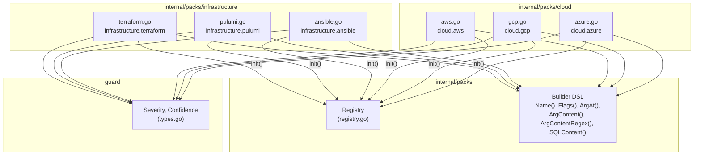
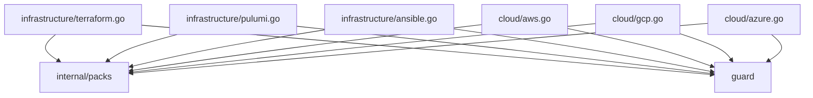
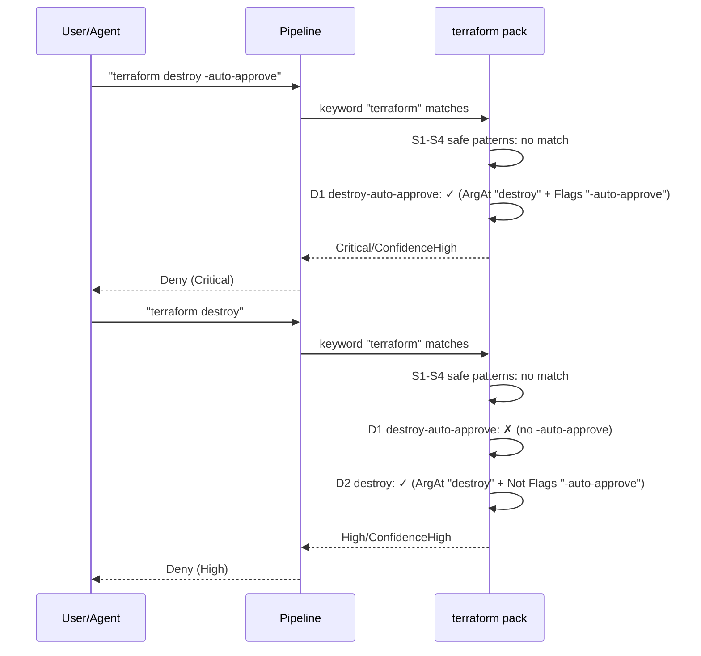
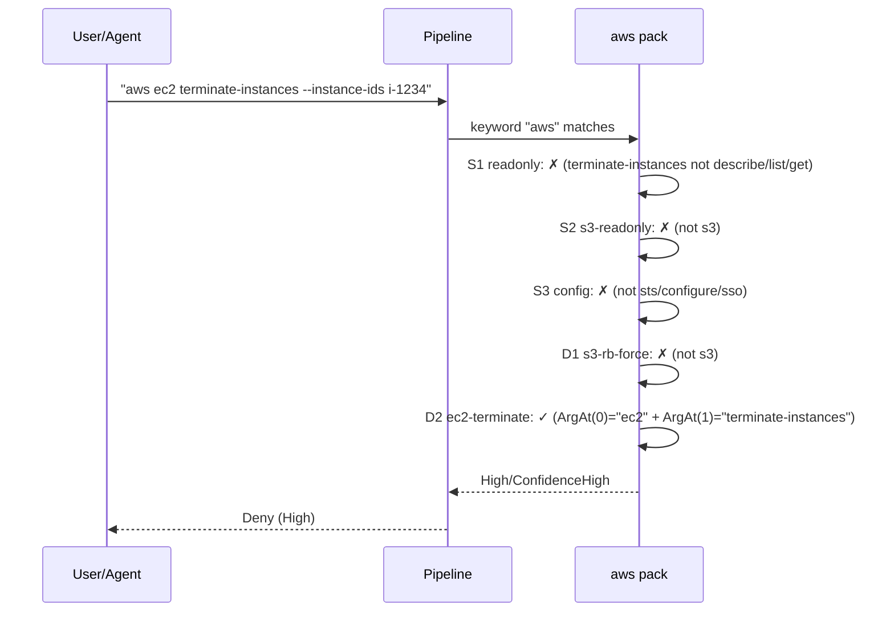

# 03c: Infrastructure & Cloud Packs

**Batch**: 3 (Pattern Packs)
**Depends On**: [02-matching-framework](./02-matching-framework.md), [03a-packs-core](./03a-packs-core.md)
**Blocks**: [05-testing-and-benchmarks](./05-testing-and-benchmarks.md)
**Architecture**: [00-architecture.md](./00-architecture.md) (§3 Layer 3, §5 packs/)
**Plan Index**: [00-plan-index.md](./00-plan-index.md)
**Pack Authoring Guide**: [03a-packs-core.md §4](./03a-packs-core.md)

---

## 1. Summary

This plan defines 6 infrastructure and cloud packs covering the most common
IaC tools and cloud CLIs that LLM coding agents interact with:

1. **`infrastructure.terraform`** — terraform destroy, apply, state, import, taint
2. **`infrastructure.pulumi`** — pulumi destroy, stack rm, cancel
3. **`infrastructure.ansible`** — ansible, ansible-playbook module/shell invocations
4. **`cloud.aws`** — aws CLI service commands (ec2, rds, s3, cloudformation, iam, lambda, etc.)
5. **`cloud.gcp`** — gcloud, gsutil, bq
6. **`cloud.azure`** — az CLI resource group, vm, storage, aks, sql, etc.

**Key design challenges unique to infra/cloud packs:**

- **Subcommand matching**: All 6 packs use multi-level subcommands
  (`terraform destroy`, `aws ec2 terminate-instances`, `gcloud compute
  instances delete`). This requires `ArgAt()` positional matching on
  subcommand arguments — the command name is `terraform`/`aws`/`gcloud`,
  and the action is carried in the first 1-3 positional arguments.
- **All packs are env-sensitive**: Every destructive pattern in all 6 packs
  uses `EnvSensitive: true`. Infrastructure and cloud operations in
  production environments carry significantly higher risk than in
  development/staging.
- **Auto-approve flags**: Both Terraform and Pulumi have auto-approve
  mechanisms (`-auto-approve`, `--yes`, `-y`) that skip confirmation
  prompts. Commands with auto-approve are more dangerous because the
  user has no second chance to abort.
- **AWS breadth**: The AWS CLI has hundreds of service commands. We cover
  the most commonly used destructive operations across EC2, RDS, S3,
  CloudFormation, IAM, Lambda, and ECS. A comprehensive coverage would
  require dozens more patterns — we focus on high-impact operations that
  LLM agents are likely to generate.
- **Ansible module arguments**: Ansible passes module arguments via `-a`
  flag with key=value content (`-a 'state=absent'`). This requires
  flag-value-aware content matching (`SQLContent`) similar to the database
  packs' SQL-content helpers.

**Scope**:
- 6 packs, each with safe + destructive patterns
- All packs follow the pack authoring guide (03a §4)
- 132 golden file entries across all 6 packs
- Per-pattern unit tests with match and near-miss cases
- Reachability tests for every destructive pattern
- Environment escalation tests for all packs (all env-sensitive)

---

## 2. Component Diagram



---

## 3. Import Flow



Each pack file imports only two packages:
- `github.com/dcosson/destructive-command-guard-go/guard` — for `Severity` and `Confidence` constants
- `github.com/dcosson/destructive-command-guard-go/internal/packs` — for `Pack`, `SafePattern`, `DestructivePattern`, and builder functions

---

## 4. Matching Patterns for Infrastructure & Cloud Commands

### 4.1 Subcommand Matching via ArgAt

Infrastructure and cloud CLIs use multi-level subcommands. The command
name is the CLI tool, and the actual operation is carried in positional
arguments:

| Tool | Pattern | Example |
|------|---------|---------|
| terraform | `ArgAt(0, "destroy")` | `terraform destroy` |
| pulumi | `ArgAt(0, "destroy")` | `pulumi destroy` |
| ansible | `Flags("-m") + SQLContent(value)` | `ansible all -m shell -a 'rm -rf /'` |
| aws | `ArgAt(0, "ec2") + ArgAt(1, "terminate-instances")` | `aws ec2 terminate-instances` |
| gcloud | `ArgAt(0, "compute") + ArgAt(1, "instances") + ArgAt(2, "delete")` | `gcloud compute instances delete` |
| az | `ArgAt(0, "vm") + ArgAt(1, "delete")` | `az vm delete` |

For AWS, GCP, and Azure the subcommand depth varies by service (1-3
levels). We use `ArgAt()` at the required depth for each command.

### 4.2 Auto-Approve Flag Escalation

Several IaC tools have auto-approve flags that skip confirmation prompts.
Commands with auto-approve are more dangerous because there's no second
chance. We handle this by creating **separate patterns** for auto-approve
variants at higher severity:

| Tool | Auto-approve flag(s) | Severity without | Severity with |
|------|---------------------|------------------|---------------|
| terraform apply | `-auto-approve` | Medium (D4) | High (D3) |
| terraform destroy | `-auto-approve` | High (D2) | Critical (D1) |
| pulumi destroy | `--yes`, `-y` | High (D2) | Critical (D1) |
| pulumi up | `--yes`, `-y` | Medium (D5) | High (D4) |

For commands that are always destructive (like `terraform destroy`), the
auto-approve flag escalates from High to Critical because it removes
the last safety net.

### 4.3 Ansible Module Argument Matching

Ansible passes module arguments via the `-a` flag with key=value content.
Destructive Ansible patterns match both the module (`-m`) and the argument
content:

```go
// Example: ansible all -m file -a 'state=absent'
packs.And(
    packs.Or(packs.Name("ansible"), packs.Name("ansible-playbook")),
    packs.Flags("-m"),
    packs.SQLContent("file"),
    packs.SQLContent("state=absent"),
)
```

For `ansible-playbook`, destructive intent is often embedded in
`--extra-vars` rather than `-a`:

```go
// Example: ansible-playbook site.yml --extra-vars 'state=absent'
packs.And(
    packs.Name("ansible-playbook"),
    packs.Or(
        packs.SQLContent("state=absent"),
        packs.SQLContent("ensure=absent"),
    ),
)
```

**Limitation**: Ansible playbook content (YAML files) is not inspected.
`ansible-playbook destroy.yml` passes through as "no match" if
`--extra-vars` doesn't contain destructive content. This is the same
class of limitation as `psql -f script.sql` — file content is opaque.

### 4.4 AWS Service Command Breadth

The AWS CLI has hundreds of service-specific destructive commands. We
organize coverage into tiers:

| Tier | Services | Rationale |
|------|----------|-----------|
| **Tier 1 (v1)** | ec2, rds, s3, cloudformation, iam, lambda, ecs | Most commonly used by LLM agents |
| **Tier 2 (v2)** | dynamodb, elasticache, route53, eks, sns, sqs | Frequently used but less commonly destructive |
| **Tier 3 (future)** | All remaining services | Long tail, low LLM frequency |

The `cloud.aws` pack implements Tier 1 in v1 with a design that makes
adding Tier 2 and 3 commands straightforward (same pattern structure,
just more entries).

### 4.5 GCloud Multi-Level Subcommands

GCP commands use 2-3 level subcommands:

| Depth | Pattern | Example |
|-------|---------|---------|
| 2 | `ArgAt(0, "projects") + ArgAt(1, "delete")` | `gcloud projects delete myproject` |
| 3 | `ArgAt(0, "compute") + ArgAt(1, "instances") + ArgAt(2, "delete")` | `gcloud compute instances delete my-vm` |
| 2 | `ArgAt(0, "sql") + ArgAt(1, "instances") + ArgAt(2, "delete")` | `gcloud sql instances delete mydb` |

The `gsutil` tool is a separate command name with its own patterns.

---

## 5. Pack Definitions

### 5.1 `infrastructure.terraform` Pack (`internal/packs/infrastructure/terraform.go`)

**Pack ID**: `infrastructure.terraform`
**Keywords**: `["terraform"]`
**Safe Patterns**: 4
**Destructive Patterns**: 9
**EnvSensitive**: Yes (all 9 destructive patterns)

Terraform manages infrastructure as code. Destructive operations can
destroy entire cloud environments.

```go
var terraformPack = packs.Pack{
    ID:          "infrastructure.terraform",
    Name:        "Terraform",
    Description: "Terraform infrastructure-as-code destructive operations",
    Keywords:    []string{"terraform"},

    Safe: []packs.SafePattern{
        // S1: terraform plan (read-only)
        {
            Name: "terraform-plan-safe",
            Match: packs.And(
                packs.Name("terraform"),
                packs.ArgAt(0, "plan"),
            ),
        },
        // S2: terraform show (read-only)
        {
            Name: "terraform-show-safe",
            Match: packs.And(
                packs.Name("terraform"),
                packs.ArgAt(0, "show"),
            ),
        },
        // S3: terraform init (setup)
        {
            Name: "terraform-init-safe",
            Match: packs.And(
                packs.Name("terraform"),
                packs.ArgAt(0, "init"),
            ),
        },
        // S4: terraform validate, fmt, output, graph, providers, version
        {
            Name: "terraform-readonly-safe",
            Match: packs.And(
                packs.Name("terraform"),
                packs.Or(
                    packs.ArgAt(0, "validate"),
                    packs.ArgAt(0, "fmt"),
                    packs.ArgAt(0, "output"),
                    packs.ArgAt(0, "graph"),
                    packs.ArgAt(0, "providers"),
                    packs.ArgAt(0, "version"),
                    packs.ArgAt(0, "workspace"),
                    packs.ArgAt(0, "state"),
                ),
                // Exclude destructive state/workspace subcommands using
                // positional matching at ArgAt(1) to avoid substring false
                // positives (e.g., "webfarm" containing "rm", "forms"
                // containing "rm"). See R1 P0-1.
                packs.Not(packs.ArgAt(1, "rm")),
                packs.Not(packs.ArgAt(1, "mv")),
                packs.Not(packs.ArgAt(1, "push")),
                packs.Not(packs.ArgAt(1, "delete")),
            ),
        },
    },

    Destructive: []packs.DestructivePattern{
        // ---- Critical ----

        // D1: terraform destroy with -auto-approve (no confirmation prompt)
        {
            Name: "terraform-destroy-auto-approve",
            Match: packs.And(
                packs.Name("terraform"),
                packs.ArgAt(0, "destroy"),
                packs.Flags("-auto-approve"),
            ),
            Severity:     guard.Critical,
            Confidence:   guard.ConfidenceHigh,
            Reason:       "terraform destroy -auto-approve destroys all managed infrastructure without confirmation",
            Remediation:  "Remove -auto-approve to get a confirmation prompt. Run terraform plan -destroy first to review what will be destroyed.",
            EnvSensitive: true,
        },

        // ---- High ----

        // D2: terraform destroy (with confirmation prompt)
        {
            Name: "terraform-destroy",
            Match: packs.And(
                packs.Name("terraform"),
                packs.ArgAt(0, "destroy"),
                packs.Not(packs.Flags("-auto-approve")),
            ),
            Severity:     guard.High,
            Confidence:   guard.ConfidenceHigh,
            Reason:       "terraform destroy plans to destroy all managed infrastructure",
            Remediation:  "Run terraform plan -destroy first to review what will be destroyed.",
            EnvSensitive: true,
        },
        // D3: terraform apply -auto-approve (skip confirmation)
        {
            Name: "terraform-apply-auto-approve",
            Match: packs.And(
                packs.Name("terraform"),
                packs.ArgAt(0, "apply"),
                packs.Flags("-auto-approve"),
            ),
            Severity:     guard.High,
            Confidence:   guard.ConfidenceHigh,
            Reason:       "terraform apply -auto-approve applies changes without confirmation — may create, modify, or destroy resources",
            Remediation:  "Remove -auto-approve. Run terraform plan first, then apply with review.",
            EnvSensitive: true,
        },

        // ---- Medium ----

        // D4: terraform apply (with confirmation prompt)
        {
            Name: "terraform-apply",
            Match: packs.And(
                packs.Name("terraform"),
                packs.ArgAt(0, "apply"),
                packs.Not(packs.Flags("-auto-approve")),
            ),
            Severity:     guard.Medium,
            Confidence:   guard.ConfidenceHigh,
            Reason:       "terraform apply modifies infrastructure — may create, update, or destroy resources",
            Remediation:  "Run terraform plan first to review the execution plan.",
            EnvSensitive: true,
        },
        // D5: terraform state rm (remove resource from state without destroying)
        {
            Name: "terraform-state-rm",
            Match: packs.And(
                packs.Name("terraform"),
                packs.ArgAt(0, "state"),
                packs.ArgAt(1, "rm"),
            ),
            Severity:     guard.Medium,
            Confidence:   guard.ConfidenceHigh,
            Reason:       "terraform state rm removes a resource from Terraform state — the real resource continues to exist but Terraform no longer manages it",
            Remediation:  "Ensure you intend to orphan this resource. Use terraform state list first to verify the resource address.",
            EnvSensitive: true,
        },
        // D6: terraform state mv (move resource in state)
        {
            Name: "terraform-state-mv",
            Match: packs.And(
                packs.Name("terraform"),
                packs.ArgAt(0, "state"),
                packs.ArgAt(1, "mv"),
            ),
            Severity:     guard.Medium,
            Confidence:   guard.ConfidenceHigh,
            Reason:       "terraform state mv moves a resource in state — incorrect address may cause Terraform to create a duplicate or destroy the original",
            Remediation:  "Double-check source and destination addresses. Backup state first with terraform state pull.",
            EnvSensitive: true,
        },
        // D7: terraform state push (overwrite remote state)
        {
            Name: "terraform-state-push",
            Match: packs.And(
                packs.Name("terraform"),
                packs.ArgAt(0, "state"),
                packs.ArgAt(1, "push"),
            ),
            Severity:     guard.Medium,
            Confidence:   guard.ConfidenceHigh,
            Reason:       "terraform state push overwrites remote state with a local copy — can cause resource orphaning or duplication",
            Remediation:  "Verify the local state is current. Backup remote state with terraform state pull first.",
            EnvSensitive: true,
        },
        // D8: terraform workspace delete (permanently removes workspace state)
        {
            Name: "terraform-workspace-delete",
            Match: packs.And(
                packs.Name("terraform"),
                packs.ArgAt(0, "workspace"),
                packs.ArgAt(1, "delete"),
            ),
            Severity:     guard.Medium,
            Confidence:   guard.ConfidenceHigh,
            Reason:       "terraform workspace delete permanently removes a workspace and its state file — may orphan resources",
            Remediation:  "Run terraform destroy in the workspace first to clean up resources.",
            EnvSensitive: true,
        },
        // D9: terraform taint (mark resource for recreation)
        {
            Name: "terraform-taint",
            Match: packs.And(
                packs.Name("terraform"),
                packs.ArgAt(0, "taint"),
            ),
            Severity:     guard.Medium,
            Confidence:   guard.ConfidenceHigh,
            Reason:       "terraform taint marks a resource for destruction and recreation on next apply",
            Remediation:  "Consider terraform plan first. Use terraform untaint to reverse if needed.",
            EnvSensitive: true,
        },
    },
}
```

#### 5.1.1 Terraform Notes

- **`terraform import`**: Currently classified as **Indeterminate** (no
  explicit safe/destructive match). This is acceptable in v1: import itself
  does not destroy infrastructure, but prompting in interactive policy is a
  conservative default until an explicit safe matcher is added.
- **`terraform workspace delete`**: Covered by D8 at Medium severity.
  Workspace deletion permanently removes state files, which could orphan
  resources managed by that workspace. S4 excludes it via
  `Not(ArgAt(1, "delete"))`.
  Severity rationale: this is state-container deletion without immediate
  resource API deletion, so it remains below explicit destroy operations.
  By contrast, `pulumi stack rm` is High because stack removal in Pulumi
  also removes stack metadata/history that is central to recovery workflows.
- **`terraform state push`**: Covered by D7 at Medium severity.
  Overwrites remote state with local copy — can cause resource orphaning
  or duplication if the local state is stale. S4 excludes it via
  `Not(ArgAt(1, "push"))`.
- **`-target` flag**: `terraform destroy -target=module.vpc` is scoped
  destruction. We don't distinguish targeted vs. full destroy — both
  match the destructive pattern. The severity is the same because
  targeted destruction of critical infrastructure can be equally
  catastrophic.
- **`terraform force-unlock`**: Not covered in v1. Removes state lock,
  which could allow concurrent modifications. Low severity, deferred.

---

### 5.2 `infrastructure.pulumi` Pack (`internal/packs/infrastructure/pulumi.go`)

**Pack ID**: `infrastructure.pulumi`
**Keywords**: `["pulumi"]`
**Safe Patterns**: 3
**Destructive Patterns**: 7
**EnvSensitive**: Yes (all 7 destructive patterns)

Pulumi is similar to Terraform but uses general-purpose programming
languages for infrastructure definitions.

```go
var pulumiPack = packs.Pack{
    ID:          "infrastructure.pulumi",
    Name:        "Pulumi",
    Description: "Pulumi infrastructure-as-code destructive operations",
    Keywords:    []string{"pulumi"},

    Safe: []packs.SafePattern{
        // S1: pulumi preview (read-only, like terraform plan)
        {
            Name: "pulumi-preview-safe",
            Match: packs.And(
                packs.Name("pulumi"),
                packs.ArgAt(0, "preview"),
            ),
        },
        // S2: pulumi stack ls, stack output, stack tag (read-only)
        {
            Name: "pulumi-stack-readonly-safe",
            Match: packs.And(
                packs.Name("pulumi"),
                packs.ArgAt(0, "stack"),
                packs.Or(
                    packs.ArgAt(1, "ls"),
                    packs.ArgAt(1, "output"),
                    packs.ArgAt(1, "tag"),
                    packs.ArgAt(1, "export"),
                    packs.ArgAt(1, "history"),
                ),
            ),
        },
        // S3: pulumi config, login, logout, whoami, version, about, plugin
        {
            Name: "pulumi-readonly-safe",
            Match: packs.And(
                packs.Name("pulumi"),
                packs.Or(
                    packs.ArgAt(0, "config"),
                    packs.ArgAt(0, "login"),
                    packs.ArgAt(0, "logout"),
                    packs.ArgAt(0, "whoami"),
                    packs.ArgAt(0, "version"),
                    packs.ArgAt(0, "about"),
                    packs.ArgAt(0, "plugin"),
                ),
            ),
        },
    },

    Destructive: []packs.DestructivePattern{
        // ---- Critical ----

        // D1: pulumi destroy --yes (no confirmation)
        {
            Name: "pulumi-destroy-yes",
            Match: packs.And(
                packs.Name("pulumi"),
                packs.ArgAt(0, "destroy"),
                packs.Or(
                    packs.Flags("--yes"),
                    packs.Flags("-y"),
                ),
            ),
            Severity:     guard.Critical,
            Confidence:   guard.ConfidenceHigh,
            Reason:       "pulumi destroy --yes destroys all managed infrastructure without confirmation",
            Remediation:  "Remove --yes to get a confirmation prompt. Run pulumi preview --diff first.",
            EnvSensitive: true,
        },

        // ---- High ----

        // D2: pulumi destroy (with confirmation prompt)
        {
            Name: "pulumi-destroy",
            Match: packs.And(
                packs.Name("pulumi"),
                packs.ArgAt(0, "destroy"),
                packs.Not(packs.Flags("--yes")),
                packs.Not(packs.Flags("-y")),
            ),
            Severity:     guard.High,
            Confidence:   guard.ConfidenceHigh,
            Reason:       "pulumi destroy plans to destroy all managed infrastructure",
            Remediation:  "Run pulumi preview --diff first to review what will be destroyed.",
            EnvSensitive: true,
        },
        // D3: pulumi stack rm (delete a stack and its state)
        {
            Name: "pulumi-stack-rm",
            Match: packs.And(
                packs.Name("pulumi"),
                packs.ArgAt(0, "stack"),
                packs.ArgAt(1, "rm"),
            ),
            Severity:     guard.High,
            Confidence:   guard.ConfidenceHigh,
            Reason:       "pulumi stack rm permanently deletes a stack and its deployment history — orphans any resources still in the stack",
            Remediation:  "Run pulumi destroy first to clean up resources, then remove the stack.",
            EnvSensitive: true,
        },

        // D4: pulumi up --yes (auto-approve)
        {
            Name: "pulumi-up-yes",
            Match: packs.And(
                packs.Name("pulumi"),
                packs.ArgAt(0, "up"),
                packs.Or(
                    packs.Flags("--yes"),
                    packs.Flags("-y"),
                ),
            ),
            Severity:     guard.High,
            Confidence:   guard.ConfidenceHigh,
            Reason:       "pulumi up --yes deploys changes without confirmation — may create, modify, or destroy resources",
            Remediation:  "Remove --yes. Run pulumi preview first, then deploy with review.",
            EnvSensitive: true,
        },

        // ---- Medium ----

        // D5: pulumi up (with confirmation prompt)
        {
            Name: "pulumi-up",
            Match: packs.And(
                packs.Name("pulumi"),
                packs.ArgAt(0, "up"),
                packs.Not(packs.Flags("--yes")),
                packs.Not(packs.Flags("-y")),
            ),
            Severity:     guard.Medium,
            Confidence:   guard.ConfidenceHigh,
            Reason:       "pulumi up modifies infrastructure — may create, update, or destroy resources",
            Remediation:  "Run pulumi preview first to review the changes.",
            EnvSensitive: true,
        },
        // D7: pulumi cancel (cancel an in-progress update)
        {
            Name: "pulumi-cancel",
            Match: packs.And(
                packs.Name("pulumi"),
                packs.ArgAt(0, "cancel"),
            ),
            Severity:     guard.Medium,
            Confidence:   guard.ConfidenceHigh,
            Reason:       "pulumi cancel aborts an in-progress update — may leave resources in an inconsistent state",
            Remediation:  "Consider waiting for the update to complete. Cancellation may require manual state cleanup.",
            EnvSensitive: true,
        },
    },
}
```

#### 5.2.1 Pulumi Notes

- **`pulumi up` without `--yes`**: Classified as Medium/ConfidenceHigh
  (D5), matching `terraform apply`'s treatment. Both deploy infrastructure
  changes with interactive confirmation, but in non-interactive LLM agent
  contexts the prompt may not function correctly. `pulumi up --yes` (D4)
  escalates to High, matching the auto-approve severity split pattern.
- **`pulumi refresh`**: Synchronizes state with real infrastructure.
  Not destructive in itself (doesn't create/destroy resources), but can
  surface drift. Classified as safe.
- **`pulumi stack init`**: Creates a new empty stack. Safe — no resources
  affected.
- **`pulumi import`**: Imports existing resources into state. Safe —
  doesn't modify infrastructure.

---

### 5.3 `infrastructure.ansible` Pack (`internal/packs/infrastructure/ansible.go`)

**Pack ID**: `infrastructure.ansible`
**Keywords**: `["ansible", "ansible-playbook"]`
**Safe Patterns**: 2
**Destructive Patterns**: 7
**EnvSensitive**: Yes (all 7 destructive patterns)

Ansible executes commands and modules on remote hosts. Destructive
operations can affect entire fleets of servers.

```go
var ansiblePack = packs.Pack{
    ID:          "infrastructure.ansible",
    Name:        "Ansible",
    Description: "Ansible configuration management destructive operations",
    Keywords:    []string{"ansible", "ansible-playbook"},

    Safe: []packs.SafePattern{
        // S1: ansible with gathering/info modules
        {
            Name: "ansible-gather-safe",
            Match: packs.And(
                packs.Name("ansible"),
                packs.Or(
                    packs.Flags("-m"),
                    packs.Flags("--module-name"),
                ),
                // Only truly safe information-gathering modules.
                // "command" module intentionally excluded — it can execute
                // arbitrary commands across fleets and cannot be safely
                // allowlisted with a blocklist approach. See R1 P0-2.
                // Anchored regex ensures exact module-name match.
                // Without anchors, safe tokens in -a payloads could
                // satisfy the safe matcher and short-circuit destructive
                // detection (e.g., `ansible -m shell -a 'rm /tmp/setup'`).
                packs.Or(
                    packs.SQLContentRegex("^setup$"),
                    packs.SQLContentRegex("^gather_facts$"),
                    packs.SQLContentRegex("^ping$"),
                    packs.SQLContentRegex("^debug$"),
                    packs.SQLContentRegex("^stat$"),
                ),
            ),
        },
        // S2: ansible --list-hosts, --syntax-check, --check (dry-run)
        {
            Name: "ansible-dryrun-safe",
            Match: packs.And(
                packs.Or(
                    packs.Name("ansible"),
                    packs.Name("ansible-playbook"),
                ),
                packs.Or(
                    packs.Flags("--list-hosts"),
                    packs.Flags("--list-tasks"),
                    packs.Flags("--syntax-check"),
                    packs.Flags("--check"),
                    packs.Flags("-C"),
                ),
            ),
        },
    },

    Destructive: []packs.DestructivePattern{
        // ---- Critical ----

        // D1: ansible with shell/command module running destructive commands
        {
            Name: "ansible-shell-destructive",
            Match: packs.And(
                packs.Name("ansible"),
                packs.Or(
                    packs.SQLContent("shell"),
                    packs.SQLContent("command"),
                    packs.SQLContent("raw"),
                ),
                packs.Or(
                    packs.SQLContent(`rm\s+-`),
                    packs.SQLContent("dd "),
                    packs.SQLContent("mkfs"),
                    packs.SQLContent("> /dev/"),
                ),
            ),
            Severity:     guard.Critical,
            Confidence:   guard.ConfidenceMedium,
            Reason:       "Ansible shell/command module running destructive command across fleet — affects all targeted hosts",
            Remediation:  "Use --limit to restrict to a single host. Use --check for dry-run first.",
            EnvSensitive: true,
        },

        // ---- High ----

        // D2: ansible file module with state=absent (delete files/dirs)
        {
            Name: "ansible-file-absent",
            Match: packs.And(
                packs.Name("ansible"),
                packs.Or(
                    packs.SQLContent("file"),
                ),
                packs.SQLContent("state=absent"),
            ),
            Severity:     guard.High,
            Confidence:   guard.ConfidenceHigh,
            Reason:       "Ansible file module with state=absent deletes files or directories on all targeted hosts",
            Remediation:  "Use --limit to restrict to a single host. Use --check for dry-run first.",
            EnvSensitive: true,
        },
        // D3: ansible service module with state=stopped
        {
            Name: "ansible-service-stopped",
            Match: packs.And(
                packs.Name("ansible"),
                packs.SQLContent("service"),
                packs.SQLContent("state=stopped"),
            ),
            Severity:     guard.High,
            Confidence:   guard.ConfidenceHigh,
            Reason:       "Ansible service module with state=stopped stops services on all targeted hosts",
            Remediation:  "Use --limit to restrict to a single host. Use --check for dry-run first.",
            EnvSensitive: true,
        },
        // D4: ansible-playbook with --extra-vars containing destructive state
        {
            Name: "ansible-playbook-destructive-vars",
            Match: packs.And(
                packs.Name("ansible-playbook"),
                packs.Or(
                    packs.SQLContent("state=absent"),
                    packs.SQLContent("ensure=absent"),
                    packs.SQLContent("state=destroyed"),
                    packs.SQLContent("state=terminated"),
                ),
            ),
            Severity:     guard.High,
            Confidence:   guard.ConfidenceMedium,
            Reason:       "Ansible playbook invoked with destructive state variables — may delete or terminate resources",
            Remediation:  "Run with --check first. Verify --limit restricts to intended hosts.",
            EnvSensitive: true,
        },

        // ---- Medium ----

        // D5: ansible user module with state=absent (delete users)
        {
            Name: "ansible-user-absent",
            Match: packs.And(
                packs.Name("ansible"),
                packs.SQLContent("user"),
                packs.SQLContent("state=absent"),
            ),
            Severity:     guard.Medium,
            Confidence:   guard.ConfidenceHigh,
            Reason:       "Ansible user module with state=absent deletes user accounts on all targeted hosts",
            Remediation:  "Use --limit to restrict to a single host. Use --check for dry-run first.",
            EnvSensitive: true,
        },
        // D6: ansible-playbook without --check (any playbook execution)
        {
            Name: "ansible-playbook-run",
            Match: packs.And(
                packs.Name("ansible-playbook"),
                packs.Not(packs.Flags("--check")),
                packs.Not(packs.Flags("-C")),
                packs.Not(packs.Flags("--syntax-check")),
                packs.Not(packs.Flags("--list-hosts")),
                packs.Not(packs.Flags("--list-tasks")),
            ),
            Severity:     guard.Medium,
            Confidence:   guard.ConfidenceLow,
            Reason:       "Ansible playbook execution modifies infrastructure — playbook content not inspected",
            Remediation:  "Run with --check first for a dry-run. Review playbook content before execution.",
            EnvSensitive: true,
        },
        // D7: ansible with package/yum/apt module and state=absent
        {
            Name: "ansible-package-absent",
            Match: packs.And(
                packs.Name("ansible"),
                packs.Or(
                    packs.SQLContent("package"),
                    packs.SQLContent("yum"),
                    packs.SQLContent("apt"),
                    packs.SQLContent("dnf"),
                ),
                packs.SQLContent("state=absent"),
            ),
            Severity:     guard.Medium,
            Confidence:   guard.ConfidenceHigh,
            Reason:       "Ansible package module with state=absent uninstalls packages on all targeted hosts",
            Remediation:  "Use --limit to restrict to a single host. Use --check for dry-run first.",
            EnvSensitive: true,
        },
    },
}
```

#### 5.3.1 Ansible Notes

- **Playbook content not inspected**: `ansible-playbook site.yml` is
  classified as Medium/ConfidenceLow because we can't inspect the YAML
  content. This is analogous to `psql -f script.sql`. The pattern catches
  any playbook execution that isn't a dry-run.
- **`ansible all` vs specific hosts**: We don't distinguish between
  `ansible all` and `ansible webservers`. Both get the same severity.
  The `all` pattern is marginally more dangerous but the fleet-wide risk
  exists regardless of host group.
- **`ansible-galaxy`**: Not covered — installs roles/collections from
  Galaxy. Could be a supply chain risk but not directly destructive.
- **`ansible-vault`**: Not covered — encrypts/decrypts secrets files.
  `ansible-vault decrypt` could expose secrets but doesn't destroy data.
- **`SQLContent("file")` false positive (accepted)**: D2 uses
  `SQLContent("file")` which does broad content matching over args and
  selected flag values. If a resource value
  contains "file" (e.g., "profile", "logfile", "dockerfile"), D2 may
  false-match at High instead of the correct lower-severity pattern.
  This is accepted over-classification — the command IS flagged as
  destructive, just by the wrong pattern at a higher severity. Not a
  false negative.
- **Module names in `-m` vs `-a`**: The module name comes after `-m`
  (e.g., `-m file -a 'state=absent'`). In extracted commands, `file`
  is typically the value of `-m`, and `state=absent` is typically the
  value of `-a` or `--extra-vars`. These patterns intentionally use
  `SQLContent(...)` / `SQLContentRegex(...)` (flag-value-aware) rather
  than plain `ArgContent(...)` so module/argument content is detected
  when carried in flags.
- **Safe-module anchoring requirement**: Safe-module matchers (S1) MUST
  use anchored regex (`^module_name$`) via `SQLContentRegex(...)` to
  prevent safe tokens appearing inside `-a` payloads from satisfying
  the safe matcher. For example, `ansible -m shell -a 'rm /tmp/setup'`
  must NOT match `ansible-gather-safe` — the unanchored substring
  "setup" in the `-a` payload would otherwise short-circuit destructive
  detection. Destructive matchers use unanchored `SQLContent(...)` which
  may over-classify (acceptable) but never under-classify.

---

### 5.4 `cloud.aws` Pack (`internal/packs/cloud/aws.go`)

**Pack ID**: `cloud.aws`
**Keywords**: `["aws"]`
**Safe Patterns**: 3
**Destructive Patterns**: 15
**EnvSensitive**: Yes (all 15 destructive patterns)

The AWS CLI is the most complex cloud CLI with hundreds of service
commands. We cover Tier 1 services: EC2, RDS, S3, CloudFormation, IAM,
Lambda, and ECS.

```go
var awsPack = packs.Pack{
    ID:          "cloud.aws",
    Name:        "AWS CLI",
    Description: "AWS CLI destructive operations across EC2, RDS, S3, CloudFormation, IAM, Lambda, ECS",
    Keywords:    []string{"aws"},

    Safe: []packs.SafePattern{
        // S1: aws describe/list/get operations (read-only)
        {
            Name: "aws-readonly-safe",
            Match: packs.And(
                packs.Name("aws"),
                packs.Or(
                    packs.ArgContentRegex(`^describe-`),
                    packs.ArgContentRegex(`^list-`),
                    packs.ArgContentRegex(`^get-`),
                    packs.ArgAt(1, "ls"),
                ),
                // Defense-in-depth: exclude destructive action subcommands
                // to prevent false safe matches when resource names or flag
                // values happen to start with "describe-"/"list-"/"get-".
                // See R1 P2-3.
                packs.Not(packs.ArgContentRegex(`^terminate-|^delete-|^stop-|^remove-`)),
            ),
        },
        // S2: aws s3 ls, aws s3 cp (read/copy operations)
        {
            Name: "aws-s3-readonly-safe",
            Match: packs.And(
                packs.Name("aws"),
                packs.ArgAt(0, "s3"),
                packs.Or(
                    packs.ArgAt(1, "ls"),
                    packs.ArgAt(1, "cp"),
                    packs.ArgAt(1, "sync"),
                    packs.ArgAt(1, "presign"),
                    packs.ArgAt(1, "mb"),
                ),
                packs.Not(packs.Flags("--delete")),
            ),
        },
        // S3: aws sts, configure, sso
        {
            Name: "aws-config-safe",
            Match: packs.And(
                packs.Name("aws"),
                packs.Or(
                    packs.ArgAt(0, "sts"),
                    packs.ArgAt(0, "configure"),
                    packs.ArgAt(0, "sso"),
                ),
            ),
        },
    },

    Destructive: []packs.DestructivePattern{
        // ---- Critical ----

        // D1: aws s3 rb --force (remove bucket and all contents)
        {
            Name: "aws-s3-rb-force",
            Match: packs.And(
                packs.Name("aws"),
                packs.ArgAt(0, "s3"),
                packs.ArgAt(1, "rb"),
                packs.Flags("--force"),
            ),
            Severity:     guard.Critical,
            Confidence:   guard.ConfidenceHigh,
            Reason:       "aws s3 rb --force permanently deletes an S3 bucket and all its contents",
            Remediation:  "Verify bucket name. Consider enabling versioning and setting lifecycle policies instead.",
            EnvSensitive: true,
        },

        // ---- High ----

        // D2: aws ec2 terminate-instances
        {
            Name: "aws-ec2-terminate",
            Match: packs.And(
                packs.Name("aws"),
                packs.ArgAt(0, "ec2"),
                packs.ArgAt(1, "terminate-instances"),
            ),
            Severity:     guard.High,
            Confidence:   guard.ConfidenceHigh,
            Reason:       "aws ec2 terminate-instances permanently destroys EC2 instances and their ephemeral storage",
            Remediation:  "Verify instance IDs. Consider stopping instead of terminating. Enable termination protection.",
            EnvSensitive: true,
        },
        // D3: aws rds delete-db-instance
        {
            Name: "aws-rds-delete-instance",
            Match: packs.And(
                packs.Name("aws"),
                packs.ArgAt(0, "rds"),
                packs.ArgAt(1, "delete-db-instance"),
            ),
            Severity:     guard.High,
            Confidence:   guard.ConfidenceHigh,
            Reason:       "aws rds delete-db-instance permanently deletes an RDS database instance",
            Remediation:  "Create a final snapshot first with --final-db-snapshot-identifier. Verify the instance identifier.",
            EnvSensitive: true,
        },
        // D4: aws rds delete-db-cluster
        {
            Name: "aws-rds-delete-cluster",
            Match: packs.And(
                packs.Name("aws"),
                packs.ArgAt(0, "rds"),
                packs.ArgAt(1, "delete-db-cluster"),
            ),
            Severity:     guard.High,
            Confidence:   guard.ConfidenceHigh,
            Reason:       "aws rds delete-db-cluster permanently deletes an RDS Aurora cluster and all instances",
            Remediation:  "Create a final snapshot first. Verify the cluster identifier.",
            EnvSensitive: true,
        },
        // D5: aws cloudformation delete-stack
        // Escalated to Critical for cross-cloud consistency with
        // gcloud-projects-delete and az-group-delete — all three delete
        // a "container of resources" with cascading destruction. See R1 IC-P1.2.
        {
            Name: "aws-cfn-delete-stack",
            Match: packs.And(
                packs.Name("aws"),
                packs.ArgAt(0, "cloudformation"),
                packs.ArgAt(1, "delete-stack"),
            ),
            Severity:     guard.Critical,
            Confidence:   guard.ConfidenceHigh,
            Reason:       "aws cloudformation delete-stack destroys all resources managed by the stack — VPCs, RDS instances, EC2 instances, S3 buckets, etc.",
            Remediation:  "Review the stack's resources first with aws cloudformation list-stack-resources.",
            EnvSensitive: true,
        },
        // D6: aws iam delete-role, delete-user, delete-policy
        {
            Name: "aws-iam-delete",
            Match: packs.And(
                packs.Name("aws"),
                packs.ArgAt(0, "iam"),
                packs.Or(
                    packs.ArgAt(1, "delete-role"),
                    packs.ArgAt(1, "delete-user"),
                    packs.ArgAt(1, "delete-policy"),
                    packs.ArgAt(1, "delete-group"),
                ),
            ),
            Severity:     guard.High,
            Confidence:   guard.ConfidenceHigh,
            Reason:       "aws iam delete permanently removes IAM identities or policies — may break service access",
            Remediation:  "Verify the resource is not in use by any services or applications.",
            EnvSensitive: true,
        },
        // D7: aws lambda delete-function
        {
            Name: "aws-lambda-delete",
            Match: packs.And(
                packs.Name("aws"),
                packs.ArgAt(0, "lambda"),
                packs.ArgAt(1, "delete-function"),
            ),
            Severity:     guard.High,
            Confidence:   guard.ConfidenceHigh,
            Reason:       "aws lambda delete-function permanently deletes a Lambda function and all its versions",
            Remediation:  "Verify the function name. Consider disabling instead of deleting.",
            EnvSensitive: true,
        },
        // D8: aws ecs delete-service
        {
            Name: "aws-ecs-delete-service",
            Match: packs.And(
                packs.Name("aws"),
                packs.ArgAt(0, "ecs"),
                packs.ArgAt(1, "delete-service"),
            ),
            Severity:     guard.High,
            Confidence:   guard.ConfidenceHigh,
            Reason:       "aws ecs delete-service removes an ECS service and stops its running tasks",
            Remediation:  "Scale service to 0 first with update-service --desired-count 0, then delete.",
            EnvSensitive: true,
        },
        // D9: aws ecs delete-cluster
        {
            Name: "aws-ecs-delete-cluster",
            Match: packs.And(
                packs.Name("aws"),
                packs.ArgAt(0, "ecs"),
                packs.ArgAt(1, "delete-cluster"),
            ),
            Severity:     guard.High,
            Confidence:   guard.ConfidenceHigh,
            Reason:       "aws ecs delete-cluster permanently deletes an ECS cluster",
            Remediation:  "Deregister all container instances and delete all services first.",
            EnvSensitive: true,
        },

        // ---- Medium ----

        // D10: aws s3 rm --recursive (delete all objects in a path)
        {
            Name: "aws-s3-rm-recursive",
            Match: packs.And(
                packs.Name("aws"),
                packs.ArgAt(0, "s3"),
                packs.ArgAt(1, "rm"),
                packs.Flags("--recursive"),
            ),
            Severity:     guard.Medium,
            Confidence:   guard.ConfidenceHigh,
            Reason:       "aws s3 rm --recursive deletes all objects under the specified S3 prefix",
            Remediation:  "Verify the S3 path. Consider using --dryrun first to see what would be deleted.",
            EnvSensitive: true,
        },
        // D11: aws s3 rb (remove bucket without --force — must be empty)
        {
            Name: "aws-s3-rb",
            Match: packs.And(
                packs.Name("aws"),
                packs.ArgAt(0, "s3"),
                packs.ArgAt(1, "rb"),
                packs.Not(packs.Flags("--force")),
            ),
            Severity:     guard.Medium,
            Confidence:   guard.ConfidenceHigh,
            Reason:       "aws s3 rb deletes an S3 bucket (must be empty — less dangerous than --force)",
            Remediation:  "Verify the bucket is intentionally empty and the name is correct.",
            EnvSensitive: true,
        },
        // D12: aws s3 rm (single object deletion)
        {
            Name: "aws-s3-rm",
            Match: packs.And(
                packs.Name("aws"),
                packs.ArgAt(0, "s3"),
                packs.ArgAt(1, "rm"),
                packs.Not(packs.Flags("--recursive")),
            ),
            Severity:     guard.Medium,
            Confidence:   guard.ConfidenceHigh,
            Reason:       "aws s3 rm deletes an S3 object",
            Remediation:  "Verify the S3 object path. Consider enabling versioning to allow recovery.",
            EnvSensitive: true,
        },
        // D13: aws ec2 stop-instances
        {
            Name: "aws-ec2-stop",
            Match: packs.And(
                packs.Name("aws"),
                packs.ArgAt(0, "ec2"),
                packs.ArgAt(1, "stop-instances"),
            ),
            Severity:     guard.Medium,
            Confidence:   guard.ConfidenceHigh,
            Reason:       "aws ec2 stop-instances stops running EC2 instances — causes downtime",
            Remediation:  "Verify instance IDs. Consider if a reboot would suffice.",
            EnvSensitive: true,
        },
        // D14: aws s3 sync --delete (delete files at destination not in source)
        {
            Name: "aws-s3-sync-delete",
            Match: packs.And(
                packs.Name("aws"),
                packs.ArgAt(0, "s3"),
                packs.Or(
                    packs.ArgAt(1, "sync"),
                    packs.ArgAt(1, "cp"),
                ),
                packs.Flags("--delete"),
            ),
            Severity:     guard.Medium,
            Confidence:   guard.ConfidenceHigh,
            Reason:       "aws s3 sync --delete removes files at the destination that don't exist at the source",
            Remediation:  "Use --dryrun first to see what would be deleted.",
            EnvSensitive: true,
        },
        // D15: aws s3 mv (move/rename — copy-then-delete)
        {
            Name: "aws-s3-mv",
            Match: packs.And(
                packs.Name("aws"),
                packs.ArgAt(0, "s3"),
                packs.ArgAt(1, "mv"),
            ),
            Severity:     guard.Medium,
            Confidence:   guard.ConfidenceHigh,
            Reason:       "aws s3 mv moves S3 objects — the source object is deleted after copying to the destination",
            Remediation:  "Verify source and destination paths. Use aws s3 cp if you want to keep the source.",
            EnvSensitive: true,
        },
    },
}
```

#### 5.4.1 AWS Notes

- **Service breadth**: The AWS CLI has 200+ services. We cover 7 Tier 1
  services. Additional services can be added following the same pattern
  (`ArgAt(0, service) + ArgAt(1, action)`).
- **`--no-cli-pager`**: Not relevant to destructiveness. Ignored.
- **`aws s3api`**: Lower-level S3 API (e.g., `delete-object`,
  `delete-bucket`). Not covered in v1. The `aws s3` high-level commands
  are what LLM agents typically generate.
- **`aws ec2 modify-instance-attribute`**: Can disable termination
  protection. Not directly destructive but enables destructive
  operations. Not covered in v1.
- **`aws ec2 run-instances`**: Creates resources, not destructive.
  Not covered.
- **`--profile` flag**: We don't inspect `--profile` values for
  environment detection. Environment detection uses `AWS_PROFILE` env
  var (handled by the env detection module in plan 02).
- **`aws s3 rm` without `--recursive`**: Classified as Medium because
  it deletes a single S3 object. With `--recursive`, it could delete
  thousands of objects.
- **`--dryrun` flag**: AWS commands with `--dryrun` should ideally be
  safe, but we don't currently add `Not(Flags("--dryrun"))` to
  destructive patterns. This is a known over-classification that errs
  on the side of caution. Could be refined in v2.

---

### 5.5 `cloud.gcp` Pack (`internal/packs/cloud/gcp.go`)

**Pack ID**: `cloud.gcp`
**Keywords**: `["gcloud", "gsutil", "bq"]`
**Safe Patterns**: 3
**Destructive Patterns**: 11
**EnvSensitive**: Yes (all 11 destructive patterns)

GCP uses `gcloud` for most services, `gsutil` for Cloud Storage, and
`bq` for BigQuery.

```go
var gcpPack = packs.Pack{
    ID:          "cloud.gcp",
    Name:        "Google Cloud",
    Description: "GCP destructive operations via gcloud, gsutil, and bq",
    Keywords:    []string{"gcloud", "gsutil", "bq"},

    Safe: []packs.SafePattern{
        // S1: gcloud describe/list/info operations
        {
            Name: "gcloud-readonly-safe",
            Match: packs.And(
                packs.Name("gcloud"),
                packs.Or(
                    packs.ArgContentRegex(`\bdescribe\b`),
                    packs.ArgContentRegex(`\blist\b`),
                    packs.ArgContentRegex(`\binfo\b`),
                    packs.ArgAt(0, "config"),
                    packs.ArgAt(0, "auth"),
                    packs.ArgAt(0, "version"),
                ),
                // Guard against resource names containing "list"/"describe"/
                // "info" with word boundaries (e.g., "list-replica",
                // "my-describe-project"). Mirrors Azure S1's approach.
                // See R1 P0-3.
                packs.Not(packs.ArgContentRegex(`\bdelete\b`)),
            ),
        },
        // S2: gsutil ls, gsutil cat, gsutil stat
        {
            Name: "gsutil-readonly-safe",
            Match: packs.And(
                packs.Name("gsutil"),
                packs.Or(
                    packs.ArgAt(0, "ls"),
                    packs.ArgAt(0, "cat"),
                    packs.ArgAt(0, "stat"),
                    packs.ArgAt(0, "du"),
                    packs.ArgAt(0, "hash"),
                    packs.ArgAt(0, "cp"),
                    packs.ArgAt(0, "rsync"),
                ),
                packs.Not(packs.Flags("-d")),
            ),
        },
        // S3: bq show, bq ls, bq head
        {
            Name: "bq-readonly-safe",
            Match: packs.And(
                packs.Name("bq"),
                packs.Or(
                    packs.ArgAt(0, "show"),
                    packs.ArgAt(0, "ls"),
                    packs.ArgAt(0, "head"),
                    packs.ArgAt(0, "version"),
                ),
            ),
        },
    },

    Destructive: []packs.DestructivePattern{
        // ---- Critical ----

        // D1: gcloud projects delete (deletes entire project)
        {
            Name: "gcloud-projects-delete",
            Match: packs.And(
                packs.Name("gcloud"),
                packs.ArgAt(0, "projects"),
                packs.ArgAt(1, "delete"),
            ),
            Severity:     guard.Critical,
            Confidence:   guard.ConfidenceHigh,
            Reason:       "gcloud projects delete permanently deletes a GCP project and all resources within it",
            Remediation:  "Verify the project ID. Consider shutting down the project first (recoverable within 30 days).",
            EnvSensitive: true,
        },

        // ---- High ----

        // D2: gcloud compute instances delete
        {
            Name: "gcloud-compute-instances-delete",
            Match: packs.And(
                packs.Name("gcloud"),
                packs.ArgAt(0, "compute"),
                packs.ArgAt(1, "instances"),
                packs.ArgAt(2, "delete"),
            ),
            Severity:     guard.High,
            Confidence:   guard.ConfidenceHigh,
            Reason:       "gcloud compute instances delete permanently destroys VM instances and their boot disks",
            Remediation:  "Verify instance names and zone. Consider stopping instead of deleting.",
            EnvSensitive: true,
        },
        // D3: gcloud sql instances delete
        {
            Name: "gcloud-sql-instances-delete",
            Match: packs.And(
                packs.Name("gcloud"),
                packs.ArgAt(0, "sql"),
                packs.ArgAt(1, "instances"),
                packs.ArgAt(2, "delete"),
            ),
            Severity:     guard.High,
            Confidence:   guard.ConfidenceHigh,
            Reason:       "gcloud sql instances delete permanently destroys a Cloud SQL database instance",
            Remediation:  "Create a backup first. Verify the instance name.",
            EnvSensitive: true,
        },
        // D4: gcloud container clusters delete
        {
            Name: "gcloud-gke-clusters-delete",
            Match: packs.And(
                packs.Name("gcloud"),
                packs.ArgAt(0, "container"),
                packs.ArgAt(1, "clusters"),
                packs.ArgAt(2, "delete"),
            ),
            Severity:     guard.High,
            Confidence:   guard.ConfidenceHigh,
            Reason:       "gcloud container clusters delete permanently destroys a GKE cluster and all workloads",
            Remediation:  "Verify the cluster name and zone. Backup workload configurations first.",
            EnvSensitive: true,
        },
        // D5: gsutil rm -r (recursive delete)
        {
            Name: "gsutil-rm-recursive",
            Match: packs.And(
                packs.Name("gsutil"),
                packs.ArgAt(0, "rm"),
                packs.Or(
                    packs.Flags("-r"),
                    packs.Flags("-R"),
                    packs.Flags("-a"),
                ),
            ),
            Severity:     guard.High,
            Confidence:   guard.ConfidenceHigh,
            Reason:       "gsutil rm -r recursively deletes all objects under the specified GCS path",
            Remediation:  "Verify the GCS path. Consider using gsutil ls first to review what would be deleted.",
            EnvSensitive: true,
        },
        // D6: bq rm (remove dataset or table)
        {
            Name: "bq-rm",
            Match: packs.And(
                packs.Name("bq"),
                packs.ArgAt(0, "rm"),
            ),
            Severity:     guard.High,
            Confidence:   guard.ConfidenceHigh,
            Reason:       "bq rm permanently deletes a BigQuery dataset or table",
            Remediation:  "Verify the dataset/table name. Use bq show first to inspect.",
            EnvSensitive: true,
        },

        // ---- Medium ----

        // D7: gsutil rm (single object)
        {
            Name: "gsutil-rm",
            Match: packs.And(
                packs.Name("gsutil"),
                packs.ArgAt(0, "rm"),
                packs.Not(packs.Flags("-r")),
                packs.Not(packs.Flags("-R")),
                packs.Not(packs.Flags("-a")),
            ),
            Severity:     guard.Medium,
            Confidence:   guard.ConfidenceHigh,
            Reason:       "gsutil rm deletes a GCS object",
            Remediation:  "Verify the GCS object path. Consider enabling object versioning.",
            EnvSensitive: true,
        },
        // D8: gcloud compute disks delete
        {
            Name: "gcloud-compute-disks-delete",
            Match: packs.And(
                packs.Name("gcloud"),
                packs.ArgAt(0, "compute"),
                packs.ArgAt(1, "disks"),
                packs.ArgAt(2, "delete"),
            ),
            Severity:     guard.Medium,
            Confidence:   guard.ConfidenceHigh,
            Reason:       "gcloud compute disks delete permanently destroys persistent disks",
            Remediation:  "Create a snapshot first. Verify the disk is not attached to any instance.",
            EnvSensitive: true,
        },
        // D9: gcloud compute firewall-rules delete
        {
            Name: "gcloud-firewall-rules-delete",
            Match: packs.And(
                packs.Name("gcloud"),
                packs.ArgAt(0, "compute"),
                packs.ArgAt(1, "firewall-rules"),
                packs.ArgAt(2, "delete"),
            ),
            Severity:     guard.Medium,
            Confidence:   guard.ConfidenceHigh,
            Reason:       "gcloud compute firewall-rules delete removes firewall rules — may block or expose traffic",
            Remediation:  "Verify the rule name. Review network impact before deletion.",
            EnvSensitive: true,
        },
        // D10: gcloud compute networks delete
        {
            Name: "gcloud-networks-delete",
            Match: packs.And(
                packs.Name("gcloud"),
                packs.ArgAt(0, "compute"),
                packs.ArgAt(1, "networks"),
                packs.ArgAt(2, "delete"),
            ),
            Severity:     guard.Medium,
            Confidence:   guard.ConfidenceHigh,
            Reason:       "gcloud compute networks delete destroys a VPC network and its subnetworks",
            Remediation:  "Ensure no instances or services depend on this network.",
            EnvSensitive: true,
        },
        // D11: gsutil rsync -d (delete destination files not in source)
        {
            Name: "gsutil-rsync-delete",
            Match: packs.And(
                packs.Name("gsutil"),
                packs.ArgAt(0, "rsync"),
                packs.Flags("-d"),
            ),
            Severity:     guard.Medium,
            Confidence:   guard.ConfidenceHigh,
            Reason:       "gsutil rsync -d deletes files at destination not present in source — cross-cloud equivalent of aws s3 sync --delete",
            Remediation:  "Use gsutil rsync without -d for additive-only sync. Use -n for dry-run.",
            EnvSensitive: true,
        },
    },
}
```

#### 5.5.1 GCP Notes

- **`gcloud` subcommand depth**: Most destructive commands use 3 levels
  (`gcloud compute instances delete`). Some use 2 (`gcloud projects
  delete`). The `ArgAt()` depth varies per command.
- **`gsutil` vs `gcloud storage`**: Google is migrating from `gsutil` to
  `gcloud storage`. Both should be covered. Currently only `gsutil` is
  implemented; `gcloud storage` uses the same `gcloud` command name and
  would be caught by `gcloud-readonly-safe` for read operations but
  `gcloud storage rm` would need its own destructive pattern. Deferred
  to v2.
- **`bq`**: BigQuery CLI. `bq rm` deletes datasets/tables. `bq query`
  can modify data but is similar to the SQL content matching problem —
  we'd need to parse SQL content. Not covered for DML; only `bq rm` is
  destructive.
- **`gsutil rsync` without `-d`**: Intentionally classified as safe (S2).
  Without `-d`, rsync is additive-only — it copies new/changed files
  without deleting extra files at the destination. With `-d`, it becomes
  destructive (D11). This mirrors `aws s3 sync` (safe) vs
  `aws s3 sync --delete` (D14).
- **`--quiet`/`-q` flag**: Suppresses confirmation prompts in gcloud.
  Similar to `-auto-approve` in Terraform. We don't currently escalate
  severity for `--quiet` but it could be a v2 enhancement.

---

### 5.6 `cloud.azure` Pack (`internal/packs/cloud/azure.go`)

**Pack ID**: `cloud.azure`
**Keywords**: `["az"]`
**Safe Patterns**: 2
**Destructive Patterns**: 9
**EnvSensitive**: Yes (all 9 destructive patterns)

The Azure CLI (`az`) covers Azure resource management.

```go
var azurePack = packs.Pack{
    ID:          "cloud.azure",
    Name:        "Azure CLI",
    Description: "Azure CLI destructive operations across resource groups, VMs, storage, AKS, SQL",
    Keywords:    []string{"az"},

    Safe: []packs.SafePattern{
        // S1: az show/list/get operations
        {
            Name: "az-readonly-safe",
            Match: packs.And(
                packs.Name("az"),
                packs.Or(
                    packs.ArgContentRegex(`\bshow\b`),
                    packs.ArgContentRegex(`\blist\b`),
                    packs.ArgContentRegex(`\bget-`),
                ),
                packs.Not(packs.ArgContentRegex(`\bdelete\b`)),
            ),
        },
        // S2: az account, az login, az configure, az version
        {
            Name: "az-config-safe",
            Match: packs.And(
                packs.Name("az"),
                packs.Or(
                    packs.ArgAt(0, "account"),
                    packs.ArgAt(0, "login"),
                    packs.ArgAt(0, "configure"),
                    packs.ArgAt(0, "version"),
                    packs.ArgAt(0, "feedback"),
                ),
            ),
        },
    },

    Destructive: []packs.DestructivePattern{
        // ---- Critical ----

        // D1: az group delete (deletes entire resource group)
        {
            Name: "az-group-delete",
            Match: packs.And(
                packs.Name("az"),
                packs.ArgAt(0, "group"),
                packs.ArgAt(1, "delete"),
            ),
            Severity:     guard.Critical,
            Confidence:   guard.ConfidenceHigh,
            Reason:       "az group delete permanently destroys a resource group and ALL resources within it",
            Remediation:  "Verify the resource group name. List resources with az resource list --resource-group first.",
            EnvSensitive: true,
        },

        // ---- High ----

        // D2: az vm delete
        {
            Name: "az-vm-delete",
            Match: packs.And(
                packs.Name("az"),
                packs.ArgAt(0, "vm"),
                packs.ArgAt(1, "delete"),
            ),
            Severity:     guard.High,
            Confidence:   guard.ConfidenceHigh,
            Reason:       "az vm delete permanently destroys a virtual machine",
            Remediation:  "Verify the VM name and resource group. Consider deallocating instead.",
            EnvSensitive: true,
        },
        // D3: az storage account delete
        {
            Name: "az-storage-account-delete",
            Match: packs.And(
                packs.Name("az"),
                packs.ArgAt(0, "storage"),
                packs.ArgAt(1, "account"),
                packs.ArgAt(2, "delete"),
            ),
            Severity:     guard.High,
            Confidence:   guard.ConfidenceHigh,
            Reason:       "az storage account delete permanently destroys a storage account and all its data",
            Remediation:  "Verify the storage account name. Backup data first.",
            EnvSensitive: true,
        },
        // D4: az aks delete
        {
            Name: "az-aks-delete",
            Match: packs.And(
                packs.Name("az"),
                packs.ArgAt(0, "aks"),
                packs.ArgAt(1, "delete"),
            ),
            Severity:     guard.High,
            Confidence:   guard.ConfidenceHigh,
            Reason:       "az aks delete permanently destroys an AKS cluster and all workloads",
            Remediation:  "Verify the cluster name and resource group. Backup workload configurations.",
            EnvSensitive: true,
        },
        // D5: az sql server delete
        {
            Name: "az-sql-server-delete",
            Match: packs.And(
                packs.Name("az"),
                packs.ArgAt(0, "sql"),
                packs.ArgAt(1, "server"),
                packs.ArgAt(2, "delete"),
            ),
            Severity:     guard.High,
            Confidence:   guard.ConfidenceHigh,
            Reason:       "az sql server delete permanently destroys an Azure SQL server and all databases on it",
            Remediation:  "Create backups of all databases first. Verify the server name.",
            EnvSensitive: true,
        },
        // D6: az sql db delete
        {
            Name: "az-sql-db-delete",
            Match: packs.And(
                packs.Name("az"),
                packs.ArgAt(0, "sql"),
                packs.ArgAt(1, "db"),
                packs.ArgAt(2, "delete"),
            ),
            Severity:     guard.High,
            Confidence:   guard.ConfidenceHigh,
            Reason:       "az sql db delete permanently deletes an Azure SQL database",
            Remediation:  "Create a backup first. Verify the database name and server.",
            EnvSensitive: true,
        },

        // ---- Medium ----

        // D7: az vm stop/deallocate
        {
            Name: "az-vm-stop",
            Match: packs.And(
                packs.Name("az"),
                packs.ArgAt(0, "vm"),
                packs.Or(
                    packs.ArgAt(1, "stop"),
                    packs.ArgAt(1, "deallocate"),
                ),
            ),
            Severity:     guard.Medium,
            Confidence:   guard.ConfidenceHigh,
            Reason:       "az vm stop/deallocate shuts down a virtual machine — causes downtime",
            Remediation:  "Verify the VM name and resource group.",
            EnvSensitive: true,
        },
        // D8: az storage blob delete-batch
        {
            Name: "az-storage-blob-delete-batch",
            Match: packs.And(
                packs.Name("az"),
                packs.ArgAt(0, "storage"),
                packs.ArgAt(1, "blob"),
                packs.ArgAt(2, "delete-batch"),
            ),
            Severity:     guard.Medium,
            Confidence:   guard.ConfidenceHigh,
            Reason:       "az storage blob delete-batch deletes multiple blobs matching a pattern",
            Remediation:  "Use --dryrun first. Verify the pattern and container name.",
            EnvSensitive: true,
        },
        // D9: az network vnet delete
        {
            Name: "az-network-vnet-delete",
            Match: packs.And(
                packs.Name("az"),
                packs.ArgAt(0, "network"),
                packs.ArgAt(1, "vnet"),
                packs.ArgAt(2, "delete"),
            ),
            Severity:     guard.Medium,
            Confidence:   guard.ConfidenceHigh,
            Reason:       "az network vnet delete destroys a virtual network and its subnets",
            Remediation:  "Ensure no resources depend on this VNet. Review connected services first.",
            EnvSensitive: true,
        },
    },
}
```

#### 5.6.1 Azure Notes

- **`az group delete`**: This is the most dangerous Azure command because
  it cascades to ALL resources in the resource group. Severity is Critical.
- **`--yes`/`-y` flag**: Azure CLI uses `--yes` to skip confirmation on
  some commands. We don't currently escalate severity for `--yes` because
  the Azure CLI's confirmation behavior is inconsistent across commands.
  Could be a v2 enhancement.
- **`az webapp delete`**: Not covered in v1. Web app deletion is
  recoverable within 30 days (soft delete). Lower priority than
  VM/storage/SQL.
- **`az cosmosdb delete`**: Not covered in v1. Similar pattern to SQL
  but less commonly used by LLM agents.
- **`az keyvault delete`**: Not covered in v1. Key Vault has soft-delete
  and purge protection. Could be added as Medium severity.
- **`az resource delete`**: Generic resource deletion command. Not
  covered because it's rarely used directly — users typically use
  service-specific commands.

---

## 6. Golden File Entries

### 6.1 `infrastructure.terraform` (25 entries)

```
# terraform — Destructive — Critical
terraform destroy -auto-approve                     → Deny/Critical (terraform-destroy-auto-approve)

# terraform — Destructive — High
terraform destroy                                   → Deny/High (terraform-destroy)
terraform destroy -target=module.vpc                → Deny/High (terraform-destroy)
terraform apply -auto-approve                       → Deny/High (terraform-apply-auto-approve)
terraform apply -auto-approve -var 'env=prod'       → Deny/High (terraform-apply-auto-approve)

# terraform — Destructive — Medium
terraform apply                                     → Ask/Medium (terraform-apply)
terraform apply saved.plan                          → Ask/Medium (terraform-apply)
terraform state rm module.vpc                       → Ask/Medium (terraform-state-rm)
terraform state mv module.old module.new            → Ask/Medium (terraform-state-mv)
terraform state push local.tfstate                  → Ask/Medium (terraform-state-push)
terraform workspace delete staging                  → Ask/Medium (terraform-workspace-delete)
terraform taint aws_instance.web                    → Ask/Medium (terraform-taint)

# terraform — Safe
terraform plan                                      → Allow (terraform-plan-safe)
terraform plan -out=plan.tfplan                     → Allow (terraform-plan-safe)
terraform init                                      → Allow (terraform-init-safe)
terraform validate                                  → Allow (terraform-readonly-safe)
terraform fmt                                       → Allow (terraform-readonly-safe)
terraform output                                    → Allow (terraform-readonly-safe)
terraform state list                                → Allow (terraform-readonly-safe)
terraform state show aws_instance.web               → Allow (terraform-readonly-safe)
terraform state pull                                → Allow (terraform-readonly-safe)
terraform graph                                     → Allow (terraform-readonly-safe)
terraform providers                                 → Allow (terraform-readonly-safe)
terraform version                                   → Allow (terraform-readonly-safe)
terraform state list aws_instance.webfarm           → Allow (terraform-readonly-safe)
```

### 6.2 `infrastructure.pulumi` (15 entries)

```
# pulumi — Destructive — Critical
pulumi destroy --yes                                → Deny/Critical (pulumi-destroy-yes)
pulumi destroy -y                                   → Deny/Critical (pulumi-destroy-yes)

# pulumi — Destructive — High
pulumi destroy                                      → Deny/High (pulumi-destroy)
pulumi stack rm my-stack                            → Deny/High (pulumi-stack-rm)
pulumi up --yes                                     → Deny/High (pulumi-up-yes)
pulumi up -y                                        → Deny/High (pulumi-up-yes)

# pulumi — Destructive — Medium
pulumi up                                           → Ask/Medium (pulumi-up)
pulumi cancel                                       → Ask/Medium (pulumi-cancel)

# pulumi — Safe
pulumi preview                                      → Allow (pulumi-preview-safe)
pulumi preview --diff                               → Allow (pulumi-preview-safe)
pulumi stack ls                                     → Allow (pulumi-stack-readonly-safe)
pulumi stack output                                 → Allow (pulumi-stack-readonly-safe)
pulumi config set key value                         → Allow (pulumi-readonly-safe)
pulumi login                                        → Allow (pulumi-readonly-safe)
pulumi whoami                                       → Allow (pulumi-readonly-safe)
```

### 6.3 `infrastructure.ansible` (16 entries)

```
# ansible — Destructive — Critical
ansible all -m shell -a 'rm -rf /'                  → Deny/Critical (ansible-shell-destructive)
ansible webservers -m command -a 'dd if=/dev/zero of=/dev/sda' → Deny/Critical (ansible-shell-destructive)

# ansible — Destructive — High
ansible all -m file -a 'path=/tmp/data state=absent' → Deny/High (ansible-file-absent)
ansible all -m service -a 'name=nginx state=stopped' → Deny/High (ansible-service-stopped)
ansible-playbook site.yml --extra-vars 'state=absent' → Deny/High (ansible-playbook-destructive-vars)
ansible-playbook deploy.yml --extra-vars 'ensure=absent' → Deny/High (ansible-playbook-destructive-vars)

# ansible — Destructive — Medium
ansible all -m user -a 'name=deploy state=absent'   → Ask/Medium (ansible-user-absent)
ansible-playbook site.yml                           → Ask/Medium (ansible-playbook-run)
ansible-playbook deploy.yml --limit webserver1      → Ask/Medium (ansible-playbook-run)
ansible all -m apt -a 'name=nginx state=absent'     → Ask/Medium (ansible-package-absent)

# ansible — Safe
ansible all -m ping                                 → Allow (ansible-gather-safe)
ansible all -m setup                                → Allow (ansible-gather-safe)
ansible-playbook site.yml --check                   → Allow (ansible-dryrun-safe)
ansible-playbook site.yml --list-hosts              → Allow (ansible-dryrun-safe)
ansible all -m stat -a 'path=/etc/nginx'            → Allow (ansible-gather-safe)
ansible all -m debug -a 'var=ansible_hostname'      → Allow (ansible-gather-safe)
```

### 6.4 `cloud.aws` (30 entries)

```
# aws — Destructive — Critical
aws s3 rb s3://my-bucket --force                    → Deny/Critical (aws-s3-rb-force)
aws cloudformation delete-stack --stack-name my-stack → Deny/Critical (aws-cfn-delete-stack)

# aws — Destructive — High
aws ec2 terminate-instances --instance-ids i-1234   → Deny/High (aws-ec2-terminate)
aws rds delete-db-instance --db-instance-id mydb    → Deny/High (aws-rds-delete-instance)
aws rds delete-db-cluster --db-cluster-id mycluster → Deny/High (aws-rds-delete-cluster)
aws iam delete-role --role-name my-role             → Deny/High (aws-iam-delete)
aws iam delete-user --user-name my-user             → Deny/High (aws-iam-delete)
aws iam delete-policy --policy-arn arn:aws:iam::123:policy/my-policy → Deny/High (aws-iam-delete)
aws lambda delete-function --function-name my-func  → Deny/High (aws-lambda-delete)
aws ecs delete-service --cluster my-cluster --service my-service → Deny/High (aws-ecs-delete-service)
aws ecs delete-cluster --cluster my-cluster         → Deny/High (aws-ecs-delete-cluster)

# aws — Destructive — Medium
aws s3 rm s3://bucket/path --recursive              → Ask/Medium (aws-s3-rm-recursive)
aws s3 rb s3://my-bucket                            → Ask/Medium (aws-s3-rb)
aws s3 rm s3://bucket/file.txt                      → Ask/Medium (aws-s3-rm)
aws ec2 stop-instances --instance-ids i-1234        → Ask/Medium (aws-ec2-stop)
aws s3 sync s3://source s3://dest --delete          → Ask/Medium (aws-s3-sync-delete)
aws s3 mv s3://bucket/source s3://bucket/dest       → Ask/Medium (aws-s3-mv)
aws s3 mv file.txt s3://bucket/                     → Ask/Medium (aws-s3-mv)

# aws — Safe
aws ec2 describe-instances                          → Allow (aws-readonly-safe)
aws ec2 describe-instances --instance-ids i-1234    → Allow (aws-readonly-safe)
aws s3 ls                                           → Allow (aws-s3-readonly-safe)
aws s3 ls s3://my-bucket                            → Allow (aws-s3-readonly-safe)
aws s3 cp file.txt s3://bucket/                     → Allow (aws-s3-readonly-safe)
aws s3 sync /local/dir s3://bucket/                 → Allow (aws-s3-readonly-safe)
aws rds describe-db-instances                       → Allow (aws-readonly-safe)
aws sts get-caller-identity                         → Allow (aws-config-safe)
aws configure                                       → Allow (aws-config-safe)
aws cloudformation describe-stacks                  → Allow (aws-readonly-safe)
aws iam list-roles                                  → Allow (aws-readonly-safe)
aws lambda list-functions                           → Allow (aws-readonly-safe)
```

### 6.5 `cloud.gcp` (24 entries)

```
# gcp — Destructive — Critical
gcloud projects delete my-project                   → Deny/Critical (gcloud-projects-delete)

# gcp — Destructive — High
gcloud compute instances delete my-vm --zone us-central1-a → Deny/High (gcloud-compute-instances-delete)
gcloud sql instances delete my-db                   → Deny/High (gcloud-sql-instances-delete)
gcloud container clusters delete my-cluster --zone us-central1 → Deny/High (gcloud-gke-clusters-delete)
gsutil rm -r gs://my-bucket/path/                   → Deny/High (gsutil-rm-recursive)
gsutil rm -R gs://my-bucket/**                      → Deny/High (gsutil-rm-recursive)
bq rm my_dataset                                    → Deny/High (bq-rm)
bq rm my_dataset.my_table                           → Deny/High (bq-rm)

# gcp — Destructive — Medium
gsutil rm gs://my-bucket/file.txt                   → Ask/Medium (gsutil-rm)
gcloud compute disks delete my-disk --zone us-central1-a → Ask/Medium (gcloud-compute-disks-delete)
gcloud compute firewall-rules delete allow-ssh      → Ask/Medium (gcloud-firewall-rules-delete)
gcloud compute networks delete my-vpc               → Ask/Medium (gcloud-networks-delete)
gsutil rsync -d /local gs://my-bucket               → Ask/Medium (gsutil-rsync-delete)
gsutil rsync -d -r /local gs://my-bucket            → Ask/Medium (gsutil-rsync-delete)

# gcp — Safe
gcloud compute instances list                       → Allow (gcloud-readonly-safe)
gcloud compute instances describe my-vm             → Allow (gcloud-readonly-safe)
gcloud config list                                  → Allow (gcloud-readonly-safe)
gcloud auth list                                    → Allow (gcloud-readonly-safe)
gsutil ls gs://my-bucket                            → Allow (gsutil-readonly-safe)
gsutil cat gs://my-bucket/file.txt                  → Allow (gsutil-readonly-safe)
gsutil cp file.txt gs://my-bucket/                  → Allow (gsutil-readonly-safe)
bq ls                                               → Allow (bq-readonly-safe)
bq show my_dataset                                  → Allow (bq-readonly-safe)
gcloud version                                      → Allow (gcloud-readonly-safe)
```

### 6.6 `cloud.azure` (22 entries)

```
# azure — Destructive — Critical
az group delete --name my-resource-group            → Deny/Critical (az-group-delete)
az group delete --name production-rg --yes          → Deny/Critical (az-group-delete)

# azure — Destructive — High
az vm delete --name my-vm --resource-group my-rg    → Deny/High (az-vm-delete)
az storage account delete --name mystorageaccount   → Deny/High (az-storage-account-delete)
az aks delete --name my-cluster --resource-group my-rg → Deny/High (az-aks-delete)
az sql server delete --name myserver --resource-group my-rg → Deny/High (az-sql-server-delete)
az sql db delete --name mydb --server myserver --resource-group my-rg → Deny/High (az-sql-db-delete)

# azure — Destructive — Medium
az vm stop --name my-vm --resource-group my-rg      → Ask/Medium (az-vm-stop)
az vm deallocate --name my-vm --resource-group my-rg → Ask/Medium (az-vm-stop)
az storage blob delete-batch --source my-container  → Ask/Medium (az-storage-blob-delete-batch)
az network vnet delete --name my-vnet --resource-group my-rg → Ask/Medium (az-network-vnet-delete)

# azure — Safe
az vm list                                          → Allow (az-readonly-safe)
az vm show --name my-vm --resource-group my-rg      → Allow (az-readonly-safe)
az storage account list                             → Allow (az-readonly-safe)
az account list                                     → Allow (az-config-safe)
az account show                                     → Allow (az-config-safe)
az login                                            → Allow (az-config-safe)
az configure                                        → Allow (az-config-safe)
az version                                          → Allow (az-config-safe)
az aks list                                         → Allow (az-readonly-safe)
az sql server list                                  → Allow (az-readonly-safe)
az network vnet list                                → Allow (az-readonly-safe)
az group list                                       → Allow (az-readonly-safe)
```

**Total golden entries**: 132 across 6 packs (25 + 15 + 16 + 30 + 24 + 22)

---

## 7. Tests

### 7.1 Per-Pattern Unit Tests

Each pack file has a companion `_test.go` with table-driven tests:

```go
// terraform_test.go
func TestTerraformDestroyAutoApprove(t *testing.T) {
    pattern := terraformPack.Destructive[0].Match // terraform-destroy-auto-approve
    tests := []struct {
        name string
        cmd  parse.ExtractedCommand
        want bool
    }{
        // Match
        {"terraform destroy -auto-approve",
            cmd("terraform", []string{"destroy"}, m("-auto-approve", "")), true},
        {"terraform destroy -auto-approve -target=module.vpc",
            cmd("terraform", []string{"destroy", "-target=module.vpc"}, m("-auto-approve", "")), true},
        // Near-miss
        {"terraform destroy (no auto-approve)",
            cmd("terraform", []string{"destroy"}, nil), false},
        {"terraform plan -auto-approve (wrong subcommand)",
            cmd("terraform", []string{"plan"}, m("-auto-approve", "")), false},
        {"pulumi destroy -auto-approve (wrong tool)",
            cmd("pulumi", []string{"destroy"}, m("-auto-approve", "")), false},
    }
    for _, tt := range tests {
        t.Run(tt.name, func(t *testing.T) {
            assert.Equal(t, tt.want, pattern.Match(tt.cmd))
        })
    }
}
```

### 7.2 Reachability Tests

Every destructive pattern must have at least one reachability command
that bypasses all safe patterns in the same pack:

```go
var infraReachabilityCommands = map[string]parse.ExtractedCommand{
    // Terraform
    "terraform-destroy-auto-approve": cmd("terraform", []string{"destroy"}, m("-auto-approve", "")),
    "terraform-destroy":              cmd("terraform", []string{"destroy"}, nil),
    "terraform-apply-auto-approve":   cmd("terraform", []string{"apply"}, m("-auto-approve", "")),
    "terraform-apply":                cmd("terraform", []string{"apply"}, nil),
    "terraform-state-rm":             cmd("terraform", []string{"state", "rm", "module.vpc"}, nil),
    "terraform-state-mv":             cmd("terraform", []string{"state", "mv", "a.b", "c.d"}, nil),
    "terraform-state-push":           cmd("terraform", []string{"state", "push", "local.tfstate"}, nil),
    "terraform-workspace-delete":     cmd("terraform", []string{"workspace", "delete", "staging"}, nil),
    "terraform-taint":                cmd("terraform", []string{"taint", "aws_instance.web"}, nil),
    // Pulumi
    "pulumi-destroy-yes":  cmd("pulumi", []string{"destroy"}, m("--yes", "")),
    "pulumi-destroy":      cmd("pulumi", []string{"destroy"}, nil),
    "pulumi-stack-rm":     cmd("pulumi", []string{"stack", "rm", "my-stack"}, nil),
    "pulumi-up-yes":       cmd("pulumi", []string{"up"}, m("--yes", "")),
    "pulumi-up":           cmd("pulumi", []string{"up"}, nil),
    "pulumi-cancel":       cmd("pulumi", []string{"cancel"}, nil),
    // Ansible
    "ansible-shell-destructive":        cmd("ansible", []string{"all"}, m("-m", "shell", "-a", "rm -rf /")),
    "ansible-file-absent":              cmd("ansible", []string{"all"}, m("-m", "file", "-a", "path=/tmp state=absent")),
    "ansible-service-stopped":          cmd("ansible", []string{"all"}, m("-m", "service", "-a", "name=nginx state=stopped")),
    "ansible-playbook-destructive-vars": cmd("ansible-playbook", []string{"site.yml"}, m("--extra-vars", "state=absent")),
    "ansible-user-absent":              cmd("ansible", []string{"all"}, m("-m", "user", "-a", "name=deploy state=absent")),
    "ansible-playbook-run":             cmd("ansible-playbook", []string{"site.yml"}, nil),
    "ansible-package-absent":           cmd("ansible", []string{"all"}, m("-m", "apt", "-a", "name=nginx state=absent")),
    // AWS
    "aws-s3-rb-force":      cmd("aws", []string{"s3", "rb", "s3://bucket"}, m("--force", "")),
    "aws-ec2-terminate":    cmd("aws", []string{"ec2", "terminate-instances"}, m("--instance-ids", "i-1234")),
    "aws-rds-delete-instance": cmd("aws", []string{"rds", "delete-db-instance"}, m("--db-instance-id", "mydb")),
    "aws-rds-delete-cluster":  cmd("aws", []string{"rds", "delete-db-cluster"}, m("--db-cluster-id", "mycluster")),
    "aws-cfn-delete-stack": cmd("aws", []string{"cloudformation", "delete-stack"}, m("--stack-name", "my-stack")),
    "aws-iam-delete":       cmd("aws", []string{"iam", "delete-role"}, m("--role-name", "my-role")),
    "aws-lambda-delete":    cmd("aws", []string{"lambda", "delete-function"}, m("--function-name", "my-func")),
    "aws-ecs-delete-service": cmd("aws", []string{"ecs", "delete-service"}, m("--cluster", "my-cluster", "--service", "my-service")),
    "aws-ecs-delete-cluster": cmd("aws", []string{"ecs", "delete-cluster"}, m("--cluster", "my-cluster")),
    "aws-s3-rm-recursive":  cmd("aws", []string{"s3", "rm", "s3://bucket/path"}, m("--recursive", "")),
    "aws-s3-rb":            cmd("aws", []string{"s3", "rb", "s3://bucket"}, nil),
    "aws-s3-rm":            cmd("aws", []string{"s3", "rm", "s3://bucket/file.txt"}, nil),
    "aws-ec2-stop":         cmd("aws", []string{"ec2", "stop-instances"}, m("--instance-ids", "i-1234")),
    "aws-s3-sync-delete":   cmd("aws", []string{"s3", "sync", "s3://src", "s3://dst"}, m("--delete", "")),
    "aws-s3-mv":            cmd("aws", []string{"s3", "mv", "s3://bucket/src", "s3://bucket/dst"}, nil),
    // GCP
    "gcloud-projects-delete":          cmd("gcloud", []string{"projects", "delete", "my-project"}, nil),
    "gcloud-compute-instances-delete": cmd("gcloud", []string{"compute", "instances", "delete", "my-vm"}, m("--zone", "us-central1-a")),
    "gcloud-sql-instances-delete":     cmd("gcloud", []string{"sql", "instances", "delete", "my-db"}, nil),
    "gcloud-gke-clusters-delete":      cmd("gcloud", []string{"container", "clusters", "delete", "my-cluster"}, nil),
    "gsutil-rm-recursive":             cmd("gsutil", []string{"rm", "gs://bucket/path/"}, m("-r", "")),
    "bq-rm":                           cmd("bq", []string{"rm", "my_dataset"}, nil),
    "gsutil-rm":                       cmd("gsutil", []string{"rm", "gs://bucket/file.txt"}, nil),
    "gcloud-compute-disks-delete":     cmd("gcloud", []string{"compute", "disks", "delete", "my-disk"}, nil),
    "gcloud-firewall-rules-delete":    cmd("gcloud", []string{"compute", "firewall-rules", "delete", "allow-ssh"}, nil),
    "gcloud-networks-delete":          cmd("gcloud", []string{"compute", "networks", "delete", "my-vpc"}, nil),
    "gsutil-rsync-delete":             cmd("gsutil", []string{"rsync", "/local", "gs://bucket/"}, m("-d", "")),
    // Azure
    "az-group-delete":              cmd("az", []string{"group", "delete"}, m("--name", "my-rg")),
    "az-vm-delete":                 cmd("az", []string{"vm", "delete"}, m("--name", "my-vm", "--resource-group", "my-rg")),
    "az-storage-account-delete":    cmd("az", []string{"storage", "account", "delete"}, m("--name", "mystorageaccount")),
    "az-aks-delete":                cmd("az", []string{"aks", "delete"}, m("--name", "my-cluster")),
    "az-sql-server-delete":         cmd("az", []string{"sql", "server", "delete"}, m("--name", "myserver")),
    "az-sql-db-delete":             cmd("az", []string{"sql", "db", "delete"}, m("--name", "mydb")),
    "az-vm-stop":                   cmd("az", []string{"vm", "stop"}, m("--name", "my-vm")),
    "az-storage-blob-delete-batch": cmd("az", []string{"storage", "blob", "delete-batch"}, m("--source", "my-container")),
    "az-network-vnet-delete":       cmd("az", []string{"network", "vnet", "delete"}, m("--name", "my-vnet")),
}
```

### 7.3 Environment Sensitivity Tests

All destructive patterns across all 6 packs must have `EnvSensitive: true`:

```go
func TestAllInfraCloudPatternsEnvSensitive(t *testing.T) {
    packs := []packs.Pack{terraformPack, pulumiPack, ansiblePack, awsPack, gcpPack, azurePack}
    for _, pack := range packs {
        for _, dp := range pack.Destructive {
            assert.True(t, dp.EnvSensitive,
                "%s/%s should be env-sensitive", pack.ID, dp.Name)
        }
    }
}
```

### 7.4 Safe Pattern Interaction Matrix — Terraform

```
                              | S1 plan | S2 show | S3 init | S4 readonly |
terraform destroy             |    ✗    |    ✗    |    ✗    |     ✗       |
terraform destroy -auto-appr  |    ✗    |    ✗    |    ✗    |     ✗       |
terraform apply               |    ✗    |    ✗    |    ✗    |     ✗       |
terraform apply -auto-approve |    ✗    |    ✗    |    ✗    |     ✗       |
terraform state rm res        |    ✗    |    ✗    |    ✗    |     ✗       | (S4 has Not(ArgAt(1,"rm")))
terraform state mv a b        |    ✗    |    ✗    |    ✗    |     ✗       | (S4 has Not(ArgAt(1,"mv")))
terraform state push f        |    ✗    |    ✗    |    ✗    |     ✗       | (S4 has Not(ArgAt(1,"push")))
terraform workspace delete x  |    ✗    |    ✗    |    ✗    |     ✗       | (S4 has Not(ArgAt(1,"delete")))
terraform taint res           |    ✗    |    ✗    |    ✗    |     ✗       |
terraform plan                |    ✓    |    ✗    |    ✗    |     ✗       |
terraform state list          |    ✗    |    ✗    |    ✗    |     ✓       |
```

---

## 8. Implementation Sequence Diagrams

### 8.1 Terraform Auto-Approve Severity Split



### 8.2 AWS Multi-Service Matching



---

## 9. Alien Artifacts

Not directly applicable. The infrastructure/cloud packs use straightforward
subcommand positional matching (`ArgAt()`) which is simpler than the database
packs' regex-based SQL content matching.

---

## 10. URP (Unreasonably Robust Programming)

### Universal Environment Sensitivity

All 58 destructive patterns across all 6 packs are `EnvSensitive: true`.
This ensures that ANY infrastructure or cloud operation in a production
environment gets severity escalation. No pattern was left non-env-sensitive
through oversight — this is a blanket policy for the infra/cloud category.

**Measurement**: `TestAllInfraCloudPatternsEnvSensitive` verifies this
invariant. If a new pattern is added without `EnvSensitive: true`, the
test fails.

### Auto-Approve Severity Split

For Terraform and Pulumi, commands with auto-approve flags get a full
severity level escalation over their prompted equivalents. This reflects
the reality that removing the confirmation prompt removes the last
safety net before infrastructure destruction.

**Measurement**: Golden file entries verify both auto-approve and prompted
variants have correct, distinct severities.

### Safe Pattern Coverage for Read Operations

Every pack has explicit safe patterns for read-only operations (describe,
list, show, plan, preview). This prevents false positives on the most
common operations LLM agents perform (inspecting infrastructure state
before making changes).

**Measurement**: Golden file entries for read-only operations across all
6 packs verify Allow decisions.

---

## 11. Extreme Optimization

Not applicable for pattern packs. Infrastructure/cloud packs use simple
`ArgAt()` positional matching which is O(1) per argument position. No
regex evaluation needed (unlike database packs).

---

## 12. Implementation Order

1. **`internal/packs/infrastructure/terraform.go`** +
   `terraform_test.go` — Terraform pack. Establishes the subcommand
   matching pattern and auto-approve severity split.

2. **`internal/packs/infrastructure/pulumi.go`** + `pulumi_test.go` —
   Pulumi pack. Similar to Terraform.

3. **`internal/packs/infrastructure/ansible.go`** + `ansible_test.go` —
   Ansible pack. Different matching pattern (module args via flag values).

4. **`internal/packs/cloud/aws.go`** + `aws_test.go` — AWS pack. Most
   complex pack (14 destructive patterns).

5. **`internal/packs/cloud/gcp.go`** + `gcp_test.go` — GCP pack. Multi-tool
   (gcloud, gsutil, bq).

6. **`internal/packs/cloud/azure.go`** + `azure_test.go` — Azure pack.

7. **Golden file entries** — Add all 132 entries to
   `internal/eval/testdata/golden/`.

8. **Run all tests** — Unit, reachability, completeness, golden file.

Steps 1-2 can be done first to establish the pattern. Steps 3-6 can
proceed in parallel after that. Step 1 should go first because it
establishes the auto-approve severity split pattern that Pulumi also uses.

---

## 13. Open Questions

1. **AWS `--dryrun` flag**: Many AWS commands support `--dryrun` which
   simulates the action without executing it. Should destructive patterns
   exclude `--dryrun`? Currently over-classifies dry-run commands as
   destructive. **Decision**: Accept the over-classification for v1.
   Adding `Not(Flags("--dryrun"))` to every AWS destructive pattern is
   a v2 refinement.

2. **`gcloud --quiet`/`-q` flag**: Suppresses confirmation prompts.
   Similar to `-auto-approve` for Terraform. Should we escalate severity?
   **Decision**: Defer to v2. GCP's `--quiet` behavior is less consistent
   than Terraform's `-auto-approve`.

3. **Ansible playbook content**: We can't inspect YAML playbook content.
   `ansible-playbook site.yml` without `--check` gets Medium/ConfidenceLow.
   This is a broad pattern that generates many true positives (any
   playbook execution is flagged). **Decision**: Accept the broad
   matching. Playbook execution is always worth a second look.

4. **Azure `--yes`/`-y` flag**: Azure CLI inconsistently supports `--yes`
   across commands. Should we create separate auto-approve variants
   like Terraform? **Decision**: Defer to v2. Azure's confirmation
   behavior is too inconsistent for reliable severity splitting.

5. **Cross-cloud resource naming**: An AWS resource name appearing in a
   GCP command (e.g., `gcloud compute instances delete aws-prod-server`)
   is extremely unlikely but could theoretically cause confusion.
   **Decision**: Not a real concern. Command names and subcommands
   are unambiguous.

6. **v2 service additions**:
   - AWS Tier 2: DynamoDB, ElastiCache, Route53, EKS, SNS, SQS
   - GCP: `gcloud storage` (replacement for gsutil), App Engine, Cloud Run
   - Azure: Web Apps, Cosmos DB, Key Vault, Container Registry
   - Terraform: force-unlock
   - Pulumi: stack import, refresh --skip-preview
   - Ansible: ansible-galaxy, ansible-vault decrypt

---

## Round 1 Review Disposition

| # | Reviewer | Severity | Summary | Disposition | Notes |
|---|----------|----------|---------|-------------|-------|
| 1 | dcg-reviewer | P0 | terraform S4 ArgContent("rm"/"mv") substring false exclusion | Incorporated | §5.1 S4 switched to ArgAt(1) positional matching |
| 2 | dcg-reviewer | P0 | ansible S1 "command" module in safe list | Incorporated | §5.3 S1 removed "command" from safe module list |
| 3 | dcg-reviewer | P0 | gcloud S1 missing Not(delete) guard | Incorporated | §5.5 S1 added Not(ArgContentRegex('\bdelete\b')) |
| 4 | dcg-reviewer | P1 | pulumi up vs terraform apply severity asymmetry | Incorporated | §5.2 added D5 pulumi-up at Medium/ConfidenceHigh |
| 5 | dcg-reviewer | P1 | terraform state push not covered | Incorporated | §5.1 added D7 terraform-state-push at Medium |
| 6 | dcg-reviewer | P1 | aws s3 mv not classified | Incorporated | §5.4 added D15 aws-s3-mv at Medium |
| 7 | dcg-reviewer | P1 | pulumi-up-yes D4 under wrong section comment | Incorporated | §5.2 moved D4 to High section |
| 8 | dcg-reviewer | P1 | missing golden entries for safe terraform ops | Incorporated | §6.1 added output, state show/pull, graph, providers, version, webfarm |
| 9 | dcg-reviewer | P2 | ansible ArgContent("file") false positive in D2 | Incorporated | §5.3.1 documented as accepted over-classification |
| 10 | dcg-reviewer | P2 | terraform workspace delete gap | Incorporated | §5.1 added D8 + Not(ArgAt(1,"delete")) on S4 |
| 11 | dcg-reviewer | P2 | AWS S1 ArgContentRegex matches all args | Incorporated | §5.4 S1 added Not exclusion for destructive subcommands |
| 12 | dcg-reviewer | P2 | gsutil rsync without -d safe | Incorporated | §5.5.1 added note documenting intentional safe classification |
| 13 | dcg-reviewer | P2 | ansible D1 redundant regex | Incorporated | §5.3 D1 removed redundant ArgContentRegex |
| 14 | dcg-reviewer | P3 | gcloud S1 matches resource names on non-destructive commands | Not Incorporated | After P0-3 fix, remaining behavior is harmless (create is not destructive) |
| 15 | dcg-reviewer | P3 | ansible --module-name=command long-flag edge case | Not Incorporated | Extremely rare, Indeterminate fallback is conservative |
| 16 | dcg-reviewer | P3 | cross-cloud safe pattern structural inconsistency | Incorporated | AWS S1 and GCP S1 now have Not(delete) exclusions, aligning with Azure |
| 17 | dcg-reviewer | P3 | MQ3 terraform state push conclusion | Incorporated | Test harness MQ3 updated with expected behavior |
| 18 | dcg-alt-reviewer | P0 | GCP gcloud-readonly-safe bypassed by resource names | Incorporated | Duplicate of #3 — same fix |
| 19 | dcg-alt-reviewer | P0 | Ansible S1 includes command module with incomplete Not | Incorporated | Duplicate of #2 — same fix |
| 20 | dcg-alt-reviewer | P1 | pulumi up without --yes not caught | Incorporated | Duplicate of #4 — same fix |
| 21 | dcg-alt-reviewer | P1 | aws cloudformation delete-stack severity inconsistency | Incorporated | §5.4 D5 escalated to Critical for cross-cloud consistency |
| 22 | dcg-alt-reviewer | P1 | Missing gsutil rsync -d destructive pattern | Incorporated | §5.5 added D11 gsutil-rsync-delete at Medium |
| 23 | dcg-alt-reviewer | P1 | P4 auto-approve test missing pulumi up pair | Incorporated | Test harness P4 updated with pulumi-up-yes/pulumi-up pair |
| 24 | dcg-alt-reviewer | P2 | AWS S1 ArgContentRegex may match flag values | Incorporated | Duplicate of #11 — same fix |
| 25 | dcg-alt-reviewer | P2 | Missing gcloud storage rm | Not Incorporated | Deferred to v2 as acknowledged in plan |
| 26 | dcg-alt-reviewer | P2 | Azure --yes/-y auto-approve not escalated | Not Incorporated | Deferred to v2, Azure confirmation behavior too inconsistent |
| 27 | dcg-alt-reviewer | P2 | terraform state push not covered | Incorporated | Duplicate of #5 — same fix |
| 28 | dcg-alt-reviewer | P2 | bq rm -f force flag not distinguished | Not Incorporated | Deferred to v2, auto-approve split for bq is low priority |
| 29 | dcg-alt-reviewer | P2 | Golden file count 120+ vs 118 | Incorporated | §1 and §6 updated to 132 (final count after all additions) |
| 30 | dcg-alt-reviewer | P3 | O2 test missing container deletion tier | Incorporated | Test harness O2 added container/project/stack deletion tier |
| 31 | dcg-alt-reviewer | P3 | Pulumi D4 section comment wrong | Incorporated | Duplicate of #7 — same fix |
| 32 | dcg-alt-reviewer | P3 | terraform import drift risk | Not Incorporated | Accepted for v1, import doesn't modify infra directly |
| 33 | dcg-alt-reviewer | P3 | SEC1 flag ordering test coverage | Incorporated | Test harness SEC1 added aws flag-between-subcommands test case |

## Round 2 Review Disposition

| # | Reviewer | Severity | Summary | Disposition | Notes |
|---|----------|----------|---------|-------------|-------|
| 1 | domain-packs-r2 | P1 | Ansible patterns used ArgContent and missed flag values | Incorporated | Converted Ansible module/arg checks to `SQLContent(...)` (flag-value-aware) across S1 and D1-D7 |
| 2 | domain-packs-r2 | P2 | §5.3.1 incorrectly claimed ArgContent matched flag values | Incorporated | Rewrote §5.3.1 to document SQLContent-based flag-value matching contract |
| 3 | domain-packs-r2 | P2 | terraform import note said safe while patterns were no-match | Incorporated | Updated §5.1.1 to explicitly classify current behavior as Indeterminate |
| 4 | domain-packs-r2 | P3 | workspace-delete vs stack-rm severity asymmetry lacked rationale | Incorporated | Added explicit rationale note contrasting Terraform workspace delete vs Pulumi stack rm |

## Round 3 Review Disposition

| # | Reviewer | Severity | Summary | Disposition | Notes |
|---|----------|----------|---------|-------------|-------|
| 1 | dcg-reviewer | P1 | Ansible safe-module matcher can short-circuit destructive commands via unanchored SQLContent | Incorporated | S1 safe-module patterns converted from `SQLContent(...)` to anchored `SQLContentRegex("^...$")`; §5.3.1 updated with safe-module anchoring requirement |

## Completion Signoff

- **Date**: 2026-03-03
- **Signed off by**: dcg-coder-2
- **Bead**: dcg-lmc.3
- **Status**: NOT IMPLEMENTED (0%)

### Summary

The entire 03c infra/cloud plan is unimplemented. None of the 6 planned packs exist in the codebase. No pack source files, no pack registrations in `DefaultRegistry`, no golden files, and no per-pack unit tests exist.

### Pack-Level Status

| Pack ID | Planned File | Safe Rules | Destructive Rules | Status |
|---------|-------------|------------|-------------------|--------|
| `infrastructure.terraform` | `internal/packs/infrastructure/terraform.go` | 4 (S1-S4) | 9 (D1-D9) | **MISSING** |
| `infrastructure.pulumi` | `internal/packs/infrastructure/pulumi.go` | 3 (S1-S3) | 6 (D1-D5,D7) | **MISSING** |
| `infrastructure.ansible` | `internal/packs/infrastructure/ansible.go` | 2 (S1-S2) | 7 (D1-D7) | **MISSING** |
| `cloud.aws` | `internal/packs/cloud/aws.go` | 3 (S1-S3) | 15 (D1-D15) | **MISSING** |
| `cloud.gcp` | `internal/packs/cloud/gcp.go` | 3 (S1-S3) | 11 (D1-D11) | **MISSING** |
| `cloud.azure` | `internal/packs/cloud/azure.go` | 2 (S1-S2) | 9 (D1-D9) | **MISSING** |

**Totals: 0 of 17 safe rules implemented. 0 of 58 destructive rules implemented. 0 of 75 total rules.**

### Blocking Gaps

1. **Builder DSL does not exist** — `packs.And()`, `packs.Or()`, `packs.Name()`, `packs.ArgAt()`, `packs.Flags()`, `packs.Not()`, `packs.ArgContent()`, `packs.ArgContentRegex()`, `packs.SQLContent()`, `packs.SQLContentRegex()` are referenced throughout the plan but none exist in the codebase. Either the DSL must be implemented first (per plan 02), or pack designs must be adapted to the existing `hasAll`/`hasAny` string-matching approach.
2. **`ExtractedCommand` struct does not exist** — the plan assumes a parsed command structure; the current code uses raw `string` matching.
3. **`SafePattern` / `DestructivePattern` types do not exist** — the current `Pack` struct uses `[]Rule` with `ID string`, not `Name string`.

### Missing Artifacts

| Artifact | Planned | Actual |
|----------|---------|--------|
| Pack source files | 6 | 0 |
| Pack test files | 6 | 0 |
| Safe patterns | 17 | 0 |
| Destructive patterns | 58 | 0 |
| Golden file entries | 132 | 0 |
| Pack registrations | 6 | 0 |
| Directories (`infrastructure/`, `cloud/`) | 2 | 0 |

### Test Results

Tests pass (`PASS 0.327s`) but are vacuous — all pack-dependent tests skip via `SkipIfPackMissing()`. Test harness scaffolding exists in `internal/testharness/infra_cloud_property_test.go` and `infra_cloud_fault_oracle_bench_security_test.go` and will activate when packs are registered.

| Category | Tests | Real Coverage |
|----------|-------|--------------|
| Property tests (P1-P8) | All SKIP | None |
| Deterministic examples (E1-E7) | PASS but false-green | All evaluate to Allow with 0 matches |
| Fault tests (F1-F2) | PASS | Vacuous — no rules to match |
| Oracle tests (O1-O3) | O1 PASS vacuously, O2-O3 SKIP | None |
| Security tests (SEC1-SEC3) | All SKIP | None |
| Stress tests (S1-S2) | PASS | No-match path only |
| Benchmarks | PASS <5µs | No pack-specific matching exercised |
