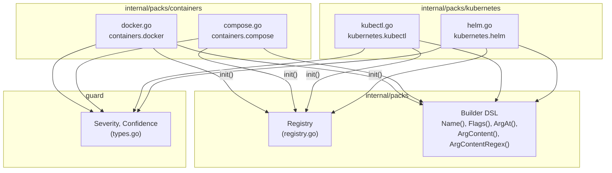
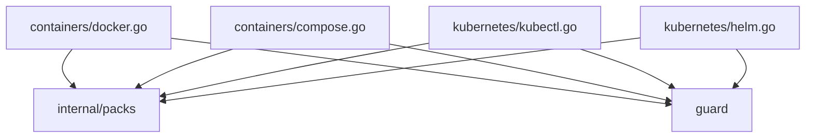
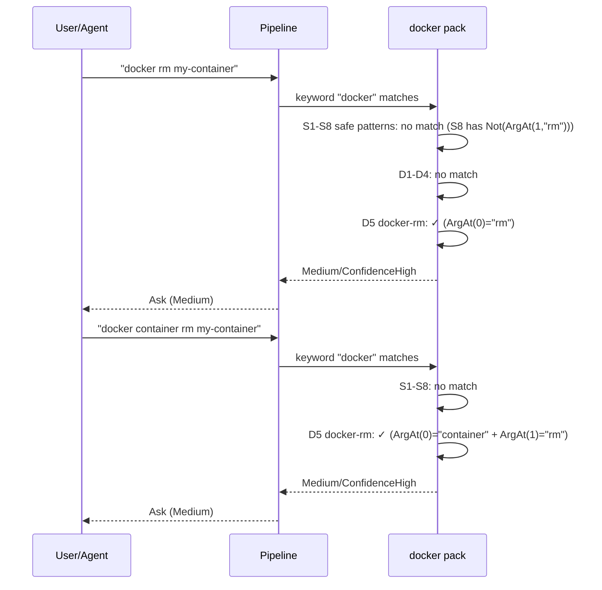
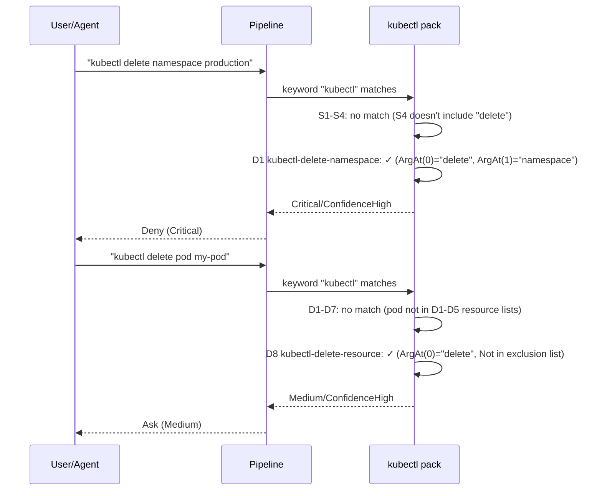

# 03d: Containers & Kubernetes Packs

**Batch**: 3 (Pattern Packs)
**Depends On**: [02-matching-framework](./02-matching-framework.md), [03a-packs-core](./03a-packs-core.md)
**Blocks**: [05-testing-and-benchmarks](./05-testing-and-benchmarks.md)
**Architecture**: [00-architecture.md](./00-architecture.md) (§3 Layer 3, §5 packs/)
**Plan Index**: [00-plan-index.md](./00-plan-index.md)
**Pack Authoring Guide**: [03a-packs-core.md §4](./03a-packs-core.md)

---

## 1. Summary

This plan defines 4 container and Kubernetes orchestration packs:

1. **`containers.docker`** — docker system prune, rm, rmi, volume rm, network rm, container stop/kill
2. **`containers.compose`** — docker compose down -v, docker compose rm -f
3. **`kubernetes.kubectl`** — kubectl delete, drain, replace --force, cordon, taint
4. **`kubernetes.helm`** — helm uninstall, helm rollback

**Key design challenges unique to containers/k8s packs:**

- **Docker subcommand structure**: Docker uses `docker <command>` (old syntax)
  and `docker <object> <command>` (management command syntax) interchangeably.
  E.g., `docker rm` and `docker container rm` are equivalent. Both must be
  matched. The old-style commands appear as `ArgAt(0, "rm")` while management
  commands use `ArgAt(0, "container") + ArgAt(1, "rm")`.
- **Docker Compose dual naming**: Both `docker-compose` (standalone, legacy)
  and `docker compose` (plugin subcommand) must be handled. For `docker compose`,
  the Name is `docker` and `compose` is `ArgAt(0, "compose")` with the actual
  subcommand at `ArgAt(1, ...)`.
- **Kubernetes env sensitivity**: kubectl and helm are env-sensitive — operating
  on a production cluster is significantly more dangerous than dev/staging.
  Docker containers are NOT env-sensitive by default since they typically run
  locally. Docker Compose is also not env-sensitive since it typically
  manages local development environments.
- **kubectl delete breadth**: `kubectl delete` can target any Kubernetes
  resource type. We use resource-type-specific patterns for high-risk
  resources (namespace, deployment, statefulset, pvc, node) and a catch-all
  for others.
- **helm release management**: helm uninstall removes an entire release
  and all associated Kubernetes resources. helm rollback can cause service
  disruption if the target revision has incompatibilities.

**Scope**:
- 4 packs, each with safe + destructive patterns
- 17 safe + 30 destructive patterns
- 99 golden file entries across all 4 packs
- Per-pattern unit tests with match and near-miss cases
- Reachability tests for every destructive pattern
- Environment escalation tests for kubectl and helm packs

---

## 2. Component Diagram



---

## 3. Import Flow



Each pack file imports only two packages:
- `github.com/dcosson/destructive-command-guard-go/guard` — for `Severity` and `Confidence` constants
- `github.com/dcosson/destructive-command-guard-go/internal/packs` — for `Pack`, `SafePattern`, `DestructivePattern`, and builder functions

---

## 4. Matching Patterns for Container & Kubernetes Commands

### 4.1 Docker Old-Style vs Management Commands

Docker supports two interchangeable syntaxes for many operations:

| Old-style | Management command | Both equivalent |
|-----------|-------------------|----------------|
| `docker rm` | `docker container rm` | Remove containers |
| `docker rmi` | `docker image rm` | Remove images |
| `docker stop` | `docker container stop` | Stop containers |
| `docker kill` | `docker container kill` | Kill containers |
| `docker volume rm` | `docker volume rm` | Remove volumes |
| `docker network rm` | `docker network rm` | Remove networks |

We handle both by using `Or()` to match either form:

```go
packs.Or(
    packs.ArgAt(0, "rm"),                                     // docker rm
    packs.And(packs.ArgAt(0, "container"), packs.ArgAt(1, "rm")), // docker container rm
)
```

### 4.2 Docker Compose Plugin vs Standalone

Docker Compose has two invocation styles:

| Style | Command | Name | ArgAt(0) |
|-------|---------|------|----------|
| Standalone (legacy) | `docker-compose down -v` | `docker-compose` | `down` |
| Plugin (modern) | `docker compose down -v` | `docker` | `compose` |

For the plugin style, the actual subcommand is at `ArgAt(1)`:
- `docker compose down` → Name="docker", Args=["compose", "down"]

We handle both by matching on either Name:

```go
packs.Or(
    packs.And(                                    // docker-compose down
        packs.Name("docker-compose"),
        packs.ArgAt(0, "down"),
    ),
    packs.And(                                    // docker compose down
        packs.Name("docker"),
        packs.ArgAt(0, "compose"),
        packs.ArgAt(1, "down"),
    ),
)
```

### 4.3 Kubernetes Environment Sensitivity

kubectl and helm commands are env-sensitive. The target cluster is
determined by:
- `KUBECONFIG` env var
- `--context` flag
- `--cluster` flag
- `~/.kube/config` (default)

The environment detection module (plan 02) handles Kubernetes context
detection. Production cluster names matching patterns like `prod`,
`production`, `live` trigger severity escalation.

### 4.4 kubectl Resource Type Severity Tiers

kubectl delete is dangerous for all resource types, but some are more
dangerous than others:

| Tier | Resource types | Severity | Rationale |
|------|---------------|----------|-----------|
| **Critical** | namespace | Critical | Cascading deletion of all resources in namespace |
| **High** | deployment, statefulset, pvc, node, service, configmap, secret | High | Direct impact on running workloads or data |
| **Medium** | pod, job, cronjob, ingress, networkpolicy, all other | Medium | Individual resources, typically recreatable |

We implement Critical and High tiers with specific patterns, and a
Medium catch-all for `kubectl delete` on any resource.

---

## 5. Pack Definitions

### 5.1 `containers.docker` Pack (`internal/packs/containers/docker.go`)

**Pack ID**: `containers.docker`
**Keywords**: `["docker"]`
**Safe Patterns**: 8
**Destructive Patterns**: 10
**EnvSensitive**: No

Docker manages containers, images, volumes, and networks locally.
Destructive operations remove these resources permanently.

```go
var dockerPack = packs.Pack{
    ID:          "containers.docker",
    Name:        "Docker",
    Description: "Docker container, image, volume, and network destructive operations",
    Keywords:    []string{"docker"},

    Safe: []packs.SafePattern{
        // S1: docker ps, docker container ls (list containers)
        {
            Name: "docker-ps-safe",
            Match: packs.And(
                packs.Name("docker"),
                packs.Or(
                    packs.ArgAt(0, "ps"),
                    packs.And(packs.ArgAt(0, "container"), packs.ArgAt(1, "ls")),
                    packs.And(packs.ArgAt(0, "container"), packs.ArgAt(1, "list")),
                ),
            ),
        },
        // S2: docker images, docker image ls (list images)
        {
            Name: "docker-images-safe",
            Match: packs.And(
                packs.Name("docker"),
                packs.Or(
                    packs.ArgAt(0, "images"),
                    packs.And(packs.ArgAt(0, "image"), packs.ArgAt(1, "ls")),
                    packs.And(packs.ArgAt(0, "image"), packs.ArgAt(1, "list")),
                ),
            ),
        },
        // S3: docker inspect, docker container inspect
        {
            Name: "docker-inspect-safe",
            Match: packs.And(
                packs.Name("docker"),
                packs.Or(
                    packs.ArgAt(0, "inspect"),
                    packs.And(packs.ArgAt(0, "container"), packs.ArgAt(1, "inspect")),
                    packs.And(packs.ArgAt(0, "image"), packs.ArgAt(1, "inspect")),
                ),
            ),
        },
        // S4: docker logs, docker container logs
        {
            Name: "docker-logs-safe",
            Match: packs.And(
                packs.Name("docker"),
                packs.Or(
                    packs.ArgAt(0, "logs"),
                    packs.And(packs.ArgAt(0, "container"), packs.ArgAt(1, "logs")),
                ),
            ),
        },
        // S5: docker build, docker image build
        {
            Name: "docker-build-safe",
            Match: packs.And(
                packs.Name("docker"),
                packs.Or(
                    packs.ArgAt(0, "build"),
                    packs.And(packs.ArgAt(0, "image"), packs.ArgAt(1, "build")),
                    packs.ArgAt(0, "buildx"),
                ),
            ),
        },
        // S6: docker pull, docker image pull, docker push
        {
            Name: "docker-pull-push-safe",
            Match: packs.And(
                packs.Name("docker"),
                packs.Or(
                    packs.ArgAt(0, "pull"),
                    packs.ArgAt(0, "push"),
                    packs.And(packs.ArgAt(0, "image"), packs.ArgAt(1, "pull")),
                    packs.And(packs.ArgAt(0, "image"), packs.ArgAt(1, "push")),
                ),
            ),
        },
        // S7: docker run, docker exec (create/interact with containers)
        {
            Name: "docker-run-exec-safe",
            Match: packs.And(
                packs.Name("docker"),
                packs.Or(
                    packs.ArgAt(0, "run"),
                    packs.ArgAt(0, "exec"),
                    packs.And(packs.ArgAt(0, "container"), packs.ArgAt(1, "run")),
                    packs.And(packs.ArgAt(0, "container"), packs.ArgAt(1, "exec")),
                ),
            ),
        },
        // S8: docker info, docker version, docker stats, docker top,
        //     docker diff, docker history, docker tag, docker login, docker logout
        {
            Name: "docker-info-safe",
            Match: packs.And(
                packs.Name("docker"),
                packs.Or(
                    packs.ArgAt(0, "info"),
                    packs.ArgAt(0, "version"),
                    packs.ArgAt(0, "stats"),
                    packs.ArgAt(0, "top"),
                    packs.ArgAt(0, "diff"),
                    packs.ArgAt(0, "history"),
                    packs.ArgAt(0, "tag"),
                    packs.ArgAt(0, "login"),
                    packs.ArgAt(0, "logout"),
                    packs.ArgAt(0, "cp"),
                    packs.ArgAt(0, "port"),
                    packs.ArgAt(0, "search"),
                    packs.ArgAt(0, "events"),
                    packs.ArgAt(0, "create"),
                    packs.ArgAt(0, "start"),
                    packs.ArgAt(0, "restart"),
                    packs.ArgAt(0, "pause"),
                    packs.ArgAt(0, "unpause"),
                    packs.ArgAt(0, "wait"),
                    packs.ArgAt(0, "rename"),
                    packs.ArgAt(0, "network"),
                    packs.ArgAt(0, "volume"),
                ),
                // Exclude destructive operations that share the
                // "network" or "volume" object name
                packs.Not(packs.ArgAt(1, "rm")),
                packs.Not(packs.ArgAt(1, "remove")),
                packs.Not(packs.ArgAt(1, "prune")),
            ),
        },
    },

    Destructive: []packs.DestructivePattern{
        // ---- Critical ----

        // D1: docker system prune -a -f (remove ALL stopped containers,
        //     unused images, build cache, and optionally volumes)
        {
            Name: "docker-system-prune-all",
            Match: packs.And(
                packs.Name("docker"),
                packs.ArgAt(0, "system"),
                packs.ArgAt(1, "prune"),
                packs.Flags("-a"),
                packs.Flags("-f"),
            ),
            Severity:   guard.Critical,
            Confidence: guard.ConfidenceHigh,
            Reason:     "docker system prune -af removes ALL stopped containers, ALL unused images, and ALL build cache",
            Remediation: "Run docker system df first to see what will be removed. Consider targeted cleanup instead.",
        },

        // ---- High ----

        // D2: docker system prune (without -a or without -f)
        {
            Name: "docker-system-prune",
            Match: packs.And(
                packs.Name("docker"),
                packs.ArgAt(0, "system"),
                packs.ArgAt(1, "prune"),
                packs.Not(packs.And(
                    packs.Flags("-a"),
                    packs.Flags("-f"),
                )),
            ),
            Severity:   guard.High,
            Confidence: guard.ConfidenceHigh,
            Reason:     "docker system prune removes stopped containers, dangling images, and build cache",
            Remediation: "Run docker system df first to see disk usage. Consider targeted cleanup.",
        },
        // D3: docker volume rm / docker volume remove
        {
            Name: "docker-volume-rm",
            Match: packs.And(
                packs.Name("docker"),
                packs.Or(
                    packs.And(packs.ArgAt(0, "volume"), packs.ArgAt(1, "rm")),
                    packs.And(packs.ArgAt(0, "volume"), packs.ArgAt(1, "remove")),
                ),
            ),
            Severity:   guard.High,
            Confidence: guard.ConfidenceHigh,
            Reason:     "docker volume rm permanently deletes Docker volumes — data cannot be recovered",
            Remediation: "Verify the volume name with docker volume inspect. Back up data if needed.",
        },
        // D4: docker volume prune
        {
            Name: "docker-volume-prune",
            Match: packs.And(
                packs.Name("docker"),
                packs.ArgAt(0, "volume"),
                packs.ArgAt(1, "prune"),
            ),
            Severity:   guard.High,
            Confidence: guard.ConfidenceHigh,
            Reason:     "docker volume prune removes ALL unused volumes — may include volumes with important data",
            Remediation: "Run docker volume ls first to see which volumes exist. Use --filter for selective cleanup.",
        },

        // ---- Medium ----

        // D5: docker rm / docker container rm (remove containers)
        {
            Name: "docker-rm",
            Match: packs.And(
                packs.Name("docker"),
                packs.Or(
                    packs.ArgAt(0, "rm"),
                    packs.And(packs.ArgAt(0, "container"), packs.ArgAt(1, "rm")),
                    packs.And(packs.ArgAt(0, "container"), packs.ArgAt(1, "remove")),
                ),
            ),
            Severity:   guard.Medium,
            Confidence: guard.ConfidenceHigh,
            Reason:     "docker rm removes containers and their writable layer — unsaved data is lost",
            Remediation: "Verify container IDs/names with docker ps -a. Commit important changes with docker commit first.",
        },
        // D6: docker rmi / docker image rm (remove images)
        {
            Name: "docker-rmi",
            Match: packs.And(
                packs.Name("docker"),
                packs.Or(
                    packs.ArgAt(0, "rmi"),
                    packs.And(packs.ArgAt(0, "image"), packs.ArgAt(1, "rm")),
                    packs.And(packs.ArgAt(0, "image"), packs.ArgAt(1, "remove")),
                ),
            ),
            Severity:   guard.Medium,
            Confidence: guard.ConfidenceHigh,
            Reason:     "docker rmi removes Docker images — they may need to be re-pulled or rebuilt",
            Remediation: "Verify the image is not used by running containers with docker ps.",
        },
        // D7: docker image prune
        {
            Name: "docker-image-prune",
            Match: packs.And(
                packs.Name("docker"),
                packs.ArgAt(0, "image"),
                packs.ArgAt(1, "prune"),
            ),
            Severity:   guard.Medium,
            Confidence: guard.ConfidenceHigh,
            Reason:     "docker image prune removes dangling images (with -a: all unused images)",
            Remediation: "Run docker images to see what will be affected. Use --filter for selective cleanup.",
        },
        // D8: docker container prune
        {
            Name: "docker-container-prune",
            Match: packs.And(
                packs.Name("docker"),
                packs.Or(
                    packs.And(packs.ArgAt(0, "container"), packs.ArgAt(1, "prune")),
                ),
            ),
            Severity:   guard.Medium,
            Confidence: guard.ConfidenceHigh,
            Reason:     "docker container prune removes all stopped containers",
            Remediation: "Run docker ps -a --filter status=exited first to see what will be removed.",
        },
        // D9: docker network rm / docker network remove
        {
            Name: "docker-network-rm",
            Match: packs.And(
                packs.Name("docker"),
                packs.Or(
                    packs.And(packs.ArgAt(0, "network"), packs.ArgAt(1, "rm")),
                    packs.And(packs.ArgAt(0, "network"), packs.ArgAt(1, "remove")),
                ),
            ),
            Severity:   guard.Medium,
            Confidence: guard.ConfidenceHigh,
            Reason:     "docker network rm removes Docker networks — connected containers lose connectivity",
            Remediation: "Verify no containers are connected with docker network inspect.",
        },
        // D10: docker stop / docker container stop / docker kill
        {
            Name: "docker-stop-kill",
            Match: packs.And(
                packs.Name("docker"),
                packs.Or(
                    packs.ArgAt(0, "stop"),
                    packs.ArgAt(0, "kill"),
                    packs.And(packs.ArgAt(0, "container"), packs.ArgAt(1, "stop")),
                    packs.And(packs.ArgAt(0, "container"), packs.ArgAt(1, "kill")),
                ),
            ),
            Severity:   guard.Medium,
            Confidence: guard.ConfidenceHigh,
            Reason:     "docker stop/kill terminates running containers — causes service interruption",
            Remediation: "Verify container names/IDs with docker ps.",
        },
    },
}
```

#### 5.1.1 Docker Notes

- **`docker run`**: Classified as safe. It creates a new container — not
  destructive. Even `docker run --rm` just means the container is
  automatically removed when it exits.
- **`docker exec`**: Classified as safe. It executes a command inside a
  running container. The command itself could be destructive (e.g.,
  `docker exec db rm -rf /data`) but we can't inspect the inner command
  at the pack level — the core.filesystem pack handles inner commands if
  they are shell commands in the overall pipeline.
- **`docker stop` vs `docker rm`**: Stop is Medium, rm is also Medium.
  Stop is reversible (docker start), but still causes service disruption.
  Rm is permanent but containers are typically stateless.
- **`docker system prune -af`**: Critical because it removes everything —
  stopped containers, all unused images (not just dangling), and build cache.
  With `--volumes` it also removes unused volumes. Without `-a` it only
  removes dangling images, which is less destructive.
- **Not env-sensitive**: Docker typically runs locally. Production Docker
  operations go through orchestrators (k8s, swarm, ECS) which have their
  own packs.
- **`docker network prune`**: Not explicitly covered as a separate
  pattern. Falls through as unmatched. Network pruning removes unused
  networks, which is generally safe since active networks can't be pruned.
  Accepted as unmatched for v1.
- **`docker builder prune`**: Not covered. Build cache cleanup is low risk.

---

### 5.2 `containers.compose` Pack (`internal/packs/containers/compose.go`)

**Pack ID**: `containers.compose`
**Keywords**: `["docker-compose", "docker"]`
**Safe Patterns**: 3
**Destructive Patterns**: 5
**EnvSensitive**: No

Docker Compose manages multi-container applications. Destructive operations
can remove volumes, containers, and images.

```go
var composePack = packs.Pack{
    ID:          "containers.compose",
    Name:        "Docker Compose",
    Description: "Docker Compose multi-container application destructive operations",
    Keywords:    []string{"docker-compose", "docker"},

    Safe: []packs.SafePattern{
        // S1: docker-compose/docker compose ps, ls, config, version
        {
            Name: "compose-readonly-safe",
            Match: packs.Or(
                // docker-compose (standalone)
                packs.And(
                    packs.Name("docker-compose"),
                    packs.Or(
                        packs.ArgAt(0, "ps"),
                        packs.ArgAt(0, "ls"),
                        packs.ArgAt(0, "config"),
                        packs.ArgAt(0, "version"),
                        packs.ArgAt(0, "top"),
                        packs.ArgAt(0, "port"),
                        packs.ArgAt(0, "images"),
                    ),
                ),
                // docker compose (plugin)
                packs.And(
                    packs.Name("docker"),
                    packs.ArgAt(0, "compose"),
                    packs.Or(
                        packs.ArgAt(1, "ps"),
                        packs.ArgAt(1, "ls"),
                        packs.ArgAt(1, "config"),
                        packs.ArgAt(1, "version"),
                        packs.ArgAt(1, "top"),
                        packs.ArgAt(1, "port"),
                        packs.ArgAt(1, "images"),
                    ),
                ),
            ),
        },
        // S2: docker-compose/docker compose logs
        {
            Name: "compose-logs-safe",
            Match: packs.Or(
                packs.And(packs.Name("docker-compose"), packs.ArgAt(0, "logs")),
                packs.And(packs.Name("docker"), packs.ArgAt(0, "compose"), packs.ArgAt(1, "logs")),
            ),
        },
        // S3: docker-compose/docker compose up, build, pull, push, exec, run
        {
            Name: "compose-up-build-safe",
            Match: packs.Or(
                packs.And(
                    packs.Name("docker-compose"),
                    packs.Or(
                        packs.ArgAt(0, "up"),
                        packs.ArgAt(0, "build"),
                        packs.ArgAt(0, "pull"),
                        packs.ArgAt(0, "push"),
                        packs.ArgAt(0, "exec"),
                        packs.ArgAt(0, "run"),
                        packs.ArgAt(0, "create"),
                        packs.ArgAt(0, "start"),
                        packs.ArgAt(0, "restart"),
                        packs.ArgAt(0, "pause"),
                        packs.ArgAt(0, "unpause"),
                    ),
                ),
                packs.And(
                    packs.Name("docker"),
                    packs.ArgAt(0, "compose"),
                    packs.Or(
                        packs.ArgAt(1, "up"),
                        packs.ArgAt(1, "build"),
                        packs.ArgAt(1, "pull"),
                        packs.ArgAt(1, "push"),
                        packs.ArgAt(1, "exec"),
                        packs.ArgAt(1, "run"),
                        packs.ArgAt(1, "create"),
                        packs.ArgAt(1, "start"),
                        packs.ArgAt(1, "restart"),
                        packs.ArgAt(1, "pause"),
                        packs.ArgAt(1, "unpause"),
                    ),
                ),
            ),
        },
    },

    Destructive: []packs.DestructivePattern{
        // ---- High ----

        // D1: docker-compose/docker compose down -v (destroys volumes)
        {
            Name: "compose-down-volumes",
            Match: packs.Or(
                packs.And(
                    packs.Name("docker-compose"),
                    packs.ArgAt(0, "down"),
                    packs.Or(packs.Flags("-v"), packs.Flags("--volumes")),
                ),
                packs.And(
                    packs.Name("docker"),
                    packs.ArgAt(0, "compose"),
                    packs.ArgAt(1, "down"),
                    packs.Or(packs.Flags("-v"), packs.Flags("--volumes")),
                ),
            ),
            Severity:   guard.High,
            Confidence: guard.ConfidenceHigh,
            Reason:     "docker compose down -v removes containers, networks, AND named volumes — volume data is permanently lost",
            Remediation: "Remove the -v flag to preserve volumes. Back up volume data first if needed.",
        },
        // D2: docker-compose/docker compose down --rmi all (removes images too)
        {
            Name: "compose-down-rmi",
            Match: packs.Or(
                packs.And(
                    packs.Name("docker-compose"),
                    packs.ArgAt(0, "down"),
                    packs.Flags("--rmi"),
                ),
                packs.And(
                    packs.Name("docker"),
                    packs.ArgAt(0, "compose"),
                    packs.ArgAt(1, "down"),
                    packs.Flags("--rmi"),
                ),
            ),
            Severity:   guard.High,
            Confidence: guard.ConfidenceHigh,
            Reason:     "docker compose down --rmi removes containers, networks, and images — images must be re-built or re-pulled",
            Remediation: "Remove --rmi flag. Only use when intentionally cleaning up all compose artifacts.",
        },

        // ---- Medium ----

        // D3: docker-compose/docker compose down (without -v, without --rmi)
        {
            Name: "compose-down",
            Match: packs.Or(
                packs.And(
                    packs.Name("docker-compose"),
                    packs.ArgAt(0, "down"),
                    packs.Not(packs.Or(packs.Flags("-v"), packs.Flags("--volumes"))),
                    packs.Not(packs.Flags("--rmi")),
                ),
                packs.And(
                    packs.Name("docker"),
                    packs.ArgAt(0, "compose"),
                    packs.ArgAt(1, "down"),
                    packs.Not(packs.Or(packs.Flags("-v"), packs.Flags("--volumes"))),
                    packs.Not(packs.Flags("--rmi")),
                ),
            ),
            Severity:   guard.Medium,
            Confidence: guard.ConfidenceHigh,
            Reason:     "docker compose down stops and removes containers and networks — volumes are preserved",
            Remediation: "This removes containers but preserves volumes. Use docker compose stop to only stop without removing.",
        },
        // D4: docker-compose/docker compose rm -f (force remove containers)
        {
            Name: "compose-rm-force",
            Match: packs.Or(
                packs.And(
                    packs.Name("docker-compose"),
                    packs.ArgAt(0, "rm"),
                    packs.Or(packs.Flags("-f"), packs.Flags("--force")),
                ),
                packs.And(
                    packs.Name("docker"),
                    packs.ArgAt(0, "compose"),
                    packs.ArgAt(1, "rm"),
                    packs.Or(packs.Flags("-f"), packs.Flags("--force")),
                ),
            ),
            Severity:   guard.Medium,
            Confidence: guard.ConfidenceHigh,
            Reason:     "docker compose rm -f force removes stopped service containers without confirmation",
            Remediation: "Remove -f to get a confirmation prompt. Verify which containers will be affected.",
        },
        // D5: docker-compose/docker compose stop (stops services)
        {
            Name: "compose-stop",
            Match: packs.Or(
                packs.And(packs.Name("docker-compose"), packs.ArgAt(0, "stop")),
                packs.And(packs.Name("docker"), packs.ArgAt(0, "compose"), packs.ArgAt(1, "stop")),
            ),
            Severity:   guard.Medium,
            Confidence: guard.ConfidenceLow,
            Reason:     "docker compose stop halts all running service containers — causes service interruption",
            Remediation: "Verify which services are running with docker compose ps.",
        },
    },
}
```

#### 5.2.1 Compose Notes

- **`docker compose up`**: Classified as safe. Creates and starts
  containers. Even `docker compose up --force-recreate` just recreates
  containers — volumes are preserved.
- **`docker compose down` severity split**: Without flags → Medium
  (containers and networks removed, volumes preserved). With `-v` → High
  (volumes permanently destroyed). With `--rmi` → High (images removed).
- **`docker compose rm` without `-f`**: Falls through as unmatched.
  Without `-f`, it prompts for confirmation, which is a sufficient safety
  net. Only the `-f` variant is flagged.
- **Not env-sensitive**: Compose is primarily used for local development.
  Production container orchestration uses Kubernetes, ECS, etc.
- **Keyword overlap with docker pack**: Both packs share the `"docker"`
  keyword. The compose pack matches `ArgAt(0, "compose")` which
  the docker pack never matches, so there is no cross-pack interference.
  For `docker-compose` (standalone), only the compose pack uses
  `Name("docker-compose")`.

---

### 5.3 `kubernetes.kubectl` Pack (`internal/packs/kubernetes/kubectl.go`)

**Pack ID**: `kubernetes.kubectl`
**Keywords**: `["kubectl"]`
**Safe Patterns**: 4
**Destructive Patterns**: 10
**EnvSensitive**: Yes (all 10 destructive patterns)

kubectl is the primary CLI for Kubernetes cluster management. Destructive
operations can remove workloads, data, and affect cluster availability.

```go
var kubectlPack = packs.Pack{
    ID:          "kubernetes.kubectl",
    Name:        "kubectl",
    Description: "Kubernetes kubectl destructive operations",
    Keywords:    []string{"kubectl"},

    Safe: []packs.SafePattern{
        // S1: kubectl get (list resources)
        {
            Name: "kubectl-get-safe",
            Match: packs.And(
                packs.Name("kubectl"),
                packs.ArgAt(0, "get"),
            ),
        },
        // S2: kubectl describe (inspect resources)
        {
            Name: "kubectl-describe-safe",
            Match: packs.And(
                packs.Name("kubectl"),
                packs.ArgAt(0, "describe"),
            ),
        },
        // S3: kubectl logs, kubectl top, kubectl version, kubectl cluster-info,
        //     kubectl config, kubectl api-resources, kubectl explain, kubectl auth
        {
            Name: "kubectl-readonly-safe",
            Match: packs.And(
                packs.Name("kubectl"),
                packs.Or(
                    packs.ArgAt(0, "logs"),
                    packs.ArgAt(0, "top"),
                    packs.ArgAt(0, "version"),
                    packs.ArgAt(0, "cluster-info"),
                    packs.ArgAt(0, "config"),
                    packs.ArgAt(0, "api-resources"),
                    packs.ArgAt(0, "api-versions"),
                    packs.ArgAt(0, "explain"),
                    packs.ArgAt(0, "auth"),
                    packs.ArgAt(0, "diff"),
                    packs.ArgAt(0, "wait"),
                    packs.ArgAt(0, "port-forward"),
                    packs.ArgAt(0, "proxy"),
                    packs.ArgAt(0, "completion"),
                ),
            ),
        },
        // S4: kubectl apply, kubectl create, kubectl expose, kubectl label,
        //     kubectl annotate, kubectl set, kubectl patch, kubectl edit,
        //     kubectl run, kubectl cp, kubectl attach
        //     (These modify the cluster but are not destructive — they add/update)
        {
            Name: "kubectl-modify-safe",
            Match: packs.And(
                packs.Name("kubectl"),
                packs.Or(
                    packs.ArgAt(0, "apply"),
                    packs.ArgAt(0, "create"),
                    packs.ArgAt(0, "expose"),
                    packs.ArgAt(0, "label"),
                    packs.ArgAt(0, "annotate"),
                    packs.ArgAt(0, "set"),
                    packs.ArgAt(0, "patch"),
                    packs.ArgAt(0, "edit"),
                    packs.ArgAt(0, "run"),
                    packs.ArgAt(0, "cp"),
                    packs.ArgAt(0, "attach"),
                    packs.ArgAt(0, "autoscale"),
                    packs.ArgAt(0, "rollout"),
                    packs.ArgAt(0, "scale"),
                ),
            ),
        },
    },

    Destructive: []packs.DestructivePattern{
        // ---- Critical ----

        // D1: kubectl delete namespace (cascading deletion of all resources)
        {
            Name: "kubectl-delete-namespace",
            Match: packs.And(
                packs.Name("kubectl"),
                packs.ArgAt(0, "delete"),
                packs.Or(
                    packs.ArgAt(1, "namespace"),
                    packs.ArgAt(1, "ns"),
                ),
            ),
            Severity:     guard.Critical,
            Confidence:   guard.ConfidenceHigh,
            Reason:       "kubectl delete namespace permanently destroys all resources within the namespace — deployments, services, pods, configmaps, secrets, PVCs, etc.",
            Remediation:  "Verify the namespace with kubectl get all -n <namespace>. Consider kubectl delete on individual resources instead.",
            EnvSensitive: true,
        },

        // ---- High ----

        // D2: kubectl delete deployment/statefulset/daemonset
        {
            Name: "kubectl-delete-workload",
            Match: packs.And(
                packs.Name("kubectl"),
                packs.ArgAt(0, "delete"),
                packs.Or(
                    packs.ArgAt(1, "deployment"),
                    packs.ArgAt(1, "deploy"),
                    packs.ArgAt(1, "statefulset"),
                    packs.ArgAt(1, "sts"),
                    packs.ArgAt(1, "daemonset"),
                    packs.ArgAt(1, "ds"),
                ),
            ),
            Severity:     guard.High,
            Confidence:   guard.ConfidenceHigh,
            Reason:       "kubectl delete deployment/statefulset/daemonset removes workloads and their pods",
            Remediation:  "Verify the resource with kubectl get. Consider kubectl scale --replicas=0 for a softer approach.",
            EnvSensitive: true,
        },
        // D3: kubectl delete pvc/pv (persistent storage)
        {
            Name: "kubectl-delete-storage",
            Match: packs.And(
                packs.Name("kubectl"),
                packs.ArgAt(0, "delete"),
                packs.Or(
                    packs.ArgAt(1, "pvc"),
                    packs.ArgAt(1, "persistentvolumeclaim"),
                    packs.ArgAt(1, "pv"),
                    packs.ArgAt(1, "persistentvolume"),
                ),
            ),
            Severity:     guard.High,
            Confidence:   guard.ConfidenceHigh,
            Reason:       "kubectl delete pvc/pv permanently removes persistent storage — data loss if not backed up",
            Remediation:  "Back up data first. Verify the PVC is not in use with kubectl get pods.",
            EnvSensitive: true,
        },
        // D4: kubectl delete node
        {
            Name: "kubectl-delete-node",
            Match: packs.And(
                packs.Name("kubectl"),
                packs.ArgAt(0, "delete"),
                packs.ArgAt(1, "node"),
            ),
            Severity:     guard.High,
            Confidence:   guard.ConfidenceHigh,
            Reason:       "kubectl delete node removes a node from the cluster — pods on it become unscheduled",
            Remediation:  "Drain the node first with kubectl drain. Verify no critical workloads are running.",
            EnvSensitive: true,
        },
        // D5: kubectl delete service
        {
            Name: "kubectl-delete-service",
            Match: packs.And(
                packs.Name("kubectl"),
                packs.ArgAt(0, "delete"),
                packs.Or(
                    packs.ArgAt(1, "service"),
                    packs.ArgAt(1, "svc"),
                ),
            ),
            Severity:     guard.High,
            Confidence:   guard.ConfidenceHigh,
            Reason:       "kubectl delete service removes network routing — dependent pods lose connectivity",
            Remediation:  "Verify no active traffic routes through this service.",
            EnvSensitive: true,
        },
        // D6: kubectl drain (evict all pods from a node)
        {
            Name: "kubectl-drain",
            Match: packs.And(
                packs.Name("kubectl"),
                packs.ArgAt(0, "drain"),
            ),
            Severity:     guard.High,
            Confidence:   guard.ConfidenceHigh,
            Reason:       "kubectl drain evicts all pods from a node — causes service disruption if replicas are insufficient",
            Remediation:  "Use --ignore-daemonsets --delete-emptydir-data carefully. Verify pod disruption budgets.",
            EnvSensitive: true,
        },
        // D7: kubectl replace --force (delete and recreate)
        {
            Name: "kubectl-replace-force",
            Match: packs.And(
                packs.Name("kubectl"),
                packs.ArgAt(0, "replace"),
                packs.Flags("--force"),
            ),
            Severity:     guard.High,
            Confidence:   guard.ConfidenceHigh,
            Reason:       "kubectl replace --force deletes and recreates the resource — causes momentary downtime",
            Remediation:  "Use kubectl apply instead for zero-downtime updates.",
            EnvSensitive: true,
        },

        // ---- Medium ----

        // D8: kubectl delete (catch-all for other resource types)
        {
            Name: "kubectl-delete-resource",
            Match: packs.And(
                packs.Name("kubectl"),
                packs.ArgAt(0, "delete"),
                // Exclude already-handled resource types (D1-D5)
                packs.Not(packs.Or(
                    packs.ArgAt(1, "namespace"),
                    packs.ArgAt(1, "ns"),
                    packs.ArgAt(1, "deployment"),
                    packs.ArgAt(1, "deploy"),
                    packs.ArgAt(1, "statefulset"),
                    packs.ArgAt(1, "sts"),
                    packs.ArgAt(1, "daemonset"),
                    packs.ArgAt(1, "ds"),
                    packs.ArgAt(1, "pvc"),
                    packs.ArgAt(1, "persistentvolumeclaim"),
                    packs.ArgAt(1, "pv"),
                    packs.ArgAt(1, "persistentvolume"),
                    packs.ArgAt(1, "node"),
                    packs.ArgAt(1, "service"),
                    packs.ArgAt(1, "svc"),
                )),
            ),
            Severity:     guard.Medium,
            Confidence:   guard.ConfidenceHigh,
            Reason:       "kubectl delete removes Kubernetes resources",
            Remediation:  "Verify the resource with kubectl get first.",
            EnvSensitive: true,
        },
        // D9: kubectl cordon (mark node as unschedulable)
        {
            Name: "kubectl-cordon",
            Match: packs.And(
                packs.Name("kubectl"),
                packs.ArgAt(0, "cordon"),
            ),
            Severity:     guard.Medium,
            Confidence:   guard.ConfidenceHigh,
            Reason:       "kubectl cordon prevents new pods from being scheduled on a node — may cause scheduling pressure",
            Remediation:  "Use kubectl uncordon to reverse. Verify cluster has sufficient capacity.",
            EnvSensitive: true,
        },
        // D10: kubectl taint (add taint to node)
        {
            Name: "kubectl-taint",
            Match: packs.And(
                packs.Name("kubectl"),
                packs.ArgAt(0, "taint"),
            ),
            Severity:     guard.Medium,
            Confidence:   guard.ConfidenceHigh,
            Reason:       "kubectl taint affects pod scheduling — pods without matching tolerations won't schedule on tainted nodes",
            Remediation:  "Verify existing tolerations. Use kubectl describe node to check current taints.",
            EnvSensitive: true,
        },
    },
}
```

#### 5.3.1 kubectl Notes

- **`kubectl apply`**: Classified as safe. It declaratively applies
  resource configurations. While it can modify resources, it's the
  standard way to update Kubernetes state and is not directly
  destructive.
- **`kubectl delete -f`**: Matches D8 (kubectl-delete-resource). The
  `-f` flag specifies a file, but the resource type in the file
  determines the actual impact. Since we can't inspect file contents,
  D8 catches all `kubectl delete` commands not handled by more specific
  patterns (D1-D5).
- **`kubectl delete --all`**: Also matches D8 or the specific resource
  pattern. The `--all` flag is dangerous but we don't currently
  escalate severity for it. Could be a v2 enhancement.
- **`kubectl rollout`**: Classified as safe (S4). Rollout operations
  (restart, status, history, undo, pause, resume) are operational but
  not destructive — they manage existing deployments. Even `kubectl
  rollout restart` just triggers a rolling restart.
- **`kubectl scale`**: Classified as safe (S4). Scaling to zero pods is
  operational, not destructive — the deployment still exists and can be
  scaled back up.
- **Env-sensitive**: All 10 destructive patterns are env-sensitive.
  Deleting a namespace in production vs. dev has vastly different impact.

---

### 5.4 `kubernetes.helm` Pack (`internal/packs/kubernetes/helm.go`)

**Pack ID**: `kubernetes.helm`
**Keywords**: `["helm"]`
**Safe Patterns**: 2
**Destructive Patterns**: 5
**EnvSensitive**: Yes (all 5 destructive patterns)

Helm manages Kubernetes application packages (charts). Destructive
operations remove releases and their associated Kubernetes resources.

```go
var helmPack = packs.Pack{
    ID:          "kubernetes.helm",
    Name:        "Helm",
    Description: "Helm chart management destructive operations",
    Keywords:    []string{"helm"},

    Safe: []packs.SafePattern{
        // S1: helm list, helm status, helm get, helm show, helm search,
        //     helm history, helm env, helm version, helm template
        {
            Name: "helm-readonly-safe",
            Match: packs.And(
                packs.Name("helm"),
                packs.Or(
                    packs.ArgAt(0, "list"),
                    packs.ArgAt(0, "ls"),
                    packs.ArgAt(0, "status"),
                    packs.ArgAt(0, "get"),
                    packs.ArgAt(0, "show"),
                    packs.ArgAt(0, "search"),
                    packs.ArgAt(0, "history"),
                    packs.ArgAt(0, "env"),
                    packs.ArgAt(0, "version"),
                    packs.ArgAt(0, "template"),
                    packs.ArgAt(0, "verify"),
                    packs.ArgAt(0, "repo"),
                    packs.ArgAt(0, "plugin"),
                    packs.ArgAt(0, "completion"),
                    packs.ArgAt(0, "lint"),
                    packs.ArgAt(0, "package"),
                    packs.ArgAt(0, "pull"),
                    packs.ArgAt(0, "dependency"),
                    packs.ArgAt(0, "registry"),
                ),
            ),
        },
        // S2: helm install, helm upgrade (add/update releases)
        {
            Name: "helm-install-upgrade-safe",
            Match: packs.And(
                packs.Name("helm"),
                packs.Or(
                    packs.ArgAt(0, "install"),
                    packs.ArgAt(0, "upgrade"),
                ),
            ),
        },
    },

    Destructive: []packs.DestructivePattern{
        // ---- High ----

        // D1: helm uninstall (remove release and all associated resources)
        {
            Name: "helm-uninstall",
            Match: packs.And(
                packs.Name("helm"),
                packs.Or(
                    packs.ArgAt(0, "uninstall"),
                    packs.ArgAt(0, "delete"),
                ),
            ),
            Severity:     guard.High,
            Confidence:   guard.ConfidenceHigh,
            Reason:       "helm uninstall removes a release and ALL associated Kubernetes resources (deployments, services, configmaps, etc.)",
            Remediation:  "Verify the release with helm status. Consider helm uninstall --keep-history for potential rollback.",
            EnvSensitive: true,
        },

        // ---- Medium ----

        // D2: helm rollback (revert to a previous release revision)
        {
            Name: "helm-rollback",
            Match: packs.And(
                packs.Name("helm"),
                packs.ArgAt(0, "rollback"),
            ),
            Severity:     guard.Medium,
            Confidence:   guard.ConfidenceHigh,
            Reason:       "helm rollback reverts to a previous release revision — may cause service disruption if the previous revision is incompatible",
            Remediation:  "Check helm history for available revisions. Verify the target revision's values.",
            EnvSensitive: true,
        },
        // D3: helm upgrade --install --force (force replace resources)
        {
            Name: "helm-upgrade-force",
            Match: packs.And(
                packs.Name("helm"),
                packs.ArgAt(0, "upgrade"),
                packs.Flags("--force"),
            ),
            Severity:     guard.Medium,
            Confidence:   guard.ConfidenceHigh,
            Reason:       "helm upgrade --force deletes and recreates resources instead of updating — causes momentary downtime",
            Remediation:  "Remove --force for a rolling update. Only use --force when resources are in a broken state.",
            EnvSensitive: true,
        },
        // D4: helm upgrade --reset-values (discard previously set values)
        {
            Name: "helm-upgrade-reset-values",
            Match: packs.And(
                packs.Name("helm"),
                packs.ArgAt(0, "upgrade"),
                packs.Flags("--reset-values"),
            ),
            Severity:     guard.Medium,
            Confidence:   guard.ConfidenceMedium,
            Reason:       "helm upgrade --reset-values discards all previously set custom values — may cause unexpected behavior",
            Remediation:  "Use --reuse-values instead to preserve existing values.",
            EnvSensitive: true,
        },
        // D5: helm test (run release tests — may modify cluster state)
        {
            Name: "helm-test",
            Match: packs.And(
                packs.Name("helm"),
                packs.ArgAt(0, "test"),
            ),
            Severity:     guard.Medium,
            Confidence:   guard.ConfidenceLow,
            Reason:       "helm test runs test hooks for a release — tests may modify cluster state depending on chart implementation",
            Remediation:  "Review the chart's test hooks before running. Check helm show hooks.",
            EnvSensitive: true,
        },
    },
}
```

#### 5.4.1 Helm Notes

- **`helm install`**: Classified as safe (S2). It creates a new release.
  While it deploys resources, it's additive and the standard workflow.
- **`helm upgrade`**: Classified as safe (S2) unless `--force` or
  `--reset-values` is used. Normal upgrades do rolling updates.
  `--force` is destructive because it deletes and recreates resources.
  `--reset-values` is risky because it discards custom configuration.
- **`helm delete`**: This is an alias for `helm uninstall` (Helm 3).
  In Helm 2 it was the primary command. Both are matched by D1.
- **`helm rollback`**: Medium severity because rolling back can cause
  service disruption if the previous revision has incompatibilities
  (e.g., schema changes, removed APIs). It's still reversible by
  rolling back again.
- **`helm test`**: Medium/ConfidenceLow because test hooks are
  chart-specific and we can't inspect their behavior. Some tests are
  purely read-only, others may modify state.
- **Env-sensitive**: All 5 destructive patterns are env-sensitive.
  Uninstalling a release in production vs. dev has vastly different
  impact.

---

## 6. Golden File Entries

### 6.1 `containers.docker` (30 entries)

```
# docker — Destructive — Critical
docker system prune -a -f                           → Deny/Critical (docker-system-prune-all)
docker system prune -af                             → Deny/Critical (docker-system-prune-all)

# docker — Destructive — High
docker system prune                                 → Deny/High (docker-system-prune)
docker system prune -f                              → Deny/High (docker-system-prune)
docker system prune -a                              → Deny/High (docker-system-prune)
docker volume rm my-volume                          → Deny/High (docker-volume-rm)
docker volume remove my-volume                      → Deny/High (docker-volume-rm)
docker volume prune                                 → Deny/High (docker-volume-prune)
docker volume prune -f                              → Deny/High (docker-volume-prune)

# docker — Destructive — Medium
docker rm my-container                              → Ask/Medium (docker-rm)
docker rm -f my-container                           → Ask/Medium (docker-rm)
docker container rm my-container                    → Ask/Medium (docker-rm)
docker rmi my-image                                 → Ask/Medium (docker-rmi)
docker image rm my-image                            → Ask/Medium (docker-rmi)
docker image prune                                  → Ask/Medium (docker-image-prune)
docker image prune -a                               → Ask/Medium (docker-image-prune)
docker container prune                              → Ask/Medium (docker-container-prune)
docker network rm my-network                        → Ask/Medium (docker-network-rm)
docker network remove my-network                    → Ask/Medium (docker-network-rm)
docker stop my-container                            → Ask/Medium (docker-stop-kill)
docker kill my-container                            → Ask/Medium (docker-stop-kill)
docker container stop my-container                  → Ask/Medium (docker-stop-kill)

# docker — Safe
docker ps                                           → Allow (docker-ps-safe)
docker ps -a                                        → Allow (docker-ps-safe)
docker images                                       → Allow (docker-images-safe)
docker inspect my-container                         → Allow (docker-inspect-safe)
docker logs my-container                            → Allow (docker-logs-safe)
docker build -t myimage .                           → Allow (docker-build-safe)
docker run -it ubuntu bash                          → Allow (docker-run-exec-safe)
docker info                                         → Allow (docker-info-safe)
```

### 6.2 `containers.compose` (22 entries)

```
# compose — Destructive — High
docker-compose down -v                              → Deny/High (compose-down-volumes)
docker compose down -v                              → Deny/High (compose-down-volumes)
docker-compose down --volumes                       → Deny/High (compose-down-volumes)
docker compose down --volumes                       → Deny/High (compose-down-volumes)
docker-compose down --rmi all                       → Deny/High (compose-down-rmi)
docker compose down --rmi all                       → Deny/High (compose-down-rmi)

# compose — Destructive — Medium
docker-compose down                                 → Ask/Medium (compose-down)
docker compose down                                 → Ask/Medium (compose-down)
docker-compose rm -f                                → Ask/Medium (compose-rm-force)
docker compose rm -f                                → Ask/Medium (compose-rm-force)
docker-compose rm --force                           → Ask/Medium (compose-rm-force)
docker compose rm --force                           → Ask/Medium (compose-rm-force)
docker-compose stop                                 → Ask/Medium (compose-stop)
docker compose stop                                 → Ask/Medium (compose-stop)

# compose — Safe
docker-compose ps                                   → Allow (compose-readonly-safe)
docker compose ps                                   → Allow (compose-readonly-safe)
docker-compose up -d                                → Allow (compose-up-build-safe)
docker compose up -d                                → Allow (compose-up-build-safe)
docker-compose logs                                 → Allow (compose-logs-safe)
docker compose logs                                 → Allow (compose-logs-safe)
docker-compose config                               → Allow (compose-readonly-safe)
docker compose config                               → Allow (compose-readonly-safe)
```

### 6.3 `kubernetes.kubectl` (27 entries)

```
# kubectl — Destructive — Critical
kubectl delete namespace production                 → Deny/Critical (kubectl-delete-namespace)
kubectl delete ns staging                           → Deny/Critical (kubectl-delete-namespace)

# kubectl — Destructive — High
kubectl delete deployment my-app                    → Deny/High (kubectl-delete-workload)
kubectl delete deploy my-app -n production          → Deny/High (kubectl-delete-workload)
kubectl delete statefulset my-db                    → Deny/High (kubectl-delete-workload)
kubectl delete sts my-db                            → Deny/High (kubectl-delete-workload)
kubectl delete daemonset my-ds                      → Deny/High (kubectl-delete-workload)
kubectl delete pvc my-data                          → Deny/High (kubectl-delete-storage)
kubectl delete persistentvolumeclaim my-data        → Deny/High (kubectl-delete-storage)
kubectl delete pv my-volume                         → Deny/High (kubectl-delete-storage)
kubectl delete node worker-1                        → Deny/High (kubectl-delete-node)
kubectl delete service my-svc                       → Deny/High (kubectl-delete-service)
kubectl delete svc my-svc                           → Deny/High (kubectl-delete-service)
kubectl drain worker-1 --ignore-daemonsets          → Deny/High (kubectl-drain)
kubectl replace --force -f deployment.yaml          → Deny/High (kubectl-replace-force)

# kubectl — Destructive — Medium
kubectl delete pod my-pod                           → Ask/Medium (kubectl-delete-resource)
kubectl delete configmap my-config                  → Ask/Medium (kubectl-delete-resource)
kubectl delete secret my-secret                     → Ask/Medium (kubectl-delete-resource)
kubectl delete ingress my-ingress                   → Ask/Medium (kubectl-delete-resource)
kubectl delete -f resources.yaml                    → Ask/Medium (kubectl-delete-resource)
kubectl cordon worker-1                             → Ask/Medium (kubectl-cordon)
kubectl taint nodes worker-1 key=value:NoSchedule   → Ask/Medium (kubectl-taint)

# kubectl — Safe
kubectl get pods                                    → Allow (kubectl-get-safe)
kubectl get pods -n production                      → Allow (kubectl-get-safe)
kubectl describe pod my-pod                         → Allow (kubectl-describe-safe)
kubectl logs my-pod                                 → Allow (kubectl-readonly-safe)
kubectl apply -f deployment.yaml                    → Allow (kubectl-modify-safe)
```

### 6.4 `kubernetes.helm` (20 entries)

```
# helm — Destructive — High
helm uninstall my-release                           → Deny/High (helm-uninstall)
helm uninstall my-release -n production             → Deny/High (helm-uninstall)
helm delete my-release                              → Deny/High (helm-uninstall)

# helm — Destructive — Medium
helm rollback my-release 1                          → Ask/Medium (helm-rollback)
helm rollback my-release 3 -n production            → Ask/Medium (helm-rollback)
helm upgrade my-release my-chart --force            → Ask/Medium (helm-upgrade-force)
helm upgrade my-release my-chart --reset-values     → Ask/Medium (helm-upgrade-reset-values)
helm test my-release                                → Ask/Medium (helm-test)

# helm — Safe
helm list                                           → Allow (helm-readonly-safe)
helm ls -n production                               → Allow (helm-readonly-safe)
helm status my-release                              → Allow (helm-readonly-safe)
helm get values my-release                          → Allow (helm-readonly-safe)
helm show chart my-chart                            → Allow (helm-readonly-safe)
helm search repo my-chart                           → Allow (helm-readonly-safe)
helm history my-release                             → Allow (helm-readonly-safe)
helm template my-release my-chart                   → Allow (helm-readonly-safe)
helm install my-release my-chart                    → Allow (helm-install-upgrade-safe)
helm upgrade my-release my-chart                    → Allow (helm-install-upgrade-safe)
helm repo add bitnami https://charts.bitnami.com    → Allow (helm-readonly-safe)
helm lint my-chart                                  → Allow (helm-readonly-safe)
```

**Total golden entries**: 99 across 4 packs (30 + 22 + 27 + 20)

---

## 7. Tests

### 7.1 Per-Pattern Unit Tests

Each pack file has a companion `_test.go` with table-driven tests:

```go
// docker_test.go
func TestDockerSystemPruneAll(t *testing.T) {
    pattern := dockerPack.Destructive[0].Match // docker-system-prune-all
    tests := []struct {
        name string
        cmd  parse.ExtractedCommand
        want bool
    }{
        // Match
        {"docker system prune -a -f",
            cmd("docker", []string{"system", "prune"}, m("-a", "", "-f", "")), true},
        {"docker system prune -af",
            cmd("docker", []string{"system", "prune"}, m("-a", "", "-f", "")), true},
        // Near-miss
        {"docker system prune -a (no -f)",
            cmd("docker", []string{"system", "prune"}, m("-a", "")), false},
        {"docker system prune -f (no -a)",
            cmd("docker", []string{"system", "prune"}, m("-f", "")), false},
        {"docker system prune (no flags)",
            cmd("docker", []string{"system", "prune"}, nil), false},
    }
    for _, tt := range tests {
        t.Run(tt.name, func(t *testing.T) {
            assert.Equal(t, tt.want, pattern.Match(tt.cmd))
        })
    }
}
```

### 7.2 Reachability Tests

Every destructive pattern must have at least one reachability command
that bypasses all safe patterns in the same pack:

```go
var containerK8sReachabilityCommands = map[string]parse.ExtractedCommand{
    // Docker
    "docker-system-prune-all":  cmd("docker", []string{"system", "prune"}, m("-a", "", "-f", "")),
    "docker-system-prune":      cmd("docker", []string{"system", "prune"}, nil),
    "docker-volume-rm":         cmd("docker", []string{"volume", "rm", "my-vol"}, nil),
    "docker-volume-prune":      cmd("docker", []string{"volume", "prune"}, nil),
    "docker-rm":                cmd("docker", []string{"rm", "my-container"}, nil),
    "docker-rmi":               cmd("docker", []string{"rmi", "my-image"}, nil),
    "docker-image-prune":       cmd("docker", []string{"image", "prune"}, nil),
    "docker-container-prune":   cmd("docker", []string{"container", "prune"}, nil),
    "docker-network-rm":        cmd("docker", []string{"network", "rm", "my-net"}, nil),
    "docker-stop-kill":         cmd("docker", []string{"stop", "my-container"}, nil),
    // Compose
    "compose-down-volumes":     cmd("docker-compose", []string{"down"}, m("-v", "")),
    "compose-down-rmi":         cmd("docker-compose", []string{"down"}, m("--rmi", "all")),
    "compose-down":             cmd("docker-compose", []string{"down"}, nil),
    "compose-rm-force":         cmd("docker-compose", []string{"rm"}, m("-f", "")),
    "compose-stop":             cmd("docker-compose", []string{"stop"}, nil),
    // kubectl
    "kubectl-delete-namespace": cmd("kubectl", []string{"delete", "namespace", "production"}, nil),
    "kubectl-delete-workload":  cmd("kubectl", []string{"delete", "deployment", "my-app"}, nil),
    "kubectl-delete-storage":   cmd("kubectl", []string{"delete", "pvc", "my-data"}, nil),
    "kubectl-delete-node":      cmd("kubectl", []string{"delete", "node", "worker-1"}, nil),
    "kubectl-delete-service":   cmd("kubectl", []string{"delete", "service", "my-svc"}, nil),
    "kubectl-drain":            cmd("kubectl", []string{"drain", "worker-1"}, nil),
    "kubectl-replace-force":    cmd("kubectl", []string{"replace"}, m("--force", "", "-f", "deployment.yaml")),
    "kubectl-delete-resource":  cmd("kubectl", []string{"delete", "pod", "my-pod"}, nil),
    "kubectl-cordon":           cmd("kubectl", []string{"cordon", "worker-1"}, nil),
    "kubectl-taint":            cmd("kubectl", []string{"taint", "nodes", "worker-1"}, nil),
    // Helm
    "helm-uninstall":           cmd("helm", []string{"uninstall", "my-release"}, nil),
    "helm-rollback":            cmd("helm", []string{"rollback", "my-release", "1"}, nil),
    "helm-upgrade-force":       cmd("helm", []string{"upgrade", "my-release", "my-chart"}, m("--force", "")),
    "helm-upgrade-reset-values": cmd("helm", []string{"upgrade", "my-release", "my-chart"}, m("--reset-values", "")),
    "helm-test":                cmd("helm", []string{"test", "my-release"}, nil),
}
```

### 7.3 Environment Sensitivity Tests

kubectl and helm packs must have `EnvSensitive: true` on all destructive
patterns. Docker and compose packs must NOT have `EnvSensitive: true`.

```go
func TestContainerK8sEnvSensitivity(t *testing.T) {
    // kubectl and helm: ALL must be env-sensitive
    for _, pack := range []packs.Pack{kubectlPack, helmPack} {
        for _, dp := range pack.Destructive {
            assert.True(t, dp.EnvSensitive,
                "%s/%s should be env-sensitive", pack.ID, dp.Name)
        }
    }
    // docker and compose: NONE should be env-sensitive
    for _, pack := range []packs.Pack{dockerPack, composePack} {
        for _, dp := range pack.Destructive {
            assert.False(t, dp.EnvSensitive,
                "%s/%s should NOT be env-sensitive", pack.ID, dp.Name)
        }
    }
}
```

### 7.4 Safe Pattern Interaction Matrix — kubectl

```
                                   | S1 get | S2 describe | S3 readonly | S4 modify |
kubectl delete namespace prod      |   ✗    |     ✗       |      ✗      |     ✗     |
kubectl delete deployment my-app   |   ✗    |     ✗       |      ✗      |     ✗     |
kubectl delete pvc my-data         |   ✗    |     ✗       |      ✗      |     ✗     |
kubectl delete pod my-pod          |   ✗    |     ✗       |      ✗      |     ✗     |
kubectl drain worker-1             |   ✗    |     ✗       |      ✗      |     ✗     |
kubectl replace --force -f x.yaml  |   ✗    |     ✗       |      ✗      |     ✗     |
kubectl get pods                   |   ✓    |     ✗       |      ✗      |     ✗     |
kubectl apply -f x.yaml           |   ✗    |     ✗       |      ✗      |     ✓     |
kubectl logs my-pod               |   ✗    |     ✗       |      ✓      |     ✗     |
```

---

## 8. Implementation Sequence Diagrams

### 8.1 Docker Old-Style vs Management Command Matching



### 8.2 kubectl Delete Resource Type Routing



---

## 9. Alien Artifacts

Not directly applicable. Container and Kubernetes packs use
straightforward subcommand positional matching with `ArgAt()`.

---

## 10. URP (Unreasonably Robust Programming)

### Split Environment Sensitivity

Unlike the infrastructure/cloud packs which apply blanket env-sensitivity,
containers/k8s packs split env-sensitivity by category:
- **Docker/Compose**: NOT env-sensitive (typically local development)
- **kubectl/Helm**: env-sensitive (cluster operations)

This reflects the real-world risk profile: `docker rm` on a local dev
machine has the same risk regardless of environment variables, while
`kubectl delete namespace` in production is categorically different from
staging.

**Measurement**: `TestContainerK8sEnvSensitivity` verifies the split
invariant — all kubectl/helm patterns are env-sensitive, no docker/compose
patterns are.

### kubectl Resource Type Severity Tiers

kubectl delete is handled with three severity tiers (Critical, High,
Medium) based on resource type. The D8 catch-all ensures no `kubectl
delete` command goes unmatched while the specific patterns (D1-D5)
provide appropriate severity for high-impact resources.

**Measurement**: Golden file entries verify the correct severity for
each resource type tier.

### Docker Dual-Syntax Coverage

Both old-style (`docker rm`) and management command (`docker container
rm`) syntax are handled for every docker destructive operation using
`Or()` composition. This prevents evasion by using the less common
syntax.

**Measurement**: Golden file entries include both syntaxes for key
operations.

---

## 11. Extreme Optimization

Not applicable for pattern packs. Container/Kubernetes packs use simple
`ArgAt()` positional matching which is O(1) per argument position.

---

## 12. Implementation Order

1. **`internal/packs/containers/docker.go`** + `docker_test.go` — Docker
   pack. Establishes the old-style vs management command dual matching
   pattern.

2. **`internal/packs/containers/compose.go`** + `compose_test.go` —
   Compose pack. Establishes the standalone vs plugin dual naming pattern.

3. **`internal/packs/kubernetes/kubectl.go`** + `kubectl_test.go` —
   kubectl pack. Most complex pack (10 destructive patterns with
   resource type routing).

4. **`internal/packs/kubernetes/helm.go`** + `helm_test.go` — Helm pack.

5. **Golden file entries** — Add all 99 entries to
   `internal/eval/testdata/golden/`.

6. **Run all tests** — Unit, reachability, completeness, golden file.

Steps 1-2 can run first, then 3-4 in parallel. Step 1 should go first
to establish the dual-syntax matching pattern.

---

## 13. Open Questions

1. **`docker compose` keyword overlap**: Both the docker and compose
   packs use `"docker"` as a keyword. This means every `docker` command
   triggers evaluation of BOTH packs. The compose pack quickly short-
   circuits for non-compose commands (no `ArgAt(0, "compose")` or
   `Name("docker-compose")`), but there's a minor performance cost.
   **Decision**: Accept the overlap. Keyword filtering is fast and the
   compose pack's safe patterns handle the distinction correctly.

2. **kubectl `--all` flag**: `kubectl delete pods --all` deletes ALL
   pods. Should we escalate severity for `--all`? **Decision**: Defer
   to v2. The catch-all D8 already catches all `kubectl delete` commands,
   and `--all` is a nuance within that.

3. **kubectl `--all-namespaces` flag**: `kubectl delete pods --all-namespaces`
   is extremely dangerous. Should it be Critical? **Decision**: Defer
   to v2. Would require additional flag-based severity escalation.

4. **helm `--dry-run` flag**: Should helm commands with `--dry-run` be
   excluded from destructive matching? **Decision**: Accept over-
   classification for v1. Same rationale as AWS `--dryrun`.

5. **`docker buildx prune`**: Removes build cache. Lower risk than
   system prune but could slow down builds significantly. **Decision**:
   Not covered in v1. Build cache is expendable.

6. **v2 additions**:
   - Docker: `docker builder prune`, `docker network prune`, `docker swarm`
   - kubectl: `--all` flag escalation, `--all-namespaces` escalation,
     `kubectl exec` with destructive inner commands
   - Helm: `helm upgrade --cleanup-on-fail`
   - Compose: `docker compose kill`
