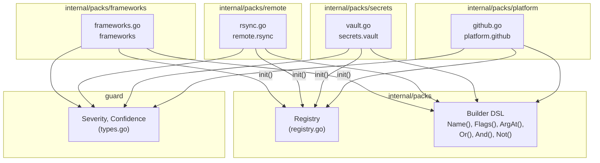
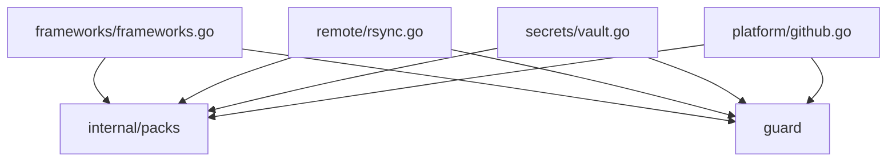

# 03e: Other Packs — Frameworks, rsync, Vault, GitHub

**Batch**: 3 (Pattern Packs)
**Depends On**: [02-matching-framework](./02-matching-framework.md), [03a-packs-core](./03a-packs-core.md)
**Blocks**: [05-testing-and-benchmarks](./05-testing-and-benchmarks.md)
**Architecture**: [00-architecture.md](./00-architecture.md) (§3 Layer 3, §5 packs/)
**Plan Index**: [00-plan-index.md](./00-plan-index.md)
**Pack Authoring Guide**: [03a-packs-core.md §4](./03a-packs-core.md)

---

## 1. Summary

This plan defines 4 remaining packs that don't fit neatly into the core,
database, infrastructure/cloud, or containers/kubernetes categories:

1. **`frameworks`** — Rails, Rake, manage.py, Artisan, Mix: framework CLI
   commands that destroy or reset databases. **New pack — not in upstream
   Rust version.** This is our contribution, designed specifically for
   environment awareness (the canonical `RAILS_ENV=production rails db:reset`
   use case).
2. **`remote.rsync`** — rsync with destructive `--delete*` flags that
   remove destination files not present in the source.
3. **`secrets.vault`** — HashiCorp Vault CLI operations that disable,
   delete, or destroy secrets and leases.
4. **`platform.github`** — GitHub CLI (`gh`) operations that permanently
   delete repos, releases, or close issues/PRs.

**Key design challenges unique to these packs:**

- **Framework subcommand syntax**: Framework CLIs use colon-delimited
  task names (`rails db:reset`, `rake db:drop:all`, `mix ecto.reset`)
  that appear as `ArgAt(0, "db:reset")` in the extracted command. This
  is a different pattern from the slash-subcommand style of docker/kubectl
  or the space-subcommand style of aws/gcloud — colons and dots are part
  of a single argument token.
- **Multiple framework tools in one pack**: Unlike other packs where one
  tool = one pack, the frameworks pack covers 5 distinct tools (rails,
  rake, manage.py, artisan, mix). This is because they all serve the
  same purpose (ORM/migration management) and share the same env-sensitivity
  model. Each tool gets its own safe and destructive patterns but they
  share the pack's Keywords and EnvSensitive setting.
- **manage.py path variants**: Django's manage.py may be invoked as
  `python manage.py`, `./manage.py`, or just `manage.py`. The command
  name after path normalization will always be `manage.py`. For the
  `python manage.py` form, `manage.py` appears at `ArgAt(0)` with the
  subcommand at `ArgAt(1)`.
- **Vault environment sensitivity**: Vault operations are env-sensitive
  because destroying secrets in production vs. dev has drastically
  different impact. `VAULT_ADDR` pointing to a production server is the
  primary indicator.
- **GitHub CLI not env-sensitive**: gh operations are not env-sensitive
  because they operate on specific repos/resources by name — there's no
  "production environment" concept. `gh repo delete` is equally dangerous
  regardless of context.

**Scope**:
- 4 packs, each with safe + destructive patterns
- 12 safe + 22 destructive patterns
- 82 golden file entries across all 4 packs
- Per-pattern unit tests with match and near-miss cases
- Reachability tests for every destructive pattern
- Environment escalation tests for frameworks and vault packs

---

## 2. Component Diagram



---

## 3. Import Flow



Each pack file imports only two packages:
- `github.com/dcosson/destructive-command-guard-go/guard` — for `Severity` and `Confidence` constants
- `github.com/dcosson/destructive-command-guard-go/internal/packs` — for `Pack`, `SafePattern`, `DestructivePattern`, and builder functions

---

## 4. Matching Patterns for Framework, rsync, Vault, and GitHub Commands

### 4.1 Framework Colon-Delimited Task Matching

Framework CLIs use colon-delimited task names as subcommands. After
tree-sitter parsing and command extraction, these appear as single
argument tokens:

| Tool | Command | Name | ArgAt(0) |
|------|---------|------|----------|
| rails | `rails db:reset` | `rails` | `db:reset` |
| rails | `rails db:drop` | `rails` | `db:drop` |
| rake | `rake db:drop:all` | `rake` | `db:drop:all` |
| artisan | `php artisan migrate:fresh` | `php` | `artisan` (ArgAt(1)=`migrate:fresh`) |
| mix | `mix ecto.reset` | `mix` | `ecto.reset` |

Note the special cases:
- **`php artisan`**: The command name is `php` and `artisan` is `ArgAt(0)`.
  The actual task is at `ArgAt(1)`. We also match the direct `artisan`
  invocation where the command name is `artisan` and the task is `ArgAt(0)`.
- **manage.py**: The command name is `manage.py` (after path normalization)
  and the subcommand is `ArgAt(0)`. For `python manage.py`, the command
  name is `python` and `manage.py` is `ArgAt(0)` with the subcommand at
  `ArgAt(1)`.

### 4.2 rsync Delete Flag Matching

rsync's destructive behavior comes entirely from `--delete*` flags:

| Flag | Effect |
|------|--------|
| `--delete` | Delete files in dest not in source (default: during transfer) |
| `--delete-before` | Delete files in dest before transfer starts |
| `--delete-after` | Delete files in dest after transfer completes |
| `--delete-during` | Delete files in dest during transfer (explicit) |
| `--delete-excluded` | Delete excluded files in dest |

All `--delete*` variants are matched. Plain `rsync` without delete flags
is additive-only and safe.

### 4.3 Vault Multi-Level Subcommands

Vault CLI uses 2-level subcommands (action + noun/verb):

| Command | Name | ArgAt(0) | ArgAt(1) |
|---------|------|----------|----------|
| `vault secrets disable` | `vault` | `secrets` | `disable` |
| `vault delete` | `vault` | `delete` | — |
| `vault kv destroy` | `vault` | `kv` | `destroy` |
| `vault lease revoke` | `vault` | `lease` | `revoke` |
| `vault kv delete` | `vault` | `kv` | `delete` |

Note: `vault delete` (legacy) and `vault kv delete` (modern) both
soft-delete secrets. `vault kv destroy` hard-deletes (removes all
versions permanently). We differentiate severity based on recoverability.

### 4.4 GitHub CLI Subcommand Matching

gh CLI uses `gh <resource> <action>` syntax:

| Command | Name | ArgAt(0) | ArgAt(1) |
|---------|------|----------|----------|
| `gh repo delete` | `gh` | `repo` | `delete` |
| `gh release delete` | `gh` | `release` | `delete` |
| `gh issue close` | `gh` | `issue` | `close` |
| `gh pr close` | `gh` | `pr` | `close` |

gh has many safe subcommands (`gh repo clone`, `gh pr list`, etc.) that
need safe patterns to prevent false positives from overly broad destructive
matching.

---

## 5. Pack Definitions

### 5.1 `frameworks` Pack (`internal/packs/frameworks/frameworks.go`)

**Pack ID**: `frameworks`
**Keywords**: `["rails", "rake", "manage.py", "artisan", "mix"]`
**Safe Patterns**: 6
**Destructive Patterns**: 10
**EnvSensitive**: Yes

This pack covers framework ORM/migration CLIs that can destroy or reset
databases. It is the canonical environment-sensitive pack — `RAILS_ENV=production
rails db:reset` is the motivating example from shaping (A8).

**Environment detection indicators** (checked by env detector, plan 02):
- `RAILS_ENV=production` / `RAILS_ENV=prod`
- `RACK_ENV=production`
- `NODE_ENV=production`
- `FLASK_ENV=production`
- `APP_ENV=production`
- `MIX_ENV=prod`
- `DATABASE_URL` containing production hostname

```go
var frameworksPack = packs.Pack{
    ID:          "frameworks",
    Name:        "Frameworks",
    Description: "Framework ORM/migration commands that destroy or reset databases",
    Keywords:    []string{"rails", "rake", "manage.py", "artisan", "mix"},

    Safe: []packs.SafePattern{
        // S1: rails db:migrate (additive migration — safe)
        {
            Name: "rails-db-migrate-safe",
            Match: packs.And(
                packs.Name("rails"),
                packs.ArgAt(0, "db:migrate"),
                packs.Not(packs.Flags("--run-syncdb")),
            ),
        },

        // S2: rails db:seed (insert seed data — safe)
        {
            Name: "rails-db-seed-safe",
            Match: packs.And(
                packs.Name("rails"),
                packs.ArgAt(0, "db:seed"),
            ),
        },

        // S3: rails server, console, routes, etc. (non-DB — safe)
        {
            Name: "rails-non-db-safe",
            Match: packs.And(
                packs.Name("rails"),
                packs.Or(
                    packs.ArgAt(0, "server"),
                    packs.ArgAt(0, "s"),
                    packs.ArgAt(0, "console"),
                    packs.ArgAt(0, "c"),
                    packs.ArgAt(0, "routes"),
                    packs.ArgAt(0, "generate"),
                    packs.ArgAt(0, "g"),
                    packs.ArgAt(0, "runner"),
                    packs.ArgAt(0, "r"),
                    packs.ArgAt(0, "test"),
                    packs.ArgAt(0, "t"),
                    packs.ArgAt(0, "credentials:edit"),
                    packs.ArgAt(0, "new"),
                ),
            ),
        },

        // S4: manage.py runserver, test, shell, etc. (non-DB — safe)
        {
            Name: "managepy-non-db-safe",
            Match: packs.And(
                packs.Or(
                    // Direct invocation: manage.py <subcmd>
                    packs.And(
                        packs.Name("manage.py"),
                        packs.Or(
                            packs.ArgAt(0, "runserver"),
                            packs.ArgAt(0, "test"),
                            packs.ArgAt(0, "shell"),
                            packs.ArgAt(0, "createsuperuser"),
                            packs.ArgAt(0, "collectstatic"),
                            packs.ArgAt(0, "makemigrations"),
                            packs.ArgAt(0, "showmigrations"),
                            packs.ArgAt(0, "startapp"),
                            packs.ArgAt(0, "startproject"),
                            packs.ArgAt(0, "check"),
                        ),
                    ),
                    // python manage.py <subcmd>
                    packs.And(
                        packs.Name("python"),
                        packs.ArgAt(0, "manage.py"),
                        packs.Or(
                            packs.ArgAt(1, "runserver"),
                            packs.ArgAt(1, "test"),
                            packs.ArgAt(1, "shell"),
                            packs.ArgAt(1, "createsuperuser"),
                            packs.ArgAt(1, "collectstatic"),
                            packs.ArgAt(1, "makemigrations"),
                            packs.ArgAt(1, "showmigrations"),
                            packs.ArgAt(1, "startapp"),
                            packs.ArgAt(1, "startproject"),
                            packs.ArgAt(1, "check"),
                        ),
                    ),
                ),
            ),
        },

        // S5: mix deps.get, mix compile, mix test, etc. (non-DB — safe)
        {
            Name: "mix-non-db-safe",
            Match: packs.And(
                packs.Name("mix"),
                packs.Or(
                    packs.ArgAt(0, "deps.get"),
                    packs.ArgAt(0, "deps.compile"),
                    packs.ArgAt(0, "compile"),
                    packs.ArgAt(0, "test"),
                    packs.ArgAt(0, "format"),
                    packs.ArgAt(0, "hex.info"),
                    packs.ArgAt(0, "phx.server"),
                    packs.ArgAt(0, "phx.routes"),
                    packs.ArgAt(0, "phx.gen.html"),
                    packs.ArgAt(0, "phx.gen.json"),
                    packs.ArgAt(0, "phx.gen.live"),
                    packs.ArgAt(0, "phx.new"),
                ),
            ),
        },

        // S6: artisan non-DB commands (safe)
        {
            Name: "artisan-non-db-safe",
            Match: packs.Or(
                // Direct: artisan serve, artisan make:*, etc.
                packs.And(
                    packs.Name("artisan"),
                    packs.Or(
                        packs.ArgAt(0, "serve"),
                        packs.ArgAt(0, "tinker"),
                        packs.ArgAt(0, "test"),
                        packs.ArgAt(0, "route:list"),
                        packs.ArgAt(0, "key:generate"),
                        packs.ArgAt(0, "config:cache"),
                        packs.ArgAt(0, "cache:clear"),
                        packs.ArgAt(0, "view:clear"),
                    ),
                ),
                // php artisan serve, php artisan make:*, etc.
                packs.And(
                    packs.Name("php"),
                    packs.ArgAt(0, "artisan"),
                    packs.Or(
                        packs.ArgAt(1, "serve"),
                        packs.ArgAt(1, "tinker"),
                        packs.ArgAt(1, "test"),
                        packs.ArgAt(1, "route:list"),
                        packs.ArgAt(1, "key:generate"),
                        packs.ArgAt(1, "config:cache"),
                        packs.ArgAt(1, "cache:clear"),
                        packs.ArgAt(1, "view:clear"),
                    ),
                ),
            ),
        },
    },

    Destructive: []packs.DestructivePattern{
        // --- Rails ---

        // D1: rails db:drop (drops the database entirely)
        {
            Name: "rails-db-drop",
            Match: packs.And(
                packs.Name("rails"),
                packs.ArgAt(0, "db:drop"),
            ),
            Severity:     guard.High,
            Confidence:   guard.ConfidenceHigh,
            Reason:       "rails db:drop destroys the entire database; all tables and data are permanently deleted",
            Remediation:  "Use rails db:rollback to undo specific migrations, or ensure you have a recent backup",
            EnvSensitive: true,
        },

        // D2: rails db:reset (drop + create + schema:load)
        {
            Name: "rails-db-reset",
            Match: packs.And(
                packs.Name("rails"),
                packs.ArgAt(0, "db:reset"),
            ),
            Severity:     guard.High,
            Confidence:   guard.ConfidenceHigh,
            Reason:       "rails db:reset drops and recreates the database; all data is permanently lost",
            Remediation:  "Use rails db:migrate to apply pending migrations without data loss",
            EnvSensitive: true,
        },

        // D3: rails db:schema:load (replaces current schema, drops existing tables)
        {
            Name: "rails-db-schema-load",
            Match: packs.And(
                packs.Name("rails"),
                packs.Or(
                    packs.ArgAt(0, "db:schema:load"),
                    packs.ArgAt(0, "db:structure:load"),
                ),
            ),
            Severity:     guard.High,
            Confidence:   guard.ConfidenceHigh,
            Reason:       "rails db:schema:load replaces the current database schema; existing tables are dropped and recreated",
            Remediation:  "Use rails db:migrate to apply schema changes incrementally",
            EnvSensitive: true,
        },

        // --- Rake ---

        // D4: rake db:drop:all (drops all databases for all environments)
        {
            Name: "rake-db-drop-all",
            Match: packs.And(
                packs.Name("rake"),
                packs.ArgAt(0, "db:drop:all"),
            ),
            Severity:     guard.Critical,
            Confidence:   guard.ConfidenceHigh,
            Reason:       "rake db:drop:all drops databases for ALL environments including production",
            Remediation:  "Use rake db:drop to drop only the current environment's database",
            EnvSensitive: true,
        },

        // D5: rake db:drop, rake db:reset, rake db:schema:load
        {
            Name: "rake-db-destructive",
            Match: packs.And(
                packs.Name("rake"),
                packs.Or(
                    packs.ArgAt(0, "db:drop"),
                    packs.ArgAt(0, "db:reset"),
                    packs.ArgAt(0, "db:schema:load"),
                    packs.ArgAt(0, "db:structure:load"),
                ),
            ),
            Severity:     guard.High,
            Confidence:   guard.ConfidenceHigh,
            Reason:       "This rake task destroys or replaces the database; all data is permanently lost",
            Remediation:  "Use rake db:migrate to apply migrations without data loss",
            EnvSensitive: true,
        },

        // --- Django manage.py ---

        // D6: manage.py flush (deletes all data from database)
        {
            Name: "managepy-flush",
            Match: packs.Or(
                // Direct: manage.py flush
                packs.And(
                    packs.Name("manage.py"),
                    packs.ArgAt(0, "flush"),
                ),
                // python manage.py flush
                packs.And(
                    packs.Name("python"),
                    packs.ArgAt(0, "manage.py"),
                    packs.ArgAt(1, "flush"),
                ),
            ),
            Severity:     guard.High,
            Confidence:   guard.ConfidenceHigh,
            Reason:       "manage.py flush deletes all data from the database tables without dropping them",
            Remediation:  "Use manage.py dumpdata to export data before flushing, or target specific apps",
            EnvSensitive: true,
        },

        // D7: manage.py migrate --run-syncdb (creates tables without migrations, may lose data)
        {
            Name: "managepy-migrate-syncdb",
            Match: packs.Or(
                packs.And(
                    packs.Name("manage.py"),
                    packs.ArgAt(0, "migrate"),
                    packs.Flags("--run-syncdb"),
                ),
                packs.And(
                    packs.Name("python"),
                    packs.ArgAt(0, "manage.py"),
                    packs.ArgAt(1, "migrate"),
                    packs.Flags("--run-syncdb"),
                ),
            ),
            Severity:     guard.Medium,
            Confidence:   guard.ConfidenceMedium,
            Reason:       "manage.py migrate --run-syncdb creates tables outside the migration framework, which can cause schema inconsistencies",
            Remediation:  "Use manage.py makemigrations to create proper migrations, then manage.py migrate without --run-syncdb",
            EnvSensitive: true,
        },

        // --- Laravel Artisan ---

        // D8: artisan migrate:fresh (drops all tables, re-runs all migrations)
        {
            Name: "artisan-migrate-fresh",
            Match: packs.Or(
                packs.And(
                    packs.Name("artisan"),
                    packs.ArgAt(0, "migrate:fresh"),
                ),
                packs.And(
                    packs.Name("php"),
                    packs.ArgAt(0, "artisan"),
                    packs.ArgAt(1, "migrate:fresh"),
                ),
            ),
            Severity:     guard.High,
            Confidence:   guard.ConfidenceHigh,
            Reason:       "artisan migrate:fresh drops all tables and re-runs all migrations; all data is permanently lost",
            Remediation:  "Use artisan migrate to run pending migrations without dropping existing tables",
            EnvSensitive: true,
        },

        // D9: artisan migrate:reset (rolls back all migrations)
        {
            Name: "artisan-migrate-reset",
            Match: packs.Or(
                packs.And(
                    packs.Name("artisan"),
                    packs.ArgAt(0, "migrate:reset"),
                ),
                packs.And(
                    packs.Name("php"),
                    packs.ArgAt(0, "artisan"),
                    packs.ArgAt(1, "migrate:reset"),
                ),
            ),
            Severity:     guard.High,
            Confidence:   guard.ConfidenceHigh,
            Reason:       "artisan migrate:reset rolls back all migrations, dropping tables created by those migrations",
            Remediation:  "Use artisan migrate:rollback to roll back only the last batch of migrations",
            EnvSensitive: true,
        },

        // --- Elixir Mix ---

        // D10: mix ecto.reset (drop + create + migrate)
        {
            Name: "mix-ecto-reset",
            Match: packs.And(
                packs.Name("mix"),
                packs.ArgAt(0, "ecto.reset"),
            ),
            Severity:     guard.High,
            Confidence:   guard.ConfidenceHigh,
            Reason:       "mix ecto.reset drops the database, recreates it, and runs all migrations; all data is permanently lost",
            Remediation:  "Use mix ecto.migrate to run pending migrations without data loss",
            EnvSensitive: true,
        },
    },
}
```

#### 5.1.1 Design Notes — Frameworks Pack

1. **Rake vs Rails overlap**: Both `rails db:drop` and `rake db:drop` exist
   because Rails delegates to Rake internally. Both must be matched because
   agents may invoke either. The patterns are separate because the command
   names differ. `rake db:drop:all` has no Rails equivalent — it explicitly
   targets all environments and is Critical.

2. **manage.py dual invocation**: `manage.py` may be invoked directly
   (`./manage.py flush`) or via Python (`python manage.py flush`). After
   path normalization, `./manage.py` becomes `manage.py`. We match both
   forms using `Or()`. The `python3` variant is also handled because path
   normalization strips version suffixes (plan 01 §4.2).

3. **artisan dual invocation**: Similar to manage.py — `artisan` can be
   invoked directly or as `php artisan`. We match both forms.

4. **mix ecto.drop not separate**: `mix ecto.drop` is a subset of
   `mix ecto.reset` (reset = drop + create + migrate). We could add a
   separate pattern for `mix ecto.drop` at High severity. Including it
   here for completeness:

   **v2 consideration**: Add `mix ecto.drop` and `mix ecto.rollback --all`
   as separate patterns. For v1, `mix ecto.reset` covers the primary use
   case.

5. **Safe pattern S1 (rails db:migrate)**: Excludes `--run-syncdb` to avoid
   shadowing D7. Note: `--run-syncdb` is a Django flag, not a Rails flag.
   S1 adds the Not clause defensively in case someone passes unexpected
   flags. In practice, `rails db:migrate` never takes `--run-syncdb`.

6. **`artisan make:*` commands**: Commands like `artisan make:model`,
   `artisan make:migration`, `artisan make:controller` are code generators,
   not database operations. They are safe but we don't enumerate all of them
   in S6 — the safe pattern covers the most common non-DB commands. The
   `make:*` commands won't match any destructive pattern because none of
   D8/D9 match `make:*` task names.

7. **Environment sensitivity for all destructive patterns**: Every destructive
   pattern has `EnvSensitive: true` because all framework DB operations are
   significantly more dangerous in production. The env detector checks
   `RAILS_ENV`, `RACK_ENV`, `NODE_ENV`, `FLASK_ENV`, `APP_ENV`, `MIX_ENV`
   for production values.

---

### 5.2 `remote.rsync` Pack (`internal/packs/remote/rsync.go`)

**Pack ID**: `remote.rsync`
**Keywords**: `["rsync"]`
**Safe Patterns**: 1
**Destructive Patterns**: 3
**EnvSensitive**: No

rsync is a file synchronization tool. Without `--delete*` flags, it only
adds or updates files at the destination — it's additive-only and safe.
The `--delete*` family of flags makes rsync remove destination files that
don't exist in the source, which can cause data loss.

```go
var rsyncPack = packs.Pack{
    ID:          "remote.rsync",
    Name:        "rsync",
    Description: "rsync file synchronization with destructive delete flags",
    Keywords:    []string{"rsync"},

    Safe: []packs.SafePattern{
        // S1: rsync without --delete* flags (additive-only — safe)
        //     Must NOT match any --delete variant to avoid shadowing D1-D3.
        {
            Name: "rsync-no-delete-safe",
            Match: packs.And(
                packs.Name("rsync"),
                packs.Not(packs.Flags("--delete")),
                packs.Not(packs.Flags("--delete-before")),
                packs.Not(packs.Flags("--delete-after")),
                packs.Not(packs.Flags("--delete-during")),
                packs.Not(packs.Flags("--delete-excluded")),
                packs.Not(packs.Flags("--delete-delay")),
            ),
        },
    },

    Destructive: []packs.DestructivePattern{
        // D1: rsync --delete-excluded (deletes files excluded by --exclude)
        //     Higher severity because files you explicitly excluded from
        //     transfer are deleted at the destination.
        {
            Name: "rsync-delete-excluded",
            Match: packs.And(
                packs.Name("rsync"),
                packs.Flags("--delete-excluded"),
            ),
            Severity:     guard.High,
            Confidence:   guard.ConfidenceHigh,
            Reason:       "rsync --delete-excluded removes destination files that are excluded from transfer by --exclude patterns",
            Remediation:  "Use --delete instead of --delete-excluded to only remove destination files that are not in the source (but keep excluded files intact)",
            EnvSensitive: false,
        },

        // D2: rsync --delete-before (deletes destination files BEFORE transfer)
        //     Higher severity than --delete because files are removed before
        //     new versions arrive, creating a window where data is missing.
        {
            Name: "rsync-delete-before",
            Match: packs.And(
                packs.Name("rsync"),
                packs.Flags("--delete-before"),
            ),
            Severity:     guard.Medium,
            Confidence:   guard.ConfidenceHigh,
            Reason:       "rsync --delete-before removes destination files not in source before transfer begins, creating a period with missing files",
            Remediation:  "Use --delete (default) or --delete-after for safer ordering where new files arrive before old ones are removed",
            EnvSensitive: false,
        },

        // D3: rsync --delete (catch-all for all --delete variants)
        //     Matches --delete, --delete-after, --delete-during, --delete-delay
        //     D1 and D2 are evaluated first for their specific variants.
        {
            Name: "rsync-delete",
            Match: packs.And(
                packs.Name("rsync"),
                packs.Or(
                    packs.Flags("--delete"),
                    packs.Flags("--delete-after"),
                    packs.Flags("--delete-during"),
                    packs.Flags("--delete-delay"),
                ),
            ),
            Severity:     guard.Medium,
            Confidence:   guard.ConfidenceHigh,
            Reason:       "rsync with --delete removes destination files that are not present in the source directory",
            Remediation:  "Use --dry-run (-n) first to see what would be deleted, then run without --dry-run if the result looks correct",
            EnvSensitive: false,
        },
    },
}
```

#### 5.2.1 Design Notes — rsync Pack

1. **Pattern ordering**: D1 (`--delete-excluded`) is evaluated before D3
   because it has higher severity. D2 (`--delete-before`) is also before D3.
   The catch-all D3 handles `--delete`, `--delete-after`, `--delete-during`,
   and `--delete-delay`.

2. **Not env-sensitive**: rsync operates on files, which have the same risk
   profile regardless of environment. Unlike database operations, there's no
   "production rsync" vs "development rsync" distinction that warrants
   severity escalation. If rsync is used to deploy to production servers,
   the risk comes from the target path, not an environment variable.

3. **`--dry-run` not a safe pattern exemption**: We don't add `--dry-run`
   as a safe pattern because tree-sitter extracts it as a flag. The
   `--delete` flag is still present even with `--dry-run`, and the command
   *would* be destructive without the dry run. We flag it and let the
   remediation suggest `--dry-run`. A future enhancement could add
   `--dry-run` awareness to reduce noise.

4. **Multiple --delete flags**: A command like `rsync --delete --delete-excluded`
   will match D1 (highest severity) because D1 is evaluated first. This is
   correct — the most severe flag dominates.

---

### 5.3 `secrets.vault` Pack (`internal/packs/secrets/vault.go`)

**Pack ID**: `secrets.vault`
**Keywords**: `["vault"]`
**Safe Patterns**: 3
**Destructive Patterns**: 6
**EnvSensitive**: Yes

HashiCorp Vault manages secrets, tokens, and leases. Destructive operations
permanently delete or disable access to secrets. Vault operations are
env-sensitive because destroying production secrets can cause immediate
service outages.

**Environment detection indicators** (checked by env detector):
- `VAULT_ADDR` containing production hostname
- `VAULT_NAMESPACE` containing "prod"

```go
var vaultPack = packs.Pack{
    ID:          "secrets.vault",
    Name:        "Vault",
    Description: "HashiCorp Vault secret, engine, and lease destructive operations",
    Keywords:    []string{"vault"},

    Safe: []packs.SafePattern{
        // S1: vault read, vault kv get (read secrets — safe)
        {
            Name: "vault-read-safe",
            Match: packs.And(
                packs.Name("vault"),
                packs.Or(
                    packs.ArgAt(0, "read"),
                    packs.And(packs.ArgAt(0, "kv"), packs.ArgAt(1, "get")),
                    packs.And(packs.ArgAt(0, "kv"), packs.ArgAt(1, "list")),
                ),
            ),
        },

        // S2: vault list, vault status, vault audit (inspection — safe)
        {
            Name: "vault-inspect-safe",
            Match: packs.And(
                packs.Name("vault"),
                packs.Or(
                    packs.ArgAt(0, "list"),
                    packs.ArgAt(0, "status"),
                    packs.ArgAt(0, "audit"),
                    packs.ArgAt(0, "path-help"),
                    packs.ArgAt(0, "version"),
                    packs.ArgAt(0, "token"),
                    packs.ArgAt(0, "auth"),
                    packs.ArgAt(0, "login"),
                    packs.ArgAt(0, "policy"),
                ),
            ),
        },

        // S3: vault write, vault kv put (write/update secrets — safe)
        //     Writing secrets is not destructive — it creates or updates.
        //     The Not clauses prevent shadowing vault kv destroy paths.
        {
            Name: "vault-write-safe",
            Match: packs.And(
                packs.Name("vault"),
                packs.Or(
                    packs.ArgAt(0, "write"),
                    packs.And(packs.ArgAt(0, "kv"), packs.ArgAt(1, "put")),
                    packs.And(packs.ArgAt(0, "kv"), packs.ArgAt(1, "patch")),
                    packs.And(packs.ArgAt(0, "secrets"), packs.ArgAt(1, "enable")),
                    packs.And(packs.ArgAt(0, "secrets"), packs.ArgAt(1, "tune")),
                    packs.And(packs.ArgAt(0, "secrets"), packs.ArgAt(1, "list")),
                    packs.And(packs.ArgAt(0, "secrets"), packs.ArgAt(1, "move")),
                ),
            ),
        },
    },

    Destructive: []packs.DestructivePattern{
        // D1: vault secrets disable (disables a secrets engine — all secrets lost)
        {
            Name: "vault-secrets-disable",
            Match: packs.And(
                packs.Name("vault"),
                packs.ArgAt(0, "secrets"),
                packs.ArgAt(1, "disable"),
            ),
            Severity:     guard.Critical,
            Confidence:   guard.ConfidenceHigh,
            Reason:       "vault secrets disable permanently removes a secrets engine and all secrets stored within it",
            Remediation:  "Verify the engine path is correct and that no services depend on secrets in this engine before disabling",
            EnvSensitive: true,
        },

        // D2: vault kv destroy (hard-delete — removes all versions permanently)
        {
            Name: "vault-kv-destroy",
            Match: packs.And(
                packs.Name("vault"),
                packs.ArgAt(0, "kv"),
                packs.ArgAt(1, "destroy"),
            ),
            Severity:     guard.Critical,
            Confidence:   guard.ConfidenceHigh,
            Reason:       "vault kv destroy permanently removes specific secret versions; unlike delete, destroyed versions cannot be recovered",
            Remediation:  "Use vault kv delete for soft-delete (recoverable with vault kv undelete) instead of permanent destruction",
            EnvSensitive: true,
        },

        // D3: vault lease revoke (revokes a lease — may disrupt services using the credential)
        {
            Name: "vault-lease-revoke",
            Match: packs.And(
                packs.Name("vault"),
                packs.ArgAt(0, "lease"),
                packs.ArgAt(1, "revoke"),
            ),
            Severity:     guard.High,
            Confidence:   guard.ConfidenceHigh,
            Reason:       "vault lease revoke immediately invalidates a credential lease; services using the credential will lose access",
            Remediation:  "Check which services hold this lease before revoking; consider letting the lease expire naturally",
            EnvSensitive: true,
        },

        // D4: vault lease revoke -prefix (mass revoke — all leases under a prefix)
        {
            Name: "vault-lease-revoke-prefix",
            Match: packs.And(
                packs.Name("vault"),
                packs.ArgAt(0, "lease"),
                packs.ArgAt(1, "revoke"),
                packs.Or(
                    packs.Flags("-prefix"),
                    packs.Flags("--prefix"),
                ),
            ),
            Severity:     guard.Critical,
            Confidence:   guard.ConfidenceHigh,
            Reason:       "vault lease revoke -prefix revokes ALL leases under the prefix; this can disrupt multiple services simultaneously",
            Remediation:  "Revoke individual leases instead of using -prefix to minimize blast radius",
            EnvSensitive: true,
        },

        // D5: vault delete (legacy soft-delete — data may be recoverable depending on config)
        {
            Name: "vault-delete",
            Match: packs.And(
                packs.Name("vault"),
                packs.ArgAt(0, "delete"),
            ),
            Severity:     guard.High,
            Confidence:   guard.ConfidenceHigh,
            Reason:       "vault delete soft-deletes secrets; data may be recoverable with vault kv undelete depending on engine configuration",
            Remediation:  "Use vault kv get to verify the secret path before deleting; ensure backups exist for non-versioned engines",
            EnvSensitive: true,
        },

        // D6: vault kv delete (modern soft-delete)
        {
            Name: "vault-kv-delete",
            Match: packs.And(
                packs.Name("vault"),
                packs.ArgAt(0, "kv"),
                packs.ArgAt(1, "delete"),
            ),
            Severity:     guard.High,
            Confidence:   guard.ConfidenceHigh,
            Reason:       "vault kv delete soft-deletes the latest version of a secret; recoverable with vault kv undelete if using versioned KV engine",
            Remediation:  "Verify the secret path before deleting; for permanent removal, use vault kv destroy instead",
            EnvSensitive: true,
        },
    },
}
```

#### 5.3.1 Design Notes — Vault Pack

1. **D1 vs D2 severity**: Both are Critical. `vault secrets disable` is
   arguably worse because it removes an entire engine and all its secrets,
   while `vault kv destroy` targets specific versions. But both are
   irreversible, so both are Critical.

2. **D3 vs D4**: `vault lease revoke` targets a single lease (High),
   while `vault lease revoke -prefix` targets all leases under a prefix
   (Critical). The `-prefix` flag is the escalation factor.

3. **D4 ordering before D3**: D4 (with `-prefix`) must be evaluated before
   D3 (catch-all `lease revoke`) because D4 is more specific and has
   higher severity. Since both D3 and D4 match on `vault lease revoke`,
   ordering ensures the more specific pattern is tried first. Note: the
   matcher evaluates all destructive patterns and the highest severity
   match wins, so ordering doesn't affect correctness — but it helps
   readability and signals intent.

4. **D5 vs D6**: Both are soft-deletes at High severity. D5 (`vault delete`)
   is the legacy path, D6 (`vault kv delete`) is the modern path. They're
   separate because the subcommand structure differs.

5. **Safe pattern S2 token/auth/login**: We mark `vault token`, `vault auth`,
   and `vault login` as safe. While `vault token revoke` is destructive,
   the S2 safe pattern short-circuits before destructive evaluation. This
   is a **known gap** — `vault token revoke` will be classified as safe.
   For v1, this is acceptable because token revocation is a common
   operational action and less destructive than secret deletion. **v2
   consideration**: Add `vault token revoke` as a separate destructive
   pattern and refine S2 with Not clauses.

6. **Environment sensitivity**: All destructive patterns are env-sensitive.
   `VAULT_ADDR` is the primary indicator — production Vault servers
   typically have hostnames containing "prod" (checked by env detector
   word-boundary match).

---

### 5.4 `platform.github` Pack (`internal/packs/platform/github.go`)

**Pack ID**: `platform.github`
**Keywords**: `["gh"]`
**Safe Patterns**: 2
**Destructive Patterns**: 3
**EnvSensitive**: No

The GitHub CLI (`gh`) manages repositories, releases, issues, and pull
requests. Destructive operations permanently delete repos or releases,
or close issues/PRs.

```go
var githubPack = packs.Pack{
    ID:          "platform.github",
    Name:        "GitHub CLI",
    Description: "GitHub CLI operations that delete repos, releases, or close issues/PRs",
    Keywords:    []string{"gh"},

    Safe: []packs.SafePattern{
        // S1: gh repo clone, gh repo view, gh repo list, etc. (read/clone — safe)
        {
            Name: "gh-repo-read-safe",
            Match: packs.And(
                packs.Name("gh"),
                packs.ArgAt(0, "repo"),
                packs.Or(
                    packs.ArgAt(1, "clone"),
                    packs.ArgAt(1, "view"),
                    packs.ArgAt(1, "list"),
                    packs.ArgAt(1, "create"),
                    packs.ArgAt(1, "fork"),
                    packs.ArgAt(1, "rename"),
                    packs.ArgAt(1, "edit"),
                    packs.ArgAt(1, "sync"),
                    packs.ArgAt(1, "archive"),
                    packs.ArgAt(1, "unarchive"),
                    packs.ArgAt(1, "set-default"),
                ),
            ),
        },

        // S2: gh pr/issue list, view, create, checkout, etc. (non-close — safe)
        {
            Name: "gh-pr-issue-safe",
            Match: packs.And(
                packs.Name("gh"),
                packs.Or(
                    packs.ArgAt(0, "pr"),
                    packs.ArgAt(0, "issue"),
                ),
                packs.Or(
                    packs.ArgAt(1, "list"),
                    packs.ArgAt(1, "view"),
                    packs.ArgAt(1, "create"),
                    packs.ArgAt(1, "checkout"),
                    packs.ArgAt(1, "checks"),
                    packs.ArgAt(1, "diff"),
                    packs.ArgAt(1, "ready"),
                    packs.ArgAt(1, "review"),
                    packs.ArgAt(1, "comment"),
                    packs.ArgAt(1, "edit"),
                    packs.ArgAt(1, "merge"),
                    packs.ArgAt(1, "reopen"),
                    packs.ArgAt(1, "status"),
                    packs.ArgAt(1, "develop"),
                    packs.ArgAt(1, "lock"),
                    packs.ArgAt(1, "unlock"),
                    packs.ArgAt(1, "pin"),
                    packs.ArgAt(1, "unpin"),
                    packs.ArgAt(1, "transfer"),
                ),
            ),
        },
    },

    Destructive: []packs.DestructivePattern{
        // D1: gh repo delete (permanently deletes the entire repository)
        {
            Name: "gh-repo-delete",
            Match: packs.And(
                packs.Name("gh"),
                packs.ArgAt(0, "repo"),
                packs.ArgAt(1, "delete"),
            ),
            Severity:     guard.Critical,
            Confidence:   guard.ConfidenceHigh,
            Reason:       "gh repo delete permanently deletes the entire repository including all branches, issues, and pull requests",
            Remediation:  "Use gh repo archive to archive instead of deleting; archived repos can be unarchived later",
            EnvSensitive: false,
        },

        // D2: gh release delete (deletes a release and optionally its tag)
        {
            Name: "gh-release-delete",
            Match: packs.And(
                packs.Name("gh"),
                packs.ArgAt(0, "release"),
                packs.ArgAt(1, "delete"),
            ),
            Severity:     guard.High,
            Confidence:   guard.ConfidenceHigh,
            Reason:       "gh release delete removes a release; with --cleanup-tag it also deletes the associated git tag",
            Remediation:  "Use gh release edit to modify release metadata instead of deleting and recreating",
            EnvSensitive: false,
        },

        // D3: gh issue close / gh pr close
        {
            Name: "gh-issue-pr-close",
            Match: packs.And(
                packs.Name("gh"),
                packs.Or(
                    packs.ArgAt(0, "issue"),
                    packs.ArgAt(0, "pr"),
                ),
                packs.ArgAt(1, "close"),
            ),
            Severity:     guard.Low,
            Confidence:   guard.ConfidenceHigh,
            Reason:       "Closing issues or pull requests is reversible (can be reopened) but may disrupt ongoing work",
            Remediation:  "Verify with the issue/PR author before closing; use gh issue/pr comment to discuss first",
            EnvSensitive: false,
        },
    },
}
```

#### 5.4.1 Design Notes — GitHub Pack

1. **D1 (repo delete) at Critical**: Repository deletion is permanent and
   irreversible. While GitHub has a brief recovery window for some plans,
   this cannot be relied upon. All branches, issues, PRs, and commit
   history are lost.

2. **D2 (release delete) at High**: Release deletion removes the release
   and optionally the tag. The underlying code remains in the repo. If
   used with `--cleanup-tag`, the tag is also deleted, but tags can be
   recreated. High (not Critical) because the repo itself is intact.

3. **D3 (issue/pr close) at Low**: Closing is always reversible (can
   reopen). This is included because LLM agents should not autonomously
   close issues/PRs without human approval, but it's Low severity because
   no data is lost.

4. **Safe pattern coverage**: S1 and S2 cover the most common gh repo
   and gh pr/issue subcommands. Commands like `gh api`, `gh gist`,
   `gh run`, `gh workflow`, `gh codespace`, `gh ssh-key`, `gh gpg-key`
   are NOT covered by safe patterns — they also don't match any
   destructive pattern, so they pass through without a pack match. This
   is correct — the pack only guards against known destructive operations.

5. **gh repo archive in S1**: We include `archive` in the safe pattern.
   While archiving prevents further changes, it's reversible (unarchive)
   and doesn't delete anything. It's the recommended alternative to
   deletion.

6. **Not env-sensitive**: gh operates on named resources (repos, issues).
   There's no environment variable that makes all gh operations more
   dangerous. A user deleting a production repo by name is dangerous, but
   the "production-ness" comes from the repo name, not an env var.

---

## 6. Golden File Entries

### 6.1 `frameworks` Golden Entries (38 entries)

```yaml
format: v1
---
# === Rails ===
# D1: rails db:drop
command: rails db:drop
decision: Deny
severity: High
confidence: High
pack: frameworks
rule: rails-db-drop
env_escalated: false
---
command: RAILS_ENV=production rails db:drop
decision: Deny
severity: Critical
confidence: High
pack: frameworks
rule: rails-db-drop
env_escalated: true
---
# D2: rails db:reset
command: rails db:reset
decision: Deny
severity: High
confidence: High
pack: frameworks
rule: rails-db-reset
env_escalated: false
---
command: RAILS_ENV=production rails db:reset
decision: Deny
severity: Critical
confidence: High
pack: frameworks
rule: rails-db-reset
env_escalated: true
---
# D3: rails db:schema:load
command: rails db:schema:load
decision: Deny
severity: High
confidence: High
pack: frameworks
rule: rails-db-schema-load
env_escalated: false
---
command: rails db:structure:load
decision: Deny
severity: High
confidence: High
pack: frameworks
rule: rails-db-schema-load
env_escalated: false
---
# D4: rake db:drop:all (Critical — all environments)
command: rake db:drop:all
decision: Deny
severity: Critical
confidence: High
pack: frameworks
rule: rake-db-drop-all
env_escalated: false
---
# D5: rake db:drop
command: rake db:drop
decision: Deny
severity: High
confidence: High
pack: frameworks
rule: rake-db-destructive
env_escalated: false
---
command: rake db:reset
decision: Deny
severity: High
confidence: High
pack: frameworks
rule: rake-db-destructive
env_escalated: false
---
command: rake db:schema:load
decision: Deny
severity: High
confidence: High
pack: frameworks
rule: rake-db-destructive
env_escalated: false
---
# D6: manage.py flush (direct invocation)
command: manage.py flush
decision: Deny
severity: High
confidence: High
pack: frameworks
rule: managepy-flush
env_escalated: false
---
# D6: manage.py flush (python invocation)
command: python manage.py flush
decision: Deny
severity: High
confidence: High
pack: frameworks
rule: managepy-flush
env_escalated: false
---
# D6: manage.py flush (env-escalated)
command: DJANGO_SETTINGS_MODULE=myapp.settings.production python manage.py flush
decision: Deny
severity: Critical
confidence: High
pack: frameworks
rule: managepy-flush
env_escalated: true
---
# D7: manage.py migrate --run-syncdb
command: manage.py migrate --run-syncdb
decision: Ask
severity: Medium
confidence: Medium
pack: frameworks
rule: managepy-migrate-syncdb
env_escalated: false
---
command: python manage.py migrate --run-syncdb
decision: Ask
severity: Medium
confidence: Medium
pack: frameworks
rule: managepy-migrate-syncdb
env_escalated: false
---
# D8: artisan migrate:fresh (direct)
command: artisan migrate:fresh
decision: Deny
severity: High
confidence: High
pack: frameworks
rule: artisan-migrate-fresh
env_escalated: false
---
# D8: artisan migrate:fresh (php invocation)
command: php artisan migrate:fresh
decision: Deny
severity: High
confidence: High
pack: frameworks
rule: artisan-migrate-fresh
env_escalated: false
---
# D8: artisan migrate:fresh (env-escalated)
command: APP_ENV=production php artisan migrate:fresh
decision: Deny
severity: Critical
confidence: High
pack: frameworks
rule: artisan-migrate-fresh
env_escalated: true
---
# D9: artisan migrate:reset
command: artisan migrate:reset
decision: Deny
severity: High
confidence: High
pack: frameworks
rule: artisan-migrate-reset
env_escalated: false
---
command: php artisan migrate:reset
decision: Deny
severity: High
confidence: High
pack: frameworks
rule: artisan-migrate-reset
env_escalated: false
---
# D10: mix ecto.reset
command: mix ecto.reset
decision: Deny
severity: High
confidence: High
pack: frameworks
rule: mix-ecto-reset
env_escalated: false
---
command: MIX_ENV=prod mix ecto.reset
decision: Deny
severity: Critical
confidence: High
pack: frameworks
rule: mix-ecto-reset
env_escalated: true
---
# === Safe variants ===
# S1: rails db:migrate (safe)
command: rails db:migrate
decision: Allow
---
# S2: rails db:seed (safe)
command: rails db:seed
decision: Allow
---
# S3: rails server (safe)
command: rails server
decision: Allow
---
command: rails console
decision: Allow
---
command: rails generate model User
decision: Allow
---
# S4: manage.py runserver (safe)
command: manage.py runserver
decision: Allow
---
command: python manage.py test
decision: Allow
---
command: python manage.py makemigrations
decision: Allow
---
# manage.py migrate WITHOUT --run-syncdb (safe)
command: manage.py migrate
decision: Allow
---
command: python manage.py migrate
decision: Allow
---
# S5: mix compile, mix test, etc. (safe)
command: mix compile
decision: Allow
---
command: mix test
decision: Allow
---
command: mix deps.get
decision: Allow
---
# S6: artisan non-DB (safe)
command: artisan serve
decision: Allow
---
command: php artisan serve
decision: Allow
---
command: php artisan tinker
decision: Allow
---
```

### 6.2 `remote.rsync` Golden Entries (10 entries)

```yaml
format: v1
---
# D1: rsync --delete-excluded
command: rsync --delete-excluded -avz /src/ /dest/
decision: Deny
severity: High
confidence: High
pack: remote.rsync
rule: rsync-delete-excluded
env_escalated: false
---
# D2: rsync --delete-before
command: rsync --delete-before -avz /src/ user@host:/dest/
decision: Ask
severity: Medium
confidence: High
pack: remote.rsync
rule: rsync-delete-before
env_escalated: false
---
# D3: rsync --delete (default)
command: rsync --delete -avz /src/ /dest/
decision: Ask
severity: Medium
confidence: High
pack: remote.rsync
rule: rsync-delete
env_escalated: false
---
command: rsync --delete-after -avz /src/ /dest/
decision: Ask
severity: Medium
confidence: High
pack: remote.rsync
rule: rsync-delete
env_escalated: false
---
command: rsync --delete-during -avz /src/ /dest/
decision: Ask
severity: Medium
confidence: High
pack: remote.rsync
rule: rsync-delete
env_escalated: false
---
# === Safe variants ===
# S1: rsync without --delete (additive-only — safe)
command: rsync -avz /src/ /dest/
decision: Allow
---
command: rsync -avz /src/ user@host:/dest/
decision: Allow
---
# rsync with --dry-run and --delete (still flagged — delete is present)
command: rsync --delete --dry-run -avz /src/ /dest/
decision: Ask
severity: Medium
confidence: High
pack: remote.rsync
rule: rsync-delete
env_escalated: false
---
# rsync without any flags (safe)
command: rsync file.txt /backup/
decision: Allow
---
# rsync with common flags but no --delete (safe)
command: rsync -avz --progress /src/ /dest/
decision: Allow
---
```

### 6.3 `secrets.vault` Golden Entries (18 entries)

```yaml
format: v1
---
# D1: vault secrets disable (Critical)
command: vault secrets disable secret/
decision: Deny
severity: Critical
confidence: High
pack: secrets.vault
rule: vault-secrets-disable
env_escalated: false
---
command: VAULT_ADDR=https://vault.prod.example.com vault secrets disable secret/
decision: Deny
severity: Critical
confidence: High
pack: secrets.vault
rule: vault-secrets-disable
env_escalated: true
---
# D2: vault kv destroy (Critical)
command: vault kv destroy -versions=1,2,3 secret/myapp/config
decision: Deny
severity: Critical
confidence: High
pack: secrets.vault
rule: vault-kv-destroy
env_escalated: false
---
# D3: vault lease revoke (High)
command: vault lease revoke aws/creds/my-role/abc123
decision: Deny
severity: High
confidence: High
pack: secrets.vault
rule: vault-lease-revoke
env_escalated: false
---
# D4: vault lease revoke -prefix (Critical)
command: vault lease revoke -prefix aws/creds/my-role/
decision: Deny
severity: Critical
confidence: High
pack: secrets.vault
rule: vault-lease-revoke-prefix
env_escalated: false
---
# D5: vault delete (legacy — High)
command: vault delete secret/myapp/config
decision: Deny
severity: High
confidence: High
pack: secrets.vault
rule: vault-delete
env_escalated: false
---
# D6: vault kv delete (modern — High)
command: vault kv delete secret/myapp/config
decision: Deny
severity: High
confidence: High
pack: secrets.vault
rule: vault-kv-delete
env_escalated: false
---
command: vault kv delete -mount=secret myapp/config
decision: Deny
severity: High
confidence: High
pack: secrets.vault
rule: vault-kv-delete
env_escalated: false
---
# === Safe variants ===
# S1: vault read (safe)
command: vault read secret/myapp/config
decision: Allow
---
command: vault kv get secret/myapp/config
decision: Allow
---
command: vault kv list secret/
decision: Allow
---
# S2: vault status (safe)
command: vault status
decision: Allow
---
command: vault list secret/
decision: Allow
---
command: vault version
decision: Allow
---
command: vault login
decision: Allow
---
# S3: vault write, kv put (safe)
command: vault write secret/myapp/config key=value
decision: Allow
---
command: vault kv put secret/myapp/config key=value
decision: Allow
---
command: vault secrets enable -path=secret kv-v2
decision: Allow
---
```

### 6.4 `platform.github` Golden Entries (16 entries)

```yaml
format: v1
---
# D1: gh repo delete (Critical)
command: gh repo delete my-org/my-repo --yes
decision: Deny
severity: Critical
confidence: High
pack: platform.github
rule: gh-repo-delete
env_escalated: false
---
command: gh repo delete my-repo
decision: Deny
severity: Critical
confidence: High
pack: platform.github
rule: gh-repo-delete
env_escalated: false
---
# D2: gh release delete (High)
command: gh release delete v1.0.0
decision: Deny
severity: High
confidence: High
pack: platform.github
rule: gh-release-delete
env_escalated: false
---
command: gh release delete v1.0.0 --cleanup-tag
decision: Deny
severity: High
confidence: High
pack: platform.github
rule: gh-release-delete
env_escalated: false
---
# D3: gh issue close (Low)
command: gh issue close 42
decision: Allow
severity: Low
confidence: High
pack: platform.github
rule: gh-issue-pr-close
env_escalated: false
---
command: gh pr close 123
decision: Allow
severity: Low
confidence: High
pack: platform.github
rule: gh-issue-pr-close
env_escalated: false
---
# === Safe variants ===
# S1: gh repo read operations (safe)
command: gh repo clone my-org/my-repo
decision: Allow
---
command: gh repo view my-repo
decision: Allow
---
command: gh repo list
decision: Allow
---
command: gh repo create my-new-repo
decision: Allow
---
command: gh repo fork my-org/my-repo
decision: Allow
---
# S2: gh pr/issue read operations (safe)
command: gh pr list
decision: Allow
---
command: gh issue view 42
decision: Allow
---
command: gh pr create --title "Fix" --body "Fix bug"
decision: Allow
---
command: gh pr merge 123
decision: Allow
---
command: gh issue comment 42 --body "LGTM"
decision: Allow
---
```

### 6.5 Entry Count Summary

| Pack | Entries |
|------|---------|
| `frameworks` | 38 |
| `remote.rsync` | 10 |
| `secrets.vault` | 18 |
| `platform.github` | 16 |
| **Total** | **82** |

---

## 7. Reachability Map

Every destructive pattern must have at least one command that:
1. Bypasses all safe patterns in the pack
2. Matches the destructive pattern

This is verified by the reachability test (03a §7.1 pattern).

### 7.1 Frameworks Reachability

| Pattern | Reachability Command |
|---------|---------------------|
| D1: rails-db-drop | `rails db:drop` |
| D2: rails-db-reset | `rails db:reset` |
| D3: rails-db-schema-load | `rails db:schema:load` |
| D4: rake-db-drop-all | `rake db:drop:all` |
| D5: rake-db-destructive | `rake db:drop` |
| D6: managepy-flush | `manage.py flush` |
| D7: managepy-migrate-syncdb | `manage.py migrate --run-syncdb` |
| D8: artisan-migrate-fresh | `artisan migrate:fresh` |
| D9: artisan-migrate-reset | `artisan migrate:reset` |
| D10: mix-ecto-reset | `mix ecto.reset` |

### 7.2 rsync Reachability

| Pattern | Reachability Command |
|---------|---------------------|
| D1: rsync-delete-excluded | `rsync --delete-excluded -avz /src/ /dest/` |
| D2: rsync-delete-before | `rsync --delete-before -avz /src/ /dest/` |
| D3: rsync-delete | `rsync --delete -avz /src/ /dest/` |

### 7.3 Vault Reachability

| Pattern | Reachability Command |
|---------|---------------------|
| D1: vault-secrets-disable | `vault secrets disable secret/` |
| D2: vault-kv-destroy | `vault kv destroy secret/myapp` |
| D3: vault-lease-revoke | `vault lease revoke lease123` |
| D4: vault-lease-revoke-prefix | `vault lease revoke -prefix aws/creds/` |
| D5: vault-delete | `vault delete secret/myapp` |
| D6: vault-kv-delete | `vault kv delete secret/myapp` |

### 7.4 GitHub Reachability

| Pattern | Reachability Command |
|---------|---------------------|
| D1: gh-repo-delete | `gh repo delete my-repo` |
| D2: gh-release-delete | `gh release delete v1.0.0` |
| D3: gh-issue-pr-close | `gh issue close 42` |

---

## 8. Interaction Matrix

Shows how safe patterns interact with destructive patterns within each pack.

### 8.1 Frameworks Interaction Matrix

| Safe↓ / Destructive→ | D1 db:drop | D2 db:reset | D3 schema:load | D4 rake:drop:all | D5 rake:destr | D6 flush | D7 syncdb | D8 fresh | D9 reset | D10 ecto |
|---|---|---|---|---|---|---|---|---|---|---|
| S1 rails-db-migrate | — | — | — | — | — | — | blocked | — | — | — |
| S2 rails-db-seed | — | — | — | — | — | — | — | — | — | — |
| S3 rails-non-db | — | — | — | — | — | — | — | — | — | — |
| S4 managepy-non-db | — | — | — | — | — | — | — | — | — | — |
| S5 mix-non-db | — | — | — | — | — | — | — | — | — | — |
| S6 artisan-non-db | — | — | — | — | — | — | — | — | — | — |

"blocked" = safe pattern could shadow destructive if Not clause removed.
"—" = no interaction (different command names or different subcommands).

**Note**: Interaction is minimal because each safe pattern is scoped to
specific non-destructive subcommands of a specific tool, and destructive
patterns target different subcommands. The main risk is S1 shadowing D7
(both match `manage.py migrate`) — S1's Not clause prevents this.

### 8.2 rsync Interaction Matrix

| Safe↓ / Destructive→ | D1 delete-excluded | D2 delete-before | D3 delete |
|---|---|---|---|
| S1 rsync-no-delete | blocked | blocked | blocked |

S1 has Not clauses for all `--delete*` variants, preventing shadowing.

### 8.3 Vault Interaction Matrix

| Safe↓ / Destructive→ | D1 secrets-disable | D2 kv-destroy | D3 lease-revoke | D4 lease-prefix | D5 delete | D6 kv-delete |
|---|---|---|---|---|---|---|
| S1 vault-read | — | — | — | — | — | — |
| S2 vault-inspect | — | — | — | — | — | — |
| S3 vault-write | — | — | — | — | — | — |

No interactions — safe patterns match read/inspect/write subcommands,
destructive patterns match disable/destroy/revoke/delete subcommands.

**Known gap**: S2 includes `vault token` which would shadow a hypothetical
`vault token revoke` destructive pattern. See §5.3.1 note 5.

### 8.4 GitHub Interaction Matrix

| Safe↓ / Destructive→ | D1 repo-delete | D2 release-delete | D3 issue-pr-close |
|---|---|---|---|
| S1 gh-repo-read | — | — | — |
| S2 gh-pr-issue | — | — | blocked |

S2 covers pr/issue actions but explicitly lists non-close actions. The
"close" action is NOT in S2's list, so D3 is reachable. "blocked" indicates
the safe pattern applies to the same resource type but different actions.

---

## 9. Per-Pattern Unit Tests

### 9.1 Frameworks Test Cases

```go
package frameworks

import (
    "testing"

    "github.com/dcosson/destructive-command-guard-go/internal/parse"
    "github.com/stretchr/testify/assert"
)

func cmd(name string, args []string, flags map[string]string) parse.ExtractedCommand {
    return parse.ExtractedCommand{
        Name:  name,
        Args:  args,
        Flags: flags,
    }
}

func m(pairs ...string) map[string]string {
    flags := make(map[string]string)
    for i := 0; i < len(pairs); i += 2 {
        flags[pairs[i]] = pairs[i+1]
    }
    return flags
}

func TestRailsDbDrop(t *testing.T) {
    pattern := frameworksPack.Destructive[0].Match // D1
    tests := []struct {
        name string
        cmd  parse.ExtractedCommand
        want bool
    }{
        {"rails db:drop", cmd("rails", []string{"db:drop"}, nil), true},
        {"rails db:drop RAILS_ENV=test", cmd("rails", []string{"db:drop"}, nil), true},
        // Near-miss
        {"rails db:migrate", cmd("rails", []string{"db:migrate"}, nil), false},
        {"rails db:reset", cmd("rails", []string{"db:reset"}, nil), false},
        {"rake db:drop", cmd("rake", []string{"db:drop"}, nil), false},
    }
    for _, tt := range tests {
        t.Run(tt.name, func(t *testing.T) {
            assert.Equal(t, tt.want, pattern.Match(tt.cmd))
        })
    }
}

func TestRailsDbReset(t *testing.T) {
    pattern := frameworksPack.Destructive[1].Match // D2
    tests := []struct {
        name string
        cmd  parse.ExtractedCommand
        want bool
    }{
        {"rails db:reset", cmd("rails", []string{"db:reset"}, nil), true},
        // Near-miss
        {"rails db:migrate", cmd("rails", []string{"db:migrate"}, nil), false},
        {"rails db:seed", cmd("rails", []string{"db:seed"}, nil), false},
    }
    for _, tt := range tests {
        t.Run(tt.name, func(t *testing.T) {
            assert.Equal(t, tt.want, pattern.Match(tt.cmd))
        })
    }
}

func TestRakeDbDropAll(t *testing.T) {
    pattern := frameworksPack.Destructive[3].Match // D4
    tests := []struct {
        name string
        cmd  parse.ExtractedCommand
        want bool
    }{
        {"rake db:drop:all", cmd("rake", []string{"db:drop:all"}, nil), true},
        // Near-miss
        {"rake db:drop", cmd("rake", []string{"db:drop"}, nil), false},
        {"rake db:migrate", cmd("rake", []string{"db:migrate"}, nil), false},
        {"rails db:drop:all", cmd("rails", []string{"db:drop:all"}, nil), false},
    }
    for _, tt := range tests {
        t.Run(tt.name, func(t *testing.T) {
            assert.Equal(t, tt.want, pattern.Match(tt.cmd))
        })
    }
}

func TestManagepyFlush(t *testing.T) {
    pattern := frameworksPack.Destructive[5].Match // D6
    tests := []struct {
        name string
        cmd  parse.ExtractedCommand
        want bool
    }{
        {"manage.py flush", cmd("manage.py", []string{"flush"}, nil), true},
        {"python manage.py flush", cmd("python", []string{"manage.py", "flush"}, nil), true},
        // Near-miss
        {"manage.py migrate", cmd("manage.py", []string{"migrate"}, nil), false},
        {"manage.py runserver", cmd("manage.py", []string{"runserver"}, nil), false},
    }
    for _, tt := range tests {
        t.Run(tt.name, func(t *testing.T) {
            assert.Equal(t, tt.want, pattern.Match(tt.cmd))
        })
    }
}

func TestManagepyMigrateSyncdb(t *testing.T) {
    pattern := frameworksPack.Destructive[6].Match // D7
    tests := []struct {
        name string
        cmd  parse.ExtractedCommand
        want bool
    }{
        {"manage.py migrate --run-syncdb", cmd("manage.py", []string{"migrate"}, m("--run-syncdb", "")), true},
        {"python manage.py migrate --run-syncdb", cmd("python", []string{"manage.py", "migrate"}, m("--run-syncdb", "")), true},
        // Near-miss
        {"manage.py migrate (no syncdb)", cmd("manage.py", []string{"migrate"}, nil), false},
        {"python manage.py migrate (no syncdb)", cmd("python", []string{"manage.py", "migrate"}, nil), false},
    }
    for _, tt := range tests {
        t.Run(tt.name, func(t *testing.T) {
            assert.Equal(t, tt.want, pattern.Match(tt.cmd))
        })
    }
}

func TestArtisanMigrateFresh(t *testing.T) {
    pattern := frameworksPack.Destructive[7].Match // D8
    tests := []struct {
        name string
        cmd  parse.ExtractedCommand
        want bool
    }{
        {"artisan migrate:fresh", cmd("artisan", []string{"migrate:fresh"}, nil), true},
        {"php artisan migrate:fresh", cmd("php", []string{"artisan", "migrate:fresh"}, nil), true},
        // Near-miss
        {"artisan migrate", cmd("artisan", []string{"migrate"}, nil), false},
        {"artisan migrate:reset", cmd("artisan", []string{"migrate:reset"}, nil), false},
        {"php artisan migrate", cmd("php", []string{"artisan", "migrate"}, nil), false},
    }
    for _, tt := range tests {
        t.Run(tt.name, func(t *testing.T) {
            assert.Equal(t, tt.want, pattern.Match(tt.cmd))
        })
    }
}

func TestMixEctoReset(t *testing.T) {
    pattern := frameworksPack.Destructive[9].Match // D10
    tests := []struct {
        name string
        cmd  parse.ExtractedCommand
        want bool
    }{
        {"mix ecto.reset", cmd("mix", []string{"ecto.reset"}, nil), true},
        // Near-miss
        {"mix ecto.migrate", cmd("mix", []string{"ecto.migrate"}, nil), false},
        {"mix ecto.create", cmd("mix", []string{"ecto.create"}, nil), false},
        {"mix compile", cmd("mix", []string{"compile"}, nil), false},
    }
    for _, tt := range tests {
        t.Run(tt.name, func(t *testing.T) {
            assert.Equal(t, tt.want, pattern.Match(tt.cmd))
        })
    }
}
```

### 9.2 rsync Test Cases

```go
package remote

func TestRsyncDeleteExcluded(t *testing.T) {
    pattern := rsyncPack.Destructive[0].Match // D1
    tests := []struct {
        name string
        cmd  parse.ExtractedCommand
        want bool
    }{
        {"rsync --delete-excluded", cmd("rsync", []string{"/src/", "/dest/"}, m("--delete-excluded", "")), true},
        {"rsync --delete-excluded -avz", cmd("rsync", []string{"/src/", "/dest/"}, m("--delete-excluded", "", "-a", "", "-v", "", "-z", "")), true},
        // Near-miss
        {"rsync --delete", cmd("rsync", []string{"/src/", "/dest/"}, m("--delete", "")), false},
        {"rsync (no flags)", cmd("rsync", []string{"/src/", "/dest/"}, nil), false},
    }
    for _, tt := range tests {
        t.Run(tt.name, func(t *testing.T) {
            assert.Equal(t, tt.want, pattern.Match(tt.cmd))
        })
    }
}

func TestRsyncDeleteBefore(t *testing.T) {
    pattern := rsyncPack.Destructive[1].Match // D2
    tests := []struct {
        name string
        cmd  parse.ExtractedCommand
        want bool
    }{
        {"rsync --delete-before", cmd("rsync", []string{"/src/", "/dest/"}, m("--delete-before", "")), true},
        // Near-miss
        {"rsync --delete-after", cmd("rsync", []string{"/src/", "/dest/"}, m("--delete-after", "")), false},
        {"rsync --delete", cmd("rsync", []string{"/src/", "/dest/"}, m("--delete", "")), false},
    }
    for _, tt := range tests {
        t.Run(tt.name, func(t *testing.T) {
            assert.Equal(t, tt.want, pattern.Match(tt.cmd))
        })
    }
}

func TestRsyncDelete(t *testing.T) {
    pattern := rsyncPack.Destructive[2].Match // D3
    tests := []struct {
        name string
        cmd  parse.ExtractedCommand
        want bool
    }{
        {"rsync --delete", cmd("rsync", []string{"/src/", "/dest/"}, m("--delete", "")), true},
        {"rsync --delete-after", cmd("rsync", []string{"/src/", "/dest/"}, m("--delete-after", "")), true},
        {"rsync --delete-during", cmd("rsync", []string{"/src/", "/dest/"}, m("--delete-during", "")), true},
        {"rsync --delete-delay", cmd("rsync", []string{"/src/", "/dest/"}, m("--delete-delay", "")), true},
        // Near-miss
        {"rsync (no delete)", cmd("rsync", []string{"/src/", "/dest/"}, nil), false},
        {"rsync -avz", cmd("rsync", []string{"/src/", "/dest/"}, m("-a", "", "-v", "", "-z", "")), false},
    }
    for _, tt := range tests {
        t.Run(tt.name, func(t *testing.T) {
            assert.Equal(t, tt.want, pattern.Match(tt.cmd))
        })
    }
}
```

### 9.3 Vault Test Cases

```go
package secrets

func TestVaultSecretsDisable(t *testing.T) {
    pattern := vaultPack.Destructive[0].Match // D1
    tests := []struct {
        name string
        cmd  parse.ExtractedCommand
        want bool
    }{
        {"vault secrets disable", cmd("vault", []string{"secrets", "disable", "secret/"}, nil), true},
        // Near-miss
        {"vault secrets enable", cmd("vault", []string{"secrets", "enable", "kv-v2"}, nil), false},
        {"vault secrets list", cmd("vault", []string{"secrets", "list"}, nil), false},
    }
    for _, tt := range tests {
        t.Run(tt.name, func(t *testing.T) {
            assert.Equal(t, tt.want, pattern.Match(tt.cmd))
        })
    }
}

func TestVaultKvDestroy(t *testing.T) {
    pattern := vaultPack.Destructive[1].Match // D2
    tests := []struct {
        name string
        cmd  parse.ExtractedCommand
        want bool
    }{
        {"vault kv destroy", cmd("vault", []string{"kv", "destroy", "secret/myapp"}, nil), true},
        {"vault kv destroy -versions", cmd("vault", []string{"kv", "destroy", "secret/myapp"}, m("-versions", "1,2,3")), true},
        // Near-miss
        {"vault kv delete", cmd("vault", []string{"kv", "delete", "secret/myapp"}, nil), false},
        {"vault kv get", cmd("vault", []string{"kv", "get", "secret/myapp"}, nil), false},
    }
    for _, tt := range tests {
        t.Run(tt.name, func(t *testing.T) {
            assert.Equal(t, tt.want, pattern.Match(tt.cmd))
        })
    }
}

func TestVaultLeaseRevokePrefix(t *testing.T) {
    pattern := vaultPack.Destructive[3].Match // D4
    tests := []struct {
        name string
        cmd  parse.ExtractedCommand
        want bool
    }{
        {"vault lease revoke -prefix", cmd("vault", []string{"lease", "revoke", "aws/creds/"}, m("-prefix", "")), true},
        {"vault lease revoke --prefix", cmd("vault", []string{"lease", "revoke", "aws/creds/"}, m("--prefix", "")), true},
        // Near-miss
        {"vault lease revoke (no prefix)", cmd("vault", []string{"lease", "revoke", "abc123"}, nil), false},
    }
    for _, tt := range tests {
        t.Run(tt.name, func(t *testing.T) {
            assert.Equal(t, tt.want, pattern.Match(tt.cmd))
        })
    }
}

func TestVaultDelete(t *testing.T) {
    pattern := vaultPack.Destructive[4].Match // D5
    tests := []struct {
        name string
        cmd  parse.ExtractedCommand
        want bool
    }{
        {"vault delete", cmd("vault", []string{"delete", "secret/myapp"}, nil), true},
        // Near-miss
        {"vault read", cmd("vault", []string{"read", "secret/myapp"}, nil), false},
        {"vault kv delete", cmd("vault", []string{"kv", "delete", "secret/myapp"}, nil), false},
    }
    for _, tt := range tests {
        t.Run(tt.name, func(t *testing.T) {
            assert.Equal(t, tt.want, pattern.Match(tt.cmd))
        })
    }
}
```

### 9.4 GitHub Test Cases

```go
package platform

func TestGhRepoDelete(t *testing.T) {
    pattern := githubPack.Destructive[0].Match // D1
    tests := []struct {
        name string
        cmd  parse.ExtractedCommand
        want bool
    }{
        {"gh repo delete", cmd("gh", []string{"repo", "delete", "my-repo"}, nil), true},
        {"gh repo delete --yes", cmd("gh", []string{"repo", "delete", "my-repo"}, m("--yes", "")), true},
        // Near-miss
        {"gh repo clone", cmd("gh", []string{"repo", "clone", "my-repo"}, nil), false},
        {"gh repo view", cmd("gh", []string{"repo", "view", "my-repo"}, nil), false},
        {"gh release delete", cmd("gh", []string{"release", "delete", "v1.0"}, nil), false},
    }
    for _, tt := range tests {
        t.Run(tt.name, func(t *testing.T) {
            assert.Equal(t, tt.want, pattern.Match(tt.cmd))
        })
    }
}

func TestGhReleaseDelete(t *testing.T) {
    pattern := githubPack.Destructive[1].Match // D2
    tests := []struct {
        name string
        cmd  parse.ExtractedCommand
        want bool
    }{
        {"gh release delete", cmd("gh", []string{"release", "delete", "v1.0"}, nil), true},
        {"gh release delete --cleanup-tag", cmd("gh", []string{"release", "delete", "v1.0"}, m("--cleanup-tag", "")), true},
        // Near-miss
        {"gh release view", cmd("gh", []string{"release", "view", "v1.0"}, nil), false},
        {"gh repo delete", cmd("gh", []string{"repo", "delete", "my-repo"}, nil), false},
    }
    for _, tt := range tests {
        t.Run(tt.name, func(t *testing.T) {
            assert.Equal(t, tt.want, pattern.Match(tt.cmd))
        })
    }
}

func TestGhIssuePrClose(t *testing.T) {
    pattern := githubPack.Destructive[2].Match // D3
    tests := []struct {
        name string
        cmd  parse.ExtractedCommand
        want bool
    }{
        {"gh issue close", cmd("gh", []string{"issue", "close", "42"}, nil), true},
        {"gh pr close", cmd("gh", []string{"pr", "close", "123"}, nil), true},
        // Near-miss
        {"gh issue list", cmd("gh", []string{"issue", "list"}, nil), false},
        {"gh pr view", cmd("gh", []string{"pr", "view", "123"}, nil), false},
        {"gh issue reopen", cmd("gh", []string{"issue", "reopen", "42"}, nil), false},
    }
    for _, tt := range tests {
        t.Run(tt.name, func(t *testing.T) {
            assert.Equal(t, tt.want, pattern.Match(tt.cmd))
        })
    }
}
```

---

## 10. Keyword Coverage Verification

Each pack's keywords must ensure the Aho-Corasick pre-filter triggers for
every command the pack can match.

| Pack | Keywords | Commands Covered |
|------|----------|-----------------|
| `frameworks` | `rails`, `rake`, `manage.py`, `artisan`, `mix` | All framework commands |
| `remote.rsync` | `rsync` | All rsync commands |
| `secrets.vault` | `vault` | All vault commands |
| `platform.github` | `gh` | All gh commands |

**Special cases**:
- **`php artisan`**: The keyword `artisan` appears as an argument, not the
  command name. The pre-filter checks the full command string for keyword
  presence, so `php artisan migrate:fresh` contains `artisan` and triggers.
- **`python manage.py`**: Similarly, `manage.py` appears as an argument.
  The pre-filter finds `manage.py` in the full command string.
- **`mix` keyword specificity**: `mix` is a short word. The pre-filter uses
  word-boundary matching, so `remix` or `mixture` won't trigger. Only
  standalone `mix` matches.

---

## 11. URP — Unreasonably Robust Programming

### 11.1 Framework Subcommand Fuzzing

Generate random colon-delimited subcommands for each framework tool and
verify that:
- Known destructive subcommands always match
- Unknown subcommands never match a destructive pattern
- Partial matches (e.g., `db:dro` vs `db:drop`) don't match

### 11.2 Vault Path Injection Testing

Test that Vault secret paths containing special characters, unicode, or
path traversal attempts (`../`) are handled correctly by the matcher.
The matcher should not be confused by paths that look like subcommands.

### 11.3 rsync Flag Combination Exhaustion

Enumerate all combinations of `--delete*` flags and verify correct
severity assignment. With N=6 delete flags and each being present/absent,
that's 64 combinations — small enough to test exhaustively.

### 11.4 Cross-Pack Keyword Collision Audit

Verify that no keyword from this plan collides with keywords from other
packs in a way that causes unnecessary pre-filter triggering. Specifically:
- `vault` should not trigger `containers.docker` pack (no collision)
- `mix` should not trigger false positives (word boundary prevents `remix`)
- `gh` should not trigger `git` pack (different keywords: `gh` vs `git`)

---

## 12. Extreme Optimization

### 12.1 Keyword Pre-Filter Efficiency

The 5 keywords for the frameworks pack (`rails`, `rake`, `manage.py`,
`artisan`, `mix`) add minimal overhead to the Aho-Corasick automaton.
All keywords are short (3-9 characters) and don't share common prefixes,
so the automaton has minimal branching.

### 12.2 ArgAt Matching

All patterns in these 4 packs use ArgAt-based matching (no regex, no
content matching). ArgAt is the fastest matcher type — it's a direct
array index + string comparison. The frameworks pack has the most
patterns (10 destructive) but each pattern requires at most 2 ArgAt
checks plus a Name check. Worst-case evaluation for the frameworks
pack: ~30 string comparisons per command.

---

## 13. Alien Artifacts

No advanced mathematical or CS techniques are applicable to these packs.
The matching is purely structural (command name + positional arguments +
flags) with no content analysis, no fuzzy matching, and no statistical
classification. The simplicity is a feature — these packs are
deterministic and auditable.

---

## 14. Open Questions

1. **`manage.py` vs `django-admin`**: Django also provides `django-admin`
   as an alternative to `manage.py`. Should we cover `django-admin flush`
   and `django-admin migrate --run-syncdb`? (Recommendation: v2 — less
   commonly used than `manage.py`.)

2. **`mix ecto.drop`**: Should `mix ecto.drop` be a separate pattern or
   is coverage via `mix ecto.reset` sufficient? (Recommendation: add in
   v2 — `ecto.reset` is the more commonly run command.)

3. **`vault token revoke`**: Should we add a destructive pattern for
   `vault token revoke`? Currently shadowed by S2 safe pattern. See
   §5.3.1 note 5. (Recommendation: v2 — requires S2 refinement.)

4. **`gh repo delete` confirmation**: `gh repo delete` requires typing
   the repo name to confirm. Should we factor in interactive confirmation
   into severity? (Recommendation: no — we classify based on what the
   command *would do*, not on whether the CLI has its own safety net.
   Same approach as docker prune without `-f`.)

5. **`bundle exec rake`**: Ruby projects often prefix with `bundle exec`.
   Should we match `bundle exec rake db:drop`? The command name would be
   `bundle` with `exec` at ArgAt(0) and `rake` at ArgAt(1). (Recommendation:
   v2 — requires 3-deep ArgAt matching. For v1, the keyword `rake` still
   triggers the pre-filter but the matcher won't match because the Name
   is `bundle`.)

---

## 15. Testing Summary

| Category | Count | Description |
|----------|-------|-------------|
| Unit tests (match/near-miss) | ~60 | Per-pattern tests for all 22 destructive + 12 safe patterns |
| Reachability tests | 22 | One per destructive pattern |
| Golden file entries | 82 | Across 4 packs |
| Env escalation tests | ~12 | For frameworks (all D1-D10) and vault (D1-D6) patterns |
| Keyword coverage tests | 4 | One per pack |
| Safe-pattern shadowing tests | 4 | One per pack interaction matrix |
| Total | ~184 | |
