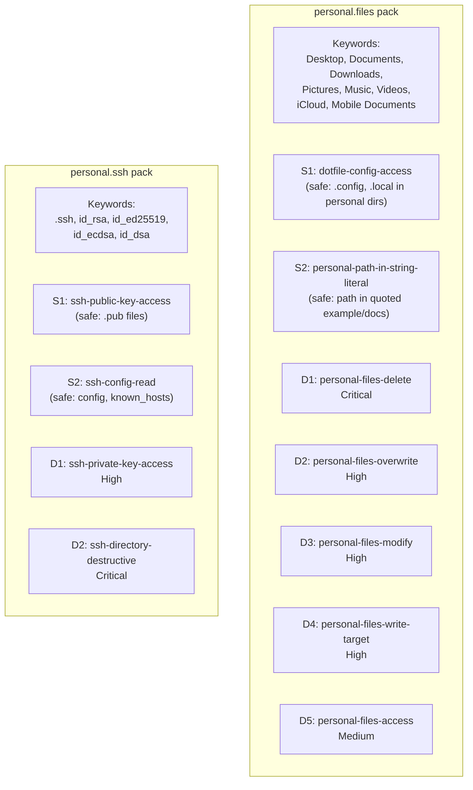
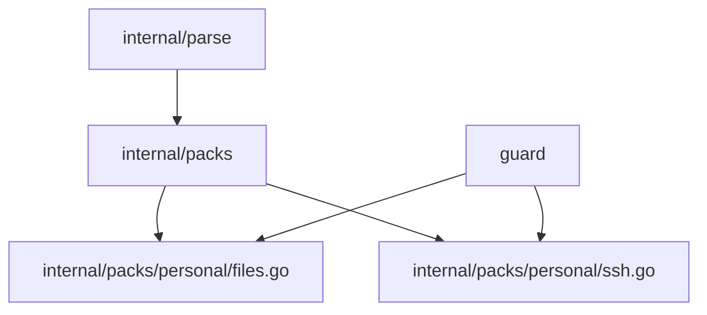

# 03f: Personal Files Pack

**Batch**: 3 (Pattern Packs)
**Depends On**: [02-matching-framework](./02-matching-framework.md), [03a-packs-core](./03a-packs-core.md)
**Blocks**: [05-testing-and-benchmarks](./05-testing-and-benchmarks.md)
**Architecture**: [00-architecture.md](./00-architecture.md) §3 Layer 2
**Plan Index**: [00-plan-index.md](./00-plan-index.md)
**Pack Authoring Guide**: [03a-packs-core §4](./03a-packs-core.md)

---

## 1. Summary

This pack detects commands that access personal file directories — paths that
coding agents have essentially no legitimate reason to touch. Unlike most packs
which match on `command name + flags`, this pack uses the **command-agnostic
`AnyName` matcher** (§5.2.8 of plan 02) combined with `ArgContentRegex` to
flag any command whose arguments reference protected personal paths.

The pack is **cross-platform** and covers macOS, Linux, and Windows personal
directories.

**Threat model**: This is not a security boundary. An agent accessing
`~/Documents/taxes.pdf` is not necessarily malicious — it's more likely a
mistake, hallucination, or scope creep. The pack surfaces these accesses so
the user can confirm intent.

**Key design decisions**:
- D1: Command-agnostic matching — no enumeration of commands
- D2: Severity tiered by operation type (destructive > modify > read)
- D3: SSH keys separated into own section with safe patterns for public keys
- D4: Path detection uses word-boundary-safe regex on argument content

### Pack Summary Table

| Pack ID | Keywords | Destructive Patterns | Safe Patterns |
|---------|----------|---------------------|---------------|
| `personal.files` | Desktop, Documents, Downloads, Pictures, Music, Videos, iCloud, Mobile Documents | 5 | 2 |
| `personal.ssh` | .ssh, id_rsa, id_ed25519, id_ecdsa, id_dsa | 2 | 2 |

---

## 2. Component Diagram



---

## 3. Import Flow



Both packs are in the `personal` package under `internal/packs/personal/`.

---

## 4. Matching Approach

### Command-Agnostic Patterns

This pack is the first to use the `AnyName()` matcher from plan 02 §5.2.8.
Patterns do not constrain the command name — detection is entirely based on
argument content matching protected path patterns.

```go
// Example: any command accessing ~/Desktop
Match: And(AnyName(), ArgContentRegex(`...Desktop...`))
```

This catches `cat ~/Desktop/x`, `rm ~/Desktop/x`, `sqlite3 ~/Desktop/db`,
and any other command — including unusual or custom commands that take file
paths.

### Path Regex Design

Protected paths are detected via regex on extracted command arguments. The
regex must handle:

- Tilde expansion: `~/Desktop`, `$HOME/Desktop`
- Absolute paths: `/Users/*/Desktop`, `/home/*/Desktop`
- Relative paths with known prefixes: `../Desktop` (optional, higher false-positive risk)
- Windows paths: `C:\Users\*\Desktop`, `%USERPROFILE%\Desktop`

The core regex pattern for Unix personal directories:

```
(?:~|(?:\$HOME|\$\{HOME\}))/(?:Desktop|Documents|Downloads|Pictures|Music|Videos)(?:/|$)
```

And for iCloud specifically:

```
(?:~|(?:\$HOME|\$\{HOME\}))/Library/Mobile Documents(?:/|$)
```

**Word-boundary interaction**: The Aho-Corasick pre-filter keywords are
`Desktop`, `Documents`, etc. These match at word boundaries in the raw
command string. Since path separators (`/`) are not word characters, the
word-boundary filter works correctly: `cat ~/Desktop/file.txt` triggers on
`Desktop` because `/` surrounds it.

**False-positive management**: The keyword `Documents` could match in
strings like `"Update Documents table"` (SQL context). However, this would
only trigger if the argument also matches the full path regex (`~/Documents`
or `/home/*/Documents`), which eliminates most false positives.

### Severity Tiering

Since command-agnostic matching can't distinguish `rm` from `cat` by
command name, we use **layered patterns with command-specific matchers for
escalation**:

| Pattern | Matcher | Severity | Rationale |
|---------|---------|----------|-----------|
| D1 | `And(Or(Name("rm"), Name("shred"), Name("srm")), ArgContentRegex(path))` | Critical | Irreversible deletion |
| D2 | `And(Or(Name("mv"), Name("cp")), ArgContentRegex(path), ForbidFlags("-n"))` | High | Overwrite/move personal files |
| D3 | `And(Or(Name("chmod"), Name("chown"), Name("truncate")), ArgContentRegex(path))` | High | Modify permissions/content |
| D4 | Output redirect to personal path (matched via `ArgContentRegex`) | High | Write/overwrite |
| D5 | `And(AnyName(), ArgContentRegex(path))` | Medium | Catch-all: any access |

Evaluation order is Critical → High → Medium, so `rm ~/Desktop/x` matches
D1 (Critical) first, while `cat ~/Desktop/x` falls through to D5 (Medium).

---

## 5. Detailed Design

### 5.1 `personal.files` Pack (`internal/packs/personal/files.go`)

```go
package personal

import (
    "regexp"

    "github.com/dcosson/destructive-command-guard-go/guard"
    "github.com/dcosson/destructive-command-guard-go/internal/packs"
)

// personalPathRe matches arguments that reference personal directories.
// Covers: ~/Desktop, $HOME/Documents, /Users/*/Downloads, /home/*/Pictures,
// ~/Music, ~/Videos, ~/Library/Mobile Documents (iCloud Drive).
var personalPathRe = regexp.MustCompile(
    `(?:` +
        `(?:~|` +                                    // tilde
        `(?:\$HOME|\$\{HOME\})|` +                   // $HOME / ${HOME}
        `/(?:Users|home)/[^/]+)` +                    // /Users/<user> or /home/<user>
        `/(?:Desktop|Documents|Downloads|Pictures|Music|Videos)(?:/|$)` +
    `|` +
        `(?:~|(?:\$HOME|\$\{HOME\})|/(?:Users|home)/[^/]+)` +
        `/Library/Mobile Documents(?:/|$)` +          // iCloud Drive
    `)`,
)

var filesPack = packs.Pack{
    ID:          "personal.files",
    Name:        "Personal Files",
    Description: "Detects commands accessing personal file directories (Desktop, Documents, Downloads, etc.)",
    Keywords: []string{
        "Desktop", "Documents", "Downloads",
        "Pictures", "Music", "Videos",
        "Mobile Documents",
    },

    Safe: []packs.SafePattern{
        // S1: Allow listing a parent directory that happens to contain
        // personal dirs — we only flag explicit targeting.
        // No safe patterns needed here — the regex requires the personal
        // dir to be IN the argument, so `ls ~` won't match.

        // S2: Allow commands that reference personal paths in help text,
        // error messages, or documentation strings — these are not actual
        // file access operations. (Handled by the regex requiring path
        // prefix, not just the directory name as a bare word.)
    },

    Destructive: []packs.DestructivePattern{
        // ---- Critical ----

        // D1: Destructive file operations targeting personal directories.
        {
            Name: "personal-files-delete",
            Match: packs.And(
                packs.Or(
                    packs.Name("rm"),
                    packs.Name("shred"),
                    packs.Name("srm"),
                    packs.Name("unlink"),
                ),
                packs.ArgContentRegex(personalPathRe.String()),
            ),
            Severity:   guard.Critical,
            Confidence: guard.ConfidenceHigh,
            Reason:     "Destructive command targets a personal file directory",
            Remediation: "Verify this deletion is intentional — personal directories " +
                "like ~/Desktop and ~/Documents contain user files that cannot be recovered",
        },

        // ---- High ----

        // D2: Move/copy operations that could overwrite personal files.
        {
            Name: "personal-files-overwrite",
            Match: packs.And(
                packs.Or(
                    packs.Name("mv"),
                    packs.Name("cp"),
                ),
                packs.ArgContentRegex(personalPathRe.String()),
                packs.Not(packs.Flags("-n")), // -n = no-clobber, safer
            ),
            Severity:   guard.High,
            Confidence: guard.ConfidenceHigh,
            Reason:     "File operation targets a personal directory and may overwrite files",
            Remediation: "Use -n (no-clobber) flag or verify the target path is correct",
        },

        // D3: Permission/attribute modification on personal files.
        {
            Name: "personal-files-modify",
            Match: packs.And(
                packs.Or(
                    packs.Name("chmod"),
                    packs.Name("chown"),
                    packs.Name("chgrp"),
                    packs.Name("truncate"),
                    packs.Name("touch"),  // can change timestamps
                ),
                packs.ArgContentRegex(personalPathRe.String()),
            ),
            Severity:   guard.High,
            Confidence: guard.ConfidenceMedium,
            Reason:     "Command modifies personal file attributes or content",
            Remediation: "Verify this modification to personal files is intentional",
        },

        // D4: Write operations (editors, sed -i, tee, etc.) targeting personal files.
        {
            Name: "personal-files-write",
            Match: packs.And(
                packs.Or(
                    packs.Name("sed"),
                    packs.Name("tee"),
                    packs.Name("dd"),
                ),
                packs.ArgContentRegex(personalPathRe.String()),
            ),
            Severity:   guard.High,
            Confidence: guard.ConfidenceMedium,
            Reason:     "Command writes to a personal file directory",
            Remediation: "Verify this write operation targets the correct file",
        },

        // ---- Medium ----

        // D5: Catch-all — any command accessing personal directories.
        // This is the command-agnostic fallback. Any command with an
        // argument matching a personal path triggers at Medium severity.
        {
            Name: "personal-files-access",
            Match: packs.And(
                packs.AnyName(),
                packs.ArgContentRegex(personalPathRe.String()),
            ),
            Severity:   guard.Medium,
            Confidence: guard.ConfidenceMedium,
            Reason:     "Command accesses a personal file directory",
            Remediation: "Verify this file access is intentional — coding agents " +
                "typically don't need to access Desktop, Documents, or Downloads",
        },
    },
}

func init() {
    packs.DefaultRegistry.Register(filesPack)
}
```

### 5.2 `personal.ssh` Pack (`internal/packs/personal/ssh.go`)

```go
package personal

import (
    "regexp"

    "github.com/dcosson/destructive-command-guard-go/guard"
    "github.com/dcosson/destructive-command-guard-go/internal/packs"
)

// sshPrivateKeyRe matches arguments referencing SSH private key files.
// Matches: ~/.ssh/id_rsa, ~/.ssh/id_ed25519, ~/.ssh/id_ecdsa, ~/.ssh/id_dsa,
// and custom key files in ~/.ssh/ (but NOT .pub files).
var sshPrivateKeyRe = regexp.MustCompile(
    `(?:~|(?:\$HOME|\$\{HOME\})|/(?:Users|home)/[^/]+)/\.ssh/` +
        `(?:id_(?:rsa|ed25519|ecdsa|dsa)` +           // standard key names
        `|[^/]+)` +                                     // any file in .ssh/
        `(?:[^.]|$)`,                                   // NOT ending in .pub
)

// sshPublicKeyRe matches SSH public key files.
var sshPublicKeyRe = regexp.MustCompile(
    `(?:~|(?:\$HOME|\$\{HOME\})|/(?:Users|home)/[^/]+)/\.ssh/[^/]+\.pub(?:\s|$)`,
)

// sshConfigRe matches SSH config and known_hosts files.
var sshConfigRe = regexp.MustCompile(
    `(?:~|(?:\$HOME|\$\{HOME\})|/(?:Users|home)/[^/]+)/\.ssh/` +
        `(?:config|known_hosts|authorized_keys)(?:\s|$)`,
)

// sshDirRe matches the .ssh directory itself (for bulk operations).
var sshDirRe = regexp.MustCompile(
    `(?:~|(?:\$HOME|\$\{HOME\})|/(?:Users|home)/[^/]+)/\.ssh(?:/?\s|/?$)`,
)

var sshPack = packs.Pack{
    ID:          "personal.ssh",
    Name:        "SSH Keys",
    Description: "Protects SSH private keys from unauthorized access",
    Keywords: []string{
        ".ssh", "id_rsa", "id_ed25519", "id_ecdsa", "id_dsa",
    },

    Safe: []packs.SafePattern{
        // S1: Accessing public keys is always safe.
        {
            Name: "ssh-public-key-access",
            Match: packs.ArgContentRegex(sshPublicKeyRe.String()),
        },

        // S2: Reading SSH config and known_hosts is safe.
        {
            Name: "ssh-config-read",
            Match: packs.And(
                packs.Not(packs.Or(
                    packs.Name("rm"),
                    packs.Name("mv"),
                    packs.Name("chmod"),
                    packs.Name("sed"),
                    packs.Name("truncate"),
                )),
                packs.ArgContentRegex(sshConfigRe.String()),
            ),
        },
    },

    Destructive: []packs.DestructivePattern{
        // ---- Critical ----

        // D1: Destructive operations on the .ssh directory itself.
        {
            Name: "ssh-directory-destructive",
            Match: packs.And(
                packs.Or(
                    packs.Name("rm"),
                    packs.Name("chmod"),
                    packs.Name("mv"),
                ),
                packs.ArgContentRegex(sshDirRe.String()),
            ),
            Severity:   guard.Critical,
            Confidence: guard.ConfidenceHigh,
            Reason:     "Destructive operation targets the SSH directory",
            Remediation: "Do not modify or delete the .ssh directory — " +
                "this contains authentication keys and configuration",
        },

        // ---- High ----

        // D2: Any access to SSH private keys.
        {
            Name: "ssh-private-key-access",
            Match: packs.And(
                packs.AnyName(),
                packs.ArgContentRegex(sshPrivateKeyRe.String()),
                packs.Not(packs.ArgContentRegex(sshPublicKeyRe.String())),
            ),
            Severity:   guard.High,
            Confidence: guard.ConfidenceHigh,
            Reason:     "Command accesses an SSH private key",
            Remediation: "Agents should use public keys (.pub) for SSH configuration, " +
                "not private keys. Verify this access is intentional.",
        },
    },
}

func init() {
    packs.DefaultRegistry.Register(sshPack)
}
```

---

## 6. Per-Pattern Unit Tests

### 6.1 `personal.files` Tests

**D1: personal-files-delete**:
- `rm ~/Desktop/file.txt` → Critical
- `rm -rf ~/Documents/` → Critical
- `shred ~/Downloads/secret.pdf` → Critical
- `rm /tmp/file.txt` → no match (not personal path)
- `rm ./Desktop/file.txt` → no match (relative, no tilde/home prefix)

**D2: personal-files-overwrite**:
- `mv ~/Desktop/old.txt ~/Desktop/new.txt` → High
- `cp important.py ~/Documents/` → High
- `cp -n file.txt ~/Documents/` → no match (safe: -n no-clobber)
- `mv /tmp/a /tmp/b` → no match

**D3: personal-files-modify**:
- `chmod 777 ~/Documents/script.sh` → High
- `chown user:group ~/Pictures/photo.jpg` → High
- `chmod 644 /etc/config` → no match

**D4: personal-files-write**:
- `sed -i 's/old/new/' ~/Documents/notes.txt` → High
- `tee ~/Desktop/output.txt` → High
- `dd if=/dev/zero of=~/Downloads/disk.img` → High

**D5: personal-files-access (catch-all)**:
- `cat ~/Desktop/notes.txt` → Medium
- `head ~/Documents/data.csv` → Medium
- `less ~/Downloads/report.pdf` → Medium
- `sqlite3 ~/Documents/db.sqlite` → Medium
- `file ~/Pictures/photo.jpg` → Medium
- `wc -l ~/Music/playlist.m3u` → Medium
- `cat /tmp/file.txt` → no match
- `ls ~/projects/code.py` → no match
- `grep pattern ~/Desktop/file.txt` → Medium

**Path variant tests** (apply to all patterns):
- `$HOME/Desktop/file.txt` → matches
- `${HOME}/Documents/file.txt` → matches
- `/Users/dcosson/Desktop/file.txt` → matches
- `/home/user/Documents/file.txt` → matches
- `~/Library/Mobile Documents/com~apple~CloudDocs/file.txt` → matches
- `Desktop/file.txt` → no match (no home prefix)
- `~/desktop/file.txt` → no match (case-sensitive)

### 6.2 `personal.ssh` Tests

**S1: ssh-public-key-access**:
- `cat ~/.ssh/id_rsa.pub` → safe (public key)
- `cat ~/.ssh/id_ed25519.pub` → safe
- `ssh-copy-id -i ~/.ssh/id_rsa.pub user@host` → safe

**S2: ssh-config-read**:
- `cat ~/.ssh/config` → safe
- `cat ~/.ssh/known_hosts` → safe
- `grep Host ~/.ssh/config` → safe
- `rm ~/.ssh/config` → NOT safe (destructive command, S2 excludes rm)

**D1: ssh-directory-destructive**:
- `rm -rf ~/.ssh/` → Critical
- `chmod 777 ~/.ssh/` → Critical
- `mv ~/.ssh/ ~/backup/` → Critical

**D2: ssh-private-key-access**:
- `cat ~/.ssh/id_rsa` → High
- `cat ~/.ssh/id_ed25519` → High
- `scp ~/.ssh/id_rsa remote:` → High
- `cat ~/.ssh/id_rsa.pub` → no match (caught by S1, safe)
- `cat ~/.ssh/config` → no match (caught by S2, safe)

---

## 7. Test Infrastructure

### 7.1 Path Variant Generator

A test helper that generates all path forms for a given personal directory:

```go
func personalPathVariants(dir string) []string {
    return []string{
        "~/" + dir,
        "$HOME/" + dir,
        "${HOME}/" + dir,
        "/Users/testuser/" + dir,
        "/home/testuser/" + dir,
    }
}
```

Each test case should run against all path variants to ensure comprehensive
coverage of the path regex.

### 7.2 Cross-Pack Interaction Tests

Since `personal.files` uses `AnyName()`, it could match commands that other
packs also match. For example, `rm ~/Desktop/file.txt` would match both
`personal.files` (Critical) and `core.filesystem` (destructive rm). The
pipeline should return the **highest severity match across all packs**, which
is the correct behavior per plan 02 §5.5.

Test cases:
- `rm ~/Desktop/file.txt` → both `personal.files` D1 and `core.filesystem`
  match → pipeline returns the one with higher severity
- `git clone ~/Documents/repo` → `core.git` safe pattern should still work;
  `personal.files` D5 also triggers → pipeline returns the destructive match

---

## 8. Golden File Entries

```yaml
# personal.files pack
- input: "rm ~/Desktop/file.txt"
  pack: personal.files
  pattern: personal-files-delete
  severity: Critical

- input: "cat ~/Documents/notes.txt"
  pack: personal.files
  pattern: personal-files-access
  severity: Medium

- input: "cp file.txt ~/Downloads/"
  pack: personal.files
  pattern: personal-files-overwrite
  severity: High

- input: "cat ~/Library/Mobile Documents/com~apple~CloudDocs/file.txt"
  pack: personal.files
  pattern: personal-files-access
  severity: Medium

- input: "rm /tmp/file.txt"
  pack: core.filesystem
  # Does NOT match personal.files

# personal.ssh pack
- input: "cat ~/.ssh/id_rsa"
  pack: personal.ssh
  pattern: ssh-private-key-access
  severity: High

- input: "cat ~/.ssh/id_rsa.pub"
  pack: personal.ssh
  # Safe — public key

- input: "rm -rf ~/.ssh/"
  pack: personal.ssh
  pattern: ssh-directory-destructive
  severity: Critical

- input: "cat ~/.ssh/config"
  pack: personal.ssh
  # Safe — config file read
```

---

## 9. Open Questions

1. **Windows path support**: The current regex covers Unix paths. Windows paths
   (`C:\Users\<user>\Documents`, `%USERPROFILE%\Documents`) should be added if
   the tool targets Windows. Recommendation: add Windows regex variants in the
   same pack, gated on path separator detection.

2. **`find` command**: `find ~/Documents -name "*.pdf"` targets a personal dir
   but is a read operation. The catch-all D5 would flag this at Medium, which
   seems correct. Should `find` be escalated or kept at Medium?

3. **Relative path detection**: Should `../../../Documents/file.txt` be
   detected? This would require tracking the working directory, which the
   framework doesn't do. Recommendation: out of scope for v1 — only detect
   explicit home-relative or absolute personal paths.

4. **Custom personal directories**: Some users have personal files in
   non-standard locations (e.g., `~/Dropbox`, `~/OneDrive`). Should the pack
   be configurable? Recommendation: v2 feature — add a config option to extend
   the protected path list.
