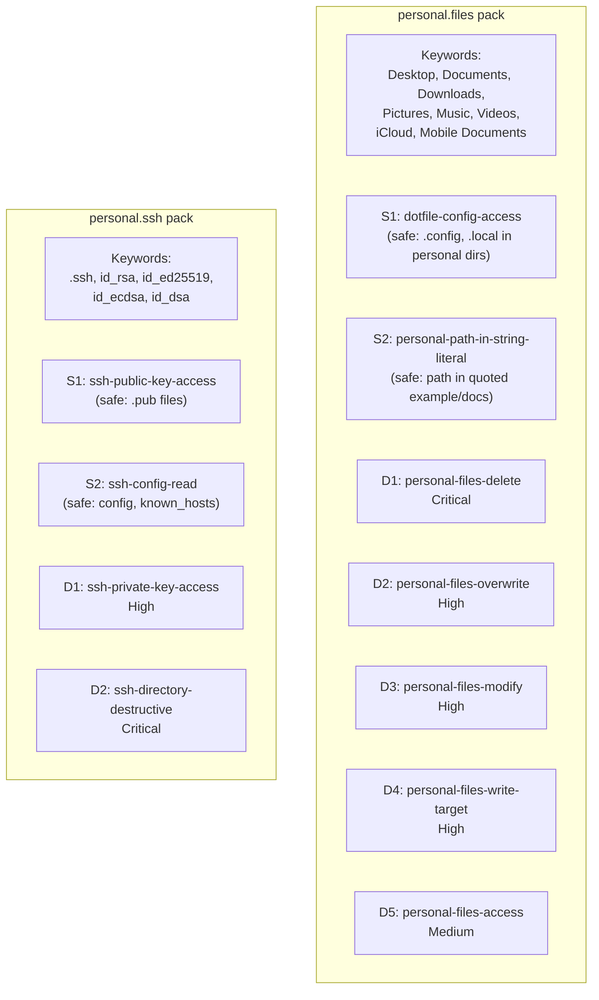
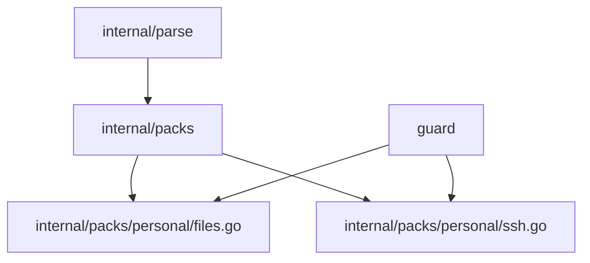

# 03f: Personal Files Pack

**Batch**: 3 (Pattern Packs)
**Depends On**: [02-matching-framework](./02-matching-framework.md), [03a-packs-core](./03a-packs-core.md)
**Blocks**: [05-testing-and-benchmarks](./05-testing-and-benchmarks.md)
**Architecture**: [00-architecture.md](./00-architecture.md) §3 Layer 2
**Plan Index**: [00-plan-index.md](./00-plan-index.md)
**Pack Authoring Guide**: [03a-packs-core §4](./03a-packs-core.md)

---

## 1. Summary

This pack detects commands that access personal file directories — paths that
coding agents have essentially no legitimate reason to touch. Unlike most packs
which match on `command name + flags`, this pack uses the **command-agnostic
`AnyName` matcher** (§5.2.8 of plan 02) combined with `ArgContentRegex` to
flag any command whose arguments reference protected personal paths.

The pack covers **macOS and Linux** personal directories. Windows path support
is deferred (see §9 Open Questions).

**Threat model**: This is not a security boundary. An agent accessing
`~/Documents/taxes.pdf` is not necessarily malicious — it's more likely a
mistake, hallucination, or scope creep. The pack surfaces these accesses so
the user can confirm intent.

**Key design decisions**:
- D1: Command-agnostic matching — no enumeration of commands
- D2: Severity tiered by operation type (destructive > modify > read)
- D3: SSH keys separated into own section with safe patterns for public keys
- D4: Path detection uses word-boundary-safe regex on argument content

### Pack Summary Table

| Pack ID | Keywords | Destructive Patterns | Safe Patterns |
|---------|----------|---------------------|---------------|
| `personal.files` | Desktop, Documents, Downloads, Pictures, Music, Videos, iCloud, Mobile Documents | 5 | 2 |
| `personal.ssh` | .ssh, id_rsa, id_ed25519, id_ecdsa, id_dsa | 2 | 2 |

---

## 2. Component Diagram



---

## 3. Import Flow



Both packs are in the `personal` package under `internal/packs/personal/`.

---

## 4. Matching Approach

### Command-Agnostic Patterns

This pack is the first to use the `AnyName()` matcher from plan 02 §5.2.8.
Patterns do not constrain the command name — detection is entirely based on
argument content matching protected path patterns.

```go
// Example: any command accessing ~/Desktop
Match: And(AnyName(), ArgContentRegex(`...Desktop...`))
```

This catches `cat ~/Desktop/x`, `rm ~/Desktop/x`, `sqlite3 ~/Desktop/db`,
and any other command — including unusual or custom commands that take file
paths.

### Path Regex Design

Protected paths are detected via regex on extracted command arguments. The
regex must handle:

- Tilde expansion: `~/Desktop`, `$HOME/Desktop`
- Absolute paths: `/Users/*/Desktop`, `/home/*/Desktop`
- Relative paths with known prefixes: `../Desktop` (optional, higher false-positive risk)
- Windows paths: `C:\Users\*\Desktop`, `%USERPROFILE%\Desktop`

The core regex pattern for Unix personal directories:

```
(?:~|(?:\$HOME|\$\{HOME\}))/(?:Desktop|Documents|Downloads|Pictures|Music|Videos)(?:/|$)
```

And for iCloud specifically:

```
(?:~|(?:\$HOME|\$\{HOME\}))/Library/Mobile Documents(?:/|$)
```

**Word-boundary interaction**: The Aho-Corasick pre-filter keywords are
`Desktop`, `Documents`, etc. These match at word boundaries in the raw
command string. Since path separators (`/`) are not word characters, the
word-boundary filter works correctly: `cat ~/Desktop/file.txt` triggers on
`Desktop` because `/` surrounds it.

**False-positive management**: The keyword `Documents` could match in
strings like `"Update Documents table"` (SQL context). However, this would
only trigger if the argument also matches the full path regex (`~/Documents`
or `/home/*/Documents`), which eliminates most false positives.

### Severity Tiering

Since command-agnostic matching can't distinguish `rm` from `cat` by
command name, we use **layered patterns with command-specific matchers for
escalation**:

| Pattern | Matcher | Severity | Rationale |
|---------|---------|----------|-----------|
| D1 | `And(Or(Name("rm"), Name("shred"), Name("srm"), Name("unlink")), ArgContentRegex(path))` | Critical | Irreversible deletion |
| D2 | `And(Or(Name("mv"), Name("cp")), ArgContentRegex(path), Not(Flags("-n")))` | High | Overwrite/move personal files (note: `cp` from personal dir also triggers — see §9 Q6) |
| D3 | `And(Or(Name("chmod"), Name("chown"), Name("chgrp"), Name("truncate")), ArgContentRegex(path))` | High | Modify permissions/content |
| D4 | `And(Or(Name("sed"), Name("tee"), Name("dd")), ArgContentRegex(path))` | High | Write operations targeting personal files |
| D5 | `And(AnyName(), ArgContentRegex(path))` | Medium | Catch-all: any access |

> **Note on redirect detection**: Shell output redirects (e.g., `echo x > ~/Documents/file`)
> are NOT detected by this pack. Redirect targets are not captured in ExtractedCommand
> (see §9 Q5). D4 catches explicit write commands (sed, tee, dd) but not redirect-based writes.

Evaluation order is Critical → High → Medium, so `rm ~/Desktop/x` matches
D1 (Critical) first, while `cat ~/Desktop/x` falls through to D5 (Medium).

### Intentional Absence of Safe Patterns in `personal.files`

The `personal.files` pack has **no safe patterns by design**. The threat model
is scope creep detection — any command accessing personal directories (Desktop,
Documents, Downloads, etc.) should be surfaced to the user, even read-only
operations like `ls ~/Desktop/` or `cat ~/Documents/notes.txt`. These trigger
at Medium severity (D5 catch-all), which maps to "Ask" under InteractivePolicy.

This is a deliberate trade-off: higher prompt frequency for personal file
operations in exchange for complete visibility. Coding agents rarely have
legitimate reasons to access these directories, so the noise level should be
low in practice. If safe patterns are needed in the future (e.g., for specific
workflows like "organize my Downloads folder"), they should be added as
command-specific exceptions.

---

## 5. Detailed Design

### 5.1 `personal.files` Pack (`internal/packs/personal/files.go`)

```go
package personal

import (
    "regexp"

    "github.com/dcosson/destructive-command-guard-go/guard"
    "github.com/dcosson/destructive-command-guard-go/internal/packs"
)

// personalPathRe matches arguments that reference personal directories.
// Covers: ~/Desktop, $HOME/Documents, /Users/*/Downloads, /home/*/Pictures,
// ~/Music, ~/Videos, ~/Library/Mobile Documents (iCloud Drive).
var personalPathRe = regexp.MustCompile(
    `(?:` +
        `(?:~|` +                                    // tilde
        `(?:\$HOME|\$\{HOME\})|` +                   // $HOME / ${HOME}
        `/(?:Users|home)/[^/]+|` +                    // /Users/<user> or /home/<user>
        `/root)` +                                    // root user on Linux
        `/(?:Desktop|Documents|Downloads|Pictures|Music|Videos)(?:/|$)` +
    `|` +
        `(?:~|(?:\$HOME|\$\{HOME\})|/(?:Users|home)/[^/]+|/root)` +
        `/Library/Mobile Documents(?:/|$)` +          // iCloud Drive
    `)`,
)

var filesPack = packs.Pack{
    ID:          "personal.files",
    Name:        "Personal Files",
    Description: "Detects commands accessing personal file directories (Desktop, Documents, Downloads, etc.)",
    Keywords: []string{
        "Desktop", "Documents", "Downloads",
        "Pictures", "Music", "Videos",
        "Mobile Documents",
    },

    // No safe patterns — intentional. See §4 "Intentional Absence of Safe
    // Patterns" for design rationale. The path regex requires explicit
    // home-prefix matching (~/Dir, $HOME/Dir, /Users/*/Dir, /home/*/Dir,
    // /root/Dir), eliminating most false positives. All personal dir access
    // is flagged at minimum Medium (D5 catch-all) by design.
    Safe: []packs.SafePattern{},

    Destructive: []packs.DestructivePattern{
        // ---- Critical ----

        // D1: Destructive file operations targeting personal directories.
        {
            Name: "personal-files-delete",
            Match: packs.And(
                packs.Or(
                    packs.Name("rm"),
                    packs.Name("shred"),
                    packs.Name("srm"),
                    packs.Name("unlink"),
                ),
                packs.ArgContentRegex(personalPathRe.String()),
            ),
            Severity:   guard.Critical,
            Confidence: guard.ConfidenceHigh,
            Reason:     "Destructive command targets a personal file directory",
            Remediation: "Verify this deletion is intentional — personal directories " +
                "like ~/Desktop and ~/Documents contain user files that cannot be recovered",
        },

        // ---- High ----

        // D2: Move/copy operations that could overwrite personal files.
        {
            Name: "personal-files-overwrite",
            Match: packs.And(
                packs.Or(
                    packs.Name("mv"),
                    packs.Name("cp"),
                ),
                packs.ArgContentRegex(personalPathRe.String()),
                packs.Not(packs.Flags("-n")), // -n = no-clobber, safer
            ),
            Severity:   guard.High,
            Confidence: guard.ConfidenceHigh,
            Reason:     "File operation targets a personal directory and may overwrite files",
            Remediation: "Use -n (no-clobber) flag or verify the target path is correct",
        },

        // D3: Permission/attribute modification on personal files.
        {
            Name: "personal-files-modify",
            Match: packs.And(
                packs.Or(
                    packs.Name("chmod"),
                    packs.Name("chown"),
                    packs.Name("chgrp"),
                    packs.Name("truncate"),
                    // touch intentionally NOT included — falls through to
                    // D5 catch-all at Medium. touch is primarily used for
                    // timestamp updates and sentinel files, far less
                    // destructive than chmod/chown/truncate.
                ),
                packs.ArgContentRegex(personalPathRe.String()),
            ),
            Severity:   guard.High,
            Confidence: guard.ConfidenceMedium,
            Reason:     "Command modifies personal file attributes or content",
            Remediation: "Verify this modification to personal files is intentional",
        },

        // D4: Write operations (editors, sed -i, tee, etc.) targeting personal files.
        {
            Name: "personal-files-write",
            Match: packs.And(
                packs.Or(
                    packs.Name("sed"),
                    packs.Name("tee"),
                    packs.Name("dd"),
                ),
                packs.ArgContentRegex(personalPathRe.String()),
            ),
            Severity:   guard.High,
            Confidence: guard.ConfidenceMedium,
            Reason:     "Command writes to a personal file directory",
            Remediation: "Verify this write operation targets the correct file",
        },

        // ---- Medium ----

        // D5: Catch-all — any command accessing personal directories.
        // This is the command-agnostic fallback. Any command with an
        // argument matching a personal path triggers at Medium severity.
        {
            Name: "personal-files-access",
            Match: packs.And(
                packs.AnyName(),
                packs.ArgContentRegex(personalPathRe.String()),
            ),
            Severity:   guard.Medium,
            Confidence: guard.ConfidenceMedium,
            Reason:     "Command accesses a personal file directory",
            Remediation: "Verify this file access is intentional — coding agents " +
                "typically don't need to access Desktop, Documents, or Downloads",
        },
    },
}

func init() {
    packs.DefaultRegistry.Register(filesPack)
}
```

### 5.2 `personal.ssh` Pack (`internal/packs/personal/ssh.go`)

```go
package personal

import (
    "regexp"

    "github.com/dcosson/destructive-command-guard-go/guard"
    "github.com/dcosson/destructive-command-guard-go/internal/packs"
)

// sshPrivateKeyRe matches arguments referencing SSH private key files.
// Matches: ~/.ssh/id_rsa, ~/.ssh/id_ed25519, ~/.ssh/id_ecdsa, ~/.ssh/id_dsa,
// and custom key files in ~/.ssh/ (but NOT .pub files or known config files).
//
// The negative lookahead (?!.*\.pub(?:\s|$)) is applied AFTER the full
// filename match to prevent backtracking from the [^/\s]+ catch-all branch
// accidentally matching .pub files (see PF-P0.1 review finding).
var sshPrivateKeyRe = regexp.MustCompile(
    `(?:~|(?:\$HOME|\$\{HOME\})|/(?:Users|home)/[^/]+|/root)/\.ssh/` +
        `((?:id_(?:rsa|ed25519|ecdsa|dsa)|[^/\s]+))` + // key name or any file
        `(?!\.pub(?:\s|$))` +                            // NOT followed by .pub
        `(?:\s|$)`,                                      // word boundary
)

// sshPublicKeyRe matches SSH public key files.
var sshPublicKeyRe = regexp.MustCompile(
    `(?:~|(?:\$HOME|\$\{HOME\})|/(?:Users|home)/[^/]+|/root)/\.ssh/[^/]+\.pub(?:\s|$)`,
)

// sshConfigRe matches SSH configuration and operational files (NOT keys).
// authorized_keys is intentionally excluded — it controls SSH authentication
// and write operations to it are security-sensitive (see SE-P1.1 review).
var sshConfigRe = regexp.MustCompile(
    `(?:~|(?:\$HOME|\$\{HOME\})|/(?:Users|home)/[^/]+|/root)/\.ssh/` +
        `(?:config|known_hosts(?:\.old)?|environment|rc|agent\.sock)(?:\s|$)`,
)

// sshDirRe matches the .ssh directory itself (for bulk operations).
var sshDirRe = regexp.MustCompile(
    `(?:~|(?:\$HOME|\$\{HOME\})|/(?:Users|home)/[^/]+|/root)/\.ssh(?:/?\s|/?$)`,
)

var sshPack = packs.Pack{
    ID:          "personal.ssh",
    Name:        "SSH Keys",
    Description: "Protects SSH private keys from unauthorized access",
    Keywords: []string{
        ".ssh", "id_rsa", "id_ed25519", "id_ecdsa", "id_dsa",
    },

    Safe: []packs.SafePattern{
        // S1: Accessing public keys is always safe.
        {
            Name: "ssh-public-key-access",
            Match: packs.ArgContentRegex(sshPublicKeyRe.String()),
        },

        // S2: Reading SSH config/operational files is safe.
        // Uses positive matching (enumerate read-only commands) rather than
        // negative matching (exclude write commands) for robustness — new
        // write-capable commands won't accidentally pass through as safe.
        // (See SE-P1.1, SE-P2.5 review findings.)
        {
            Name: "ssh-config-read",
            Match: packs.And(
                packs.Or(
                    packs.Name("cat"),
                    packs.Name("less"),
                    packs.Name("more"),
                    packs.Name("head"),
                    packs.Name("tail"),
                    packs.Name("grep"),
                    packs.Name("wc"),
                    packs.Name("file"),
                    packs.Name("stat"),
                ),
                packs.ArgContentRegex(sshConfigRe.String()),
            ),
        },
    },

    Destructive: []packs.DestructivePattern{
        // ---- Critical ----

        // D1: Destructive operations on the .ssh directory itself.
        {
            Name: "ssh-directory-destructive",
            Match: packs.And(
                packs.Or(
                    packs.Name("rm"),
                    packs.Name("chmod"),
                    packs.Name("mv"),
                ),
                packs.ArgContentRegex(sshDirRe.String()),
            ),
            Severity:   guard.Critical,
            Confidence: guard.ConfidenceHigh,
            Reason:     "Destructive operation targets the SSH directory",
            Remediation: "Do not modify or delete the .ssh directory — " +
                "this contains authentication keys and configuration",
        },

        // ---- High ----

        // D2: Any access to SSH private keys.
        {
            Name: "ssh-private-key-access",
            Match: packs.And(
                packs.AnyName(),
                packs.ArgContentRegex(sshPrivateKeyRe.String()),
                packs.Not(packs.ArgContentRegex(sshPublicKeyRe.String())),
            ),
            Severity:   guard.High,
            Confidence: guard.ConfidenceHigh,
            Reason:     "Command accesses an SSH private key",
            Remediation: "Agents should use public keys (.pub) for SSH configuration, " +
                "not private keys. Verify this access is intentional.",
        },
    },
}

func init() {
    packs.DefaultRegistry.Register(sshPack)
}
```

---

## 6. Per-Pattern Unit Tests

### 6.1 `personal.files` Tests

**D1: personal-files-delete**:
- `rm ~/Desktop/file.txt` → Critical
- `rm -rf ~/Documents/` → Critical
- `shred ~/Downloads/secret.pdf` → Critical
- `unlink ~/Desktop/link.txt` → Critical
- `rm /tmp/file.txt` → no match (not personal path)
- `rm ./Desktop/file.txt` → no match (relative, no tilde/home prefix)

**D2: personal-files-overwrite**:
- `mv ~/Desktop/old.txt ~/Desktop/new.txt` → High
- `cp important.py ~/Documents/` → High
- `cp ~/Documents/file.txt /tmp/` → High (source-path match — known false positive, see §9 Q6)
- `cp /tmp/file.txt ~/Desktop/file.txt` → High (multi-path: personal path in arguments)
- `cp -n file.txt ~/Documents/` → no match D2 (falls through to D5 Medium)
- `mv /tmp/a /tmp/b` → no match

**D3: personal-files-modify**:
- `chmod 777 ~/Documents/script.sh` → High
- `chown user:group ~/Pictures/photo.jpg` → High
- `chgrp staff ~/Documents/shared/` → High
- `truncate -s 0 ~/Desktop/log.txt` → High
- `chmod 644 /etc/config` → no match

**D4: personal-files-write**:
- `sed -i 's/old/new/' ~/Documents/notes.txt` → High
- `tee ~/Desktop/output.txt` → High
- `dd if=/dev/zero of=~/Downloads/disk.img` → High

**D5: personal-files-access (catch-all)**:
- `cat ~/Desktop/notes.txt` → Medium
- `head ~/Documents/data.csv` → Medium
- `less ~/Downloads/report.pdf` → Medium
- `sqlite3 ~/Documents/db.sqlite` → Medium
- `file ~/Pictures/photo.jpg` → Medium
- `wc -l ~/Music/playlist.m3u` → Medium
- `touch ~/Documents/sentinel.flag` → Medium (intentionally not in D3)
- `ls ~/Desktop/` → Medium
- `find ~/Documents -name "*.py"` → Medium
- `du -sh ~/Downloads/` → Medium
- `cat /tmp/file.txt` → no match
- `ls ~/projects/code.py` → no match
- `grep pattern ~/Desktop/file.txt` → Medium

**Path variant tests** (apply to all patterns):
- `$HOME/Desktop/file.txt` → matches
- `${HOME}/Documents/file.txt` → matches
- `/Users/dcosson/Desktop/file.txt` → matches
- `/home/user/Documents/file.txt` → matches
- `/root/Desktop/file.txt` → matches (root user on Linux)
- `~/Library/Mobile Documents/com~apple~CloudDocs/file.txt` → matches
- `Desktop/file.txt` → no match (no home prefix)
- `~/desktop/file.txt` → no match (case-sensitive — known limitation, see §9 Q7)

### 6.2 `personal.ssh` Tests

**S1: ssh-public-key-access**:
- `cat ~/.ssh/id_rsa.pub` → safe (public key)
- `cat ~/.ssh/id_ed25519.pub` → safe
- `ssh-copy-id -i ~/.ssh/id_rsa.pub user@host` → safe

**S2: ssh-config-read** (positive-match: read-only commands only):
- `cat ~/.ssh/config` → safe
- `cat ~/.ssh/known_hosts` → safe
- `cat ~/.ssh/known_hosts.old` → safe
- `grep Host ~/.ssh/config` → safe
- `stat ~/.ssh/environment` → safe
- `less ~/.ssh/rc` → safe
- `rm ~/.ssh/config` → NOT safe (rm not in read-only list)
- `tee ~/.ssh/authorized_keys` → NOT safe (tee not in read-only list)
- `cp malicious_keys ~/.ssh/authorized_keys` → NOT safe (cp not in read-only list)
- `sed -i 's/old/new/' ~/.ssh/config` → NOT safe (sed not in read-only list)

**D1: ssh-directory-destructive**:
- `rm -rf ~/.ssh/` → Critical
- `chmod 777 ~/.ssh/` → Critical
- `mv ~/.ssh/ ~/backup/` → Critical
- `rm -rf /root/.ssh/` → Critical (root user path)

**D2: ssh-private-key-access**:
- `cat ~/.ssh/id_rsa` → High
- `cat ~/.ssh/id_ed25519` → High
- `scp ~/.ssh/id_rsa remote:` → High
- `cat ~/.ssh/id_rsa.pub` → no match (caught by S1, safe)
- `cat ~/.ssh/id_ed25519.pub` → no match (S1 safe; regex negative lookahead prevents private key match)
- `cat ~/.ssh/config` → no match (caught by S2, safe)
- `cat ~/.ssh/authorized_keys` → High (not in S2; treated as sensitive file)

---

## 7. Test Infrastructure

### 7.1 Path Variant Generator

A test helper that generates all path forms for a given personal directory:

```go
func personalPathVariants(dir string) []string {
    return []string{
        "~/" + dir,
        "$HOME/" + dir,
        "${HOME}/" + dir,
        "/Users/testuser/" + dir,
        "/home/testuser/" + dir,
        "/root/" + dir,
    }
}
```

Each test case should run against all path variants to ensure comprehensive
coverage of the path regex.

### 7.2 Cross-Pack Interaction Tests

Since `personal.files` uses `AnyName()`, it could match commands that other
packs also match. For example, `rm ~/Desktop/file.txt` would match both
`personal.files` (Critical) and `core.filesystem` (destructive rm). The
pipeline should return the **highest severity match across all packs**, which
is the correct behavior per plan 02 §5.5.

**Cross-pack behavior rule**: Safe patterns only apply within their own pack.
A command can be safe in one pack but destructive in another, and the
destructive result takes precedence in the pipeline (per plan 02 §5.5).

Test cases:
- `rm ~/Desktop/file.txt` → both `personal.files` D1 and `core.filesystem`
  match → pipeline returns the one with higher severity
- `git clone https://github.com/foo/bar ~/Documents/repo` → `core.git` may
  have a safe pattern for `git clone`, but `personal.files` D5 triggers at
  Medium → pipeline returns Medium (destructive overrides cross-pack safe)
- `git add ~/Documents/repo/file.py` → `core.git` safe for `git add`,
  `personal.files` D5 triggers → pipeline returns Medium
- `cp ~/Desktop/file.txt /tmp/` → `personal.files` D2 triggers at High,
  `core.filesystem` may also match → highest severity wins

---

## 8. Golden File Entries

```yaml
# ===== personal.files pack =====

# D1: personal-files-delete (Critical)
- input: "rm ~/Desktop/file.txt"
  pack: personal.files
  pattern: personal-files-delete
  severity: Critical

- input: "rm -rf $HOME/Documents/"
  pack: personal.files
  pattern: personal-files-delete
  severity: Critical

- input: "shred /home/user/Downloads/secret.pdf"
  pack: personal.files
  pattern: personal-files-delete
  severity: Critical

- input: "rm /tmp/file.txt"
  pack: core.filesystem
  # Near-miss: NOT personal path, does NOT match personal.files

# D2: personal-files-overwrite (High)
- input: "cp file.txt ~/Downloads/"
  pack: personal.files
  pattern: personal-files-overwrite
  severity: High

- input: "mv /Users/dcosson/Desktop/old.txt /Users/dcosson/Desktop/new.txt"
  pack: personal.files
  pattern: personal-files-overwrite
  severity: High

- input: "cp -n file.txt ~/Documents/"
  pack: personal.files
  pattern: personal-files-access
  severity: Medium
  # Near-miss for D2: -n no-clobber excluded from D2, falls to D5

# D3: personal-files-modify (High)
- input: "chmod 777 ~/Documents/script.sh"
  pack: personal.files
  pattern: personal-files-modify
  severity: High

- input: "chgrp staff ${HOME}/Pictures/shared/"
  pack: personal.files
  pattern: personal-files-modify
  severity: High

- input: "chmod 644 /etc/config"
  # Near-miss: NOT personal path, does NOT match personal.files

# D4: personal-files-write (High)
- input: "sed -i 's/old/new/' ~/Documents/notes.txt"
  pack: personal.files
  pattern: personal-files-write
  severity: High

- input: "tee /root/Desktop/output.txt"
  pack: personal.files
  pattern: personal-files-write
  severity: High

- input: "dd if=/dev/zero of=~/Downloads/disk.img"
  pack: personal.files
  pattern: personal-files-write
  severity: High

# D5: personal-files-access / catch-all (Medium)
- input: "cat ~/Documents/notes.txt"
  pack: personal.files
  pattern: personal-files-access
  severity: Medium

- input: "cat ~/Library/Mobile Documents/com~apple~CloudDocs/file.txt"
  pack: personal.files
  pattern: personal-files-access
  severity: Medium

- input: "touch ~/Desktop/build-complete.flag"
  pack: personal.files
  pattern: personal-files-access
  severity: Medium

- input: "ls ~/projects/code.py"
  # Near-miss: ~/projects is NOT a personal directory

- input: "cat README.md"
  # False-positive trap: file might contain word "Documents" in text,
  # but ArgContentRegex requires home-prefix path, so no match

# ===== personal.ssh pack =====

# S1: ssh-public-key-access (safe)
- input: "cat ~/.ssh/id_rsa.pub"
  pack: personal.ssh
  # Safe — public key

- input: "cat ~/.ssh/id_ed25519.pub"
  pack: personal.ssh
  # Safe — public key

- input: "ssh-copy-id -i ~/.ssh/id_rsa.pub user@host"
  pack: personal.ssh
  # Safe — public key

# S2: ssh-config-read (safe)
- input: "cat ~/.ssh/config"
  pack: personal.ssh
  # Safe — config file read

- input: "grep Host ~/.ssh/config"
  pack: personal.ssh
  # Safe — config file read

- input: "cat ~/.ssh/known_hosts.old"
  pack: personal.ssh
  # Safe — config file read

# D1: ssh-directory-destructive (Critical)
- input: "rm -rf ~/.ssh/"
  pack: personal.ssh
  pattern: ssh-directory-destructive
  severity: Critical

- input: "chmod 777 ~/.ssh/"
  pack: personal.ssh
  pattern: ssh-directory-destructive
  severity: Critical

- input: "mv /home/user/.ssh/ /tmp/backup/"
  pack: personal.ssh
  pattern: ssh-directory-destructive
  severity: Critical

# D2: ssh-private-key-access (High)
- input: "cat ~/.ssh/id_rsa"
  pack: personal.ssh
  pattern: ssh-private-key-access
  severity: High

- input: "scp /home/user/.ssh/id_ed25519 remote:"
  pack: personal.ssh
  pattern: ssh-private-key-access
  severity: High

- input: "cat ~/.ssh/authorized_keys"
  pack: personal.ssh
  pattern: ssh-private-key-access
  severity: High
  # authorized_keys intentionally NOT in S2 safe list

# Cross-pack interaction
- input: "rm ~/Desktop/file.txt"
  pack: personal.files
  pattern: personal-files-delete
  severity: Critical
  # Also matches core.filesystem — highest severity wins
```

---

## 9. Open Questions & Known Limitations

1. **Windows path support**: The current regex covers Unix paths only. Windows
   paths (`C:\Users\<user>\Documents`, `%USERPROFILE%\Documents`) should be
   added if the tool targets Windows. Recommendation: add Windows regex variants
   in the same pack, gated on path separator detection.

2. **`find` command**: `find ~/Documents -name "*.pdf"` targets a personal dir
   but is a read operation. The catch-all D5 would flag this at Medium, which
   seems correct. Should `find` be escalated or kept at Medium?

3. **Relative path detection**: Should `../../../Documents/file.txt` be
   detected? This would require tracking the working directory, which the
   framework doesn't do. Recommendation: out of scope for v1 — only detect
   explicit home-relative or absolute personal paths.

4. **Custom personal directories**: Some users have personal files in
   non-standard locations (e.g., `~/Dropbox`, `~/OneDrive`). Should the pack
   be configurable? Recommendation: v2 feature — add a config option to extend
   the protected path list.

5. **Redirect blind spot** (SE-P1.2): Shell output redirects
   (e.g., `echo "data" > ~/Documents/file.txt`) are NOT detected by this pack
   or any pack. Redirect targets are not captured in `ExtractedCommand` — the
   parser strips redirects during extraction (see plan 01 test cases). This is
   an architectural limitation: commands like `python script.py > ~/Downloads/output.csv`
   will not trigger personal.files detection. **Recommended fix**: Add a
   `Redirects []RedirectTarget` field to ExtractedCommand in a future plan 01
   revision, then add redirect-aware patterns to this pack.

6. **`cp` source-path false positive** (SE-P2.2): `ArgContentRegex` matches
   ALL arguments, so `cp ~/Documents/file.txt /tmp/` triggers D2 at High even
   though the personal path is the source (a read), not the destination (a
   write). This is a known false positive. The severity inflation (High vs
   Medium) is minor, and the framework doesn't currently support position-aware
   argument matching (`ArgAt`). Accepted as-is.

7. **Case-sensitive regex on macOS** (PF-P2.1): The path regex is
   case-sensitive. On macOS's case-insensitive APFS/HFS+ filesystems,
   `~/desktop/file.txt` accesses the same directory as `~/Desktop/file.txt`
   but would not be detected. This is accepted as a known limitation because:
   (a) the threat model is mistake prevention, not adversarial bypass, (b) Unix
   paths ARE case-sensitive on Linux, and (c) adding case-insensitivity would
   increase false positives on Linux. Agents and shells typically use canonical
   casing.

8. **osascript cross-pack dependency** (PF-P2.3): `osascript ~/Documents/script.scpt`
   is caught by personal.files D5 at Medium, but the communication pack's
   osascript pattern only checks `-e` inline scripts, not script file arguments.
   If the script sends messages, Medium severity may be inadequate. This is a
   cross-pack interaction issue, not fixable within this pack alone.

---

## Review Disposition

| # | Reviewer | Severity | Summary | Disposition | Notes |
|---|----------|----------|---------|-------------|-------|
| 1 | dcg-alt-reviewer | P0 | PF-P0.1: sshPrivateKeyRe catch-all matches .pub via backtracking | Incorporated | Regex rewritten with negative lookahead `(?!\.pub)` in §5.2 |
| 2 | dcg-alt-reviewer | P1 | PF-P1.1: personal.files has zero safe patterns | Not Incorporated | Intentional design — scope creep threat model flags ALL access; added explicit design note in §4 |
| 3 | dcg-alt-reviewer | P1 | PF-P1.2: SSH S2 excludes only 3 filenames | Incorporated | Expanded sshConfigRe to include known_hosts.old, environment, rc, agent.sock; switched S2 to positive matching |
| 4 | dcg-alt-reviewer | P1 | PF-P1.3: touch in D3 at High severity | Incorporated | Removed touch from D3; falls through to D5 (Medium) |
| 5 | dcg-alt-reviewer | P2 | PF-P2.1: Case-sensitive regex on macOS HFS+ | Not Incorporated | Known limitation documented in §9 Q7; case-insensitivity would increase Linux false positives |
| 6 | dcg-alt-reviewer | P2 | PF-P2.2: D2 no-clobber falls to D5 Medium | Not Incorporated | Correct behavior — even -n copies to personal dirs warrant Medium flag |
| 7 | dcg-alt-reviewer | P2 | PF-P2.3: osascript script file not handled | Not Incorporated | Cross-pack issue out of scope; documented in §9 Q8 |
| 8 | dcg-alt-reviewer | P2 | PF-P2.4: Golden file entries sparse | Incorporated | Expanded to 30+ entries with match/near-miss/safe variants per pattern |
| 9 | dcg-alt-reviewer | P2 | PF-P2.5: D5 overrides other pack safe patterns | Incorporated | Added cross-pack test cases and documented behavior rule in §7.2 |
| 10 | dcg-alt-reviewer | P3 | PF-P3.1: Cross-platform claim inaccurate | Incorporated | Updated §1 summary to say "macOS and Linux" |
| 11 | dcg-alt-reviewer | P3 | PF-P3.2: Missing /root/ path variant | Incorporated | Added /root to all regexes and path variant generator |
| 12 | dcg-alt-reviewer | P3 | PF-P3.3: No multi-path argument test | Incorporated | Added `cp /tmp/file.txt ~/Desktop/file.txt` test case |
| 13 | dcg-reviewer | P1 | SE-P1.1: SSH S2 allows writes to authorized_keys | Incorporated | Removed authorized_keys from sshConfigRe; switched S2 to positive matching (read-only commands only) |
| 14 | dcg-reviewer | P1 | SE-P1.2: D4 table claims redirect detection | Incorporated | Fixed table to show sed/tee/dd; added redirect blind spot note and §9 Q5 |
| 15 | dcg-reviewer | P2 | SE-P2.1: sshPrivateKeyRe .pub match (dup of PF-P0.1) | Incorporated | Same fix as PF-P0.1 |
| 16 | dcg-reviewer | P2 | SE-P2.2: cp source-path inflated severity | Not Incorporated | Known false positive documented in §9 Q6; no ArgAt framework support |
| 17 | dcg-reviewer | P2 | SE-P2.3: Overview table diverges from code | Incorporated | Updated table: added unlink to D1, chgrp to D3, removed touch from D3, fixed D4 description |
| 18 | dcg-reviewer | P2 | SE-P2.4: Empty Safe slice lacks justification | Incorporated | Added "Intentional Absence of Safe Patterns" design note in §4 |
| 19 | dcg-reviewer | P2 | SE-P2.5: SSH S2 negative-match fragile | Incorporated | Addressed by positive-matching switch in SE-P1.1 fix |
| 20 | dcg-reviewer | P3 | SE-P3.1: Sparse golden files (dup of PF-P2.4) | Incorporated | Same fix as PF-P2.4 |
| 21 | dcg-reviewer | P3 | SE-P3.2: touch severity (dup of PF-P1.3) | Incorporated | Same fix as PF-P1.3 |

## Round 3 Review Disposition

No new findings.

---


## Completion Signoff
- **Status**: Complete
- **Date**: 2026-03-04
- **Branch**: main
- **Commit**: 033dda8
- **Verified by**: dcg-reviewer
- **Test verification**: `go test ./e2etest -run 'TestPropertyPersonal|TestHasRegisteredPack|TestE2EPacksMode' -count=1` — PASS
- **Deviations from plan**: None
- **Additions beyond plan**: Added cross-pack interactions and SSH safe-path validations in shared `e2etest` harness.
