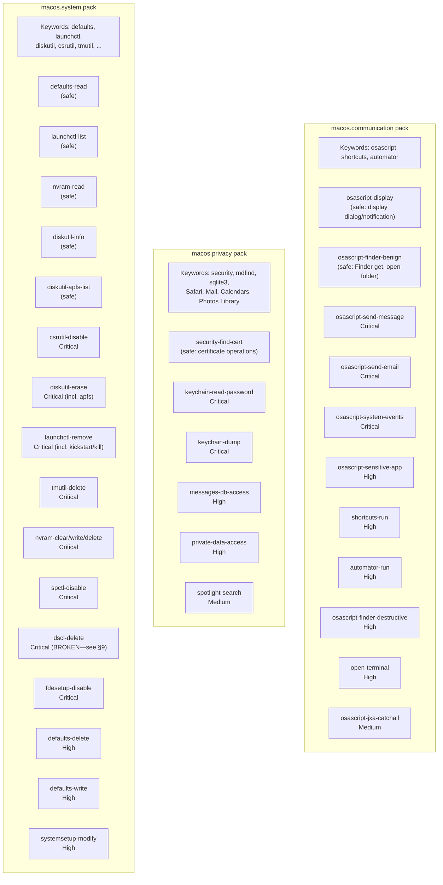
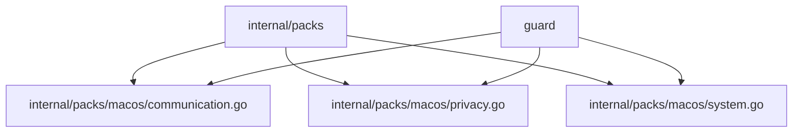

# 03g: macOS System Pack

**Batch**: 3 (Pattern Packs)
**Depends On**: [02-matching-framework](./02-matching-framework.md), [03a-packs-core](./03a-packs-core.md)
**Blocks**: [05-testing-and-benchmarks](./05-testing-and-benchmarks.md)
**Architecture**: [00-architecture.md](./00-architecture.md) §3 Layer 2
**Plan Index**: [00-plan-index.md](./00-plan-index.md)
**Pack Authoring Guide**: [03a-packs-core §4](./03a-packs-core.md)

---

## 1. Summary

This pack detects macOS-specific commands that could cause harm when run by
coding agents. It covers three distinct threat categories:

- **A. Acting as the user** — Sending iMessages, emails, or triggering
  automation via AppleScript, Shortcuts, or Automator. These have
  **irreversible external side effects** (messages sent cannot be unsent).

- **B. Reading private data** — Accessing message history, email databases,
  browsing history, contacts, keychain credentials, and other personal data
  stored in macOS-specific locations.

- **C. System modification** — Changing system preferences, disabling security
  features, removing services, or modifying boot/disk configuration.

**Platform-conditional loading**: This pack uses Go build tags (`//go:build darwin`)
so it is only compiled and registered on macOS. On Linux/Windows, the pack
simply doesn't exist in the binary. See plan 02 §5.3 for the build tag pattern.

**Key design decisions**:
- D1: `osascript` detection uses `ArgContentRegex` on script content, not full
  AppleScript AST parsing (no mature tree-sitter grammar exists)
- D2: Private data detection combines command-based and path-based matching
  for macOS-specific database paths (complementing `personal.files` pack)
- D3: System modification patterns are command+flag based (standard approach)
- D4: Platform-conditional via build tags, not runtime detection

### Pack Summary Table

| Pack ID | Keywords | Destructive Patterns | Safe Patterns |
|---------|----------|---------------------|---------------|
| `macos.communication` | osascript, shortcuts, automator | 9 | 2 |
| `macos.privacy` | security, mdfind, sqlite3, Safari, Mail, Calendars, Photos Library | 5 | 1 |
| `macos.system` | defaults, launchctl, diskutil, csrutil, tmutil, nvram, spctl, systemsetup, dscl, fdesetup, bless | 13 (12 functional + 1 known-broken†) | 5 |

† D7 `dscl-delete` is non-functional in v1 — the plan 01 parser decomposes
`-delete` into short flags, making `ArgContent("-delete")` unreachable.
Requires plan 02 `RawArgContent` matcher. Effective coverage is 12/13 until
this dependency is resolved. See §5.3 D7 comment for details.

---

## 2. Component Diagram



---

## 3. Import Flow



All three packs are in the `macos` package under `internal/packs/macos/`.
Each file has the `//go:build darwin` constraint.

---

## 4. Matching Patterns for macOS Commands

### 4.1 AppleScript Detection (`osascript`)

`osascript` executes AppleScript (or JavaScript for Automation). The dangerous
case is when the script targets communication or automation apps. Detection
is via `ArgContentRegex` on the script content argument. (Note: the plan 01
parser treats `-e` as a boolean short flag, so the script content that follows
`-e` becomes a positional argument in `cmd.Args`. `ArgContentRegex` searches
`cmd.Args`, so it finds the script content correctly.)

The key pattern to match in osascript content:

```
tell\s+application\s+"(Messages|Mail|Contacts|Calendar|Reminders|Safari|System Events|Finder)"
```

**Why not full AST parsing**: No mature tree-sitter AppleScript grammar exists.
The only available grammar (`mskelton/tree-sitter-applescript`) is a skeleton
that only parses number literals. Regex detection of `tell application "X"` is
sufficient because:
- AppleScript's `tell` block is the primary mechanism for app interaction
- The app name is always a string literal in quotes
- We only need to identify WHICH app is targeted, not parse the full script

**osascript invocation variants**:
- `osascript -e 'tell application "Messages" ...'` — inline script
- `osascript script.scpt` — script file (we can match the filename but
  cannot analyze content; documented as known limitation)
- `osascript -l JavaScript -e '...'` — JXA scripts (same `-e` matching)

### 4.2 macOS Private Data Paths

macOS stores personal data in well-known database files:

| Data | Path | Format |
|------|------|--------|
| iMessage history | `~/Library/Messages/chat.db` | SQLite |
| Email metadata | `~/Library/Mail/V*/MailData/Envelope Index*` | SQLite |
| Safari history | `~/Library/Safari/History.db` | SQLite |
| Safari bookmarks | `~/Library/Safari/Bookmarks.plist` | Plist |
| Contacts | `~/Library/Application Support/AddressBook/` | SQLite |
| Notes | `~/Library/Group Containers/group.com.apple.notes/` | SQLite |
| Calendar | `~/Library/Calendars/` | SQLite/ICS |
| Photos metadata | `~/Pictures/Photos Library.photoslibrary/` | SQLite |

Detection uses `ArgContentRegex` on these paths. These complement the
`personal.files` pack — that pack catches broad personal directory access,
while this pack catches specific macOS database files that contain private data.

### 4.3 System Command Patterns

Standard command+flag matching, same approach as other packs. Most macOS
system commands have clearly safe (read-only) and destructive (modify/delete)
forms distinguished by subcommands or flags.

---

## 5. Detailed Design

### 5.1 `macos.communication` Pack (`internal/packs/macos/communication.go`)

```go
//go:build darwin

package macos

import (
    "regexp"

    "github.com/dcosson/destructive-command-guard-go/guard"
    "github.com/dcosson/destructive-command-guard-go/internal/packs"
)

// osascriptMessagesRe matches osascript content targeting Messages app.
var osascriptMessagesRe = regexp.MustCompile(
    `(?i)tell\s+application\s+"Messages"`,
)

// osascriptMailRe matches osascript content targeting Mail app.
var osascriptMailRe = regexp.MustCompile(
    `(?i)tell\s+application\s+"Mail"`,
)

// osascriptSystemEventsRe matches osascript targeting System Events.
// System Events can simulate keystrokes, click UI elements, and control
// any application — effectively full GUI automation.
var osascriptSystemEventsRe = regexp.MustCompile(
    `(?i)tell\s+application\s+"System Events"`,
)

// osascriptSensitiveAppsRe matches osascript targeting any sensitive app.
// Contacts, Calendar, Reminders, Notes, Safari can all expose personal data
// or perform actions on behalf of the user.
var osascriptSensitiveAppsRe = regexp.MustCompile(
    `(?i)tell\s+application\s+"(Contacts|Calendar|Reminders|Notes|Safari)"`,
)

// osascriptDisplayRe matches benign osascript display commands.
var osascriptDisplayRe = regexp.MustCompile(
    `(?i)(?:display\s+(?:dialog|notification|alert)|say\s+)`,
)

// osascriptFinderBenignRe matches benign Finder operations.
var osascriptFinderBenignRe = regexp.MustCompile(
    `(?i)tell\s+application\s+"Finder"\s+to\s+(?:get|open\s+folder|reveal)`,
)

var communicationPack = packs.Pack{
    ID:          "macos.communication",
    Name:        "macOS Communication",
    Description: "Detects osascript/Shortcuts commands that send messages, emails, or control apps",
    Keywords:    []string{"osascript", "shortcuts", "automator"},

    Safe: []packs.SafePattern{
        // S1: Display dialogs and notifications are benign.
        // Not clauses prevent safe-pattern-shadowing for multi-tell scripts.
        {
            Name: "osascript-display",
            Match: packs.And(
                packs.Name("osascript"),
                packs.ArgContentRegex(osascriptDisplayRe.String()),
                packs.Not(packs.ArgContentRegex(osascriptMessagesRe.String())),
                packs.Not(packs.ArgContentRegex(osascriptMailRe.String())),
                packs.Not(packs.ArgContentRegex(osascriptSystemEventsRe.String())),
                packs.Not(packs.ArgContentRegex(osascriptSensitiveAppsRe.String())),
            ),
        },

        // S2: Benign Finder operations (get info, open folder, reveal).
        // Not clauses prevent safe-pattern-shadowing for multi-tell scripts
        // that combine Finder operations with dangerous app targets (MO-P0.1).
        {
            Name: "osascript-finder-benign",
            Match: packs.And(
                packs.Name("osascript"),
                packs.ArgContentRegex(osascriptFinderBenignRe.String()),
                packs.Not(packs.ArgContentRegex(osascriptMessagesRe.String())),
                packs.Not(packs.ArgContentRegex(osascriptMailRe.String())),
                packs.Not(packs.ArgContentRegex(osascriptSystemEventsRe.String())),
                packs.Not(packs.ArgContentRegex(osascriptSensitiveAppsRe.String())),
            ),
        },
    },

    Destructive: []packs.DestructivePattern{
        // ---- Critical ----

        // D1: Sending iMessages — irreversible external side effect.
        {
            Name: "osascript-send-message",
            Match: packs.And(
                packs.Name("osascript"),
                packs.ArgContentRegex(osascriptMessagesRe.String()),
            ),
            Severity:   guard.Critical,
            Confidence: guard.ConfidenceHigh,
            Reason:     "osascript can send iMessages on your behalf — messages cannot be unsent",
            Remediation: "Review the AppleScript content carefully before allowing message sending",
        },

        // D2: Sending emails — irreversible external side effect.
        {
            Name: "osascript-send-email",
            Match: packs.And(
                packs.Name("osascript"),
                packs.ArgContentRegex(osascriptMailRe.String()),
            ),
            Severity:   guard.Critical,
            Confidence: guard.ConfidenceHigh,
            Reason:     "osascript can send emails via Mail.app on your behalf",
            Remediation: "Review the AppleScript content carefully before allowing email sending",
        },

        // D3: System Events — full GUI automation capability.
        {
            Name: "osascript-system-events",
            Match: packs.And(
                packs.Name("osascript"),
                packs.ArgContentRegex(osascriptSystemEventsRe.String()),
            ),
            Severity:   guard.Critical,
            Confidence: guard.ConfidenceHigh,
            Reason:     "osascript with System Events can simulate keystrokes, " +
                "click buttons, and control any application",
            Remediation: "System Events automation should not be used by coding agents",
        },

        // ---- High ----

        // D4: Accessing sensitive apps (Contacts, Calendar, etc.).
        {
            Name: "osascript-sensitive-app",
            Match: packs.And(
                packs.Name("osascript"),
                packs.ArgContentRegex(osascriptSensitiveAppsRe.String()),
            ),
            Severity:   guard.High,
            Confidence: guard.ConfidenceHigh,
            Reason:     "osascript targets a sensitive application containing personal data",
            Remediation: "Verify this AppleScript interaction is intentional and necessary",
        },

        // D5: Running Shortcuts — can perform arbitrary automation.
        {
            Name: "shortcuts-run",
            Match: packs.And(
                packs.Name("shortcuts"),
                packs.ArgAt(0, "run"),
            ),
            Severity:   guard.High,
            Confidence: guard.ConfidenceHigh,
            Reason:     "Apple Shortcuts can perform arbitrary automation " +
                "including sending messages, modifying files, and making network requests",
            Remediation: "Review the Shortcut's actions before running",
        },

        // D6: Running Automator workflows.
        {
            Name: "automator-run",
            Match: packs.And(
                packs.Name("automator"),
                packs.Not(packs.Or(
                    packs.Flags("--help"),
                    packs.Flags("-h"),
                    packs.Flags("--version"),
                )),
            ),
            Severity:   guard.High,
            Confidence: guard.ConfidenceMedium,
            Reason:     "Automator workflows can perform arbitrary automation",
            Remediation: "Review the workflow before running",
        },

        // D7: Destructive Finder operations via osascript.
        // Finder delete, empty trash, and move to trash are destructive
        // even though Finder itself is considered a benign app for reads.
        {
            Name: "osascript-finder-destructive",
            Match: packs.And(
                packs.Name("osascript"),
                packs.ArgContentRegex(`(?i)tell\s+application\s+"Finder"\s+to\s+(?:delete|empty\s+trash|move\s+.+\s+to\s+trash)`),
            ),
            Severity:   guard.High,
            Confidence: guard.ConfidenceHigh,
            Reason:     "osascript performs destructive Finder operation (delete/trash)",
            Remediation: "Review the Finder operation — files deleted via Finder " +
                "may be moved to Trash but empty trash is irreversible",
        },

        // D8: Opening Terminal/iTerm via `open -a` — potential hook bypass.
        // An agent could spawn an unmonitored terminal that bypasses the
        // destructive command guard hook system entirely.
        {
            Name: "open-terminal",
            Match: packs.And(
                packs.Name("open"),
                packs.Flags("-a"),
                packs.Or(
                    packs.ArgContent("Terminal"),
                    packs.ArgContent("iTerm"),
                ),
            ),
            Severity:   guard.High,
            Confidence: guard.ConfidenceHigh,
            Reason:     "Opening a terminal app could bypass the command guard hook system",
            Remediation: "Do not open separate terminal windows — use the current shell",
        },

        // ---- Medium ----

        // D9: JXA (JavaScript for Automation) catch-all.
        // JXA uses different syntax (Application("...")) that evades the
        // AppleScript tell-application regex patterns. Flag any JXA execution
        // at Medium as a precaution until specific JXA patterns are added in v2.
        {
            Name: "osascript-jxa-catchall",
            Match: packs.And(
                packs.Name("osascript"),
                packs.Flags("-l"),
                packs.ArgContent("JavaScript"),
            ),
            Severity:   guard.Medium,
            Confidence: guard.ConfidenceLow,
            Reason:     "JXA scripts can perform arbitrary automation " +
                "including message sending and app control",
            Remediation: "Review the JavaScript for Automation content carefully",
        },
    },
}

func init() {
    packs.DefaultRegistry.Register(communicationPack)
}
```

### 5.2 `macos.privacy` Pack (`internal/packs/macos/privacy.go`)

```go
//go:build darwin

package macos

import (
    "regexp"

    "github.com/dcosson/destructive-command-guard-go/guard"
    "github.com/dcosson/destructive-command-guard-go/internal/packs"
)

// macOS private data paths (SQLite databases and data directories).
var messagesDbRe = regexp.MustCompile(
    `(?:~|(?:\$HOME|\$\{HOME\})|/(?:Users)/[^/]+)/Library/Messages/`,
)

var mailDbRe = regexp.MustCompile(
    `(?:~|(?:\$HOME|\$\{HOME\})|/(?:Users)/[^/]+)/Library/Mail/`,
)

var safariDbRe = regexp.MustCompile(
    `(?:~|(?:\$HOME|\$\{HOME\})|/(?:Users)/[^/]+)/Library/Safari/`,
)

var contactsDbRe = regexp.MustCompile(
    `(?:~|(?:\$HOME|\$\{HOME\})|/(?:Users)/[^/]+)/Library/Application Support/AddressBook/`,
)

var notesDbRe = regexp.MustCompile(
    `(?:~|(?:\$HOME|\$\{HOME\})|/(?:Users)/[^/]+)/Library/Group Containers/group\.com\.apple\.notes/`,
)

// Combined pattern for any macOS private data path.
// Covers both ~/Library/... and ~/Pictures/Photos Library.photoslibrary/.
var macosPrivateDataRe = regexp.MustCompile(
    `(?:~|(?:\$HOME|\$\{HOME\})|/(?:Users)/[^/]+)/` +
        `(?:Library/(?:Messages/|Mail/|Safari/|Application Support/AddressBook/|` +
        `Group Containers/group\.com\.apple\.notes/|Calendars/)` +
        `|Pictures/Photos Library\.photoslibrary/)`,
)

var privacyPack = packs.Pack{
    ID:          "macos.privacy",
    Name:        "macOS Privacy",
    Description: "Detects access to macOS private data (messages, email, browsing history, keychain)",
    Keywords: []string{
        "security", "mdfind", "sqlite3",
        // Path component keywords for all private data locations
        "Messages", "AddressBook", "apple.notes",
        "Safari", "Mail", "Calendars",
        "Photos Library",
    },

    Safe: []packs.SafePattern{
        // S1: Certificate operations with the security command.
        {
            Name: "security-find-cert",
            Match: packs.And(
                packs.Name("security"),
                packs.Or(
                    packs.ArgAt(0, "find-certificate"),
                    packs.ArgAt(0, "verify-cert"),
                    packs.ArgAt(0, "cms"),
                ),
            ),
        },
    },

    Destructive: []packs.DestructivePattern{
        // ---- Critical ----

        // D1: Reading passwords from the Keychain.
        {
            Name: "keychain-read-password",
            Match: packs.And(
                packs.Name("security"),
                packs.Or(
                    packs.ArgAt(0, "find-generic-password"),
                    packs.ArgAt(0, "find-internet-password"),
                ),
            ),
            Severity:   guard.Critical,
            Confidence: guard.ConfidenceHigh,
            Reason:     "Reading passwords from the macOS Keychain",
            Remediation: "Agents should not access Keychain passwords directly — " +
                "use environment variables or config files for credentials",
        },

        // D2: Dumping the entire Keychain.
        {
            Name: "keychain-dump",
            Match: packs.And(
                packs.Name("security"),
                packs.Or(
                    packs.ArgAt(0, "dump-keychain"),
                    packs.ArgAt(0, "export"),
                ),
            ),
            Severity:   guard.Critical,
            Confidence: guard.ConfidenceHigh,
            Reason:     "Dumping or exporting the macOS Keychain exposes all stored credentials",
            Remediation: "Do not dump the Keychain — use specific credential " +
                "management tools instead",
        },

        // ---- High ----

        // D3: Accessing iMessage database.
        {
            Name: "messages-db-access",
            Match: packs.And(
                packs.AnyName(),
                packs.ArgContentRegex(messagesDbRe.String()),
            ),
            Severity:   guard.High,
            Confidence: guard.ConfidenceHigh,
            Reason:     "Command accesses the iMessage database (chat.db) " +
                "which contains full message history",
            Remediation: "Agents should not access personal message data",
        },

        // D4: Accessing browser history, contacts, email, notes, or calendar.
        {
            Name: "private-data-access",
            Match: packs.And(
                packs.AnyName(),
                packs.ArgContentRegex(macosPrivateDataRe.String()),
                packs.Not(packs.ArgContentRegex(messagesDbRe.String())), // D3 handles this
            ),
            Severity:   guard.High,
            Confidence: guard.ConfidenceHigh,
            Reason:     "Command accesses a macOS private data store " +
                "(email, contacts, browsing history, notes, or calendar)",
            Remediation: "Verify this access to personal data is intentional and necessary",
        },

        // ---- Medium ----

        // D5: Spotlight search — can find personal files by content.
        {
            Name: "spotlight-search",
            Match: packs.Name("mdfind"),
            Severity:   guard.Medium,
            Confidence: guard.ConfidenceLow,
            Reason:     "mdfind (Spotlight search) can search personal files by content",
            Remediation: "Consider using find or grep instead to limit search scope",
        },
    },
}

func init() {
    packs.DefaultRegistry.Register(privacyPack)
}
```

### 5.3 `macos.system` Pack (`internal/packs/macos/system.go`)

```go
//go:build darwin

package macos

import (
    "github.com/dcosson/destructive-command-guard-go/guard"
    "github.com/dcosson/destructive-command-guard-go/internal/packs"
)

var systemPack = packs.Pack{
    ID:          "macos.system",
    Name:        "macOS System",
    Description: "Detects macOS system modification commands (preferences, services, disks, security features)",
    Keywords: []string{
        "defaults", "launchctl", "diskutil",
        "csrutil", "tmutil", "nvram",
        "spctl", "systemsetup", "dscl",
        "fdesetup", "bless",
    },

    Safe: []packs.SafePattern{
        // S1: Reading preferences is safe.
        {
            Name: "defaults-read",
            Match: packs.And(
                packs.Name("defaults"),
                packs.ArgAt(0, "read"),
            ),
        },

        // S2: Listing services is safe.
        {
            Name: "launchctl-list",
            Match: packs.And(
                packs.Name("launchctl"),
                packs.Or(
                    packs.ArgAt(0, "list"),
                    packs.ArgAt(0, "print"),
                    packs.ArgAt(0, "blame"),
                ),
            ),
        },

        // S3: nvram read operations are safe. (SE-P2.1)
        // `nvram -p` prints all, `nvram <variable>` (no '=') reads one.
        {
            Name: "nvram-read",
            Match: packs.And(
                packs.Name("nvram"),
                packs.Or(
                    packs.Flags("-p"),
                    packs.Flags("-x"),
                    packs.Flags("--print"),
                ),
            ),
        },

        // S4: Reading disk information is safe.
        // Note: "apfs" removed from S3 — `diskutil apfs` has destructive
        // subcommands (deleteContainer, deleteVolume) that would be shadowed
        // as safe (MO-P0.2/SE-P1.3).
        {
            Name: "diskutil-info",
            Match: packs.And(
                packs.Name("diskutil"),
                packs.Or(
                    packs.ArgAt(0, "info"),
                    packs.ArgAt(0, "list"),
                ),
            ),
        },

        // S3a: diskutil apfs list is safe (requires two-level subcommand check).
        {
            Name: "diskutil-apfs-list",
            Match: packs.And(
                packs.Name("diskutil"),
                packs.ArgAt(0, "apfs"),
                packs.ArgAt(1, "list"),
            ),
        },
    },

    Destructive: []packs.DestructivePattern{
        // ---- Critical ----

        // D1: Disabling System Integrity Protection.
        {
            Name: "csrutil-disable",
            Match: packs.And(
                packs.Name("csrutil"),
                packs.ArgAt(0, "disable"),
            ),
            Severity:   guard.Critical,
            Confidence: guard.ConfidenceHigh,
            Reason:     "Disabling System Integrity Protection removes critical macOS security protections",
            Remediation: "SIP should not be disabled by coding agents",
        },

        // D2: Erasing or partitioning disks (including APFS destructive ops).
        {
            Name: "diskutil-erase",
            Match: packs.And(
                packs.Name("diskutil"),
                packs.Or(
                    packs.ArgAt(0, "eraseDisk"),
                    packs.ArgAt(0, "eraseVolume"),
                    packs.ArgAt(0, "partitionDisk"),
                    packs.ArgAt(0, "secureErase"),
                    // APFS-specific destructive operations (MO-P0.2)
                    packs.And(packs.ArgAt(0, "apfs"), packs.Or(
                        packs.ArgAt(1, "deleteContainer"),
                        packs.ArgAt(1, "deleteVolume"),
                        packs.ArgAt(1, "resizeContainer"),
                    )),
                ),
            ),
            Severity:   guard.Critical,
            Confidence: guard.ConfidenceHigh,
            Reason:     "Erasing, repartitioning, or deleting disk volumes causes irreversible data loss",
            Remediation: "Do not erase or repartition disks",
        },

        // D3: Removing/disabling launch services (daemons, agents).
        {
            Name: "launchctl-remove",
            Match: packs.And(
                packs.Name("launchctl"),
                packs.Or(
                    packs.ArgAt(0, "remove"),
                    packs.ArgAt(0, "unload"),
                    packs.ArgAt(0, "bootout"),
                    packs.ArgAt(0, "disable"),
                    packs.ArgAt(0, "kickstart"), // force-restarts a service (MO-P3.4)
                    packs.ArgAt(0, "kill"),       // kills a service process (MO-P3.4)
                ),
            ),
            Severity:   guard.Critical,
            Confidence: guard.ConfidenceHigh,
            Reason:     "Removing, disabling, or killing a launch service can break system functionality",
            Remediation: "Do not modify macOS launch services",
        },

        // D4: Deleting Time Machine backups.
        {
            Name: "tmutil-delete",
            Match: packs.And(
                packs.Name("tmutil"),
                packs.Or(
                    packs.ArgAt(0, "delete"),
                    packs.ArgAt(0, "deletelocalsnapshots"),
                ),
            ),
            Severity:   guard.Critical,
            Confidence: guard.ConfidenceHigh,
            Reason:     "Deleting Time Machine backups removes the last line of data recovery",
            Remediation: "Do not delete Time Machine backups",
        },

        // D5a: Clearing ALL NVRAM variables — extremely destructive.
        // Separated from the general nvram-write pattern for clarity (MO-P1.1).
        {
            Name: "nvram-clear",
            Match: packs.And(
                packs.Name("nvram"),
                packs.Flags("-c"),
            ),
            Severity:   guard.Critical,
            Confidence: guard.ConfidenceHigh,
            Reason:     "nvram -c clears ALL firmware variables — can affect boot behavior " +
                "and potentially brick the system",
            Remediation: "Do not clear NVRAM firmware variables",
        },

        // D5b: Writing firmware variables (key=value syntax).
        // Uses ArgContentRegex to match the '=' sign that distinguishes writes
        // from reads. `nvram boot-args` (no '=') is a read; `nvram boot-args="-v"`
        // (with '=') is a write. (SE-P2.1)
        {
            Name: "nvram-write",
            Match: packs.And(
                packs.Name("nvram"),
                packs.ArgContentRegex(`=`),
                packs.Not(packs.Or(
                    packs.Flags("-p"),     // print all
                    packs.Flags("-x"),     // xml output
                    packs.Flags("--print"),
                )),
            ),
            Severity:   guard.Critical,
            Confidence: guard.ConfidenceHigh,
            Reason:     "Modifying NVRAM firmware variables can affect boot behavior",
            Remediation: "Do not modify firmware variables",
        },

        // D5c: Deleting specific NVRAM variable.
        {
            Name: "nvram-delete",
            Match: packs.And(
                packs.Name("nvram"),
                packs.Flags("-d"),
            ),
            Severity:   guard.Critical,
            Confidence: guard.ConfidenceHigh,
            Reason:     "Deleting NVRAM firmware variables can affect boot behavior",
            Remediation: "Do not delete firmware variables",
        },

        // D6: Disabling Gatekeeper.
        {
            Name: "spctl-disable",
            Match: packs.And(
                packs.Name("spctl"),
                packs.Or(
                    packs.ArgAt(0, "--master-disable"),
                    packs.Flags("--disable"),
                ),
            ),
            Severity:   guard.Critical,
            Confidence: guard.ConfidenceHigh,
            Reason:     "Disabling Gatekeeper allows unsigned applications to run",
            Remediation: "Do not disable Gatekeeper",
        },

        // D7: Deleting directory service entries (users/groups).
        //
        // KNOWN BUG (SE-P1.1/MO-P1.2): This pattern is BROKEN in v1.
        // dscl uses dash-prefixed subcommands (`dscl . -delete /Users/foo`).
        // The plan 01 parser decomposes `-delete` into individual short flags
        // [-d, -e, -l, -t], removing it from cmd.Args. ArgContent("-delete")
        // searches cmd.Args and will never find it.
        //
        // Fix requires plan 02 enhancement: RawArgContent matcher that searches
        // cmd.RawArgs (pre-flag-decomposition). Tracked as future work.
        //
        // For now, this pattern is documented but non-functional. The test
        // section includes SKIP markers for dscl tests.
        {
            Name: "dscl-delete",
            Match: packs.And(
                packs.Name("dscl"),
                packs.Or(
                    packs.ArgContent("-delete"),
                    packs.ArgContent("delete"),
                    packs.ArgContent("-create"),
                    packs.ArgContent("create"),
                ),
            ),
            Severity:   guard.Critical,
            Confidence: guard.ConfidenceHigh,
            Reason:     "Modifying directory service entries affects user/group management",
            Remediation: "Do not modify macOS directory services",
        },

        // D8: Disabling FileVault.
        {
            Name: "fdesetup-disable",
            Match: packs.And(
                packs.Name("fdesetup"),
                packs.Or(
                    packs.ArgAt(0, "disable"),
                    packs.ArgAt(0, "removeuser"),
                    packs.ArgAt(0, "destroy"),
                ),
            ),
            Severity:   guard.Critical,
            Confidence: guard.ConfidenceHigh,
            Reason:     "Disabling or modifying FileVault encryption compromises disk security",
            Remediation: "Do not modify FileVault settings",
        },

        // ---- High ----

        // D9: Deleting preferences.
        {
            Name: "defaults-delete",
            Match: packs.And(
                packs.Name("defaults"),
                packs.ArgAt(0, "delete"),
            ),
            Severity:   guard.High,
            Confidence: guard.ConfidenceHigh,
            Reason:     "Deleting macOS preferences can break application behavior",
            Remediation: "Use 'defaults read' to inspect before deleting preferences",
        },

        // D10: Writing system preferences (non-user domains).
        {
            Name: "defaults-write",
            Match: packs.And(
                packs.Name("defaults"),
                packs.ArgAt(0, "write"),
            ),
            Severity:   guard.High,
            Confidence: guard.ConfidenceMedium,
            Reason:     "Writing macOS preferences can change system or application behavior",
            Remediation: "Review the preference domain and key before writing",
        },

        // D11: Modifying system setup.
        {
            Name: "systemsetup-modify",
            Match: packs.And(
                packs.Name("systemsetup"),
                packs.Not(packs.Or(
                    packs.Flags("-getcomputername"),
                    packs.Flags("-getlocalsubnetname"),
                    packs.Flags("-getstartupdisk"),
                    packs.Flags("-getremotelogin"),
                    packs.Flags("-getremoteappleevents"),
                    packs.Flags("-gettimezone"),
                )),
            ),
            Severity:   guard.High,
            Confidence: guard.ConfidenceMedium,
            Reason:     "Modifying system setup changes machine-level configuration",
            Remediation: "Use getter flags (-get*) to read system setup, not set",
        },
    },
}

func init() {
    packs.DefaultRegistry.Register(systemPack)
}
```

---

## 6. Per-Pattern Unit Tests

### 6.1 `macos.communication` Tests

**S1: osascript-display**:
- `osascript -e 'display dialog "Hello"'` → safe
- `osascript -e 'display notification "Done"'` → safe
- `osascript -e 'display dialog "Hello"' -e 'tell application "Messages" ...'` → NOT safe (D1 matches)

**S2: osascript-finder-benign**:
- `osascript -e 'tell application "Finder" to get name of every disk'` → safe
- `osascript -e 'tell application "Finder" to open folder "Documents"'` → safe
- `osascript -e 'tell application "Finder" to reveal' -e 'tell application "Messages" to send "hi"'` → NOT safe (S2 Not clause for Messages, MO-P0.1)
- `osascript -e 'tell application "Finder" to get' -e 'tell application "Mail" to ...'` → NOT safe (S2 Not clause for Mail)
- `osascript -e 'tell application "Finder" to open' -e 'tell application "System Events" to ...'` → NOT safe (S2 Not clause for System Events)
- `osascript -e 'tell application "Finder" to reveal' -e 'tell application "Contacts" to ...'` → NOT safe (S2 Not clause for sensitive apps)

**D1: osascript-send-message**:
- `osascript -e 'tell application "Messages" to send "hello" to buddy "John"'` → Critical
- `osascript -e 'tell application "Messages" to get every chat'` → Critical (still targets Messages)

**D2: osascript-send-email**:
- `osascript -e 'tell application "Mail" to make new outgoing message with properties {subject:"Test"}'` → Critical

**D3: osascript-system-events**:
- `osascript -e 'tell application "System Events" to keystroke "q" using command down'` → Critical
- `osascript -e 'tell application "System Events" to click button "OK" of window 1'` → Critical

**D4: osascript-sensitive-app**:
- `osascript -e 'tell application "Contacts" to get every person'` → High
- `osascript -e 'tell application "Safari" to open location "http://example.com"'` → High
- `osascript -e 'tell application "Calendar" to get every event'` → High

**D5: shortcuts-run**:
- `shortcuts run "My Shortcut"` → High
- `shortcuts list` → no match (no "run" subcommand)

**D6: automator-run**:
- `automator workflow.workflow` → High
- `automator --help` → no match (excluded by Not clause)
- `automator --version` → no match (excluded by Not clause)

**D7: osascript-finder-destructive**:
- `osascript -e 'tell application "Finder" to delete file "x" of desktop'` → High
- `osascript -e 'tell application "Finder" to empty trash'` → High
- `osascript -e 'tell application "Finder" to move file "x" to trash'` → High

**D8: open-terminal**:
- `open -a Terminal` → High
- `open -a iTerm` → High
- `open -a Safari` → no match (not Terminal/iTerm)
- `open README.md` → no match (no -a flag)

**D9: osascript-jxa-catchall**:
- `osascript -l JavaScript -e 'Application("Messages").send(...)'` → Medium
- `osascript -l JavaScript -e 'Application("Finder").selection()'` → Medium
- `osascript -e 'display dialog "hello"'` → no match (no -l JavaScript)

### 6.2 `macos.privacy` Tests

**S1: security-find-cert**:
- `security find-certificate -a` → safe
- `security verify-cert -c cert.pem` → safe

**D1: keychain-read-password**:
- `security find-generic-password -s "service"` → Critical
- `security find-internet-password -s "example.com"` → Critical

**D2: keychain-dump**:
- `security dump-keychain` → Critical
- `security export -t identities` → Critical

**D3: messages-db-access**:
- `sqlite3 ~/Library/Messages/chat.db "SELECT * FROM message"` → High
- `cat ~/Library/Messages/chat.db` → High
- `cp ~/Library/Messages/chat.db /tmp/` → High

**D4: private-data-access**:
- `sqlite3 ~/Library/Safari/History.db` → High
- `cat ~/Library/Mail/V10/MailData/Envelope\ Index` → High
- `ls ~/Library/Application\ Support/AddressBook/` → High
- `cat ~/Library/Group\ Containers/group.com.apple.notes/NoteStore.sqlite` → High
- `sqlite3 ~/Pictures/Photos\ Library.photoslibrary/database/Photos.sqlite` → High (MO-P2.2)
- `ls ~/Library/Calendars/` → High

**D5: spotlight-search**:
- `mdfind "tax return"` → Medium
- `mdfind -name passwords.txt` → Medium

### 6.3 `macos.system` Tests

**S1: defaults-read**:
- `defaults read com.apple.finder` → safe
- `defaults read NSGlobalDomain` → safe

**S2: launchctl-list**:
- `launchctl list` → safe
- `launchctl print system` → safe

**S3: nvram-read**:
- `nvram -p` → safe (print all)
- `nvram -x` → safe (XML output)
- `nvram --print` → safe

**S4: diskutil-info**:
- `diskutil info disk0` → safe
- `diskutil list` → safe

**S4a: diskutil-apfs-list**:
- `diskutil apfs list` → safe
- `diskutil apfs deleteVolume disk2s1` → NOT safe (missing ArgAt(1, "list"))

**D1: csrutil-disable**:
- `csrutil disable` → Critical

**D2: diskutil-erase** (including apfs destructive):
- `diskutil eraseDisk JHFS+ "Macintosh HD" disk0` → Critical
- `diskutil eraseVolume APFS "Data" disk0s2` → Critical
- `diskutil partitionDisk disk0 GPT JHFS+ "Disk" 100%` → Critical
- `diskutil apfs deleteContainer disk3` → Critical (MO-P0.2)
- `diskutil apfs deleteVolume disk3s2` → Critical (MO-P0.2)
- `diskutil apfs resizeContainer disk3 0b` → Critical (MO-P0.2)

**D3: launchctl-remove** (including kickstart/kill):
- `launchctl remove com.apple.service` → Critical
- `launchctl unload /Library/LaunchDaemons/com.apple.service.plist` → Critical
- `launchctl bootout system/com.apple.service` → Critical
- `launchctl kickstart -k system/com.apple.service` → Critical (MO-P3.4)
- `launchctl kill SIGKILL system/com.apple.service` → Critical (MO-P3.4)

**D4: tmutil-delete**:
- `tmutil delete /Volumes/Backup/2024-01-01-000000` → Critical
- `tmutil deletelocalsnapshots 2024-01-01-000000` → Critical

**D5a: nvram-clear**:
- `nvram -c` → Critical

**D5b: nvram-write**:
- `nvram boot-args="-v"` → Critical
- `nvram boot-args` → no match (read: no '=' in args)

**D5c: nvram-delete**:
- `nvram -d boot-args` → Critical

**D6: spctl-disable**:
- `spctl --master-disable` → Critical

**D7: dscl-delete** (SKIP — known broken, see §5.3 D7 comment):
- `dscl . -delete /Users/testuser` → SHOULD be Critical, but pattern BROKEN in v1
  (parser decomposes `-delete` into short flags; ArgContent never matches)
- `dscl . -create /Users/newuser` → SHOULD be Critical, same issue

**D8: fdesetup-disable**:
- `fdesetup disable` → Critical

**D9: defaults-delete**:
- `defaults delete com.apple.finder` → High

**D10: defaults-write**:
- `defaults write com.apple.dock autohide -bool true` → High
- `defaults write NSGlobalDomain AppleShowAllExtensions -bool true` → High

**D11: systemsetup-modify**:
- `systemsetup -setstartupdisk /Volumes/Macintosh\ HD` → High
- `systemsetup -settimezone America/New_York` → High
- `systemsetup -gettimezone` → no match (safe: getter flag)

---

## 7. Test Infrastructure

### 7.1 Build Tag Test Strategy

**Requirement** (MO-P2.5): Pattern matching logic MUST be testable on all
platforms (including Linux CI). The approach:

1. **Pattern definitions** in always-built files (no build tags). All pack
   structs, regex patterns, and matching logic go in files without
   `//go:build darwin` constraints.

2. **Registration only** gated by build tags. Only the `init()` functions
   that register packs with the registry use `//go:build darwin`:

```go
//go:build darwin

package macos

func init() {
    packs.DefaultRegistry.Register(communicationPack)
    packs.DefaultRegistry.Register(privacyPack)
    packs.DefaultRegistry.Register(systemPack)
}
```

3. **Tests** are always-built and test the pattern matching directly, without
   depending on registry registration. This ensures full CI coverage on Linux.

### 7.2 osascript Content Variation Tests

The AppleScript content regex should be tested against variations:
- Different whitespace: `tell  application  "Messages"` (multiple spaces)
- Different quoting: `tell application 'Messages'` (single quotes — invalid
  AppleScript, but test anyway)
- Case variations: `Tell Application "MESSAGES"` (regex is case-insensitive)
- Multi-line scripts: `tell application "Messages"\nsend "hi"\nend tell`
- JXA variant: `osascript -l JavaScript -e 'Application("Messages").send(...)'`
  (caught by D9 jxa-catchall at Medium; specific JXA patterns deferred to v2)

### 7.3 Cross-Pack Interaction with personal.files

The `macos.privacy` pack's path-based patterns may overlap with `personal.files`.
For example, `cat ~/Library/Messages/chat.db`:
- `personal.files` D5 matches (command accesses personal dir) → Medium
- `macos.privacy` D3 matches (iMessage database) → High
- Pipeline returns High (highest severity wins) → correct behavior

---

## 8. Golden File Entries

```yaml
# ===== macos.communication pack =====

# S1: osascript-display (safe)
- input: 'osascript -e ''display dialog "Hello World"'''
  pack: macos.communication
  # Safe — display only

- input: 'osascript -e ''display notification "Build complete"'''
  pack: macos.communication
  # Safe — notification only

- input: 'osascript -e ''display dialog "ok"'' -e ''tell application "Messages" to send "hi"'''
  pack: macos.communication
  pattern: osascript-send-message
  severity: Critical
  # Near-miss for S1: multi-tell with Messages

# S2: osascript-finder-benign (safe)
- input: 'osascript -e ''tell application "Finder" to get name of every disk'''
  pack: macos.communication
  # Safe — Finder read

- input: 'osascript -e ''tell application "Finder" to reveal'' -e ''tell application "Messages" to send "x"'''
  pack: macos.communication
  pattern: osascript-send-message
  severity: Critical
  # Near-miss for S2: multi-tell with Messages (MO-P0.1)

# D1: osascript-send-message (Critical)
- input: 'osascript -e ''tell application "Messages" to send "hello" to buddy "John"'''
  pack: macos.communication
  pattern: osascript-send-message
  severity: Critical

- input: 'osascript -e ''tell application "Messages" to get every chat'''
  pack: macos.communication
  pattern: osascript-send-message
  severity: Critical

# D2: osascript-send-email (Critical)
- input: 'osascript -e ''tell application "Mail" to make new outgoing message'''
  pack: macos.communication
  pattern: osascript-send-email
  severity: Critical

# D3: osascript-system-events (Critical)
- input: 'osascript -e ''tell application "System Events" to keystroke "q" using command down'''
  pack: macos.communication
  pattern: osascript-system-events
  severity: Critical

# D4: osascript-sensitive-app (High)
- input: 'osascript -e ''tell application "Contacts" to get every person'''
  pack: macos.communication
  pattern: osascript-sensitive-app
  severity: High

- input: 'osascript -e ''tell application "Safari" to open location "http://example.com"'''
  pack: macos.communication
  pattern: osascript-sensitive-app
  severity: High

# D5: shortcuts-run (High)
- input: "shortcuts run 'My Shortcut'"
  pack: macos.communication
  pattern: shortcuts-run
  severity: High

- input: "shortcuts list"
  # Near-miss: no "run" subcommand

# D6: automator-run (High)
- input: "automator workflow.workflow"
  pack: macos.communication
  pattern: automator-run
  severity: High

- input: "automator --help"
  # Near-miss: excluded by Not clause

# D7: osascript-finder-destructive (High)
- input: 'osascript -e ''tell application "Finder" to delete file "x" of desktop'''
  pack: macos.communication
  pattern: osascript-finder-destructive
  severity: High

- input: 'osascript -e ''tell application "Finder" to empty trash'''
  pack: macos.communication
  pattern: osascript-finder-destructive
  severity: High

# D8: open-terminal (High)
- input: "open -a Terminal"
  pack: macos.communication
  pattern: open-terminal
  severity: High

- input: "open -a Safari"
  # Near-miss: not Terminal/iTerm

# D9: osascript-jxa-catchall (Medium)
- input: 'osascript -l JavaScript -e ''Application("Messages").send("hi")'''
  pack: macos.communication
  pattern: osascript-jxa-catchall
  severity: Medium

# ===== macos.privacy pack =====

# S1: security-find-cert (safe)
- input: "security find-certificate -a"
  pack: macos.privacy
  # Safe — certificate operation

- input: "security verify-cert -c cert.pem"
  pack: macos.privacy
  # Safe — certificate verification

# D1: keychain-read-password (Critical)
- input: "security find-generic-password -s MyService"
  pack: macos.privacy
  pattern: keychain-read-password
  severity: Critical

- input: "security find-internet-password -s example.com"
  pack: macos.privacy
  pattern: keychain-read-password
  severity: Critical

# D2: keychain-dump (Critical)
- input: "security dump-keychain"
  pack: macos.privacy
  pattern: keychain-dump
  severity: Critical

- input: "security export -t identities"
  pack: macos.privacy
  pattern: keychain-dump
  severity: Critical

# D3: messages-db-access (High)
- input: 'sqlite3 ~/Library/Messages/chat.db "SELECT * FROM message"'
  pack: macos.privacy
  pattern: messages-db-access
  severity: High

- input: "cat ~/Library/Messages/chat.db"
  pack: macos.privacy
  pattern: messages-db-access
  severity: High

# D4: private-data-access (High)
- input: "sqlite3 ~/Library/Safari/History.db"
  pack: macos.privacy
  pattern: private-data-access
  severity: High

- input: "ls ~/Library/Application Support/AddressBook/"
  pack: macos.privacy
  pattern: private-data-access
  severity: High

- input: "sqlite3 ~/Pictures/Photos Library.photoslibrary/database/Photos.sqlite"
  pack: macos.privacy
  pattern: private-data-access
  severity: High

# D5: spotlight-search (Medium)
- input: 'mdfind "tax return"'
  pack: macos.privacy
  pattern: spotlight-search
  severity: Medium

- input: "mdfind -name passwords.txt"
  pack: macos.privacy
  pattern: spotlight-search
  severity: Medium

# ===== macos.system pack =====

# S1: defaults-read (safe)
- input: "defaults read com.apple.finder"
  pack: macos.system
  # Safe — read only

# S2: launchctl-list (safe)
- input: "launchctl list"
  pack: macos.system
  # Safe — listing services

- input: "launchctl print system"
  pack: macos.system
  # Safe — printing service info

# S3: nvram-read (safe)
- input: "nvram -p"
  pack: macos.system
  # Safe — print all

# S4: diskutil-info (safe)
- input: "diskutil info disk0"
  pack: macos.system
  # Safe — disk info

- input: "diskutil list"
  pack: macos.system
  # Safe — disk listing

# S4a: diskutil-apfs-list (safe)
- input: "diskutil apfs list"
  pack: macos.system
  # Safe — APFS listing only

# D1: csrutil-disable (Critical)
- input: "csrutil disable"
  pack: macos.system
  pattern: csrutil-disable
  severity: Critical

# D2: diskutil-erase (Critical)
- input: "diskutil eraseDisk JHFS+ 'Macintosh HD' disk0"
  pack: macos.system
  pattern: diskutil-erase
  severity: Critical

- input: "diskutil apfs deleteVolume disk2s1"
  pack: macos.system
  pattern: diskutil-erase
  severity: Critical

- input: "diskutil apfs deleteContainer disk2"
  pack: macos.system
  pattern: diskutil-erase
  severity: Critical

# D3: launchctl-remove (Critical)
- input: "launchctl remove com.apple.service"
  pack: macos.system
  pattern: launchctl-remove
  severity: Critical

- input: "launchctl kickstart -k system/com.apple.service"
  pack: macos.system
  pattern: launchctl-remove
  severity: Critical

# D5a: nvram-clear (Critical)
- input: "nvram -c"
  pack: macos.system
  pattern: nvram-clear
  severity: Critical

# D5b: nvram-write (Critical)
- input: 'nvram boot-args="-v"'
  pack: macos.system
  pattern: nvram-write
  severity: Critical

- input: "nvram boot-args"
  # Near-miss: read (no '='), not a write

# D6: spctl-disable (Critical)
- input: "spctl --master-disable"
  pack: macos.system
  pattern: spctl-disable
  severity: Critical

# D9: defaults-delete (High)
- input: "defaults delete com.apple.finder"
  pack: macos.system
  pattern: defaults-delete
  severity: High

# D10: defaults-write (High)
- input: "defaults write com.apple.dock autohide -bool true"
  pack: macos.system
  pattern: defaults-write
  severity: High

# D11: systemsetup-modify (High)
- input: "systemsetup -settimezone America/New_York"
  pack: macos.system
  pattern: systemsetup-modify
  severity: High

- input: "systemsetup -gettimezone"
  # Near-miss: getter flag, safe
```

---

## 9. Open Questions & Known Limitations

1. **JXA specific app patterns (v2)**: The v1 JXA catch-all (D9) flags all
   `osascript -l JavaScript` at Medium. For v2, add specific JXA regexes
   matching `Application("Messages")`, `Application("Mail")`, etc. to detect
   at the same severity as their AppleScript equivalents:
   ```
   (?i)Application\(\s*"(?:Messages|Mail|System Events|Contacts|Calendar)"
   ```

2. **osascript script files**: `osascript myscript.scpt` runs a script from a
   file. We cannot analyze the file content statically. Recommendation: flag
   all `osascript <file>` invocations at Medium as a precaution, since the
   script could target any app.

3. **`open -a` for non-terminal apps**: v1 covers `open -a Terminal` and
   `open -a iTerm` as hook bypass vectors. Other apps (`open -a Messages`,
   `open -a Mail`) are lower risk since they don't provide shell access.
   Recommendation: add broader `open -a` coverage in v2 if users report
   false negatives.

4. **`say` command**: `say "hello"` uses text-to-speech. Harmless but could be
   surprising. Recommendation: out of scope — not a privacy or safety concern.

5. **`defaults write` severity**: Should all `defaults write` be High, or should
   user-domain writes (e.g., `com.apple.dock`) be Medium while system-domain
   writes are High? Recommendation: keep all at High for v1 simplicity; refine
   granularity in v2 if false-positive rate is too high.

6. **`dscl` detection broken** (SE-P1.1/MO-P1.2): The `dscl . -delete` and
   `dscl . -create` patterns are non-functional in v1 because the plan 01
   parser decomposes `-delete` into individual short flags `[-d, -e, -l, -t]`,
   removing it from `cmd.Args`. `ArgContent("-delete")` searches `cmd.Args`
   and will never find it. **Required fix**: Add a `RawArgContent` matcher to
   plan 02 that searches `cmd.RawArgs` (pre-flag-decomposition tokens). This
   would also benefit other commands that use dash-prefixed subcommands.
   Create a tracking bead for this enhancement.

7. **mdfind severity refinement (v2)** (MO-P2.4): Currently all `mdfind`
   invocations are Medium. Consider splitting in v2: scoped searches
   (`-onlyin <dir>` or `-name`) at Medium, unscoped content searches at
   High (since they can search ALL indexed personal file contents).

8. **Photos Library delegation**: `~/Pictures/Photos Library.photoslibrary/`
   is now included in macosPrivateDataRe. Note that the `personal.files` pack
   also catches this path via the Pictures keyword at Medium severity.
   The macos.privacy D4 pattern at High takes precedence.

---

## Round 1 Review Disposition

| # | Reviewer | Severity | Summary | Disposition | Notes |
|---|----------|----------|---------|-------------|-------|
| 1 | dcg-alt-reviewer | P0 | MO-P0.1: S2 finder-benign shadows D1-D4 for multi-tell scripts | Incorporated | Added Not clauses to S2 for Messages, Mail, System Events, sensitive apps; also fixed S1 missing sensitive apps Not |
| 2 | dcg-alt-reviewer | P0 | MO-P0.2: S3 diskutil apfs matches destructive subcommands as safe | Incorporated | Removed "apfs" from S3; added S4a for "diskutil apfs list" with ArgAt(1); added apfs destructive ops to D2 |
| 3 | dcg-alt-reviewer | P1 | MO-P1.1: nvram -c caught only indirectly | Incorporated | Added explicit nvram-clear, nvram-write (with = check), nvram-delete patterns; added nvram-read safe pattern |
| 4 | dcg-alt-reviewer | P1 | MO-P1.2: dscl ArgContent vs ArgAt | Incorporated | Documented as known broken — parser decomposes -delete into short flags; requires plan 02 RawArgContent matcher; SKIP in tests |
| 5 | dcg-alt-reviewer | P1 | MO-P1.3: JXA bypass evades all patterns | Incorporated | Added D9 osascript-jxa-catchall at Medium for v1; specific JXA patterns deferred to v2 in §9 Q1 |
| 6 | dcg-alt-reviewer | P2 | MO-P2.1: automator matches bare command name | Incorporated | Added Not clauses for --help, -h, --version |
| 7 | dcg-alt-reviewer | P2 | MO-P2.2: Photos Library path missing from regex | Incorporated | Added ~/Pictures/Photos Library.photoslibrary/ to macosPrivateDataRe |
| 8 | dcg-alt-reviewer | P2 | MO-P2.3: sqlite3 keyword missing from privacy pack | Incorporated | Added sqlite3, Safari, Mail, Calendars, Photos Library to Keywords |
| 9 | dcg-alt-reviewer | P2 | MO-P2.4: mdfind severity too low for content search | Not Incorporated | Medium appropriate for v1 catch-all; documented as v2 refinement in §9 Q7 |
| 10 | dcg-alt-reviewer | P2 | MO-P2.5: build tag CI coverage gap | Incorporated | Made pattern extraction a requirement; only init() gated by build tags |
| 11 | dcg-alt-reviewer | P3 | MO-P3.1: sparse golden files | Incorporated | Expanded to 55+ entries with match/near-miss/safe variants |
| 12 | dcg-alt-reviewer | P3 | MO-P3.2: open -a Terminal as hook bypass | Incorporated | Added D8 open-terminal pattern at High for Terminal and iTerm |
| 13 | dcg-alt-reviewer | P3 | MO-P3.3: no multi-tell S2 test cases | Incorporated | Added S2 + D1/D2/D3/D4 combined test cases |
| 14 | dcg-alt-reviewer | P3 | MO-P3.4: launchctl kickstart/kill missing | Incorporated | Added to D3 Or clause |
| 15 | dcg-reviewer | P1 | SE-P1.1: dscl parser decomposes -delete into flags | Incorporated | Same fix as MO-P1.2 — documented as known broken, requires RawArgContent matcher |
| 16 | dcg-reviewer | P1 | SE-P1.2: privacy keywords missing Safari, Mail, Calendars | Incorporated | Same fix as MO-P2.3/MO-P2.8 — keywords expanded |
| 17 | dcg-reviewer | P1 | SE-P1.3: diskutil apfs safe shadows destructive | Incorporated | Same fix as MO-P0.2 |
| 18 | dcg-reviewer | P2 | SE-P2.1: nvram reads flagged at Critical | Incorporated | Added nvram-read safe pattern; nvram-write now requires '=' in args |
| 19 | dcg-reviewer | P2 | SE-P2.2: Finder destructive osascript undetected | Incorporated | Added D7 osascript-finder-destructive for delete/empty trash/move to trash |
| 20 | dcg-reviewer | P2 | SE-P2.3: automator --help flagged | Incorporated | Same fix as MO-P2.1 |
| 21 | dcg-reviewer | P2 | SE-P2.4: diagram D-numbers don't match code | Incorporated | Diagram updated to use pattern names instead of D-numbers |
| 22 | dcg-reviewer | P3 | SE-P3.1: sqlite3 keyword missing (dup of SE-P1.2) | Incorporated | Covered by SE-P1.2 fix |
| 23 | dcg-reviewer | P3 | SE-P3.2: osascript docs misleading about flag value | Incorporated | Updated §4.1 to explain parser behavior accurately |

## Round 2 Review Disposition

| # | Reviewer | Severity | Summary | Disposition | Notes |
|---|----------|----------|---------|-------------|-------|
| 1 | dcg-reviewer | P2 | Known-broken dscl pattern counted as coverage | Incorporated | Summary table annotated: 12 functional + 1 known-broken; footnote added explaining D7 dependency on RawArgContent |

## Round 3 Review Disposition

No new findings.

---

## Completion Signoff

- **Status**: Partial
- **Date**: 2026-03-03
- **Branch**: main
- **Verified by**: dcg-coder-1
- **Completed items**:
  - Core CLI/API/test infrastructure that would consume these packs is in place and passing baseline suites (`make test`, `make test-e2e`).
  - Existing pack framework supports registration and evaluation of additional packs.
- **Outstanding gaps**:
  - Planned darwin-gated macOS pack files are absent (`internal/packs/macos/*` with `//go:build darwin` not implemented). Severity: P1 (core feature missing).
  - No `macos.communication`, `macos.privacy`, or `macos.system` pack registrations exist in current defaults/registry. Severity: P1 (integration missing).
  - Plan-described macOS-specific pattern tests/golden coverage are not present as implemented artifacts. Severity: P2 (verification gap).
