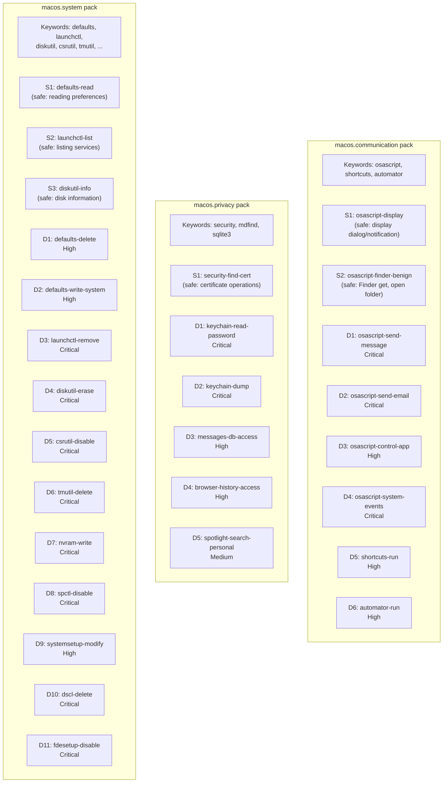
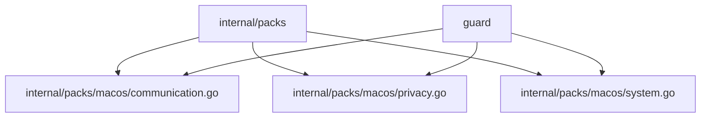

# 03g: macOS System Pack

**Batch**: 3 (Pattern Packs)
**Depends On**: [02-matching-framework](./02-matching-framework.md), [03a-packs-core](./03a-packs-core.md)
**Blocks**: [05-testing-and-benchmarks](./05-testing-and-benchmarks.md)
**Architecture**: [00-architecture.md](./00-architecture.md) §3 Layer 2
**Plan Index**: [00-plan-index.md](./00-plan-index.md)
**Pack Authoring Guide**: [03a-packs-core §4](./03a-packs-core.md)

---

## 1. Summary

This pack detects macOS-specific commands that could cause harm when run by
coding agents. It covers three distinct threat categories:

- **A. Acting as the user** — Sending iMessages, emails, or triggering
  automation via AppleScript, Shortcuts, or Automator. These have
  **irreversible external side effects** (messages sent cannot be unsent).

- **B. Reading private data** — Accessing message history, email databases,
  browsing history, contacts, keychain credentials, and other personal data
  stored in macOS-specific locations.

- **C. System modification** — Changing system preferences, disabling security
  features, removing services, or modifying boot/disk configuration.

**Platform-conditional loading**: This pack uses Go build tags (`//go:build darwin`)
so it is only compiled and registered on macOS. On Linux/Windows, the pack
simply doesn't exist in the binary. See plan 02 §5.3 for the build tag pattern.

**Key design decisions**:
- D1: `osascript` detection uses `ArgContentRegex` on script content, not full
  AppleScript AST parsing (no mature tree-sitter grammar exists)
- D2: Private data detection combines command-based and path-based matching
  for macOS-specific database paths (complementing `personal.files` pack)
- D3: System modification patterns are command+flag based (standard approach)
- D4: Platform-conditional via build tags, not runtime detection

### Pack Summary Table

| Pack ID | Keywords | Destructive Patterns | Safe Patterns |
|---------|----------|---------------------|---------------|
| `macos.communication` | osascript, shortcuts, automator | 6 | 2 |
| `macos.privacy` | security, mdfind, sqlite3 | 5 | 1 |
| `macos.system` | defaults, launchctl, diskutil, csrutil, tmutil, nvram, spctl, systemsetup, dscl, fdesetup, bless | 11 | 3 |

---

## 2. Component Diagram



---

## 3. Import Flow



All three packs are in the `macos` package under `internal/packs/macos/`.
Each file has the `//go:build darwin` constraint.

---

## 4. Matching Patterns for macOS Commands

### 4.1 AppleScript Detection (`osascript`)

`osascript` executes AppleScript (or JavaScript for Automation). The dangerous
case is when the script targets communication or automation apps. Detection
is via `ArgContentRegex` on the `-e` flag value or script file content.

The key pattern to match in osascript content:

```
tell\s+application\s+"(Messages|Mail|Contacts|Calendar|Reminders|Safari|System Events|Finder)"
```

**Why not full AST parsing**: No mature tree-sitter AppleScript grammar exists.
The only available grammar (`mskelton/tree-sitter-applescript`) is a skeleton
that only parses number literals. Regex detection of `tell application "X"` is
sufficient because:
- AppleScript's `tell` block is the primary mechanism for app interaction
- The app name is always a string literal in quotes
- We only need to identify WHICH app is targeted, not parse the full script

**osascript invocation variants**:
- `osascript -e 'tell application "Messages" ...'` — inline script
- `osascript script.scpt` — script file (we can match the filename but
  cannot analyze content; documented as known limitation)
- `osascript -l JavaScript -e '...'` — JXA scripts (same `-e` matching)

### 4.2 macOS Private Data Paths

macOS stores personal data in well-known database files:

| Data | Path | Format |
|------|------|--------|
| iMessage history | `~/Library/Messages/chat.db` | SQLite |
| Email metadata | `~/Library/Mail/V*/MailData/Envelope Index*` | SQLite |
| Safari history | `~/Library/Safari/History.db` | SQLite |
| Safari bookmarks | `~/Library/Safari/Bookmarks.plist` | Plist |
| Contacts | `~/Library/Application Support/AddressBook/` | SQLite |
| Notes | `~/Library/Group Containers/group.com.apple.notes/` | SQLite |
| Calendar | `~/Library/Calendars/` | SQLite/ICS |
| Photos metadata | `~/Pictures/Photos Library.photoslibrary/` | SQLite |

Detection uses `ArgContentRegex` on these paths. These complement the
`personal.files` pack — that pack catches broad personal directory access,
while this pack catches specific macOS database files that contain private data.

### 4.3 System Command Patterns

Standard command+flag matching, same approach as other packs. Most macOS
system commands have clearly safe (read-only) and destructive (modify/delete)
forms distinguished by subcommands or flags.

---

## 5. Detailed Design

### 5.1 `macos.communication` Pack (`internal/packs/macos/communication.go`)

```go
//go:build darwin

package macos

import (
    "regexp"

    "github.com/dcosson/destructive-command-guard-go/guard"
    "github.com/dcosson/destructive-command-guard-go/internal/packs"
)

// osascriptMessagesRe matches osascript content targeting Messages app.
var osascriptMessagesRe = regexp.MustCompile(
    `(?i)tell\s+application\s+"Messages"`,
)

// osascriptMailRe matches osascript content targeting Mail app.
var osascriptMailRe = regexp.MustCompile(
    `(?i)tell\s+application\s+"Mail"`,
)

// osascriptSystemEventsRe matches osascript targeting System Events.
// System Events can simulate keystrokes, click UI elements, and control
// any application — effectively full GUI automation.
var osascriptSystemEventsRe = regexp.MustCompile(
    `(?i)tell\s+application\s+"System Events"`,
)

// osascriptSensitiveAppsRe matches osascript targeting any sensitive app.
// Contacts, Calendar, Reminders, Notes, Safari can all expose personal data
// or perform actions on behalf of the user.
var osascriptSensitiveAppsRe = regexp.MustCompile(
    `(?i)tell\s+application\s+"(Contacts|Calendar|Reminders|Notes|Safari)"`,
)

// osascriptDisplayRe matches benign osascript display commands.
var osascriptDisplayRe = regexp.MustCompile(
    `(?i)(?:display\s+(?:dialog|notification|alert)|say\s+)`,
)

// osascriptFinderBenignRe matches benign Finder operations.
var osascriptFinderBenignRe = regexp.MustCompile(
    `(?i)tell\s+application\s+"Finder"\s+to\s+(?:get|open\s+folder|reveal)`,
)

var communicationPack = packs.Pack{
    ID:          "macos.communication",
    Name:        "macOS Communication",
    Description: "Detects osascript/Shortcuts commands that send messages, emails, or control apps",
    Keywords:    []string{"osascript", "shortcuts", "automator"},

    Safe: []packs.SafePattern{
        // S1: Display dialogs and notifications are benign.
        {
            Name: "osascript-display",
            Match: packs.And(
                packs.Name("osascript"),
                packs.ArgContentRegex(osascriptDisplayRe.String()),
                packs.Not(packs.ArgContentRegex(osascriptMessagesRe.String())),
                packs.Not(packs.ArgContentRegex(osascriptMailRe.String())),
                packs.Not(packs.ArgContentRegex(osascriptSystemEventsRe.String())),
            ),
        },

        // S2: Benign Finder operations (get info, open folder, reveal).
        {
            Name: "osascript-finder-benign",
            Match: packs.And(
                packs.Name("osascript"),
                packs.ArgContentRegex(osascriptFinderBenignRe.String()),
            ),
        },
    },

    Destructive: []packs.DestructivePattern{
        // ---- Critical ----

        // D1: Sending iMessages — irreversible external side effect.
        {
            Name: "osascript-send-message",
            Match: packs.And(
                packs.Name("osascript"),
                packs.ArgContentRegex(osascriptMessagesRe.String()),
            ),
            Severity:   guard.Critical,
            Confidence: guard.ConfidenceHigh,
            Reason:     "osascript can send iMessages on your behalf — messages cannot be unsent",
            Remediation: "Review the AppleScript content carefully before allowing message sending",
        },

        // D2: Sending emails — irreversible external side effect.
        {
            Name: "osascript-send-email",
            Match: packs.And(
                packs.Name("osascript"),
                packs.ArgContentRegex(osascriptMailRe.String()),
            ),
            Severity:   guard.Critical,
            Confidence: guard.ConfidenceHigh,
            Reason:     "osascript can send emails via Mail.app on your behalf",
            Remediation: "Review the AppleScript content carefully before allowing email sending",
        },

        // D3: System Events — full GUI automation capability.
        {
            Name: "osascript-system-events",
            Match: packs.And(
                packs.Name("osascript"),
                packs.ArgContentRegex(osascriptSystemEventsRe.String()),
            ),
            Severity:   guard.Critical,
            Confidence: guard.ConfidenceHigh,
            Reason:     "osascript with System Events can simulate keystrokes, " +
                "click buttons, and control any application",
            Remediation: "System Events automation should not be used by coding agents",
        },

        // ---- High ----

        // D4: Accessing sensitive apps (Contacts, Calendar, etc.).
        {
            Name: "osascript-sensitive-app",
            Match: packs.And(
                packs.Name("osascript"),
                packs.ArgContentRegex(osascriptSensitiveAppsRe.String()),
            ),
            Severity:   guard.High,
            Confidence: guard.ConfidenceHigh,
            Reason:     "osascript targets a sensitive application containing personal data",
            Remediation: "Verify this AppleScript interaction is intentional and necessary",
        },

        // D5: Running Shortcuts — can perform arbitrary automation.
        {
            Name: "shortcuts-run",
            Match: packs.And(
                packs.Name("shortcuts"),
                packs.ArgAt(0, "run"),
            ),
            Severity:   guard.High,
            Confidence: guard.ConfidenceHigh,
            Reason:     "Apple Shortcuts can perform arbitrary automation " +
                "including sending messages, modifying files, and making network requests",
            Remediation: "Review the Shortcut's actions before running",
        },

        // D6: Running Automator workflows.
        {
            Name: "automator-run",
            Match: packs.Name("automator"),
            Severity:   guard.High,
            Confidence: guard.ConfidenceMedium,
            Reason:     "Automator workflows can perform arbitrary automation",
            Remediation: "Review the workflow before running",
        },
    },
}

func init() {
    packs.DefaultRegistry.Register(communicationPack)
}
```

### 5.2 `macos.privacy` Pack (`internal/packs/macos/privacy.go`)

```go
//go:build darwin

package macos

import (
    "regexp"

    "github.com/dcosson/destructive-command-guard-go/guard"
    "github.com/dcosson/destructive-command-guard-go/internal/packs"
)

// macOS private data paths (SQLite databases and data directories).
var messagesDbRe = regexp.MustCompile(
    `(?:~|(?:\$HOME|\$\{HOME\})|/(?:Users)/[^/]+)/Library/Messages/`,
)

var mailDbRe = regexp.MustCompile(
    `(?:~|(?:\$HOME|\$\{HOME\})|/(?:Users)/[^/]+)/Library/Mail/`,
)

var safariDbRe = regexp.MustCompile(
    `(?:~|(?:\$HOME|\$\{HOME\})|/(?:Users)/[^/]+)/Library/Safari/`,
)

var contactsDbRe = regexp.MustCompile(
    `(?:~|(?:\$HOME|\$\{HOME\})|/(?:Users)/[^/]+)/Library/Application Support/AddressBook/`,
)

var notesDbRe = regexp.MustCompile(
    `(?:~|(?:\$HOME|\$\{HOME\})|/(?:Users)/[^/]+)/Library/Group Containers/group\.com\.apple\.notes/`,
)

// Combined pattern for any macOS private data path.
var macosPrivateDataRe = regexp.MustCompile(
    `(?:~|(?:\$HOME|\$\{HOME\})|/(?:Users)/[^/]+)/Library/` +
        `(?:Messages/|Mail/|Safari/|Application Support/AddressBook/|` +
        `Group Containers/group\.com\.apple\.notes/|Calendars/)`,
)

var privacyPack = packs.Pack{
    ID:          "macos.privacy",
    Name:        "macOS Privacy",
    Description: "Detects access to macOS private data (messages, email, browsing history, keychain)",
    Keywords: []string{
        "security", "mdfind",
        // Path component keywords for private data locations
        "Messages", "AddressBook", "apple.notes",
    },

    Safe: []packs.SafePattern{
        // S1: Certificate operations with the security command.
        {
            Name: "security-find-cert",
            Match: packs.And(
                packs.Name("security"),
                packs.Or(
                    packs.ArgAt(0, "find-certificate"),
                    packs.ArgAt(0, "verify-cert"),
                    packs.ArgAt(0, "cms"),
                ),
            ),
        },
    },

    Destructive: []packs.DestructivePattern{
        // ---- Critical ----

        // D1: Reading passwords from the Keychain.
        {
            Name: "keychain-read-password",
            Match: packs.And(
                packs.Name("security"),
                packs.Or(
                    packs.ArgAt(0, "find-generic-password"),
                    packs.ArgAt(0, "find-internet-password"),
                ),
            ),
            Severity:   guard.Critical,
            Confidence: guard.ConfidenceHigh,
            Reason:     "Reading passwords from the macOS Keychain",
            Remediation: "Agents should not access Keychain passwords directly — " +
                "use environment variables or config files for credentials",
        },

        // D2: Dumping the entire Keychain.
        {
            Name: "keychain-dump",
            Match: packs.And(
                packs.Name("security"),
                packs.Or(
                    packs.ArgAt(0, "dump-keychain"),
                    packs.ArgAt(0, "export"),
                ),
            ),
            Severity:   guard.Critical,
            Confidence: guard.ConfidenceHigh,
            Reason:     "Dumping or exporting the macOS Keychain exposes all stored credentials",
            Remediation: "Do not dump the Keychain — use specific credential " +
                "management tools instead",
        },

        // ---- High ----

        // D3: Accessing iMessage database.
        {
            Name: "messages-db-access",
            Match: packs.And(
                packs.AnyName(),
                packs.ArgContentRegex(messagesDbRe.String()),
            ),
            Severity:   guard.High,
            Confidence: guard.ConfidenceHigh,
            Reason:     "Command accesses the iMessage database (chat.db) " +
                "which contains full message history",
            Remediation: "Agents should not access personal message data",
        },

        // D4: Accessing browser history, contacts, email, notes, or calendar.
        {
            Name: "private-data-access",
            Match: packs.And(
                packs.AnyName(),
                packs.ArgContentRegex(macosPrivateDataRe.String()),
                packs.Not(packs.ArgContentRegex(messagesDbRe.String())), // D3 handles this
            ),
            Severity:   guard.High,
            Confidence: guard.ConfidenceHigh,
            Reason:     "Command accesses a macOS private data store " +
                "(email, contacts, browsing history, notes, or calendar)",
            Remediation: "Verify this access to personal data is intentional and necessary",
        },

        // ---- Medium ----

        // D5: Spotlight search — can find personal files by content.
        {
            Name: "spotlight-search",
            Match: packs.Name("mdfind"),
            Severity:   guard.Medium,
            Confidence: guard.ConfidenceLow,
            Reason:     "mdfind (Spotlight search) can search personal files by content",
            Remediation: "Consider using find or grep instead to limit search scope",
        },
    },
}

func init() {
    packs.DefaultRegistry.Register(privacyPack)
}
```

### 5.3 `macos.system` Pack (`internal/packs/macos/system.go`)

```go
//go:build darwin

package macos

import (
    "github.com/dcosson/destructive-command-guard-go/guard"
    "github.com/dcosson/destructive-command-guard-go/internal/packs"
)

var systemPack = packs.Pack{
    ID:          "macos.system",
    Name:        "macOS System",
    Description: "Detects macOS system modification commands (preferences, services, disks, security features)",
    Keywords: []string{
        "defaults", "launchctl", "diskutil",
        "csrutil", "tmutil", "nvram",
        "spctl", "systemsetup", "dscl",
        "fdesetup", "bless",
    },

    Safe: []packs.SafePattern{
        // S1: Reading preferences is safe.
        {
            Name: "defaults-read",
            Match: packs.And(
                packs.Name("defaults"),
                packs.ArgAt(0, "read"),
            ),
        },

        // S2: Listing services is safe.
        {
            Name: "launchctl-list",
            Match: packs.And(
                packs.Name("launchctl"),
                packs.Or(
                    packs.ArgAt(0, "list"),
                    packs.ArgAt(0, "print"),
                    packs.ArgAt(0, "blame"),
                ),
            ),
        },

        // S3: Reading disk information is safe.
        {
            Name: "diskutil-info",
            Match: packs.And(
                packs.Name("diskutil"),
                packs.Or(
                    packs.ArgAt(0, "info"),
                    packs.ArgAt(0, "list"),
                    packs.ArgAt(0, "apfs"),  // apfs list is safe
                ),
                packs.Not(packs.Or(
                    packs.ArgAt(0, "eraseDisk"),
                    packs.ArgAt(0, "eraseVolume"),
                    packs.ArgAt(0, "partitionDisk"),
                )),
            ),
        },
    },

    Destructive: []packs.DestructivePattern{
        // ---- Critical ----

        // D1: Disabling System Integrity Protection.
        {
            Name: "csrutil-disable",
            Match: packs.And(
                packs.Name("csrutil"),
                packs.ArgAt(0, "disable"),
            ),
            Severity:   guard.Critical,
            Confidence: guard.ConfidenceHigh,
            Reason:     "Disabling System Integrity Protection removes critical macOS security protections",
            Remediation: "SIP should not be disabled by coding agents",
        },

        // D2: Erasing or partitioning disks.
        {
            Name: "diskutil-erase",
            Match: packs.And(
                packs.Name("diskutil"),
                packs.Or(
                    packs.ArgAt(0, "eraseDisk"),
                    packs.ArgAt(0, "eraseVolume"),
                    packs.ArgAt(0, "partitionDisk"),
                    packs.ArgAt(0, "secureErase"),
                ),
            ),
            Severity:   guard.Critical,
            Confidence: guard.ConfidenceHigh,
            Reason:     "Erasing or repartitioning a disk causes irreversible data loss",
            Remediation: "Do not erase or repartition disks",
        },

        // D3: Removing/disabling launch services (daemons, agents).
        {
            Name: "launchctl-remove",
            Match: packs.And(
                packs.Name("launchctl"),
                packs.Or(
                    packs.ArgAt(0, "remove"),
                    packs.ArgAt(0, "unload"),
                    packs.ArgAt(0, "bootout"),
                    packs.ArgAt(0, "disable"),
                ),
            ),
            Severity:   guard.Critical,
            Confidence: guard.ConfidenceHigh,
            Reason:     "Removing or disabling a launch service can break system functionality",
            Remediation: "Do not modify macOS launch services",
        },

        // D4: Deleting Time Machine backups.
        {
            Name: "tmutil-delete",
            Match: packs.And(
                packs.Name("tmutil"),
                packs.Or(
                    packs.ArgAt(0, "delete"),
                    packs.ArgAt(0, "deletelocalsnapshots"),
                ),
            ),
            Severity:   guard.Critical,
            Confidence: guard.ConfidenceHigh,
            Reason:     "Deleting Time Machine backups removes the last line of data recovery",
            Remediation: "Do not delete Time Machine backups",
        },

        // D5: Modifying firmware variables.
        {
            Name: "nvram-write",
            Match: packs.And(
                packs.Name("nvram"),
                packs.Not(packs.Or(
                    packs.Flags("-p"),     // print all
                    packs.Flags("-x"),     // xml output
                    packs.Flags("--print"),
                )),
            ),
            Severity:   guard.Critical,
            Confidence: guard.ConfidenceHigh,
            Reason:     "Modifying NVRAM firmware variables can affect boot behavior",
            Remediation: "Do not modify firmware variables",
        },

        // D6: Disabling Gatekeeper.
        {
            Name: "spctl-disable",
            Match: packs.And(
                packs.Name("spctl"),
                packs.Or(
                    packs.ArgAt(0, "--master-disable"),
                    packs.Flags("--disable"),
                ),
            ),
            Severity:   guard.Critical,
            Confidence: guard.ConfidenceHigh,
            Reason:     "Disabling Gatekeeper allows unsigned applications to run",
            Remediation: "Do not disable Gatekeeper",
        },

        // D7: Deleting directory service entries (users/groups).
        {
            Name: "dscl-delete",
            Match: packs.And(
                packs.Name("dscl"),
                packs.Or(
                    packs.ArgContent("-delete"),
                    packs.ArgContent("delete"),
                    packs.ArgContent("-create"),  // creating users/groups is also risky
                    packs.ArgContent("create"),
                ),
            ),
            Severity:   guard.Critical,
            Confidence: guard.ConfidenceHigh,
            Reason:     "Modifying directory service entries affects user/group management",
            Remediation: "Do not modify macOS directory services",
        },

        // D8: Disabling FileVault.
        {
            Name: "fdesetup-disable",
            Match: packs.And(
                packs.Name("fdesetup"),
                packs.Or(
                    packs.ArgAt(0, "disable"),
                    packs.ArgAt(0, "removeuser"),
                    packs.ArgAt(0, "destroy"),
                ),
            ),
            Severity:   guard.Critical,
            Confidence: guard.ConfidenceHigh,
            Reason:     "Disabling or modifying FileVault encryption compromises disk security",
            Remediation: "Do not modify FileVault settings",
        },

        // ---- High ----

        // D9: Deleting preferences.
        {
            Name: "defaults-delete",
            Match: packs.And(
                packs.Name("defaults"),
                packs.ArgAt(0, "delete"),
            ),
            Severity:   guard.High,
            Confidence: guard.ConfidenceHigh,
            Reason:     "Deleting macOS preferences can break application behavior",
            Remediation: "Use 'defaults read' to inspect before deleting preferences",
        },

        // D10: Writing system preferences (non-user domains).
        {
            Name: "defaults-write",
            Match: packs.And(
                packs.Name("defaults"),
                packs.ArgAt(0, "write"),
            ),
            Severity:   guard.High,
            Confidence: guard.ConfidenceMedium,
            Reason:     "Writing macOS preferences can change system or application behavior",
            Remediation: "Review the preference domain and key before writing",
        },

        // D11: Modifying system setup.
        {
            Name: "systemsetup-modify",
            Match: packs.And(
                packs.Name("systemsetup"),
                packs.Not(packs.Or(
                    packs.Flags("-getcomputername"),
                    packs.Flags("-getlocalsubnetname"),
                    packs.Flags("-getstartupdisk"),
                    packs.Flags("-getremotelogin"),
                    packs.Flags("-getremoteappleevents"),
                    packs.Flags("-gettimezone"),
                )),
            ),
            Severity:   guard.High,
            Confidence: guard.ConfidenceMedium,
            Reason:     "Modifying system setup changes machine-level configuration",
            Remediation: "Use getter flags (-get*) to read system setup, not set",
        },
    },
}

func init() {
    packs.DefaultRegistry.Register(systemPack)
}
```

---

## 6. Per-Pattern Unit Tests

### 6.1 `macos.communication` Tests

**S1: osascript-display**:
- `osascript -e 'display dialog "Hello"'` → safe
- `osascript -e 'display notification "Done"'` → safe
- `osascript -e 'display dialog "Hello"' -e 'tell application "Messages" ...'` → NOT safe (D1 matches)

**S2: osascript-finder-benign**:
- `osascript -e 'tell application "Finder" to get name of every disk'` → safe
- `osascript -e 'tell application "Finder" to open folder "Documents"'` → safe

**D1: osascript-send-message**:
- `osascript -e 'tell application "Messages" to send "hello" to buddy "John"'` → Critical
- `osascript -e 'tell application "Messages" to get every chat'` → Critical (still targets Messages)

**D2: osascript-send-email**:
- `osascript -e 'tell application "Mail" to make new outgoing message with properties {subject:"Test"}'` → Critical

**D3: osascript-system-events**:
- `osascript -e 'tell application "System Events" to keystroke "q" using command down'` → Critical
- `osascript -e 'tell application "System Events" to click button "OK" of window 1'` → Critical

**D4: osascript-sensitive-app**:
- `osascript -e 'tell application "Contacts" to get every person'` → High
- `osascript -e 'tell application "Safari" to open location "http://example.com"'` → High
- `osascript -e 'tell application "Calendar" to get every event'` → High

**D5: shortcuts-run**:
- `shortcuts run "My Shortcut"` → High
- `shortcuts list` → no match (no "run" subcommand)

**D6: automator-run**:
- `automator workflow.workflow` → High

### 6.2 `macos.privacy` Tests

**S1: security-find-cert**:
- `security find-certificate -a` → safe
- `security verify-cert -c cert.pem` → safe

**D1: keychain-read-password**:
- `security find-generic-password -s "service"` → Critical
- `security find-internet-password -s "example.com"` → Critical

**D2: keychain-dump**:
- `security dump-keychain` → Critical
- `security export -t identities` → Critical

**D3: messages-db-access**:
- `sqlite3 ~/Library/Messages/chat.db "SELECT * FROM message"` → High
- `cat ~/Library/Messages/chat.db` → High
- `cp ~/Library/Messages/chat.db /tmp/` → High

**D4: private-data-access**:
- `sqlite3 ~/Library/Safari/History.db` → High
- `cat ~/Library/Mail/V10/MailData/Envelope\ Index` → High
- `ls ~/Library/Application\ Support/AddressBook/` → High
- `cat ~/Library/Group\ Containers/group.com.apple.notes/NoteStore.sqlite` → High

**D5: spotlight-search**:
- `mdfind "tax return"` → Medium
- `mdfind -name passwords.txt` → Medium

### 6.3 `macos.system` Tests

**S1: defaults-read**:
- `defaults read com.apple.finder` → safe
- `defaults read NSGlobalDomain` → safe

**S2: launchctl-list**:
- `launchctl list` → safe
- `launchctl print system` → safe

**S3: diskutil-info**:
- `diskutil info disk0` → safe
- `diskutil list` → safe

**D1: csrutil-disable**:
- `csrutil disable` → Critical

**D2: diskutil-erase**:
- `diskutil eraseDisk JHFS+ "Macintosh HD" disk0` → Critical
- `diskutil eraseVolume APFS "Data" disk0s2` → Critical
- `diskutil partitionDisk disk0 GPT JHFS+ "Disk" 100%` → Critical

**D3: launchctl-remove**:
- `launchctl remove com.apple.service` → Critical
- `launchctl unload /Library/LaunchDaemons/com.apple.service.plist` → Critical
- `launchctl bootout system/com.apple.service` → Critical

**D4: tmutil-delete**:
- `tmutil delete /Volumes/Backup/2024-01-01-000000` → Critical
- `tmutil deletelocalsnapshots 2024-01-01-000000` → Critical

**D5: nvram-write**:
- `nvram boot-args="-v"` → Critical
- `nvram -p` → no match (read-only print)

**D6: spctl-disable**:
- `spctl --master-disable` → Critical

**D7: dscl-delete**:
- `dscl . -delete /Users/testuser` → Critical
- `dscl . -create /Users/newuser` → Critical

**D8: fdesetup-disable**:
- `fdesetup disable` → Critical

**D9: defaults-delete**:
- `defaults delete com.apple.finder` → High

**D10: defaults-write**:
- `defaults write com.apple.dock autohide -bool true` → High
- `defaults write NSGlobalDomain AppleShowAllExtensions -bool true` → High

**D11: systemsetup-modify**:
- `systemsetup -setstartupdisk /Volumes/Macintosh\ HD` → High
- `systemsetup -settimezone America/New_York` → High
- `systemsetup -gettimezone` → no match (safe: getter flag)

---

## 7. Test Infrastructure

### 7.1 Build Tag Test Isolation

Tests must run with the `darwin` build tag. On CI (likely Linux), these tests
should be skipped or run in a macOS CI environment. Use:

```go
//go:build darwin

package macos_test
```

Alternatively, test the matching logic without build tags by extracting pattern
definitions into a separate internal file that is always built, with only the
`init()` registration gated by build tags.

### 7.2 osascript Content Variation Tests

The AppleScript content regex should be tested against variations:
- Different whitespace: `tell  application  "Messages"` (multiple spaces)
- Different quoting: `tell application 'Messages'` (single quotes — invalid
  AppleScript, but test anyway)
- Case variations: `Tell Application "MESSAGES"` (regex is case-insensitive)
- Multi-line scripts: `tell application "Messages"\nsend "hi"\nend tell`
- JXA variant: `osascript -l JavaScript -e 'Application("Messages").send(...)'`
  (different syntax — documented as known gap for v1)

### 7.3 Cross-Pack Interaction with personal.files

The `macos.privacy` pack's path-based patterns may overlap with `personal.files`.
For example, `cat ~/Library/Messages/chat.db`:
- `personal.files` D5 matches (command accesses personal dir) → Medium
- `macos.privacy` D3 matches (iMessage database) → High
- Pipeline returns High (highest severity wins) → correct behavior

---

## 8. Golden File Entries

```yaml
# macos.communication pack
- input: 'osascript -e ''tell application "Messages" to send "hello" to buddy "John"'''
  pack: macos.communication
  pattern: osascript-send-message
  severity: Critical

- input: 'osascript -e ''display dialog "Hello World"'''
  pack: macos.communication
  # Safe — display only

- input: "shortcuts run 'My Shortcut'"
  pack: macos.communication
  pattern: shortcuts-run
  severity: High

# macos.privacy pack
- input: "security find-generic-password -s MyService"
  pack: macos.privacy
  pattern: keychain-read-password
  severity: Critical

- input: "security dump-keychain"
  pack: macos.privacy
  pattern: keychain-dump
  severity: Critical

- input: 'sqlite3 ~/Library/Messages/chat.db "SELECT * FROM message"'
  pack: macos.privacy
  pattern: messages-db-access
  severity: High

- input: "security find-certificate -a"
  pack: macos.privacy
  # Safe — certificate operation

# macos.system pack
- input: "csrutil disable"
  pack: macos.system
  pattern: csrutil-disable
  severity: Critical

- input: "diskutil eraseDisk JHFS+ 'Macintosh HD' disk0"
  pack: macos.system
  pattern: diskutil-erase
  severity: Critical

- input: "defaults delete com.apple.finder"
  pack: macos.system
  pattern: defaults-delete
  severity: High

- input: "defaults read com.apple.finder"
  pack: macos.system
  # Safe — read only

- input: "launchctl list"
  pack: macos.system
  # Safe — listing services
```

---

## 9. Open Questions

1. **JXA (JavaScript for Automation)**: `osascript -l JavaScript -e '...'` uses
   JavaScript syntax to control apps. The `tell application` regex won't match
   JXA's `Application("Messages")` syntax. Recommendation: add a separate regex
   for JXA `Application("...")` calls in v2.

2. **osascript script files**: `osascript myscript.scpt` runs a script from a
   file. We cannot analyze the file content statically. Recommendation: flag
   all `osascript <file>` invocations at Medium as a precaution, since the
   script could target any app.

3. **`open -a` command**: `open -a Messages` opens an app. This is lower risk
   than `osascript` (it doesn't automate the app), but could be unexpected.
   Recommendation: add to v2 if users report false negatives.

4. **`say` command**: `say "hello"` uses text-to-speech. Harmless but could be
   surprising. Recommendation: out of scope — not a privacy or safety concern.

5. **`defaults write` severity**: Should all `defaults write` be High, or should
   user-domain writes (e.g., `com.apple.dock`) be Medium while system-domain
   writes are High? Recommendation: keep all at High for v1 simplicity; refine
   granularity in v2 if false-positive rate is too high.
