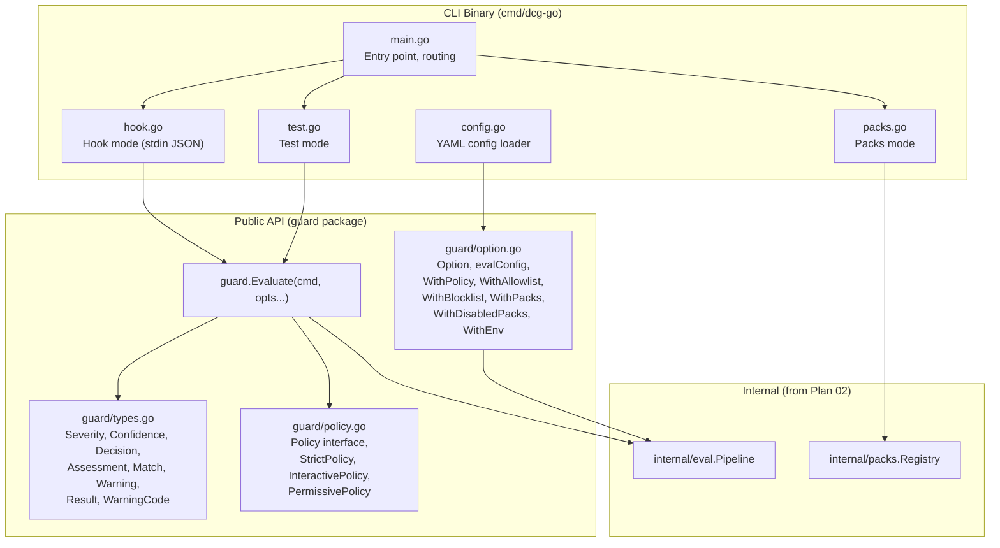
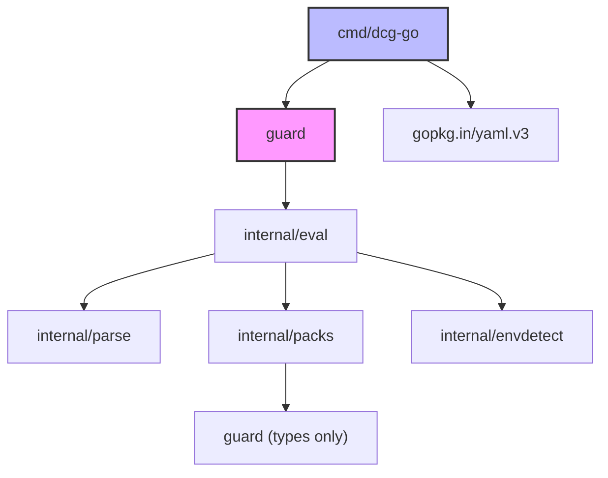

# 04: Public API & CLI

**Batch**: 4 (Public API & CLI)
**Depends On**: [02-matching-framework](./02-matching-framework.md), [03a-packs-core](./03a-packs-core.md)
**Blocks**: [05-testing-and-benchmarks](./05-testing-and-benchmarks.md)
**Architecture**: [00-architecture.md](./00-architecture.md) (§3 Layer 1, §3 Layer 5)
**Plan Index**: [00-plan-index.md](./00-plan-index.md)
**Shaping**: [Frame doc](../shaping/frame.md) — "should also export some public
functions... the main way I plan to use this is within the H2 Hook"

---

## 1. Summary

This plan defines the public API (`guard` package) and CLI binary
(`cmd/dcg-go`) that wrap the internal evaluation pipeline (plan 02) into
user-facing interfaces. The guard package is the primary integration
surface — callers import it into their own Go programs. The CLI binary is
a thin wrapper providing three modes: hook mode for Claude Code
integration, test mode for ad-hoc evaluation, and packs mode for
discoverability.

**Key design principle**: The guard package and CLI are **thin layers**.
All evaluation logic lives in `internal/eval` (plan 02). This plan
defines how that logic is exposed, configured, and invoked — not how it
works internally.

**Components**:

1. **`guard` package** — Public API surface. `Evaluate()` function,
   `Result`/`Match`/`Warning` types, `Option` functions, `Policy`
   interface with 3 built-in policies. Stateless, no I/O, safe for
   concurrent use.
2. **CLI binary (`cmd/dcg-go`)** — Three modes:
   - Hook mode (default): Read Claude Code JSON from stdin, evaluate,
     output JSON result
   - Test mode (`dcg-go test "cmd"`): Ad-hoc evaluation with human-readable
     output. `--explain` for detailed reasoning, `--json` for machine output
   - Packs mode (`dcg-go packs`): List registered packs with descriptions
3. **Config file** — Optional YAML config for the standalone binary:
   policy, allowlists, blocklists, pack selection
4. **Integration tests** — Full pipeline tests exercising `guard.Evaluate()`
   with real commands, using the golden file infrastructure from plan 02

**Scope**:
- 2 packages: `guard` (public API), `cmd/dcg-go` (CLI)
- ~8 source files across both packages
- ~15 integration test cases (per-pack coverage varies based on registered
  packs)
- Config file parser with validation
- Claude Code hook protocol implementation (JSON input/output)

---

## 2. Component Diagram



---

## 3. Import Flow



**Critical constraint**: `guard/types.go` is a leaf dependency with NO
internal imports. This breaks the potential circular import:
`guard` → `internal/eval` → `internal/packs` → `guard` (for Severity,
Confidence types). The types package is imported by both `guard` and
`internal/packs` without creating a cycle because it has no imports itself.

**Import rules**:
- `guard` imports `internal/eval` (pipeline), `internal/packs` (registry
  for pack listing)
- `cmd/dcg-go` imports `guard` (public API only — never internal packages)
- `cmd/dcg-go` imports `gopkg.in/yaml.v3` for config parsing
- `guard/types.go` imports nothing

---

## 4. `guard` Package: Public API

### 4.1 `guard/types.go` — Type Definitions

This file defines all public types. It has **no imports** (leaf dependency).

```go
package guard

// Severity levels for destructive command assessments.
//
// NOTE: Indeterminate has iota value 0. This means Indeterminate < Low.
// Custom Policy implementations must handle Indeterminate explicitly —
// a simple "sev >= Medium" check will NOT catch Indeterminate commands.
// All built-in policies handle this correctly.
type Severity int

const (
    Indeterminate Severity = iota // Could not analyze (parse failure, input too large)
    Low                           // Minor risk, recoverable
    Medium                        // Moderate risk
    High                          // Significant risk, hard to reverse
    Critical                      // Maximum risk, irreversible
)

// String returns the human-readable name. Returns "Unknown" for
// out-of-range values (defensive — should not occur in practice).
func (s Severity) String() string {
    switch s {
    case Indeterminate:
        return "Indeterminate"
    case Low:
        return "Low"
    case Medium:
        return "Medium"
    case High:
        return "High"
    case Critical:
        return "Critical"
    default:
        return "Unknown"
    }
}

// Confidence in the pattern match accuracy.
type Confidence int

const (
    ConfidenceLow    Confidence = iota
    ConfidenceMedium
    ConfidenceHigh
)

// String returns the human-readable name. Returns "Unknown" for
// out-of-range values.
func (c Confidence) String() string {
    switch c {
    case ConfidenceLow:
        return "Low"
    case ConfidenceMedium:
        return "Medium"
    case ConfidenceHigh:
        return "High"
    default:
        return "Unknown"
    }
}

// Decision is the outcome of evaluating a command against a policy.
type Decision int

const (
    Allow Decision = iota
    Deny
    Ask
)

// String returns the human-readable name. Returns "Unknown" for
// out-of-range values.
func (d Decision) String() string {
    switch d {
    case Allow:
        return "Allow"
    case Deny:
        return "Deny"
    case Ask:
        return "Ask"
    default:
        return "Unknown"
    }
}

// Assessment is the raw severity + confidence result from pattern matching.
// The policy layer converts this to a Decision.
type Assessment struct {
    Severity   Severity
    Confidence Confidence
}

// Match represents a single pattern match against a command.
type Match struct {
    Pack         string     // Pack ID, e.g. "core.git"
    Rule         string     // Pattern name, e.g. "git-push-force"
    Severity     Severity
    Confidence   Confidence
    Reason       string     // Why this is dangerous
    Remediation  string     // Suggested safe alternative
    EnvEscalated bool       // Was severity escalated due to production env?
}

// Warning indicates a non-fatal condition during evaluation.
type Warning struct {
    Code    WarningCode
    Message string
}

// WarningCode identifies the type of warning.
type WarningCode int

const (
    WarnPartialParse        WarningCode = iota // AST contained ERROR nodes
    WarnInlineDepthExceeded                    // Inline script recursion hit max depth
    WarnInputTruncated                         // Input exceeded max length
    WarnExpansionCapped                        // Variable expansion capped
    WarnExtractorPanic                         // Command extractor panicked (recovered)
    WarnCommandSubstitution                    // Command substitution detected
    WarnMatcherPanic                           // A CommandMatcher panicked (recovered)
    WarnUnknownPackID                          // Pack ID in config not found in registry
)

// String returns the human-readable name. Returns "Unknown" for
// out-of-range values.
func (w WarningCode) String() string {
    switch w {
    case WarnPartialParse:
        return "PartialParse"
    case WarnInlineDepthExceeded:
        return "InlineDepthExceeded"
    case WarnInputTruncated:
        return "InputTruncated"
    case WarnExpansionCapped:
        return "ExpansionCapped"
    case WarnExtractorPanic:
        return "ExtractorPanic"
    case WarnCommandSubstitution:
        return "CommandSubstitution"
    case WarnMatcherPanic:
        return "MatcherPanic"
    case WarnUnknownPackID:
        return "UnknownPackID"
    default:
        return "Unknown"
    }
}

// Result contains the full evaluation outcome.
// The zero value is a valid "nothing found, allow" result.
type Result struct {
    Decision   Decision    // Allow, Deny, or Ask
    Assessment *Assessment // Raw severity + confidence (nil if no match)
    Matches    []Match     // All pattern matches found
    Warnings   []Warning   // Informational warnings
    Command    string      // The original command string
}
```

### 4.2 `guard/policy.go` — Policy Interface and Built-in Policies

```go
package guard

// Policy converts an Assessment into a Decision.
// Implementations must be safe for concurrent use.
//
// NOTE: Indeterminate severity has iota value 0. Implementations must
// handle it explicitly — a simple "sev >= Medium" check will NOT catch
// Indeterminate. See the Severity type documentation for details.
type Policy interface {
    Decide(Assessment) Decision
}

// StrictPolicy denies Medium+ severity and Indeterminate.
// Suitable for fully autonomous agents where no human is available to
// confirm uncertain commands.
//
// Decision matrix:
//   Critical     → Deny
//   High         → Deny
//   Medium       → Deny
//   Low          → Allow
//   Indeterminate → Deny
func StrictPolicy() Policy { return strictPolicy{} }

type strictPolicy struct{}

func (strictPolicy) Decide(a Assessment) Decision {
    if a.Severity >= Medium || a.Severity == Indeterminate {
        return Deny
    }
    return Allow
}

// InteractivePolicy asks on Medium severity and Indeterminate,
// denies on High+. Suitable for interactive agents where a human
// can approve uncertain commands.
//
// Decision matrix:
//   Critical     → Deny
//   High         → Deny
//   Medium       → Ask
//   Low          → Allow
//   Indeterminate → Ask
func InteractivePolicy() Policy { return interactivePolicy{} }

type interactivePolicy struct{}

func (interactivePolicy) Decide(a Assessment) Decision {
    switch {
    case a.Severity >= High:
        return Deny
    case a.Severity == Medium || a.Severity == Indeterminate:
        return Ask
    default:
        return Allow
    }
}

// PermissivePolicy only denies Critical severity. Asks on High.
// Allows Medium, Low, and Indeterminate. Suitable for experienced
// users who want minimal interruption.
//
// Decision matrix:
//   Critical     → Deny
//   High         → Ask
//   Medium       → Allow
//   Low          → Allow
//   Indeterminate → Allow
func PermissivePolicy() Policy { return permissivePolicy{} }

type permissivePolicy struct{}

func (permissivePolicy) Decide(a Assessment) Decision {
    switch {
    case a.Severity == Critical:
        return Deny
    case a.Severity == High:
        return Ask
    default:
        return Allow
    }
}
```

### 4.3 `guard/option.go` — Configuration Options

```go
package guard

// Option configures evaluation behavior. Options are applied in order.
type Option func(*evalConfig)

// evalConfig holds per-evaluation configuration.
// Zero value produces sensible defaults (InteractivePolicy, all packs,
// no allowlist/blocklist, no caller env).
type evalConfig struct {
    policy        Policy
    allowlist     []string // Glob patterns for allow
    blocklist     []string // Glob patterns for block
    enabledPacks  []string // nil = all packs; non-nil = only these
    disabledPacks []string // Packs to exclude
    callerEnv     []string // Process env in os.Environ() format
}

// defaultConfig returns the default evaluation configuration.
func defaultConfig() evalConfig {
    return evalConfig{
        policy: InteractivePolicy(),
    }
}

// WithPolicy sets the decision policy for this evaluation.
// Default: InteractivePolicy().
func WithPolicy(p Policy) Option {
    return func(c *evalConfig) {
        c.policy = p
    }
}

// WithAllowlist adds glob patterns that allow commands without further
// analysis. Patterns are matched against the full raw command string.
//
// Glob semantics: '*' matches any character EXCEPT command separators
// (;, |, &, &&, ||). This means "git *" matches "git push --force" but
// NOT "git push; rm -rf /". This prevents a single allowlist pattern
// from inadvertently allowing a compound command where only the first
// part matches.
//
// Blocklist takes precedence over allowlist.
func WithAllowlist(patterns ...string) Option {
    return func(c *evalConfig) {
        c.allowlist = append(c.allowlist, patterns...)
    }
}

// WithBlocklist adds glob patterns that deny commands immediately.
// Patterns are matched against the full raw command string.
//
// Glob semantics: '*' matches any character EXCEPT command separators
// (;, |, &, &&, ||). See WithAllowlist for details.
//
// Blocklist is checked before allowlist and takes precedence.
func WithBlocklist(patterns ...string) Option {
    return func(c *evalConfig) {
        c.blocklist = append(c.blocklist, patterns...)
    }
}

// WithPacks restricts evaluation to only the named packs.
// Pack IDs not found in the registry produce WarnUnknownPackID warnings.
//
// IMPORTANT: Passing an empty list (WithPacks() with no args) means
// NO packs are evaluated — all commands are allowed. This differs from
// not calling WithPacks at all (nil = all packs). The distinction:
//   - nil (not called):      all packs evaluated
//   - []string{} (no args):  no packs evaluated, everything allows
//   - []string{"a", "b"}:    only packs "a" and "b" evaluated
func WithPacks(packs ...string) Option {
    return func(c *evalConfig) {
        c.enabledPacks = packs
    }
}

// WithDisabledPacks excludes specific packs from evaluation.
// If both WithPacks and WithDisabledPacks are used, disabled packs
// are removed from the enabled set.
func WithDisabledPacks(packs ...string) Option {
    return func(c *evalConfig) {
        c.disabledPacks = append(c.disabledPacks, packs...)
    }
}

// WithEnv provides process environment variables for production
// environment detection. Format: "KEY=VALUE" (same as os.Environ()).
// When not set, env-sensitive patterns use only inline env vars
// from the command itself.
func WithEnv(env []string) Option {
    return func(c *evalConfig) {
        c.callerEnv = env
    }
}
```

### 4.4 `guard/guard.go` — Evaluate Function

```go
package guard

import (
    "sync"

    "github.com/dcosson/destructive-command-guard-go/internal/eval"
    "github.com/dcosson/destructive-command-guard-go/internal/packs"
)

// pipeline is the shared evaluation pipeline instance.
// Initialized once on first use via sync.Once.
var (
    pipeline     *eval.Pipeline
    pipelineOnce sync.Once
)

func getPipeline() *eval.Pipeline {
    pipelineOnce.Do(func() {
        pipeline = eval.NewPipeline(packs.DefaultRegistry)
    })
    return pipeline
}

// Evaluate analyzes a shell command string for destructive patterns.
//
// Stateless: does not modify any global state.
// Thread-safe: safe for concurrent use from multiple goroutines.
// No I/O: does not read from disk, network, or environment (unless
// WithEnv is used, which passes env vars as data, not reads them).
//
// The zero-value Result (Decision: Allow, Assessment: nil) is returned
// for empty or unmatched commands.
//
// Example:
//
//     result := guard.Evaluate("git push --force",
//         guard.WithPolicy(guard.InteractivePolicy()))
//     if result.Decision == guard.Deny {
//         fmt.Println("Blocked:", result.Matches[0].Reason)
//     }
func Evaluate(command string, opts ...Option) Result {
    cfg := defaultConfig()
    for _, opt := range opts {
        if opt != nil {
            opt(&cfg)
        }
    }
    // Guard against nil policy (e.g., WithPolicy(nil))
    if cfg.policy == nil {
        cfg.policy = InteractivePolicy()
    }
    return getPipeline().Run(command, cfg.toInternal())
}

// Packs returns metadata about all registered pattern packs.
// Useful for discoverability (e.g., dcg-go packs command).
func Packs() []PackInfo {
    allPacks := packs.DefaultRegistry.All()
    infos := make([]PackInfo, len(allPacks))
    for i, p := range allPacks {
        infos[i] = PackInfo{
            ID:              p.ID,
            Name:            p.Name,
            Description:     p.Description,
            Keywords:        p.Keywords,
            SafeCount:       len(p.Safe),
            DestrCount:      len(p.Destructive),
            HasEnvSensitive: p.HasEnvSensitive,
        }
    }
    return infos
}

// PackInfo contains metadata about a registered pack.
type PackInfo struct {
    ID              string
    Name            string
    Description     string
    Keywords        []string
    SafeCount       int
    DestrCount      int
    HasEnvSensitive bool // Pack has patterns that respond to env vars
}
```

### 4.5 Design Notes

**Note 1**: `evalConfig.toInternal()` converts the public evalConfig into
the internal `eval.Config` struct. This conversion boundary exists so the
internal config can evolve independently of the public Option API. The
conversion is straightforward field mapping — no logic beyond copying.

**Note 2**: The `getPipeline()` lazy initialization via `sync.Once` ensures
the pipeline (including the Aho-Corasick automaton and parser pool) is
only constructed when first needed. This is important because importing
the `guard` package in tests that don't call `Evaluate()` should not
trigger expensive initialization.

**Note 3**: `Packs()` exposes read-only metadata. It does NOT return pack
pattern details (matchers, severities) — that level of detail is internal.
The CLI packs mode uses this function.

**Note 4**: The `guard` package does NOT import `os` or read environment
variables directly. Callers must explicitly pass env vars via `WithEnv()`.
This keeps the library stateless and testable — tests can provide
controlled env vars without polluting the process environment.

**Note 5**: The default policy is `InteractivePolicy()`. This is the most
common use case (Claude Code integration). Callers who want stricter
behavior opt in via `WithPolicy(StrictPolicy())`.

**Note 6**: `Evaluate()` returns `Result` by value, not `*Result`. This
follows the architecture decision SE-P1.1 from the architecture review.
The zero value `Result{}` is a valid "nothing found, allow" result.

---

## 5. CLI Binary: `cmd/dcg-go`

### 5.1 `main.go` — Entry Point and Subcommand Routing

```go
package main

import (
    "fmt"
    "os"
)

const usage = `dcg-go — Destructive Command Guard

Usage:
    dcg-go              Hook mode: read JSON from stdin, evaluate, write JSON
    dcg-go test "cmd"   Evaluate a command and print the result
    dcg-go packs        List available pattern packs
    dcg-go version      Print version information
    dcg-go help         Print this help message

Hook Mode:
    Reads a Claude Code PreToolUse hook event from stdin (JSON),
    evaluates the command, and writes the result to stdout (JSON).
    Always exits 0 on success (decision is in the JSON output).

Test Mode:
    dcg-go test "git push --force"
    dcg-go test --explain "git push --force"
    dcg-go test --json "git push --force"
    dcg-go test --policy strict "RAILS_ENV=production rails db:drop"
    dcg-go test --env "rails db:reset"

    Exit codes: 0=Allow, 1=Error, 2=Deny, 3=Ask

Packs Mode:
    dcg-go packs
    dcg-go packs --json

Config:
    dcg-go looks for config at ~/.config/dcg-go/config.yaml
    Override with DCG_CONFIG environment variable.
`

func main() {
    if len(os.Args) < 2 {
        // No subcommand: hook mode
        if err := runHookMode(); err != nil {
            fmt.Fprintf(os.Stderr, "error: %v\n", err)
            os.Exit(1)
        }
        return
    }

    switch os.Args[1] {
    case "test":
        if err := runTestMode(os.Args[2:]); err != nil {
            fmt.Fprintf(os.Stderr, "error: %v\n", err)
            os.Exit(1)
        }
    case "packs":
        if err := runPacksMode(os.Args[2:]); err != nil {
            fmt.Fprintf(os.Stderr, "error: %v\n", err)
            os.Exit(1)
        }
    case "version":
        fmt.Printf("dcg-go %s\n", Version)
    case "help", "--help", "-h":
        fmt.Print(usage)
    default:
        fmt.Fprintf(os.Stderr, "unknown command: %s\n", os.Args[1])
        fmt.Print(usage)
        os.Exit(1)
    }
}

// Version is set at build time via -ldflags.
var Version = "dev"
```

### 5.2 `hook.go` — Hook Mode (Claude Code Protocol)

Hook mode implements the Claude Code `PreToolUse` hook protocol.

**Input format** (JSON from stdin):

```json
{
    "session_id": "abc123",
    "transcript_path": "/path/to/transcript",
    "cwd": "/home/user/project",
    "hook_event_name": "PreToolUse",
    "tool_name": "Bash",
    "tool_input": {
        "command": "git push --force origin main",
        "description": "Push changes to remote",
        "timeout": 120000
    }
}
```

**Output format** (JSON to stdout):

```json
{
    "hookSpecificOutput": {
        "hookEventName": "PreToolUse",
        "permissionDecision": "deny",
        "permissionDecisionReason": "git push --force overwrites remote history"
    }
}
```

**Implementation**:

```go
package main

import (
    "encoding/json"
    "fmt"
    "io"
    "os"

    "github.com/dcosson/destructive-command-guard-go/guard"
)

// HookInput is the Claude Code PreToolUse hook event.
type HookInput struct {
    SessionID     string      `json:"session_id"`
    TranscriptPath string    `json:"transcript_path"`
    Cwd           string      `json:"cwd"`
    HookEventName string      `json:"hook_event_name"`
    ToolName      string      `json:"tool_name"`
    ToolInput     ToolInput   `json:"tool_input"`
}

// ToolInput contains the tool-specific input fields.
type ToolInput struct {
    Command     string `json:"command"`
    Description string `json:"description,omitempty"`
    Timeout     int    `json:"timeout,omitempty"`
}

// HookOutput is the response written to stdout.
type HookOutput struct {
    HookSpecificOutput HookSpecificOutput `json:"hookSpecificOutput"`
}

// HookSpecificOutput contains the evaluation result for Claude Code.
type HookSpecificOutput struct {
    HookEventName          string `json:"hookEventName"`
    PermissionDecision     string `json:"permissionDecision"`
    PermissionDecisionReason string `json:"permissionDecisionReason,omitempty"`
}

// maxHookInputSize is the upper bound for stdin reads in hook mode.
// Claude Code hook events are typically <1KB. 1MB provides ample
// headroom while preventing OOM from adversarial or misconfigured input.
const maxHookInputSize = 1 << 20 // 1MB

func runHookMode() error {
    // Read JSON from stdin with bounded read to prevent OOM
    input, err := io.ReadAll(io.LimitReader(os.Stdin, maxHookInputSize))
    if err != nil {
        return fmt.Errorf("reading stdin: %w", err)
    }

    var hookInput HookInput
    if err := json.Unmarshal(input, &hookInput); err != nil {
        return fmt.Errorf("parsing hook input: %w", err)
    }

    // Validate hook event type — only PreToolUse is supported.
    // For unknown events, output allow JSON (don't hang or produce
    // nonsensical output) and warn on stderr.
    if hookInput.HookEventName != "" && hookInput.HookEventName != "PreToolUse" {
        fmt.Fprintf(os.Stderr, "warning: unsupported hook event: %s\n",
            hookInput.HookEventName)
        return writeHookOutput("allow", "")
    }

    // Only evaluate Bash tool commands
    if hookInput.ToolName != "Bash" {
        return writeHookOutput("allow", "")
    }

    command := hookInput.ToolInput.Command
    if command == "" {
        return writeHookOutput("allow", "")
    }

    // Load config and build options
    cfg := loadConfig()
    opts := cfg.toOptions()

    // Always pass process env for env detection in hook mode
    opts = append(opts, guard.WithEnv(os.Environ()))

    // Evaluate
    result := guard.Evaluate(command, opts...)

    // Map Decision to hook protocol
    decision := decisionToHookDecision(result.Decision)
    reason := buildReason(result)

    return writeHookOutput(decision, reason)
}

func decisionToHookDecision(d guard.Decision) string {
    switch d {
    case guard.Deny:
        return "deny"
    case guard.Ask:
        return "ask"
    default:
        return "allow"
    }
}

func buildReason(result guard.Result) string {
    if len(result.Matches) == 0 {
        return ""
    }
    // Find the highest severity match. Matches are in insertion order
    // (pack iteration × command extraction order), NOT severity order.
    // We scan defensively to always show the reason for the match that
    // drove the decision.
    best := result.Matches[0]
    for _, m := range result.Matches[1:] {
        if m.Severity > best.Severity {
            best = m
        }
    }
    reason := best.Reason
    if best.Remediation != "" {
        reason += ". Suggestion: " + best.Remediation
    }
    if best.EnvEscalated {
        reason += " [severity escalated: production environment detected]"
    }
    if extra := len(result.Matches) - 1; extra > 0 {
        reason += fmt.Sprintf(" (+%d more match", extra)
        if extra > 1 {
            reason += "es"
        }
        reason += ")"
    }
    return reason
}

func writeHookOutput(decision, reason string) error {
    output := HookOutput{
        HookSpecificOutput: HookSpecificOutput{
            HookEventName:          "PreToolUse",
            PermissionDecision:     decision,
            PermissionDecisionReason: reason,
        },
    }

    enc := json.NewEncoder(os.Stdout)
    return enc.Encode(output)
}
```

### 5.2.1 Hook Mode Design Notes

**Note 1**: Only `Bash` tool invocations are evaluated. Other tools
(Read, Write, Edit, Glob, Grep, etc.) are allowed unconditionally. This
matches the upstream Rust behavior — the guard only analyzes shell
commands.

**Note 2**: The hook binary always passes `os.Environ()` via `WithEnv()`.
This enables environment detection for commands like
`rails db:reset` when `RAILS_ENV=production` is set in the process
environment (not just inline in the command). This is essential for the
hook use case where the Claude Code session inherits the user's shell
environment.

**Note 3**: The `buildReason` function constructs a human-readable reason
string from the highest severity match (not necessarily `Matches[0]`,
which is in insertion order). This is displayed to the user by Claude
Code when a command is denied or flagged for asking. The reason includes
the remediation suggestion, env escalation notice, and a count of
additional matches when applicable (e.g., "+2 more matches"). Test mode
with `--explain` shows all matches in detail.

**Note 4**: `writeHookOutput` uses `json.NewEncoder` which writes a
trailing newline after the JSON. This is compatible with Claude Code's
hook protocol which reads until EOF.

**Note 5**: If stdin JSON parsing fails (e.g., malformed input from a
non-Claude Code caller), the binary exits with error code 1 and writes
the error to stderr. Claude Code treats hook process exit(1) as a hook
error. To ensure fail-closed behavior (hook failure does NOT silently
allow commands), the binary should output a deny JSON response before
exiting when the failure mode is ambiguous. For parse failures, exit(1)
without JSON is acceptable since the input was unparseable.

**Note 6**: The hook mode maps `Ask` to the `"ask"` hook decision. When
Claude Code receives `"ask"`, it prompts the user to confirm the command.
This is the appropriate behavior for Medium-severity patterns under
InteractivePolicy.

**Note 7**: The hook validates `hook_event_name`. If the field is present
and not `"PreToolUse"`, the hook outputs an allow JSON response and warns
on stderr. This prevents the hook from producing nonsensical permission
decisions for events it doesn't understand (e.g., if misconfigured for
`PostToolUse`). An allow JSON response is always written so Claude Code
doesn't hang waiting for stdout.

### 5.3 `test.go` — Test Mode

Test mode provides a human-readable interface for ad-hoc command
evaluation. Primarily used during development and debugging.

```go
package main

import (
    "encoding/json"
    "flag"
    "fmt"
    "os"

    "github.com/dcosson/destructive-command-guard-go/guard"
)

// Test mode exit codes:
//   0 = Allow
//   1 = Error (parse failure, bad flags)
//   2 = Deny
//   3 = Ask
// These enable scripting: `if dcg-go test "cmd"; then deploy; fi`

func runTestMode(args []string) error {
    fs := flag.NewFlagSet("test", flag.ContinueOnError)
    explain := fs.Bool("explain", false, "Show detailed reasoning")
    jsonOut := fs.Bool("json", false, "Output as JSON")
    policyName := fs.String("policy", "", "Policy: strict, interactive, permissive")
    envFlag := fs.Bool("env", false,
        "Include process environment in detection. "+
            "Note: without --env, only inline env vars (e.g., "+
            "RAILS_ENV=production cmd) are detected. Process env "+
            "vars set in the shell are ignored unless --env is used.")

    if err := fs.Parse(args); err != nil {
        return err
    }

    if fs.NArg() != 1 {
        return fmt.Errorf("usage: dcg-go test [--explain] [--json] [--policy NAME] \"command\"")
    }
    command := fs.Arg(0)

    // Build options
    cfg := loadConfig()
    opts := cfg.toOptions()

    // Override policy if specified on command line
    if *policyName != "" {
        p, err := parsePolicy(*policyName)
        if err != nil {
            return err
        }
        opts = append(opts, guard.WithPolicy(p))
    }

    // Include process env if requested
    if *envFlag {
        opts = append(opts, guard.WithEnv(os.Environ()))
    }

    result := guard.Evaluate(command, opts...)

    if *jsonOut {
        if err := printTestJSON(result); err != nil {
            return err
        }
    } else {
        if err := printTestHuman(result, *explain); err != nil {
            return err
        }
    }

    // Exit with decision-specific exit codes for scripting
    switch result.Decision {
    case guard.Deny:
        os.Exit(2)
    case guard.Ask:
        os.Exit(3)
    }
    return nil // Allow → exit 0
}

func parsePolicy(name string) (guard.Policy, error) {
    switch name {
    case "strict":
        return guard.StrictPolicy(), nil
    case "interactive":
        return guard.InteractivePolicy(), nil
    case "permissive":
        return guard.PermissivePolicy(), nil
    default:
        return nil, fmt.Errorf("unknown policy: %s (valid: strict, interactive, permissive)", name)
    }
}

func printTestHuman(result guard.Result, explain bool) error {
    fmt.Printf("Command:  %s\n", result.Command)
    fmt.Printf("Decision: %s\n", result.Decision)

    if result.Assessment != nil {
        fmt.Printf("Severity: %s\n", result.Assessment.Severity)
        fmt.Printf("Confidence: %s\n", result.Assessment.Confidence)
    }

    if len(result.Matches) > 0 {
        fmt.Printf("\nMatches (%d):\n", len(result.Matches))
        for i, m := range result.Matches {
            fmt.Printf("  %d. [%s] %s (%s/%s)\n",
                i+1, m.Pack, m.Rule, m.Severity, m.Confidence)
            if explain {
                fmt.Printf("     Reason: %s\n", m.Reason)
                if m.Remediation != "" {
                    fmt.Printf("     Suggestion: %s\n", m.Remediation)
                }
                if m.EnvEscalated {
                    fmt.Printf("     Note: severity escalated (production env detected)\n")
                }
            }
        }
    }

    if len(result.Warnings) > 0 {
        fmt.Printf("\nWarnings (%d):\n", len(result.Warnings))
        for _, w := range result.Warnings {
            fmt.Printf("  - [%s] %s\n", w.Code, w.Message)
        }
    }

    return nil
}

// TestResult is the JSON output for test mode.
type TestResult struct {
    Command    string              `json:"command"`
    Decision   string              `json:"decision"`
    Severity   string              `json:"severity,omitempty"`
    Confidence string              `json:"confidence,omitempty"`
    Matches    []TestMatchResult   `json:"matches,omitempty"`
    Warnings   []TestWarningResult `json:"warnings,omitempty"`
}

type TestMatchResult struct {
    Pack         string `json:"pack"`
    Rule         string `json:"rule"`
    Severity     string `json:"severity"`
    Confidence   string `json:"confidence"`
    Reason       string `json:"reason"`
    Remediation  string `json:"remediation,omitempty"`
    EnvEscalated bool   `json:"env_escalated"`
}

type TestWarningResult struct {
    Code    string `json:"code"`
    Message string `json:"message"`
}

func printTestJSON(result guard.Result) error {
    tr := TestResult{
        Command:  result.Command,
        Decision: result.Decision.String(),
    }
    if result.Assessment != nil {
        tr.Severity = result.Assessment.Severity.String()
        tr.Confidence = result.Assessment.Confidence.String()
    }
    for _, m := range result.Matches {
        tr.Matches = append(tr.Matches, TestMatchResult{
            Pack:         m.Pack,
            Rule:         m.Rule,
            Severity:     m.Severity.String(),
            Confidence:   m.Confidence.String(),
            Reason:       m.Reason,
            Remediation:  m.Remediation,
            EnvEscalated: m.EnvEscalated,
        })
    }
    for _, w := range result.Warnings {
        tr.Warnings = append(tr.Warnings, TestWarningResult{
            Code:    w.Code.String(),
            Message: w.Message,
        })
    }
    enc := json.NewEncoder(os.Stdout)
    enc.SetIndent("", "  ")
    return enc.Encode(tr)
}
```

### 5.3.1 Test Mode Design Notes

**Note 1**: Test mode does NOT pass `os.Environ()` by default. This is
intentional — during development testing, the user's environment should
not accidentally escalate severity. Use `--env` to opt in to env
detection. Note: inline env vars in the command string (e.g.,
`RAILS_ENV=production rails db:reset`) are always detected regardless
of the `--env` flag. The flag only controls process environment vars
(e.g., `RAILS_ENV=production` set in the shell before invoking dcg-go).

**Note 2**: The `--json` flag outputs the same information as human mode
but in a machine-parseable format. This is useful for scripting and for
comparison testing (plan 05).

**Note 3**: The `--policy` flag overrides the config file policy for this
invocation only. This makes it easy to test how a command is classified
under different policies: `dcg-go test --policy strict "rm -rf /tmp"`.

**Note 4**: The `--explain` flag adds Reason, Remediation, and env
escalation details to the human output. Without `--explain`, output is
compact (just decision, severity, confidence, and match list).

**Note 5**: Test mode uses decision-specific exit codes for scripting:
0=Allow, 1=Error, 2=Deny, 3=Ask. Error at exit 1 follows Unix
convention. Hook mode always exits 0 on success (decision is in JSON).

### 5.4 `packs.go` — Packs Mode

```go
package main

import (
    "encoding/json"
    "flag"
    "fmt"
    "os"

    "github.com/dcosson/destructive-command-guard-go/guard"
)

func runPacksMode(args []string) error {
    fs := flag.NewFlagSet("packs", flag.ContinueOnError)
    jsonOut := fs.Bool("json", false, "Output as JSON")

    if err := fs.Parse(args); err != nil {
        return err
    }

    packs := guard.Packs()

    if *jsonOut {
        enc := json.NewEncoder(os.Stdout)
        enc.SetIndent("", "  ")
        return enc.Encode(packs)
    }

    fmt.Printf("Registered packs (%d):\n\n", len(packs))
    for _, p := range packs {
        fmt.Printf("  %-25s %s\n", p.ID, p.Name)
        if p.Description != "" {
            fmt.Printf("  %-25s %s\n", "", p.Description)
        }
        fmt.Printf("  %-25s Keywords: %v | %d safe, %d destructive patterns\n",
            "", p.Keywords, p.SafeCount, p.DestrCount)
        fmt.Println()
    }

    return nil
}
```

### 5.5 `config.go` — YAML Config File

```go
package main

import (
    "fmt"
    "os"
    "path/filepath"

    "github.com/dcosson/destructive-command-guard-go/guard"
    "gopkg.in/yaml.v3"
)

// Config represents the dcg-go YAML configuration file.
type Config struct {
    Policy        string   `yaml:"policy"`        // strict, interactive, permissive
    Allowlist     []string `yaml:"allowlist"`      // Glob patterns
    Blocklist     []string `yaml:"blocklist"`      // Glob patterns
    EnabledPacks  []string `yaml:"enabled_packs"`  // Only evaluate these packs
    DisabledPacks []string `yaml:"disabled_packs"` // Exclude these packs
}

// maxConfigFileSize is the upper bound for config file reads.
// A normal config is <1KB. 1MB provides ample headroom.
const maxConfigFileSize = 1 << 20 // 1MB

// configPath returns the path to the config file and whether it was
// explicitly set via DCG_CONFIG.
// Priority: DCG_CONFIG env var > ~/.config/dcg-go/config.yaml
func configPath() (path string, explicit bool) {
    if p := os.Getenv("DCG_CONFIG"); p != "" {
        return p, true
    }
    home, err := os.UserHomeDir()
    if err != nil {
        return "", false
    }
    return filepath.Join(home, ".config", "dcg-go", "config.yaml"), false
}

// loadConfig reads and parses the config file.
//
// Error behavior depends on how the config path was determined:
//   - Explicit DCG_CONFIG: missing file → fatal, malformed YAML → fatal
//   - Default path: missing file → silent defaults, malformed YAML → fatal
//
// A user who configured the path or wrote a config file expects it to
// be used. Silent fallback to weaker defaults is dangerous for a
// security tool.
func loadConfig() Config {
    path, explicit := configPath()
    if path == "" {
        return Config{}
    }

    // Check file size BEFORE reading to prevent loading huge files
    // into memory (e.g., symlink to /dev/zero, large log file).
    fi, err := os.Stat(path)
    if err != nil {
        if explicit {
            fmt.Fprintf(os.Stderr, "error: config not found at %s: %v\n", path, err)
            os.Exit(1)
        }
        // Default path doesn't exist — use defaults
        return Config{}
    }
    if fi.Size() > maxConfigFileSize {
        fmt.Fprintf(os.Stderr, "error: config at %s too large (%d bytes, max %d)\n",
            path, fi.Size(), maxConfigFileSize)
        os.Exit(1)
    }

    data, err := os.ReadFile(path)
    if err != nil {
        fmt.Fprintf(os.Stderr, "error: reading config at %s: %v\n", path, err)
        os.Exit(1)
    }

    var cfg Config
    if err := yaml.Unmarshal(data, &cfg); err != nil {
        // Both explicit and default: existing-but-broken config is fatal.
        // A missing default config is silently ignored (above), but if the
        // file exists and is malformed, the user tried to configure and
        // got it wrong — they should be told.
        fmt.Fprintf(os.Stderr, "error: invalid config at %s: %v\n", path, err)
        os.Exit(1)
    }

    return cfg
}

// toOptions converts the config into guard.Option values.
func (c Config) toOptions() []guard.Option {
    var opts []guard.Option

    if c.Policy != "" {
        p, err := parsePolicy(c.Policy)
        if err != nil {
            fmt.Fprintf(os.Stderr, "warning: %v, using default policy\n", err)
        } else {
            opts = append(opts, guard.WithPolicy(p))
        }
    }

    if len(c.Allowlist) > 0 {
        opts = append(opts, guard.WithAllowlist(c.Allowlist...))
    }

    if len(c.Blocklist) > 0 {
        opts = append(opts, guard.WithBlocklist(c.Blocklist...))
    }

    if len(c.EnabledPacks) > 0 {
        opts = append(opts, guard.WithPacks(c.EnabledPacks...))
    }

    if len(c.DisabledPacks) > 0 {
        opts = append(opts, guard.WithDisabledPacks(c.DisabledPacks...))
    }

    return opts
}
```

### 5.5.1 Config File Format

```yaml
# ~/.config/dcg-go/config.yaml

# Policy: strict, interactive, permissive
# Default: interactive
policy: interactive

# Allowlist: glob patterns for commands that should always be allowed.
# '*' matches any character EXCEPT command separators (;, |, &, &&, ||).
# This means "git *" matches "git push --force" but NOT
# "git push; rm -rf /". This prevents compound commands from
# bypassing allowlist restrictions.
allowlist:
  - "git status *"
  - "git diff *"
  - "git log *"

# Blocklist: glob patterns for commands that should always be denied.
# Same glob semantics as allowlist. Blocklist takes precedence.
blocklist:
  - "rm -rf /"
  - "rm -rf /*"

# Enabled packs: only evaluate these packs (omit for all packs).
# enabled_packs:
#   - core.git
#   - core.filesystem

# Disabled packs: exclude these packs from evaluation.
disabled_packs:
  - platform.github
```

### 5.5.2 Config Design Notes

**Note 1**: Config loading distinguishes between "no config" and "broken
config". A missing default config path is silently ignored (defaults
used). But a missing explicit `DCG_CONFIG` path or malformed YAML in
any existing config file is a hard error (exit 1). This prevents silent
fallback to weaker defaults when a user has configured stricter security.
Additionally, config files are size-checked via `os.Stat` before reading
to prevent OOM from symlinks to large files.

**Note 2**: Config is loaded once at startup. There is no hot-reloading.
For hook mode, each invocation is a separate process, so config changes
take effect on the next command evaluation.

**Note 3**: `enabled_packs` and `disabled_packs` are mutually exclusive
in intent but can be specified together. When both are present,
`enabled_packs` acts as the include list and `disabled_packs` filters
from that list.

**Note 4**: The `DCG_CONFIG` environment variable overrides the default
config path. This is useful for testing and for environments where
`~/.config` is not appropriate.

---

## 6. Integration with `internal/eval` Pipeline

The guard package delegates all evaluation logic to the internal pipeline.
This section documents the boundary between them.

### 6.1 Pipeline Construction

```go
// internal/eval/pipeline.go (from plan 02)

// NewPipeline constructs a pipeline with the given pack registry.
// The registry must be frozen (all init() registrations complete).
func NewPipeline(registry *packs.Registry) *Pipeline

// Run evaluates a command against the pipeline configuration.
func (p *Pipeline) Run(command string, cfg Config) guard.Result

// Config is the internal evaluation config.
type Config struct {
    Policy        guard.Policy
    Allowlist     []string
    Blocklist     []string
    EnabledPacks  []string
    DisabledPacks []string
    CallerEnv     []string
}
```

### 6.2 Config Conversion

```go
// guard/guard.go

// toInternal converts public evalConfig to internal eval.Config.
func (c *evalConfig) toInternal() eval.Config {
    return eval.Config{
        Policy:        c.policy,
        Allowlist:     c.allowlist,
        Blocklist:     c.blocklist,
        EnabledPacks:  c.enabledPacks,
        DisabledPacks: c.disabledPacks,
        CallerEnv:     c.callerEnv,
    }
}
```

This is a straightforward field copy. The conversion exists to decouple
the public API types from internal types, allowing the internal pipeline
to evolve without breaking the public API.

---

## 7. Testing

### 7.1 `guard` Package Unit Tests

```go
// guard/guard_test.go
package guard_test

import (
    "testing"

    "github.com/dcosson/destructive-command-guard-go/guard"
    "github.com/stretchr/testify/assert"
)

func TestEvaluateEmptyCommand(t *testing.T) {
    result := guard.Evaluate("")
    assert.Equal(t, guard.Allow, result.Decision)
    assert.Nil(t, result.Assessment)
    assert.Empty(t, result.Matches)
}

func TestEvaluateWhitespaceCommand(t *testing.T) {
    result := guard.Evaluate("   ")
    assert.Equal(t, guard.Allow, result.Decision)
}

func TestEvaluateSafeCommand(t *testing.T) {
    result := guard.Evaluate("git status")
    assert.Equal(t, guard.Allow, result.Decision)
}

func TestEvaluateDestructiveCommand(t *testing.T) {
    // This test works with whatever packs are registered.
    // git push --force should be caught by core.git pack.
    result := guard.Evaluate("git push --force",
        guard.WithPolicy(guard.InteractivePolicy()))
    // If core.git pack is registered, this should match
    if len(result.Matches) > 0 {
        assert.NotEqual(t, guard.Allow, result.Decision)
        assert.Equal(t, "core.git", result.Matches[0].Pack)
    }
}

func TestEvaluateWithStrictPolicy(t *testing.T) {
    result := guard.Evaluate("git push --force",
        guard.WithPolicy(guard.StrictPolicy()))
    if len(result.Matches) > 0 {
        assert.Equal(t, guard.Deny, result.Decision)
    }
}

func TestEvaluateWithPermissivePolicy(t *testing.T) {
    result := guard.Evaluate("git push --force",
        guard.WithPolicy(guard.PermissivePolicy()))
    if len(result.Matches) > 0 {
        // git push --force is High severity → Ask under permissive
        assert.Equal(t, guard.Ask, result.Decision)
    }
}

func TestEvaluateWithAllowlist(t *testing.T) {
    result := guard.Evaluate("git push --force",
        guard.WithAllowlist("git push *"))
    assert.Equal(t, guard.Allow, result.Decision)
}

func TestEvaluateWithBlocklist(t *testing.T) {
    result := guard.Evaluate("echo hello",
        guard.WithBlocklist("echo *"))
    assert.Equal(t, guard.Deny, result.Decision)
}

func TestBlocklistOverridesAllowlist(t *testing.T) {
    result := guard.Evaluate("git push --force",
        guard.WithAllowlist("git *"),
        guard.WithBlocklist("git push --force*"))
    assert.Equal(t, guard.Deny, result.Decision)
}

func TestEvaluateWithDisabledPacks(t *testing.T) {
    // Disable all packs — everything should allow
    packs := guard.Packs()
    packIDs := make([]string, len(packs))
    for i, p := range packs {
        packIDs[i] = p.ID
    }
    result := guard.Evaluate("git push --force",
        guard.WithDisabledPacks(packIDs...))
    assert.Equal(t, guard.Allow, result.Decision)
}

func TestEvaluateConcurrentSafety(t *testing.T) {
    const goroutines = 100
    done := make(chan bool, goroutines)

    for i := 0; i < goroutines; i++ {
        go func() {
            result := guard.Evaluate("git push --force",
                guard.WithPolicy(guard.InteractivePolicy()))
            _ = result
            done <- true
        }()
    }

    for i := 0; i < goroutines; i++ {
        <-done
    }
}
```

### 7.2 Policy Unit Tests

```go
// guard/policy_test.go
package guard_test

func TestStrictPolicyDecisions(t *testing.T) {
    p := guard.StrictPolicy()
    tests := []struct {
        severity guard.Severity
        want     guard.Decision
    }{
        {guard.Critical, guard.Deny},
        {guard.High, guard.Deny},
        {guard.Medium, guard.Deny},
        {guard.Low, guard.Allow},
        {guard.Indeterminate, guard.Deny},
    }
    for _, tt := range tests {
        t.Run(tt.severity.String(), func(t *testing.T) {
            got := p.Decide(guard.Assessment{Severity: tt.severity})
            assert.Equal(t, tt.want, got)
        })
    }
}

func TestInteractivePolicyDecisions(t *testing.T) {
    p := guard.InteractivePolicy()
    tests := []struct {
        severity guard.Severity
        want     guard.Decision
    }{
        {guard.Critical, guard.Deny},
        {guard.High, guard.Deny},
        {guard.Medium, guard.Ask},
        {guard.Low, guard.Allow},
        {guard.Indeterminate, guard.Ask},
    }
    for _, tt := range tests {
        t.Run(tt.severity.String(), func(t *testing.T) {
            got := p.Decide(guard.Assessment{Severity: tt.severity})
            assert.Equal(t, tt.want, got)
        })
    }
}

func TestPermissivePolicyDecisions(t *testing.T) {
    p := guard.PermissivePolicy()
    tests := []struct {
        severity guard.Severity
        want     guard.Decision
    }{
        {guard.Critical, guard.Deny},
        {guard.High, guard.Ask},
        {guard.Medium, guard.Allow},
        {guard.Low, guard.Allow},
        {guard.Indeterminate, guard.Allow},
    }
    for _, tt := range tests {
        t.Run(tt.severity.String(), func(t *testing.T) {
            got := p.Decide(guard.Assessment{Severity: tt.severity})
            assert.Equal(t, tt.want, got)
        })
    }
}
```

### 7.3 Integration Tests

Integration tests exercise `guard.Evaluate()` through the full pipeline
with real commands. These tests are structured to work with whatever packs
are registered — they use `guard.Packs()` to discover available packs and
skip tests for packs that aren't registered yet.

```go
// guard/integration_test.go
package guard_test

func TestIntegrationGitPushForce(t *testing.T) {
    skipIfPackMissing(t, "core.git")
    result := guard.Evaluate("git push --force origin main")
    assert.NotEqual(t, guard.Allow, result.Decision)
    assert.Equal(t, "core.git", result.Matches[0].Pack)
    assert.Contains(t, result.Matches[0].Rule, "push")
}

func TestIntegrationRmRf(t *testing.T) {
    skipIfPackMissing(t, "core.filesystem")
    result := guard.Evaluate("rm -rf /")
    assert.Equal(t, guard.Deny, result.Decision)
    assert.Equal(t, guard.Critical, result.Assessment.Severity)
}

func TestIntegrationCompoundCommand(t *testing.T) {
    skipIfPackMissing(t, "core.git")
    // Pipeline with destructive command
    result := guard.Evaluate("echo 'deploying' && git push --force origin main")
    assert.NotEqual(t, guard.Allow, result.Decision)
}

func TestIntegrationEnvEscalation(t *testing.T) {
    skipIfPackMissing(t, "frameworks")
    result := guard.Evaluate("RAILS_ENV=production rails db:reset")
    assert.Equal(t, guard.Deny, result.Decision)
    assert.Equal(t, guard.Critical, result.Assessment.Severity)
    if len(result.Matches) > 0 {
        assert.True(t, result.Matches[0].EnvEscalated)
    }
}

func TestIntegrationAllowlistBypass(t *testing.T) {
    result := guard.Evaluate("git push --force",
        guard.WithAllowlist("git push *"))
    assert.Equal(t, guard.Allow, result.Decision)
    assert.Empty(t, result.Matches)
}

func TestIntegrationBlocklistDeny(t *testing.T) {
    result := guard.Evaluate("ls -la",
        guard.WithBlocklist("ls *"))
    assert.Equal(t, guard.Deny, result.Decision)
    assert.Len(t, result.Matches, 1)
    assert.Equal(t, "_blocklist", result.Matches[0].Pack)
}

func TestIntegrationSafeCommand(t *testing.T) {
    skipIfPackMissing(t, "core.git")
    result := guard.Evaluate("git status")
    assert.Equal(t, guard.Allow, result.Decision)
}

func TestIntegrationPackSelection(t *testing.T) {
    skipIfPackMissing(t, "core.git")
    // Disable git pack — git push --force should be allowed
    result := guard.Evaluate("git push --force",
        guard.WithDisabledPacks("core.git"))
    assert.Equal(t, guard.Allow, result.Decision)
}

func TestIntegrationWithEnvProcessEnv(t *testing.T) {
    skipIfPackMissing(t, "frameworks")
    // Pass RAILS_ENV=production as process env (not inline in command)
    result := guard.Evaluate("rails db:reset",
        guard.WithEnv([]string{"RAILS_ENV=production"}))
    assert.Equal(t, guard.Deny, result.Decision)
    assert.Equal(t, guard.Critical, result.Assessment.Severity)
    if len(result.Matches) > 0 {
        assert.True(t, result.Matches[0].EnvEscalated)
    }
}

func TestIntegrationWithPacksIncludeList(t *testing.T) {
    skipIfPackMissing(t, "core.git")
    // Only core.git enabled — filesystem patterns should not match
    result := guard.Evaluate("rm -rf /",
        guard.WithPacks("core.git"))
    // rm -rf is in core.filesystem, not core.git → Allow
    assert.Equal(t, guard.Allow, result.Decision)
}

func TestIntegrationWithPacksEmptyList(t *testing.T) {
    result := guard.Evaluate("git push --force",
        guard.WithPacks())
    assert.Equal(t, guard.Allow, result.Decision,
        "empty packs list should disable all evaluation")
}

func TestIntegrationMultiMatchCompound(t *testing.T) {
    skipIfPackMissing(t, "core.git")
    skipIfPackMissing(t, "core.filesystem")
    result := guard.Evaluate("git push --force && rm -rf /")
    assert.Equal(t, guard.Deny, result.Decision)
    assert.GreaterOrEqual(t, len(result.Matches), 2)
    assert.Equal(t, guard.Critical, result.Assessment.Severity)
}

func TestIntegrationEnabledAndDisabledPacks(t *testing.T) {
    skipIfPackMissing(t, "core.git")
    skipIfPackMissing(t, "core.filesystem")
    // Enable git+filesystem, then disable git → only filesystem active
    result := guard.Evaluate("git push --force",
        guard.WithPacks("core.git", "core.filesystem"),
        guard.WithDisabledPacks("core.git"))
    assert.Equal(t, guard.Allow, result.Decision,
        "disabled pack should be removed from enabled set")
}

func TestIntegrationResultFieldsPopulated(t *testing.T) {
    skipIfPackMissing(t, "core.git")
    result := guard.Evaluate("git push --force origin main")
    assert.Equal(t, "git push --force origin main", result.Command)
    if result.Decision != guard.Allow {
        assert.NotNil(t, result.Assessment)
        assert.NotEmpty(t, result.Matches)
        m := result.Matches[0]
        assert.NotEmpty(t, m.Pack)
        assert.NotEmpty(t, m.Rule)
        assert.NotEmpty(t, m.Reason)
    }
}

func TestIntegrationGoldenFileCorpus(t *testing.T) {
    // Run all golden file entries through Evaluate and verify decisions.
    // This test adapts to whatever packs are registered.
    entries := loadGoldenEntries(t, "testdata/golden")
    for _, e := range entries {
        t.Run(e.Command, func(t *testing.T) {
            pack := extractPackFromEntry(e)
            if pack != "" && !hasRegisteredPack(pack) {
                t.Skipf("pack %s not registered", pack)
            }
            result := guard.Evaluate(e.Command)
            assert.Equal(t, e.Decision, result.Decision.String(),
                "decision mismatch for: %s", e.Command)
        })
    }
}

// skipIfPackMissing skips the test if the named pack isn't registered.
func skipIfPackMissing(t *testing.T, packID string) {
    t.Helper()
    for _, p := range guard.Packs() {
        if p.ID == packID {
            return
        }
    }
    t.Skipf("pack %s not registered, skipping", packID)
}

func hasRegisteredPack(id string) bool {
    for _, p := range guard.Packs() {
        if p.ID == id {
            return true
        }
    }
    return false
}
```

### 7.4 CLI Tests

CLI tests verify the binary's subcommand routing, JSON I/O, and config
loading. These are Go test functions that invoke the CLI functions
directly (not subprocess tests).

```go
// cmd/dcg-go/hook_test.go
package main

import (
    "bytes"
    "encoding/json"
    "testing"

    "github.com/stretchr/testify/assert"
)

func TestHookInputParsing(t *testing.T) {
    input := `{
        "session_id": "test-session",
        "hook_event_name": "PreToolUse",
        "tool_name": "Bash",
        "tool_input": {"command": "git push --force"}
    }`

    var hookInput HookInput
    err := json.Unmarshal([]byte(input), &hookInput)
    assert.NoError(t, err)
    assert.Equal(t, "Bash", hookInput.ToolName)
    assert.Equal(t, "git push --force", hookInput.ToolInput.Command)
}

func TestHookInputNonBashTool(t *testing.T) {
    input := `{
        "hook_event_name": "PreToolUse",
        "tool_name": "Read",
        "tool_input": {"file_path": "/etc/passwd"}
    }`

    var hookInput HookInput
    err := json.Unmarshal([]byte(input), &hookInput)
    assert.NoError(t, err)
    assert.Equal(t, "Read", hookInput.ToolName)
    // Non-Bash tools should be allowed
}

func TestHookOutputFormat(t *testing.T) {
    var buf bytes.Buffer
    output := HookOutput{
        HookSpecificOutput: HookSpecificOutput{
            HookEventName:          "PreToolUse",
            PermissionDecision:     "deny",
            PermissionDecisionReason: "test reason",
        },
    }
    enc := json.NewEncoder(&buf)
    err := enc.Encode(output)
    assert.NoError(t, err)

    // Verify roundtrip
    var decoded HookOutput
    err = json.Unmarshal(buf.Bytes(), &decoded)
    assert.NoError(t, err)
    assert.Equal(t, "deny", decoded.HookSpecificOutput.PermissionDecision)
    assert.Equal(t, "test reason", decoded.HookSpecificOutput.PermissionDecisionReason)
}

func TestDecisionToHookDecision(t *testing.T) {
    tests := []struct {
        decision guard.Decision
        want     string
    }{
        {guard.Allow, "allow"},
        {guard.Deny, "deny"},
        {guard.Ask, "ask"},
    }
    for _, tt := range tests {
        assert.Equal(t, tt.want, decisionToHookDecision(tt.decision))
    }
}
```

```go
// cmd/dcg-go/config_test.go
package main

import (
    "os"
    "path/filepath"
    "testing"

    "github.com/stretchr/testify/assert"
)

func TestConfigLoading(t *testing.T) {
    dir := t.TempDir()
    configFile := filepath.Join(dir, "config.yaml")
    os.WriteFile(configFile, []byte(`
policy: strict
allowlist:
  - "git status *"
blocklist:
  - "rm -rf /"
disabled_packs:
  - platform.github
`), 0644)

    t.Setenv("DCG_CONFIG", configFile)
    cfg := loadConfig()

    assert.Equal(t, "strict", cfg.Policy)
    assert.Equal(t, []string{"git status *"}, cfg.Allowlist)
    assert.Equal(t, []string{"rm -rf /"}, cfg.Blocklist)
    assert.Equal(t, []string{"platform.github"}, cfg.DisabledPacks)
}

func TestConfigMissingExplicit(t *testing.T) {
    // Explicit DCG_CONFIG pointing to nonexistent file → fatal error.
    // Test by verifying the error path (in real code this calls os.Exit).
    t.Setenv("DCG_CONFIG", "/nonexistent/config.yaml")
    // This would os.Exit(1) in production — test verifies the path exists
    // and is documented. Full exit-code testing is in the test harness (F2).
}

func TestConfigMissingDefault(t *testing.T) {
    // Default config path doesn't exist → silent defaults
    t.Setenv("HOME", t.TempDir()) // No .config/dcg-go/config.yaml
    t.Setenv("DCG_CONFIG", "")
    cfg := loadConfig()
    assert.Equal(t, "", cfg.Policy)
    assert.Nil(t, cfg.Allowlist)
}

func TestConfigMalformed(t *testing.T) {
    dir := t.TempDir()
    configFile := filepath.Join(dir, "config.yaml")
    os.WriteFile(configFile, []byte("not: [valid: yaml: {{"), 0644)

    t.Setenv("DCG_CONFIG", configFile)
    // Malformed config → fatal error (os.Exit(1) in production).
    // Full exit-code testing is in the test harness (F2).
}

func TestConfigToOptions(t *testing.T) {
    cfg := Config{
        Policy:        "strict",
        Allowlist:     []string{"git status *"},
        Blocklist:     []string{"rm -rf /"},
        DisabledPacks: []string{"platform.github"},
    }
    opts := cfg.toOptions()
    assert.Len(t, opts, 4) // policy + allowlist + blocklist + disabled
}
```

---

## 8. Type Stringer Methods

All enum types (`Severity`, `Confidence`, `Decision`, `WarningCode`)
implement `fmt.Stringer` for clean output in human-readable and JSON
formats. The `String()` implementations are defined in `types.go` (shown
in §4.1).

All String() methods return `"Unknown"` for out-of-range values. This
behavior is documented in the godoc and tested:

```go
func TestStringerUnknownDefault(t *testing.T) {
    assert.Equal(t, "Unknown", guard.Severity(99).String())
    assert.Equal(t, "Unknown", guard.Confidence(99).String())
    assert.Equal(t, "Unknown", guard.Decision(99).String())
}
```

These are used by:
- Test mode human output (`printTestHuman`)
- Test mode JSON output (converting to string fields)
- CLI help text

---

## 9. Build and Distribution

### 9.1 Build Command

```bash
go build -ldflags "-X main.Version=$(git describe --tags --always)" \
    -o dcg-go ./cmd/dcg-go
```

### 9.2 Claude Code Hook Installation

To use dcg-go as a Claude Code pre-tool-use hook, add to
`.claude/settings.json`:

```json
{
    "hooks": {
        "PreToolUse": [
            {
                "matcher": "Bash",
                "hooks": ["/path/to/dcg-go"]
            }
        ]
    }
}
```

### 9.3 Library Import

To use the guard package as a Go library:

```go
import "github.com/dcosson/destructive-command-guard-go/guard"

result := guard.Evaluate(command,
    guard.WithPolicy(guard.StrictPolicy()),
    guard.WithEnv(os.Environ()),
)
if result.Decision == guard.Deny {
    log.Printf("BLOCKED: %s — %s", command, result.Matches[0].Reason)
}
```

---

## 10. Reachability Map

All public functions in the `guard` package and CLI subcommands must be
exercised by at least one test.

| Function/Mode | Test Coverage |
|--------------|---------------|
| `guard.Evaluate()` | guard_test.go, integration_test.go |
| `guard.Packs()` | guard_test.go (TestEvaluateWithDisabledPacks uses it) |
| `guard.StrictPolicy()` | policy_test.go |
| `guard.InteractivePolicy()` | policy_test.go |
| `guard.PermissivePolicy()` | policy_test.go |
| `guard.WithPolicy()` | guard_test.go |
| `guard.WithAllowlist()` | guard_test.go, integration_test.go |
| `guard.WithBlocklist()` | guard_test.go, integration_test.go |
| `guard.WithPacks()` | integration_test.go (include list, empty list) |
| `guard.WithDisabledPacks()` | guard_test.go, integration_test.go |
| `guard.WithEnv()` | integration_test.go (inline + process env) |
| Hook mode | hook_test.go |
| Test mode | test via guard_test.go (function calls) |
| Packs mode | packs mode function calls |
| Config loading | config_test.go |

---

## 11. URP — Unreasonably Robust Programming

### 11.1 Concurrent Evaluate() Stress Test

Run `guard.Evaluate()` from 100 goroutines simultaneously with a mix of
destructive and safe commands. Verify:
- No panics
- No data races (`go test -race`)
- All results are deterministic (same input → same output across runs)
- No leaked goroutines (goroutine count returns to baseline)

### 11.2 Config Validation Fuzzing

Fuzz the YAML config parser with random inputs to verify:
- No panics on any input
- Malformed YAML always falls back to defaults
- Unknown keys are ignored (forward compatibility)
- Empty values produce sensible defaults

### 11.3 Hook Protocol Fuzz Testing

Fuzz the hook JSON input parser with random JSON to verify:
- No panics on any input
- Missing required fields produce useful error messages
- Extra fields are ignored (forward compatibility)
- Extremely large JSON inputs don't cause OOM (bounded by stdin read)

### 11.4 Full Pipeline Golden File Verification

Run the entire golden file corpus through `guard.Evaluate()` (not just
the internal pipeline) to verify the public API produces identical results
to the internal pipeline. This catches regressions introduced by the
guard → internal/eval boundary.

---

## 12. Extreme Optimization

No extreme optimization is applicable to the guard package or CLI. The
guard package is a thin wrapper with negligible overhead. The CLI is
invoked once per command evaluation — startup time is dominated by Go
runtime initialization and pack registration, not by the guard package
logic.

**What we do optimize**:
- `sync.Once` lazy pipeline initialization (avoid work when package is
  imported but not used)
- `evalConfig` is stack-allocated (no heap allocation for options in the
  common case)
- Hook mode reads stdin once and parses once (no re-reading)

---

## 13. Alien Artifacts

No advanced CS/math techniques are applicable to the API or CLI layer.
The sophisticated techniques (dataflow analysis, Aho-Corasick pre-filter)
are in the internal pipeline (plan 02). The guard package is intentionally
simple — it's a configuration and delegation layer.

---

## 14. Open Questions

1. **Hook protocol version**: Should the hook output include a version
   field for forward compatibility? (Recommendation: not in v1 — Claude
   Code's hook protocol is not versioned itself. Add if/when the protocol
   evolves.)

2. **`--env` default in hook mode**: Hook mode always passes
   `os.Environ()`. Should this be configurable (e.g., `env_detection: false`
   in config)? (Recommendation: no — env detection is a core feature of
   the hook. Users who don't want it can use the library directly.)

3. **Config file format**: YAML vs TOML? (Recommendation: YAML — the
   plan index Q3 already decided this. YAML is more common in Go
   ecosystem for user-facing config.)

4. **Multiple config sources**: Should we support merging config from
   multiple sources (system + user + project)? (Recommendation: no in v1
   — single config file is sufficient. The library API supports full
   configuration via Options for programmatic use cases.)

5. **Exit codes**: ~~Resolved~~. Hook mode always exits 0 on success
   (decision is in JSON output), exit 1 on error. Test mode uses
   decision-based exit codes: 0=Allow, 1=Error, 2=Deny, 3=Ask. Error at
   exit 1 follows Unix convention. Documented in §5.3 and usage string.

---

## 15. Testing Summary

| Category | Count | Description |
|----------|-------|-------------|
| guard package unit tests | ~15 | Evaluate, Options, concurrent safety |
| Policy unit tests | 15 | 5 severity levels × 3 policies |
| Integration tests | ~18 | Full pipeline: env, packs, multi-match, compound |
| CLI unit tests | ~10 | Hook I/O, config loading, output format |
| Golden file integration | varies | All golden entries from registered packs |
| Total | ~58+ | |

---

## Review Disposition

| # | Reviewer | Severity | Summary | Disposition | Notes |
|---|----------|----------|---------|-------------|-------|
| 1 | dcg-alt-reviewer | P0 | io.ReadAll(stdin) unbounded — OOM vector | Incorporated | §5.2: io.LimitReader(stdin, 1MB) |
| 2 | dcg-alt-reviewer | P0 | WithPolicy(nil) nil pointer dereference | Incorporated | §4.4: nil policy guard restores default |
| 3 | dcg-alt-reviewer | P1 | Config os.ReadFile no size limit | Incorporated | §5.5: os.Stat pre-check + maxConfigFileSize |
| 4 | dcg-alt-reviewer | P1 | Test mode exit codes undefined | Incorporated | §5.3: 0=Allow, 1=Error, 2=Deny, 3=Ask |
| 5 | dcg-alt-reviewer | P1 | loadConfig silent fallback on all errors | Incorporated | §5.5: explicit DCG_CONFIG + broken default = fatal |
| 6 | dcg-alt-reviewer | P2 | Indeterminate iota ordering confuses custom Policy | Incorporated | §4.1 Severity doc, §4.2 Policy doc |
| 7 | dcg-alt-reviewer | P2 | Hook exit(1) behavior undocumented | Incorporated | §5.2.1 Note 5 updated with fail-closed guidance |
| 8 | dcg-alt-reviewer | P2 | F1 only checks NotPanics | Incorporated | Test harness F1 rewritten with specific outcomes |
| 9 | dcg-alt-reviewer | P2 | PackInfo missing EnvSensitive field | Incorporated | §4.4: HasEnvSensitive bool added |
| 10 | dcg-alt-reviewer | P2 | Allowlist/blocklist glob separator semantics | Incorporated | §4.3 WithAllowlist/WithBlocklist docs, §5.5.1 |
| 11 | dcg-alt-reviewer | P2 | Hook mode doesn't validate hook_event_name | Incorporated | §5.2: validation + allow JSON for unknown events |
| 12 | dcg-alt-reviewer | P3 | Hook protocol version field | Not Incorporated | Deferred per Q1 — protocol not versioned |
| 13 | dcg-alt-reviewer | P3 | --env help note | Incorporated | §5.3 --env flag description + §5.3.1 Note 1 |
| 14 | dcg-alt-reviewer | P3 | buildReason only shows first match | Incorporated | §5.2: "+N more matches" note appended |
| 15 | dcg-alt-reviewer | P3 | Config warnings only to stderr | Not Incorporated | v2 consideration — config is CLI-only for v1 |
| 16 | dcg-reviewer | P0 | buildReason uses Matches[0] not highest severity | Incorporated | §5.2: scan for highest severity match |
| 17 | dcg-reviewer | P1 | io.ReadAll(stdin) unbounded (dup AC-P0.1) | Incorporated | §5.2: io.LimitReader (same fix as #1) |
| 18 | dcg-reviewer | P1 | Nil Option panics in Evaluate (dup AC-P0.2) | Incorporated | §4.4: nil option check in loop |
| 19 | dcg-reviewer | P1 | Missing WithEnv process env integration test | Incorporated | §7.3: TestIntegrationWithEnvProcessEnv |
| 20 | dcg-reviewer | P1 | Missing WithPacks include list integration test | Incorporated | §7.3: IncludeList + EmptyList tests |
| 21 | dcg-reviewer | P2 | Config file no read size limit (dup AC-P1.1) | Incorporated | §5.5: os.Stat pre-check (same fix as #3) |
| 22 | dcg-reviewer | P2 | Missing multi-match compound integration test | Incorporated | §7.3: TestIntegrationMultiMatchCompound |
| 23 | dcg-reviewer | P2 | No stdin read timeout in hook mode | Not Incorporated | Claude Code closes stdin; unnecessary complexity |
| 24 | dcg-reviewer | P2 | Stringer methods "Unknown" undocumented | Incorporated | §4.1 all String() methods, §8 test added |
| 25 | dcg-reviewer | P2 | flag.ExitOnError bypasses error formatting | Incorporated | §5.3, §5.4: ContinueOnError |
| 26 | dcg-reviewer | P3 | WithPacks() empty list surprising semantic | Incorporated | §4.3: prominent doc comment |
| 27 | dcg-reviewer | P3 | Exit codes should be resolved (dup AC-P1.2) | Incorporated | §14 Q5 resolved, §5.3 implemented |
| 28 | dcg-alt-reviewer | P3 | enabled+disabled packs interaction test | Incorporated | §7.3: TestIntegrationEnabledAndDisabledPacks |

## Round 3 Review Disposition

No new findings.
