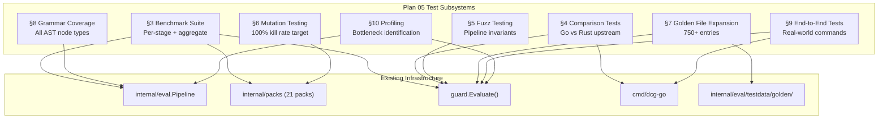

# 05: Testing & Benchmarks — Hardening & Validation

**Batch**: 5 (Hardening & Validation)
**Depends On**: [04-api-and-cli](./04-api-and-cli.md), [03b-packs-database](./03b-packs-database.md), [03c-packs-infra-cloud](./03c-packs-infra-cloud.md), [03d-packs-containers-k8s](./03d-packs-containers-k8s.md), [03e-packs-other](./03e-packs-other.md)
**Architecture**: [00-architecture.md](./00-architecture.md) (§9 URP, §10 Extreme Optimization)
**Plan Index**: [00-plan-index.md](./00-plan-index.md)

---

## 1. Summary

This plan defines the hardening and validation layer for the Destructive
Command Guard. It encompasses eight interconnected testing and performance
subsystems that collectively ensure correctness, robustness, and
performance of the full evaluation pipeline.

**Key design principle**: Every test in this plan exists to catch bugs that
unit tests and integration tests in plans 01–04 cannot. Unit tests verify
individual components; this plan verifies system-level properties,
cross-component interactions, and robustness under adversarial conditions.

**Subsystems**:

1. **Benchmark suite** — Per-stage and aggregate benchmarks for pre-filter,
   parsing, extraction, matching, and full pipeline. Establishes performance
   baselines and guards against regressions.
2. **Comparison tests against upstream Rust** — Run identical command corpus
   through both implementations, classify every divergence.
3. **Fuzz testing** — Random and mutated inputs to the full evaluation
   pipeline. Verify invariants hold for all inputs.
4. **Mutation testing** — Systematically mutate every pattern condition in
   every pack. Verify test suite kills every mutation. Target: 100% kill rate.
5. **Golden file corpus expansion** — Expand from ~501 to 750+ entries with
   structured coverage: every pattern gets 3+ entries, every structural
   context gets coverage.
6. **Grammar-derived coverage** — Enumerate all bash AST node types that can
   contain commands. Generate synthetic commands in every structural context.
   Verify extractor handles all of them.
7. **End-to-end tests** — Real-world command samples exercising the full
   pipeline from `guard.Evaluate()` through to hook JSON output.
8. **Performance profiling** — Identify bottlenecks, measure memory
   allocations, optimize hot paths.

**Scope**:
- 1 package: `e2etest` (shared test utilities and harness code)
- ~15 test files across existing packages
- ~500 new test cases (benchmark, fuzz, mutation, golden, e2e)
- CI pipeline configuration for tiered test execution
- Comparison test infrastructure (requires upstream Rust binary)

---

## 2. Component Diagram



---

## 3. Benchmark Suite

### 3.1 Per-Stage Benchmarks

Each pipeline stage is benchmarked independently to identify bottlenecks
and track regressions.

```go
// internal/parse/bench_test.go
package parse_test

// BenchmarkParse measures tree-sitter bash parsing latency.
func BenchmarkParse(b *testing.B) {
    commands := []struct {
        name string
        cmd  string
    }{
        {"simple", "git push --force"},
        {"compound", "echo deploy && git push --force origin main"},
        {"pipeline", "cat file | grep pattern | wc -l"},
        {"subshell", "(cd /tmp && rm -rf build)"},
        {"heredoc", `cat <<'EOF'\nDROP TABLE users;\nEOF`},
        {"long", strings.Repeat("echo hello && ", 50) + "echo done"},
        {"empty", ""},
        {"whitespace", "   \t\n   "},
    }

    pool := parse.NewParserPool()
    for _, tc := range commands {
        b.Run(tc.name, func(b *testing.B) {
            b.ReportAllocs()
            for i := 0; i < b.N; i++ {
                tree := pool.Parse(tc.cmd)
                tree.Close()
            }
        })
    }
}
```

```go
// internal/parse/bench_test.go

// BenchmarkExtract measures command extraction from parsed AST.
func BenchmarkExtract(b *testing.B) {
    commands := []struct {
        name string
        cmd  string
    }{
        {"single", "git push --force"},
        {"compound_3", "echo a && echo b && echo c"},
        {"compound_10", strings.Join(repeat("echo hello", 10), " && ")},
        {"nested_subshell", "bash -c 'python -c \"import os; os.remove(f)\"'"},
        {"with_env", "RAILS_ENV=production rails db:reset"},
        {"dataflow", "DIR=/; rm -rf $DIR"},
    }

    pool := parse.NewParserPool()
    for _, tc := range commands {
        b.Run(tc.name, func(b *testing.B) {
            b.ReportAllocs()
            tree := pool.Parse(tc.cmd)
            defer tree.Close()
            b.ResetTimer()
            for i := 0; i < b.N; i++ {
                _ = parse.Extract(tree)
            }
        })
    }
}
```

```go
// internal/eval/bench_test.go

// BenchmarkPreFilter measures Aho-Corasick keyword pre-filter.
func BenchmarkPreFilter(b *testing.B) {
    pf := eval.NewPreFilter(packs.DefaultRegistry)
    commands := []struct {
        name string
        cmd  string
        hit  bool
    }{
        {"miss_echo", "echo hello world", false},
        {"miss_ls", "ls -la /tmp", false},
        {"hit_git", "git push --force", true},
        {"hit_rm", "rm -rf /tmp/build", true},
        {"hit_docker", "docker system prune -af", true},
        {"miss_long", strings.Repeat("echo safe; ", 100), false},
    }

    for _, tc := range commands {
        b.Run(tc.name, func(b *testing.B) {
            b.ReportAllocs()
            for i := 0; i < b.N; i++ {
                _ = pf.MayContainDestructive(tc.cmd)
            }
        })
    }
}
```

```go
// internal/eval/bench_test.go

// BenchmarkMatchCommand measures per-command pattern matching.
func BenchmarkMatchCommand(b *testing.B) {
    pipeline := eval.NewPipeline(packs.DefaultRegistry)
    commands := []struct {
        name string
        cmd  string
    }{
        {"destructive_git", "git push --force origin main"},
        {"destructive_rm", "rm -rf /"},
        {"destructive_sql", `psql -c "DROP TABLE users"`},
        {"safe_git", "git status"},
        {"safe_echo", "echo hello"},
        {"env_escalated", "RAILS_ENV=production rails db:reset"},
    }

    cfg := eval.Config{Policy: guard.InteractivePolicy()}
    for _, tc := range commands {
        b.Run(tc.name, func(b *testing.B) {
            b.ReportAllocs()
            for i := 0; i < b.N; i++ {
                _ = pipeline.Run(tc.cmd, cfg)
            }
        })
    }
}
```

### 3.2 Aggregate Pipeline Benchmarks

Full pipeline benchmark measuring end-to-end latency through
`guard.Evaluate()`:

```go
// guard/bench_test.go
package guard_test

func BenchmarkEvaluateFullPipeline(b *testing.B) {
    scenarios := []struct {
        name string
        cmd  string
        opts []guard.Option
    }{
        {"allow_prefilter_reject", "echo hello world", nil},
        {"allow_safe_match", "git status", nil},
        {"deny_critical", "rm -rf /", nil},
        {"deny_high", "git push --force origin main", nil},
        {"ask_medium", "git stash drop",
            []guard.Option{guard.WithPolicy(guard.InteractivePolicy())}},
        {"env_escalated", "rails db:reset",
            []guard.Option{guard.WithEnv([]string{"RAILS_ENV=production"})}},
        {"allowlisted", "git push --force",
            []guard.Option{guard.WithAllowlist("git push *")}},
        {"blocklisted", "echo safe",
            []guard.Option{guard.WithBlocklist("echo *")}},
        {"compound_mixed", "echo deploy && git push --force && rm -rf /tmp/build", nil},
        {"empty", "", nil},
    }

    for _, sc := range scenarios {
        b.Run(sc.name, func(b *testing.B) {
            b.ReportAllocs()
            for i := 0; i < b.N; i++ {
                guard.Evaluate(sc.cmd, sc.opts...)
            }
        })
    }
}
```

### 3.3 Benchmark Infrastructure

**`e2etest/benchutil.go`**:

```go
package testharness

import (
    "encoding/json"
    "os"
    "testing"
)

// BenchResult holds a single benchmark result for comparison.
type BenchResult struct {
    Name       string  `json:"name"`
    NsPerOp    float64 `json:"ns_per_op"`
    AllocsPerOp int64  `json:"allocs_per_op"`
    BytesPerOp  int64  `json:"bytes_per_op"`
}

// WriteBenchResults writes benchmark results as JSON for CI tracking.
func WriteBenchResults(b *testing.B, path string, results []BenchResult) {
    data, _ := json.MarshalIndent(results, "", "  ")
    os.WriteFile(path, data, 0644)
}
```

Benchmark results are saved as JSON artifacts in CI for trend tracking.
The `benchstat` tool is used for cross-run comparisons:

```bash
# Compare benchmarks between commits
go test -bench=. -count=10 ./... > new.txt
benchstat old.txt new.txt
```

### 3.4 Performance Baselines

Performance baselines are established by the first benchmark run and
tracked via CI. These are not hard targets (actual values depend on
hardware) but regression gates — a >20% regression triggers CI failure.

**Expected performance characteristics** (approximate, validated during
implementation):

| Stage | Expected Range | Notes |
|-------|---------------|-------|
| Pre-filter miss (echo) | <500ns | Aho-Corasick single pass |
| Pre-filter hit (git) | <500ns | Keyword found, proceeds to parse |
| Parse (simple cmd) | 5–50μs | Tree-sitter parsing |
| Parse (compound 10-cmd) | 20–200μs | Linear in command count |
| Extract (single cmd) | 1–10μs | AST walk |
| Match (destructive) | 10–100μs | Pattern evaluation |
| Full pipeline (miss) | <1μs | Pre-filter rejects |
| Full pipeline (hit) | 50–500μs | Full parse + match |
| guard.Evaluate overhead | <1μs | Option processing, sync.Once |
| Hook JSON roundtrip | <10μs | JSON parse + serialize |

**Regression detection**: CI runs benchmarks with `-count=5` and compares
against the stored baseline. A >20% regression on any benchmark triggers
a warning; >50% triggers a failure.

---

## 4. Comparison Testing Against Upstream Rust

### 4.1 Overview

The upstream Rust `destructive-command-guard` uses a regex-first approach
while our Go version uses tree-sitter structural analysis. Every behavioral
difference must be classified as intentional or a bug.

### 4.2 Corpus Generation

The comparison corpus is built from four sources:

1. **Pack pattern examples** — Every destructive and safe pattern from all
   21 packs generates 3+ test commands (match, near-miss, safe variant).
   This is the golden file corpus.

2. **Structural variations** — For each pack's top commands, generate
   structural variants:
   - Path-prefixed: `/usr/bin/git push --force`
   - Quoted: `'git' push --force`
   - In compound: `echo start && git push --force`
   - In subshell: `(git push --force)`
   - In pipe: `echo | git push --force`
   - With variable: `CMD=git; $CMD push --force`

3. **Edge cases** — Curated commands targeting known divergence areas:
   - String masking differences (regex sanitization vs AST separation)
   - Flag ordering variations (`git --force push` vs `git push --force`)
   - Heredoc/inline script detection differences
   - Unicode in command arguments
   - Very long commands (>10KB)

4. **Upstream test suite commands** — Extract test case commands from the
   upstream Rust repository's own test suite. The upstream likely has test
   cases targeting its specific regex patterns and edge cases. Using their
   test suite as comparison seeds catches cases where: (a) they have
   patterns we don't (coverage gap), and (b) our structural analysis
   produces different results on cases they specifically tested.
   Commands are extracted via a script that parses the upstream test files.

```go
// e2etest/comparison.go
package testharness

// ComparisonEntry represents a single comparison test case.
type ComparisonEntry struct {
    Command      string `json:"command"`
    GoDecision   string `json:"go_decision"`
    GoSeverity   string `json:"go_severity,omitempty"`
    GoPack       string `json:"go_pack,omitempty"`
    RustDecision string `json:"rust_decision"`
    RustSeverity string `json:"rust_severity,omitempty"`
    RustPack     string `json:"rust_pack,omitempty"`
    Classification string `json:"classification"` // intentional_improvement, intentional_divergence, bug, identical
    Notes        string `json:"notes,omitempty"`
}
```

### 4.3 Execution Harness

The comparison test requires both the Go binary and the upstream Rust binary.

```go
// e2etest/comparison_test.go
package testharness_test

func TestComparisonAgainstUpstream(t *testing.T) {
    if os.Getenv("UPSTREAM_BINARY") == "" {
        t.Skip("UPSTREAM_BINARY not set; skipping comparison tests")
    }
    upstreamBin := os.Getenv("UPSTREAM_BINARY")

    corpus := loadComparisonCorpus(t, "testdata/comparison_corpus.json")
    var results []ComparisonEntry

    for _, entry := range corpus {
        t.Run(entry.Command, func(t *testing.T) {
            // Run through Go
            goResult := guard.Evaluate(entry.Command,
                guard.WithPolicy(guard.InteractivePolicy()))

            // Run through Rust (subprocess)
            rustResult := runUpstream(t, upstreamBin, entry.Command)

            result := ComparisonEntry{
                Command:      entry.Command,
                GoDecision:   goResult.Decision.String(),
                GoSeverity:   severityString(goResult),
                RustDecision: rustResult.Decision,
                RustSeverity: rustResult.Severity,
            }

            if result.GoDecision == result.RustDecision {
                result.Classification = "identical"
            } else {
                // Classify divergence
                result.Classification = classifyDivergence(result)
            }

            results = append(results, result)
        })
    }

    // Write comparison report
    writeComparisonReport(t, "testdata/comparison_report.json", results)

    // Count unclassified divergences
    bugs := 0
    for _, r := range results {
        if r.Classification == "bug" {
            bugs++
        }
    }
    assert.Equal(t, 0, bugs, "found %d unexplained divergences", bugs)
}
```

### 4.4 Divergence Classification

Every divergence falls into one of four categories:

| Classification | Description | Action |
|---------------|-------------|--------|
| `identical` | Both produce the same decision | None |
| `intentional_improvement` | Go correctly catches/allows something Rust misses | Document in comparison report |
| `intentional_divergence` | Different design choice (e.g., severity difference) | Document with rationale |
| `bug` | Go misses something Rust catches | Fix before release |

#### classifyDivergence Implementation

The `classifyDivergence` function uses a two-step process: first check
a lookup table of known divergences, then apply deterministic rules:

```go
// classifyDivergence returns a deterministic classification for a
// Go vs Rust divergence. It is NOT subjective — "reasonable" is
// not a valid criterion. Classifications must be reproducible.
func classifyDivergence(entry ComparisonEntry) string {
    // Step 1: Check the known divergences lookup table.
    // Entries in this file have been manually reviewed and classified.
    if known, ok := knownDivergences[entry.Command]; ok {
        return known.Classification
    }

    // Step 2: Apply deterministic rules for unclassified divergences.
    goSev := parseSeverity(entry.GoSeverity)
    rustSev := parseSeverity(entry.RustSeverity)

    // Rule 1: Go more restrictive (Deny when Rust allows) = safer default.
    // Classified as intentional_divergence — Go errs on the side of caution.
    if entry.GoDecision == "Deny" && entry.RustDecision == "Allow" {
        return "intentional_divergence"
    }

    // Rule 2: Go less restrictive (Allow when Rust denies) = potential bug.
    // Default to "bug" until manually reclassified.
    if entry.GoDecision == "Allow" && entry.RustDecision == "Deny" {
        return "bug"
    }

    // Rule 3: Same decision, severity difference ≤1 level = minor divergence.
    if entry.GoDecision == entry.RustDecision &&
        abs(int(goSev)-int(rustSev)) <= 1 {
        return "intentional_divergence"
    }

    // Rule 4: Same decision, severity difference ≥2 levels = requires review.
    if entry.GoDecision == entry.RustDecision &&
        abs(int(goSev)-int(rustSev)) >= 2 {
        return "bug" // default to bug, reclassify after manual review
    }

    // Rule 5: Any other unclassified divergence defaults to "bug".
    return "bug"
}
```

**Known divergences lookup table**: Stored in
`testdata/comparison_divergences.json`. Each entry records the command,
expected classification, and rationale. This file is version-controlled
and changes require explicit review:

```json
[
  {
    "command": "echo \"don't rm -rf /\"",
    "classification": "intentional_improvement",
    "rationale": "Go AST separation correctly identifies string content"
  },
  {
    "command": "RAILS_ENV=production rails db:reset",
    "classification": "intentional_improvement",
    "rationale": "Go frameworks pack not present in upstream"
  }
]
```

**Known intentional divergences**:

1. **String masking vs AST separation**: Our Go version correctly handles
   `echo "don't rm -rf /"` as a safe echo command. The Rust version uses
   context sanitization that may produce different results for commands
   embedded in strings.

2. **frameworks pack**: Our Go version includes a `frameworks` pack
   (rails, django, mix, artisan) that doesn't exist in the upstream.
   All frameworks matches are classified as `intentional_improvement`.

3. **Dataflow analysis**: Our Go version performs intraprocedural dataflow
   analysis (`DIR=/; rm -rf $DIR`). The Rust version does not track
   variable assignments. These are classified as `intentional_improvement`.

4. **Severity differences**: Minor severity differences between
   implementations (≤1 level with same decision) are classified as
   `intentional_divergence` per Rule 3 above.

### 4.5 CI Integration

```bash
# Comparison test runner script
#!/bin/bash
set -euo pipefail

# Build both binaries
go build -o dcg-go ./cmd/dcg-go
# Upstream binary provided as artifact
export UPSTREAM_BINARY="${UPSTREAM_BINARY:-./upstream-dcg}"

UPSTREAM_BINARY="$UPSTREAM_BINARY" \
    go test -run TestComparisonAgainstUpstream ./e2etest/ \
    -v -count=1
```

Comparison tests run in CI Tier 3 (nightly) since they require the
upstream binary and are slower to execute.

### 4.6 Upstream Interface

The upstream Rust binary is invoked via its CLI test mode:

```go
// runUpstream invokes the upstream Rust binary and parses the result.
func runUpstream(t *testing.T, binary, command string) UpstreamResult {
    t.Helper()
    cmd := exec.Command(binary, "check", command)
    var stdout, stderr bytes.Buffer
    cmd.Stdout = &stdout
    cmd.Stderr = &stderr
    err := cmd.Run()
    // Parse stdout JSON or text output
    return parseUpstreamOutput(stdout.Bytes(), err)
}
```

**Note**: The upstream binary interface may differ from our CLI. The
comparison harness adapts to whatever output format the upstream provides.
If the upstream doesn't support a test mode, we can use its hook mode
with synthetic JSON input.

### 4.7 Upstream Binary Version Pinning

The upstream Rust binary must be pinned to a specific version or commit
SHA to ensure reproducible comparison results. If the upstream updates
between CI runs, comparison results could change without any Go code
change, making divergence classification unreliable.

```yaml
# testdata/comparison_config.yaml
upstream:
  repository: "https://github.com/example/destructive-command-guard"
  version: "v1.2.3"          # Semantic version tag
  commit: "abc1234def5678"    # Pinned commit SHA (takes precedence)
  binary_name: "dcg"          # Expected binary name after build
```

**Version bump policy**: Bumping the upstream pin is an explicit, reviewed
change. When bumped: (1) re-run the full comparison suite, (2) review
any new divergences, (3) update `comparison_divergences.json` if needed,
(4) commit the version bump with the updated divergence file.

---

## 5. Fuzz Testing

### 5.1 Pipeline Fuzzer

Fuzz the full evaluation pipeline via `guard.Evaluate()` with random inputs:

```go
// guard/fuzz_test.go
package guard_test

import "testing"

func FuzzEvaluate(f *testing.F) {
    // Seed corpus with known commands
    seeds := []string{
        "git push --force",
        "rm -rf /",
        "echo hello",
        "",
        "   ",
        "RAILS_ENV=production rails db:reset",
        "git push --force && rm -rf / | echo done",
        `python -c "import os; os.remove('/tmp/x')"`,
        `cat <<'EOF'\nDROP TABLE users;\nEOF`,
        "命令",
        strings.Repeat("a", 200000), // oversized
        "git push; rm -rf /; echo $(cat /etc/passwd)",
        `bash -c 'bash -c "bash -c echo nested"'`,
        "DIR=/; rm -rf $DIR",
        "export RAILS_ENV=production && rails db:reset",
        ";", "&&", "||", "|", "()", "$()", "``",
        // Structurally diverse seeds for faster fuzzer coverage
        `diff <(git log --oneline) <(svn log)`,    // process substitution
        `rm -rf /tmp/{a,b,c}`,                       // brace expansion
        `echo "${arr[@]}"`,                           // array expansion
        `bash -c "git push --force"`,                 // nested quoting
        `until git pull; do sleep 1; done`,           // until loop
    }
    for _, s := range seeds {
        f.Add(s)
    }

    f.Fuzz(func(t *testing.T, command string) {
        result := guard.Evaluate(command,
            guard.WithPolicy(guard.InteractivePolicy()))
        verifyInvariants(t, command, result)
    })
}
```

### 5.1.1 Allowlist/Blocklist Fuzzer

Fuzz the evaluation pipeline with random commands AND random allowlist/blocklist
patterns. This exercises security-critical allowlist/blocklist glob matching logic
that the basic pipeline fuzzer does not cover:

```go
// guard/fuzz_test.go

func FuzzEvaluateWithAllowlist(f *testing.F) {
    // Seed: (command, allowlistPattern, blocklistPattern)
    f.Add("echo hello", "echo *", "")
    f.Add("git push --force", "", "git push *")
    f.Add("git push --force && rm -rf /", "git push *", "")
    f.Add("ls -la", "ls *", "ls -la *")
    f.Add("rm -rf /", "", "rm *")
    f.Add("echo safe; rm -rf /", "echo *", "")

    f.Fuzz(func(t *testing.T, command, allowPattern, blockPattern string) {
        var opts []guard.Option
        opts = append(opts, guard.WithPolicy(guard.InteractivePolicy()))
        if allowPattern != "" {
            opts = append(opts, guard.WithAllowlist([]string{allowPattern}))
        }
        if blockPattern != "" {
            opts = append(opts, guard.WithBlocklist([]string{blockPattern}))
        }

        result := guard.Evaluate(command, opts...)

        // Core invariants still hold
        verifyInvariants(t, command, result)

        // INV-A1: If command exactly matches allowlist pattern with no
        // separators, decision must be Allow (unless blocklist overrides).
        // Use the actual separator set from the allowlist implementation.
        if allowPattern != "" && blockPattern == "" &&
            !containsSeparator(command) && globMatch(allowPattern, command) {
            if result.Decision != guard.Allow {
                t.Fatalf("INV-A1: command %q matches allowlist %q "+
                    "with no separators, got %s want Allow",
                    command, allowPattern, result.Decision)
            }
        }

        // INV-A2: If allowlist matches but command contains separators
        // (&&, ||, ;, |) beyond the matched portion, the compound parts
        // must still be evaluated. An allowlisted prefix must NOT
        // blanket-allow everything after a separator.
        if allowPattern != "" && blockPattern == "" {
            parts := splitOnSeparators(command)
            if len(parts) > 1 && globMatch(allowPattern, parts[0]) {
                // At least one non-first part has a destructive command →
                // decision must NOT be Allow
                for _, part := range parts[1:] {
                    partResult := guard.Evaluate(strings.TrimSpace(part),
                        guard.WithPolicy(guard.InteractivePolicy()))
                    if partResult.Decision == guard.Deny {
                        if result.Decision == guard.Allow {
                            t.Fatalf("INV-A2: allowlist %q matched prefix "+
                                "but compound command %q was Allow despite "+
                                "destructive segment %q",
                                allowPattern, command, part)
                        }
                        break
                    }
                }
            }
        }

        // INV-B1: If command matches a blocklist pattern, decision must
        // be Deny regardless of safe patterns.
        if blockPattern != "" && globMatch(blockPattern, command) {
            if result.Decision != guard.Deny {
                t.Fatalf("INV-B1: command %q matches blocklist %q, "+
                    "got %s want Deny", command, blockPattern, result.Decision)
            }
        }
    })
}
```

### 5.2 Invariants

These invariants must hold for ALL inputs, including random/adversarial:

```go
// guard/fuzz_test.go

func verifyInvariants(t *testing.T, command string, result guard.Result) {
    t.Helper()

    // INV-1: Decision is always valid
    switch result.Decision {
    case guard.Allow, guard.Deny, guard.Ask:
        // ok
    default:
        t.Fatalf("INV-1: invalid decision %d for %q", result.Decision, command)
    }

    // INV-2: Command is preserved
    if result.Command != command {
        t.Fatalf("INV-2: command not preserved: got %q, want %q",
            result.Command, command)
    }

    // INV-3: Empty/whitespace commands → Allow
    if strings.TrimSpace(command) == "" {
        if result.Decision != guard.Allow {
            t.Fatalf("INV-3: empty command got %s, want Allow", result.Decision)
        }
    }

    // INV-4: nil Assessment → Allow, empty Matches
    if result.Assessment == nil {
        if result.Decision != guard.Allow {
            t.Fatalf("INV-4: nil assessment with %s decision", result.Decision)
        }
        if len(result.Matches) != 0 {
            t.Fatalf("INV-4: nil assessment with %d matches", len(result.Matches))
        }
    }

    // INV-5: non-empty Matches → non-nil Assessment
    if len(result.Matches) > 0 && result.Assessment == nil {
        t.Fatalf("INV-5: %d matches but nil assessment", len(result.Matches))
    }

    // INV-6: Assessment severity is valid
    if result.Assessment != nil {
        switch result.Assessment.Severity {
        case guard.Indeterminate, guard.Low, guard.Medium,
            guard.High, guard.Critical:
            // ok
        default:
            t.Fatalf("INV-6: invalid severity %d", result.Assessment.Severity)
        }
    }

    // INV-7: Match fields are populated
    for i, m := range result.Matches {
        if m.Pack == "" {
            t.Fatalf("INV-7: match %d has empty Pack", i)
        }
        if m.Rule == "" && m.Pack != "_blocklist" && m.Pack != "_allowlist" {
            t.Fatalf("INV-7: match %d has empty Rule", i)
        }
    }

    // INV-8: Oversized input → Indeterminate
    // Reference the pipeline's authoritative limit constant to stay in sync.
    if len(command) > eval.MaxCommandBytes && result.Assessment != nil {
        if result.Assessment.Severity != guard.Indeterminate {
            t.Fatalf("INV-8: oversized input (%d bytes) got %s, want Indeterminate",
                len(command), result.Assessment.Severity)
        }
    }
}
```

### 5.3 Corpus Seeding Strategy

The fuzz seed corpus is built from:

1. **Golden file commands** — All 750+ golden file commands
2. **Pack keywords** — Every keyword from every pack as a standalone command
3. **Structural templates** — Empty, whitespace, single char, max length
4. **Known edge cases** — Unicode, null bytes, control characters
5. **Crash triggers** — Commands that triggered issues during development

```go
// e2etest/fuzzseeds.go

// LoadFuzzSeeds loads seed commands from golden files and edge cases.
func LoadFuzzSeeds(goldenDir string) []string {
    var seeds []string

    // Load all golden file commands
    entries := loadGoldenEntries(goldenDir)
    for _, e := range entries {
        seeds = append(seeds, e.Command)
    }

    // Add structural templates
    seeds = append(seeds,
        "", " ", "\t", "\n", "\x00",
        strings.Repeat("a", 1000),
        strings.Repeat("a", eval.MaxCommandBytes+1),
        "$($($(echo nested)))",
        `"unclosed string`,
        `'unclosed string`,
        "`unclosed backtick",
    )

    return seeds
}
```

### 5.4 Config Fuzzer

Fuzz the config parsing path. To avoid the os.Exit calls in loadConfig,
the implementation refactors the parsing logic into a testable
`parseConfig(data []byte) (*Config, error)` function that returns errors
instead of exiting. The fuzzer tests parseConfig followed by toOptions(),
covering the real code path:

```go
// cmd/dcg-go/fuzz_test.go
package main

func FuzzConfigParse(f *testing.F) {
    f.Add([]byte("policy: strict\n"))
    f.Add([]byte("policy: 42\n"))
    f.Add([]byte("\x00\x01\x02\xff"))
    f.Add([]byte("a: &a [*a, *a, *a, *a]"))
    f.Add([]byte(strings.Repeat("key: value\n", 10000)))

    f.Fuzz(func(t *testing.T, data []byte) {
        // Must not panic regardless of input
        assert.NotPanics(t, func() {
            // parseConfig returns errors instead of calling os.Exit,
            // covering the real parsing + validation path.
            cfg, err := parseConfig(data)
            if err != nil {
                return // expected for malformed input
            }
            // Also exercise the options conversion path
            _ = cfg.toOptions()
        })
    })
}
```

**Implementation note**: The existing `loadConfig()` function should be
refactored to: (1) `parseConfig(data []byte) (*Config, error)` — pure
parsing + validation, testable and fuzzable, and (2) `loadConfig()` —
calls parseConfig, handles os.Exit for CLI context. This separates
concerns without changing external behavior.
```

### 5.5 Hook Input Fuzzer

Two fuzzers cover the hook input path: one for JSON unmarshal robustness,
and one for the full hook processing flow including command evaluation:

```go
// cmd/dcg-go/fuzz_test.go

// FuzzHookInput tests JSON unmarshal robustness.
func FuzzHookInput(f *testing.F) {
    f.Add([]byte(`{"tool_name":"Bash","tool_input":{"command":"ls"}}`))
    f.Add([]byte(`{}`))
    f.Add([]byte(`not json`))
    f.Add([]byte(``))

    f.Fuzz(func(t *testing.T, data []byte) {
        var hookInput HookInput
        // Must not panic regardless of input
        assert.NotPanics(t, func() {
            json.Unmarshal(data, &hookInput)
        })
    })
}

// FuzzHookProcess tests the full hook processing flow after unmarshal:
// extracting command from tool_input, evaluating through pipeline, and
// producing output JSON. This covers the more interesting attack surface
// of valid-JSON inputs with unexpected field values.
func FuzzHookProcess(f *testing.F) {
    f.Add([]byte(`{"tool_name":"Bash","tool_input":{"command":"ls"}}`))
    f.Add([]byte(`{"tool_name":"Bash","tool_input":{"command":"rm -rf /"}}`))
    f.Add([]byte(`{"tool_name":"Read","tool_input":{"file_path":"/etc/passwd"}}`))
    f.Add([]byte(`{"hook_event_name":"PreToolUse","tool_name":"Bash","tool_input":{"command":"echo hello"}}`))
    f.Add([]byte(`{"tool_name":"Bash","tool_input":{"command":"` +
        strings.Repeat("a", 10000) + `"}}`))

    f.Fuzz(func(t *testing.T, data []byte) {
        assert.NotPanics(t, func() {
            // processHookInput is the extracted, testable core of
            // runHookMode — accepts parsed input, returns output struct.
            // Does NOT call os.Exit or read from os.Stdin.
            var hookInput HookInput
            if err := json.Unmarshal(data, &hookInput); err != nil {
                return // invalid JSON is handled by FuzzHookInput
            }
            _ = processHookInput(hookInput)
        })
    })
}
```

### 5.6 CI Integration

Fuzz tests run in CI Tier 3 (nightly) with a time limit:

```bash
# Run fuzz tests for 5 minutes each
go test -fuzz=FuzzEvaluate -fuzztime=5m ./guard/
go test -fuzz=FuzzEvaluateWithAllowlist -fuzztime=5m ./guard/
go test -fuzz=FuzzConfigParse -fuzztime=2m ./cmd/dcg-go/
go test -fuzz=FuzzHookInput -fuzztime=2m ./cmd/dcg-go/
go test -fuzz=FuzzHookProcess -fuzztime=2m ./cmd/dcg-go/
```

The fuzz corpus is stored in `testdata/fuzz/` and committed to version
control. New crash-triggering inputs are added to the corpus automatically.

---

## 6. Mutation Testing

### 6.1 Overview

Every condition in every `CommandMatcher` must be load-bearing. The mutation
testing harness systematically verifies this by mutating one condition at a
time and verifying that at least one test fails.

### 6.2 Mutation Operators

The harness applies these mutation operators to each `CommandMatcher`:

| Operator | Description | Example | Category |
|----------|-------------|---------|----------|
| `RemoveCondition` | Remove one condition from the matcher | Remove `HasFlag("--force")` | matching |
| `NegateCondition` | Negate a boolean condition | `HasFlag("--force")` → `!HasFlag("--force")` | matching |
| `SwapCommandName` | Change the command name | `git` → `got` | matching |
| `RemoveFlag` | Remove a flag check | Remove `--delete` from flag list | matching |
| `RemoveNot` | Unwrap a Not clause, exposing its inner condition | `Not(HasFlag("--delete"))` → `HasFlag("--delete")` | matching |
| `RemoveNotAlternative` | Remove one alternative from Or inside Not | `Not(Or(A, B, C))` → `Not(Or(A, C))` | matching |
| `ShiftArgPosition` | Increment or decrement ArgAt position by 1 | `ArgAt(1, "delete")` → `ArgAt(2, "delete")` | matching |
| `SwapSeverity` | Change severity up or down | `High` → `Medium` | matching |
| `RemoveEnvTrigger` | Remove an env escalation trigger | Remove `RAILS_ENV` check | matching |
| `EmptyReason` | Clear the reason string | `"overwrites history"` → `""` | metadata |

**Operator categories**: "matching" operators affect pattern matching behavior
and contribute to the primary kill rate. "metadata" operators (EmptyReason)
affect only human-readable output and are tracked separately — they do NOT
count toward the 100% kill rate target. This prevents trivially-killed
metadata mutations from inflating the kill rate.

**Not clause operators** (RemoveNot, RemoveNotAlternative) are the most
security-critical operators. Not clauses are the primary mechanism for safe
pattern precision across all packs (rsync S1: 6 Not clauses, kubectl S4:
Not(Or(HasFlag("--all"), ...)), helm S2: Not(Or(ArgAt(1, "upgrade"), ...))).
These operators must have tightness tests (see TH P2) verifying they produce
genuinely different matching behavior.

**ShiftArgPosition** targets positional argument matching — critical for
multi-level subcommand tools like vault (`ArgAt(0, "kv")`, `ArgAt(1,
"delete")`) where swapping positions could match `vault delete kv` instead
of `vault kv delete`.

### 6.3 Harness Architecture

```go
// e2etest/mutation.go
package testharness

// MutationResult tracks a single mutation test.
type MutationResult struct {
    Pack        string `json:"pack"`
    Pattern     string `json:"pattern"`
    PatternType string `json:"pattern_type"` // "destructive" or "safe"
    Operator    string `json:"operator"`
    Category    string `json:"category"`     // "matching" or "metadata"
    Detail      string `json:"detail"`
    Killed      bool   `json:"killed"`       // true = test suite caught it
    KilledBy    string `json:"killed_by"`    // test name that caught it
}

// MutationReport tracks all mutation results for a pack.
type MutationReport struct {
    Pack              string           `json:"pack"`
    Total             int              `json:"total"`              // matching mutations only
    Killed            int              `json:"killed"`             // matching mutations killed
    Survived          int              `json:"survived"`           // matching mutations survived
    KillRate          float64          `json:"kill_rate"`          // matching kill rate
    MetadataTotal     int              `json:"metadata_total"`     // metadata mutations (EmptyReason)
    MetadataKilled    int              `json:"metadata_killed"`    // metadata mutations killed
    Mutations         []MutationResult `json:"mutations"`          // matching mutations
    MetadataMutations []MutationResult `json:"metadata_mutations"` // metadata mutations
}
```

The mutation harness works by:

1. For each pack, enumerate all `CommandMatcher` registrations
2. For each matcher, enumerate all conditions (command name, flags,
   arguments, severity, env triggers)
3. For each condition, apply each applicable mutation operator
4. Run the pack's unit test suite with the mutation applied
5. If all tests pass → mutation survived (test gap found)
6. If any test fails → mutation killed (condition is verified)

### 6.4 Implementation Strategy

Since Go doesn't have a built-in mutation testing framework, we implement
mutation at the data level rather than the source level. Each pack's
patterns are defined as data structures (not imperative code), so we can
mutate the data structure and re-run matching:

```go
// e2etest/mutation_test.go
package testharness_test

func TestMutationKillRate(t *testing.T) {
    registry := packs.DefaultRegistry
    allPacks := registry.All()

    for _, pack := range allPacks {
        t.Run(pack.ID, func(t *testing.T) {
            report := runMutationAnalysis(t, pack)

            // Report results
            t.Logf("Pack %s: %d/%d mutations killed (%.1f%%)",
                pack.ID, report.Killed, report.Total, report.KillRate)

            // Log surviving mutations
            for _, m := range report.Mutations {
                if !m.Killed {
                    t.Errorf("SURVIVED: %s.%s [%s] %s",
                        m.Pack, m.Pattern, m.Operator, m.Detail)
                }
            }

            // Fail if kill rate < 100%
            assert.Equal(t, report.Total, report.Killed,
                "pack %s: %d mutations survived (need 100%% kill rate)",
                pack.ID, report.Survived)
        })
    }
}

func runMutationAnalysis(t *testing.T, pack packs.Pack) MutationReport {
    t.Helper()
    var report MutationReport
    report.Pack = pack.ID

    // Mutate BOTH destructive AND safe patterns.
    // Safe pattern mutations are security-critical: a broadened safe pattern
    // could short-circuit evaluation and cause destructive commands to be
    // classified as safe (false negatives).
    allPatterns := make([]annotatedPattern, 0,
        len(pack.Destructive)+len(pack.Safe))
    for _, p := range pack.Destructive {
        allPatterns = append(allPatterns, annotatedPattern{p, "destructive"})
    }
    for _, p := range pack.Safe {
        allPatterns = append(allPatterns, annotatedPattern{p, "safe"})
    }

    for _, ap := range allPatterns {
        mutations := generateMutations(ap.pattern)
        for _, mutation := range mutations {
            // Skip metadata-category operators (EmptyReason) from kill rate
            if mutation.Category == "metadata" {
                report.MetadataTotal++
                result := applyAndTest(t, pack, ap.pattern, mutation)
                report.MetadataMutations = append(report.MetadataMutations, result)
                if result.Killed {
                    report.MetadataKilled++
                }
                continue
            }

            report.Total++
            result := applyAndTest(t, pack, ap.pattern, mutation)
            result.PatternType = ap.kind // "destructive" or "safe"
            report.Mutations = append(report.Mutations, result)
            if result.Killed {
                report.Killed++
            } else {
                report.Survived++
            }
        }
    }

    report.KillRate = float64(report.Killed) / float64(report.Total) * 100
    return report
}

type annotatedPattern struct {
    pattern Pattern
    kind    string // "destructive" or "safe"
}
```

**Safe pattern kill criterion**: For safe patterns, the kill criterion is
inverted compared to destructive patterns. A safe pattern mutation is
"killed" when the test suite detects that the mutated safe pattern now
incorrectly matches a command that should be classified as destructive.

The test corpus for safe pattern mutation testing must include commands that
sit just outside the safe pattern boundary — commands that match the
corresponding destructive pattern and should NOT be caught by the safe
pattern. For example, if rsync S1's safe pattern has
`Not(HasFlag("--delete"))`, the corpus must include `rsync --delete /src
/dst` to kill the RemoveNot mutation.

```go
// Kill criterion for safe pattern mutations:
func isKilledSafe(t *testing.T, pack packs.Pack, original, mutated Pattern,
    corpus []string) bool {
    for _, cmd := range corpus {
        origMatch := original.Match(cmd)
        mutMatch := mutated.Match(cmd)
        if origMatch != mutMatch {
            // The mutation changed behavior — check if it's a
            // dangerous change (safe pattern now matches something
            // it shouldn't, or stops matching something it should)
            return true
        }
    }
    return false // mutation survived — test gap
}
```

### 6.5 Mutation Targets Per Pack

| Pack Group | Packs | Destructive | Safe | Est. Matching Mutations | Est. Metadata Mutations |
|-----------|-------|-------------|------|------------------------|------------------------|
| Core | core.git, core.filesystem | 32 | 12 | ~330 | ~44 |
| Database | postgresql, mysql, sqlite, mongodb, redis | 35 | 15 | ~375 | ~50 |
| Infra/Cloud | terraform, pulumi, ansible, aws, gcp, azure | 58 | 22 | ~600 | ~80 |
| Containers/K8s | docker, compose, kubectl, helm | 35 | 16 | ~383 | ~51 |
| Other | frameworks, rsync, vault, github | 28 | 12 | ~300 | ~40 |
| **Total** | **21 packs** | **188** | **77** | **~1988 matching** | **~265 metadata** |

**Mutation count increase**: Including safe patterns and the 3 new
operators (RemoveNot, RemoveNotAlternative, ShiftArgPosition) roughly
doubles the matching mutation count from ~940 to ~1988. The 10 matching
operators × 265 patterns × ~0.75 applicability rate = ~1988 mutations.

**Kill rate targets**:
- **Matching mutations**: 100% kill rate required. Any survivor indicates
  a redundant condition (remove it) or a test gap (add a test case).
- **Metadata mutations**: Tracked separately. EmptyReason mutations are
  expected to be killed by golden file `reason_contains` assertions but
  do not count toward the 100% kill rate.

### 6.6 CI Integration

Mutation testing runs in CI Tier 3 (nightly) due to execution time:

```bash
go test -run TestMutationKillRate -v -count=1 \
    -timeout=30m ./e2etest/
```

Results are saved as a JSON report for trend tracking.

---

## 7. Golden File Corpus Expansion

### 7.1 Current State

Existing golden file entries across all packs:

| Pack Group | Plan | Entries |
|-----------|------|---------|
| Core (git, filesystem) | 03a | 83 |
| Database | 03b | 75 |
| Infra/Cloud | 03c | 132 |
| Containers/K8s | 03d | 116 |
| Other | 03e | 95 |
| **Total** | | **501** |

### 7.2 Expansion Targets

Expand from 501 to 750+ entries by adding:

1. **Structural variants** (~100 entries): Each of the top 20 destructive
   commands in compound, subshell, pipeline, and variable-assignment
   contexts.

2. **False-positive traps** (~50 entries): Commands that look dangerous
   but are safe — e.g., `echo "rm -rf /"`, `man git-push`, `git log
   --force-colors`, `grep -r "DROP TABLE" docs/`.

3. **Cross-pack interactions** (~30 entries): Commands that trigger
   patterns from multiple packs — e.g., `terraform destroy &&
   kubectl delete --all`, `git push --force; rm -rf /`.

4. **Dataflow commands** (~30 entries): Variable assignments feeding
   into destructive commands — e.g., `DIR=/; rm -rf $DIR`,
   `export RAILS_ENV=production && rails db:reset`.

5. **Edge cases** (~40 entries): Path-prefixed binaries, aliased
   commands, unusual quoting, unicode, very long arguments.

### 7.3 Golden File Format

Golden files use the v1 format established in plan 02:

```
# command: git push --force origin main
# decision: Deny
# severity: High
# pack: core.git
# rule: git-push-force
# confidence: High
---
# command: echo "don't rm -rf /"
# decision: Allow
# note: String argument, not a command
---
```

### 7.4 Coverage Analysis

After expansion, verify:

```go
// e2etest/golden_coverage_test.go

func TestGoldenCoverageAllPatterns(t *testing.T) {
    entries := loadAllGoldenEntries(t)
    packs := guard.Packs()

    for _, pack := range packs {
        t.Run(pack.ID, func(t *testing.T) {
            // Find all golden entries for this pack
            packEntries := filterByPack(entries, pack.ID)

            // Every destructive pattern should have at least 3 entries:
            // 1 match, 1 near-miss, 1 safe variant
            patternCoverage := countPatternCoverage(packEntries)
            for pattern, count := range patternCoverage {
                assert.GreaterOrEqual(t, count, 3,
                    "pattern %s.%s has only %d golden entries (need 3+)",
                    pack.ID, pattern, count)
            }
        })
    }
}

func TestGoldenCoverageStructuralContexts(t *testing.T) {
    entries := loadAllGoldenEntries(t)

    contexts := map[string]int{
        "simple":    0, // git push --force
        "compound":  0, // echo && git push --force
        "subshell":  0, // (git push --force)
        "pipeline":  0, // echo | git push --force
        "variable":  0, // CMD=git; $CMD push --force
        "inline":    0, // bash -c "git push --force"
    }

    for _, e := range entries {
        ctx := classifyStructuralContext(e.Command)
        contexts[ctx]++
    }

    for ctx, count := range contexts {
        assert.Greater(t, count, 0,
            "no golden entries for structural context: %s", ctx)
    }
}
```

### 7.5 Maintenance

Golden files are maintained alongside pack development. When a new pattern
is added or modified:

1. Add/update golden file entries (minimum 3 per pattern)
2. Run `go test -run TestGoldenCoverageAllPatterns` to verify coverage
3. Run `go test -run TestOracleGoldenFileThroughPublicAPI` to verify
   decisions

---

## 8. Grammar-Derived Coverage Analysis

### 8.1 Node Type Enumeration

The tree-sitter bash grammar defines the structural contexts where
commands can appear. We enumerate all command-bearing node types:

```go
// e2etest/grammar_coverage.go
package testharness

// CommandBearingNodeTypes lists all bash AST node types that can
// contain a simple_command. The command extractor must handle all
// of these.
var CommandBearingNodeTypes = []string{
    "program",                // Top-level command
    "pipeline",              // cmd1 | cmd2
    "list",                  // cmd1; cmd2 or cmd1 && cmd2 or cmd1 || cmd2
    "compound_statement",    // { cmd1; cmd2; }
    "subshell",              // (cmd1; cmd2)
    "if_statement",          // if cmd; then cmd; fi
    "elif_clause",           // elif cmd; then cmd
    "while_statement",       // while cmd; do cmd; done
    "until_statement",       // until cmd; do cmd; done (distinct from while in tree-sitter)
    "for_statement",         // for x in ...; do cmd; done
    "case_statement",        // case ... in pattern) cmd ;; esac
    "function_definition",   // fn() { cmd; }
    "command_substitution",  // $(cmd)
    "process_substitution",  // <(cmd) or >(cmd)
    "redirected_command",    // cmd > file 2>&1 (wraps simple_command in tree-sitter)
    "negated_command",       // ! cmd
    "test_command",          // [[ ... ]]
    "heredoc_body",          // <<EOF ... EOF — NOTE: heredoc bodies are typically
                             // literal text, not commands. Included here because
                             // heredocs may contain command substitutions ($(...))
                             // which the extractor should walk into. If the
                             // heredoc is pure text, the extractor correctly
                             // produces no commands.
    "string",               // "$(cmd)" within double-quoted strings
}

// Implementation note: This list should be verified against the actual
// tree-sitter-bash grammar definition (node-types.json) during
// implementation to ensure completeness. Additional node types like
// "coproc" (bash 4+) should be evaluated for inclusion.
```

### 8.2 Synthetic Command Generation

For each command-bearing node type, generate synthetic commands and
verify the extractor handles them:

```go
// e2etest/grammar_coverage_test.go

func TestGrammarCoverage(t *testing.T) {
    // Template: each context wraps "git push --force"
    templates := map[string]string{
        "program":              "git push --force",
        "pipeline":             "echo start | git push --force",
        "list_sequential":      "echo start; git push --force",
        "list_and":             "echo start && git push --force",
        "list_or":              "echo start || git push --force",
        "compound_statement":   "{ echo start; git push --force; }",
        "subshell":             "(git push --force)",
        "if_condition":         "if git push --force; then echo done; fi",
        "if_body":              "if true; then git push --force; fi",
        "elif_body":            "if false; then true; elif true; then git push --force; fi",
        "while_condition":      "while git push --force; do echo retry; done",
        "while_body":           "while true; do git push --force; done",
        "until_condition":      "until git push --force; do echo retry; done",
        "until_body":           "until false; do git push --force; done",
        "for_body":             "for x in 1 2 3; do git push --force; done",
        "case_body":            "case $x in y) git push --force;; esac",
        "function_body":        "fn() { git push --force; }; fn",
        "command_substitution": "echo $(git push --force)",
        "process_substitution": "diff <(git push --force) /dev/null",
        "redirected_command":   "git push --force > /dev/null 2>&1",
        "negated":              "! git push --force",
        "backtick":             "echo `git push --force`",
    }

    for context, cmd := range templates {
        t.Run(context, func(t *testing.T) {
            result := guard.Evaluate(cmd,
                guard.WithPolicy(guard.InteractivePolicy()))

            // The extractor should find "git push --force" in every context
            if hasRegisteredPack("core.git") {
                assert.NotEqual(t, guard.Allow, result.Decision,
                    "extractor missed git push --force in context: %s", context)

                foundGitMatch := false
                for _, m := range result.Matches {
                    if m.Pack == "core.git" {
                        foundGitMatch = true
                    }
                }
                assert.True(t, foundGitMatch,
                    "no core.git match for context: %s", context)
            }
        })
    }
}
```

### 8.3 Extended Grammar Coverage

Beyond the basic template tests, generate per-pack coverage:

```go
func TestGrammarCoverageAllPacks(t *testing.T) {
    // For each pack, pick one representative destructive command
    // and verify it's detected in all structural contexts.
    packCommands := map[string]string{
        "core.git":              "git push --force",
        "core.filesystem":       "rm -rf /",
        "database.postgresql":   `psql -c "DROP TABLE users"`,
        "database.mysql":        `mysql -e "DROP DATABASE prod"`,
        "database.mongodb":      `mongosh --eval "db.dropDatabase()"`,
        "infrastructure.terraform": "terraform destroy -auto-approve",
        "cloud.aws":             "aws ec2 terminate-instances --instance-ids i-123",
        "containers.docker":     "docker system prune -af",
        "kubernetes.kubectl":    "kubectl delete --all pods",
        "frameworks":            "RAILS_ENV=production rails db:reset",
    }

    // Use the full structural context set from §8.2 to ensure per-pack
    // coverage matches the core grammar coverage test. Testing only 5
    // contexts would cover just 23% of structural contexts — a pack's
    // keyword pre-filter or pattern matching could fail in specific
    // contexts (for_body, while_body, case_body, etc.) undetected.
    contexts := []string{
        "%s",                                                        // program
        "echo start | %s",                                           // pipeline
        "echo start; %s",                                            // list_sequential
        "echo start && %s",                                          // list_and
        "echo start || %s",                                          // list_or
        "{ echo start; %s; }",                                       // compound_statement
        "(%s)",                                                      // subshell
        "if %s; then echo done; fi",                                 // if_condition
        "if true; then %s; fi",                                      // if_body
        "if false; then true; elif true; then %s; fi",               // elif_body
        "while true; do %s; done",                                   // while_body
        "until false; do %s; done",                                  // until_body
        "for x in 1 2 3; do %s; done",                               // for_body
        "case $x in y) %s;; esac",                                   // case_body
        "fn() { %s; }; fn",                                          // function_body
        "echo $(%s)",                                                // command_substitution
        "diff <(%s) /dev/null",                                      // process_substitution
        "%s > /dev/null 2>&1",                                       // redirected_command
        "! %s",                                                      // negated
        "echo `%s`",                                                 // backtick
    }
    // ~10 packs × 20 contexts = ~200 test cases — still fast enough
    // for Tier 2 (<30s)

    for packID, cmd := range packCommands {
        if !hasRegisteredPack(packID) {
            continue
        }
        for _, ctx := range contexts {
            fullCmd := fmt.Sprintf(ctx, cmd)
            t.Run(packID+"/"+ctx, func(t *testing.T) {
                result := guard.Evaluate(fullCmd)
                assert.NotEqual(t, guard.Allow, result.Decision,
                    "missed %s in context %q", packID, ctx)
            })
        }
    }
}
```

### 8.4 Coverage Tracking

```go
// e2etest/grammar_coverage.go

// GrammarCoverageReport tracks which AST contexts are verified.
type GrammarCoverageReport struct {
    TotalContexts  int            `json:"total_contexts"`
    CoveredContexts int           `json:"covered_contexts"`
    CoveragePercent float64       `json:"coverage_percent"`
    Contexts       map[string]bool `json:"contexts"`
}
```

**Target**: 100% coverage of all command-bearing AST node types.

---

## 9. End-to-End Tests

### 9.1 Real-World Command Samples

End-to-end tests exercise the full pipeline with realistic command
sequences that an LLM agent might generate:

```go
// e2etest/e2e_test.go
package testharness_test

func TestE2ERealWorldScenarios(t *testing.T) {
    scenarios := []struct {
        name        string
        command     string
        wantDecision guard.Decision
        wantMinSev  guard.Severity
        note        string
    }{
        // Deployment commands
        {
            name:     "force push to main",
            command:  "git push --force origin main",
            wantDecision: guard.Deny,
            wantMinSev:  guard.High,
        },
        {
            name:     "multi-step deployment",
            command:  "npm run build && git push origin main && ssh prod 'sudo systemctl restart app'",
            wantDecision: guard.Deny,
            wantMinSev:  guard.High,
            note:     "git push to main is destructive",
        },

        // Database maintenance
        {
            name:     "production database reset",
            command:  "RAILS_ENV=production rails db:reset",
            wantDecision: guard.Deny,
            wantMinSev:  guard.Critical,
        },
        {
            name:     "dev database reset",
            command:  "RAILS_ENV=development rails db:reset",
            wantDecision: guard.Deny,
            wantMinSev:  guard.High,
            note:     "rails db:reset base severity = High (plan 03e D2). " +
                      "RAILS_ENV=development is NOT production → no escalation → " +
                      "severity remains High → InteractivePolicy maps High → Deny. " +
                      "No de-escalation mechanism exists per plans 02/03e.",
        },

        // Infrastructure
        {
            name:     "terraform destroy in pipeline",
            command:  "cd /infra/staging && terraform destroy -auto-approve",
            wantDecision: guard.Deny,
            wantMinSev:  guard.Critical,
        },

        // Container cleanup
        {
            name:     "docker cleanup",
            command:  "docker system prune -af --volumes",
            wantDecision: guard.Deny,
            wantMinSev:  guard.High,
        },

        // Safe commands that look dangerous
        {
            name:     "echo with dangerous content",
            command:  `echo "Running: rm -rf /tmp/build"`,
            wantDecision: guard.Allow,
            note:     "rm -rf is in a string argument, not a command",
        },
        {
            name:     "grep for dangerous pattern",
            command:  `grep -r "DROP TABLE" src/migrations/`,
            wantDecision: guard.Allow,
            note:     "Searching for pattern, not executing it",
        },
        {
            name:     "man page for dangerous command",
            command:  "man git-push",
            wantDecision: guard.Allow,
        },

        // Dataflow analysis
        {
            name:     "variable carries danger",
            command:  "DIR=/; rm -rf $DIR",
            wantDecision: guard.Deny,
            wantMinSev:  guard.Critical,
            note:     "Dataflow: variable assignment → rm target",
        },
        {
            name:     "export propagation",
            command:  "export RAILS_ENV=production && rails db:reset",
            wantDecision: guard.Deny,
            wantMinSev:  guard.Critical,
            note:     "Dataflow: export → env escalation",
        },

        // Compound commands with mixed severity
        {
            name:     "compound git + rm",
            command:  "git push --force && rm -rf /",
            wantDecision: guard.Deny,
            wantMinSev:  guard.Critical,
            note:     "Highest severity wins (Critical from rm -rf /)",
        },

        // Edge cases
        {
            name:     "empty command",
            command:  "",
            wantDecision: guard.Allow,
        },
        {
            name:     "only whitespace",
            command:  "   \t\n  ",
            wantDecision: guard.Allow,
        },
        {
            name:     "path-prefixed binary",
            command:  "/usr/bin/git push --force origin main",
            wantDecision: guard.Deny,
            note:     "Path prefix stripped during normalization",
        },
    }

    for _, sc := range scenarios {
        t.Run(sc.name, func(t *testing.T) {
            result := guard.Evaluate(sc.command,
                guard.WithPolicy(guard.InteractivePolicy()),
                guard.WithEnv([]string{}))

            assert.Equal(t, sc.wantDecision, result.Decision,
                "decision mismatch for %q", sc.command)

            if sc.wantMinSev > 0 && result.Assessment != nil {
                assert.GreaterOrEqual(t, int(result.Assessment.Severity),
                    int(sc.wantMinSev),
                    "severity too low for %q", sc.command)
            }
        })
    }
}
```

### 9.1.1 Policy-Parameterized E2E Scenarios

The base E2E test uses InteractivePolicy exclusively. This supplemental
test verifies that the same commands produce correct policy-specific
decisions under all 3 built-in policies:

```go
func TestE2EPolicyVariations(t *testing.T) {
    type policyExpectation struct {
        policy       guard.Policy
        policyName   string
        wantDecision guard.Decision
    }

    scenarios := []struct {
        name        string
        command     string
        expectations []policyExpectation
    }{
        {
            name:    "Indeterminate command under all policies",
            command: strings.Repeat("a", eval.MaxCommandBytes+1),
            expectations: []policyExpectation{
                {guard.StrictPolicy(), "strict", guard.Deny},
                {guard.InteractivePolicy(), "interactive", guard.Ask},
                {guard.PermissivePolicy(), "permissive", guard.Allow},
            },
        },
        {
            name:    "Medium severity under all policies",
            command: "git stash drop",
            expectations: []policyExpectation{
                {guard.StrictPolicy(), "strict", guard.Deny},
                {guard.InteractivePolicy(), "interactive", guard.Ask},
                {guard.PermissivePolicy(), "permissive", guard.Allow},
            },
        },
        {
            name:    "High severity under all policies",
            command: "git push --force origin main",
            expectations: []policyExpectation{
                {guard.StrictPolicy(), "strict", guard.Deny},
                {guard.InteractivePolicy(), "interactive", guard.Deny},
                {guard.PermissivePolicy(), "permissive", guard.Ask},
            },
        },
        {
            name:    "Critical severity under all policies",
            command: "rm -rf /",
            expectations: []policyExpectation{
                {guard.StrictPolicy(), "strict", guard.Deny},
                {guard.InteractivePolicy(), "interactive", guard.Deny},
                {guard.PermissivePolicy(), "permissive", guard.Deny},
            },
        },
    }

    for _, sc := range scenarios {
        for _, exp := range sc.expectations {
            t.Run(sc.name+"/"+exp.policyName, func(t *testing.T) {
                result := guard.Evaluate(sc.command,
                    guard.WithPolicy(exp.policy))
                assert.Equal(t, exp.wantDecision, result.Decision,
                    "policy %s: decision mismatch for %q",
                    exp.policyName, sc.command)
            })
        }
    }
}
```

### 9.2 Hook Mode E2E

Test the full hook mode path: JSON stdin → evaluation → JSON stdout:

```go
func TestE2EHookMode(t *testing.T) {
    // Build the binary
    binary := buildTestBinary(t)

    tests := []struct {
        name        string
        input       string
        wantDecision string
        wantExitCode int
    }{
        {
            name: "deny rm -rf",
            input: `{"hook_event_name":"PreToolUse","tool_name":"Bash","tool_input":{"command":"rm -rf /"}}`,
            wantDecision: "deny",
            wantExitCode: 0,
        },
        {
            name: "allow echo",
            input: `{"hook_event_name":"PreToolUse","tool_name":"Bash","tool_input":{"command":"echo hello"}}`,
            wantDecision: "allow",
            wantExitCode: 0,
        },
        {
            name: "allow non-Bash",
            input: `{"hook_event_name":"PreToolUse","tool_name":"Read","tool_input":{"file_path":"/etc/passwd"}}`,
            wantDecision: "allow",
            wantExitCode: 0,
        },
        {
            name: "malformed input",
            input: "not json",
            wantExitCode: 1,
        },
    }

    for _, tt := range tests {
        t.Run(tt.name, func(t *testing.T) {
            cmd := exec.Command(binary)
            cmd.Stdin = strings.NewReader(tt.input)
            var stdout, stderr bytes.Buffer
            cmd.Stdout = &stdout
            cmd.Stderr = &stderr
            err := cmd.Run()

            if tt.wantExitCode == 0 {
                assert.NoError(t, err)

                // Verify stdout contains ONLY valid JSON — for Claude Code
                // hook protocol compatibility, any non-JSON output on stdout
                // would cause a parse error in the hook consumer.
                assert.True(t, json.Valid(stdout.Bytes()),
                    "stdout is not valid JSON: %q", stdout.String())

                var output HookOutput
                assert.NoError(t, json.Unmarshal(stdout.Bytes(), &output))
                assert.Equal(t, tt.wantDecision,
                    output.HookSpecificOutput.PermissionDecision)

                // Verify warnings (if any) appear on stderr, not stdout.
                // This ensures hook protocol compliance.
                if stderr.Len() > 0 {
                    t.Logf("stderr output: %s", stderr.String())
                }
            } else {
                assert.Error(t, err)
            }
        })
    }
}
```

### 9.3 Test Mode E2E

```go
func TestE2ETestMode(t *testing.T) {
    binary := buildTestBinary(t)

    tests := []struct {
        name        string
        args        []string
        wantExitCode int
        wantContains string
    }{
        {
            name:         "allow safe command",
            args:         []string{"test", "echo hello"},
            wantExitCode: 0,
            wantContains: "Decision: Allow",
        },
        {
            name:         "deny destructive command",
            args:         []string{"test", "rm -rf /"},
            wantExitCode: 2, // Deny
            wantContains: "Decision: Deny",
        },
        {
            name:         "json output",
            args:         []string{"test", "--json", "git push --force"},
            wantExitCode: 2,
        },
        {
            name:         "explain mode",
            args:         []string{"test", "--explain", "git push --force"},
            wantExitCode: 2,
            wantContains: "Reason:",
        },
        {
            name:         "policy override",
            args:         []string{"test", "--policy", "permissive", "git stash drop"},
            wantExitCode: 0, // Allow under permissive (Medium → Allow)
        },
    }

    for _, tt := range tests {
        t.Run(tt.name, func(t *testing.T) {
            cmd := exec.Command(binary, tt.args...)
            var stdout bytes.Buffer
            cmd.Stdout = &stdout
            err := cmd.Run()

            exitCode := 0
            if exitErr, ok := err.(*exec.ExitError); ok {
                exitCode = exitErr.ExitCode()
            } else if err != nil {
                t.Fatalf("unexpected error: %v", err)
            }

            assert.Equal(t, tt.wantExitCode, exitCode)
            if tt.wantContains != "" {
                assert.Contains(t, stdout.String(), tt.wantContains)
            }
        })
    }
}
```

### 9.4 Build Helper

```go
// e2etest/build.go

// buildTestBinary builds the dcg-go binary for E2E testing.
func buildTestBinary(t *testing.T) string {
    t.Helper()
    dir := t.TempDir()
    binary := filepath.Join(dir, "dcg-go")
    cmd := exec.Command("go", "build", "-o", binary, "./cmd/dcg-go")
    cmd.Dir = findModuleRoot(t)
    out, err := cmd.CombinedOutput()
    if err != nil {
        t.Fatalf("build failed: %v\n%s", err, out)
    }
    return binary
}
```

---

## 10. Performance Profiling & Optimization

### 10.1 Profiling Methodology

```bash
# CPU profile
go test -cpuprofile=cpu.prof -bench=BenchmarkEvaluateFullPipeline \
    -benchtime=10s ./guard/
go tool pprof cpu.prof

# Memory profile
go test -memprofile=mem.prof -bench=BenchmarkEvaluateFullPipeline \
    -benchtime=10s ./guard/
go tool pprof -alloc_space mem.prof

# Trace
go test -trace=trace.out -bench=BenchmarkEvaluateFullPipeline \
    -benchtime=1s ./guard/
go tool trace trace.out
```

### 10.2 Known Hotspots

Based on the architecture, the expected performance profile is:

1. **Tree-sitter parsing** (~60-80% of pipeline time): The parser is
   already highly optimized (C-generated parser in Go). Optimization
   focus: parser pooling to avoid allocation.

2. **Aho-Corasick pre-filter** (~1-5% of total): O(n) single pass.
   Already optimal. Optimization: ensure the automaton is compiled once
   and shared.

3. **Command extraction** (~10-20%): AST walk is linear. Optimization:
   avoid allocations during extraction (reuse buffers).

4. **Pattern matching** (~5-10%): Per-command matching against relevant
   pack patterns. Optimization: keyword pre-filter skips packs whose
   keywords don't appear.

5. **JSON serialization** (~1-2% of hook mode): Standard library JSON
   encoder. Optimization: pre-allocate output buffer.

### 10.3 Allocation Tracking

```go
// e2etest/alloc_test.go

func TestAllocationsEvaluate(t *testing.T) {
    // Warm up the pipeline
    guard.Evaluate("echo hello")

    // Measure allocations
    commands := []struct {
        name    string
        cmd     string
        maxAllocs int
    }{
        {"prefilter_miss", "echo hello", 5},
        {"simple_match", "git push --force", 50},
        {"compound", "echo && git push --force", 100},
        {"empty", "", 2},
    }

    for _, tc := range commands {
        t.Run(tc.name, func(t *testing.T) {
            allocs := testing.AllocsPerRun(100, func() {
                guard.Evaluate(tc.cmd)
            })
            t.Logf("%s: %.0f allocs/op", tc.name, allocs)
            // Track but don't hard-fail — establish baselines first
        })
    }
}
```

### 10.4 Memory Leak Detection

```go
func TestNoMemoryLeakUnderLoad(t *testing.T) {
    if testing.Short() {
        t.Skip("skipping memory leak test in short mode")
    }

    // Warm up
    for i := 0; i < 100; i++ {
        guard.Evaluate("git push --force")
    }
    runtime.GC()
    var baseline runtime.MemStats
    runtime.ReadMemStats(&baseline)

    // Run 10,000 evaluations
    for i := 0; i < 10000; i++ {
        guard.Evaluate("git push --force")
    }
    runtime.GC()
    var after runtime.MemStats
    runtime.ReadMemStats(&after)

    // Heap growth should be minimal (no leaked goroutines, buffers, etc.)
    growth := after.HeapInuse - baseline.HeapInuse
    t.Logf("Heap growth after 10,000 evaluations: %d bytes", growth)
    assert.Less(t, growth, uint64(10*1024*1024),
        "heap grew by >10MB — possible memory leak")
}
```

---

## 11. Testing

### 11.1 Test Organization

All tests in this plan are organized by subsystem:

```
guard/
    bench_test.go          — §3.2 aggregate benchmarks
    fuzz_test.go           — §5.1 pipeline fuzzer
internal/parse/
    bench_test.go          — §3.1 parse/extract benchmarks
internal/eval/
    bench_test.go          — §3.1 pre-filter/match benchmarks
e2etest/
    benchutil.go           — §3.3 benchmark infrastructure
    comparison.go          — §4 comparison test types
    comparison_test.go     — §4.3 comparison execution
    fuzzseeds.go           — §5.3 fuzz corpus seeding
    mutation.go            — §6.3 mutation harness
    mutation_test.go       — §6.4 mutation test runner
    grammar_coverage.go    — §8.1 node types
    grammar_coverage_test.go — §8.2 grammar coverage tests
    golden_coverage_test.go — §7.4 golden file coverage
    e2e_test.go            — §9 end-to-end tests
    alloc_test.go          — §10.3 allocation tracking
    build.go               — §9.4 build helper
cmd/dcg-go/
    fuzz_test.go           — §5.4-5.5 config/hook fuzzers
```

### 11.2 Shared Utilities

```go
// e2etest/testharness.go
package testharness

// Common test utilities used across all harness tests.

// HasRegisteredPack returns true if the named pack is in the registry.
func HasRegisteredPack(id string) bool {
    for _, p := range guard.Packs() {
        if p.ID == id {
            return true
        }
    }
    return false
}

// SkipIfPackMissing skips the test if the pack isn't registered.
func SkipIfPackMissing(t *testing.T, packID string) {
    t.Helper()
    if !HasRegisteredPack(packID) {
        t.Skipf("pack %s not registered", packID)
    }
}

// FindModuleRoot walks up from the current directory to find go.mod.
func FindModuleRoot(t *testing.T) string {
    t.Helper()
    dir, _ := os.Getwd()
    for {
        if _, err := os.Stat(filepath.Join(dir, "go.mod")); err == nil {
            return dir
        }
        parent := filepath.Dir(dir)
        if parent == dir {
            t.Fatal("could not find module root")
        }
        dir = parent
    }
}
```

---

## 12. URP — Unreasonably Robust Programming

The entire plan 05 is itself the URP component of the project. The
mutation testing (§6), fuzz testing (§5), grammar coverage (§8), and
comparison testing (§4) subsystems collectively represent an investment
in correctness verification that goes far beyond standard testing
practices.

**Specific URP highlights**:

- **100% mutation kill rate**: Every condition in every pattern is
  provably tested. No dead code, no untested branches.
- **Grammar-derived coverage**: Instead of hoping we've covered all
  bash structural contexts, we systematically enumerate them from the
  grammar and verify each one.
- **Comparison oracle**: Instead of relying solely on our own test
  suite, we validate against an independent implementation (the upstream
  Rust version).
- **Invariant fuzzing**: Instead of testing specific inputs, we verify
  that system invariants hold for ALL possible inputs.

---

## 13. Extreme Optimization

No extreme optimization (SIMD, assembly) is applicable to the testing
infrastructure itself. The optimization target is the code under test
(plans 01-02), not the tests.

**Performance profiling** (§10) identifies optimization opportunities
in the evaluated code. Specific optimization decisions are made based
on profiling data, not speculation. The benchmark suite (§3) ensures
optimizations don't regress correctness.

---

## 14. Alien Artifacts

### 14.1 Property-Based Testing with Invariant Verification

The fuzz testing subsystem (§5) implements a form of property-based
testing. Instead of specifying expected outputs for specific inputs,
we specify invariants that must hold for all inputs. This is a
well-established technique from the QuickCheck family of tools,
applied here to a security-critical evaluation pipeline.

### 14.2 Mutation Analysis as Specification Completeness Check

Mutation testing (§6) is a well-known but rarely applied technique
from software testing research. It answers the question: "does our
test suite actually verify what we think it verifies?" A 100% mutation
kill rate provides a formal guarantee that every pattern condition is
load-bearing and tested.

---

## 15. Open Questions

1. **Upstream Rust binary availability**: How do we obtain and version
   the upstream Rust binary for comparison tests? Options: (a) build
   from source as a CI step, (b) download a pre-built release artifact,
   (c) use the upstream's own test mode API. (Recommendation: (b) if
   available, otherwise (a) with a cached build.)

2. ~~**Mutation testing scope**~~: **Resolved** — Yes, mutation testing
   covers both destructive AND safe patterns (§6.4). Safe pattern
   mutations use an inverted kill criterion. See §6.5 for updated
   mutation count (~1988 matching mutations).

3. **Fuzz testing duration**: How long should fuzz tests run in CI?
   Options: 5 min (fast feedback), 30 min (thorough), overnight (maximum
   coverage). (Recommendation: 5 min in nightly CI, overnight run
   weekly or on-demand.)

4. ~~**Comparison test policy**~~: **Resolved** — Formalized as
   deterministic `classifyDivergence` rules (§4.4) with a
   `comparison_divergences.json` lookup table. Unknown divergences
   default to "bug". Upstream binary pinned to specific version/commit
   SHA (§4.7).

5. **Golden file corpus maintenance**: Who owns the corpus? Options:
   (a) pack authors add entries when adding patterns, (b) a dedicated
   corpus-expansion task, (c) both. (Recommendation: (c) — pack
   authors handle 3 entries per pattern, the corpus-expansion task
   handles structural variants and false-positive traps.)

---

## 16. CI Tier Mapping

| Tier | Tests | Runtime Target | Trigger |
|------|-------|---------------|---------|
| **Tier 1** (every commit) | Golden file regression (existing corpus) + golden entry count check (≥750) | <10s | Every push |
| **Tier 2** (PR gate) | E2E tests (§9), grammar coverage (§8) | <30s | PR create/update |
| **Tier 3** (nightly) | Benchmarks (§3), fuzz (§5, 5min), comparison (§4), mutation (§6) | <60m | Nightly schedule |
| **Tier 4** (weekly) | Extended fuzz (overnight), full mutation analysis | <8h | Weekly schedule |

---

## 17. Testing Summary

| Subsystem | New Tests | Description |
|-----------|-----------|-------------|
| Benchmark suite (§3) | ~25 | Per-stage + aggregate benchmarks |
| Comparison tests (§4) | ~5 + corpus | Go vs Rust divergence classification (4 corpus sources) |
| Fuzz testing (§5) | 5 fuzzers | Pipeline, allowlist/blocklist, config, hook input, hook process |
| Mutation testing (§6) | ~1988 matching + ~265 metadata | Per-condition verification across all packs (destructive + safe) |
| Golden file expansion (§7) | ~250+ entries | Structural variants, false positives, dataflow |
| Grammar coverage (§8) | ~230 | 22 AST node types × 10 packs + 22 core templates |
| End-to-end tests (§9) | ~46 | Real-world + policy-parameterized + hook/test mode E2E |
| Profiling (§10) | ~10 | Allocation tracking, memory leak detection |
| **Total** | **~470+ tests, 750+ golden entries, ~1988 matching mutations** | |

---

## 18. Exit Criteria

Implementation of 05 (testing & benchmarks) is complete when:

1. **Benchmarks** established for all pipeline stages (§3)
2. **Comparison tests** run against pinned upstream (§4.7), 0 unexplained bugs (§4), classifyDivergence formalized (§4.4)
3. **Fuzz testing** — all 5 fuzzers run 5+ minutes without crashes (§5), including allowlist/blocklist fuzzer (§5.1.1)
4. **Mutation testing** achieves 100% matching kill rate across all 21 packs, both destructive AND safe patterns (§6). Metadata mutations tracked separately.
5. **Golden file corpus** expanded to 750+ entries with 3+ per pattern (§7), entry count verified in Tier 1 CI
6. **Grammar coverage** verifies all command-bearing AST node types including until_statement, redirected_command (§8), per-pack coverage uses full 20-context template set (§8.3)
7. **E2E tests** pass for hook mode, test mode, real-world scenarios, AND policy-parameterized scenarios (§9)
8. **No memory leaks** under sustained load (§10)
9. **CI pipeline** configured with tiered test execution (§16)
10. **All invariants** (§5.2 + INV-A1/A2/B1) hold under fuzzing for all registered packs
11. **Hook mode stderr isolation** verified — stdout contains only valid JSON (§9.2)

---

## Round 1 Review Disposition

| # | Reviewer | Severity | Summary | Disposition | Notes |
|---|----------|----------|---------|-------------|-------|
| 1 | dcg-alt-reviewer | P0 | TB-P0.1: Fuzz never exercises allowlist/blocklist | Incorporated | §5.1.1 FuzzEvaluateWithAllowlist + INV-A1/A2/B1 |
| 2 | dcg-alt-reviewer | P0 | TB-P0.2: Mutation testing excludes safe patterns | Incorporated | §6.4 extended to safe+destructive, §6.5 updated counts. Merged with SE-P1.2. |
| 3 | dcg-alt-reviewer | P1 | TB-P1.1: No Not clause removal mutation operator | Incorporated | §6.2 added RemoveNot + RemoveNotAlternative |
| 4 | dcg-alt-reviewer | P1 | TB-P1.2: No ArgAt position-shift mutation operator | Incorporated | §6.2 added ShiftArgPosition |
| 5 | dcg-alt-reviewer | P1 | TB-P1.3: P3 tightness test missing INV-6/7/8 | Incorporated | TH P3 added 3 entries for INV-6/7/8 |
| 6 | dcg-alt-reviewer | P2 | TB-P2.1: Grammar missing until_statement, redirected_command | Incorporated | §8.1 added node types, annotated heredoc_body |
| 7 | dcg-alt-reviewer | P2 | TB-P2.2: Per-pack grammar test only 5 of 17+ contexts | Incorporated | §8.3 expanded to full 20-template set |
| 8 | dcg-alt-reviewer | P2 | TB-P2.3: Hook fuzzer misses post-unmarshal processing | Incorporated | §5.5 added FuzzHookProcess |
| 9 | dcg-alt-reviewer | P2 | TB-P2.4: E2E tests don't vary policy | Incorporated | §9.1.1 added TestE2EPolicyVariations |
| 10 | dcg-alt-reviewer | P2 | TB-P2.5: Config fuzzer bypasses os.Exit | Incorporated | §5.4 refactored to use parseConfig() |
| 11 | dcg-alt-reviewer | P2 | TB-P2.6: Comparison classification underspecified | Incorporated | §4.4 formalized classifyDivergence with 5 rules + lookup table. Merged with SE-P1.3. |
| 12 | dcg-alt-reviewer | P3 | TB-P3.1: EmptyReason inflates kill count | Incorporated | §6.2 category column, §6.4 metadata tracking. Merged with SE-P2.4. |
| 13 | dcg-alt-reviewer | P3 | TB-P3.2: SEC2 golden file test too weak | Incorporated | TH SEC2 extended with TestSecurityNoSubprocessExecution |
| 14 | dcg-alt-reviewer | P3 | TB-P3.3: D3 testing.T mock broken | Incorporated | TH P3 + D3 rewritten with t.Run() sub-test. Merged with SE-P1.4. |
| 15 | dcg-alt-reviewer | P3 | TB-P3.4: Upstream corpus should include their test suite | Incorporated | §4.2 added 4th corpus source |
| 16 | dcg-alt-reviewer | P3 | TB-P3.5: INV-8 threshold hardcoded | Incorporated | §5.2 + seeds reference eval.MaxCommandBytes |
| 17 | dcg-reviewer | P1 | SE-P1.1: E2E dev database reset expects Ask, should be Deny | Incorporated | §9.1 fixed to Deny + High severity with rationale |
| 18 | dcg-reviewer | P1 | SE-P1.2: Mutation testing excludes safe patterns | Incorporated | Merged with TB-P0.2 |
| 19 | dcg-reviewer | P1 | SE-P1.3: classifyDivergence undefined | Incorporated | Merged with TB-P2.6 |
| 20 | dcg-reviewer | P1 | SE-P1.4: testing.T mock broken | Incorporated | Merged with TB-P3.3 |
| 21 | dcg-reviewer | P2 | SE-P2.1: Benchmark CV threshold too loose | Incorporated | TH P1 tiered: ≤0.15 for >100μs, ≤0.30 for ≤100μs |
| 22 | dcg-reviewer | P2 | SE-P2.2: Self-comparison O1 samples only 20 | Incorporated | TH O1 iterates full corpus |
| 23 | dcg-reviewer | P2 | SE-P2.3: Golden file count 501 may not reconcile | Incorporated | §16 Tier 1 CI check for golden entry count |
| 24 | dcg-reviewer | P2 | SE-P2.4: EmptyReason kill mechanism unclear | Incorporated | Merged with TB-P3.1 |
| 25 | dcg-reviewer | P3 | SE-P3.1: Fuzz seed corpus lacks structural diversity | Incorporated | §5.1 added 5 structurally diverse seeds |
| 26 | dcg-reviewer | P3 | SE-P3.2: Grammar omits process_substitution | Not Incorporated | Already present at §8.1 line 1039 and §8.2 template |
| 27 | dcg-reviewer | P3 | SE-P3.3: Hook tests don't verify stderr isolation | Incorporated | §9.2 added json.Valid(stdout) + stderr assertions |
| 28 | dcg-reviewer | P3 | SE-P3.4: Upstream binary version pinning | Incorporated | §4.7 added version pinning config + bump policy |

## Round 2 Review Disposition

| # | Reviewer | Severity | Summary | Disposition | Notes |
|---|----------|----------|---------|-------------|-------|
| 1 | dcg-reviewer | P1 | Comparison CI runner doesn't pass UPSTREAM_BINARY to go test | Incorporated | Runner script fixed: export + env prefix for go test; removed unsupported -upstream-binary flag |

## Round 3 Review Disposition

No new findings.

---


## Completion Signoff
- **Status**: Complete
- **Date**: 2026-03-04
- **Branch**: main
- **Commit**: 3a8058b
- **Verified by**: dcg-coder-1
- **Test verification**: `make test` — PASS
- **Outstanding gaps**: None.
- **Deviations from plan**: Test harness package layout has moved to root-level `e2etest` and heavy `internal/eval` suites are `e2e`-tagged, so many documented paths/examples under legacy layout no longer match verbatim.
- **Reconciliation notes**: Planned harness module references now map to root package files (`e2etest/mutation.go`, `e2etest/comparison.go`, `e2etest/grammar_coverage_test.go`, `e2etest/e2e_test.go`, `e2etest/alloc_test.go`); planned mutation/benchmark entrypoints map to `make test-mutation`, `make bench`, and `make bench-full` (which now include `internal/eval` with `-tags=e2e` and `e2etest` benchmarks).
- **Additions beyond plan**: `make bench` now exercises `guard`, `cmd/dcg-go`, `internal/eval` (with `-tags=e2e`), and `e2etest` benchmark suites in one target.
