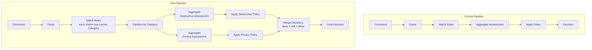
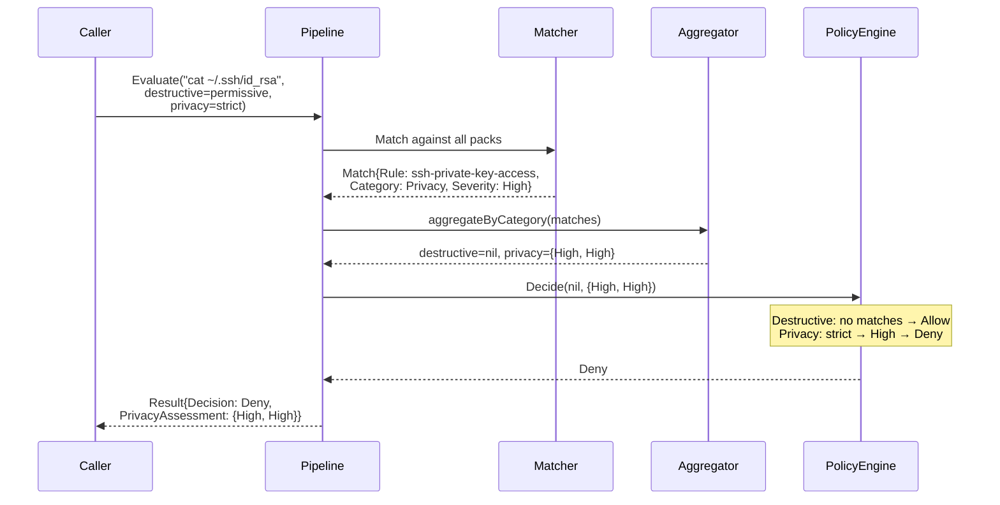

# Rule Categories: Destructive vs Privacy — Design Doc

**Status**: Draft
**Author**: dcg-scheduler
**Date**: 2026-03-06

---

## 1. Problem Statement

Currently, all rules in dcg-go are treated as a single dimension of "destructive
risk." The pipeline produces one Assessment (severity + confidence), applies one
Policy, and returns one Decision. However, rules actually fall into two distinct
categories:

- **Destructive**: Causes data loss, service disruption, or irreversible changes
  (e.g., `rm -rf /`, `DROP TABLE`, `git push --force`, `terraform destroy`)
- **Privacy**: Exposes sensitive data, reads private information, or enables
  exfiltration (e.g., `cat ~/.ssh/id_rsa`, `security find-generic-password`,
  reading browser history, AppleScript sending messages)

Users want to configure these independently. A common desired mode is
**privacy-strict + destructive-permissive** — "I'm comfortable with destructive
commands (I know what I'm doing) but I want to be warned about anything touching
private data."

## 2. Data Analysis

An audit of all rules across all packs shows a clean separation. Counts are
derived from the per-pack breakdown below (the authoritative source); a CI
validation test (see §7) must enforce these counts against the live registry
to prevent drift.

| Category | Count | Examples |
|----------|-------|----------|
| Purely Destructive | 114 | rm -rf, DROP TABLE, git push --force, k8s delete, terraform destroy |
| Purely Privacy | 8 | SSH key access, keychain read, Messages DB access, personal file reads |
| Both | 18 | csrutil disable, osascript send-message, diskutil erase, nvram operations |

The "both" cases are concentrated in macOS system/communication packs where
commands can simultaneously weaken security protections AND expose/exfiltrate data.

### Per-Pack Breakdown

| Pack | Destructive | Privacy | Both |
|------|-------------|---------|------|
| core.git | 22 | 0 | 0 |
| core.filesystem | 13 | 0 | 0 |
| database.* (all 5) | 35 | 0 | 0 |
| infrastructure.* | 9 | 0 | 0 |
| cloud.* | 4 | 0 | 0 |
| kubernetes.* | 6 | 0 | 0 |
| containers.* | 2 | 0 | 0 |
| frameworks | 7 | 0 | 0 |
| remote.rsync | 1 | 0 | 0 |
| secrets.vault | 5 | 0 | 0 |
| platform.github | 3 | 0 | 0 |
| personal.files | 3 | 2 | 0 |
| personal.ssh | 1 | 1 | 0 |
| macos.privacy | 0 | 5 | 0 |
| macos.system | 2 | 0 | 10 |
| macos.communication | 1 | 0 | 8 |

The separation is extremely clean. Most packs are 100% one category.

### The "Both" Case

The bitmask model (`CategoryBoth = CategoryDestructive | CategoryPrivacy`)
handles rules that span both dimensions without information loss at the
category membership level — a "both" match enters both aggregation lanes
and is evaluated against both policies.

The remaining limitation is that each rule has a single severity/confidence
value, not per-dimension scoring. In practice, the ~18 "both" rules are nearly
all Critical severity (disabling SIP, erasing disks, sending messages via
AppleScript), so a single severity is sufficient — these commands are Critical
regardless of which dimension you evaluate them in.

## 3. High-Level Design

### 3.1 Architecture Overview



### 3.2 Decision Merge Semantics

When a command triggers matches in both categories, the decisions are merged:

1. **Deny** if either lane denies
2. **Ask** if either lane asks (and neither denies)
3. **Allow** only if both lanes allow

This is conservative — the strictest decision wins.

### 3.3 Explanation Precedence

When the final decision is driven by one lane but both lanes produced matches,
the reason/remediation text must come from the lane(s) that determined the
final decision:

1. If one lane **Deny** and the other **Allow** → report matches from the
   denying lane as the primary reason.
2. If both lanes produce the same decision → report the match with the highest
   severity across both lanes (tie-break: destructive first).
3. All matches from both lanes are always included in `Result.Matches` for
   full visibility — this precedence only affects the primary reason string
   in hook output (§4.9).

### 3.4 Result Reporting

The Result struct gains per-category assessments so callers can see why a
decision was made in each dimension. The existing single `Assessment` field
is kept for backward compatibility (set to the max of both categories).

## 4. Detailed Design

### 4.1 New Types in `internal/evalcore`

```go
// RuleCategory identifies whether a rule guards against destructive operations,
// privacy violations, or both. Implemented as a bitmask.
type RuleCategory uint8

const (
    CategoryDestructive RuleCategory = 1 << iota  // 0b01
    CategoryPrivacy                                // 0b10
    CategoryBoth = CategoryDestructive | CategoryPrivacy  // 0b11
)

func (c RuleCategory) String() string {
    switch c {
    case CategoryDestructive:
        return "Destructive"
    case CategoryPrivacy:
        return "Privacy"
    case CategoryBoth:
        return "Both"
    default:
        return "Unknown"
    }
}

func (c RuleCategory) HasDestructive() bool { return c&CategoryDestructive != 0 }
func (c RuleCategory) HasPrivacy() bool     { return c&CategoryPrivacy != 0 }
```

### 4.2 Rule Struct Changes (`internal/packs`)

```go
type Rule struct {
    ID           string
    Category     evalcore.RuleCategory  // NEW — defaults to CategoryDestructive
    Severity     int
    Confidence   int
    Reason       string
    Remediation  string
    EnvSensitive bool
    Match        MatchFunc
}
```

Rules with `Category == 0` (unset) are treated as `CategoryDestructive` during
migration. See §4.10 for the mandatory normalization point that prevents
fail-open bugs.

### 4.3 Match Struct Changes (`internal/evalcore`)

```go
type Match struct {
    Pack         string
    Rule         string
    Category     RuleCategory   // NEW
    Severity     Severity
    Confidence   Confidence
    Reason       string
    Remediation  string
    EnvEscalated bool
}
```

### 4.4 Result Struct Changes (`internal/evalcore`)

```go
type Result struct {
    Decision              Decision
    Assessment            *Assessment       // Max of both categories (backward compat)
    DestructiveAssessment *Assessment       // NEW — nil if no destructive matches
    PrivacyAssessment     *Assessment       // NEW — nil if no privacy matches
    Matches               []Match
    Warnings              []Warning
    Command               string
}
```

### 4.5 Policy Configuration Changes

#### `internal/evalcore` — PolicyConfig (NEW)

```go
// PolicyConfig holds separate policies for each rule category.
type PolicyConfig struct {
    DestructivePolicy Policy
    PrivacyPolicy     Policy
}

// Decide applies the appropriate policy for each category assessment,
// then merges decisions (deny > ask > allow).
func (pc PolicyConfig) Decide(destructive, privacy *Assessment) Decision {
    dDec := Allow
    pDec := Allow
    if destructive != nil && pc.DestructivePolicy != nil {
        dDec = pc.DestructivePolicy.Decide(*destructive)
    }
    if privacy != nil && pc.PrivacyPolicy != nil {
        pDec = pc.PrivacyPolicy.Decide(*privacy)
    }
    // Merge: deny > ask > allow
    if dDec == Deny || pDec == Deny {
        return Deny
    }
    if dDec == Ask || pDec == Ask {
        return Ask
    }
    return Allow
}
```

#### `internal/eval` — Config Changes

```go
type Config struct {
    Policy             Policy    // Legacy single policy (backward compat)
    DestructivePolicy  Policy    // NEW — overrides Policy for destructive rules
    PrivacyPolicy      Policy    // NEW — overrides Policy for privacy rules
    Allowlist          []string
    Blocklist          []string
    EnabledPacks       []string
    DisabledPacks      []string
    CallerEnv          []string
}
```

When `DestructivePolicy` or `PrivacyPolicy` are nil, they fall back to `Policy`.
This ensures full backward compatibility — existing callers that only set
`Policy` get the same behavior as today.

### 4.6 Pipeline Changes (`internal/eval`)

The `aggregate` function becomes category-aware:

```go
func aggregateByCategory(matches []Match) (destructive, privacy *Assessment) {
    var dMatches, pMatches []Match
    for _, m := range matches {
        if m.Category.HasDestructive() {
            dMatches = append(dMatches, m)
        }
        if m.Category.HasPrivacy() {
            pMatches = append(pMatches, m)
        }
    }
    if len(dMatches) > 0 {
        a := aggregate(dMatches)
        destructive = &a
    }
    if len(pMatches) > 0 {
        a := aggregate(pMatches)
        privacy = &a
    }
    return
}
```

In `Pipeline.Run()`, after matching:

```go
dAgg, pAgg := aggregateByCategory(result.Matches)
result.DestructiveAssessment = dAgg
result.PrivacyAssessment = pAgg

// Backward-compat: overall assessment is max of both
result.Assessment = maxAssessment(dAgg, pAgg)

// Apply per-category policies
dPolicy := cfg.DestructivePolicy
if dPolicy == nil { dPolicy = cfg.Policy }
pPolicy := cfg.PrivacyPolicy
if pPolicy == nil { pPolicy = cfg.Policy }

pc := PolicyConfig{DestructivePolicy: dPolicy, PrivacyPolicy: pPolicy}
result.Decision = pc.Decide(dAgg, pAgg)
```

### 4.7 Public API Changes (`guard` package)

New option functions:

```go
func WithDestructivePolicy(p Policy) Option {
    return func(c *evalConfig) { c.destructivePolicy = p }
}

func WithPrivacyPolicy(p Policy) Option {
    return func(c *evalConfig) { c.privacyPolicy = p }
}
```

### 4.8 CLI / Config Changes

The YAML config gains optional per-category policy fields:

```yaml
# Legacy (still works, applies to both categories):
policy: interactive

# New per-category overrides:
destructive_policy: permissive
privacy_policy: strict
```

The `parsePolicy` function already exists and handles string-to-Policy
conversion. The config struct and `toOptions()` method are extended to support
the new fields.

When per-category policies are set, they override the base `policy` for their
respective category. When only `policy` is set, it applies to both (backward
compat).

### 4.9 Hook Output Changes

The `buildReason` function should include the rule category in the reason string
so the caller knows why a command was flagged. When both lanes produce matches,
the primary reason is selected according to the explanation precedence rules
in §3.3 (the lane that determined the final decision takes priority):

```
"[privacy] SSH private key access detected. Suggestion: use ssh-add instead"
"[destructive] Force push overwrites remote history. Suggestion: use --force-with-lease"
```

When a "both" rule triggers and both lanes contribute to the decision, the
category prefix should be `[destructive+privacy]`.

### 4.10 Match Propagation and Category Normalization

**Mandatory normalization**: When constructing Match objects from rule matches,
a zero `Category` **must** be normalized to `CategoryDestructive` before the
match enters the pipeline. This is the single normalization point — without it,
a zero-category match would pass through `HasDestructive()` and `HasPrivacy()`
returning false, enter neither aggregation lane, and resolve to `Allow` despite
a matched rule (fail-open).

```go
cat := evalcore.RuleCategory(rule.Category)
if cat == 0 {
    cat = evalcore.CategoryDestructive
}
result.Matches = append(result.Matches, Match{
    Pack:         pack.ID,
    Rule:         rule.ID,
    Category:     cat,
    Severity:     Severity(sev),
    Confidence:   Confidence(rule.Confidence),
    Reason:       rule.Reason,
    Remediation:  rule.Remediation,
    EnvEscalated: envEscalated,
})
```

A regression test must verify that a rule with `Category == 0` is treated as
`CategoryDestructive` and does not bypass both aggregation lanes (see §7).

## 5. Migration Plan

### 5.1 Rule Tagging

Every existing rule gets a `Category` field. Based on the audit:

1. **Default to `CategoryDestructive`** — this covers 105/141 rules correctly
   with zero changes.
2. **Explicitly tag privacy rules** — ~20 rules across personal.files,
   personal.ssh, macos.privacy packs.
3. **Explicitly tag "both" rules** — ~16 rules in macos.system,
   macos.communication packs.

This is a straightforward, mechanical change. A validation test should be added
to ensure every rule has a non-zero category.

### 5.2 Backward Compatibility

This change is **behavior-compatible and additive**:

- `Config.Policy` (single policy) continues to work exactly as before.
- Per-category policies are opt-in via new fields.
- `Result.Assessment` (single) is always populated with the max of both
  categories for callers that don't use the new per-category assessments.
- Existing tests remain valid without modification (they use single Policy).

**Source and wire-format caveats**: Adding fields to `Match` and `Result`
structs can break downstream consumers that use unkeyed struct literals
(`Match{"pack", "rule", ...}`) or strict snapshot assertions over serialized
(JSON/TSV) result payloads. Migration notes:

- Callers using unkeyed struct literals must switch to keyed literals.
- JSON consumers should use lenient deserialization that ignores unknown fields
  (the standard `encoding/json` behavior).
- Golden file / snapshot assertions will need regeneration (see §5.3).

### 5.3 Golden File Updates

Golden files include match data. The Match struct gains a Category field, so
golden files will need regeneration. This is mechanical — run the golden update
tool.

## 6. Package / Import Structure

No new packages needed. Changes are additive within existing packages:

```
internal/evalcore/    ← RuleCategory type, PolicyConfig, updated Match/Result
internal/packs/       ← Rule.Category field
internal/eval/        ← aggregateByCategory, updated Pipeline.Run, updated Config
guard/                ← WithDestructivePolicy, WithPrivacyPolicy options
cmd/dcg-go/           ← Config.DestructivePolicy/PrivacyPolicy, updated buildReason
```

Import flow is unchanged — no new cycles.

## 7. Testing Strategy

### Unit Tests

- `internal/evalcore`: RuleCategory bitmask operations, PolicyConfig.Decide
  with all combinations (destructive-only, privacy-only, both, neither),
  decision merge semantics, explanation precedence (§3.3).
- `internal/eval`: `aggregateByCategory` with mixed-category matches. Pipeline
  tests with per-category policies producing different decisions. **Zero-category
  regression test**: a rule with `Category == 0` must be normalized to
  `CategoryDestructive` and must not bypass both aggregation lanes (P0 fix).
- `guard`: Option tests for `WithDestructivePolicy`, `WithPrivacyPolicy`.
- `cmd/dcg-go`: Config parsing with per-category policy fields. `buildReason`
  includes category prefix. Test conflicting-lane cases where the primary
  reason must come from the deciding lane.

### Integration Tests

- Full pipeline with `privacy-strict + destructive-permissive`:
  - `rm -rf /tmp/foo` → Allow (destructive-permissive allows medium)
  - `cat ~/.ssh/id_rsa` → Deny (privacy-strict denies medium+)
  - `osascript -e 'tell application "Messages" to send...'` → Deny (both
    categories, privacy-strict denies)
- Conflicting-lane explanation test: command triggers destructive-High (Ask)
  and privacy-Medium (Allow under permissive privacy). Verify the primary
  reason references the destructive lane.

### Validation Tests

- Registry validation: every rule has non-zero Category after normalization.
- **CI category-count validation**: a test that queries the live rule registry,
  counts rules per category, and asserts against an approved baseline. This
  prevents category drift when rules are added/removed. The baseline should be
  stored as a checked-in file (e.g., `testdata/category-baseline.json`) and
  updated explicitly when rule counts change intentionally.

### Golden File Updates

Regenerate all golden files after adding Category to Match. Verify diffs are
only the added field.

## 8. Sequence Diagram: Dual-Policy Evaluation



## 9. Open Questions

1. **Should the "test" CLI mode show categories?** Likely yes — the `dcg-go test`
   output should include the category of each match. Low complexity to add.

2. **Should `dcg-go packs` show category distribution?** Would be useful for
   users understanding what a pack covers. Could show counts per category.

3. **Future: more granular categories?** The bitmask approach naturally extends
   if we ever need categories beyond destructive/privacy (e.g., "network",
   "system-config"). Not proposing this now, but the design doesn't preclude it.

---

## Appendix: Rule Category Assignments

Rules requiring explicit non-default category tagging (all others default to
`CategoryDestructive`). **This list must be verified against the live registry
at implementation time** — the CI validation test (§7) is the authoritative
source of truth post-merge.

### CategoryPrivacy

| Pack | Rule ID |
|------|---------|
| personal.ssh | ssh-private-key-access |
| personal.files | personal-files-access |
| macos.privacy | keychain-read-password |
| macos.privacy | keychain-dump |
| macos.privacy | messages-db-access |
| macos.privacy | private-data-access |
| macos.privacy | spotlight-search |

### CategoryBoth

| Pack | Rule ID |
|------|---------|
| macos.system | csrutil-disable |
| macos.system | diskutil-erase |
| macos.system | launchctl-remove |
| macos.system | nvram-clear |
| macos.system | nvram-write |
| macos.system | nvram-delete |
| macos.system | spctl-disable |
| macos.system | dscl-delete |
| macos.system | fdesetup-disable |
| macos.system | systemsetup-modify |
| macos.communication | osascript-send-message |
| macos.communication | osascript-send-email |
| macos.communication | osascript-system-events |
| macos.communication | osascript-sensitive-app |
| macos.communication | shortcuts-run |
| macos.communication | automator-run |
| macos.communication | open-terminal |
| macos.communication | osascript-jxa-catchall |

## Review Disposition

| # | Reviewer | Severity | Summary | Disposition | Notes |
|---|----------|----------|---------|-------------|-------|
| 1 | 06-rule-categories-review | P0 | Zero `Category` fail-open during migration | Incorporated | §4.2, §4.10 add mandatory normalization; §7 adds regression test |
| 2 | 06-rule-categories-review | P1 | Backward-compat claim overstated for struct literals / snapshots | Incorporated | §5.2 reworded to "behavior-compatible, additive API" with migration notes |
| 3 | 06-rule-categories-review | P1 | Inventory counts inconsistent with appendix | Incorporated | §2 counts fixed to match per-pack table; §7 adds CI baseline validation |
| 4 | 06-rule-categories-review | P2 | No winning-lane explanation semantics | Incorporated | §3.3 added explanation precedence rules; §4.9 updated |
| 5 | 06-rule-categories-review | P3 | "Both" info-loss narrative conflicts with bitmask model | Incorporated | §2 subsection rewritten to reflect bitmask model |
