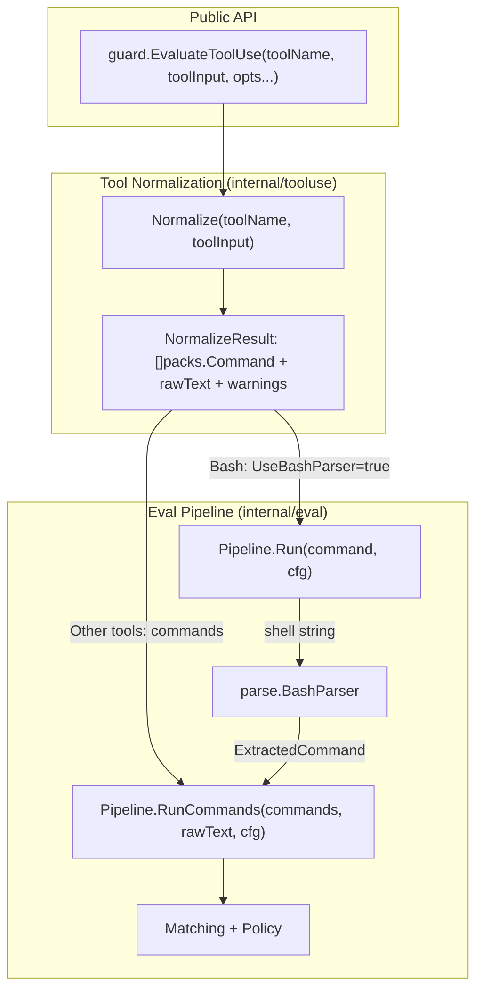

# 07: Tool Use Evaluation

**Depends On**: [04-api-and-cli](./04-api-and-cli.md)
**Architecture**: [00-architecture.md](./00-architecture.md)

---

## 1. Summary

DCG currently only evaluates Bash tool calls. When used as a Claude Code
PreToolUse hook, non-Bash tools (Read, Write, Edit, Grep, Glob, Agent,
etc.) pass through unevaluated, falling through to Claude Code's built-in
permission dialog. This plan extends DCG to evaluate all tool types by
normalizing structured tool inputs into the same `packs.Command` structs
that the existing matching pipeline already consumes.

**Key design principle**: No new matcher types, no new pack rules, no
changes to existing pack definitions. Tool inputs are normalized into
equivalent shell commands and fed through the same pipeline. A Read of
`~/.ssh/id_rsa` triggers the same privacy rules as `cat ~/.ssh/id_rsa`.

### What changes

1. **`guard.EvaluateToolUse()`** — Single public entry point that accepts a
   tool name and structured input (map). For Bash, extracts the command
   string and runs it through the full tree-sitter parser. For file-based
   tools, normalizes to equivalent shell commands and evaluates those.
2. **`guard.Evaluate()`** — Removed. Replaced by `EvaluateToolUse()`.
   All callers (h2 hook handler, CLI test command, CLI hook mode) migrate
   to the new entry point.
3. **`internal/tooluse/`** — New package with normalization logic:
   tool input → `[]packs.Command`.
4. **`internal/eval.Pipeline.RunCommands()`** — New method extracted from
   `Pipeline.Run()` that accepts pre-built `[]packs.Command`, skipping
   the shell parser. `Run()` refactored to call `RunCommands()` internally.
5. **CLI `dcg-go test`** — Accepts `--tool` flag. Bare string argument
   with no `--tool` flag implies Bash. With `--tool`, the positional arg
   is parsed as JSON tool input.
6. **CLI `dcg-go` hook mode** — Evaluates all tool types, not just Bash.

### What doesn't change

- Pack definitions, matcher types, rule definitions
- Policy types and configuration
- Config file format
- Pre-filter / keyword index (tool use path runs the pre-filter against
  the synthetic `RawText`, same as Bash)

---

## 2. Architecture

### Evaluation flow



### Tool normalization mapping

Each tool type maps to one or more equivalent shell commands:

| Tool | Input fields | Normalized command |
|------|-------------|-------------------|
| Bash | `command` | Pass through to parser (existing path) |
| Read | `file_path` | `cat <file_path>` |
| Write | `file_path`, `content` | `tee <file_path>` |
| Edit | `file_path` | `sed -i <file_path>` |
| Grep | `pattern`, `path` | `grep <pattern> <path>` |
| Glob | `pattern`, `path` | `find <path> -name <pattern>` |
| Agent | (any) | Allow (no evaluation) |
| WebFetch | `url` | `curl <url>` |
| WebSearch | `query` | Allow (no evaluation) |
| NotebookEdit | `file_path` | `sed -i <file_path>` |
| (unknown) | (any) | Allow (no evaluation) |

The normalized commands are not actually executed — they're constructed as
`packs.Command` structs with the appropriate `Name`, `Args`, `Flags`, and
`RawText` fields so existing matchers fire on them.

**Bash special case**: The Bash tool still goes through the full tree-sitter
parser via `Pipeline.Run()`. It contains real shell syntax (pipes, subshells,
variable expansion, etc.) that the parser handles. Non-Bash tools produce
simple single-command structs that don't need parsing.

### Error handling: indeterminate instead of fail-open

When the Bash parser encounters input it can't fully parse (syntax errors,
unsupported constructs), `Pipeline.Run()` does NOT auto-allow. Instead it
sets both assessments to `Indeterminate` severity with `Low` confidence
and applies the configured policy (`internal/eval/pipeline.go` lines
112-134). With the default `InteractivePolicy`, Indeterminate maps to
`Ask`, so the user gets prompted. With `StrictPolicy`, it maps to `Deny`.

The tool use normalization path follows the same pattern. If a known tool
(Read, Write, etc.) has malformed input — missing `file_path`, wrong
field type, unexpected payload shape — the normalizer sets
`NormalizationError=true` and `EvaluateToolUse()` produces an
indeterminate result, letting policy decide.

Unknown tools (not in the dispatch table) are different — they return
`Allow` because DCG has no rules for them and cannot meaningfully evaluate
them. This is intentional: DCG should only gate tools it understands.

### Why synthesize shell commands instead of a new matcher system?

The existing pack rules (especially `personal.files`, `personal.ssh`,
`macos.privacy`) match on file paths using matchers like `ArgContentRegex`,
`RawTextContains`, and `AnyName()`. These matchers operate on `packs.Command`
which has `Name`, `Args`, `Flags`, and `RawText`. By synthesizing commands
with appropriate names and args, we get all existing privacy and destructive
rules for free — no rule changes needed.

A new matcher system would require duplicating every path-based rule with a
"tool use" variant. That's fragile (rules drift apart) and unnecessary.

---

## 3. Package structure

```
internal/tooluse/
  normalize.go          # Normalize() function, per-tool mappers
  normalize_test.go     # Unit tests for each tool type mapping
```

No other new packages. Changes to existing packages:

- `internal/eval/pipeline.go` — Extract `RunCommands()` from `Run()`
- `guard/guard.go` — Replace `Evaluate()` with `EvaluateToolUse()`
- `guard/option.go` — No changes (same options work)
- `cmd/dcg-go/test.go` — Add `--tool` flag, update to use `EvaluateToolUse()`
- `cmd/dcg-go/hook.go` — Remove Bash-only filter, pass all tools through

---

## 4. Detailed design

### 4.1 Tool catalog

All known tool definitions live in a single file:
`internal/tooluse/catalog.go`

This is the single source of truth for tool names, their input field
names, and how they map to synthetic shell commands. Adding support for
a new Claude Code tool means adding one entry here.

```go
package tooluse

// ToolDef defines how a Claude Code tool maps to a synthetic shell command.
type ToolDef struct {
    // ToolName is the Claude Code tool name (e.g. "Read", "Write").
    ToolName string
    // SyntheticCommand is the shell command name to synthesize (e.g. "cat", "tee").
    SyntheticCommand string
    // PathField is the tool_input field containing the primary file path.
    // Empty if the tool has no file path (e.g. WebSearch).
    PathField string
    // ExtraFields lists additional tool_input fields to include as args
    // (e.g. "pattern" for Grep). Order matters — they become positional args
    // before the path.
    ExtraFields []string
    // Flags are synthetic flags to add to the command (e.g. "-i" for Edit → sed).
    Flags map[string]string
    // NoEval means this tool is known but has no security-relevant inputs
    // to evaluate (e.g. Agent, WebSearch). Returns Allow with no matching.
    NoEval bool
}

var Catalog = []ToolDef{
    {ToolName: "Read",         SyntheticCommand: "cat",  PathField: "file_path"},
    {ToolName: "Write",        SyntheticCommand: "tee",  PathField: "file_path"},
    {ToolName: "Edit",         SyntheticCommand: "sed",  PathField: "file_path", Flags: map[string]string{"-i": ""}},
    {ToolName: "Grep",         SyntheticCommand: "grep", PathField: "path", ExtraFields: []string{"pattern"}},
    {ToolName: "Glob",         SyntheticCommand: "find", PathField: "path", ExtraFields: []string{"pattern"}},
    {ToolName: "NotebookEdit", SyntheticCommand: "sed",  PathField: "file_path", Flags: map[string]string{"-i": ""}},
    {ToolName: "WebFetch",     SyntheticCommand: "curl", PathField: "url"},
    {ToolName: "Agent",        NoEval: true},
    {ToolName: "WebSearch",    NoEval: true},
}
```

The `Normalize()` function looks up the tool name in the catalog. If found,
it uses the definition to extract fields and build the synthetic command.
If not found, the tool is unknown (allow — DCG has no rules for it).

### 4.2 `internal/tooluse.Normalize()` (uses catalog)

```go
package tooluse

import "github.com/dcosson/destructive-command-guard-go/internal/packs"

type NormalizeResult struct {
    // Commands to evaluate. Empty means "allow, nothing to check" (for
    // unknown tools) or "normalization failed" (check NormalizationError).
    Commands []packs.Command
    // RawText is the full synthetic command string (e.g. "cat /path/to/file")
    // used for blocklist/allowlist glob matching, pre-filter keyword scanning,
    // and RawTextContains/RawTextRegex matchers. Must be a complete command
    // string, not just a path fragment, to preserve consistency with Bash
    // evaluation.
    RawText  string
    // Warnings from normalization (e.g. missing expected fields).
    Warnings []Warning
    // NormalizationError is true when a known tool has malformed or
    // incomplete input. EvaluateToolUse produces an indeterminate
    // assessment and lets policy decide (matching Bash parse-error behavior).
    NormalizationError bool
    // UseBashParser indicates the Bash tool should go through the full
    // tree-sitter parser instead of the synthesized command path.
    UseBashParser bool
    // BashCommand is the raw command string for Bash tool (when UseBashParser is true).
    BashCommand   string
    // CommandSummary is a human-readable description of the tool use
    // (e.g. "Read(/Users/me/.ssh/id_rsa)") for Result.Command.
    CommandSummary string
}

func Normalize(toolName string, toolInput map[string]any) NormalizeResult
```

The function dispatches on `toolName` to per-tool normalizer functions.
Unknown tools return an empty `Commands` slice (allow).

For each file-based tool, the normalizer:
1. Extracts the relevant path field from `toolInput`
2. Builds a `packs.Command` with the synthetic command name and path as an arg
3. Sets `RawText` to the full synthetic command string (e.g. `cat /path/to/file`)
   so that blocklist/allowlist globs and `RawTextContains`/`RawTextRegex` matchers
   work consistently with the Bash evaluation path
4. Sets `CommandSummary` to a human-readable form like `Read(/path/to/file)`

Path extraction handles both string values and missing/nil fields gracefully.

**Normalization error handling**: Known tools with malformed or incomplete
input (missing required fields, wrong types, unexpected payload shapes)
must NOT fail open to allow. Instead, the normalizer sets a
`NormalizationError` flag on the result, and `EvaluateToolUse()` produces
an indeterminate assessment and lets policy decide — matching how
`Pipeline.Run()` handles unparseable Bash commands today. This prevents
a future payload schema change or malformed input from silently bypassing
evaluation. Unknown tools (not in the normalization dispatch table) still
return allow, since DCG has no rules for them.

### 4.2 `internal/eval.Pipeline` refactor

Current `Pipeline.Run()` does:
1. Blocklist/allowlist check (on raw command string)
2. Pre-filter keyword scan
3. Parse shell command → `[]ExtractedCommand`
4. Convert to `[]packs.Command` via `toPackCommand()`
5. Match against pack rules
6. Aggregate + policy decision

Extract steps 5-6 into `RunCommands()`:

```go
// RunCommands evaluates pre-built commands against registered rules.
// Used by EvaluateToolUse for non-Bash tools that skip shell parsing.
func (p *Pipeline) RunCommands(commands []packs.Command, rawText string, cfg Config) Result
```

`Run()` is refactored to call `RunCommands()` internally after parsing.

`RunCommands()` reuses the same blocklist/allowlist, pre-filter, and
`RawText*` matcher behavior as `Run()`:
- **Blocklist/allowlist**: Glob-matched against `RawText` (the full
  synthetic command string, e.g. `cat ~/.ssh/id_rsa`). A blocklist
  pattern like `cat *` will match a Read tool use the same way it
  matches `cat` in a Bash command.
- **Pre-filter**: Keyword scan runs against `RawText` to select
  candidate packs, same as Bash.
- **RawTextContains/RawTextRegex matchers**: Work against `RawText`
  on each `packs.Command`, same as Bash.

### 4.3 `guard.EvaluateToolUse()`

```go
func EvaluateToolUse(toolName string, toolInput map[string]any, opts ...Option) Result {
    cfg := buildConfig(opts)
    norm := tooluse.Normalize(toolName, toolInput)

    if norm.UseBashParser {
        // Bash tool: full parser path
        return getPipeline().Run(norm.BashCommand, cfg.toInternal())
    }

    // Known tool with malformed input: indeterminate, let policy decide.
    // This matches how Pipeline.Run() handles unparseable Bash commands —
    // it sets Indeterminate severity with Low confidence and applies the
    // configured policy. With the default InteractivePolicy, Indeterminate
    // maps to Ask, so the user gets prompted rather than the command being
    // silently allowed or denied.
    if norm.NormalizationError {
        indeterminate := &Assessment{
            Severity:   Indeterminate,
            Confidence: ConfidenceLow,
        }
        pc := PolicyConfig{
            DestructivePolicy: cfg.destructivePolicy,
            PrivacyPolicy:     cfg.privacyPolicy,
        }
        return Result{
            Decision:              pc.Decide(indeterminate, indeterminate),
            DestructiveAssessment: indeterminate,
            PrivacyAssessment:     indeterminate,
            Command:               norm.CommandSummary,
            Warnings:              convertWarnings(norm.Warnings),
        }
    }

    if len(norm.Commands) == 0 {
        // Unknown tool — no rules exist, allow.
        return Result{Decision: Allow, Command: norm.CommandSummary}
    }

    result := getPipeline().RunCommands(norm.Commands, norm.RawText, cfg.toInternal())
    result.Command = norm.CommandSummary
    result.Warnings = append(result.Warnings, convertWarnings(norm.Warnings)...)
    return result
}
```

### 4.4 `guard.Evaluate()` removal

The existing `Evaluate(command string, opts ...Option) Result` is removed.
All callers migrate to `EvaluateToolUse("Bash", map[string]any{"command": command}, opts...)`.

Callers to update:
- `cmd/dcg-go/test.go` — CLI test command
- `cmd/dcg-go/hook.go` — CLI hook mode
- h2 `handle_hook.go` — already needs updating (separate repo)
- `guard/guard_test.go` — test suite
- `internal/integration/` — integration tests

### 4.5 CLI `dcg-go test` changes

New flag:
- `--tool <name>` — Tool name (default: "Bash")

The positional argument is the tool input. For Bash (the default), it's
the command string. For other tools, it's a JSON object:

- `dcg-go test "rm -rf /"` → `EvaluateToolUse("Bash", {"command": "rm -rf /"})`
- `dcg-go test --tool Read '{"file_path":"/root/.ssh/id_rsa"}'` → `EvaluateToolUse("Read", {"file_path": "/root/.ssh/id_rsa"})`
- `dcg-go test --tool Bash "rm -rf /"` → same as no `--tool` flag

For Bash, the positional arg is wrapped as `{"command": arg}`. For all
other tools, the positional arg is parsed as JSON.

The `Command:` line in human output shows:
- For Bash: the command string (as today)
- For other tools: `ToolName(key=value, ...)` summary

### 4.6 CLI `dcg-go` hook mode changes

In `hook.go`, remove the Bash-only guard:

```go
// Before:
if input.ToolName != "Bash" {
    fmt.Fprintln(cmd.OutOrStdout(), "{}")
    return nil
}

// After:
result := guard.EvaluateToolUse(input.ToolName, toolInputMap, opts...)
```

The hook mode changes `HookInput.ToolInput` from a fixed struct (which
only captures Bash fields like `command`) to `json.RawMessage`. This is
decoded to `map[string]any` once in `runHookMode` and passed to
`EvaluateToolUse()`. This ensures non-Bash fields like `file_path`,
`pattern`, `path`, and `url` survive JSON unmarshalling.

### 4.7 Result.Command field

For Bash, `Result.Command` continues to be the raw command string (set by
`Pipeline.Run()` as today).

For other tools, `Result.Command` is the `CommandSummary` from normalization:
`Read(/Users/me/.ssh/id_rsa)`, `Write(/tmp/output.txt)`, `Grep(pattern, /path)`,
or just the tool name for tools with no meaningful summary.

---

## 5. Testing

### Unit tests

**`internal/tooluse/normalize_test.go`** — in `make test`

Test each tool type mapping:
- Read with valid path → `cat` command with correct args
- Read with missing file_path → empty commands + warning
- Write with valid path → `tee` command
- Edit with valid path → `sed -i` command
- Grep with pattern and path → `grep` command
- Glob with pattern and path → `find` command
- Bash → UseBashParser=true with command string
- Unknown tool → empty commands (allow)
- Known tool with missing required fields → NormalizationError=true
- Known tool with wrong field types (e.g. file_path is int) → NormalizationError=true
- Known tool with unexpected extra fields → still works (ignored)
- Nil/empty toolInput → NormalizationError for known tools, allow for unknown
- RawText is a full synthetic command string, not just a path
- CommandSummary is set correctly for each tool type

**`internal/eval/pipeline_test.go`** — in `make test`

- `RunCommands()` with pre-built commands matches rules correctly
- `RunCommands()` respects blocklist/allowlist on rawText
- `Run()` still works identically (regression)

**`guard/guard_test.go`** — in `make test`

- `EvaluateToolUse("Bash", {"command": "rm -rf /"})` produces same result
  as old `Evaluate("rm -rf /")` did
- `EvaluateToolUse("Read", {"file_path": "~/.ssh/id_rsa"})` triggers privacy rules
- `EvaluateToolUse("Write", {"file_path": "~/Documents/x"})` triggers privacy rules
- `EvaluateToolUse("UnknownTool", {})` returns Allow
- `EvaluateToolUse("Read", {})` (missing file_path) returns indeterminate/policy-driven
- `EvaluateToolUse("Read", {"file_path": 123})` (wrong type) returns indeterminate
- `Result.Command` is set correctly for each tool type
- Blocklist/allowlist behavior matches between Bash and equivalent tool use
  (e.g. blocklist `cat *` blocks both `Evaluate("cat foo")` and
  `EvaluateToolUse("Read", {"file_path": "foo"})`)

**`cmd/dcg-go/test_test.go`** — in `make test`

- `--tool Read '{"file_path":"~/.ssh/id_rsa"}'` returns expected decision
- `--tool Bash "ls -la"` same as bare `"ls -la"`
- Non-Bash tool with non-JSON positional arg returns error

**`cmd/dcg-go/hook_test.go`** — in `make test`

- Non-Bash PreToolUse payload evaluated (not passed through)
- Read tool with sensitive path returns deny/ask
- Unknown tool returns allow
- Non-Bash tool_input fields (file_path, pattern, path, url) survive
  JSON unmarshalling and reach evaluation (decode-level regression test)

### External / black-box tests

**`tests/external/binary_test.go`** — in `make test-external`

- Binary handles `--tool Read` flag
- Binary hook mode evaluates non-Bash tools

---

## 6. Implementation order

1. **`internal/tooluse/normalize.go`** + tests — pure function, no dependencies
2. **`internal/eval/pipeline.go`** refactor — extract `RunCommands()`, keep `Run()` working
3. **`guard/guard.go`** — replace `Evaluate()` with `EvaluateToolUse()`
4. **Update all callers** — test command, hook mode, guard tests, integration tests
5. **`cmd/dcg-go/test.go`** — add `--tool` flag
6. **`cmd/dcg-go/hook.go`** — remove Bash-only filter, pass all tools

Steps 1-3 are the core. Steps 4-6 are the caller migration and CLI surface.

---

## 7. h2 integration (separate repo)

After this plan is implemented in dcg-go, the h2 changes are minimal:

- `handle_hook.go` `handleDCGPreToolUse()` — remove the
  `if input.ToolName != "Bash"` check, extract tool_input as
  `map[string]any`, call `guard.EvaluateToolUse()` instead of
  `guard.Evaluate()`
- Release new dcg-go version, update h2's go.mod

This is a ~10 line change in h2 since all the logic lives in dcg-go.
